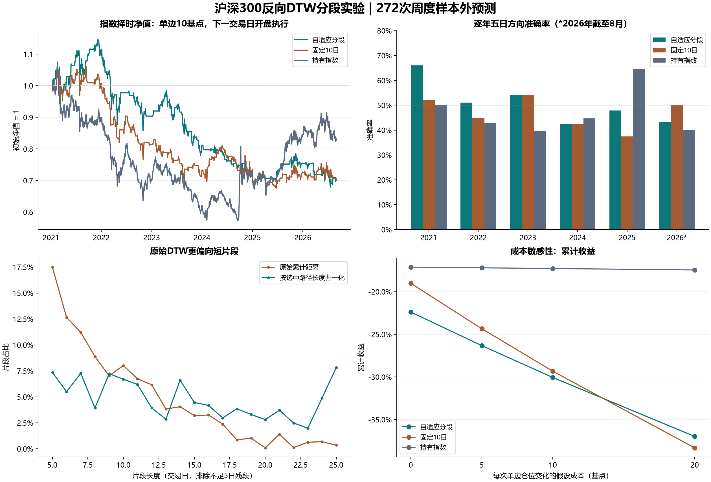
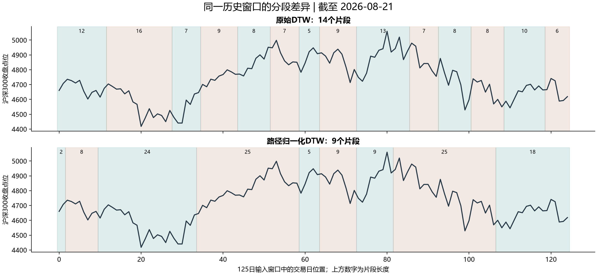

# 方法测试报告：沪深300反向DTW自适应分段

生成日期：2026-09-09。状态：**核心分段实验已完成；原文完整组合尚未复现。**

本轮没有得到“自适应分段能稳定改善预测、形成可用择时收益”的充分证据。路径归一化自适应分段准确率为 **51.47%（140/272）**，固定10日为 **46.69%（127/272）**；差值 **+4.78个百分点**，8周区块bootstrap的95%区间为 **[-1.47，+11.40]个百分点**，p=**0.1526**。预测误差与下一开盘执行的净收益均没有优于固定10日。该结论适用于下述已实现的代理实验，不能据此判定原文57.81%为真或为假。

## 1. 论文核对与本次实现边界

原文组合是自建形态库 + 反向DTW分段 + Kronos tokenizer + Crossformer + 六维OHLCAV回归。项目只有文献，没有这套组合的源码、checkpoint、78指数清单和逐周预测。本次将能独立测试的“分段是否提供增益”实现为受控实验。

| 原文模块 | 论文核对 | 本次实际处理 |
|---|---|---|
| GPT4FTS分段 | 第3.2节为DTW原型匹配，原文方向是向前；文章改为反向 | 实现反向贪心，逐一枚举5—25日；不宣称全局最优 |
| 形态库P0 | 作者的人工形态规则和78指数名单未公开 | 用7个明确列出的指数，DTW近似k-medoids学习8个原型；没有声称识别出头肩、三角等语义形态 |
| Kronos | 每根K线量化，不能把离散ID直接当连续数值；论文第14页预训练截至2024年6月 | 本轮未使用预训练权重，避免将其用于2021—2024年上半年的时间污染 |
| Crossformer | 固定seg_len的DSW嵌入、双阶段注意力和层级合并，变长接口不是直接替换即可 | 本轮统一使用多输出ridge，隔离分段与模型复杂度；未实现Crossformer或其简化冒名版本 |
| 预测头 | 方法论称未来5日OHLCAV；Kronos输入顺序是OHLCVA | 公共备用数据缺成交额；实际预测5日OHLCV，共25个连续输出。没有伪造amount |
| MERA / TimeMosaic | 前者包括有标签检索与专家门控；后者包括自适应粒度和分段提示调优 | 原文未称最终使用，本轮只核对设计，没有把它们并入实验 |

论文依据：[GPT4FTS第3节](https://arxiv.org/abs/2505.02880v2)、[Kronos第14页](https://arxiv.org/html/2508.02739v1)、[Crossformer官方实现](https://github.com/Thinklab-SJTU/Crossformer)、[MERA正式论文](https://doi.org/10.1145/3701716.3715513)、[TimeMosaic第4.3—4.4节](https://arxiv.org/abs/2509.19406v5)。Kronos字段／接口同时核对了[作者仓库](https://github.com/shiyu-coder/Kronos)。

**为什么这轮能回答部分问题：** 所有分段方案使用相同输入通道、标准化、输出、时间样本与训练算法，测试差异有明确归属。但这是一种线性预测器下的表示消融，不能排除非线性模型或预训练表征与分段之间的交互收益；也不能把它当作原论文逐项复现。

## 2. 数据与冻结规则

实际行情范围：**2010-01-04至2026-08-31**，沪深300共4046根日线。源为腾讯公开历史行情接口，保存32份原始响应、8份规范化数据文件、URL、获取时间和SHA-256。东方财富首次连通后持续断连；六列方案在任何预测结果计算前改为OHLCV五列，初稿保留在 `protocol_six_channel_draft.json`。

| 用途／代码 | 名称 | 可用起点 | 日线数 | 无效OHLC记录数 |
|---|---|---|---|---|
| 1.000300 | 沪深300（预测目标） | 2010-01-04 | 4046 | 1 |
| 1.000001 | 上证综指 | 2010-01-04 | 4046 | 1 |
| 1.000016 | 上证50 | 2010-01-04 | 4046 | 1 |
| 1.000905 | 中证500 | 2010-01-04 | 4046 | 1 |
| 1.000852 | 中证1000 | 2014-10-17 | 2888 | 1 |
| 0.399001 | 深证成指 | 2010-01-04 | 4046 | 1 |
| 0.399005 | 中小100 | 2010-01-04 | 4046 | 1 |
| 0.399006 | 创业板指 | 2010-06-02 | 3946 | 1 |

目标指数不参加P0库构建；其余7指数具有相关成份与共同市场因子，因此不视为7份独立市场证据。数据端点返回原始 `day` 分支，未做成份股层面的复权或指数重构。腾讯第六列按量字段使用：2010-01-04的66101080与最初收到的东方财富成交量相同；保留提供商单位，按窗口log1p标准化。AKShare腾讯包装的该列名称不能单凭字面理解成成交额。接口格式见[AKShare源代码](https://raw.githubusercontent.com/akfamily/akshare/main/akshare/index/index_stock_zh.py)。

所有序列2015-03-27各有1根OHLC关系明显错误。例如沪深300该日low=3993.032，高于open=3957.542、close=3971.697。本次不改写行情、不删除交易日；排除包含该根的125日输入或5日标签窗口，P0候选也不能跨该根。另对不超过0.011点的历史舍入差异留痕。该异常不在2021年后的测试期。未发现重复日期或缺失值。历史下载不是逐日保存的point-in-time档案，无法排除供应商事后修订。

协议保存在 [protocol.json](../protocol.json)，训练代码与协议哈希在 [run_manifest.json](run_manifest.json)，数据来源在 [manifest.json](../data/manifest.json)。看见结果后未调整分段范围、原型数、ridge网格或交易规则。

## 3. 可复现的算法与时间边界

1. P0：每个指数按5日步长取15日log-close片段，各片段独立z-score；最多固定种子抽取1200段。按路径归一化DTW做最远点初始化，再迭代3次近似medoid更新，每簇最多48个候选，得到8个真实历史片段原型。
2. 分段：从125日窗口右端向前，每次枚举5—25日，对片段独立z-score后匹配所有原型，选择最小距离。原始方案用累计L1路径距离；主方案用最小累计距离路径的总成本除以**该路径长度**。后者不是“最小平均成本DTW”的精确优化。不足5日的最左残段独立保留。
3. 表示：OHLC取log、volume取log1p；仅按当前125日已知窗口的均值和标准差变换。每段插值到5个相对位置，附加长度、结束时间位置和有效位，最多25段，右对齐零补齐，共700个输入坐标。mask在ridge中是显式特征，未声称存在注意力掩码。打乱对照保留每个窗口的分段数量和长度集合，只随机改变顺序，因而不是完全与形态无关的随机分割。
4. 预测：多输出ridge同时预测未来5日、5列。取第五日close反变换为五日收益。方向定义为预测收益>0则看涨，≤0则非上涨；真实标签同样二分。恒定零收益因此在“方向准确率”里相当于始终非上涨，不把52.57%解释成预测能力。
5. 调参：2010—2017用于初次训练，2018—2020实际星期五且完整标签落在该区间的样本用于选择惩罚系数，按五日收益RMSE最小化。候选1、10、100、1000、10000。所有最终方法共用这个网格；没有在2021年后的数据上选模型。
6. 每年初扩展训练；P0只用上一年底及更早行情，训练标签必须在上一年底完全实现。每次预测只读到当天收盘。历史训练样本可以用本次重训时已知的P0重新表示；P0不能使用本次预测之后的数据。

| 模型 | 验证集选出的ridge惩罚系数 |
|---|---|
| 固定5日 | 100 |
| 固定10日 | 100 |
| 固定20日 | 100 |
| 自适应：原始DTW | 1000 |
| 自适应：路径归一化DTW | 1000 |
| 自适应长度打乱对照 | 100 |

| 预测年 | P0／训练截止日 | 最后训练标签日 | 训练样本数 | 测试样本数 |
|---|---|---|---|---|
| 2021 | 2020-12-31 | 2020-12-31 | 2415 | 50 |
| 2022 | 2021-12-31 | 2021-12-31 | 2658 | 49 |
| 2023 | 2022-12-31 | 2022-12-30 | 2900 | 48 |
| 2024 | 2023-12-31 | 2023-12-29 | 3142 | 47 |
| 2025 | 2024-12-31 | 2024-12-31 | 3384 | 48 |
| 2026 | 2025-12-31 | 2025-12-31 | 3627 | 30 |

严格样本外预测日为 **2021-01-08至2026-08-21**，272次；最后五日标签止于2026-08-28。只使用真正星期五：周五休市时不提前到周四。节假日造成相邻五日标签重叠20次，所以主要区间用区块bootstrap；不能把272次都当作相互独立的抛硬币样本。方法设计于当前时间，早期回放属于按信息时间约束的历史研究，不代表当年已经能部署这些论文方法。

## 4. 样本外结果

RMSE按实际五日简单收益计算；表中2.74%表示0.0274的收益误差，不是价格本身误差。平衡准确率为上涨召回与非上涨召回的平均。

| 方法 | 方向准确率 | 平衡准确率 | 五日收益RMSE | 累计收益，10基点 | 最大回撤 |
|---|---|---|---|---|---|
| 固定5日 | 44.85% | 45.16% | 2.75% | -45.72% | -51.42% |
| 固定10日 | 46.69% | 46.99% | 2.68% | -29.33% | -37.74% |
| 固定20日 | 45.22% | 45.70% | 2.62% | -31.37% | -37.54% |
| 自适应：原始DTW | 50.00% | 50.36% | 2.82% | -21.27% | -29.36% |
| 自适应：路径归一化DTW | 51.47% | 51.76% | 2.74% | -30.06% | -40.70% |
| 自适应长度打乱对照 | 43.01% | 43.49% | 2.72% | -40.31% | -46.58% |
| 20日动量 | 50.37% | 50.03% | 5.51% | -27.54% | -35.64% |
| 历史平均收益 | 47.43% | 50.00% | 2.48% | -17.28% | -46.66% |
| 始终看涨／持有指数 | 47.43% | 50.00% | 2.47% | -17.28% | -46.66% |
| 恒定零收益／空仓 | 52.57% | 50.00% | 2.47% | 0.00% | 0.00% |
| 训练标签打乱对照 | 48.90% | 49.24% | 6.54% | -3.50% | -28.95% |

“始终看涨”的预测数值用接近零的正数实现，仅方向／持仓是有效比较；其RMSE接近零收益基准。“历史平均收益”逐年仅取训练样本平均值。“20日动量”直接用最近20日收益作为预测，未对五日幅度校准，RMSE不是经过训练的公平幅度基准。标签打乱只有一个固定种子，属于运行健全性对照，不是正式置换显著性检验。其交易结果可能偶然较好，不能据此选成模型。

自适应归一化的RMSE为2.7405%，高于固定10日的2.6812%，也高于零收益基准的2.4688%。它略提高方向命中率的同时，并未改善收益幅度预测。

### 成对比较

| 自适应归一化对比 | 准确率差（百分点） | 区块bootstrap 95%区间（百分点） | p值，未校正 |
|---|---|---|---|
| 固定10日 | +4.78 | [-1.47, +11.40] | 0.1526 |
| 自适应长度打乱对照 | +8.46 | [+2.21, +14.71] | 0.0084 |
| 始终看涨／持有指数 | +4.04 | [-3.68, +11.76] | 0.3008 |
| 自适应：原始DTW | +1.47 | [-5.15, +8.46] | 0.6813 |
| 固定5日 | +6.62 | [+0.00, +13.60] | 0.0665 |
| 固定20日 | +6.25 | [-0.74, +13.60] | 0.0972 |

预先指定的主比较是自适应归一化 vs 固定10日。使用8个周度观测为一区块、10000次循环移动区块bootstrap；p值采用原假设下居中的双侧bootstrap。主比较McNemar精确检验p=0.2323，且该检验本身没有处理时间相关性。把区块改成4、13、26个观测时，主比较95%区间仍跨0。

与长度打乱对照的方向差异在未校正检验中显著，但它是次要比较，且其RMSE差异仍不明确。上表次要p值没有做多重比较校正，不能用其中最有利的一项替代失败的主检验。现有结果也没有直接检验文章声称的57.81%对56.56%的成对差异，因为原始预测序列缺失。

### 年份稳定性

| 年份 | 样本数 | 自适应归一化 | 固定10日 | 始终看涨 |
|---|---|---|---|---|
| 2021 | 50 | 66.00% | 52.00% | 50.00% |
| 2022 | 49 | 51.02% | 44.90% | 42.86% |
| 2023 | 48 | 54.17% | 54.17% | 39.58% |
| 2024 | 47 | 42.55% | 42.55% | 44.68% |
| 2025 | 48 | 47.92% | 37.50% | 64.58% |
| 2026 | 30 | 43.33% | 50.00% | 40.00% |

2021年的66%没有在后续年份稳定延续；2024年和2026年不足50%。当前证据不支持把某一年的表现外推为稳定优势。

## 5. 交易时点、成本与净值

收盘后发信号，**下一实际交易日开盘**调整为100%指数敞口或0%；相同仓位持续持有，变仓时付费，不每周重复卖出买入。按开盘到下一开盘逐日记账，终点开盘强制平仓并计费。回测期间2021-01-11至2026-08-31。现金收益率为0；Sharpe使用252日、现金零收益假设。最大回撤按每日开盘净值计算，不包含盘中最深回撤。

这只是不可直接交易的价格指数代理。0/5/10/20基点是每次单边变仓的假设综合摩擦，并非实际交易所费率或券商报价；没有模拟ETF跟踪误差、分红、期货基差、税费细项、冲击或成交能力。因此这些数值不能作为可实现的产品净收益。持有指数对照与策略使用相同的起止开盘。

| 单边假设成本 | 自适应归一化累计收益 | 固定10日累计收益 | 持有指数累计收益 |
|---|---|---|---|
| 0基点 | -22.40% | -19.02% | -17.12% |
| 5基点 | -26.33% | -24.35% | -17.20% |
| 10基点 | -30.06% | -29.33% | -17.28% |
| 20基点 | -36.98% | -38.32% | -17.45% |

单边10基点下，自适应方案累计 **-30.06%**、年化 **-6.15%**、最大开盘净值回撤 **-40.70%**，104次单边仓位变化。固定10日累计-29.33%；持有指数累计-17.28%。即使成本为0，自适应方案也没有优于两者；失败不能只归因于费率设置。



## 6. 分段长度诊断与输出约束

原始DTW平均每窗口13.53段，含残段的平均长度9.24日；归一化后为9.42段、13.27日。排除不足5日残段后，恰好5日的片段占比从17.49%降到7.36%，25日片段占比从0.34%增到7.81%。这表明距离定义会明显改变分割结果，所谓“默认参数”不足以唯一确定方法；它本身并不证明归一化能提高预测收益。

下图固定选最后一个测试窗口，未按表现筛选：



预测头没有施加OHLC硬约束。归一化自适应的1360根预测K线中有3根OHLC顺序不合法（0.22%）；固定5日为9根（0.66%）。这些预测保留原值并报告，未为了改善指标事后修正；择时仅取close。若继续做完整多通道预测，需要在训练前定义一致的约束／损失，不能把预测出一组数当成合法K线。

## 7. 验证、文件与复跑

已检查DTW手工小例子、全部125日覆盖、左端残段、补齐与mask、字段及终点对应；未来数据扰动不会改变此前分段。交易验证覆盖下一开盘、双边收费、重复持仓不重收费、现金不收费；每年最后训练标签不越过截止日。测试输出保存在 `test_results.txt`，机器可读审计见 [evaluation_audit.json](evaluation_audit.json)。

| 文件 | 作用 |
|---|---|
| `../protocol.json` | 结果计算前冻结的当前协议 |
| `../data/manifest.json` 与32份原始JSON | 来源、时间、数据哈希和质量标记 |
| `../segmentation.py` | DTW、P0、反向分段与表示 |
| `../run_experiment.py` | 验证集调参、年度重训、逐周预测 |
| `../evaluate.py` | 成对统计、交易时间与成本核算 |
| `predictions.csv` | 11种方法×272次预测，含真实收益、训练截止日、仓位 |
| `folds.json`、`prototypes_*.npz` | 训练边界与每年P0 |
| `metrics.csv`、`yearly_metrics.csv` | 全部和逐年指标 |
| `paired_statistics.json`、`bootstrap_block_sensitivity.json` | 成对统计及区块长度敏感性 |
| `cost_sensitivity.csv`、`equity_curves_10bps.csv` | 摩擦场景、日度净值和换仓记录 |
| `segmentation_diagnostics.csv` | 每个测试窗口的完整分段长度 |

在含numpy、pandas、scipy、numba、requests、matplotlib的Python 3.13环境，项目根目录依次执行：

```powershell
python research/download_tencent.py
python research/test_invariants.py
python research/run_experiment.py
python research/evaluate.py
python research/test_invariants.py
python research/make_report.py
```

已有数据快照可跳过下载；首次空目录的边界文件检查会跳过，生成结果后应全部通过。本机数值计算使用已有Python 3.13，下载与绘图使用Python 3.14；具体路径与版本已记录，未修改其他项目环境。图和报告生成不参与训练。源码与结果全位于本项目 `research/`，没有触及交易账户、同步或部署。

## 8. 对继续测试的判断

这轮完成了一个可审计的、按时间限制训练的分段消融实验；主假设没有通过统计与经济结果检验。可以继续研究完整非线性组合，但不应把本轮当作已支持其有效。

完整复现仍需明确78指数清单与历史可用性、P0算法、min/max长度和DTW定义、成交额数据、Kronos checkpoint及训练截止日、离散码到变长片段的聚合接口、Crossformer的mask／层级合并、损失和训练预算，以及作者逐周预测。使用现有Kronos权重的干净数据截止后评估至少应从2024年7月开始；若声称当时可实施，还要满足该具体checkpoint已公开可取得的日期。若用更早年份，则需训练只看到当时以前数据的tokenizer。

后续应预先冻结一个完整实现，同时保留本轮全部弱基准；按固定分段→自适应→tokenizer→Crossformer的顺序做成对消融，并使用多个随机种子和新的、未用于本轮观察的验证区间。继续沿用本轮已反复检查的测试期，只能算迭代开发证据，不能重新声称是从未看过的最终测试。
