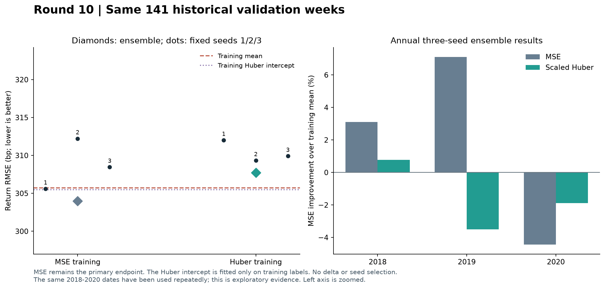
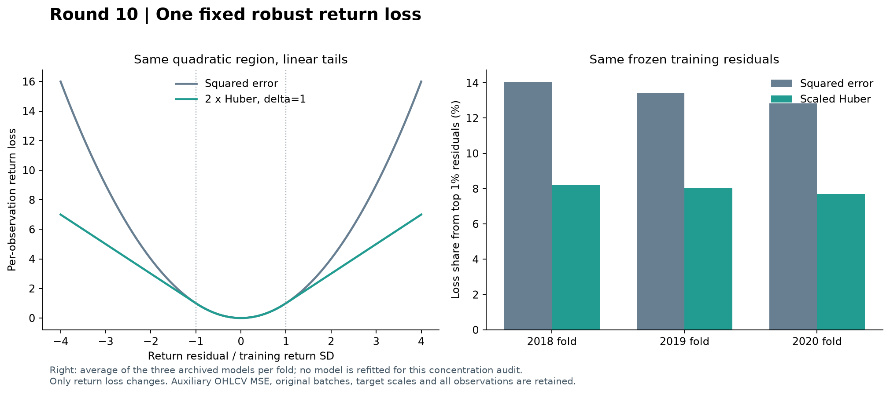

# 第十轮方法测试：固定收益稳健损失对照

日期：2026-09-11。正式完成9次新模型训练、3个训练期常数解；复用9个原MSE模型。全部18个检查点已重放核验，原批次、全量训练样本与模型配置保持一致。

**结论：本轮固定Huber损失没有改善预测，不替换原MSE研究对照。** 三种子集成准确率从59.57%降至53.90%（84／141周降至76／141周），RMSE从303.99bp升至307.72bp，MSE增加2.47%。新模型MSE比训练均值高1.32%，比Huber常数高1.46%；三个新种子都未超过这两个常数基准。

三项主比较经Holm校正后的p值均为1.0000，没有统计显著改善，也不足以确认总体性能必然恶化。2020年相对原模型略好，仍未超过常数参考；只有1／3个配对种子优于原模型。原MSE模型也仍存在前几轮发现的稳定性不足，不能因这次改动失败就把它认定为可靠策略。

这次操作确实降低了大残差的相对贡献，但输入预测信息没有变得更稳定：新模型的折内预测标准差从61.03bp缩至41.43bp，预测与真实收益的相关系数从0.124降至0.020。MAE和验证期Huber误差也没有优于原模型，因此不存在用辅助指标重新解释为成功的依据。

**新的线索来自训练集，而不是继续挑验证分数。** 将两种模型都按同一个“2×Huber收益损失＋0.1×辅助MSE”在训练集评估模式下计分，原模型平均为0.8377，新模型为0.8544；9组配对中只有1组新模型更低。它提示应检查固定预算下的优化过程。由于实际训练包含dropout与AdamW权重衰减，这个比较本身不能证明训练尚未收敛，也不能保证延长训练就会改善预测。

下一步建议先做**只使用训练数据的优化与收敛诊断**，核查收益头与辅助目标的训练进展，再决定是否值得开展新的验证实验。暂不围绕现有141周扩大Huber阈值、学习率和训练轮数搜索。当前结果均为反复使用历史验证集的探索证据；完整方法仍需补齐论文数据与算法定义，并取得冻结方案后的独立验证。


## 1. 完整验证结果

验证仍为2018–2020年141个星期五，年度数量49／46／46。这些日期已被前几轮反复使用，因此本轮继续作为探索性对照。结果是同一三个固定种子的预测均值；没有挑选最佳种子或新训练轮数。

MSE仍是预先规定的主指标，方向准确率、MAE和Huber误差仅作辅助诊断。MSE改善定义为 `1−模型MSE/对照MSE`，正数更好。误差以收益基点bp表示，1bp=0.0001，不能解读为交易收益。

| 模型 | 方向准确率 | RMSE（bp） | MSE改善／训练均值 | MSE改善／Huber常数 | MAE（bp） |
| --- | --- | --- | --- | --- | --- |
| 原MSE训练 | 59.57% | 303.99 | +1.12% | +0.98% | 238.85 |
| 固定稳健损失训练 | 53.90% | 307.72 | -1.32% | -1.46% | 242.77 |

新集成相对原MSE集成的MSE改善为-2.47%。三个常数参考如下，均在各年度训练截止日前确定：

| 常数参考 | 方向准确率 | RMSE（bp） | MAE（bp） |
| --- | --- | --- | --- |
| 训练均值 | 56.03% | 305.71 | 243.80 |
| 训练期Huber最优常数 | 56.03% | 305.50 | 243.71 |
| 零收益 | 43.97% | 305.60 | 244.55 |

| 验证年 | 原准确率 | 新准确率 | 原MSE改善／均值 | 新MSE改善／均值 | 新MSE改善／原模型 |
| --- | --- | --- | --- | --- | --- |
| 2018 | 65.31% | 55.10% | +3.10% | +0.77% | -2.40% |
| 2019 | 56.52% | 50.00% | +7.10% | -3.49% | -11.41% |
| 2020 | 56.52% | 56.52% | -4.44% | -1.89% | +2.45% |

| 种子 | 原MSE改善／均值 | 新MSE改善／均值 | 新MSE改善／Huber常数 | 新MSE改善／配对原模型 |
| --- | --- | --- | --- | --- |
| 20260910 | +0.07% | -4.17% | -4.32% | -4.24% |
| 20260911 | -4.31% | -2.39% | -2.53% | +1.84% |
| 20260912 | -1.82% | -2.77% | -2.91% | -0.94% |



## 2. 唯一候选与公平对照

固定 combined20：38,551参数，d_model16／d_ff32，dropout0.3，AdamW学习率0.001、权重衰减0.1、梯度裁剪1，训练20轮。沿用125根原始OHLCV窗口、原始全量成熟训练行、三个固定种子及同样的随机排列。每条训练标签的联合完成日均不晚于年度截止日。

本轮恢复并保留原128行批次，末批分别14、1、117行；上一轮均衡批次没有被合并进来。每轮更新次数仍为14／16／17，训练样本数1678／1921／2165。输入标准化和两个预测目标的训练均值／总体标准差都不变，没有删除或截断标签。

唯一变化是标准化收益残差 `e=(预测收益−真实收益)/训练收益SD` 的损失：

```text
rho(e) = e²                  当 |e| ≤ 1
         2|e| − 1            当 |e| > 1
总损失 = mean(rho(收益残差)) + 0.1 × mean(辅助OHLCV残差²)
```

这是 `2×Huber(delta=1)`。乘以2使小误差区间的损失和梯度与原MSE完全一致，也保持该区间收益头与辅助头的相对比例。大误差区间的标量导数为±2；阈值1预先固定，不依据验证成绩选择。辅助OHLCV仍使用MSE。

这个损失限制的是较大**残差**的影响；残差可能来自大幅收益，也可能来自预测错误。阈值覆盖的不只是少数异常点。稳健目标一般也不再与条件均值目标等价，所以不能保证MSE下降。标量导数受限也不意味着经过模型雅可比、梯度裁剪和AdamW之后的参数更新幅度必然更小。

## 3. 因果Huber常数参考

稳健损失可能只改变预测中心，因此额外计算每个训练折的Huber最优常数。把全量训练收益转换为原标准化目标z，解 `mean(clip(c−z,−1,1))=0`，再还原为 `训练均值＋训练SD×c`。使用确定性的160次二分求根；验证期标签完全不参与。

| 验证年 | 训练样本数 | 训练均值（bp） | Huber常数（bp） | 残差阈值对应收益误差（bp） |
| --- | --- | --- | --- | --- |
| 2018 | 1678 | 21.14 | 16.43 | 296.48 |
| 2019 | 1921 | 11.46 | 9.38 | 296.94 |
| 2020 | 2165 | 17.27 | 15.43 | 294.98 |

该常数用于检验神经模型是否从输入中取得额外收益，不能把超越一个较差的旧常数直接当作输入预测能力。

## 4. 训练前的残差贡献审计

复用9个冻结原MSE模型的17,292条训练预测，按原目标标准差计算同一组残差；在不重新拟合模型的情况下，比较MSE与2×Huber的损失及标量导数贡献。

原模型有24.20%–26.61%的训练残差落在新损失的线性区间。最大的约1%残差原来占训练MSE的12.38%–14.27%，换成新损失后占7.52%–8.29%。这验证了该损失确实降低同一组大残差的相对贡献，尚不等于证明重新训练会改善泛化。



详细记录见[training_loss_audit.csv](training_loss_audit.csv)，各年贡献见[yearly_training_loss_attribution.csv](yearly_training_loss_attribution.csv)。这里的导数只针对模型输出损失，不是实际参数梯度归因。

## 5. 三项预设统计比较与一致性筛选

逐周配对比较新集成与原MSE模型、训练均值、Huber训练常数。循环块自举长度8个观测、10,000次、固定种子20260910；中心化双侧p值，对全部三项MSE比较做Holm校正。差值为新方法减对照，负数表示误差较低。百分位区间与中心化检验并非严格互逆，显著性按预设校正p值判断。

| 对照 | MSE差值 | RMSE差（bp） | RMSE差95%区间（bp） | 原始p | Holm p |
| --- | --- | --- | --- | --- | --- |
| 原MSE模型 | +0.00002281 | +3.73 | [-4.98, +13.96] | 0.4404 | 1.0000 |
| 训练均值 | +0.00001233 | +2.01 | [-3.62, +7.02] | 0.4700 | 1.0000 |
| 训练期Huber常数 | +0.00001363 | +2.22 | [-3.28, +7.13] | 0.4107 | 1.0000 |

校正后显著改善的比较数量：0／3。这个校正只涵盖本轮三项比较，不消除此前多轮使用同一验证日期的选择影响。

| 预设描述性条件 | 结果 |
| --- | --- |
| 集成MSE低于原模型 | 未通过 |
| 集成MSE低于训练均值 | 未通过 |
| 集成MSE低于Huber常数 | 未通过 |
| 至少2／3个种子同时优于两个常数 | 未通过 |
| 至少2／3个配对种子优于原模型 | 未通过 |
| 至少2／3个年度优于原模型 | 未通过 |

全部六项同时满足才通过本轮描述性筛选，结果为**未通过**。新种子优于训练均值0／3，优于Huber常数0／3，同时优于两个常数0／3，优于配对原模型1／3。新集成优于原模型的年度为1／3。描述性筛选与统计确认分别解释。

## 6. 训练及输入响应诊断

下表均为9次拟合的训练终点平均值。训练MSE使用同一标准化尺度，Huber列对两种模型都按同一2×Huber公式计算；辅助列仍为MSE。不同类型损失的绝对数值不可直接互比。

| 训练方法 | 收益MSE | 收益2×Huber损失 | 辅助MSE | 收益残差线性区间比例 |
| --- | --- | --- | --- | --- |
| 原MSE训练 | 0.8920 | 0.7356 | 1.0204 | 25.38% |
| 固定稳健损失训练 | 0.9358 | 0.7538 | 1.0060 | 25.54% |

进一步将两种模型都按同一Huber联合损失在训练集评估模式下比较，原MSE模型均值为0.837674，新模型为0.854400；只有1／9组新模型的这一损失较低。逐组明细见[matched_training_objectives.csv](matched_training_objectives.csv)。这是现有输出的训练集比较，未增加拟合或改变主比较；它也不等同于带dropout和权重衰减的实际训练目标，不能单凭它判定收敛状态。

验证期指标及整窗输入错位诊断如下。错位是各年度内部把输入窗口循环移动一位，并保留原标签；只用于推理诊断，不用于训练或选择，也不能当作独立预测检验。

| 模型 | 验证期标准化Huber误差 | 折内预测标准差（bp） | 输入错位后的MSE变化 |
| --- | --- | --- | --- |
| 原MSE训练 | 0.869230 | 61.03 | +4.22% |
| 固定稳健损失训练 | 0.884948 | 41.43 | +1.63% |

新模型每轮还记录了损失线性区间比例、裁剪前梯度范数和裁剪比例，见[huber_training_curves.csv](huber_training_curves.csv)。原模型没有完整动态梯度日志，本轮没有声称重建旧训练期间的梯度轨迹。

## 7. 完整核验与适用范围

训练前3项检查通过：损失公式和导数与已安装PyTorch的Huber实现一致；常数解最优性、标签成熟与训练预算；所有残差位于二次区间时，新旧实际网络训练张量及CPU／GPU随机数状态完全一致。

训练后重放18个检查点，预测最大差异9.97e-17；独立重算180个每轮样本顺序哈希、180个批次边界哈希、3个Huber常数、各年与各种子指标、3项统计检验、6个筛选条件及9份冻结训练残差贡献。此前2,047个证据文件，包括前九轮及第八轮已归档预检，保持原有哈希。

本轮使用原有数据与原始OHLCV表征，没有补充独立验证日期。论文完整复现所需的78指数覆盖、模式定义和全部训练细节仍需补齐，本轮只能评价当前固定模型与数据上的这项损失改动。实验仅涉及研究目录。

复核入口：[冻结协议](../protocol.json)、[验证记录](verification.json)、[逐种子预测](all_seed_predictions.csv)、[逐年指标](yearly_metrics.csv)、[统计检验](primary_comparisons.json)、[Huber常数与尺度](training_scales_and_intercepts.json)、[常数预测](constant_predictions.csv)。图表另存同名SVG以便导出。
