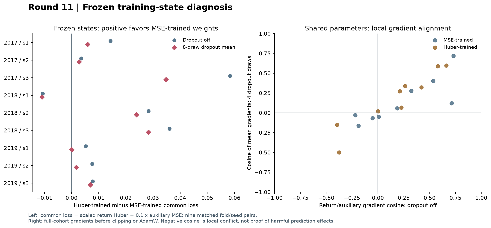
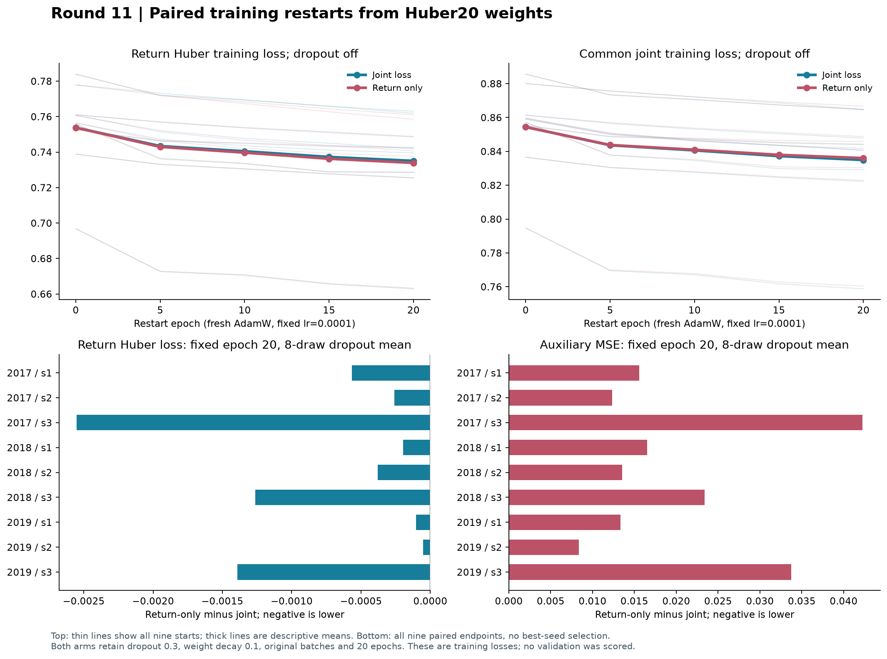

# 第十一轮方法测试：训练优化与辅助任务诊断

本轮只检查训练过程。新增验证集预测和评分均为 **0**；没有用新的准确率或收益结果挑选方案。18 个旧模型状态、18 次配对重启训练和全部复核均已完成。

本轮结果支持把下一步重点放在**训练日程和学习率的配对对照**。目前能确认的是：既有 Huber 权重仍可在预先指定的低学习率重启方案下进一步降低训练损失。暂时没有新的预测证据支持升级模型。

**1. 固定权重下的差距不能仅由关闭 dropout 来解释。** 原 Huber20 权重的共同联合损失，在关闭 dropout 时比原 MSE20 平均高 2.00%；采用 8 次固定 dropout 抽样均值时仍高 1.21%，两种模式均只有 1/9 组 Huber20 更低。不过逐次抽样存在符号波动，尤其有一个配对均值仅差约 0.000034，不能把每组的均值排序都当成稳定差异。

**2. 低学习率重启确实让这批权重更容易降低训练损失。** 保留辅助损失，固定重启 20 轮后，9/9 组共同联合损失都比起点更低；关闭 dropout 时平均降低 2.28%，8 次 dropout 抽样均值降低 1.69%。后一模式的收益 Huber 损失降低 1.82%。这说明本轮方案存在进一步优化空间；不能据此断言原训练没有收敛，也无法区分降低学习率、重置优化器或增加预算分别贡献多少。

**3. 直接删除辅助目标的训练收益很小。** 从完全相同的 Huber 权重和随机序列出发，仅收益组在 9/9 个配对中都有更低的收益 Huber 损失，但相对保留辅助项，dropout 抽样均值只额外降低 0.10%；辅助 MSE 平均增加 1.97%，共同联合损失反而增加 0.15%。在旧 Huber 权重的四次 dropout 平均梯度中，仅 2/9 组共享参数的梯度余弦为负，且没有一组共同梯度整体背离收益下降方向。这些结果不支持把普遍、严重的辅助任务冲突作为当前主要解释；也不能排除辅助任务对后续泛化的利弊。

**4. 优化成功仍需与评价目标对应。** 联合重启后的平均训练 Huber 联合损失已略低于原 MSE20（dropout 模式低 0.50%，6/9 配对更低），但平均训练收益 MSE 仍较原 MSE20 高约 0.94%。共同目标与收益 MSE 并不等价，不能把前者下降直接转换为原预测指标改善。

下一轮建议固定总训练预算，在原 MSE 主线上比较**恒定学习率与预先设定的学习率衰减**，保留辅助系数 0.1，保存完整优化器状态，使日程成为唯一主要差别。必须报告所有固定种子和常数基准；如果再使用此前反复查看的历史验证区间，其结论仍属于探索。本轮到这里结束，不追加验证评分，也不根据当前训练结果选择最好的轮次或种子。

## 冻结的实验范围

三个训练截止日为 2017-12-31、2018-12-31、2019-12-31；对应 1,678、1,921、2,165 条样本。每条样本的收益标签和辅助标签均须在该截止日前完成。各折沿用原来的 125 根日线窗口、原始 OHLCV 特征、训练均值与总体标准差。运行阶段只加载本轮单独保存的训练数组。

固定检查 3 个种子（20260910、20260911、20260912）。原模型均为 combined 架构、38,551 个参数、dropout 0.3。每批 128 条，最后一批仍为 14、1、117 条；每轮分别 14、16、17 步。第九轮的均衡分批没有被采纳。

收益误差按原训练标准差标准化。固定目标为缩放 Huber：当 |e|≤1 时为 e²，否则为 2|e|−1；共同对照目标为收益 Huber + 0.1×辅助 MSE。两种旧模型都按这一目标重新检查训练损失，因此可直接比较。

每个旧 Huber20 检查点派生两次重启：联合损失组辅助系数为 0.1，仅收益组为 0。两组从相同权重出发，采用相同的新批次顺序和初始 dropout 随机序列；新 AdamW、学习率 0.0001、weight decay 0.1、梯度裁剪范数 1、固定 20 轮。第 0/5/10/15/20 轮只记录训练轨迹，第 20 轮为预先指定终点。

旧检查点没有优化器状态，因此这不是原第 21 轮的精确续训。低学习率、重置优化器和额外预算共同构成这次局部优化检查；本轮不能分别归因于其中一个因素。仅收益组仍计算辅助输出，辅助梯度为零张量，AdamW 的权重衰减仍作用于辅助头。

## 开启 dropout 后的训练损失

每个状态做 1 次关闭 dropout 的评估，以及 8 次固定种子的全训练集 dropout 前向计算。每次按样本数加权；下表再对 9 个模型等权平均。各折样本重叠，这些均值和计数仅用于描述。

**关闭 dropout**

|模型状态|收益 Huber|辅助 MSE|共同联合损失|收益 MSE|
|---|---|---|---|---|
|原 MSE20 权重|0.735635|1.020385|0.837674|0.891977|
|原 Huber20 权重|0.753804|1.005964|0.854400|0.935819|
|联合损失重启|0.735071|0.998319|0.834903|0.905794|
|仅收益损失重启|0.733929|1.020993|0.836028|0.903608|

**开启 dropout，8 次固定抽样的均值**

|模型状态|收益 Huber|辅助 MSE|共同联合损失|收益 MSE|
|---|---|---|---|---|
|原 MSE20 权重|0.753607|1.027427|0.856350|0.921639|
|原 Huber20 权重|0.765231|1.015108|0.866741|0.952650|
|联合损失重启|0.751299|1.007765|0.852076|0.930338|
|仅收益损失重启|0.750548|1.027661|0.853314|0.928958|

|旧 Huber20 − 旧 MSE20|共同联合损失差|Huber20 更低的配对数|
|---|---|---|
|8 次 dropout 均值|+0.010391|1/9|
|关闭 dropout|+0.016727|1/9|

按每个配对的全部 8 次抽样逐次检查，只有 5/9 组每次都是 Huber20 联合损失更高；1/9 组每次更低，其余存在符号变化。均值接近零的个别配对不宜视为稳定差异。

有限次 dropout 平均不是精确期望，也不是置信区间。它与训练日志的在线损失不同：这里权重固定，在线日志中每个批次的权重持续变化。AdamW 的解耦权重衰减也不能由这张表中的数据损失完整表述。

## 辅助任务是否与收益任务冲突

对全部 18 个旧模型，分别计算全训练集收益 Huber 梯度和辅助 MSE 梯度：关闭 dropout 计算一次，开启 dropout 计算四次并先平均梯度，再计算夹角。仅将共享骨干及 geometry 参数用于下表；完整参数梯度同时留存，两个独立输出头不参与共享参数的夹角计算。

“辅助范数比”是 ||0.1g_aux|| / ||g_return||；“辅助投影”是 0.1〈g_return,g_aux〉 / ||g_return||²。投影为负表示局部欧氏梯度冲突；小于 −1 才表示共同梯度在这个局部指标下整体背离收益下降方向。此处尚未经过全局裁剪或 AdamW，不等于实际更新归因。

|旧权重|模式|余弦为负数|平均 cosine|辅助范数比|辅助投影|整体背离数|
|---|---|---|---|---|---|---|
|原 Huber20 权重|4 次梯度平均|2/9|+0.173|0.228|+0.009|0/9|
|原 Huber20 权重|关闭 dropout|2/9|+0.177|0.183|+0.016|0/9|
|原 MSE20 权重|4 次梯度平均|4/9|+0.142|0.183|+0.063|0/9|
|原 MSE20 权重|关闭 dropout|3/9|+0.225|0.155|+0.059|0/9|

## 18 次配对重启的固定终点

下表以 8 次 dropout 抽样均值比较第 20 轮。损失变化为负表示降低；百分比由九组平均损失之比计算，不是九个百分比的均值。所有配对完整保留，不挑选种子或中间轮次。

|配对比较|收益 Huber 变化|收益更低数|共同联合损失变化|联合更低数|辅助 MSE 变化|
|---|---|---|---|---|---|
|联合重启 − 原 Huber20|-1.82%|9/9|-1.69%|9/9|-0.72%|
|仅收益重启 − 原 Huber20|-1.92%|9/9|-1.55%|9/9|+1.24%|
|仅收益重启 − 联合重启|-0.10%|9/9|+0.15%|0/9|+1.97%|
|联合重启 − 原 MSE20|-0.31%|6/9|-0.50%|6/9|-1.91%|

## 可复核性与边界

- 训练前 5 项检查通过：因果缓存、标准化、Huber 公式与导数、分批/整体梯度一致性、诊断的随机状态隔离及配对更新一致性。梯度分批相对误差最大 1.531e-07。

- 18 次重启共 360 个训练轮次，训练与终点抽样耗时 460.2 秒。新增检查点包含优化器与随机状态，可支持后续精确恢复。

- 复核 36 个模型状态、36 次确定性训练评估、288 次 dropout 抽样、90 次梯度计算、360 组批次顺序及边界、90 行配对结果，全部通过。训练输出最大复算误差 0.000e+00；梯度最大误差 0.000e+00。

- 此前 2106 个证据文件的哈希保持一致。冻结协议 SHA-256：`36de252cb0e7a20f75f9bd89def00d93f3ca9776ccd853dccffedd56a2a79001`。

- 本轮不进行新的验证预测，不计算验证准确率、收益率或显著性。训练损失下降只能支持优化层面的判断；不能证明泛化改善、完全收敛或可交易性。

- 历史验证区间已被前十轮反复查看。之后若进入预测验证，仍应视为探索，并完整报告固定种子和基准；不能把它重新称为独立测试。

- 原论文复现所需的完整资产名单、形态构造和部分训练接口仍不齐全，本系列是可审计的方法实验，不是完整原论文复现。

## 证据与复现入口

[冻结协议](../protocol.json) · [训练前检查](contract_verification.json) · [最终复核](verification.json) · [结论数据](assessment.json)

[训练样本索引](training_rows.csv) · [每次抽样损失](archived_loss_draws.csv) · [重启抽样损失](restart_loss_draws.csv) · [损失汇总](training_loss_summary.csv)

[配对抽样波动](paired_dropout_variability.csv) · [旧训练目标复算核对](supplementary_verification.json)

[全部配对结果](paired_training_comparisons.csv) · [梯度明细](gradient_diagnostics.csv) · [训练轨迹](restart_training_monitors.csv) · [训练预算与顺序](restart_training_curves.csv)

[旧模型清单](archived_models.json) · [重启模型清单](restart_models.json) · [检查程序](../contract11.py) · [探针程序](../probe11.py) · [训练程序](../train11.py) · [复核程序](../verify11.py)

GPU 运行环境沿用 `research_v4/.venv_gpu/Scripts/python.exe`。脚本顺序为 prepare11 → contract11 → probe11 → train11 → analyze11 → verify11；已有冻结结果禁止覆盖，重跑应建立新的研究目录。图表与报告分别由 figures11.py、report11.py 生成。
