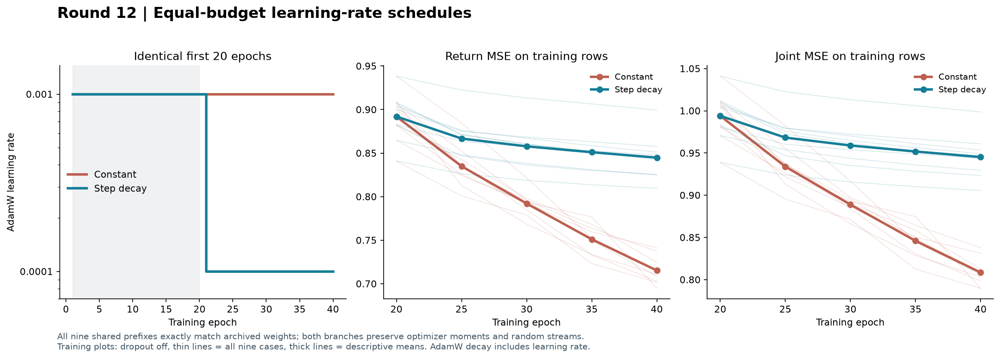
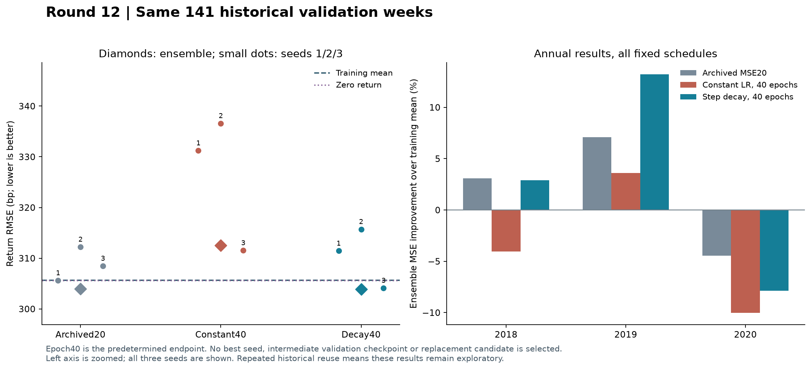

# 第十二轮方法测试：固定预算的学习率日程对照

本轮完成 9 次公共前段重建和 18 次后段训练，形成两种日程、三个年度训练截止点、三个固定种子，共 18 条完整的 40 轮训练路径。全部训练完成后，才统一计算预定终点的验证结果。

**本轮暂不替换原 MSE20 研究基准。** 预设学习率衰减优于同样训练 40 轮的恒定方案，但相对原 20 轮模型只有极小的 MSE 改善，缺乏种子、年度和统计上的稳定支持。原基准本身仍是弱的探索性结果，不代表已经验证可用。

**1. 衰减缓解了延长训练后的误差恶化。** 在相同 40 轮预算下，衰减方案的集成验证 MSE 比恒定方案低 5.48%，三个配对种子和三个年度均更低。但这一对比的 Holm 校正 p=0.4024，尚不构成显著改善证据。

**2. 相对原 20 轮模型，实质增益很小。** 衰减方案的 MSE 仅降低 0.0868%，RMSE 只降低约 0.13 bp，Holm p=1.0000。方向准确率从 59.57%（84/141）降为 58.16%（82/141）。仅 1/3 配对种子、1/3 年度的 MSE 优于原模型；也只有 1/3 种子优于训练均值。改善集中在 2019 年，2018 和 2020 年的 MSE 分别比原模型高约 0.19% 和 3.29%。八项描述性要求未全部通过。

**3. 更低训练损失没有转化为稳定预测优势。** 两种 40 轮方案在 9/9 个组合中都降低了训练收益 MSE。按固定 dropout 抽样均值，恒定方案比 20 轮降低 14.68%，衰减方案降低 3.69%。然而恒定方案的验证 MSE 比原模型高 5.70%，并比训练均值基准高 4.52%。恒定方案的方向准确率虽然达到 60.28%（85/141），实际上只比原模型多命中一周，不能掩盖其收益预测误差变大。四项预设 MSE 检验均未达到 Holm 校正后的 5% 显著水平。

**4. 结果提示应检查预测幅度。** 仅重用本轮已经冻结的集成预测，对 MSE 做结果后的算术分解：相对原模型，恒定方案增加的预测方差贡献相当于原 MSE 的 +8.87%，增强的预测与实际收益协动贡献为 −3.28%，加上平均偏差变化后，合计 MSE 增加 5.70%。衰减方案的对应两项为 +2.52% 和 −2.61%，几乎抵消。这个恒等分解不是因果归因，也没有用验证集估计或应用任何校准系数。

下一步建议优先检验**预测幅度校准及向训练均值收缩**，保留原 MSE20 作为研究比较基准。收缩强度应只用各训练截止日前、按时间顺序生成的滚动预测确定，再冻结后评估；不能直接使用这 141 周来拟合系数。本轮不继续增加训练轮数、搜索衰减点或挑选种子，也不把已经多次查看的历史区间称为独立测试。

## 实验如何控制差异

|方案|第 1–20 轮|第 21–40 轮|用途|
|---|---|---|---|
|原 MSE20|学习率 0.001|不增加训练|保留此前的研究比较基准|
|恒定学习率 40 轮|学习率 0.001|学习率 0.001|检验增加训练预算后的结果|
|预设衰减 40 轮|学习率 0.001|学习率 0.0001|本轮预先指定的候选；与恒定组同预算比较|

三种方案均使用原 combined 模型（38,551 个参数，dropout 0.3）、标准化收益 MSE + 0.1×辅助 OHLCV MSE、AdamW、weight decay 0.1、梯度裁剪范数 1。没有改变输入特征、标签、辅助系数、目标标准化或样本选择。

训练截止日为 2017-12-31、2018-12-31、2019-12-31，样本数分别为 1,678、1,921、2,165；收益及辅助标签必须在对应截止日前完成。每轮按原随机排列呈现全部样本一次，每批 128 条，最后一批仍为 14、1、117 条，每轮分别 14、16、17 步。

固定种子为 20260910、20260911、20260912。旧检查点没有优化器状态，因此先从初始化重新训练公共的前 20 轮；9/9 个重建结果与旧模型逐张量完全一致。随后两组均从同一个完整检查点恢复权重、AdamW 动量与步数、NumPy 排列流和 CPU/CUDA 随机状态，只修改后半程学习率。这里没有重置优化器或重新设置随机种子。

每条完整路径均为 40 轮，实际共执行 540 轮：9×20 轮公共前段，加 18×20 轮后段。共享相同的前段减少了重复计算，不改变两组每条路径的训练预算。第 0/5/10/15/20/25/30/35/40 轮只记录预定训练诊断；新增验证预测只在所有路径完成后、预定的第 40 轮进行。

AdamW 的名义 weight_decay 相同，但其每步乘法收缩系数为 1−学习率×weight_decay。因此，日程差异包括其对实际权重收缩的影响，不能单独解释为梯度步长变化；各折的名义累计收缩系数保存于预算表。

## 训练损失是否继续下降

以下是九个折/种子组合的等权平均。每个状态分别进行关闭 dropout 的确定性评估和 8 次固定 dropout 抽样；所有抽样都保持权重固定，并保护训练随机状态。联合训练目标为收益 MSE + 0.1×辅助 MSE。

**关闭 dropout**

|状态|收益 MSE|辅助 MSE|联合 MSE|
|---|---|---|---|
|重建 MSE20|0.891977|1.020385|0.994015|
|恒定学习率 40 轮|0.715270|0.932233|0.808493|
|预设衰减 40 轮|0.844843|1.004349|0.945278|

**8 次 dropout 抽样均值**

|状态|收益 MSE|辅助 MSE|联合 MSE|
|---|---|---|---|
|重建 MSE20|0.922208|1.027958|1.025003|
|恒定学习率 40 轮|0.786838|0.952570|0.882095|
|预设衰减 40 轮|0.888156|1.014028|0.989558|

|训练端配对比较|收益 MSE 变化|收益更低数|联合 MSE 变化|联合更低数|
|---|---|---|---|---|
|恒定学习率 40 轮 − 重建 MSE20|-14.68%|9/9|-13.94%|9/9|
|预设衰减 40 轮 − 恒定学习率 40 轮|+12.88%|0/9|+12.18%|0/9|
|预设衰减 40 轮 − 重建 MSE20|-3.69%|9/9|-3.46%|9/9|

表中变化为九组平均损失之比，负数表示降低。训练折彼此重叠，种子也不是独立数据集，因此计数和均值仅作为描述；有限次 dropout 均值不是精确期望。

## 固定验证区间的结果

验证集沿用 2018–2020 年的 141 个周五信号（49、46、46 周），目标为此前定义的可执行开盘到开盘周收益。所有方案使用完全相同的日期和标签。三种子的预测先等权平均，再计算以下集成指标。1 bp = 0.0001 的收益率。

|方案|方向准确率|RMSE（bp）|MAE（bp）|相对训练均值的 MSE 改善|
|---|---|---|---|---|
|原 MSE20|59.57%|303.99|238.85|+1.12%|
|恒定学习率 40 轮|60.28%|312.54|244.67|-4.52%|
|预设衰减 40 轮|58.16%|303.86|238.87|+1.21%|
|训练均值|56.03%|305.71|243.80|+0.00%|
|零收益|43.97%|305.60|244.55|+0.07%|

主指标是收益 MSE；方向准确率和 MAE 为辅助描述。保持零预测按“预测非上涨”计入方向判断的原规则，常数基准只使用各折已完成的训练标签。

## 四项预设配对比较

对同一周的集成平方误差作配对比较。使用长度为 8 个观测的循环分块、10,000 次 bootstrap、固定种子 20260910，双侧中心化检验；四个 MSE 检验统一进行 Holm 校正。RMSE 的 95% 区间是描述性百分位区间，不必与中心化检验逐项互为反演。

|配对比较|MSE 变化|RMSE 差（bp）|RMSE 差 95% 区间|原始 p|Holm p|
|---|---|---|---|---|---|
|预设衰减 40 轮 − 恒定学习率 40 轮|-5.48%|-8.68|[-18.97, +1.63]|0.1006|0.4024|
|预设衰减 40 轮 − 原 MSE20|-0.09%|-0.13|[-5.68, +5.03]|0.9635|1.0000|
|预设衰减 40 轮 − 训练均值|-1.21%|-1.85|[-16.79, +10.60]|0.7919|1.0000|
|恒定学习率 40 轮 − 原 MSE20|+5.70%|+8.54|[-2.47, +19.47]|0.1303|0.4024|

## 种子、年度与稳定性

以下完整列出固定种子结果，不替换候选、不取最好种子。各行均汇总三个年度的同一 141 周。

|方案|种子|准确率|RMSE（bp）|相对训练均值 MSE 改善|
|---|---|---|---|---|
|原 MSE20|20260910|57.45%|305.60|+0.07%|
|原 MSE20|20260911|55.32%|312.23|-4.31%|
|原 MSE20|20260912|58.16%|308.47|-1.82%|
|恒定学习率 40 轮|20260910|56.74%|331.22|-17.39%|
|预设衰减 40 轮|20260910|54.61%|311.44|-3.78%|
|恒定学习率 40 轮|20260911|55.32%|336.60|-21.23%|
|预设衰减 40 轮|20260911|56.03%|315.72|-6.65%|
|恒定学习率 40 轮|20260912|57.45%|311.53|-3.84%|
|预设衰减 40 轮|20260912|56.74%|304.12|+1.04%|

|年度|原 MSE20 改善|恒定 40 轮改善|衰减 40 轮改善|
|---|---|---|---|
|2018|+3.10%|-4.04%|+2.91%|
|2019|+7.10%|+3.60%|+13.21%|
|2020|-4.44%|-10.03%|-7.88%|

|预先约定的描述性检查|衰减方案结果|
|---|---|
|集成 MSE 优于同预算恒定组|通过|
|集成 MSE 优于原 MSE20|通过|
|集成 MSE 优于训练均值|通过|
|至少 2/3 种子优于训练均值|未通过|
|至少 2/3 配对种子优于恒定组|通过|
|至少 2/3 配对种子优于原 MSE20|未通过|
|至少 2/3 年度优于恒定组|通过|
|至少 2/3 年度优于原 MSE20|未通过|

本地描述性检查：**未通过**。这不是独立确认，也不是策略上线标准。各年度、种子及输入循环错配诊断的完整指标保存在证据文件中。

## 结果后的算术诊断：预测幅度

在所有预设结果已经产生后，只重用冻结的三组集成预测作恒等分解：MSE = 均值偏差平方 + 预测方差 + 目标方差 − 2×预测与目标的协方差。采用这 141 周的总体矩；没有新增拟合、预测、方案选择或验证集校准。下表各项均换算为原模型 MSE 的百分比贡献，正值增加误差、负值减少误差。

|相对原模型|均值偏差变化|预测方差变化|−2×协方差变化|合计 MSE 变化|
|---|---|---|---|---|
|恒定学习率 40 轮|+0.108%|+8.873%|-3.280%|+5.701%|
|预设衰减 40 轮|-0.001%|+2.521%|-2.607%|-0.087%|

两组目标方差相同，因此在差值中抵消。此处只解释平方误差如何分解，不识别训练效果的因果机制，也不提供可直接应用的最优收缩系数。

## 预检修复、复核和局限

第一次训练前检查发现：恢复 AdamW 时，CPU 步数计数器可能与内存中的源快照共享存储；继续训练会改变源快照。已将加载逻辑改为复制优化器状态，并加入源快照不变检查。24 个预检文件及其清单（共 25 个）完整归档。失败发生于正式前段重建及后段训练之前，新增验证预测为零；修复没有改变数据、日程、种子、预算或评分标准。

修复后的 5 项训练前检查通过；9 个旧模型完整重建均精确匹配。复核全部 36 个新旧模型状态、243 次固定状态训练损失计算、540 个实际训练轮次的顺序与边界、1,269 条种子验证预测、四项配对检验及全部稳定性标志，均通过。预测复算最大误差 9.975e-17。

公共前段耗时 317.5 秒，18 次后段训练耗时 526.5 秒。所有新增研究检查点均保存权重、优化器及随机状态。此前 2,223 个研究文件和 25 个预检文件全部保持哈希不变，共 2248 个。

本系列已经反复查看此历史验证区间。即使本轮采用固定方案和多重比较校正，结论仍属探索；不能把改善当成独立样本外确认，也不能据此证明可交易性。原论文的完整资产名单、形态构造与部分训练接口仍不齐全，本系列也不等于完整原论文复现。

## 证据与复现入口

[冻结协议](../protocol.json) · [训练前检查](contract_verification.json) · [重建一致性](reconstruction_parity.json) · [最终复核](verification.json)

[集成指标](ensemble_metrics.csv) · [全部种子](seed_metrics.csv) · [年度指标](yearly_metrics.csv) · [四项检验](primary_comparisons.json) · [描述性检查](assessment.json)

[训练目标汇总](training_loss_summary.csv) · [训练端全部配对](paired_training_comparisons.csv) · [日程与预算](schedule_budgets.csv) · [配对初始状态](paired_starting_states.json)

[MSE 恒等分解](mse_moment_decomposition.csv) · [相对原模型的分解](mse_change_decomposition.csv) · [附加诊断记录](moment_diagnostic.json)

[公共前段检查点](prefix_models.json) · [最终检查点](final_models.json) · [全部种子预测](all_seed_predictions.csv)

[保留的预检失败记录](../../research_v12_preflight/preflight_failure.json) · [预检归档清单](../../research_v12_preflight/preflight_manifest.json)

运行环境沿用 `research_v4/.venv_gpu/Scripts/python.exe`。程序顺序为 prepare12 → contract12 → reconstruct12 → continue12 → score12 → evaluate12 → verify12。已冻结结果禁止覆盖，新的研究应另建目录。
