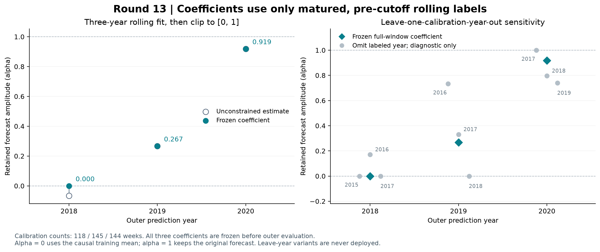
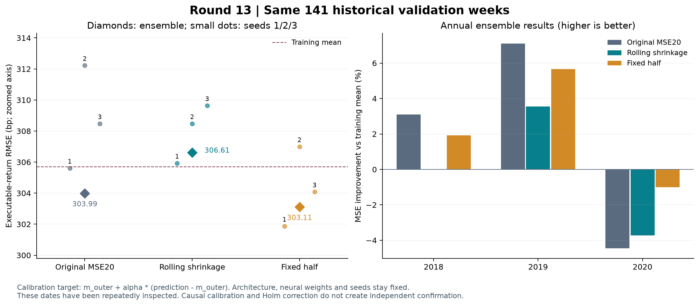

# 第十三轮方法测试：训练期滚动校准与均值收缩

本轮结论：**不采用滚动均值收缩，保留原 MSE20 作为研究比较基准。** 补训 9 个较早年份模型后，只用训练截止日前的跨年预测估计系数，再评估原来的 141 个验证周。18 个相关模型状态、全部系数和预测复核通过。

滚动校准后的方向准确率为 **53.19%（75/141）**，原模型为 **59.57%（84/141）**；MSE 相对原模型恶化 **1.73%**，相对训练均值恶化 **0.59%**。三个种子均未优于训练均值，只有一个种子、一个年度优于原模型，六项预设描述性条件全部未通过。

固定收缩一半的 MSE 比原模型低 **0.58%**，但方向准确率降到 **51.77%（73/141）**，MAE 也略差。该 MSE 改善的 Holm p=1.0000，且只在三个年度中的一个年度优于原模型。滚动法相对固定一半更差的 MSE 对照得到 Holm p=0.0476；这是固定系数下、反复使用历史区间的探索性结果，不能当作独立确认。

系数对历史年份敏感。用于 2018、2019、2020 年预测的保留幅度依次为 **0、0.267、0.919**。例如，2019 年使用的系数，在删去一个校准年度后可从 0 变到 0.732。2018 年系数为零来自负的原始估计被预设下界裁剪，并非样本不足回退。该年度最终完全使用正的训练均值预测，正确方向从原来的 32/49 降到 21/49。

事后只用冻结预测做的方向核算表明：滚动法改动了 **21 周**，全部由非上涨改为上涨，其中 **15 周由正确变错误、6 周由错误变正确**；固定一半改动 15 周，其中 13 周由正确变错误、2 周反向改善。三个年度的训练均值均为正，向它收缩会移动涨跌判断的零点。具体变换与记录保存在结果目录的 `direction_changes.csv` 和 `implied_direction_thresholds.csv`。这项核算没有新增拟合、替代系数或验证预测。

下一步建议检验**训练目标与方向预测目标是否匹配**：保持输入、骨干和训练预算，预先固定直接预测上涨概率的分类头对照，同时考核方向准确率和概率误差，并保留训练上涨频率参考。它需要新的受控实验；本轮证据没有证明分类头会更好。原模型 59.57% 也仍是反复查看同一历史区间后保留的探索性结果。

## 本轮固定了什么

第十二轮发现，增加训练会同时改变预测的协方差与方差。该结果只是误差分解，未据此计算验证期最优系数。本轮在任何新增训练前，固定三年校准记忆、系数公式、上下限、参考方案、四项配对检验和描述性筛选条件；没有挑选历史窗口、最佳种子或最优验证系数。

研究比较基准仍为第六轮原 combined MSE20：38,551 个参数、dropout 0.3、20 轮、每批 128 条、AdamW 学习率 0.001、weight decay 0.1、梯度裁剪范数 1，目标为标准化收益 MSE + 0.1×五日辅助 OHLCV MSE。固定种子为 20260910、20260911、20260912。

新增的只是 2014、2015、2016 年末三个训练截止点，每个截止点运行三个种子，共 9 次训练、180 轮、1,860 次优化器更新、222,060 次样本呈现。每个模型仅使用收益和辅助标签均在其训练截止日前完成的样本，目标均值与标准差也只由这些样本计算。

|新增模型截止日|训练条数|每轮更新步数|最后一批条数|
|---|---|---|---|
|2014-12-31|1077|9|53|
|2015-12-31|1190|10|38|
|2016-12-31|1434|12|26|

2017、2018、2019 年末模型沿用原有 9 个 MSE20 检查点；其中前两个截止点的 6 个模型也为较晚外层年度提供校准预测。没有采用第十二轮的 40 轮模型，也没有利用模型对自身训练样本的拟合值估计系数。

## 系数怎样保持因果顺序

先用截至前一年末训练的模型，预测下一年的周五信号。滚动池包含 2015–2019 年的 215 个周：22、48、50、49、46 周，三个种子共 645 条预测；前 120 周新增预测，后 95 周复用已有预测。池中包含一个截至 2019 年末尚未完成的标签，它不会进入任何系数。

每个外层模型只纳入此前三个日历年中、收益和辅助标签已经完成的周。三个系数共涉及 407 次样本纳入、214 个不同周；窗口之间有重叠。2015-03-27 的无效 OHLC 数据及受影响窗口继续按原规则排除，因此 2015 年只剩 22 个有效周，未补齐或替换行情。

每个校准周先取三个种子的等权预测 p，以该周预测模型自己的训练均值 m 为中心。记 x=p−m、z=实际收益−m，则 α=clip[Σ(xz)/Σ(x²), 0, 1]。每周等权，不拟合截距，不按年度或波动加权。预设至少 52 周且覆盖三个信号年度；分母过小或历史不足则回退 α=0。

次年应用：校准预测 = 外层训练均值 + α×（原外层预测−外层训练均值）。每个截止点只有一个由集成预测估计的 α，同样用于该折三个种子；再做等权集成与先集成再收缩等价。α=0 表示只用训练均值，α=1 表示保留原预测。

|次年验证|校准信号年份|已完成周数|原始估计|冻结 α|最后标签完成日|
|---|---|---|---|---|---|
|2018|2015–2017|118|-0.066770|0.000000|2017-12-25|
|2019|2016–2018|145|0.266956|0.266956|2018-12-24|
|2020|2017–2019|144|0.919103|0.919103|2019-12-30|

三个系数全部冻结后才应用于本轮外层验证。2018 年中已完成的标签可以校准 2019 年模型，2019 年的已完成标签可以校准 2020 年模型；它们不能进入自己的预测模型或更早模型的校准。这符合逐年滚动时序，但三个外层年度并非相互独立的数据集。

固定 α=0.5 是本轮预先登记的参考，用来区分“泛化的收缩作用”和“训练期估计系数的额外作用”。它受此前幅度诊断启发，不能声称完全不受历史研究影响。

## 系数的训练期稳定性

下表只在各外层截止日前的校准数据上，删去其中一个完整年度，再按相同公式计算。它是诊断：这些系数没有用于外层预测，也没有据此改变三年窗口或主候选。删除后要求至少 52 周、覆盖两个年度；未触发回退的结果仍裁剪至 [0,1]。

|次年验证|删去校准年度|剩余周数|原始估计|裁剪后 α|
|---|---|---|---|---|
|2018|2015|96|-0.089088|0.000000|
|2018|2016|70|0.170556|0.170556|
|2018|2017|70|-0.193658|0.000000|
|2019|2016|97|0.732489|0.732489|
|2019|2017|95|0.330751|0.330751|
|2019|2018|98|-0.108940|0.000000|
|2020|2017|94|1.135972|1.000000|
|2020|2018|95|0.795693|0.795693|
|2020|2019|99|0.740442|0.740442|

年度对 Σ(xz) 与 Σ(x²) 的贡献保存在 `calibration_year_contributions.csv`。删年系数的变化描述历史依赖，不能被解释为独立样本置信区间。

## 固定 141 周的验证结果

沿用 2018、2019、2020 年的 49、46、46 个周五信号，共 141 周。收益标签为原定义的可执行开盘到开盘周收益，三种子先等权集成再评分。主指标为原始收益 MSE；方向准确率、RMSE、MAE 为辅助指标。1 bp = 0.0001 的收益率。

|方案|方向准确率|RMSE（bp）|MAE（bp）|MSE 相对训练均值改善|MSE 相对原模型改善|
|---|---|---|---|---|---|
|原 MSE20|59.57% (84/141)|303.99|238.85|+1.12%|+0.00%|
|滚动校准收缩|53.19% (75/141)|306.61|242.79|-0.59%|-1.73%|
|固定收缩一半|51.77% (73/141)|303.11|239.96|+1.69%|+0.58%|
|训练均值|56.03% (79/141)|305.71|243.80|+0.00%|-1.13%|
|零收益|43.97% (62/141)|305.60|244.55|+0.07%|-1.06%|

改善为 1−方案 MSE/参考 MSE，正值表示更低误差。方向判断沿用预测收益 >0 为上涨、否则为非上涨的规则；零收益参考全部预测为非上涨。常数参考只依赖各折已完成的训练标签。

|方案|预测标准差（bp）|与实际收益相关系数|相对原模型改变方向周数|
|---|---|---|---|
|原 MSE20|65.88|0.1238|0|
|滚动校准收缩|40.57|0.0287|21|
|固定收缩一半|33.50|0.1121|15|

## 年度与种子是否一致

|年份|方案|方向准确率|RMSE（bp）|MSE 相对训练均值改善|
|---|---|---|---|---|
|2018|原 MSE20|65.31%|306.99|+3.10%|
|2018|固定收缩一半|44.90%|308.85|+1.92%|
|2018|滚动校准收缩|42.86%|311.86|+0.00%|
|2019|原 MSE20|56.52%|255.74|+7.10%|
|2019|固定收缩一半|58.70%|257.72|+5.67%|
|2019|滚动校准收缩|60.87%|260.59|+3.55%|
|2020|原 MSE20|56.52%|342.73|-4.44%|
|2020|固定收缩一半|52.17%|337.04|-1.00%|
|2020|滚动校准收缩|56.52%|341.54|-3.72%|

|固定种子|方案|方向准确率|RMSE（bp）|MSE 相对训练均值改善|
|---|---|---|---|---|
|20260910|原 MSE20|57.45%|305.60|+0.07%|
|20260910|固定收缩一半|56.74%|301.87|+2.50%|
|20260910|滚动校准收缩|54.61%|305.93|-0.14%|
|20260911|原 MSE20|55.32%|312.23|-4.31%|
|20260911|固定收缩一半|53.90%|306.99|-0.84%|
|20260911|滚动校准收缩|53.19%|308.48|-1.82%|
|20260912|原 MSE20|58.16%|308.47|-1.82%|
|20260912|固定收缩一半|54.61%|304.08|+1.06%|
|20260912|滚动校准收缩|54.61%|309.64|-2.59%|

三个种子共享同一数据，年度训练窗口又存在重叠。种子与年度计数都是描述性指标，不能当作独立重复实验的显著性检验。

## 四项预设配对比较

比较同一周的集成平方误差，使用 8 个观测的循环分块、10,000 次 bootstrap、种子 20260910、中心化双侧检验，并对四项 MSE 检验统一进行 Holm 校正。下表 ΔMSE 单位为 bp²，ΔRMSE 单位为 bp；负数表示候选误差更低。

|配对比较|ΔMSE（bp²）|描述性 95% 区间|ΔRMSE（bp）|双侧 p|Holm p|
|---|---|---|---|---|---|
|滚动校准收缩 − 原 MSE20|+1597.84|[-2231.87, +5826.18]|+2.62|0.4308|1.0000|
|滚动校准收缩 − 训练均值|+550.28|[-2155.80, +3492.88]|+0.90|0.7011|1.0000|
|固定收缩一半 − 原 MSE20|-533.89|[-3579.26, +2690.45]|-0.88|0.7385|1.0000|
|滚动校准收缩 − 固定收缩一半|+2131.73|[+508.75, +3800.38]|+3.50|0.0119|0.0476|

区间是百分位描述性区间，不保证与中心化检验互为反演。此处 bootstrap 固定已估计的系数，没有重新拟合校准模型或系数，也没有充分覆盖跨折标签复用与多轮历史试验的选择影响。因此，即使局部 p 值较小，也不能声称独立验证成功。

预先指定候选为“滚动校准收缩”。以下六个条件必须全部满足，才通过本轮局部描述性筛选；固定一半不能在看完结果后自动替代候选。

|条件|结果|
|---|---|
|集成 MSE 优于原模型|未通过|
|集成 MSE 优于训练均值|未通过|
|至少 2/3 配对种子优于原模型|未通过|
|至少 2/3 种子优于训练均值|未通过|
|至少 2/3 年度优于原模型|未通过|
|至少 2/3 年度优于训练均值|未通过|

## 复核与可追溯材料

核对 18 个不同模型状态，重放 645 条滚动池预测和 423 条原始验证预测，再核对 1,269 条方案/种子转换结果。滚动池与原始验证预测有 285 条复用记录，这些计数不表示同等数量的独立观测。模型预测最大绝对重放误差为 9.975e-17。

复核 9 次最终训练损失、180 轮排列与批次边界及优化器步数、407 次因果样本纳入、3 个正式系数、9 个删年诊断系数、全部指标和 4 项配对统计。系数独立复算最大差异为 3.775e-15；前 2,341 个证据文件的 SHA-256 全部保持一致。

|材料|文件|
|---|---|
|冻结研究方案|[protocol.json](../protocol.json)|
|准备、代码与旧证据清单|[preparation_manifest.json](preparation_manifest.json)|
|训练与模型清单|[training_manifest.json](training_manifest.json)、[inner_models.json](inner_models.json)|
|滚动池预测|[rolling_seed_predictions.csv](rolling_seed_predictions.csv)|
|正式系数与冻结时间|[coefficients.json](coefficients.json)、[calibration_manifest.json](calibration_manifest.json)|
|因果样本清单|[calibration_membership.csv](calibration_membership.csv)|
|系数年度贡献及删年诊断|[calibration_year_contributions.csv](calibration_year_contributions.csv)、[calibration_leave_year_out.csv](calibration_leave_year_out.csv)|
|外层集成预测与统计|[outer_ensemble_predictions.csv](outer_ensemble_predictions.csv)、[primary_comparisons.json](primary_comparisons.json)|
|事后方向核算|[direction_changes.csv](direction_changes.csv)、[implied_direction_thresholds.csv](implied_direction_thresholds.csv)、[direction_diagnostic.json](direction_diagnostic.json)|
|完整复核|[verification.json](verification.json)|
|可编辑矢量图|[系数图 SVG](rolling_calibration.svg)、[验证图 SVG](shrinkage_validation.svg)|

本轮没有新增行情、实盘操作或收益回测；预测准确率不能换算为交易收益。原论文完整的 78 指数清单、P0 生成规则和若干接口细节仍不完备，本研究继续属于已有 raw OHLCV 对照系统上的方法诊断，不能视为论文报告指标的完整复现。
