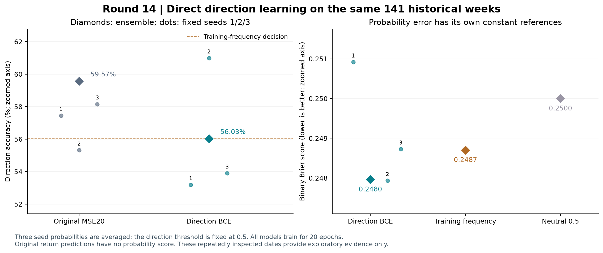
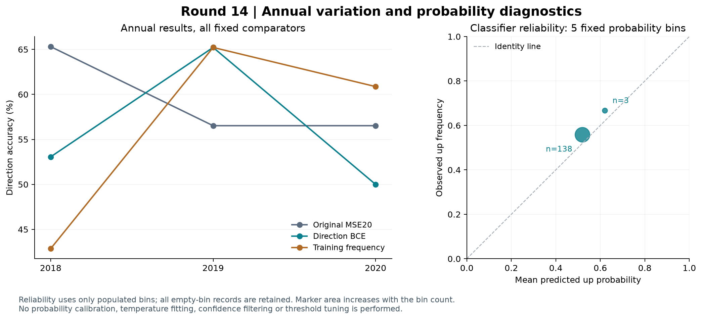

# 第十四轮方法测试：直接预测上涨概率

本轮完成 9 个直接方向分类模型的训练，以及 18 个最终模型状态的重放复核。**分类候选不替换原收益 MSE20 研究基准。** 它通过了八项预设描述性条件中的三项，未形成方向准确率与概率质量的稳定共同改善。

三种子概率集成后的方向准确率为 **56.03%（79/141）**，原收益模型为 **59.57%（84/141）**，减少 5 个正确周，下降 3.55 个百分点。分类准确率与训练期上涨频率对应的“始终判断上涨”基准持平；平衡准确率为 52.60%，原模型为 58.20%。

概率层面，分类 Brier 为 **0.247965**，训练频率参考为 **0.248705**，相对改善约 **0.30%**；对数损失从 **0.690557** 降到 **0.689087**，相对改善约 **0.21%**。四项预设配对检验的 Holm p 均为 1.0000，未支持显著改善。这些概率分数不能与原收益模型的收益 MSE 直接比较。

年度表现不一致。2018 年分类准确率为 53.06%，原模型为 65.31%；2020 年分类为 50.00%，原模型为 56.52%。唯一准确率优于原模型的 2019 年，分类准确率为 65.22%，但 **46 周全部预测上涨**，与常数方向判断完全相同，平衡准确率只有 50.00%。该年的高准确率可以由上涨周占多数解释，不能说明模型分辨了当年的上涨和下跌。

种子结果也不稳定：三个分类种子的准确率分别为 **53.19%、60.99%、53.90%**；只有一个种子的准确率优于对应原模型，只有一个种子的 Brier 优于训练频率。按冻结规则使用全部三个种子集成，不选择看起来最好的单次训练。集成 AUROC 从原收益分数的 **0.6015** 降至分类概率的 **0.5261**，方向排序也没有显示整体优势。

训练诊断提示不同年度可能存在不同问题。2017、2019 年末模型在训练集上学习到一定区分度，而 2018 年末三个模型的训练对数损失相对常数平均仅改善约 **0.034%**，训练概率标准差约为 0.00018–0.00282，接近常数输出。这不能直接证明特征没有方向信息，也不足以把原因归结为某一种优化设置。

下一步建议做**冻结特征的分类探针**：分别固定原收益骨干和本轮分类骨干，使用相同的分类拟合方式单独训练输出头，帮助区分特征表示与分类训练优化的问题。它是下一项受控诊断，尚未执行，也不保证提高准确率。本轮仍使用反复查看的 2018–2020 年 141 周，所有结果保持探索性定位。

## 本轮检验的问题

第十三轮发现，向正的训练均值收缩，会把部分非上涨预测改成上涨；小幅降低收益误差没有带来方向准确率提高。本轮只设一个分类候选，检验直接学习上涨概率是否比学习收益大小更有助于方向预测。

所有研究选择在新增训练前冻结：固定分类损失、初始概率、20 轮预算、三个种子、50% 判断阈值、概率集成规则、四项配对检验和八项描述性条件。没有搜索阈值、置信度筛选、概率校准、最佳种子或第二个分类变体。

输入仍为原 raw OHLCV 五日分段表示，骨干结构、几何层和辅助 OHLCV 头沿用原 combined 模型：38,551 个参数、dropout 0.3。原来的 25→1 线性收益头在本轮输出上涨 logit，参数形状不变。整个模型从相同种子初始化并训练，骨干权重可以更新；这不是固定旧骨干的线性探针。

原 MSE20 的收益头以零权重、零标准化收益偏置开始，实际收益对应训练均值。分类头也用零权重，其偏置设为 logit（训练期上涨频率），得到因果常数概率的起点。除这一个偏置张量外，初始张量与相同种子的原模型完全一致；赋值不消耗随机数。

目标标签必须由原始可执行收益是否严格大于零产生，不能对标准化收益取正负。零收益属于非上涨。训练仍要求收益与辅助标签共同完成时间不晚于各年度截止日，受无效 OHLC 影响的窗口继续按原规则排除。

|训练截止日|训练样本|上涨样本|训练上涨频率|初始 logit|每轮更新步数|末批样本|
|---|---|---|---|---|---|---|
|2017-12-31|1678|873|52.0262%|0.081093|14|14|
|2018-12-31|1921|982|51.1192%|0.044776|16|1|
|2019-12-31|2165|1129|52.1478%|0.085965|17|117|

分类主损失为未加权二元交叉熵（BCEWithLogits）；联合目标为 BCE + 0.1×原标准化辅助 OHLCV MSE。未加入类别权重、标签平滑、额外收益损失或损失缩放。AdamW 学习率 0.001、weight decay 0.1、梯度裁剪范数 1、批大小 128、原全样本排列均保持不变。

固定种子为 20260910、20260911、20260912。新增 9 次训练，各 20 轮，共 180 轮、2,820 次优化器更新、345,840 次样本呈现。原 9 个收益模型和 423 条预测直接复用。全部分类训练完成后才生成验证预测。

BCE 与标准化收益 MSE 的尺度和梯度形态不同，因此名义辅助系数仍为 0.1，并不意味着辅助任务相对主任务的梯度作用保持相同。这是固定预算下的目标与输出语义对照，不能把所有差异归因于一个完全隔离的因素。

## 分类模型在训练期学到了什么

每个最终状态分别关闭 dropout 评估一次，并用 8 个固定随机种子进行 dropout 抽样；权重不变，诊断过程保护 CPU/CUDA 随机状态和训练模式。以下为九个年度/种子组合的等权均值，训练常数参考为各折已完成标签的上涨频率。

|训练诊断|对数损失|常数对数损失|Brier|常数 Brier|方向准确率|辅助 MSE|联合损失|
|---|---|---|---|---|---|---|---|
|关闭 dropout|0.680936|0.692482|0.243998|0.249668|55.68%|1.002984|0.781234|
|8 次 dropout 抽样均值|0.683474|0.692482|0.245232|0.249668|54.95%|1.008613|0.784335|

训练联合损失由稳定的 logit 对数损失加 0.1×辅助 MSE 计算。有限次 dropout 平均只是训练诊断，不能代替泛化结果；重复训练折和种子也不构成独立数据集。

## 固定 141 周的结果

沿用 2018、2019、2020 年的 49、46、46 个周五信号。收益标签仍为原定义的可执行开盘到开盘周收益；分类标签为该收益是否上涨。分类集成先平均三个种子的概率，再按严格 >0.5 判断上涨；没有平均 logit。原收益模型仍按三个原始收益预测的平均值是否 >0 判断。

概率参考包括各训练截止日的上涨频率，以及固定概率 0.5。由于沿用严格大于阈值的规则，概率恰好为 0.5 时判断为非上涨；它不是随机抽签产生的方向预测。原收益模型没有原生概率，不计算它的 Brier、对数损失或概率校准指标，也不对收益值套用任意 sigmoid。

|方案|方向准确率|平衡准确率|AUROC|Brier|对数损失|预测上涨比例|
|---|---|---|---|---|---|---|
|原收益 MSE20|59.57% (84/141)|58.20%|0.6015|—|—|62.41%|
|直接方向分类|56.03% (79/141)|52.60%|0.5261|0.247965|0.689087|78.72%|
|训练期上涨频率|56.03% (79/141)|50.00%|0.4806|0.248705|0.690557|100.00%|
|固定概率 0.5|43.97% (62/141)|50.00%|0.5000|0.250000|0.693147|0.00%|

Brier = 平均（预测上涨概率−实际上涨标签）²；对数损失使用自然对数。两者越低越好；Brier 与原始收益 MSE 的目标和单位不同，不能直接比较数值。AUROC 反映分数排序；原收益模型在该项使用原始收益预测作为分数。

报告的概率对数损失将概率裁剪到 [1e−12, 1−1e−12]，仅用于数值稳定；不改变概率或方向判断。概率方法在本次验证中的裁剪计数为：直接方向分类 0、训练期上涨频率 0、固定概率 0.5 0。

|方案|平均上涨概率|实际上涨频率|概率减实际频率|概率标准差|
|---|---|---|---|---|
|直接方向分类|0.521860|0.560284|-0.038423|0.032167|
|训练期上涨频率|0.517700|0.560284|-0.042584|0.004556|
|固定概率 0.5|0.500000|0.560284|-0.060284|0.000000|

## 年度、种子和方向变化

|年度|方案|方向准确率|Brier|对数损失|AUROC|
|---|---|---|---|---|---|
|2018|原收益 MSE20|65.31%|—|—|0.7126|
|2018|直接方向分类|53.06%|0.249686|0.692562|0.5918|
|2018|训练期上涨频率|42.86%|0.253305|0.699761|0.5000|
|2019|原收益 MSE20|56.52%|—|—|0.6833|
|2019|直接方向分类|65.22%|0.245392|0.683929|0.4417|
|2019|训练期上涨频率|65.22%|0.246719|0.686584|0.5000|
|2020|原收益 MSE20|56.52%|—|—|0.5377|
|2020|直接方向分类|50.00%|0.248705|0.690542|0.4405|
|2020|训练期上涨频率|60.87%|0.245792|0.684727|0.5000|

|固定种子|方案|方向准确率|Brier|对数损失|
|---|---|---|---|---|
|20260910|原收益 MSE20|57.45%|—|—|
|20260910|直接方向分类|53.19%|0.250916|0.695015|
|20260911|原收益 MSE20|55.32%|—|—|
|20260911|直接方向分类|60.99%|0.247934|0.689621|
|20260912|原收益 MSE20|58.16%|—|—|
|20260912|直接方向分类|53.90%|0.248728|0.690606|

|范围|改变方向周数|原正确→新错误|原错误→新正确|上涨→非上涨|非上涨→上涨|
|---|---|---|---|---|---|
|全部|51|28|23|14|37|
|2018|18|12|6|10|8|
|2019|26|11|15|0|26|
|2020|7|5|2|4|3|

分类概率按预设五个等宽区间分箱。空箱保留；最后一箱包含概率 1。样本数量有限且存在时间相关，这些点只作描述，不能据此拟合新阈值或声称概率已可靠校准。

|概率区间|周数|平均预测概率|实际上涨频率|
|---|---|---|---|
|[0.0, 0.2)|0|—|—|
|[0.2, 0.4)|0|—|—|
|[0.4, 0.6)|138|0.519711|0.557971|
|[0.6, 0.8)|3|0.620734|0.666667|
|[0.8, 1.0]|0|—|—|

## 四项预设配对比较

四项统一表达为“候选损失−参考损失”，负值表示改善。方向误判率 = 1−准确率，表中该项单位为百分点；另外两项使用原始 Brier 和对数损失单位。对同一周作配对，采用长度 8 的循环观测块、10,000 次 bootstrap、种子 20260910、中心化双侧检验，并在完整四项指标族内做 Holm 校正。

|配对比较|指标|差值|描述性 95% 区间|双侧 p|Holm p|
|---|---|---|---|---|---|
|直接方向分类 − 原收益 MSE20|方向误判率（百分点）|+3.55|[-5.67, +11.35]|0.4269|1.0000|
|直接方向分类 − 训练期上涨频率|Brier|-0.000740|[-0.004293, +0.002963]|0.6890|1.0000|
|直接方向分类 − 训练期上涨频率|对数损失|-0.001471|[-0.008632, +0.005997]|0.6946|1.0000|
|直接方向分类 − 训练期上涨频率|方向误判率（百分点）|+0.00|[-7.09, +7.09]|1.0000|1.0000|

百分位区间不必与中心化检验互为反演。检验固定已训练模型的预测，没有重新训练神经网络，且未覆盖多轮研究反复查看这些历史日期带来的选择影响。因此，局部统计结果仍不能作为独立确认。

|预设描述性条件|结果|
|---|---|
|集成方向准确率优于原收益模型|未通过|
|集成方向准确率优于训练频率判断|未通过|
|集成 Brier 优于训练频率概率|通过|
|集成对数损失优于训练频率概率|通过|
|至少 2/3 配对种子的准确率优于原模型|未通过|
|至少 2/3 种子的 Brier 优于训练频率|未通过|
|至少 2/3 年度的准确率优于原模型|未通过|
|至少 2/3 年度的 Brier 优于训练频率|通过|

本轮候选必须同时满足以上八项条件，才通过局部描述性筛选。通过筛选也不等于独立验证、可交易或自动替换研究基准。

## 复核与文件

重放 9 个分类模型与 9 个原收益模型，核对 423 条分类 logit/概率和 423 条原收益预测，最大绝对预测误差 9.975e-17。另外复核 9 个初始状态与共享张量指纹、180 轮样本排列和批次、优化器步数与随机状态、81 次最终训练损失，最大训练诊断差异 2.220e-16。

独立核对概率集成规则、因果常数参考、方向混淆矩阵、逐对 AUROC、概率误差、15 个方法/概率分箱、四项配对检验及全部描述性条件。前 2,415 个研究证据文件的 SHA-256 全部保持一致。

|材料|文件|
|---|---|
|冻结研究方案|[protocol.json](../protocol.json)|
|因果缓存、代码与旧证据|[preparation_manifest.json](preparation_manifest.json)|
|训练频率与标准化|[training_metadata.json](training_metadata.json)|
|模型、预算与训练记录|[models.json](models.json)、[training_budgets.csv](training_budgets.csv)、[training_curves.csv](training_curves.csv)|
|固定状态训练诊断|[training_loss_draws.csv](training_loss_draws.csv)、[training_summary.csv](training_summary.csv)|
|完整集成与种子预测|[all_ensemble_predictions.csv](all_ensemble_predictions.csv)、[all_seed_predictions.csv](all_seed_predictions.csv)|
|概率分箱与方向变化|[reliability_bins.csv](reliability_bins.csv)、[direction_changes.csv](direction_changes.csv)|
|四项检验与筛选|[primary_comparisons.json](primary_comparisons.json)、[assessment.json](assessment.json)|
|完整复核|[verification.json](verification.json)|
|可编辑矢量图|[方向与概率 SVG](direction_and_probability.svg)、[年度与校准 SVG](annual_and_calibration.svg)|

本轮不涉及新增行情、实盘或交易收益。原方法完整的 78 指数清单、P0 生成规则及若干接口细节仍不齐备；本轮是既有 raw OHLCV 研究系统上的分类目标对照，不能称为原论文报告指标的完整复现。
