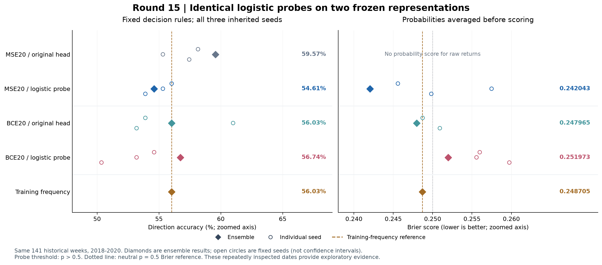
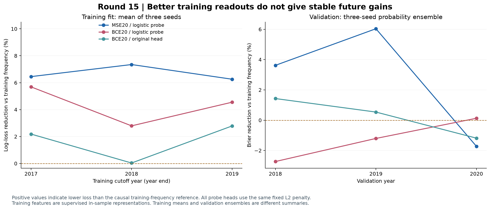

# 第十五轮方法测试：冻结两类特征，重拟合相同分类头

本轮已完成。**充分拟合分类头没有带来稳定的方向改进，原 MSE20 继续作为研究参照。** 回归特征接 logistic 分类头后，方向准确率由 59.57% 降到 54.61%；分类特征接相同分类头后，准确率为 56.74%，较上一轮原分类头多对 1 周。两条路线均未通过预先冻结的八项筛选，七项比较中没有经 Holm 校正后显著的改善。

有价值的诊断是：上一轮近乎恒定输出的特征仍能拟合训练标签；把分类头充分优化以后，训练改善也没有稳定延续到验证期。因此，后续更应检查特征跨时间的泛化能力，而不能仅凭训练拟合程度判断方向预测潜力。

本报告对应 [冻结协议](../protocol.json)，协议 SHA256 为 `7e5ad6b92c997e2248d1c1fb0baf28bd0840cfe500695c3d09b50a8aa42eca15`。全部模型、特征、预测和独立求解复核通过，见 [验证记录](verification.json)。

本轮的两类特征分别来自原收益率回归模型 MSE20，以及第十四轮直接预测上涨概率的 BCE20。每类有三个年末截点、三个原有种子，共 9 个已训练 20 轮的模型。保留全部神经网络权重，在 `eval`、`inference_mode`、`requires_grad=False` 下提取原最后一层之前的 25 维 `decoded_features`，只重新拟合 25 个斜率和 1 个截距。这里检验的是这一指定层的线性可读信息，不能外推到模型所有内部层或所有非线性分类器。

每个模型都使用自己的训练特征均值和总体标准差进行标准化，标准差下限为 `1e-6`。相同的均值和标准差直接应用于验证特征。损失固定为平均二元交叉熵加 `0.01/2 × Σw²`，截距不惩罚。该惩罚作用于标准化后的坐标，逐列标准化不保证不同表示旋转后的等价性。没有搜索正则强度、特征层、训练窗口、种子、阈值或校准参数。

求解使用 float64 全批量 Newton 法，梯度无穷范数阈值为 `1e-9`，最多 100 次更新，配合固定的回溯线搜索。斜率从零开始，截距初始化为训练上涨频率的 logit。全部 18 个头收敛后才提取本轮验证特征并导出预测。最终每个头使用 3–4 次更新，共 66 次；没有神经网络训练步骤。训练准确率是使用监督训练所得特征后的样本内诊断，不能作为时间外预测证据。

沿用原来的数据和因果边界：输入是原始 OHLCV，125 个交易日，固定 25 段；标签为既定执行口径的周收益是否严格大于零。训练行的 `joint_completed` 必须不晚于训练截点。继续排除已识别的无效 OHLC 影响样本，没有接入新市场数据或 Kronos 预训练表示。

| 训练截点 | 每模型训练行数 | 训练上涨频率 | 验证年份 | 周数 |
|---|---:|---:|---:|---:|
| 2017-12-31 | 1,678 | 52.0262% | 2018 | 49 |
| 2018-12-31 | 1,921 | 51.1192% | 2019 | 46 |
| 2019-12-31 | 2,165 | 52.1478% | 2020 | 46 |

种子固定为 `20260910 / 20260911 / 20260912`。两个新方法均先平均三个种子的概率，再使用严格 `p > 0.5` 判断上涨。原 MSE20 保持平均收益预测后取符号的规则。原始收益预测没有天然的概率解释，因此不给它计算 Brier 或概率对数损失。验证集实际上涨 79 周、非上涨 62 周；三个训练上涨频率都高于 0.5，所以训练频率方向基线始终预测上涨。

同一批 141 周上的完整集成结果如下。Brier 和对数损失越低越好，平衡准确率对上涨和非上涨分别计算正确率后取平均。

| 方法 | 判对周数 | 方向准确率 | 平衡准确率 | AUROC | Brier | 对数损失 |
|---|---:|---:|---:|---:|---:|---:|
| 原 MSE20 回归头 | 84/141 | 59.57% | 58.20% | 0.601470 | — | — |
| MSE 特征 + 新分类头 | 77/141 | 54.61% | 53.77% | 0.592487 | 0.242043 | 0.676997 |
| 原 BCE20 分类头 | 79/141 | 56.03% | 52.60% | 0.526133 | 0.247965 | 0.689087 |
| BCE 特征 + 新分类头 | 80/141 | 56.74% | 54.97% | 0.517354 | 0.251973 | 0.697464 |
| 训练上涨频率 | 79/141 | 56.03% | 50.00% | 0.480604 | 0.248705 | 0.690557 |
| 固定概率 0.5 | 62/141 | 43.97% | 50.00% | 0.500000 | 0.250000 | 0.693147 |

固定 0.5 的方向准确率来自严格阈值规则：概率恰好等于 0.5 时判为非上涨。训练频率在年内恒定，但三年取值不同，所以跨年合并的 AUROC 不必恰好为 0.5。全部概率指标的截断计数均为零。

MSE 特征新头相对训练频率的 Brier 降低 **2.68%**，对数损失降低 **1.96%**；其方向准确率却比原 MSE20 低 **4.96 个百分点**。它改变了原模型 17 周的方向，其中 12 周由对变错、5 周由错变对。概率损失同时考虑概率离真实标签的距离，准确率只看阈值一侧，两者并不必然一起改善。本轮没有因为这一结果追加阈值调整。

BCE 特征新头相对原 BCE20 多对 1 周，增加 **0.71 个百分点**，但 Brier 从 0.247965 升到 0.251973；相对训练频率，Brier 变差 **1.31%**，对数损失变差 **1.00%**。31 周方向发生变化，15 周由对变错、16 周由错变对。其预测概率标准差由原分类头的 0.032167 增到 0.073018，概率变化更大并没有形成整体概率优势。

分年准确率显示，MSE 特征新头三个年份均低于原回归模型；BCE 特征新头在 2019 和 2020 年各比原回归模型多对 1 周，但没有弥补 2018 年的差距。

| 验证年份 | 原 MSE20 | MSE 特征新头 | 原 BCE20 | BCE 特征新头 | 训练频率 |
|---|---:|---:|---:|---:|---:|
| 2018，49 周 | 65.31% | 59.18% | 53.06% | 53.06% | 42.86% |
| 2019，46 周 | 56.52% | 52.17% | 65.22% | 58.70% | 65.22% |
| 2020，46 周 | 56.52% | 52.17% | 50.00% | 58.70% | 60.87% |

| 验证年份 | MSE 特征新头 Brier | 原 BCE20 Brier | BCE 特征新头 Brier | 训练频率 Brier |
|---|---:|---:|---:|---:|
| 2018 | 0.244134 | 0.249686 | 0.260216 | 0.253305 |
| 2019 | 0.231823 | 0.245392 | 0.249690 | 0.246719 |
| 2020 | 0.250036 | 0.248705 | 0.245478 | 0.245792 |

2019 年原 BCE20 集成始终预测上涨，准确率 65.22%，但 AUROC 只有 0.441667。换头以后，预测上涨比例降到 54.35%，AUROC 升到 0.581250，准确率降到 58.70%，Brier 也变差。这一折显示“分类输出接近常数”与“特征不存在排序信息”并不等价，同时也显示恢复概率波动不能单独作为成功标准。

所有种子都保留，没有事后挑选表现最好者。

| 种子 | 原 MSE20 准确率 | MSE 特征新头准确率 | 原 BCE20 准确率 | BCE 特征新头准确率 |
|---|---:|---:|---:|---:|
| 20260910 | 57.45% | 53.90% | 53.19% | 50.35% |
| 20260911 | 55.32% | 55.32% | 60.99% | 53.19% |
| 20260912 | 58.16% | 56.03% | 53.90% | 54.61% |

| 种子 | MSE 特征新头 Brier | 原 BCE20 Brier | BCE 特征新头 Brier |
|---|---:|---:|---:|
| 20260910 | 0.249830 | 0.250916 | 0.259742 |
| 20260911 | 0.257486 | 0.247934 | 0.255572 |
| 20260912 | 0.245589 | 0.248728 | 0.255982 |

两个新方法都没有种子严格超过匹配的原 MSE20 准确率；相等按未通过计。MSE 特征新头只有 1/3 种子的 Brier 优于训练频率，BCE 特征新头为 0/3。MSE 特征新头的三个种子平均 Brier 为 0.250968，概率集成后为 0.242043，差值 0.008925 恰好等于逐周种子概率方差的均值。这是 Brier 的代数分解，说明集成抵消差异对当前概率改善很重要，不代表单个模型已稳定改善。分解属于评分后描述，未参与候选或系数选择，见 [集成分解](ensemble_brier_decomposition.csv)。

训练诊断中，18 组标准化特征的数值秩均为 25，所有坐标都没有触及标准差下限。下表为每个截点三个种子的训练指标平均；MSE 原头预测的是收益，因此只展示它对应新分类头的概率损失。

| 训练截点 | 训练频率对数损失 | MSE 特征新头对数损失 | 原 BCE 头对数损失 | BCE 特征新头对数损失 | 原 BCE 头准确率 | BCE 特征新头准确率 |
|---|---:|---:|---:|---:|---:|---:|
| 2017-12-31 | 0.692326 | 0.647667 | 0.677210 | 0.652939 | 58.30% | 61.42% |
| 2018-12-31 | 0.692897 | 0.641989 | 0.692662 | 0.673540 | 51.12% | 58.15% |
| 2019-12-31 | 0.692224 | 0.648914 | 0.672936 | 0.660728 | 57.61% | 60.29% |

最值得关注的是 2018 年末截点：原 BCE 头的训练对数损失相对常数只改善约 **0.0338%**，新头改善 **2.7936%**；训练概率标准差由平均约 0.001387 增到 0.086096。此处可以排除“所选 25 维特征已经完全恒定”的解释。它仍然是经过训练标签监督形成的样本内表示，训练恢复不能证明对新年份有效。

每个 BCE 原头还被转换到相同标准化坐标，按同一个 ridge 目标计算损失。18 个新头都优于常数初值，9 个 BCE 新头均不差于对应原头的同目标值。这符合凸优化预期。新旧训练方式的 dropout、正则化、特征尺度和联合辅助目标均不同，不能据此认定先前的端到端优化器存在缺陷；本轮只确认指定固定特征上的新目标已充分收敛。

配对比较事先固定为七项，统一用“候选损失减参照损失”，负值表示改善。采用长度 8 的循环观测块，10,000 次自助采样，随机种子 `20260910`，中心化双侧 p 值，并对全部七项做 Holm 校正。方向错误率差及其区间在下表换算为百分点，Brier 保持原始单位。

| 候选 − 参照 | 指标 | 差值 | 描述性 95% 区间 | 原始 p | Holm p |
|---|---|---:|---:|---:|---:|
| MSE 新头 − 原 MSE20 | 方向错误率，百分点 | +4.9645 | [+1.4184, +8.5106] | 0.0119 | 0.0833 |
| BCE 新头 − 原 BCE20 | 方向错误率，百分点 | −0.7092 | [−7.8014, +6.3830] | 0.8490 | 1.0000 |
| MSE 新头 − 训练频率 | Brier | −0.006663 | [−0.022729, +0.008638] | 0.4003 | 1.0000 |
| BCE 新头 − 训练频率 | Brier | +0.003268 | [−0.007014, +0.014498] | 0.5436 | 1.0000 |
| BCE 新头 − 原 BCE20 | Brier | +0.004008 | [−0.005040, +0.013986] | 0.4056 | 1.0000 |
| MSE 新头 − BCE 新头 | 方向错误率，百分点 | +2.1277 | [−5.6738, +11.3475] | 0.6287 | 1.0000 |
| MSE 新头 − BCE 新头 | Brier | −0.009931 | [−0.022973, +0.002151] | 0.1193 | 0.7157 |

MSE 新头方向变差的原始 p 为 0.0119，七重校正后为 0.0833；不能将方向相反的结果解释成改善证据。其 Brier 改善的区间跨零。百分位区间用于描述，不要求与中心化检验严格互相反演；这些固定预测上的区间也不涵盖模型拟合、种子相关性、重叠训练窗以及历次研究选择的不确定性。

两类新头分别接受完全相同的八项描述性筛选，方向参照均为原 MSE20，概率参照均为因果训练频率。下表中的种子及年份条件要求至少 2/3 严格优于参照。

| 预定条件 | MSE 特征新头 | BCE 特征新头 |
|---|---|---|
| 集成准确率高于原 MSE20 | 未通过 | 未通过 |
| 集成准确率高于训练频率 | 未通过 | 通过 |
| 集成 Brier 优于训练频率 | 通过 | 未通过 |
| 集成对数损失优于训练频率 | 通过 | 未通过 |
| 至少两个种子准确率高于原 MSE20 | 未通过，0/3 | 未通过，0/3 |
| 至少两个种子 Brier 优于训练频率 | 未通过，1/3 | 未通过，0/3 |
| 至少两个年份准确率高于原 MSE20 | 未通过，0/3 | 通过，2/3 |
| 至少两个年份 Brier 优于训练频率 | 通过，2/3 | 未通过，1/3 |
| 合计 | 3/8，未通过 | 2/8，未通过 |

运行中有一次已完整保留的兼容性预检。首次关闭所有参数的梯度标记后，原生模型的浮点预测与历史记录出现微小差异，严格一致性断言在第一个模型拦下评分；当时没有导出本轮新预测，也没有计算新集成指标。随后对 18 个原模型只读复核，发现恢复原 `requires_grad=True` 标记、同时保留 `inference_mode`，可以把与旧预测的最大差异降到 `9.97e-17`。关闭标记时原生分数最大差异为 `2.67e-8`，没有改变任何原生方向。

对应的 47 个文件及清单已保留于 [兼容性预检目录](../../research_v15_preflight/results/preflight_manifest.json)，原因和修正范围见 [诊断记录](../../research_v15_preflight/results/preflight_diagnosis.json)。正式运行继续在关闭梯度标记的冻结模型上提取新特征；仅复算旧预测时临时使用原标记，并立即恢复，全程不反传。修正后重新提取、拟合全部 18 个头，与预检中 18 个头的系数逐位一致。这次预检和正式运行各执行了一次相同设置的拟合，正式比较涉及的仍是预定的 18 组系数；没有放宽旧预测误差阈值或增加候选。

最终核验覆盖 34,584 行训练特征、846 行验证特征、846 条新种子预测、846 条旧种子预测，以及六种方法的集成、分年、分种子指标。训练和验证特征均逐位复现，所有原神经网络张量及权重文件字节保持不变；复核预测最大差异为 `4.44e-16`。主求解器最大梯度范数为 `4.40e-10`，Hessian 最小特征值至少为 0.010043。

另一套独立实现的 SciPy L-BFGS-B 从同一零斜率初值求解全部 18 个问题，全部成功退出。与 Newton 解的最大目标差为 `1.40e-14`，最大训练概率差为 `1.61e-7`，独立解最大梯度范数为 `4.10e-8`，均满足预定界限。独立解只用于核验，预测始终使用预定 Newton 系数。36 组指标独立计算通过，25 个固定可靠性分箱及七项配对比较复算通过；前十四轮 2,479 个证据文件和兼容性预检 48 个文件全部保持原哈希。

这些 2018–2020 年的 141 个周样本已被前几轮反复查看，**不能作为独立确认**。本轮也没有检验可执行交易收益，不能从准确率或 Brier 推断收益改善。当前工作仍是本地数据上的方法研究；论文的完整指数列表、模式库和若干实现口径尚未齐备，本轮不构成论文的完整复现。

下一步建议优先做训练期的因果滚动留出审计：把保留的 MSE 特征与一组固定的简单价量特征放在相同分类器、正则化和评价口径下，比较信息能否跨年份保留。每段留出所用的整个骨干都必须只在更早数据上训练，不能把全训练期监督形成的特征回填为“样本外特征”。先核对日期在历史研究中的使用记录，再定义后续保留数据；本轮没有执行这一新增比较，也没有因现有结果调整阈值或替换研究基准。

完整明细保留在 [集成指标](ensemble_metrics.csv)、[分年指标](yearly_metrics.csv)、[分种子指标](seed_metrics.csv)、[训练诊断](training_metrics.csv)、[分类头系数](heads.json)、[独立求解核验](independent_solver_verification.csv)、[配对比较](primary_comparisons.json) 和 [筛选记录](assessments.json)。图形另提供 [比较图 SVG](frozen_probe_comparison.svg) 与 [训练和验证图 SVG](training_and_future_skill.svg)。
