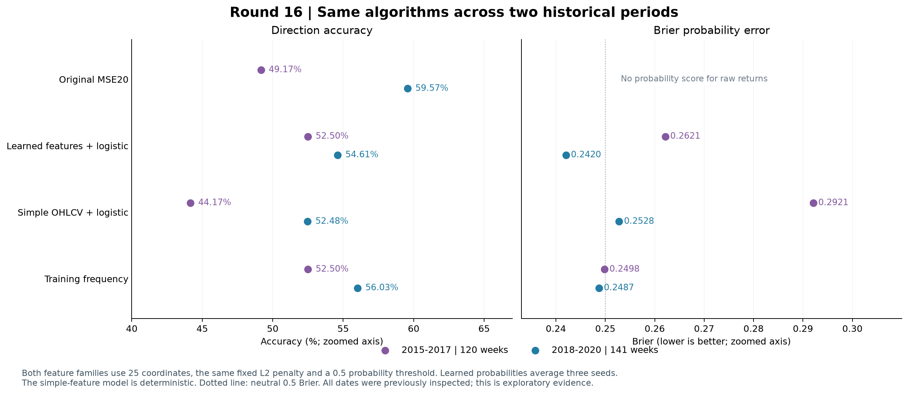
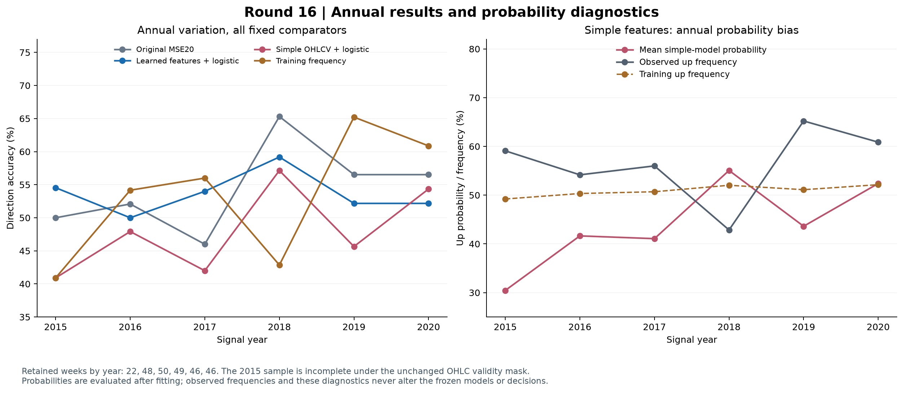

# 第十六轮方法测试：跨年份泛化与固定简单特征对照

本轮已完成，**没有得到可替换原研究参照的稳定改进**。更重要的发现是：原 MSE20 的 59.57% 只对应 2018–2020 年，在同口径的 2015–2017 年，它的准确率为 49.17%。这一差异使我们不能把原结果视为稳定的跨年份预测水平。

现有回归特征接 logistic 分类头，在早期和后期都优于本轮固定的简单价量特征；但它在早期只达到训练频率基线的准确率，概率误差还更大。两种特征方法均未通过跨期筛选，十二项配对比较没有经 Holm 校正后显著的改善。当前证据更支持继续检查预测在新分布中的稳定性，而不是根据单个时期的较高准确率升级模型。

实验遵循 [冻结协议](../protocol.json)，SHA256 为 `fd8a5e181c48a10ffa1aa769c8b3b0021312b8bb9b97c68a5cfb432332b86a67`。本轮新增 15 个分类头，复用 9 个已冻结分类头及 18 个神经网络状态，没有神经网络训练步骤。全部数值和文件复核通过，见 [验证记录](verification.json)。

先检查了历史数据的使用记录。2015–2017 年的 120 个有效周已经在第十三轮产生过滚动预测，并参与相关校准研究；2018–2020 年的 141 个有效周更早已用于第二、三轮的模型选择，也用于随后多轮验证。2021–2026 年的 272 个开发周同样已被查看，本轮没有再生成这些年份的预测。因此，本轮没有找到可直接称为独立保留集的评估日期。

| 历史记录 | 本轮日期与该记录重合数 | 使用性质 |
|---|---:|---|
| 第十三轮滚动预测 | 215 | 覆盖 2015–2019 年，含本轮早期全部 120 周 |
| 第十五轮验证预测 | 141 | 覆盖本轮后期全部 141 周 |
| 第二轮验证预测 | 141 | 同一后期已用于模型选择 |
| 第三轮验证预测 | 141 | 同一后期已用于模型选择 |
| 第一轮后续开发预测 | 0 | 其 272 周位于 2021–2026 年，也已被查看 |

逐日期证据保存在 [历史使用表](historical_date_usage.csv) 与 [使用审计](historical_usage_audit.json)。本轮是使用已查看数据的探索性滚动检查，**不能作为独立确认**。模型每折的训练标签边界满足因果要求，但架构、20 轮训练设置和研究方案具有事后选择背景；这不是对当年已经预先拥有整套方法的复原。

本轮把两个时期分开报告：早期信号年份 2015–2017，共 120 周；后期信号年份 2018–2020，共 141 周。每折用前一年末的模型预测下一年的信号，训练行的 `joint_completed` 必须不晚于该截点。下一年末附近信号的标签可以在随后年初才成熟，它们从未用于产生自身预测的模型；早期信号也只有在成熟后才允许进入更晚截点的训练集。

| 训练截点 | 每模型训练行数 | 训练上涨频率 | 验证信号年份 | 有效周数 |
|---|---:|---:|---:|---:|
| 2014-12-31 | 1,077 | 49.2108% | 2015 | 22 |
| 2015-12-31 | 1,190 | 50.3361% | 2016 | 48 |
| 2016-12-31 | 1,434 | 50.6974% | 2017 | 50 |
| 2017-12-31 | 1,678 | 52.0262% | 2018 | 49 |
| 2018-12-31 | 1,921 | 51.1192% | 2019 | 46 |
| 2019-12-31 | 2,165 | 52.1478% | 2020 | 46 |

沿用冻结的 CSI300 OHLCV、周执行收益标签和无效 OHLC 排除规则。2015 年只剩 22 个有效周，不能当成完整的 2015 年表现；没有通过填充数据或更改筛选增加样本。标签仍为既定执行收益严格大于零，没有重新选择持有期、交易成本或决策阈值。

学习特征使用原回归模型最后读出层之前的 25 维 `decoded_features`。2014–2016 年末使用第十三轮已训练的 9 个模型；2017–2019 年末使用原第六轮的 9 个模型。每个截点保留种子 `20260910 / 20260911 / 20260912`。整个骨干、几何模块和解码器均冻结，不允许用更晚训练的网络回填早期特征。

简单价量特征固定使用 5、10、20、60、120 个交易日五种尺度，每种尺度提供五项，共 25 维。设信号时点为 t、尺度为 h，各项为：

1. `log(C_t) − log(C_(t−h))`，收盘价对数变化。
2. 最近 h 个单日收盘对数收益的总体标准差。
3. 最近 h 日 `log(C) − log(O)` 的均值。
4. 最近 h 日 `log(H) − log(L)` 的均值。
5. `log(1+V_t) − log(1+V_(t−h))`，成交量对数变化。

最长变化使用 121 根价格数据，位于共同允许的 125 根历史输入范围内。没有搜索指标组合、尺度或裁剪阈值。两类特征都只按各自训练样本的列均值和总体标准差标准化，标准差下限为 `1e-6`。它们拥有相同的读出维数，但总模型容量并不相同：学习特征此前经过监督神经网络训练，简单特征没有。因此，这是一项固定表示的实用对照，不是单独识别架构因果作用的实验。

分类器与第十五轮一致：25 个斜率和 1 个不惩罚的截距；平均二元交叉熵加 `0.01/2 × Σw²`；float64 全批量 Newton 法，梯度无穷范数不超过 `1e-9`，最多 100 次更新。初始化为零斜率、训练上涨频率的 logit 截距。所有新头先完成收敛，再进入本折留出样本的评分。

新增的 15 个头包括早期 9 个学习特征头、六折各 1 个简单特征头，共使用 **55 次更新**。后期 9 个学习特征头完全复用第十五轮系数及训练标准化信息。简单特征模型是确定性求解，没有复制三份来制造种子重复。学习特征先平均三个种子的概率，再按严格 `p > 0.5` 判断上涨；原 MSE20 继续平均收益预测后取符号。

两个时期的完整集成结果如下。Brier 和对数损失越小越好；原模型输出的是收益率，不额外赋予未经定义的概率指标。

| 时期 | 方法 | 准确率 | 平衡准确率 | AUROC | Brier | 对数损失 |
|---|---|---:|---:|---:|---:|---:|
| 2015–2017 | 原 MSE20 | 49.17% | 48.17% | 0.487750 | — | — |
| 2015–2017 | 学习特征 + 分类头 | 52.50% | 52.14% | 0.497606 | 0.262133 | 0.718104 |
| 2015–2017 | 简单价量特征 + 分类头 | 44.17% | 48.82% | 0.465221 | 0.292092 | 0.789011 |
| 2015–2017 | 训练上涨频率 | 52.50% | 48.79% | 0.494086 | 0.249839 | 0.692824 |
| 2015–2017 | 固定概率 0.5 | 44.17% | 50.00% | 0.500000 | 0.250000 | 0.693147 |
| 2018–2020 | 原 MSE20 | 59.57% | 58.20% | 0.601470 | — | — |
| 2018–2020 | 学习特征 + 分类头 | 54.61% | 53.77% | 0.592487 | 0.242043 | 0.676997 |
| 2018–2020 | 简单价量特征 + 分类头 | 52.48% | 52.39% | 0.531646 | 0.252780 | 0.699542 |
| 2018–2020 | 训练上涨频率 | 56.03% | 50.00% | 0.480604 | 0.248705 | 0.690557 |
| 2018–2020 | 固定概率 0.5 | 43.97% | 50.00% | 0.500000 | 0.250000 | 0.693147 |

早期学习特征的准确率与训练频率基线相等，都是 63/120；Brier 比基线差 **4.92%**。简单特征只有 53/120，其 Brier 比基线差 **16.91%**。后期学习特征的 Brier 比基线好 **2.68%**，但方向准确率仍低于原 MSE20；简单特征的后期 Brier 比基线差 **1.64%**。学习特征优于这组简单特征，并不等于已经获得可靠的方向优势。

2015 年的训练上涨频率低于 0.5，其余五折高于 0.5，所以训练频率方向基线在第一折预测非上涨，随后预测上涨。固定 0.5 按严格阈值判为非上涨。这解释了两者在不同窗口中的方向表现；没有使用验证期实际上涨比例设定基线。所有概率的对数损失截断计数均为零。

将 261 周合并仅作描述：原 MSE20 判对 143 周，准确率 **54.79%**；训练频率判对 142 周，准确率 **54.41%**；学习特征为 **53.64%**，简单特征为 **48.66%**。原模型只比该基线多对 1 周。合并结果不替代两个时期的预定评价，也没有为合并结果增加主要显著性检验。

分年结果说明，波动不是只来自一个头没有收敛。

| 信号年份 | 周数 | 原 MSE20 准确率 | 学习特征准确率 | 简单特征准确率 | 训练频率准确率 |
|---|---:|---:|---:|---:|---:|
| 2015 | 22 | 50.00% | 54.55% | 40.91% | 40.91% |
| 2016 | 48 | 52.08% | 50.00% | 47.92% | 54.17% |
| 2017 | 50 | 46.00% | 54.00% | 42.00% | 56.00% |
| 2018 | 49 | 65.31% | 59.18% | 57.14% | 42.86% |
| 2019 | 46 | 56.52% | 52.17% | 45.65% | 65.22% |
| 2020 | 46 | 56.52% | 52.17% | 54.35% | 60.87% |

| 信号年份 | 学习特征 Brier | 简单特征 Brier | 训练频率 Brier |
|---|---:|---:|---:|
| 2015 | 0.275545 | 0.331839 | 0.251497 |
| 2016 | 0.261457 | 0.276750 | 0.249731 |
| 2017 | 0.256882 | 0.289332 | 0.249212 |
| 2018 | 0.244134 | 0.237879 | 0.253305 |
| 2019 | 0.231823 | 0.260538 | 0.246719 |
| 2020 | 0.250036 | 0.260893 | 0.245792 |

早期三个年份，学习特征和简单特征的 Brier 都没有超过训练频率。后期学习特征有 2/3 年优于基线，简单特征只有 1/3 年。2018 年简单特征 AUROC 达到 0.724490，2017 年却只有 0.360390；单年较强排序不足以证明稳定泛化。

学习特征的早期三个种子准确率为 **50.00%、55.00%、45.00%**，Brier 分别为 **0.271395、0.264604、0.272904**，都差于训练频率。后期三个种子准确率为 **53.90%、55.32%、56.03%**，Brier 为 **0.249830、0.257486、0.245589**。原生回归模型和各种子的全部结果保留在 [种子明细](seed_metrics.csv)，没有根据结果挑选种子。

24 组特征均为数值秩 25，没有任何坐标触及标准差下限。训练期两类特征均能拟合部分标签，学习特征训练拟合更强。以下学习特征数字为同折三个种子的训练指标平均，简单特征为其唯一确定性模型。

| 训练截点 | 学习特征训练准确率 | 简单特征训练准确率 | 学习特征训练对数损失 | 简单特征训练对数损失 | 常数对数损失 |
|---|---:|---:|---:|---:|---:|
| 2014-12-31 | 62.80% | 60.91% | 0.643618 | 0.652528 | 0.693023 |
| 2015-12-31 | 61.65% | 58.91% | 0.651317 | 0.663296 | 0.693125 |
| 2016-12-31 | 60.25% | 59.07% | 0.655541 | 0.667974 | 0.693050 |
| 2017-12-31 | 61.54% | 56.44% | 0.647667 | 0.676583 | 0.692326 |
| 2018-12-31 | 62.42% | 57.52% | 0.641989 | 0.676133 | 0.692897 |
| 2019-12-31 | 62.22% | 57.41% | 0.648914 | 0.679559 | 0.692224 |

这些训练结果来自样本内拟合，学习特征的骨干也用过相同训练标签。训练均值与验证集成还是不同汇总方式，不能把它们的差直接归因于某一个模型模块。它们支持的有限结论是：本轮失败不能简单解释为分类头尚未收敛或特征全为常数。

完成冻结评价之后，额外做了一项**评分后描述性诊断**：把每个头的验证平均 logit 写成“训练截距 + 各标准化特征验证均值乘以固定系数之和”。这是原预测函数的代数分解，没有改系数、重新预测候选、裁剪特征或选择阈值，见 [诊断来源记录](posthoc_diagnostic_provenance.json)。

简单特征模型在 2015 年的训练上涨频率为 49.21%，验证平均上涨概率却降到 **30.45%**，验证实际上涨比例为 **59.09%**，并且 22 周全部判为非上涨。其训练截距为 **−0.025106**，验证特征均值贡献合计 **−0.894319**，因此验证平均 logit 为 **−0.919425**。这里分解的是平均 logit，不能把它直接当作平均概率的 logit。

该折最大负贡献来自 60 日平均对数振幅：验证均值比训练均值高约 **4.176 个训练标准差**，固定系数为 **−0.237583**，对应平均 logit 贡献约 **−0.992080**。其他坐标有正有负，部分抵消了这项贡献。25 个坐标中，最大的验证均值偏移达到 **5.390 个训练标准差**。

这说明固定模型在训练后分布变化下确实产生了明显的输出偏移；它不证明某个市场指标导致了涨跌，也不能把相关坐标的系数解释为独立的因果重要性。2016、2017 年简单特征的平均上涨概率也只有 **41.64%、41.07%**。即使控制了极端外推，是否能修复这些偏差和学习特征的排序不稳定，仍需单独测试。

预定主要比较为两个时期各六项，共十二项。损失差统一是“候选减参照”，负值更好。自助采样采用长度 8 的循环保留观测块、10,000 次重复、随机种子 `20260910`，计算中心化双侧 p，并对十二项统一进行 Holm 校正。由于有效周存在间隔，8 个观测不一定对应连续 8 个日历周。

| 时期 | 候选 − 参照 | 指标 | 差值 | 描述性 95% 区间 | 原始 p | Holm p |
|---|---|---|---:|---:|---:|---:|
| 早期 | 学习特征 − 简单特征 | Brier | −0.029959 | [−0.064327, +0.002368] | 0.0773 | 0.7729 |
| 早期 | 学习特征 − 简单特征 | 方向错误率，百分点 | −8.3333 | [−18.3333, +2.5000] | 0.1314 | 1.0000 |
| 早期 | 学习特征 − 训练频率 | Brier | +0.012295 | [−0.003943, +0.028929] | 0.1428 | 1.0000 |
| 早期 | 简单特征 − 训练频率 | Brier | +0.042253 | [+0.014667, +0.075285] | 0.0068 | 0.0816 |
| 早期 | 学习特征 − 原 MSE20 | 方向错误率，百分点 | −3.3333 | [−9.1667, +2.5000] | 0.2876 | 1.0000 |
| 早期 | 简单特征 − 原 MSE20 | 方向错误率，百分点 | +5.0000 | [−5.0000, +14.1667] | 0.3203 | 1.0000 |
| 后期 | 学习特征 − 简单特征 | Brier | −0.010737 | [−0.030712, +0.007192] | 0.2612 | 1.0000 |
| 后期 | 学习特征 − 简单特征 | 方向错误率，百分点 | −2.1277 | [−12.7660, +7.0922] | 0.6717 | 1.0000 |
| 后期 | 学习特征 − 训练频率 | Brier | −0.006663 | [−0.022729, +0.008638] | 0.4003 | 1.0000 |
| 后期 | 简单特征 − 训练频率 | Brier | +0.004074 | [−0.010639, +0.020474] | 0.5991 | 1.0000 |
| 后期 | 学习特征 − 原 MSE20 | 方向错误率，百分点 | +4.9645 | [+1.4184, +8.5106] | 0.0119 | 0.1309 |
| 后期 | 简单特征 − 原 MSE20 | 方向错误率，百分点 | +7.0922 | [−1.4184, +17.0213] | 0.1334 | 1.0000 |

没有任何经校正显著的改善。最小的校正 p 为 0.0816，对应简单特征在早期 Brier **变差**。后期学习特征相对原 MSE20 的原始结果与第十五轮一致，本轮校正 p 不同，是因为预定校正家族变为十二项。百分位区间为描述性结果，不要求与中心化检验严格互相反演，也不涵盖历次模型选择、拟合和重叠训练窗的全部不确定性。

对每个特征方法、每个时期，预定六项筛选是：准确率分别超过原 MSE20 和训练频率；Brier 与对数损失分别优于训练频率；至少两个年份准确率超过原 MSE20；至少两个年份 Brier 优于训练频率。严格超过才算通过。

| 方法 | 早期通过项数 | 后期通过项数 | 两期全部通过 |
|---|---:|---:|---|
| 学习特征 + 分类头 | 2/6 | 3/6 | 否 |
| 简单价量特征 + 分类头 | 0/6 | 0/6 | 否 |

简单特征没有人为设置种子条件，学习特征的种子变化另行完整报告。原 MSE20 暂时保留为历史研究参照；保留参照不表示它已经通过独立有效性确认。

最终核验重放了 18 个神经网络，覆盖 28,395 行学习特征训练记录、783 行学习特征验证记录；另外用独立标量公式核验了 9,465 行简单训练特征、261 行简单验证特征。24 个头都重新求解验证，并由独立的 SciPy L-BFGS-B 与独立目标/梯度实现交叉核验。独立解没有进入预测。

1,827 条模型预测、63 组指标、40 个可靠性分箱和十二项配对比较均复核通过。后期 9 个头与 423 条学习特征概率保持原结果。最大预测复核差为 `4.44e-16`，两种求解器最大目标差为 `1.40e-14`、训练概率差为 `1.61e-7`、独立梯度无穷范数为 `4.10e-8`，均低于预定界限。前十五轮及既有预检的 **2,618 个文件**均保持原哈希，没有新增兼容性失败运行。

下一步若继续改进，应优先测试只用训练数据确定的特征缩尾或训练分布外控制，保留本轮未处理模型作为参照，并仍分别评价早期和后期。它针对的是已经观察到的输出偏移，不能预先承诺提高准确率。当前样本上的探索若出现改善，仍需要另行冻结未参与选择的数据才能确认；不应把已查看的后续年份重新命名为独立保留集。本轮没有执行新的稳健化方案、交易收益测试或模型部署，也不构成论文的完整复现。

可复查 [集成指标](ensemble_metrics.csv)、[分年指标](yearly_metrics.csv)、[分类头](heads.json)、[训练指标](training_metrics.csv)、[特征偏移明细](posthoc_feature_shift.csv)、[logit 分解](posthoc_logit_accounting.csv)、[独立求解复核](independent_solver_verification.csv)、[配对检验](primary_comparisons.json)、[筛选结果](assessments.json)。两张图另有 [时期比较 SVG](period_comparison.svg) 和 [分年诊断 SVG](annual_and_probability_bias.svg)。
