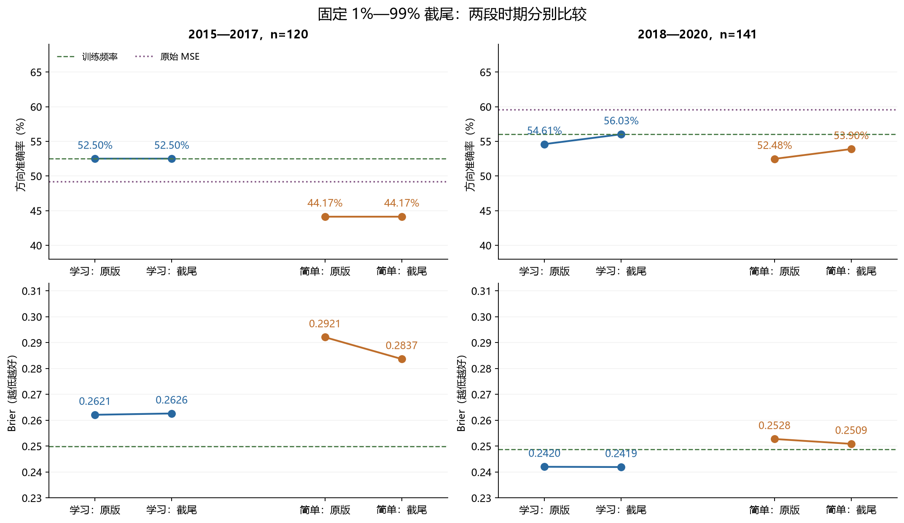
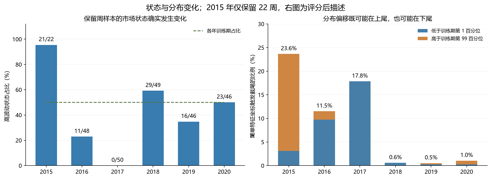
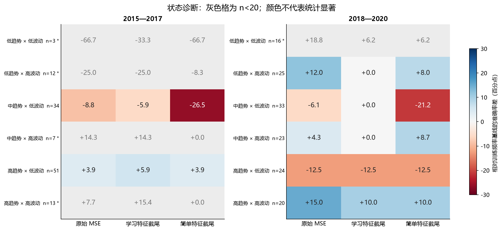

# 第十七轮方法测试：训练期截尾与因果市场状态识别

本轮已经完成 24 个新分类头、1,044 条新概率预测和市场状态诊断。结论是：固定截尾缓解了部分简单特征的概率偏差，但尚未获得稳定的跨时期提升。市场状态可以在预测时因果识别，并帮助解释样本分布变化；本轮没有证据支持直接按六种状态切换模型。

2018—2020 年，学习特征截尾后的准确率为 **56.03%（79/141）**，简单特征为 **53.90%（76/141）**，分别比各自原版多预测对 2 周。原始 MSE 仍为 **59.57%（84/141）**，训练频率为 **56.03%（79/141）**。2015—2017 年，两种截尾模型的准确率都没有提高。

全部 261 个测试日期在前几轮已经被查看。本轮设计承接上一轮发现，属于重复使用历史样本的探索性研究；年度训练与预测符合因果顺序，但这些结果**不能作为独立确认**，也不能由方向准确率推断可交易收益。

## 1. 冻结范围与因果约束

数据、无效 OHLC 排除规则、125 根历史输入、下一开盘至下一周对应开盘的标签，以及每个年度的训练截止日全部沿用第十六轮。训练行必须满足联合标签完成时间不晚于截止日。市场指标只使用信号日收盘时及以前的数据，交易标签从次日开盘开始。2015 年受既有数据排除规则影响，只保留 22 周；后面关于 2015 年的描述均仅指这些保留样本。

| 训练截止日 | 训练行数 | 下一年测试周数 |
| --- | --- | --- |
| 2014-12-31 | 1077 | 22 |
| 2015-12-31 | 1190 | 48 |
| 2016-12-31 | 1434 | 50 |
| 2017-12-31 | 1678 | 49 |
| 2018-12-31 | 1921 | 46 |
| 2019-12-31 | 2165 | 46 |

学习特征来自原有 18 个 MSE20 神经网络的 25 维表示；简单特征沿用 25 个固定 OHLCV 汇总量。对每个分类头的每一维，使用本年度训练数据的第 1、99 百分位数截尾，再用截尾后的训练均值和总体标准差标准化，重新求解相同的岭逻辑回归。正则系数 λ=0.01，截距不惩罚，严格以 p>0.5 预测上涨，未搜索截尾比例、正则强度或阈值。

这是“训练/未来特征截尾、重新标准化、重新拟合分类头”这一整套固定处理的比较，不能单独把差异归因于预测阶段截尾。学习特征每个年度沿用三个种子并平均概率；简单特征每年度只有一个确定性分类头。18 个神经网络均未重训。24 个新分类头全部拟合完成后才开始新的测试评分；合计 90 次 Newton 更新。

## 2. 市场状态如何识别

| 描述量 | 计算规则 |
| --- | --- |
| 趋势得分 | 过去 60 个交易日的累计收盘对数收益 ÷（60 日单日对数收益总体标准差 × √60）；标准差下限 1e-8。 |
| 波动 | 最近 20 个交易日的单日收盘对数收益总体标准差。 |
| 振幅 | 最近 20 日 log(最高价/最低价) 的均值。 |
| 量能变化 | log(1+当日成交量) − log(1+20 个交易日前成交量)。 |

每个年度只用该年度训练输入确定阈值，不读其未来涨跌标签：趋势按训练期三分位数分成低、中、高，波动按训练期中位数分为低、高，交叉得到六种主要状态。振幅与量能变化分别按训练中位数分成两组，作为补充诊断。边界相等时归较低组。全部阈值在下一年度内固定。

“低/中/高趋势”是相对于本年度训练分布的得分，不等同于事后牛市、熊市标签；“高量能变化”也不等同于绝对成交量大。状态没有进入本轮预测函数，也没有被用来删样本、调整阈值、重新加权或选择模型。

| 训练截止日 | 趋势下界 | 趋势上界 | 日波动中位数 | 振幅中位数 | 量能变化中位数 |
| --- | --- | --- | --- | --- | --- |
| 2014-12-31 | -0.595792 | 0.415248 | 0.011980 | 0.015566 | 0.022470 |
| 2015-12-31 | -0.562274 | 0.500544 | 0.012281 | 0.016037 | 0.010797 |
| 2016-12-31 | -0.523953 | 0.509991 | 0.011993 | 0.015628 | 0.007344 |
| 2017-12-31 | -0.404860 | 0.656056 | 0.011186 | 0.014963 | 0.002949 |
| 2018-12-31 | -0.490684 | 0.578357 | 0.011300 | 0.015026 | -0.001123 |
| 2019-12-31 | -0.421865 | 0.580621 | 0.011221 | 0.014884 | -0.001123 |

## 3. 总体及逐年效果

Brier 和对数损失越低越好；AUROC 反映排序能力。原始 MSE 输出收益分数，没有概率指标。

### 2015—2017（120 周）

| 方法 | 正确周数 | 准确率 | 平衡准确率 | AUROC | Brier | 对数损失 |
| --- | --- | --- | --- | --- | --- | --- |
| 原始 MSE | 59 | 49.17% | 48.17% | 0.487750 | — | — |
| 学习特征原版 | 63 | 52.50% | 52.14% | 0.497606 | 0.262133 | 0.718104 |
| 学习特征截尾 | 63 | 52.50% | 52.14% | 0.496761 | 0.262637 | 0.719150 |
| 简单特征原版 | 53 | 44.17% | 48.82% | 0.465221 | 0.292092 | 0.789011 |
| 简单特征截尾 | 53 | 44.17% | 48.03% | 0.467192 | 0.283675 | 0.765637 |
| 训练频率 | 63 | 52.50% | 48.79% | 0.494086 | 0.249839 | 0.692824 |
| 固定 50% | 53 | 44.17% | 50.00% | 0.500000 | 0.250000 | 0.693147 |

### 2018—2020（141 周）

| 方法 | 正确周数 | 准确率 | 平衡准确率 | AUROC | Brier | 对数损失 |
| --- | --- | --- | --- | --- | --- | --- |
| 原始 MSE | 84 | 59.57% | 58.20% | 0.601470 | — | — |
| 学习特征原版 | 77 | 54.61% | 53.77% | 0.592487 | 0.242043 | 0.676997 |
| 学习特征截尾 | 79 | 56.03% | 55.03% | 0.592283 | 0.241944 | 0.676837 |
| 简单特征原版 | 74 | 52.48% | 52.39% | 0.531646 | 0.252780 | 0.699542 |
| 简单特征截尾 | 76 | 53.90% | 53.31% | 0.539608 | 0.250901 | 0.695053 |
| 训练频率 | 79 | 56.03% | 50.00% | 0.480604 | 0.248705 | 0.690557 |
| 固定 50% | 62 | 43.97% | 50.00% | 0.500000 | 0.250000 | 0.693147 |

后期学习特征准确率增加 1.42 个百分点，但 AUROC 从 0.592487 到 0.592283，Brier 仅从 0.242043 到 0.241944；这不足以表明排序能力提高。它只改变了 2 个方向，且两次都由错误变正确。简单特征后期改变 8 个方向，其中 5 个由错变对、3 个由对变错。早期学习特征一个方向都没变，简单特征改变 8 个方向，正负改善各 4 个。

逐年方向准确率如下；完整年度概率指标见 [yearly_metrics.csv](yearly_metrics.csv)。

| 年份 | 周数 | 原始 MSE | 学习特征原版 | 学习特征截尾 | 简单特征原版 | 简单特征截尾 | 训练频率 |
| --- | --- | --- | --- | --- | --- | --- | --- |
| 2015 | 22 | 50.00% | 54.55% | 54.55% | 40.91% | 40.91% | 40.91% |
| 2016 | 48 | 52.08% | 50.00% | 50.00% | 47.92% | 47.92% | 54.17% |
| 2017 | 50 | 46.00% | 54.00% | 54.00% | 42.00% | 42.00% | 56.00% |
| 2018 | 49 | 65.31% | 59.18% | 59.18% | 57.14% | 57.14% | 42.86% |
| 2019 | 46 | 56.52% | 52.17% | 54.35% | 45.65% | 47.83% | 65.22% |
| 2020 | 46 | 56.52% | 52.17% | 54.35% | 54.35% | 56.52% | 60.87% |

学习特征截尾后的种子结果如下。三个种子共享相同市场样本，不能把它们当作三份独立市场证据。简单特征不存在随机种子重复。

| 时期 | 种子 | 准确率 | Brier | 对数损失 |
| --- | --- | --- | --- | --- |
| 2015—2017 | 20260910 | 50.00% | 0.271589 | 0.738848 |
| 2015—2017 | 20260911 | 54.17% | 0.264463 | 0.724987 |
| 2015—2017 | 20260912 | 45.00% | 0.273978 | 0.744826 |
| 2018—2020 | 20260910 | 53.19% | 0.249630 | 0.693756 |
| 2018—2020 | 20260911 | 54.61% | 0.256870 | 0.710178 |
| 2018—2020 | 20260912 | 56.74% | 0.245646 | 0.685801 |

合并 261 周只作描述：原始 MSE 为 54.79%（143/261）；学习特征截尾为 54.41%（142/261），其原版为 53.64%；简单特征截尾为 49.43%（129/261），其原版为 48.66%；训练频率为 54.41%。合并结果不能替代两段时期分别通过。

## 4. 固定检验与判定

本轮预先固定 12 项对比，均为“候选损失 − 参照损失”，负数更好。沿用 8 个保留观测为一块的循环区块重采样，10,000 次、种子 20260910；两个时期分别重采样，12 个 p 值统一做 Holm 校正。由于日期有排除缺口，8 个保留观测不一定是连续 8 个自然周。区间及 p 值不包含模型/设计选择和历轮反复查看数据带来的不确定性。

| 时期 | 候选/参照 | 指标 | 差值 | 95% 区间 | 原始 p | Holm p |
| --- | --- | --- | --- | --- | --- | --- |
| 2015—2017 | 学习特征截尾 / 学习特征原版 | Brier | +0.000504 | [-0.000134, +0.001150] | 0.1287 | 1.0000 |
| 2015—2017 | 学习特征截尾 / 学习特征原版 | 方向错误率 | +0.000000 | [+0.000000, +0.000000] | 1.0000 | 1.0000 |
| 2015—2017 | 简单特征截尾 / 简单特征原版 | Brier | -0.008417 | [-0.022613, +0.001173] | 0.1516 | 1.0000 |
| 2015—2017 | 简单特征截尾 / 简单特征原版 | 方向错误率 | +0.000000 | [-0.016667, +0.016667] | 1.0000 | 1.0000 |
| 2015—2017 | 学习特征截尾 / 训练频率 | Brier | +0.012798 | [-0.003555, +0.029402] | 0.1284 | 1.0000 |
| 2015—2017 | 简单特征截尾 / 训练频率 | Brier | +0.033837 | [+0.013185, +0.055615] | 0.0015 | 0.0180 |
| 2018—2020 | 学习特征截尾 / 学习特征原版 | Brier | -0.000099 | [-0.000587, +0.000412] | 0.7015 | 1.0000 |
| 2018—2020 | 学习特征截尾 / 学习特征原版 | 方向错误率 | -0.014184 | [-0.035461, +0.000000] | 0.1210 | 1.0000 |
| 2018—2020 | 简单特征截尾 / 简单特征原版 | Brier | -0.001879 | [-0.005900, +0.001252] | 0.3006 | 1.0000 |
| 2018—2020 | 简单特征截尾 / 简单特征原版 | 方向错误率 | -0.014184 | [-0.049645, +0.014184] | 0.3932 | 1.0000 |
| 2018—2020 | 学习特征截尾 / 训练频率 | Brier | -0.006761 | [-0.022820, +0.008536] | 0.3938 | 1.0000 |
| 2018—2020 | 简单特征截尾 / 训练频率 | Brier | +0.002195 | [-0.010215, +0.015439] | 0.7369 | 1.0000 |

没有一项改善通过本轮 Holm 校正。唯一校正后 p<0.05 的差异是**早期简单特征截尾的 Brier 仍劣于训练频率**：差值 +0.033837，Holm p=0.0180。这个结果也仅限上述探索性检验框架，不是整个研究流程的独立显著性结论。

预设的八项描述性条件涵盖：准确率胜过自身原版、原始 MSE、训练频率；Brier 胜过自身原版及训练频率；对数损失胜过训练频率；至少两年准确率胜过 MSE、至少两年 Brier 胜过训练频率。两段时期都需八项全通过，平局算未通过。

| 时期 | 候选 | 通过项数 | 跨时期通过 |
| --- | --- | --- | --- |
| 2015—2017 | 学习特征截尾 | 2/8 | 否 |
| 2015—2017 | 简单特征截尾 | 1/8 | 否 |
| 2018—2020 | 学习特征截尾 | 5/8 | 否 |
| 2018—2020 | 简单特征截尾 | 2/8 | 否 |

## 5. 市场状态诊断带来的信息

最清晰的是分布变化：2015 年保留的 22 周中，21 周（95.45%）位于训练中位数以上的高波动组；2016 年为 11/48 周（22.92%）；2017 年为 0/50 周，全部位于训练定义的低波动组。训练期自身高低波动约各半。因此，简单地沿用全训练期的特征范围确实会遇到明显的后续分布偏移。

以下展示全部六种状态，星号表示本时期 n<20。两段时期共 12 个“时期 × 状态”单元，有 **5 个稀疏单元**，不能据此挑选最优专家。表内结果是原样诊断，没有用它们重新拼接一条看起来更好的预测序列。

### 2015—2017：状态内准确率

| 状态 | 周数 | 实际上涨占比 | 原始 MSE | 学习截尾 | 简单截尾 | 训练频率 |
| --- | --- | --- | --- | --- | --- | --- |
| 低趋势 × 低波动 * | 3 | 66.67% | 0.00% | 33.33% | 0.00% | 66.67% |
| 低趋势 × 高波动 * | 12 | 58.33% | 33.33% | 33.33% | 50.00% | 58.33% |
| 中趋势 × 低波动 | 34 | 64.71% | 55.88% | 58.82% | 38.24% | 64.71% |
| 中趋势 × 高波动 * | 7 | 57.14% | 42.86% | 42.86% | 28.57% | 28.57% |
| 高趋势 × 低波动 | 51 | 49.02% | 50.98% | 52.94% | 50.98% | 47.06% |
| 高趋势 × 高波动 * | 13 | 53.85% | 53.85% | 61.54% | 46.15% | 46.15% |

### 2018—2020：状态内准确率

| 状态 | 周数 | 实际上涨占比 | 原始 MSE | 学习截尾 | 简单截尾 | 训练频率 |
| --- | --- | --- | --- | --- | --- | --- |
| 低趋势 × 低波动 * | 16 | 62.50% | 81.25% | 68.75% | 68.75% | 62.50% |
| 低趋势 × 高波动 | 25 | 52.00% | 64.00% | 52.00% | 60.00% | 52.00% |
| 中趋势 × 低波动 | 33 | 57.58% | 51.52% | 57.58% | 36.36% | 57.58% |
| 中趋势 × 高波动 | 23 | 47.83% | 52.17% | 47.83% | 56.52% | 47.83% |
| 高趋势 × 低波动 | 24 | 66.67% | 54.17% | 54.17% | 54.17% | 66.67% |
| 高趋势 × 高波动 | 20 | 50.00% | 65.00% | 60.00% | 60.00% | 50.00% |

高波动状态下，原始 MSE 在早期为 43.75%（14/32），低波动为 51.14%（45/88）；后期高波动为 60.29%（41/68），低波动为 58.90%（43/73）。这不是一个可以直接照搬的“高波动就停用模型”规则。不同分组的实际涨跌比例也不同，准确率差异本身不能证明状态具有预测因果作用。

学习特征截尾在早期高波动组的 Brier 为 0.288869，训练频率为 0.250680；后期分别为 0.247568 与 0.250876。其相对表现也随时期变化。后期“低趋势 × 低波动”中的原始 MSE 达到 81.25%，但只有 16 周，已按事先规则标记为稀疏，不能据此承诺高准确率。

振幅和量能变化的二分组也全部保留在 [state_metrics.csv](state_metrics.csv)。例如，后期高量能变化组的原始 MSE 准确率为 65.71%（46/70），早期同名组为 50.98%（26/51）。这些只是多个诊断切面中的描述；没有进行分组显著性检验，也没有据此选取交易状态。

## 6. 为什么截尾没有解决问题

2015 年简单特征有 23.64% 的测试坐标触发截尾，22 个周样本每一个都有坐标被截尾；训练期坐标触发比例约为 2.04%。用截尾训练统计量衡量的每行最大绝对标准化距离，均值从 6.63 降至 2.82。平均上涨概率从 30.45% 回到 39.71%，但实际上涨比例为 59.09%，准确率仍为 9/22。其 Brier 从 0.331839 改善为 0.305033，AUROC 却从 0.529915 降为 0.470085：缓和概率极端程度不等同于提高排序能力。

逐折截尾比例如下。学习特征取三个种子比例的均值，简单特征取确定性单头比例。坐标比例的分母是“周数 ×25”，不是独立样本数。

| 测试年 | 特征 | 训练坐标截尾比例 | 测试坐标截尾比例 | 测试行至少一维截尾比例 | 原版平均概率 | 截尾平均概率 |
| --- | --- | --- | --- | --- | --- | --- |
| 2015 | 学习特征截尾 | 2.04% | 1.82% | 16.67% | 48.80% | 48.87% |
| 2016 | 学习特征截尾 | 2.02% | 3.25% | 32.64% | 48.57% | 48.56% |
| 2017 | 学习特征截尾 | 2.09% | 2.35% | 28.00% | 50.95% | 50.79% |
| 2018 | 学习特征截尾 | 2.03% | 2.29% | 29.93% | 54.37% | 54.21% |
| 2019 | 学习特征截尾 | 2.08% | 2.49% | 30.43% | 49.44% | 49.41% |
| 2020 | 学习特征截尾 | 2.03% | 3.33% | 29.71% | 52.98% | 53.01% |
| 2015 | 简单特征截尾 | 2.04% | 23.64% | 100.00% | 30.45% | 39.71% |
| 2016 | 简单特征截尾 | 2.02% | 11.50% | 60.42% | 41.64% | 41.52% |
| 2017 | 简单特征截尾 | 2.09% | 17.84% | 100.00% | 41.07% | 42.10% |
| 2018 | 简单特征截尾 | 2.03% | 0.57% | 12.24% | 55.06% | 54.80% |
| 2019 | 简单特征截尾 | 2.08% | 0.52% | 10.87% | 43.62% | 44.74% |
| 2020 | 简单特征截尾 | 2.03% | 1.04% | 13.04% | 52.38% | 53.22% |

评分后额外进行的上下尾描述性核算发现：2017 年简单特征触发截尾的 17.84% 坐标全部来自下尾；120 日波动、120 日平均振幅在保留的 50 周中均低于该折训练第 1 百分位，因此这两维在测试期被压成各自相同的下边界。它说明偏移也可以表现为持续低波动。这个核算选在评分之后，只解释固定结果，没有再训练、再预测或修改参数。详见 [posthoc_tail_details.csv](posthoc_tail_details.csv) 与 [provenance](posthoc_tail_provenance.json)。

截尾会限制模型在历史范围以外的外推，也可能抹掉新状态内部的差异。本轮不足以把失效完全归因于特征偏移；表示质量、标签噪声和跨年份关系变化仍可能同时存在。

## 7. 后续改进方向

下一步更适合测试**共享模型的市场条件输入**：将这四个连续、因果的状态指标加入现有分类头，先检验统一模型是否从这些条件获得额外信息。只使用少量预先限定的加性项；若要引入交互，也应先限定形式和数量，再完成整轮评分。当前六状态的样本分布不足以支撑直接挑选或分别训练六套专家。

比较中应保留原有模型、训练频率，以及单独使用市场特征的简单参照，以辨别收益来自状态本身还是与学习表示的互补。阈值和标准化继续只用年度训练期数据，两个时期分别验收；这些复用日期上的进一步结果仍属于探索，最终需要未用于选型的数据或后续前瞻预测检验。

本轮不升级研究基线，不宣称交易收益。可保留状态识别与分布诊断代码，作为后续条件输入实验的可复核基础。

## 8. 复核与证据

独立复核状态为 **PASS**。分位数边界用排序后的次序统计量重算；状态公式与逐行实现比较，并验证扰动未来数据和截断未来历史不改变当时结果。24 个分类头均用独立 L-BFGS-B 目标/梯度重求解，18 个原有神经网络的训练和测试特征全部回放，权重不变。

| 复核内容 | 结果 |
| --- | --- |
| 新分类头 / Newton 更新 | 24 / 90 |
| 独立 L-BFGS-B 验证 | 24 个解 |
| 神经网络回放 / 新训练步数 | 18 / 0 |
| 学习特征训练行 / 测试行 | 28,395 / 783 |
| 简单特征训练行 / 测试行 | 9,465 / 261 |
| 市场状态训练行 / 测试日期 | 9,465 / 261 |
| 新增概率 / 沿用模型记录 | 1,044 / 1,827 |
| 模型记录 / 集成记录 | 2,871 / 1,827 |
| 独立复算指标组 / 状态指标组 | 258 / 168 |
| 概率分箱 / 主要对比 | 60 / 12 |
| 最大新预测复核误差 | 2.220e-16 |
| 独立求解最大目标差 | 7.883e-15 |
| 独立求解最大训练概率差 | 1.469e-07 |
| 独立求解最大梯度 | 1.187e-08 |
| 历史证据文件保留 | 2,716 个，哈希不变 |
| 独立保留测试日期 | 0 |

训练分数仅为监督训练集内的诊断：按折平均，学习特征截尾的训练准确率约 60.32%—62.89%，简单特征约 55.90%—61.00%。这些每日滚动标签相互重叠，训练行数也不是同等数量的独立周事件。训练指标见 [training_metrics.csv](training_metrics.csv)。所有新概率的报告截断计数为 0。

冻结协议 SHA-256：`6403b2ca536306dd693ee79d232df6a09c0feeffe974b7ab40093ab6c0fee398`。

主要文件：[协议](../protocol.json)；[总体指标](ensemble_metrics.csv)；[逐年指标](yearly_metrics.csv)；[种子指标](seed_metrics.csv)；[主要对比](primary_comparisons.json)；[八项判定](assessments.json)；[状态阈值](state_thresholds.json)；[逐周状态](validation_states.csv)；[状态分布](state_distribution.csv)；[状态指标](state_metrics.csv)；[截尾汇总](clipping_summary.csv)；[独立求解](independent_solver_verification.csv)；[完整复核](verification.json)。

三张图均同时保存为 PNG 和 SVG。交付后可在工作目录运行 `python research_v17/delivery17.py` 进行只读哈希及报告核验。
