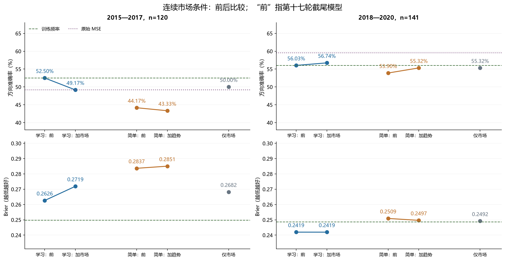
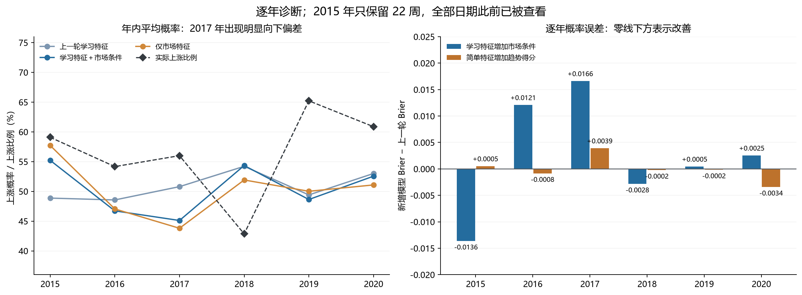

# 第十八轮方法测试：连续市场特征的加性条件输入

本轮完成 30 个新分类头、1,305 条新概率预测和全部独立复核。**直接把连续市场特征加入分类头，没有获得稳定的跨时期改善。** 学习特征模型在 2018—2020 年多预测对 1 周，但在 2015—2017 年少预测对 4 周；简单特征模型后期多预测对 2 周，早期少预测对 1 周。仅使用四项市场特征的小模型也没有稳定超过训练频率参照。

市场状态可以被因果识别，但这不保证它们能以固定的加性关系预测未来涨跌。本轮不采用新增版本替换研究基线。所有 261 个测试日期此前都已经被查看，因此仍是探索性结果，**不能作为独立确认**。

## 1. 本轮只检验一个明确的问题

在保留上一轮特征处理、标签、年度截止日和分类阈值的前提下，增加少量连续市场条件，能否改善原有预测？四项条件沿用第十七轮定义：60 日趋势得分、20 日波动、20 日平均振幅和 20 日量能变化。它们全部来自信号日收盘时已知的 OHLCV 历史，不引入新的外部数据。

| 版本 | 上一轮表示维数 | 新增市场维数 | 斜率总数 | 拟合数 |
| --- | --- | --- | --- | --- |
| 学习特征＋四项市场条件 | 25 | 4 | 29 | 18 |
| 简单特征＋趋势得分 | 25 | 1 | 26 | 6 |
| 仅四项市场特征 | 0 | 4 | 4 | 6 |

三个版本均额外含一个不惩罚的截距。使用相同的均值二元对数损失，加 λ/2 倍斜率平方和，λ=0.01；梯度无穷范数收敛阈值为 1e-9。学习特征按原有三个种子平均概率，另外两个版本每年仅一个确定性分类头。所有版本严格以 p>0.5 预测上涨。没有搜索种子、阈值、正则强度或指标组合。

模型形式为“表示项＋市场项＋截距”的加性 logit。表示项在所有市场条件下共用相同权重，没有市场与表示的乘积交互，也没有六套状态专家或按测试结果切换模型。这个实验检验的是共享分类头中的加性条件，不覆盖所有可能的状态建模方法。

## 2. 为什么简单特征只增加一项

原有 25 个简单特征已经包含 20 日波动、振幅和量能变化。重复拼接会使同一信号得到两个受惩罚的系数，从而改变有效的岭惩罚，不能把这种效果解释为增加了市场信息。因此，本轮在评分前固定省略这三个重复列，只增加趋势得分。

| 市场条件 | 已有简单特征位置（从 0 开始） | 本轮处理 |
| --- | --- | --- |
| 20 日波动 | 11 | 不重复加入 |
| 20 日平均振幅 | 13 | 不重复加入 |
| 20 日量能变化 | 14 | 不重复加入 |
| 60 日趋势得分 | 由已有 60 日收益、波动构成非线性比值 | 增加一维 |

六个年度的训练与测试重复列均已核对，原始数值最大差为 0.000e+00，标准化数值最大差为 1.044e-14。标准化中的微小浮点差异不改变这三个变量在定义上完全重复的事实。

四项市场条件使用每个年度训练输入的第 1、99 百分位数截尾，再用截尾后的训练均值、总体标准差标准化，标准差下限为 1e-6。下一年度沿用冻结参数。原有 25 维表示的截尾与标准化完全沿用第十七轮缓存。新增分类头共同重拟合所有系数，原有表示本身不变。

市场条件与学习表示的维数不相同，新增版本也比父模型多了参数。本轮比较的是这些固定扩展方案的实用增益，不是等参数容量的架构因果比较。

## 3. 数据与冻结顺序

| 训练截止日 | 训练行数 | 下一年测试周数 |
| --- | --- | --- |
| 2014-12-31 | 1077 | 22 |
| 2015-12-31 | 1190 | 48 |
| 2016-12-31 | 1434 | 50 |
| 2017-12-31 | 1678 | 49 |
| 2018-12-31 | 1921 | 46 |
| 2019-12-31 | 2165 | 46 |

沿用沪深 300 原始数据、125 根历史输入、无效 OHLC 排除规则及既有周收益标签。训练行的联合标签完成时间必须不晚于年度截止日；测试为下一年度符合原规则的周五信号，执行标签从下一交易时段开盘开始。2015 年受原有排除规则影响仅有 22 周，其年度统计不代表完整年份。早期为 120 周，后期为 141 周。

30 个分类头全部收敛后才开始新的测试评分，合计 109 次 Newton 更新。沿用原 18 个神经网络对应的冻结表示缓存，没有新的神经网络训练或前向推理；其提取过程在第十七轮已回放复核，本轮通过哈希保持该证据链。

## 4. 主要结果

表中的“上一轮”指第十七轮截尾版本。Brier、对数损失越低越好；原始 MSE 输出收益分数，不能直接当作概率计算这两项。未截尾模型和固定 50% 参照也原样保留在完整结果文件中。

### 2015—2017（120 周）

| 方法 | 正确周数 | 准确率 | 平衡准确率 | AUROC | Brier | 对数损失 |
| --- | --- | --- | --- | --- | --- | --- |
| 原始 MSE | 59 | 49.17% | 48.17% | 0.487750 | — | — |
| 学习特征：上一轮 | 63 | 52.50% | 52.14% | 0.496761 | 0.262637 | 0.719150 |
| 学习特征＋四项市场条件 | 59 | 49.17% | 49.55% | 0.488313 | 0.271899 | 0.740763 |
| 简单特征：上一轮 | 53 | 44.17% | 48.03% | 0.467192 | 0.283675 | 0.765637 |
| 简单特征＋趋势得分 | 52 | 43.33% | 46.30% | 0.457899 | 0.285063 | 0.768797 |
| 仅四项市场特征 | 60 | 50.00% | 52.66% | 0.456773 | 0.268229 | 0.731433 |
| 训练频率 | 63 | 52.50% | 48.79% | 0.494086 | 0.249839 | 0.692824 |

### 2018—2020（141 周）

| 方法 | 正确周数 | 准确率 | 平衡准确率 | AUROC | Brier | 对数损失 |
| --- | --- | --- | --- | --- | --- | --- |
| 原始 MSE | 84 | 59.57% | 58.20% | 0.601470 | — | — |
| 学习特征：上一轮 | 79 | 56.03% | 55.03% | 0.592283 | 0.241944 | 0.676837 |
| 学习特征＋四项市场条件 | 80 | 56.74% | 55.84% | 0.602082 | 0.241936 | 0.676994 |
| 简单特征：上一轮 | 76 | 53.90% | 53.31% | 0.539608 | 0.250901 | 0.695053 |
| 简单特征＋趋势得分 | 78 | 55.32% | 54.75% | 0.549000 | 0.249651 | 0.692508 |
| 仅四项市场特征 | 78 | 55.32% | 52.84% | 0.509596 | 0.249180 | 0.691507 |
| 训练频率 | 79 | 56.03% | 50.00% | 0.480604 | 0.248705 | 0.690557 |

学习特征模型后期准确率从 56.03% 到 56.74%，对应 79/141 到 80/141，仍低于原始 MSE 的 84/141（59.57%）。新增版本改变 7 个方向，其中 4 个由错变对、3 个由对变错。Brier 从 0.241944 到 0.241936，差异仅约 −0.0000075；对数损失从 0.676837 到 0.676994，略有变差。

早期学习特征模型改变 32 个方向，其中 18 个由对变错、14 个由错变对，准确率从 52.50% 降至 49.17%，Brier 从 0.262637 升至 0.271899。简单特征加趋势得分后，早期准确率从 44.17% 到 43.33%，后期从 53.90% 到 55.32%。

仅四项市场特征的模型，早期为 50.00%（60/120），后期为 55.32%（78/141）；两段时期的准确率均低于训练频率，Brier 均高于训练频率。其后期 AUROC 为 0.509596，合并 AUROC 为 0.503395，没有显示出稳定的单独排序能力。

合并 261 周仅作描述：原始 MSE 为 54.79%（143/261），学习特征＋市场条件为 53.26%（139/261），简单特征＋趋势为 49.81%（130/261），仅市场特征为 52.87%（138/261），训练频率为 54.41%（142/261）。不能用合并成绩替代两段时期分别验收。

## 5. 逐年与市场状态诊断

| 年份 | 周数 | 原始 MSE | 学习特征：上一轮 | 学习特征＋四项市场条件 | 简单特征：上一轮 | 简单特征＋趋势得分 | 仅四项市场特征 | 训练频率 |
| --- | --- | --- | --- | --- | --- | --- | --- | --- |
| 2015 | 22 | 50.00% | 54.55% | 54.55% | 40.91% | 36.36% | 63.64% | 40.91% |
| 2016 | 48 | 52.08% | 50.00% | 52.08% | 47.92% | 47.92% | 52.08% | 54.17% |
| 2017 | 50 | 46.00% | 54.00% | 44.00% | 42.00% | 42.00% | 42.00% | 56.00% |
| 2018 | 49 | 65.31% | 59.18% | 61.22% | 57.14% | 55.10% | 46.94% | 42.86% |
| 2019 | 46 | 56.52% | 54.35% | 54.35% | 47.83% | 50.00% | 54.35% | 65.22% |
| 2020 | 46 | 56.52% | 54.35% | 54.35% | 56.52% | 60.87% | 65.22% | 60.87% |

新增学习模型的早期损失主要出现在 2017 年：准确率从 54.00% 到 44.00%，少预测对 5/50 周；2016 年多对 1/48 周，2015 年正确周数不变。新增学习模型后期净增的 1 周来自 2018 年，2019、2020 年的正确周数均未增加。

2017 年全部保留周样本都处于该折训练中位数以下的低波动状态。学习特征模型加入市场条件后，年度平均上涨概率由 50.79% 降至 45.11%，实际上涨比例为 56.00%。仅市场特征模型的平均概率为 43.80%，50 周里只预测 1 周上涨，年度 AUROC 为 0.246753。它识别到了低波动，却把这些样本映射到了偏低的上涨概率。

按两个时期分别合并低、高波动组，结果如下。这里的分组、阈值和样本支持下限沿用上一轮，没有根据本轮结果重新划分或筛选。

| 时期 | 波动组 | 周数 | 上一轮学习准确率 | 新增学习准确率 | 上一轮学习 Brier | 新增学习 Brier | 实际上涨比例 |
| --- | --- | --- | --- | --- | --- | --- | --- |
| 2015—2017 | 低波动 | 88 | 54.55% | 50.00% | 0.253098 | 0.266056 | 55.68% |
| 2015—2017 | 高波动 | 32 | 46.88% | 46.88% | 0.288869 | 0.287968 | 56.25% |
| 2018—2020 | 低波动 | 73 | 58.90% | 60.27% | 0.236705 | 0.236828 | 61.64% |
| 2018—2020 | 高波动 | 68 | 52.94% | 52.94% | 0.247568 | 0.247420 | 50.00% |

所有六状态交叉分组及振幅、量能二分组均在 [state_metrics.csv](state_metrics.csv)。原有 12 个“时期 × 六状态”单元仍有 5 个不足 20 周，不能据这些小组的高准确率挑选专家。状态结果只作描述，没有分组显著性检验或状态选优后的合成预测。

## 6. 条件项确实被拟合，但训练改善没有稳定迁移

每个扩展模型把新增市场系数设为零时，都能精确嵌套对应父模型：表示、截距及正则目标不变。24 个扩展分类头收敛后的训练正则目标均不高于父模型。这个检查确认新特征被有效优化，不能把测试不稳定简单归结为未收敛；训练目标降低本身也不是泛化证据。

| 版本 | 训练截止日 | 训练准确率 | 训练对数损失 | 训练正则目标 | 父模型/常数目标 |
| --- | --- | --- | --- | --- | --- |
| 学习特征＋四项市场条件 | 2014-12-31 | 63.45% | 0.631627 | 0.635803 | 0.647564 |
| 学习特征＋四项市场条件 | 2015-12-31 | 62.58% | 0.638446 | 0.642524 | 0.654112 |
| 学习特征＋四项市场条件 | 2016-12-31 | 61.92% | 0.651987 | 0.654192 | 0.658104 |
| 学习特征＋四项市场条件 | 2017-12-31 | 61.72% | 0.646867 | 0.649293 | 0.650271 |
| 学习特征＋四项市场条件 | 2018-12-31 | 62.31% | 0.640775 | 0.642618 | 0.643883 |
| 学习特征＋四项市场条件 | 2019-12-31 | 62.11% | 0.647398 | 0.648983 | 0.650323 |
| 仅四项市场特征 | 2014-12-31 | 56.73% | 0.677296 | 0.677698 | 0.693023 |
| 仅四项市场特征 | 2015-12-31 | 56.81% | 0.678108 | 0.678540 | 0.693125 |
| 仅四项市场特征 | 2016-12-31 | 54.81% | 0.684933 | 0.685209 | 0.693050 |
| 仅四项市场特征 | 2017-12-31 | 51.31% | 0.690754 | 0.690876 | 0.692326 |
| 仅四项市场特征 | 2018-12-31 | 50.65% | 0.690908 | 0.691175 | 0.692897 |
| 仅四项市场特征 | 2019-12-31 | 50.85% | 0.690894 | 0.691079 | 0.692224 |
| 简单特征＋趋势得分 | 2014-12-31 | 61.65% | 0.650003 | 0.654689 | 0.655658 |
| 简单特征＋趋势得分 | 2015-12-31 | 59.75% | 0.661642 | 0.665397 | 0.666435 |
| 简单特征＋趋势得分 | 2016-12-31 | 58.65% | 0.666755 | 0.670634 | 0.671810 |
| 简单特征＋趋势得分 | 2017-12-31 | 56.38% | 0.676817 | 0.679438 | 0.680009 |
| 简单特征＋趋势得分 | 2018-12-31 | 58.41% | 0.676147 | 0.678954 | 0.679715 |
| 简单特征＋趋势得分 | 2019-12-31 | 58.24% | 0.679431 | 0.681867 | 0.682320 |

学习模型各年度市场项的系数均值及测试期 logit 贡献如下。系数以各年度标准化坐标为单位，取三个种子的均值；市场变量与表示可能相关，系数符号不能作为因果关系或变量重要性。

| 测试年 | 趋势系数 | 波动系数 | 振幅系数 | 量能系数 | 市场项平均 logit | 完整平均 logit |
| --- | --- | --- | --- | --- | --- | --- |
| 2015 | -0.173538 | 0.218125 | 0.029280 | 0.195473 | 0.197154 | 0.221882 |
| 2016 | -0.229166 | 0.254610 | 0.014773 | 0.169330 | -0.109202 | -0.141472 |
| 2017 | -0.060379 | 0.128544 | 0.025213 | 0.105308 | -0.276859 | -0.219012 |
| 2018 | -0.045517 | -0.009872 | 0.053836 | 0.020300 | 0.033575 | 0.181639 |
| 2019 | -0.110984 | -0.042745 | 0.083232 | 0.031018 | -0.062030 | -0.056366 |
| 2020 | -0.088938 | -0.031918 | 0.088083 | 0.020614 | -0.047997 | 0.115428 |

在 2017 年三个学习模型的均值中，市场项贡献 −0.276859，表示项为 +0.028576，截距为 +0.029271，合计平均 logit 为 −0.219012。该等式是固定模型的代数核算；新旧模型的表示权重也重新拟合，不能把整个性能差异都归因于这一市场项。平均 logit 也不等于平均概率的 logit。

学习模型后期三个种子的方向准确率均为 56.03%，但 Brier 分别为 0.248522、0.256863、0.246597；概率质量仍有差异。平均概率集成后的 56.74% 不等于种子准确率的均值，因为集成是在阈值判断之前完成。完整结果见 [seed_metrics.csv](seed_metrics.csv)。

## 7. 固定统计检验与判定

预先固定 14 项对比，两个时期各 7 项：新增模型相对父模型的 Brier、方向错误率；两个新增模型相对仅市场特征模型的 Brier；仅市场特征模型相对训练频率的 Brier。差值为候选损失减参照损失，负数更好。

沿用 8 个保留观测为一块的循环区块重采样，10,000 次、种子 20260910，两个时期分别重采样，14 个 p 值统一进行 Holm 校正。由于保留日期有缺口，区块不一定对应连续 8 个自然周。区间及 p 值不覆盖训练、设计选择和历轮重复查看这些日期带来的不确定性。

| 时期 | 候选 / 参照 | 指标 | 差值 | 95% 区间 | 原始 p | Holm p |
| --- | --- | --- | --- | --- | --- | --- |
| 2015—2017 | 学习特征＋四项市场条件 / 学习特征：上一轮 | Brier | +0.009262 | [-0.004508, +0.022982] | 0.1844 | 1.0000 |
| 2015—2017 | 学习特征＋四项市场条件 / 学习特征：上一轮 | 方向错误率 | +0.033333 | [-0.041667, +0.108333] | 0.3869 | 1.0000 |
| 2015—2017 | 简单特征＋趋势得分 / 简单特征：上一轮 | Brier | +0.001388 | [-0.004001, +0.006888] | 0.6164 | 1.0000 |
| 2015—2017 | 简单特征＋趋势得分 / 简单特征：上一轮 | 方向错误率 | +0.008333 | [-0.033333, +0.050000] | 0.7069 | 1.0000 |
| 2015—2017 | 学习特征＋四项市场条件 / 仅四项市场特征 | Brier | +0.003671 | [-0.011792, +0.019377] | 0.6390 | 1.0000 |
| 2015—2017 | 简单特征＋趋势得分 / 仅四项市场特征 | Brier | +0.016835 | [+0.001699, +0.038352] | 0.0652 | 0.8475 |
| 2015—2017 | 仅四项市场特征 / 训练频率 | Brier | +0.018390 | [+0.003092, +0.033679] | 0.0166 | 0.2324 |
| 2018—2020 | 学习特征＋四项市场条件 / 学习特征：上一轮 | Brier | -0.000008 | [-0.002653, +0.002749] | 0.9965 | 1.0000 |
| 2018—2020 | 学习特征＋四项市场条件 / 学习特征：上一轮 | 方向错误率 | -0.007092 | [-0.042553, +0.028369] | 0.7044 | 1.0000 |
| 2018—2020 | 简单特征＋趋势得分 / 简单特征：上一轮 | Brier | -0.001250 | [-0.002839, +0.000356] | 0.1272 | 1.0000 |
| 2018—2020 | 简单特征＋趋势得分 / 简单特征：上一轮 | 方向错误率 | -0.014184 | [-0.049645, +0.021277] | 0.4336 | 1.0000 |
| 2018—2020 | 学习特征＋四项市场条件 / 仅四项市场特征 | Brier | -0.007244 | [-0.023529, +0.008137] | 0.3648 | 1.0000 |
| 2018—2020 | 简单特征＋趋势得分 / 仅四项市场特征 | Brier | +0.000470 | [-0.010980, +0.011627] | 0.9319 | 1.0000 |
| 2018—2020 | 仅四项市场特征 / 训练频率 | Brier | +0.000475 | [-0.002849, +0.003918] | 0.7936 | 1.0000 |

本轮没有任何差异通过 Holm 校正。最小校正 p 为 0.2324，对应仅市场特征模型在早期的 Brier 劣于训练频率，并非改善。后期学习模型相对父模型的 Brier 差异约为 −0.0000075，原始 p=0.9965。

新增模型按九项严格条件验收：准确率高于父模型、原始 MSE、训练频率；Brier 低于父模型、仅市场特征、训练频率；对数损失低于训练频率；至少两年准确率高于 MSE，至少两年 Brier 低于训练频率。两个时期都须九项全通过，平局不算通过。

| 时期 | 新增模型 | 通过项数 | 跨时期通过 |
| --- | --- | --- | --- |
| 2015—2017 | 学习特征＋四项市场条件 | 0/9 | 否 |
| 2015—2017 | 简单特征＋趋势得分 | 0/9 | 否 |
| 2018—2020 | 学习特征＋四项市场条件 | 7/9 | 否 |
| 2018—2020 | 简单特征＋趋势得分 | 2/9 | 否 |

## 8. 结论与下一步方向

当前证据不支持采用这套直接拼接市场条件的加性方案，也不支持用四项市场特征的小模型替换已有参照。更早时期的成绩说明，后期的一两周改善不足以支持稳定提升的结论。

如果继续研究，优先检验一个范围有限的新问题：**波动状态是否改变原有信号的有效强度**。可以预先限定单一波动条件的正则化交互，保留当前加性模型和原始参照，检查它能否同时控制早期退化和后期误差。该交互没有在本轮测试，不能把它当作已经有效的改进。

这条后续路线需要把“状态直接预测涨跌”与“状态调节已有信号”分开检验。现有状态识别和因果标准化可以保留为研究工具。所有本轮日期都已被用于研究设计，进一步历史实验仍只能筛选假设，最终应通过未用于选型的数据或前瞻预测检验确认。

## 9. 独立复核与交付

| 项目 | 结果 |
| --- | --- |
| 新分类头 / 独立 L-BFGS-B 解 | 30 / 30 |
| Newton 更新 | 109 |
| 斜率与截距系数合计 | 732 |
| 新神经网络训练 / 前向推理 | 0 / 0；沿用第十七轮 18 个网络回放证据 |
| 合并训练特征行 | 47,325 |
| 市场条件训练行 / 测试日期 | 9,465 / 261 |
| 重复变量逐折核对 | 18 组，均省略追加 |
| 新概率 / 沿用模型记录 | 1,305 / 2,871 |
| 模型记录 / 集成记录 | 4,176 / 2,610 |
| 指标组 / 状态指标组 | 366 / 240 |
| 概率分箱 / 主要对比 | 90 / 14 |
| 最大新预测复核误差 | 2.220e-16 |
| 独立求解最大目标差 | 9.215e-15 |
| 独立求解最大训练概率差 | 1.236e-07 |
| 独立求解最大梯度 | 2.099e-08 |
| 历史文件原样保留 | 2,795 个，哈希不变 |
| 独立保留测试日期 | 0 |

复核状态为 **PASS**：逐行市场公式与独立标量实现一致，未来价格扰动不影响既有训练输入；训练分位数由独立次序统计量重算；全部新解均由独立目标、梯度和 L-BFGS-B 复核；新预测、集成、市场项分解、各类指标与区块对比均重新核算。旧预测保持原值。训练行包含相互重叠的每日滚动标签，47,325 行不是同等数量的独立市场事件。

协议 SHA-256：`a276cd1675991ca9687ed847c9edc371b6fa16433475fef0f31f262c422bf7ad`。

主要证据：[冻结协议](../protocol.json)；[总体指标](ensemble_metrics.csv)；[逐年指标](yearly_metrics.csv)；[主要对比](primary_comparisons.json)；[九项判定](assessments.json)；[市场变换核对](market_transform_audit.csv)；[重复列核对](duplicate_column_verification.csv)；[系数](coefficients.csv)；[逐周 logit 分解](logit_components.csv)；[分解汇总](component_summary.csv)；[独立求解](independent_solver_verification.csv)；[完整复核](verification.json)。

两张图均保存为 PNG 和 SVG。交付后可在工作目录运行 `python research_v18/delivery18.py` 进行只读交付核验。
