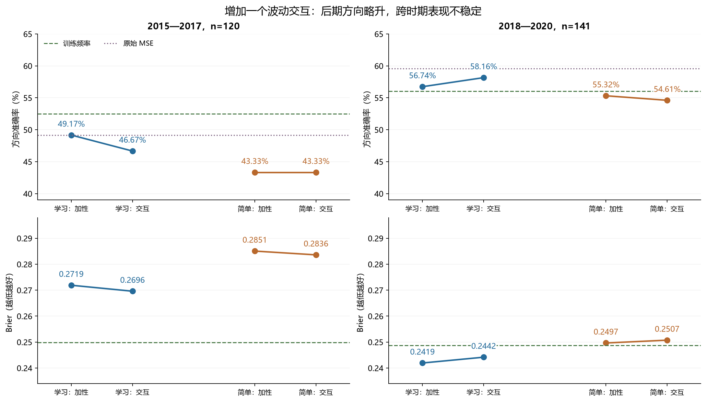
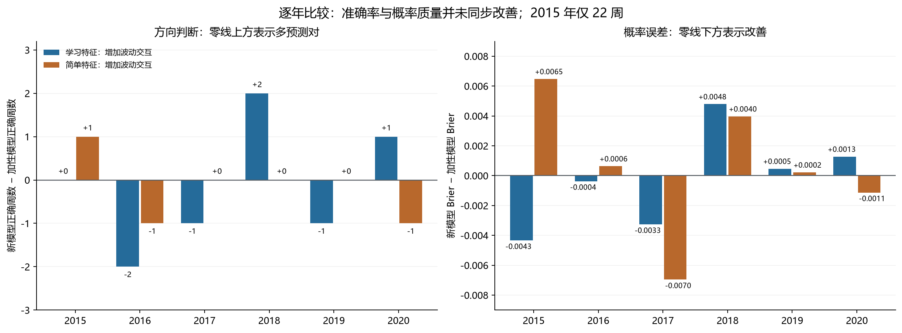

# 第十九轮方法测试：波动与已有信号的单维交互

**本轮交互没有带来稳定改善，不采用它替换现有研究基线。** 学习特征模型在后期的准确率从 56.74% 升至 58.16%，多预测对 2 周；前期从 49.17% 降至 46.67%，少预测对 3 周。后期虽然方向准确率提高，Brier 概率误差却从 0.241936 上升至 0.244168。简单特征模型前期准确率持平，后期下降。

24 个新分类头、24 组独立投影复算、1,044 条新概率和全部核验已经完成。计算复核为 PASS；两个候选均未通过预先固定的跨时期判定。16 项对比中没有显著改善，唯一通过本轮 Holm 校正的是简单特征交互模型在前期的 Brier **差于**训练频率。

所有 261 个测试日期此前均被查看，本轮设计也承接前期诊断，因此这些结果**不能作为独立确认**。本轮只检验这一种受限交互，不能据此断言所有市场状态方法无效。

## 1. 固定的问题和模型

第十八轮把市场条件直接加入分类头，本轮进一步检验：20 日波动能否调节已有信号的强度？沿用原来的加性模型，仅为每个分类头追加一个交互坐标，保留全部旧参照。

| 版本 | 直接父模型 | 原斜率数 | 新增斜率 | 总斜率 / 含截距系数 | 新拟合数 |
| --- | --- | --- | --- | --- | --- |
| 学习特征：波动交互 | 学习特征＋四项市场条件 | 29 | 1 | 30 / 31 | 18 |
| 简单特征：波动交互 | 简单特征＋趋势得分 | 26 | 1 | 27 / 28 | 6 |

学习特征来自冻结的 Crossformer 解码表示，每个截止日沿用三个既有种子；按三个头的预测概率平均，再以 p>0.5 判涨。简单特征每个截止日一个确定性头。均使用平均二元对数损失＋λ/2 倍斜率平方和，λ=0.01，截距不惩罚。阈值、种子、正则强度、交互形式和统计标准均在新拟合、新评分前冻结。

基础输入 X 完全沿用第十八轮。学习版包含 25 个解码坐标与 4 个市场条件，简单版包含 25 个价格量能特征与趋势得分。简单版原有特征已经包含波动、振幅和量能变化，本轮没有重复添加这些主效应。

## 2. 交互如何构造，如何防止线性重复

在每个年度训练折内，令 v 为第十八轮已经截尾并标准化的 20 日波动；令 b 为对应父模型前 25 个系数。先取已有表示对父模型 logit 的贡献 r=X[:, :25]b，再计算一个乘积 q=v·r。父模型后附的市场系数和截距不进入 r；简单版的原始 25 维本身仍含三项市场摘要。

对训练数据计算 A=[X,1]，以无惩罚最小二乘得到 γ=argmin‖q−Aγ‖²。再用训练残差 e=q−Aγ 的均值 μe、总体标准差 se 构造 h=(e−μe)/max(se,1e−6)。模型使用 [X,h] 联合重新拟合。下一年直接沿用该折冻结的 b、γ、μe、se；不读取下一年的涨跌标签来定义这些变换。

这样每个分类头仅增加一个不能由训练集原加性坐标线性表示的方向。旧系数保持原值且新系数为零时，精确恢复父模型及其正则化目标。24 组设计矩阵的秩均增加 1，均未触及标准差下限。训练投影去掉的是线性重复部分，并非剔除所有统计依赖。

两个限制需要明确：第一，方向 b 来自同一训练折上已经监督拟合的父模型，不是训练内折外预测；投影本身不再用标签，但 q 仍通过 b 间接使用训练标签。第二，残差化后的岭惩罚与直接追加未残差化乘积的惩罚不同，本轮没有测试后一种模型。未来残差也没有再截尾，只保留组成变量原有的训练分位数截尾。所有旧斜率均会重拟合，不能把新旧性能差全部归因于单个交互项。

## 3. 数据、时间顺序与可比性

沿用沪深 300 日线 OHLCV、原有 125 根历史输入、样本掩码和开盘到开盘的周度可执行收益标签；正收益为上涨。训练仅纳入 joint_completed 不晚于截止日的样本。测试信号日期位于下一年度的周五，收益及辅助标签须在 2020-12-31 前完成。早期测试样本只有在标签完成后才可进入更晚年度训练。

| 训练截止日 | 训练行数 | 下一年测试周数 |
| --- | --- | --- |
| 2014-12-31 | 1077 | 22 |
| 2015-12-31 | 1190 | 48 |
| 2016-12-31 | 1434 | 50 |
| 2017-12-31 | 1678 | 49 |
| 2018-12-31 | 1921 | 46 |
| 2019-12-31 | 2165 | 46 |

前期为 2015—2017 年 120 周，后期为 2018—2020 年 141 周；合并 261 周仅作描述。2015 年仍只保留 22 周，继承包括 2015-03-27 异常 OHLC 在内的历史过滤，不补齐或重新挑选日期。训练采用每日滚动的重叠周标签，各折及种子共享不少观测；合计 37,860 条训练特征行不是同量的独立市场事件。

本轮 24 个分类头全部训练结束后，才生成任何新的下一年概率。未新增神经网络训练或前向推理，使用第十七轮已经回放、第十八轮已经验证且哈希不变的缓存和市场变换。原有 4,176 条模型记录保留；新增 1,044 条后共 5,220 条，最终 12 种方法各覆盖同样 261 个日期。

本轮没有补齐论文尚缺的 78 指标清单、P0、Kronos 接口或全部超参数，也未引入未来预训练信息，仍属于现有原始 OHLCV 对照链的研究测试，不代表论文完整复现或交易收益验证。

## 4. 两个时期的实际结果

Brier 是上涨概率与实际 0/1 标签的均方误差；它和对数损失均越低越好。原始 MSE 给出收益分数，不虚构其概率或概率损失。表内列出关键参照，全部 12 种方法保存在 [完整总体指标](ensemble_metrics.csv)。

### 2015—2017，120 周

| 方法 | 正确周数 | 准确率 | 平衡准确率 | AUROC | Brier | 对数损失 |
| --- | --- | --- | --- | --- | --- | --- |
| 原始 MSE | 59 | 49.17% | 48.17% | 0.487750 | — | — |
| 学习特征：第十七轮 | 63 | 52.50% | 52.14% | 0.496761 | 0.262637 | 0.719150 |
| 学习特征：加性条件 | 59 | 49.17% | 49.55% | 0.488313 | 0.271899 | 0.740763 |
| 学习特征：波动交互 | 56 | 46.67% | 46.92% | 0.500422 | 0.269597 | 0.735540 |
| 简单特征：第十七轮 | 53 | 44.17% | 48.03% | 0.467192 | 0.283675 | 0.765637 |
| 简单特征：加性趋势 | 52 | 43.33% | 46.30% | 0.457899 | 0.285063 | 0.768797 |
| 简单特征：波动交互 | 52 | 43.33% | 46.49% | 0.448888 | 0.283603 | 0.767351 |
| 训练频率 | 63 | 52.50% | 48.79% | 0.494086 | 0.249839 | 0.692824 |

### 2018—2020，141 周

| 方法 | 正确周数 | 准确率 | 平衡准确率 | AUROC | Brier | 对数损失 |
| --- | --- | --- | --- | --- | --- | --- |
| 原始 MSE | 84 | 59.57% | 58.20% | 0.601470 | — | — |
| 学习特征：第十七轮 | 79 | 56.03% | 55.03% | 0.592283 | 0.241944 | 0.676837 |
| 学习特征：加性条件 | 80 | 56.74% | 55.84% | 0.602082 | 0.241936 | 0.676994 |
| 学习特征：波动交互 | 82 | 58.16% | 57.45% | 0.592895 | 0.244168 | 0.681889 |
| 简单特征：第十七轮 | 76 | 53.90% | 53.31% | 0.539608 | 0.250901 | 0.695053 |
| 简单特征：加性趋势 | 78 | 55.32% | 54.75% | 0.549000 | 0.249651 | 0.692508 |
| 简单特征：波动交互 | 77 | 54.61% | 53.77% | 0.538996 | 0.250733 | 0.694682 |
| 训练频率 | 79 | 56.03% | 50.00% | 0.480604 | 0.248705 | 0.690557 |

学习版前期 Brier 比加性父模型降低 0.002302，但仍明显差于第十七轮学习版及训练频率；后期 Brier 比父模型增加 0.002232，AUROC 从 0.602082 降至 0.592895。后期的 58.16% 也仍低于原始 MSE 的 59.57%。简单版前期准确率同为 43.33%，后期从 55.32% 降至 54.61%。

合并两个时期，学习交互为 138/261=52.87%，加性父模型为 139/261=53.26%；简单交互为 129/261=49.43%，加性父模型为 130/261=49.81%。原始 MSE 为 143/261=54.79%，训练频率为 142/261=54.41%。合并结果不用于掩盖前后时期差异，也不用于新增主要检验。

## 5. 逐年结果与方向变化

| 测试年 | 周数 | 原始 MSE | 学习特征：加性条件 | 学习特征：波动交互 | 简单特征：加性趋势 | 简单特征：波动交互 | 训练频率 |
| --- | --- | --- | --- | --- | --- | --- | --- |
| 2015 | 22 | 50.00% | 54.55% | 54.55% | 36.36% | 40.91% | 40.91% |
| 2016 | 48 | 52.08% | 52.08% | 47.92% | 47.92% | 45.83% | 54.17% |
| 2017 | 50 | 46.00% | 44.00% | 42.00% | 42.00% | 42.00% | 56.00% |
| 2018 | 49 | 65.31% | 61.22% | 65.31% | 55.10% | 55.10% | 42.86% |
| 2019 | 46 | 56.52% | 54.35% | 52.17% | 50.00% | 50.00% | 65.22% |
| 2020 | 46 | 56.52% | 54.35% | 56.52% | 60.87% | 58.70% | 60.87% |

学习版后期相对加性模型的正确周数变化依次为 +2、−1、+1；2018、2019、2020 三年的 Brier 却分别增加 0.004789、0.000465、0.001275。准确率仅由概率是否越过 0.5 决定，不能代替对全部概率误差的检查。2018 和 2020 年学习交互的正确周数与原始 MSE 持平，2019 年少 2 周，没有一年严格超过原始 MSE。

| 时期 | 候选 | 相对加性父模型改变方向 | 原本对→错 | 原本错→对 |
| --- | --- | --- | --- | --- |
| 2015—2017 | 学习特征：波动交互 | 7 | 5 | 2 |
| 2015—2017 | 简单特征：波动交互 | 4 | 2 | 2 |
| 2018—2020 | 学习特征：波动交互 | 4 | 1 | 3 |
| 2018—2020 | 简单特征：波动交互 | 5 | 3 | 2 |

学习版后期只改动 4 周的方向，3 周改对、1 周改错；前期改动 7 周，2 周改对、5 周改错。这是逐周记录的核对，不是额外选样本计算的新绩效。

三个学习种子的完整结果如下。集成在阈值判断之前平均概率，因此集成准确率不必位于单个种子准确率之间。

| 时期 | 种子 | 准确率 | Brier | AUROC |
| --- | --- | --- | --- | --- |
| 2015—2017 | 20260910 | 50.00% | 0.270610 | 0.516193 |
| 2015—2017 | 20260911 | 48.33% | 0.280341 | 0.500422 |
| 2015—2017 | 20260912 | 51.67% | 0.277493 | 0.493101 |
| 2018—2020 | 20260910 | 55.32% | 0.250833 | 0.576358 |
| 2018—2020 | 20260911 | 55.32% | 0.258305 | 0.552062 |
| 2018—2020 | 20260912 | 56.74% | 0.250083 | 0.578399 |

## 6. 交互是否被学到，以及能否迁移

全部分类头经过 93 次 Newton 更新达到预定收敛精度，训练正则化目标均不高于父模型。独立 L-BFGS-B 解与主解的目标差最大为 7.772e-15。可以排除本轮分类头未收敛这一解释，但训练目标降低不构成泛化证据。

| 版本 | 截止日 | 训练准确率 | 训练 Brier | 父模型目标 | 新目标 |
| --- | --- | --- | --- | --- | --- |
| 学习特征：波动交互 | 2014-12-31 | 63.51% | 0.220766 | 0.635803 | 0.635742 |
| 学习特征：波动交互 | 2015-12-31 | 63.03% | 0.222700 | 0.642524 | 0.640128 |
| 学习特征：波动交互 | 2016-12-31 | 61.69% | 0.229968 | 0.654192 | 0.653285 |
| 学习特征：波动交互 | 2017-12-31 | 61.76% | 0.227174 | 0.649293 | 0.647688 |
| 学习特征：波动交互 | 2018-12-31 | 62.50% | 0.224935 | 0.642618 | 0.642361 |
| 学习特征：波动交互 | 2019-12-31 | 62.34% | 0.227924 | 0.648983 | 0.648820 |
| 简单特征：波动交互 | 2014-12-31 | 61.56% | 0.228866 | 0.654689 | 0.654572 |
| 简单特征：波动交互 | 2015-12-31 | 60.67% | 0.234361 | 0.665397 | 0.664814 |
| 简单特征：波动交互 | 2016-12-31 | 58.30% | 0.237052 | 0.670634 | 0.670431 |
| 简单特征：波动交互 | 2017-12-31 | 58.28% | 0.241743 | 0.679438 | 0.679001 |
| 简单特征：波动交互 | 2018-12-31 | 58.41% | 0.241608 | 0.678954 | 0.678946 |
| 简单特征：波动交互 | 2019-12-31 | 57.64% | 0.243144 | 0.681867 | 0.681726 |

下面按年展示交互系数与下一年残差坐标的分布。学习版取三个种子的均值；“测试 h 标准差”是各头标准差的均值，不能当成集成变量的标准差。训练 h 的均值约为 0、标准差为 1。

| 版本 | 测试年 | 交互系数 | 测试 h 均值 | 测试 h 标准差 | 交互平均 logit | 交互 logit 标准差 |
| --- | --- | --- | --- | --- | --- | --- |
| 学习特征：波动交互 | 2015 | -0.020468 | -0.517524 | 2.117510 | 0.010659 | 0.045596 |
| 学习特征：波动交互 | 2016 | -0.136216 | -0.563984 | 2.096539 | 0.075237 | 0.291062 |
| 学习特征：波动交互 | 2017 | 0.074411 | -0.063162 | 1.910704 | 0.000245 | 0.142740 |
| 学习特征：波动交互 | 2018 | 0.118084 | 0.168754 | 0.710285 | 0.011422 | 0.084089 |
| 学习特征：波动交互 | 2019 | -0.022207 | 0.306388 | 0.921268 | -0.004807 | 0.041463 |
| 学习特征：波动交互 | 2020 | -0.024217 | 0.023389 | 1.193012 | -0.000459 | 0.045351 |
| 简单特征：波动交互 | 2015 | 0.032713 | -2.272247 | 2.490806 | -0.074332 | 0.081481 |
| 简单特征：波动交互 | 2016 | 0.071319 | 1.944752 | 1.762758 | 0.138697 | 0.125718 |
| 简单特征：波动交互 | 2017 | 0.042093 | 0.043235 | 1.468763 | 0.001820 | 0.061825 |
| 简单特征：波动交互 | 2018 | 0.061226 | 0.029938 | 1.136443 | 0.001833 | 0.069580 |
| 简单特征：波动交互 | 2019 | 0.007919 | -0.342746 | 1.191770 | -0.002714 | 0.009437 |
| 简单特征：波动交互 | 2020 | -0.033940 | 0.084354 | 1.433852 | -0.002863 | 0.048665 |

训练残差虽已正交化，下一年的分布仍会变化。简单版 2015 年 h 均值为 −2.272247、标准差为 2.490806，交互平均 logit 为 −0.074332；同年平均上涨概率从父模型的 39.97% 降到 38.31%，实际上涨比例为 59.09%。学习版前期各年的 h 标准差均值约为 1.91—2.12，也大于训练值 1。这些描述支持继续检查分布迁移，不能单凭它们证明所有误差的原因。

学习版交互系数随年度和种子变化，部分年度出现符号分歧。各年度的信号方向 b 和标准化基底本身也会变化，不能把系数变号解释为某个经济机制必然反转。所有 logit 分解仅用于核对固定模型；没有新做“删掉交互项但保留重拟合系数”的评分，也没有把这种不完整反事实当成归因。

## 7. 保留全部预设市场状态诊断

沿用第十七轮按训练数据确定的趋势三分位、波动中位数，展示趋势×波动的六个分组。ΔBrier 表示交互模型减加性父模型，负数更好。星号表示少于 20 个样本；这 12 个时期分组中有 5 个稀疏组。所有行均展示，不据此选状态、调阈值或计算挑选后的总体成绩。

| 时期 | 状态 | 周数 | 学习交互准确率 | 学习 ΔBrier | 简单交互准确率 | 简单 ΔBrier |
| --- | --- | --- | --- | --- | --- | --- |
| 2015—2017 | 低趋势 / 低波动 | 3* | 0.00% | -0.013864 | 0.00% | -0.012803 |
| 2015—2017 | 低趋势 / 高波动 | 12* | 41.67% | -0.030237 | 50.00% | +0.008674 |
| 2015—2017 | 中趋势 / 低波动 | 34 | 38.24% | +0.003844 | 38.24% | -0.010514 |
| 2015—2017 | 中趋势 / 高波动 | 7* | 28.57% | +0.008219 | 42.86% | +0.037726 |
| 2015—2017 | 高趋势 / 低波动 | 51 | 52.94% | -0.000503 | 49.02% | -0.003775 |
| 2015—2017 | 高趋势 / 高波动 | 13* | 69.23% | -0.002646 | 38.46% | +0.003464 |
| 2018—2020 | 低趋势 / 低波动 | 16* | 75.00% | +0.004697 | 68.75% | +0.001030 |
| 2018—2020 | 低趋势 / 高波动 | 25 | 56.00% | +0.001137 | 60.00% | +0.001022 |
| 2018—2020 | 中趋势 / 低波动 | 33 | 57.58% | +0.000255 | 39.39% | +0.001682 |
| 2018—2020 | 中趋势 / 高波动 | 23 | 47.83% | +0.005171 | 56.52% | +0.000912 |
| 2018—2020 | 高趋势 / 低波动 | 24 | 58.33% | +0.003251 | 58.33% | +0.002226 |
| 2018—2020 | 高趋势 / 高波动 | 20 | 60.00% | +0.000287 | 55.00% | -0.000970 |

波动、振幅、量能各自高低两组的结果也全部保存在 [状态指标](state_metrics.csv)，合计 288 个指标组。它们重复使用相同日期，不是额外独立样本。

## 8. 预先固定的统计对比与判定

两个时期各 8 项、共 16 项主要对比：两个交互候选相对直接父模型的 Brier 与方向错误率；相对各自第十七轮参照的 Brier；相对训练频率的 Brier。差值均为候选损失减参照损失，负数更好。

两个时期分别使用 8 个保留观测为一块的循环区块重采样，10,000 次，种子 20260910；报告百分位 95% 区间、中心化双侧 p，并对全部 16 个 p 做 Holm 校正。区间本身未作同时性校正。日期缺口可能令一块跨越更多自然周，统计量也没有涵盖历轮设计选择和反复查看数据的不确定性。

| 时期 | 候选 / 参照 | 指标 | 差值 | 95% 区间 | 原始 p | Holm p |
| --- | --- | --- | --- | --- | --- | --- |
| 2015—2017 | 学习特征：波动交互 / 学习特征：加性条件 | Brier | -0.002302 | [-0.008327, +0.003233] | 0.4272 | 1.0000 |
| 2015—2017 | 学习特征：波动交互 / 学习特征：加性条件 | 方向错误率 | +0.025000 | [-0.008333, +0.066667] | 0.1950 | 1.0000 |
| 2015—2017 | 简单特征：波动交互 / 简单特征：加性趋势 | Brier | -0.001460 | [-0.007146, +0.004924] | 0.6366 | 1.0000 |
| 2015—2017 | 简单特征：波动交互 / 简单特征：加性趋势 | 方向错误率 | +0.000000 | [-0.025000, +0.025000] | 1.0000 | 1.0000 |
| 2015—2017 | 学习特征：波动交互 / 学习特征：第十七轮 | Brier | +0.006960 | [-0.010248, +0.022761] | 0.4079 | 1.0000 |
| 2015—2017 | 简单特征：波动交互 / 简单特征：第十七轮 | Brier | -0.000072 | [-0.008584, +0.008760] | 0.9862 | 1.0000 |
| 2015—2017 | 学习特征：波动交互 / 训练频率 | Brier | +0.019758 | [+0.000716, +0.038142] | 0.0392 | 0.5487 |
| 2015—2017 | 简单特征：波动交互 / 训练频率 | Brier | +0.033765 | [+0.013596, +0.055770] | 0.0019 | 0.0304 |
| 2018—2020 | 学习特征：波动交互 / 学习特征：加性条件 | Brier | +0.002232 | [+0.000817, +0.003884] | 0.0048 | 0.0720 |
| 2018—2020 | 学习特征：波动交互 / 学习特征：加性条件 | 方向错误率 | -0.014184 | [-0.042553, +0.014184] | 0.3113 | 1.0000 |
| 2018—2020 | 简单特征：波动交互 / 简单特征：加性趋势 | Brier | +0.001082 | [-0.000548, +0.002905] | 0.2214 | 1.0000 |
| 2018—2020 | 简单特征：波动交互 / 简单特征：加性趋势 | 方向错误率 | +0.007092 | [-0.028369, +0.049645] | 0.6959 | 1.0000 |
| 2018—2020 | 学习特征：波动交互 / 学习特征：第十七轮 | Brier | +0.002224 | [-0.000590, +0.005120] | 0.1259 | 1.0000 |
| 2018—2020 | 简单特征：波动交互 / 简单特征：第十七轮 | Brier | -0.000168 | [-0.002782, +0.002593] | 0.9022 | 1.0000 |
| 2018—2020 | 学习特征：波动交互 / 训练频率 | Brier | -0.004537 | [-0.021825, +0.012258] | 0.5958 | 1.0000 |
| 2018—2020 | 简单特征：波动交互 / 训练频率 | Brier | +0.002027 | [-0.009707, +0.014191] | 0.7393 | 1.0000 |

没有任何改善通过 Holm 校正。唯一校正 p<0.05 的对比是简单交互在前期的 Brier 高于训练频率，差值 +0.033765，Holm p=0.0304。学习交互后期相对父模型的 Brier 退步，原始 p=0.0048，Holm p=0.0720，未通过本轮校正。这些 p 值仍是探索性结果，不能补偿已经用过的历史日期。

描述性验收使用十项严格条件：准确率超过直接父模型、第十七轮参照、原始 MSE、训练频率；Brier 低于直接父模型、第十七轮参照、训练频率；对数损失低于训练频率；至少两年准确率高于原始 MSE；至少两年 Brier 低于训练频率。每个时期十项全过且两个时期都过才满足条件，平局不算通过。

| 时期 | 候选 | 通过项数 | 跨时期通过 |
| --- | --- | --- | --- |
| 2015—2017 | 学习特征：波动交互 | 1/10 | 否 |
| 2015—2017 | 简单特征：波动交互 | 2/10 | 否 |
| 2018—2020 | 学习特征：波动交互 | 6/10 | 否 |
| 2018—2020 | 简单特征：波动交互 | 2/10 | 否 |

## 9. 对改进方向的判断

当前不采用这一波动乘积交互。市场条件识别和因果变换仍能帮助定位迁移问题，但新增状态变量、固定加性项或这个单维交互，都尚未形成可靠的跨时期提升。继续扩大同类历史特征搜索的优先级应降低。

下一步更值得检验的是训练分布的适应性：在保持当前标签、网络表示和评估参照的条件下，预先限定一个近期训练窗口，与当前扩展窗口直接比较；任何窗口或收缩强度选择应放在训练内按时间顺序的验证中。它是新的待检验假设，当前分布诊断并不能保证它有效，也不能把此前校准试验的结果移植过来。

研究结论要进一步确认，应冻结少量候选并积累未用于选型的未来预测记录，或使用经过历史使用记录核对的独立数据。当前 261 周以及更晚的部分历史区间在前轮已有使用，不能直接改名为新测试集。本轮没有执行上述后续实验。

## 10. 独立复核和交付证据

| 检查项目 | 结果 |
| --- | --- |
| 新分类头 / 独立 L-BFGS-B 解 | 24 / 24 |
| SVD 投影 / 独立主元 QR 复核 | 24 / 24 |
| Newton 更新 | 93 |
| 系数合计（含截距） | 726 |
| 新增神经训练 / 前向推理 | 0 / 0；继承 18 个既有网络回放证据 |
| 训练特征行 | 37,860 |
| 新概率 / 沿用模型记录 | 1,044 / 4,176 |
| 模型记录 / 集成记录 | 5,220 / 3,132 |
| 指标组 / 状态指标组 | 441 / 288 |
| 概率分箱 / 主要对比 | 110 / 16 |
| 最大新预测误差 | 4.441e-16 |
| QR 训练拟合值最大差 | 1.990e-14 |
| QR 训练标准化残差最大差 | 3.597e-14 |
| QR 下一年标准化残差最大差 | 2.531e-14 |
| 独立分类目标最大差 | 7.772e-15 |
| 独立解训练概率最大差 | 1.435e-07 |
| 独立解梯度最大值 | 1.509e-08 |
| 旧证据哈希不变 | 2,882 个文件 |
| 独立保留日期 | 0 |

复核覆盖训练索引、原始父模型权重、冻结标准化输入、SVD 与主元 QR 的投影一致性、父模型精确嵌套、Newton 回放和另一求解器、逐条预测与集成、交互贡献分解、441 组指标、110 个概率分箱、16 项区块对比及 Holm 校正。未来输入变换不改动训练参数，旧预测数值不变。复核 PASS 说明这些计算与协议一致，不代表方法性能通过。

协议 SHA-256：`7dbf77eda58313c4dc8100ba9dad64013f823eb65b3d40925bcd4c8a3a609834`。

主要证据：[冻结协议](../protocol.json)；[总体指标](ensemble_metrics.csv)；[逐年指标](yearly_metrics.csv)；[逐种子指标](seed_metrics.csv)；[方向变化](direction_changes.csv)；[交互诊断](interaction_diagnostics.csv)；[逐周交互分解](interaction_components.csv)；[训练和测试分布](component_summary.csv)；[独立投影](projection_verification.csv)；[独立分类解](independent_solver_verification.csv)；[主要对比](primary_comparisons.json)；[十项判定](assessments.json)；[完整复核](verification.json)。

两张图均保存为 PNG 与 SVG。交付后可运行 `python research_v19/delivery19.py` 进行只读核验。
