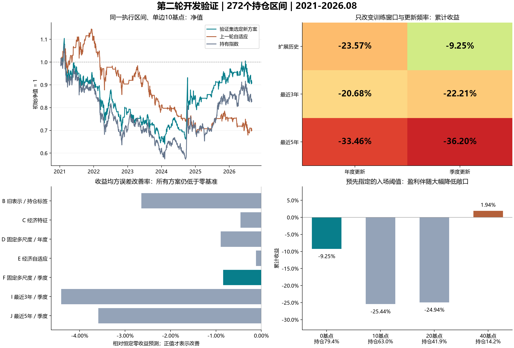

# 第二轮测试：目标对齐、经济特征与滚动训练

日期：2026-09-09。完成12个建模方案、4个旧模型／常数基准、3个阈值变体，共19组、5168条预测。**这一轮改善了部分净值表现，但没有找到可以确认的稳定预测优势。**

验证集选出的方案是 **F：经济特征＋固定5/10/20日多尺度＋扩展历史＋季度更新**。在下一交易日开盘执行、单边10基点假设成本下，累计收益从上一轮自适应的 **-30.06%** 改为 **-9.25%**，持有指数为 **-17.28%**。然而F方向准确率只有 **51.10%**，收益相关系数 **0.027**，RMSE仍高于恒定零收益基准。净收益改善也未通过区块bootstrap检验。

所有2021—2026年结果都属于**已看过历史的开发验证**。本轮的方案与参数网格在运行前冻结，参数只由2018—2020年选定；这不能把旧区间恢复成从未使用过的最终留出集。

## 1. 测试协议与可比较性

- 沿用上一轮腾讯OHLCV快照，未重新下载价格。主输入125根日线；异常OHLC的日历行保留，含异常的训练输入／标签区间排除。
- 保持上一轮的272个周五信号日：2021-01-08至2026-08-21。首笔可执行开盘为2021-01-11，最后平仓开盘为2026-08-31。
- 新标签为“下一开盘到下一次周五信号之后开盘”的简单收益，跨节假日允许持仓天数变化。训练使用所有工作日，对每一天建立“本日之后开盘到下次同星期几之后开盘”的类似周度标签；测试只取周五。
- A和B训练样本严格一致，须同时满足旧收盘标签与新持仓标签已完全实现。训练截止日之前无法完成的标签不进入训练。最近3年／5年窗口按**样本起点日期**筛选，输入125日可以伸到训练窗口起点之前，但不能越过当前预测时点。
- 每个折的标准化参数只取训练行。P0只有旧表示和经济自适应方案需要：验证期用2017年底以前的已保存P0，2021年后用上一轮对应年度P0；其他模型不使用P0。
- 所有回归方案比较λ∈{0.001,0.01,0.1,1,10}，目标为平均平方损失加λ乘系数平方和，随样本数缩放，保证短窗口的惩罚强度可比。10个ridge方案都选了λ=10，即网格最大值；它提示模型倾向很强的收缩，**不能据此声称已经找到最优惩罚系数**。本轮没有看结果后扩大网格。
- 概率模型用L2 logistic regression，按验证log loss选λ，仓位取上涨概率>0.5；其收益幅度预测用概率乘训练期条件均值，只是另一个诊断输出，不与概率阈值混淆。

**准确率口径发生了变化。** 上轮51.47%针对五日收盘收益；本轮统一对实际开盘持仓收益评分。原有自适应模型不改预测和仓位，按新标签准确率为53.31%。因此应将F的51.10%与53.31%比较，不能把两个不同标签下的数字直接当成改进。两个标签有27个区间方向不同。

原版多输出ridge各输出独立拟合；A/B的变化是价格标准化目标改为直接收益及持仓标签对齐，不能解释成“删掉其他输出释放了模型容量”。上一轮导出结果是外部参考；A和B才是仅改变标签的严格对照。

## 2. 表示与训练方式

| 方案 | 修改内容 | 特征维数 |
|---|---|---|
| A → B | 旧自适应表示保持相同，收盘收益改为实际持仓收益 | 700 |
| B → C | 改成经济特征：收益、开盘跳空、实体、振幅、上下影线、相对量、收盘位置 | 75 |
| C → D | 在经济特征上加入固定5/10/20日多尺度片段统计 | 255 |
| C → E | 在经济特征上加入自适应片段统计与时长／位置／有效位 | 250 |
| D/F/G/H/I/J | 同一固定多尺度表示；扩展／3年／5年 × 年度／季度更新 | 255 |
| K/L | 概率预测：扩展年度、5年季度 | 255 |

经济基底由最近5根K线的8个通道，以及5/10/20/60/125日的7个统计组成。片段额外统计为收益和、收益标准差、平均振幅、平均相对成交量。每次仅使用125日窗口内部数据；第一根无前收盘，收益和跳空设为0，量均值只用已知前缀，不回填未来。经济自适应的插值采样改成统计聚合，仍保留时长和实际结束位置。

## 3. 全部开发验证结果

下表全部按同一持仓收益标签评分、同一执行起止时间核算，成本为每次单边仓位变化10基点（0.10%）。平衡准确率平均上涨与非上涨两类召回率；恒定空仓的52.94%只是样本中非上涨比例，平衡准确率为50%。

| 方案 | 方向准确率 | 平衡准确率 | 持仓收益RMSE | 累计净收益 | 最大回撤 | 持仓时间 |
|---|---|---|---|---|---|---|
| A 旧表示＋直接收盘收益 | 51.10% | 52.47% | 2.6746% | -25.06% | -41.45% | 73.21% |
| B 旧表示＋持仓收益 | 51.10% | 52.43% | 2.6766% | -23.56% | -41.88% | 72.40% |
| C 经济特征75维 | 47.79% | 50.61% | 2.6480% | -16.10% | -46.65% | 97.58% |
| D 多尺度／扩展历史／年度 | 50.74% | 52.47% | 2.6537% | -23.57% | -41.68% | 79.72% |
| E 经济特征＋自适应分段 | 47.79% | 50.26% | 2.6435% | -17.82% | -43.18% | 91.80% |
| F 多尺度／扩展历史／季度 | 51.10% | 52.82% | 2.6530% | -9.25% | -42.09% | 79.43% |
| G 多尺度／最近3年／年度 | 51.10% | 50.52% | 2.7187% | -20.68% | -38.59% | 39.68% |
| H 多尺度／最近5年／年度 | 50.00% | 49.52% | 2.6997% | -33.46% | -43.07% | 41.73% |
| I 多尺度／最近3年／季度 | 50.74% | 50.39% | 2.6995% | -22.21% | -37.42% | 43.56% |
| J 多尺度／最近5年／季度 | 47.79% | 47.48% | 2.6889% | -36.20% | -45.34% | 44.95% |
| K 上涨概率／扩展历史／年度 | 49.63% | 50.61% | 2.6572% | -29.63% | -43.31% | 66.76% |
| L 上涨概率／最近5年／季度 | 46.32% | 46.22% | 2.6608% | -38.43% | -42.91% | 47.44% |
| 上一轮自适应模型 | 53.31% | 53.65% | 2.8838% | -30.06% | -40.70% | 54.90% |
| 上一轮固定10日模型 | 51.47% | 51.82% | 2.8309% | -29.33% | -37.74% | 55.86% |
| 持有指数 | 47.06% | 50.00% | 2.6419% | -17.28% | -46.66% | 100.00% |
| 恒定零收益／空仓 | 52.94% | 50.00% | 2.6419% | 0.00% | 0.00% | 0.00% |

F仅在其他被测ridge经济表示候选中由验证RMSE选出。验证期F的RMSE为 **3.056180%**，恒定零收益为 **3.056041%**，F甚至没有优于这个弱基准。因此“验证集选中”只表示它是候选模型中选出的方案，不能解释成已经通过了有效性门槛。

F相对上一轮自适应，平均每个周度区间的净收益差为 **+11.13基点**，8观测区块bootstrap的95%区间为 **[-10.00，+35.92]基点**，p=0.3339。它不是总累计收益差的置信区间；两者不能混用。

## 4. 哪些改法得到了支持

**标签对齐：完成了任务口径修正，未带来明确统计增益。** B相对A的RMSE略增，两个方案方向准确率相同，净值仅小幅不同。后续研究仍应沿用可执行持仓标签，理由是任务一致，而非本轮证明它提高了预测能力。

**经济特征：误差有改善迹象，强度有限。** C相对B的RMSE降低，未校正区间为负，但在10项预设比较做Holm校正后p约0.221。C几乎一直持仓（97.58%时间），其净值接近持有指数。E相对C/D的改善也不明确，不能声称自适应分段已证实有效。

**滚动窗口：没有支持最近3年／5年更好。** 在相同多尺度特征下，短窗口并没有系统性改善误差与收益，5年季度方案表现更差。F与D的季度／年度差异在收益误差上极小。

**季度净值改善集中在少数区间。** F与D仅有 **7个**周度仓位不同。最大的正向净对数收益差来自 **2024-09-20** 信号对应持仓区间，贡献0.1848；全部区间合计差为0.1718。扣除这一个区间的贡献，剩余差为-0.0130，已经转负。这只是对固定预测结果做贡献分解，未删样本重训，也未据此改变规则；它说明净值改善对单段行情敏感。

**概率模型：本轮未优于收益回归。** K/L的持仓方向准确率分别为49.63%和46.32%，没有显示概率输出本身就能解决问题。也未进行测试期校准或搜索新的概率阈值。

预先规定的10组ridge比较如下，RMSE变化以收益基点表示，负数才是改善。区块bootstrap为8个周度观测、10000次，MSE差异p值做Holm多重比较校正。区间为各比较的未校正95%区间，因此有时区间不跨0而校正p值仍大于0.05；本轮都属于探索性开发证据。

| 受控比较 | RMSE变化（基点，负值好） | 95%区间（基点） | MSE差异Holm校正p值 |
|---|---|---|---|
| B 对 A | +0.203 | [-0.057, +0.481] | 0.9071 |
| C 对 B | -2.864 | [-5.696, -0.610] | 0.2210 |
| D 对 C | +0.573 | [-1.064, +2.101] | 1.0000 |
| E 对 C | -0.446 | [-1.626, +0.605] | 1.0000 |
| E 对 D | -1.018 | [-2.779, +0.780] | 1.0000 |
| F 对 D | -0.065 | [-0.397, +0.264] | 1.0000 |
| G 对 D | +6.503 | [+0.680, +12.552] | 0.3042 |
| H 对 D | +4.597 | [+0.043, +8.792] | 0.4680 |
| I 对 G | -1.924 | [-5.401, +1.065] | 1.0000 |
| J 对 H | -1.074 | [-3.261, +1.439] | 1.0000 |

## 5. 交易阈值：不能把空仓判对算成预测突破

在验证集选出的F上，预先规定0/10/20/40基点阈值：预期持仓收益超过阈值才持仓，其余空仓。没有从2021年后的表现中选定最终阈值。0阈值就是F，10/20/40阈值都保留。

| 入场阈值（基点） | 持仓周度区间数 | 持仓区间上涨比例 | 持仓时间 | 累计净收益 | 最大回撤 |
|---|---|---|---|---|---|
| 0 | 215 | 48.84% | 79.43% | -9.25% | -42.09% |
| 10 | 171 | 47.37% | 63.03% | -25.44% | -39.84% |
| 20 | 113 | 48.67% | 41.95% | -24.94% | -34.18% |
| 40 | 39 | 56.41% | 14.20% | 1.94% | -12.64% |

40基点方案累计盈利1.94%，但仅在39个周度区间持仓，实际持仓时间14.20%。39段中22段上涨（56.41%）；以所有272段的“仓位是否对应上涨”计算得到54.78%，该数字受大量空仓影响，**不能称为模型原始方向准确率提升到54.78%**。实际连续开平仓是15个往返（30次单边变化），比39个有敞口区间更少。该方案年化收益仅0.34%，开盘净值最大回撤12.64%，Sharpe约0.084。

| 单边成本（基点） | F累计收益 | F＋40基点阈值累计收益 | 持有指数累计收益 |
|---|---|---|---|
| 0 | -4.79% | 5.04% | -17.12% |
| 5 | -7.05% | 3.48% | -17.20% |
| 10 | -9.25% | 1.94% | -17.28% |
| 20 | -13.51% | -1.08% | -17.45% |

成本提高到单边20基点时，40基点阈值方案转为亏损1.08%。10和20基点入场阈值都较差，没有呈现稳定的阈值附近表现；本轮不将40基点选成最终策略。

以上是价格指数代理，仓位仅为指数多头或现金，现金利息为0；成本为假设综合摩擦，不代表ETF／期货实际费用。没有模拟ETF分红、跟踪误差、期货基差或成交冲击。净值按下一开盘到下一开盘记账，回撤不是盘中回撤。

## 6. 年份表现与验证选参

| 年份 | 周度区间数 | F准确率 | 上一轮自适应，同标签 | 始终看涨 | F收益相关系数 |
|---|---|---|---|---|---|
| 2021 | 50 | 52.00% | 66.00% | 46.00% | 0.043 |
| 2022 | 49 | 46.94% | 48.98% | 40.82% | 0.049 |
| 2023 | 48 | 47.92% | 54.17% | 39.58% | 0.016 |
| 2024 | 47 | 51.06% | 44.68% | 46.81% | 0.004 |
| 2025 | 48 | 60.42% | 50.00% | 62.50% | 0.152 |
| 2026 | 30 | 46.67% | 56.67% | 46.67% | -0.058 |

每年区间数量仍然很少。总体相关系数接近0，没有多个年份持续显著的预测表现。验证期共有141个完整周度标签，2018—2020按对应年度／季度时点重新训练，用完整验证预测路径选择λ。

| 方案 | 选定惩罚系数λ | 验证期收益RMSE | 选参依据 |
|---|---|---|---|
| A 旧表示＋直接收盘收益 | 10.0 | 3.0938% | 持仓收益RMSE |
| B 旧表示＋持仓收益 | 10.0 | 3.0956% | 持仓收益RMSE |
| C 经济特征75维 | 10.0 | 3.0572% | 持仓收益RMSE |
| D 多尺度／扩展历史／年度 | 10.0 | 3.0641% | 持仓收益RMSE |
| E 经济特征＋自适应分段 | 10.0 | 3.0671% | 持仓收益RMSE |
| F 多尺度／扩展历史／季度 | 10.0 | 3.0562% | 持仓收益RMSE |
| G 多尺度／最近3年／年度 | 10.0 | 3.1172% | 持仓收益RMSE |
| H 多尺度／最近5年／年度 | 10.0 | 3.0777% | 持仓收益RMSE |
| I 多尺度／最近3年／季度 | 10.0 | 3.1142% | 持仓收益RMSE |
| J 多尺度／最近5年／季度 | 10.0 | 3.0693% | 持仓收益RMSE |
| K 上涨概率／扩展历史／年度 | 1.0 | 3.0463% | log loss |
| L 上涨概率／最近5年／季度 | 10.0 | 3.0648% | log loss |

尽管K的验证收益RMSE略低，K按分类损失选择，预先定义的最终ridge方案选择不包含概率模型；没有在开发期看到结果后把两类模型合并重新挑选。

## 7. 文件、验证与结论

冻结规则：[protocol.json](../protocol.json)。全部结果都在本次 `research_v2/`，上一轮的 **81份**源码／数据／结果文件经SHA-256对比未改变。

- [predictions.csv](predictions.csv)：19组×272次，包含预测、实际持仓收益、概率、仓位、入场／退出日索引、训练截止日。
- [selection.json](selection.json)、[validation_predictions.csv](validation_predictions.csv)：验证选择及全部参数候选预测。
- [folds.json](folds.json)：212个训练折，包含窗口起点、最后已完成标签、测试起止日。
- [paired_comparisons.json](paired_comparisons.json)、[selected_pipeline_comparisons.json](selected_pipeline_comparisons.json)：完整统计。
- [cost_sensitivity.csv](cost_sensitivity.csv)、[weekly_net_returns_10bps.csv](weekly_net_returns_10bps.csv)：成本与周度记账。
- [verification.json](verification.json)、[test_results.txt](test_results.txt)：验证通过。8项单元检查、5168条持仓标签独立重算、所有训练截止日和滚动窗口边界核对；逐日净值与周度复利一致，上一轮模型原始净值逐成本场景对账一致。
- [influence_diagnostics.json](influence_diagnostics.json)：季度／年度差异贡献与零预测验证基准，属于结果诊断。

**本轮完成了授权的目标、特征、训练窗口／频率测试，并附带概率与阈值对照。结果不支持宣称找到稳定有效的方法。** 标签对齐与经济特征可以保留为下一步实验基础；缩短历史和季度更新的收益优势没有得到可靠证明。40基点阈值的小额盈利应保留为待验证现象。

这轮没有训练Kronos、Crossformer、树模型或时序神经网络。非线性／预训练组合仍是后续独立实验；需要重新冻结范围、训练边界和新的验证安排，不能将这次已看过的开发结果当作其最终留出测试。
