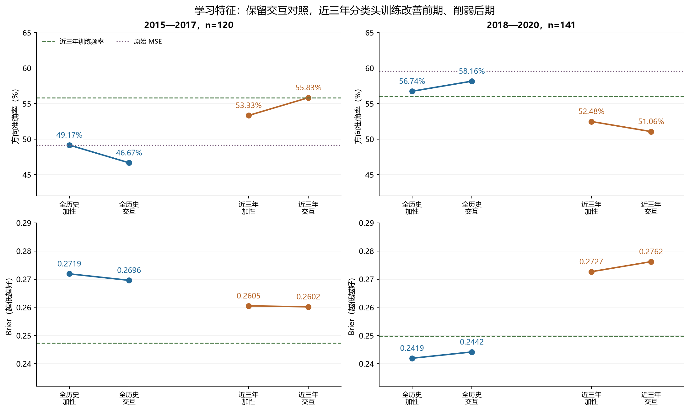
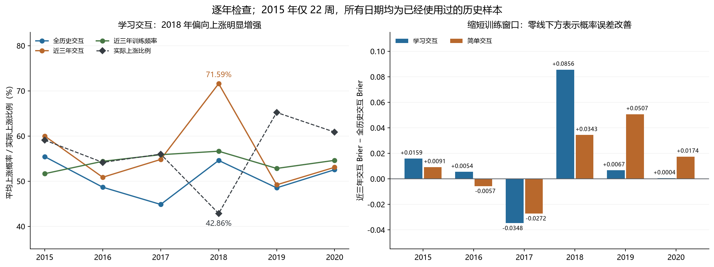

# 第二十轮方法测试：保留交互，比较近三年与全历史训练

**已保留第十九轮交互模型，完成四种新版本共 48 个分类头的训练及独立复核。本轮不采用三年硬截断窗口，继续保留全历史交互作为后续对照。** 学习交互改用近三年样本拟合分类头后，前期准确率从 46.67% 升至 55.83%，后期却从 58.16% 降至 51.06%。这一变化没有延续原交互在后期的方向改善。

用户指出的改善仍明确保留：在全历史训练下，第十九轮交互使 2018—2020 年准确率由加性模型的 56.74% 提高到 58.16%，多预测对 2 周。它是值得跟踪的局部线索；当时概率误差上升、前期退步的限制也同时保留。未通过跨时期筛选，不等于删除这个研究方向。

本轮“近三年”只限定最后分类头拟合损失使用的标签行。神经表示、截尾标准化、交互信号方向及投影均沿用每年冻结的全历史版本，仍包含更早数据的影响；这不是整条模型只用近三年数据重新训练的实验。

## 1. 四格对照与实际训练范围

| 分类头训练样本 | 不含乘积交互 | 含第十九轮乘积交互 |
| --- | --- | --- |
| 截止日前全部可用记录 | 第十八轮加性模型，保留 | 第十九轮交互模型，保留 |
| 截止日前三个日历年 | 本轮重新拟合 | 本轮重新拟合 |

两种特征族分别完整比较这四格。学习特征在每个年度使用三个原有种子并平均概率；简单价格量能特征每年一个确定性头。新加性头维数分别为 29、26，新交互头分别为 30、27；每个头再含一个截距。全体采用 λ=0.01 的岭逻辑回归，截距不惩罚，严格 p>0.5 判涨。

所有新头使用原有冻结坐标，唯一改变是拟合损失的样本成员。三年窗口按信号日期筛选：从截止年份往前数第三年的 1 月 1 日起，并且收益及辅助标签已经在截止日完成。没有搜索窗口长度、正则强度、种子、状态、阈值或验证期最优权重。

| 截止日 | 近三年起点 | 全历史行数 | 近三年行数 | 全历史上涨频率 | 近三年上涨频率 | 下一年周数 |
| --- | --- | --- | --- | --- | --- | --- |
| 2014-12-31 | 2012-01-01 | 1077 | 720 | 49.21% | 51.67% | 22 |
| 2015-12-31 | 2013-01-01 | 1190 | 590 | 50.34% | 54.41% | 48 |
| 2016-12-31 | 2014-01-01 | 1434 | 596 | 50.70% | 55.87% | 50 |
| 2017-12-31 | 2015-01-01 | 1678 | 595 | 52.03% | 56.64% | 49 |
| 2018-12-31 | 2016-01-01 | 1921 | 725 | 51.12% | 52.83% | 46 |
| 2019-12-31 | 2017-01-01 | 2165 | 725 | 52.15% | 54.62% | 46 |

加入“近三年上涨频率”常数概率参照，它使用与新分类头完全相同的标签。六个频率均超过 0.5，所以它在所有测试日期均预测上涨。前期正确 67/120=55.83%，后期正确 79/141=56.03%。这避免将样本上涨比例变化误当作复杂模型的收益。旧全历史频率也继续保留。

原有沪深 300 OHLCV、125 根历史输入、开盘到开盘的周度收益标签及样本过滤保持一致。测试信号是下一年度周五，标签须于 2020-12-31 前完整；训练标签须不晚于各截止日。2015 年只有 22 周，继续沿用异常 OHLC 与受影响历史窗口的排除规则。前期 120 周、后期 141 周，合并 261 周仅作描述。

## 2. 交互如何保留，哪些内容没有重估

沿用第十九轮的一维交互：在加性坐标 X 中取前 25 项与原加性头前 25 个系数的乘积 r，乘以冻结标准化的 20 日波动 v，得到 q=v·r；再减去原训练折内 q 对 [X,1] 的最小二乘投影，并按原训练残差均值和标准差标准化，得到 h。

本轮读取原来的 [X,h] 缓存，筛选近三年的行用于新分类头训练。测试年采用完全相同的原 h 定义。没有重估信号方向、投影、残差尺度、基础特征分位数或神经表示。h 在近三年子集中不必均值为 0、标准差为 1，也不保证继续正交；这是固定坐标对照的预期性质。

原交互方向由全历史监督拟合的父模型决定，包含更早标签的信息，并不是训练内折外信号。因此，本轮可以讨论“既定特征坐标下缩短分类头训练窗口”的效果，不能把它推广为所有近期训练方案的结论。24 个近期交互头仍精确包含各自近期加性头：将交互系数置零并使用相同加性系数，就得到同一预测和正则化目标。

## 3. 两个时期的完整关键对照

Brier 与对数损失均越低越好。原始 MSE 输出收益分数，不补造概率损失。其余六个历史参照也全部保留在 [17 种方法总体指标](ensemble_metrics.csv)，下表展示本轮四格及必要基准。

### 2015—2017，120 周

| 方法 | 正确周数 | 准确率 | 平衡准确率 | AUROC | Brier | 对数损失 |
| --- | --- | --- | --- | --- | --- | --- |
| 原始 MSE | 59 | 49.17% | 48.17% | 0.487750 | — | — |
| 学习：全历史加性 | 59 | 49.17% | 49.55% | 0.488313 | 0.271899 | 0.740763 |
| 学习：全历史交互 | 56 | 46.67% | 46.92% | 0.500422 | 0.269597 | 0.735540 |
| 学习：近三年加性 | 64 | 53.33% | 51.70% | 0.526331 | 0.260529 | 0.720085 |
| 学习：近三年交互 | 67 | 55.83% | 54.14% | 0.526049 | 0.260195 | 0.718545 |
| 简单：全历史加性 | 52 | 43.33% | 46.30% | 0.457899 | 0.285063 | 0.768797 |
| 简单：全历史交互 | 52 | 43.33% | 46.49% | 0.448888 | 0.283603 | 0.767351 |
| 简单：近三年加性 | 59 | 49.17% | 48.37% | 0.491692 | 0.268763 | 0.739950 |
| 简单：近三年交互 | 58 | 48.33% | 47.03% | 0.489158 | 0.271686 | 0.750269 |
| 全历史训练频率 | 63 | 52.50% | 48.79% | 0.494086 | 0.249839 | 0.692824 |
| 近三年训练频率 | 67 | 55.83% | 50.00% | 0.494086 | 0.247304 | 0.687746 |

### 2018—2020，141 周

| 方法 | 正确周数 | 准确率 | 平衡准确率 | AUROC | Brier | 对数损失 |
| --- | --- | --- | --- | --- | --- | --- |
| 原始 MSE | 84 | 59.57% | 58.20% | 0.601470 | — | — |
| 学习：全历史加性 | 80 | 56.74% | 55.84% | 0.602082 | 0.241936 | 0.676994 |
| 学习：全历史交互 | 82 | 58.16% | 57.45% | 0.592895 | 0.244168 | 0.681889 |
| 学习：近三年加性 | 74 | 52.48% | 50.13% | 0.504900 | 0.272657 | 0.749447 |
| 学习：近三年交互 | 72 | 51.06% | 48.87% | 0.494692 | 0.276218 | 0.758887 |
| 简单：全历史加性 | 78 | 55.32% | 54.75% | 0.549000 | 0.249651 | 0.692508 |
| 简单：全历史交互 | 77 | 54.61% | 53.77% | 0.538996 | 0.250733 | 0.694682 |
| 简单：近三年加性 | 72 | 51.06% | 50.78% | 0.522458 | 0.284998 | 0.798703 |
| 简单：近三年交互 | 69 | 48.94% | 48.88% | 0.523683 | 0.284877 | 0.798863 |
| 全历史训练频率 | 79 | 56.03% | 50.00% | 0.480604 | 0.248705 | 0.690557 |
| 近三年训练频率 | 79 | 56.03% | 50.00% | 0.397713 | 0.249700 | 0.692596 |

学习版在近三年窗口内增加交互，前期从 53.33% 升至 55.83%，增加 3 个正确周；后期从 52.48% 降至 51.06%，减少 2 个正确周。前期 55.83% 恰好等于近三年频率基准，而 Brier 0.260195 高于基准的 0.247304。后期 Brier 0.276218 也高于旧全历史交互的 0.244168。

简单版改用近三年样本后，加性模型前期从 43.33% 升至 49.17%，后期从 55.32% 降至 51.06%；交互模型前期从 43.33% 升至 48.33%，后期从 54.61% 降至 48.94%。近期信息并未在两个时期带来同方向改善。

合并 261 周，近三年学习交互准确率为 53.26%，旧全历史交互为 52.87%，但 Brier 从 0.255860 上升到 0.268851。只看合并准确率会掩盖后期损失，不能据此选择新版本。

## 4. 逐年检查：2017 改善，2018 明显退步

### 学习特征方向准确率

| 年份 | 周数 | 学习：全历史加性 | 学习：全历史交互 | 学习：近三年加性 | 学习：近三年交互 | 原始 MSE | 近三年频率 |
| --- | --- | --- | --- | --- | --- | --- | --- |
| 2015 | 22 | 54.55% | 54.55% | 54.55% | 54.55% | 50.00% | 59.09% |
| 2016 | 48 | 52.08% | 47.92% | 45.83% | 50.00% | 52.08% | 54.17% |
| 2017 | 50 | 44.00% | 42.00% | 60.00% | 62.00% | 46.00% | 56.00% |
| 2018 | 49 | 61.22% | 65.31% | 42.86% | 42.86% | 65.31% | 42.86% |
| 2019 | 46 | 54.35% | 52.17% | 60.87% | 58.70% | 56.52% | 65.22% |
| 2020 | 46 | 54.35% | 56.52% | 54.35% | 52.17% | 56.52% | 60.87% |

### 简单特征方向准确率

| 年份 | 周数 | 简单：全历史加性 | 简单：全历史交互 | 简单：近三年加性 | 简单：近三年交互 | 原始 MSE | 近三年频率 |
| --- | --- | --- | --- | --- | --- | --- | --- |
| 2015 | 22 | 36.36% | 40.91% | 36.36% | 36.36% | 50.00% | 59.09% |
| 2016 | 48 | 47.92% | 45.83% | 58.33% | 50.00% | 52.08% | 54.17% |
| 2017 | 50 | 42.00% | 42.00% | 46.00% | 52.00% | 46.00% | 56.00% |
| 2018 | 49 | 55.10% | 55.10% | 51.02% | 48.98% | 65.31% | 42.86% |
| 2019 | 46 | 50.00% | 50.00% | 50.00% | 45.65% | 56.52% | 65.22% |
| 2020 | 46 | 60.87% | 58.70% | 52.17% | 52.17% | 56.52% | 60.87% |

近三年学习交互相对旧全历史交互的正确周数变化为：2015 年 0、2016 年 +1、2017 年 +10、2018 年 −11、2019 年 +3、2020 年 −2。2017 年从 21/50 提高到 31/50，是前期改善的主要来源；2018 年从 32/49 降到 21/49，是后期退步的主要来源。不能只留下其中一个年度作为整体结论。

2018 年近三年加性与交互模型都在 49 周中的 47 周预测上涨，平均上涨概率分别为 71.11%、71.59%；实际只有 42.86% 的周上涨。旧全历史交互平均概率为 54.60%，其方向准确率为 65.31%，新近三年交互则为 42.86%。新加性模型也已退步，因此后期问题并非只有交互版本出现。

截至 2017 年末，近三年训练只保留 595 行，全历史为 1,678 行；训练上涨频率从 52.03% 变为 56.64%。这与 2018 年的预测偏移同时出现，但不足以证明全部误差由上涨频率或样本量造成。固定表示下的全部斜率和截距也重新拟合，不能从单项描述直接作因果归因。

| 时期 | 近期交互版本 | 参照 | 改变方向周数 | 正确→错误 | 错误→正确 |
| --- | --- | --- | --- | --- | --- |
| 2015—2017 | 学习：近三年交互 | 学习：全历史交互 | 23 | 6 | 17 |
| 2015—2017 | 学习：近三年交互 | 学习：近三年加性 | 5 | 1 | 4 |
| 2015—2017 | 简单：近三年交互 | 简单：全历史交互 | 52 | 23 | 29 |
| 2015—2017 | 简单：近三年交互 | 简单：近三年加性 | 11 | 6 | 5 |
| 2018—2020 | 学习：近三年交互 | 学习：全历史交互 | 28 | 19 | 9 |
| 2018—2020 | 学习：近三年交互 | 学习：近三年加性 | 2 | 2 | 0 |
| 2018—2020 | 简单：近三年交互 | 简单：全历史交互 | 56 | 32 | 24 |
| 2018—2020 | 简单：近三年交互 | 简单：近三年加性 | 5 | 4 | 1 |

近三年学习交互相对近三年加性模型，后期只改变 2 周方向，均从正确变错误；相对旧全历史交互，则改动 28 周，其中 19 周改错、9 周改对。方向变化与窗口变化的规模不同，四格对照应继续保留。

## 5. 交互增量随训练窗口如何变化

下面用同一批逐周损失做代数比较：各窗口内先计算交互减加性的损失增量，再计算近期增量减全历史增量。最后一列负值表示近期窗口中的交互增量更有利。它没有额外拟合或挑选日期，也不是因果机制或新增显著性检验。

| 时期 | 特征族 | 指标 | 全历史交互增量 | 近三年交互增量 | 增量之差 |
| --- | --- | --- | --- | --- | --- |
| 2015—2017 | 学习 | Brier | -0.002302 | -0.000334 | +0.001968 |
| 2015—2017 | 学习 | 方向错误率 | +0.025000 | -0.025000 | -0.050000 |
| 2015—2017 | 简单 | Brier | -0.001460 | +0.002923 | +0.004384 |
| 2015—2017 | 简单 | 方向错误率 | +0.000000 | +0.008333 | +0.008333 |
| 2018—2020 | 学习 | Brier | +0.002232 | +0.003561 | +0.001329 |
| 2018—2020 | 学习 | 方向错误率 | -0.014184 | +0.014184 | +0.028369 |
| 2018—2020 | 简单 | Brier | +0.001082 | -0.000120 | -0.001202 |
| 2018—2020 | 简单 | 方向错误率 | +0.007092 | +0.021277 | +0.014184 |

学习交互在全历史后期降低方向错误率 1.42 个百分点，在近三年后期却增加 1.42 个百分点；前期则由增加 2.50 个百分点变为降低 2.50 个百分点。交互的作用依赖这次训练样本选择，当前证据不支持把某个窗口的改善外推到所有时期。

下面记录交互系数变化与近期输入分布。学习版取三个头的均值，标准差一列也是各头标准差的均值，不是集成变量的标准差。每个截止日的新旧系数使用同一冻结坐标，可以比较系数变化；跨年度坐标仍不同。

| 版本 | 测试年 | 原交互系数 | 新交互系数 | 近期 h 均值 | 近期 h 标准差 | 测试交互平均 logit |
| --- | --- | --- | --- | --- | --- | --- |
| 学习：近三年交互 | 2015 | -0.020468 | 0.053780 | -0.061605 | 1.054096 | -0.021718 |
| 学习：近三年交互 | 2016 | -0.136216 | -0.106095 | -0.159166 | 1.132151 | 0.055075 |
| 学习：近三年交互 | 2017 | 0.074411 | 0.065954 | -0.149320 | 1.238077 | 0.006809 |
| 学习：近三年交互 | 2018 | 0.118084 | 0.144535 | -0.076871 | 1.348182 | 0.018260 |
| 学习：近三年交互 | 2019 | -0.022207 | -0.098143 | -0.101501 | 1.228179 | -0.028943 |
| 学习：近三年交互 | 2020 | -0.024217 | -0.060755 | -0.031357 | 1.069924 | -0.000602 |
| 简单：近三年交互 | 2015 | 0.032713 | 0.050091 | 0.094924 | 1.098666 | -0.113819 |
| 简单：近三年交互 | 2016 | 0.071319 | 0.094875 | 0.004344 | 1.170786 | 0.184508 |
| 简单：近三年交互 | 2017 | 0.042093 | 0.061030 | 0.029099 | 1.318469 | 0.002639 |
| 简单：近三年交互 | 2018 | 0.061226 | -0.082352 | -0.016767 | 1.371635 | -0.002465 |
| 简单：近三年交互 | 2019 | 0.007919 | 0.027766 | 0.017462 | 1.051335 | -0.009517 |
| 简单：近三年交互 | 2020 | -0.033940 | -0.088197 | -0.112025 | 0.926111 | -0.007440 |

2018 年近三年学习交互模型的测试平均 logit 为 1.040194，其中重新拟合的加性部分（含截距）为 1.021934，交互项为 0.018260。这是当前系数下的恒等核算，不等于删去交互后的重训结果，也不能把全部性能变化归因于加性部分。未额外生成删项或测试期校准预测。

## 6. 训练收敛与种子检查

48 个新分类头共完成 191 次 Newton 更新，全部达到梯度无穷范数不超过 1e-9 的阈值。新目标均不高于旧系数在相同近期样本上的目标；24 个近期交互头的目标也均不高于对应近期加性头。由此可以排除未收敛解释，不能据此证明泛化改善。

| 版本 | 截止日 | 训练准确率 | 训练 Brier | 新正则目标 | 旧系数在近期的目标 |
| --- | --- | --- | --- | --- | --- |
| 学习：近三年加性 | 2014-12-31 | 67.41% | 0.210220 | 0.615969 | 0.626477 |
| 学习：近三年加性 | 2015-12-31 | 67.29% | 0.212848 | 0.623306 | 0.644035 |
| 学习：近三年加性 | 2016-12-31 | 61.97% | 0.222556 | 0.640228 | 0.672035 |
| 学习：近三年加性 | 2017-12-31 | 69.08% | 0.200626 | 0.593811 | 0.654398 |
| 学习：近三年加性 | 2018-12-31 | 65.06% | 0.217437 | 0.628509 | 0.649051 |
| 学习：近三年加性 | 2019-12-31 | 65.01% | 0.216406 | 0.626012 | 0.643763 |
| 学习：近三年交互 | 2014-12-31 | 67.08% | 0.209913 | 0.615561 | 0.626677 |
| 学习：近三年交互 | 2015-12-31 | 67.06% | 0.210814 | 0.618654 | 0.638573 |
| 学习：近三年交互 | 2016-12-31 | 62.75% | 0.221845 | 0.638635 | 0.670713 |
| 学习：近三年交互 | 2017-12-31 | 68.80% | 0.199274 | 0.590621 | 0.650200 |
| 学习：近三年交互 | 2018-12-31 | 65.29% | 0.216437 | 0.626317 | 0.648516 |
| 学习：近三年交互 | 2019-12-31 | 65.15% | 0.215546 | 0.624388 | 0.642840 |
| 简单：近三年加性 | 2014-12-31 | 61.39% | 0.226060 | 0.649804 | 0.662179 |
| 简单：近三年加性 | 2015-12-31 | 58.14% | 0.236181 | 0.668634 | 0.691093 |
| 简单：近三年加性 | 2016-12-31 | 61.58% | 0.225915 | 0.647988 | 0.688046 |
| 简单：近三年加性 | 2017-12-31 | 66.05% | 0.209857 | 0.613885 | 0.685640 |
| 简单：近三年加性 | 2018-12-31 | 64.14% | 0.219939 | 0.638764 | 0.679761 |
| 简单：近三年加性 | 2019-12-31 | 64.00% | 0.227569 | 0.655898 | 0.686818 |
| 简单：近三年交互 | 2014-12-31 | 61.81% | 0.225910 | 0.649480 | 0.661848 |
| 简单：近三年交互 | 2015-12-31 | 56.44% | 0.235736 | 0.667311 | 0.689380 |
| 简单：近三年交互 | 2016-12-31 | 61.41% | 0.225524 | 0.647385 | 0.687468 |
| 简单：近三年交互 | 2017-12-31 | 66.22% | 0.209310 | 0.612860 | 0.685299 |
| 简单：近三年交互 | 2018-12-31 | 63.86% | 0.219872 | 0.638683 | 0.679776 |
| 简单：近三年交互 | 2019-12-31 | 62.76% | 0.227373 | 0.655179 | 0.686422 |

| 时期 | 学习版 | 种子 | 准确率 | Brier | AUROC |
| --- | --- | --- | --- | --- | --- |
| 2015—2017 | 学习：近三年加性 | 20260910 | 53.33% | 0.259986 | 0.551112 |
| 2015—2017 | 学习：近三年加性 | 20260911 | 53.33% | 0.283716 | 0.493382 |
| 2015—2017 | 学习：近三年加性 | 20260912 | 54.17% | 0.269480 | 0.518446 |
| 2015—2017 | 学习：近三年交互 | 20260910 | 55.00% | 0.258379 | 0.554492 |
| 2015—2017 | 学习：近三年交互 | 20260911 | 54.17% | 0.289364 | 0.485497 |
| 2015—2017 | 学习：近三年交互 | 20260912 | 57.50% | 0.271617 | 0.537313 |
| 2018—2020 | 学习：近三年加性 | 20260910 | 51.06% | 0.275209 | 0.522254 |
| 2018—2020 | 学习：近三年加性 | 20260911 | 49.65% | 0.288859 | 0.489588 |
| 2018—2020 | 学习：近三年加性 | 20260912 | 53.19% | 0.285761 | 0.490608 |
| 2018—2020 | 学习：近三年交互 | 20260910 | 51.06% | 0.281481 | 0.506329 |
| 2018—2020 | 学习：近三年交互 | 20260911 | 50.35% | 0.289942 | 0.491629 |
| 2018—2020 | 学习：近三年交互 | 20260912 | 52.48% | 0.289596 | 0.487342 |

种子共享样本和很多历史信息，不能当成独立市场重复实验。分类头按概率集成后再过阈值，集成准确率也不等于各种子准确率的均值。

## 7. 冻结的统计对比与验收

两个特征族、两个时期分别执行 8 项对比，共 32 项：近期加性对全历史加性的 Brier 与方向错误率；近期交互对全历史交互的两项；近期交互对近期加性的两项；近期交互对两个训练频率基准各自的 Brier。差值均为候选损失减参照损失，负数更好。

沿用 8 个保留观测为一块的循环区块重采样，10,000 次、种子 20260910，两个时期分别重采样。报告百分位 95% 区间、中心化双侧 p，对 32 个 p 统一做 Holm 校正。区间不是同时置信区间，日期缺口可能使一块跨越更多自然周。它们不覆盖历轮设计选择、重复查看历史和跨年度标签复用的全部不确定性。

| 时期 | 候选 / 参照 | 指标 | 差值 | 95% 区间 | 原始 p | Holm p |
| --- | --- | --- | --- | --- | --- | --- |
| 2015—2017 | 学习：近三年加性 / 学习：全历史加性 | Brier | -0.011370 | [-0.027636, +0.003233] | 0.1451 | 1.0000 |
| 2015—2017 | 学习：近三年加性 / 学习：全历史加性 | 方向错误率 | -0.041667 | [-0.125000, +0.025000] | 0.3216 | 1.0000 |
| 2015—2017 | 学习：近三年交互 / 学习：全历史交互 | Brier | -0.009402 | [-0.026323, +0.005296] | 0.2420 | 1.0000 |
| 2015—2017 | 学习：近三年交互 / 学习：全历史交互 | 方向错误率 | -0.091667 | [-0.166667, -0.025000] | 0.0165 | 0.5114 |
| 2015—2017 | 学习：近三年交互 / 学习：近三年加性 | Brier | -0.000334 | [-0.006888, +0.005336] | 0.9201 | 1.0000 |
| 2015—2017 | 学习：近三年交互 / 学习：近三年加性 | 方向错误率 | -0.025000 | [-0.058333, +0.000000] | 0.1011 | 1.0000 |
| 2015—2017 | 学习：近三年交互 / 全历史训练频率 | Brier | +0.010357 | [-0.010445, +0.033120] | 0.3531 | 1.0000 |
| 2015—2017 | 学习：近三年交互 / 近三年训练频率 | Brier | +0.012891 | [-0.008298, +0.035254] | 0.2456 | 1.0000 |
| 2015—2017 | 简单：近三年加性 / 简单：全历史加性 | Brier | -0.016301 | [-0.035642, +0.001842] | 0.0866 | 1.0000 |
| 2015—2017 | 简单：近三年加性 / 简单：全历史加性 | 方向错误率 | -0.058333 | [-0.150000, +0.033333] | 0.2224 | 1.0000 |
| 2015—2017 | 简单：近三年交互 / 简单：全历史交互 | Brier | -0.011917 | [-0.032147, +0.007309] | 0.2316 | 1.0000 |
| 2015—2017 | 简单：近三年交互 / 简单：全历史交互 | 方向错误率 | -0.050000 | [-0.166667, +0.058333] | 0.3947 | 1.0000 |
| 2015—2017 | 简单：近三年交互 / 简单：近三年加性 | Brier | +0.002923 | [-0.004600, +0.011316] | 0.4743 | 1.0000 |
| 2015—2017 | 简单：近三年交互 / 简单：近三年加性 | 方向错误率 | +0.008333 | [-0.041667, +0.058333] | 0.7366 | 1.0000 |
| 2015—2017 | 简单：近三年交互 / 全历史训练频率 | Brier | +0.021848 | [-0.002377, +0.051503] | 0.1097 | 1.0000 |
| 2015—2017 | 简单：近三年交互 / 近三年训练频率 | Brier | +0.024382 | [+0.000802, +0.054934] | 0.0706 | 1.0000 |
| 2018—2020 | 学习：近三年加性 / 学习：全历史加性 | Brier | +0.030720 | [+0.005556, +0.059903] | 0.0271 | 0.7858 |
| 2018—2020 | 学习：近三年加性 / 学习：全历史加性 | 方向错误率 | +0.042553 | [-0.035461, +0.120567] | 0.3194 | 1.0000 |
| 2018—2020 | 学习：近三年交互 / 学习：全历史交互 | Brier | +0.032050 | [+0.006241, +0.061582] | 0.0231 | 0.6929 |
| 2018—2020 | 学习：近三年交互 / 学习：全历史交互 | 方向错误率 | +0.070922 | [-0.007092, +0.148936] | 0.0871 | 1.0000 |
| 2018—2020 | 学习：近三年交互 / 学习：近三年加性 | Brier | +0.003561 | [+0.001146, +0.006151] | 0.0069 | 0.2208 |
| 2018—2020 | 学习：近三年交互 / 学习：近三年加性 | 方向错误率 | +0.014184 | [+0.000000, +0.035461] | 0.1198 | 1.0000 |
| 2018—2020 | 学习：近三年交互 / 全历史训练频率 | Brier | +0.027512 | [-0.002726, +0.059583] | 0.0848 | 1.0000 |
| 2018—2020 | 学习：近三年交互 / 近三年训练频率 | Brier | +0.026518 | [-0.000420, +0.054677] | 0.0592 | 1.0000 |
| 2018—2020 | 简单：近三年加性 / 简单：全历史加性 | Brier | +0.035347 | [-0.005141, +0.084336] | 0.1176 | 1.0000 |
| 2018—2020 | 简单：近三年加性 / 简单：全历史加性 | 方向错误率 | +0.042553 | [-0.035461, +0.120567] | 0.3072 | 1.0000 |
| 2018—2020 | 简单：近三年交互 / 简单：全历史交互 | Brier | +0.034145 | [-0.005984, +0.082340] | 0.1268 | 1.0000 |
| 2018—2020 | 简单：近三年交互 / 简单：全历史交互 | 方向错误率 | +0.056738 | [-0.042553, +0.148936] | 0.2477 | 1.0000 |
| 2018—2020 | 简单：近三年交互 / 简单：近三年加性 | Brier | -0.000120 | [-0.002655, +0.002309] | 0.9193 | 1.0000 |
| 2018—2020 | 简单：近三年交互 / 简单：近三年加性 | 方向错误率 | +0.021277 | [-0.007092, +0.049645] | 0.1037 | 1.0000 |
| 2018—2020 | 简单：近三年交互 / 全历史训练频率 | Brier | +0.036172 | [-0.007185, +0.088040] | 0.1325 | 1.0000 |
| 2018—2020 | 简单：近三年交互 / 近三年训练频率 | Brier | +0.035177 | [-0.008428, +0.088162] | 0.1487 | 1.0000 |

32 项对比均未通过 Holm 校正。最小校正 p=0.2208，对应后期学习交互相对近期加性的 Brier 退步。前期学习交互相对旧全历史交互的方向错误率降低 9.17 个百分点，原始 p=0.0165，Holm p=0.5114，仍不构成独立确认。

对两个近期交互候选固定十二项描述条件：准确率高于旧全历史交互、近期加性、原始 MSE、全历史频率、近期频率；Brier 低于旧全历史交互、近期加性及两个频率基准；对数损失低于近期频率；至少两年准确率高于 MSE、至少两年 Brier 低于近期频率。平局不通过，两个时期均须十二项全过。近期加性是四格对照的一部分，不在看完结果后自动晋升为新候选。

| 时期 | 近期交互候选 | 通过项数 | 跨时期通过 | 交互假设继续保留 |
| --- | --- | --- | --- | --- |
| 2015—2017 | 学习：近三年交互 | 7/12 | 否 | 是 |
| 2015—2017 | 简单：近三年交互 | 2/12 | 否 | 是 |
| 2018—2020 | 学习：近三年交互 | 0/12 | 否 | 是 |
| 2018—2020 | 简单：近三年交互 | 1/12 | 否 | 是 |

## 8. 市场状态诊断与适用边界

全部 17 个方法继续使用既定趋势×波动六格、波动高低、振幅高低、量能高低分组，共 408 个状态指标组，见 [状态指标](state_metrics.csv)。分组阈值沿用全历史定义，以便保持前后可比；没有按近期数据重新标记状态、选择有利分组或输出只在有利状态交易的成绩。少于 20 条的组均标记为稀疏。

所有 261 个测试日期此前已经被查看，本轮方案承接这些诊断，因此结果**不能作为独立确认**。已用过的 2021—2026 部分历史也不能直接改名为新测试集。当前实验不等于完整论文复现，也未检验成本、仓位或交易盈利。

## 9. 本轮决定与后续方向

**保留全历史交互，不采用本轮三年硬截断替换它。** 交互在原全历史后期确有多预测对 2 周的记录；在本轮近期前期也比对应加性模型多预测对 3 周。这些局部线索继续写入研究记录，同时保留概率质量和跨时期稳定性不足的结果。

如果继续训练，下一步可围绕全历史交互做一个温和的时间衰减对照：让较早样本仍参与拟合，仅逐渐降低其权重，保留相应无交互模型，提前固定衰减形式和预算。它是尚未测试的假设；本轮没有估计最优衰减速度，也不能保证它会优于全历史等权。最终应使用未用于选型的数据或冻结后的前瞻记录确认。

## 10. 核验与证据

| 项目 | 结果 |
| --- | --- |
| 新分类头 / 独立 L-BFGS-B 解 | 48 / 48 |
| Newton 更新 | 191 |
| 含截距系数 | 1,428 |
| 近期交互精确嵌套检查 | 24 |
| 全历史成员行 / 近期成员行（按折累计） | 9,465 / 3,951 |
| 跨模型训练特征行 | 31,608 |
| 新分类概率 / 新频率基准值 | 2,088 / 261 |
| 沿用模型记录 / 合计模型记录 | 5,220 / 7,308 |
| 集成记录 | 4,437 = 17 × 261 |
| 指标组 / 状态组 | 624 / 408 |
| 概率分箱 / 主要对比 / 四格代数对比 | 160 / 32 / 8 |
| 新神经训练 / 前向推理 / 投影拟合 | 0 / 0 / 0 |
| 继承的网络回放 / 独立投影证据 | 18 / 24 |
| 最大新预测复核误差 | 4.441e-16 |
| 独立分类目标最大差 | 9.881e-15 |
| 独立解训练概率最大差 | 1.681e-07 |
| 独立解梯度最大值 | 2.757e-08 |
| 旧文件哈希不变 | 2,958 |
| 独立保留日期 | 0 |

复核 PASS 覆盖独立日期及标签成熟度筛选、48 组冻结输入和原预测回放、近期模型精确嵌套、Newton 回放及另一求解器、2,088 条新分类概率、261 条频率值、全部旧记录、集成、指标和预设统计量。训练计数包含跨折、种子及重叠周标签的重复使用，不代表同量独立观测。计算 PASS 与性能验收分开。

协议 SHA-256：`68a3ee2b2c55800175949de345feec0e2d52a40d3341f382d70f2af1926b82fc`。

主要证据：[协议与保留交互的约定](../protocol.json)；[窗口成员](window_membership.csv)；[年度训练范围与频率](fold_summaries.csv)；[总体指标](ensemble_metrics.csv)；[逐年指标](yearly_metrics.csv)；[逐种子指标](seed_metrics.csv)；[方向变化](direction_changes.csv)；[四格增量](factorial_differences.csv)；[系数](coefficients.csv)；[交互输入及贡献](interaction_input_distribution.csv)；[主要统计对比](primary_comparisons.json)；[十二项判定](assessments.json)；[独立求解](independent_solver_verification.csv)；[完整复核](verification.json)。

两张图另存 SVG。交付后可运行 `python research_v20/delivery20.py` 做只读核验。
