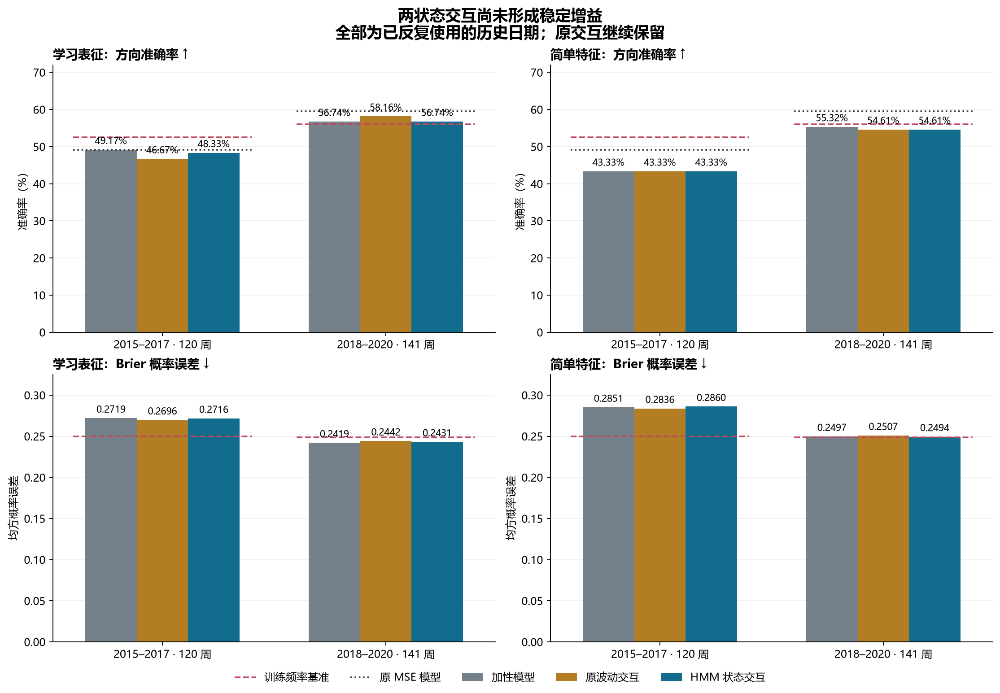
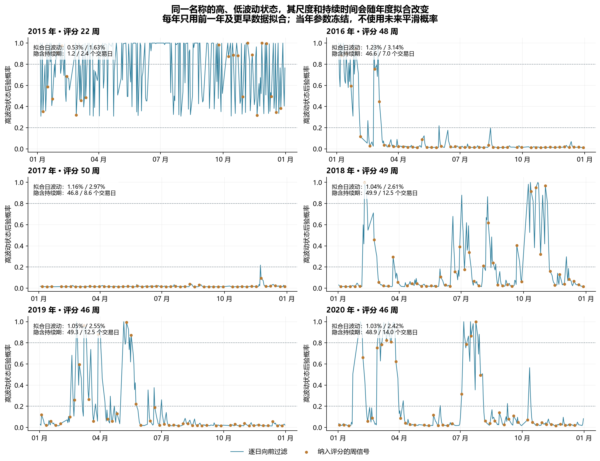

# 第二十一轮方法测试：两状态波动识别与共享信号调节

2026-09-12｜沪深 300｜历史研究实验｜所有新模型拟合完成后才进行下一年度过滤与评分

本轮没有找到可以替换原方案的稳定增益。学习表征的 HMM 状态交互在 2015–2017 年为 58/120（48.33%），2018–2020 年为 80/141（56.74%）。原全历史波动交互的后段 82/141（58.16%）继续保留。新方法后段 Brier 为 0.243117，比原交互的 0.244168 略低，但仍高于加性模型的 0.241936；方向与概率质量需要分开判断。

两种新增交互都未通过冻结的跨时期描述筛选。26 项固定比较中没有经 Holm 校正后显著的改善；简单特征状态交互在前段相对训练频率和仅状态模型的 Brier 较差，校正 p 分别为 0.0156 和 0.0225。这里的统计检验只针对本轮固定比较族，不校正此前多轮历史设计选择。

已完成 6 个年度 HMM、30 个分类头和 24 个交互投影的拟合与核验。计算验证 PASS 不等于方法效果通过，也不构成收益率或可交易性结论。

## 实验范围与状态的含义

本轮延续“先识别状态，再调节共享模型”的思路：用日收益识别两个方差状态，仅增加一个沿原信号方向的条件调节项。没有把日历年份直接当作牛熊标签；各年度只是固定的参数估计和下一年评估边界。训练保留全部截止日前已成熟标签且等权。上一轮三年硬窗口结果、原交互及其全部对照均完整保留。

两状态零均值高斯 HMM 假设：r_t | S_t=s ~ N(0, σ_s²)，状态转移矩阵为 P。两种均值都固定为 0，初始分布固定为 (0.5, 0.5)，估计两个方差和两个自保持概率。训练后按方差排序；“高波动”是这个模型内部相对另一状态的名称，不是经过外部标注的真实市场状态，也不直接代表上涨、下跌、趋势或震荡。

模型使用固定单次初始化和 Baum–Welch EM 求似然局部驻点。EM 可有局部最优，独立 L-BFGS-B 复算只检验附近的数值稳定性，没有证明全局最优，也没有执行多初值搜索。算法背景见 [hmmlearn 官方教程](https://hmmlearn.readthedocs.io/en/stable/tutorial.html)。

状态特征采用向前过滤概率。过滤使用截至当时的观测；平滑会利用之后的样本。本轮平滑只用于截止日前 HMM 的训练求解，下一年全部采用冻结参数向前过滤。相关区别见 [statsmodels 官方 Markov switching 示例](https://www.statsmodels.org/stable/examples/notebooks/generated/markov_autoregression.html)。

训练期也使用过滤概率，但参数在整段截止日前样本上拟合，所以它是训练内特征，**不是历史逐日 OOF／预序贯状态识别**。下一年的参数、投影、标准化和分类头均已冻结，首日先从最后训练后验乘以转移矩阵，再结合当天收益；随后逐交易日更新。已验证修改未来后缀不会改变此前概率。

## 数据、缺失值和模型形式

价格源有 4046 根日线，日期为 2010-01-04 至 2026-08-31；本轮评分仍只使用 2015–2020 年已经反复查看的 261 个周信号。日 HMM 用每个截止日前全部日线，分类训练仍按 joint_completed≤cutoff 保证标签成熟。后段的“最近年份”在这组对比里是 2018–2020，并非新取得的 2026 数据。

日收益为相邻有效收盘价的对数差，两根相邻 OHLC 日线都有效才使用该收益。2015-03-27 无效条及其下一条对应的收益均视为缺失。缺失收益不提供发射似然信息，但保留该交易日并推进一次状态转移，既不填充值也不压缩时间。6 次 HMM 拟合累计 10924 个日步（含 10 个缺失），下一年累计过滤 1462 个日步（含 2 个缺失）；这些累计计数含不同折重复使用的历史。

每折分类训练样本为 1077、1190、1434、1678、1921、2165；测试分别为 22、48、50、49、46、46 周。2015 年因已有无效 OHLC／125 日历史窗口规则只有 22 周可评分，不能把这一年解释成完整覆盖。所有旧样本筛选规则保持不变。

令 p_t 为高方差状态的过滤后验，u_t=2p_t−1，r_t^signal=X_t[:25]·w_parent[:25]，q_t=u_t·r_t^signal。在训练期把 q 对 [X,1] 做 OLS 投影，去掉线性可表示部分；残差按训练均值和总体标准差标准化为 h。下一年冻结这些参数，追加 h 到原加性 X，然后使用岭逻辑回归。原监督信号射线同样是训练内估计，不能称为 OOF 预测。

学习分支由 29 个斜率变成 30 个，简单特征分支由 26 个变成 27 个；每个模型只增加一个交互斜率。全部加性斜率和截距可重新拟合，令交互斜率为零仍精确包含原加性模型。残差化改变了岭惩罚的坐标含义，本轮没有另测未经残差化的乘积。

仅状态对照把 u 按分类训练样本均值／标准差标准化后，用一个斜率和截距拟合。所有分类模型使用相同 λ=0.01、等权二元对数损失、截距不惩罚、严格 p>0.5 判涨。学习分支平均 3 个种子的预测概率。共拟合 738 个分类系数（含截距），另有 24 个 HMM 自由参数；投影和标准化参数另行冻结，不包含在这两个计数里。

## 主要结果

准确率越高越好；Brier 和对数损失越低越好。原 MSE 模型输出未经概率校准的收益分数，因此不填概率指标。原交互保留是研究假设留存，不等于已证明它整体优于所有对照。

### 2015–2017

| 方法 | 正确/样本 | 准确率 | 平衡准确率 | AUROC | Brier | 对数损失 |
| --- | --- | --- | --- | --- | --- | --- |
| 学习表征＋加性市场特征 | 59/120 | 49.17% | 49.55% | 0.488313 | 0.271899 | 0.740763 |
| 学习表征＋原波动交互 | 56/120 | 46.67% | 46.92% | 0.500422 | 0.269597 | 0.735540 |
| 学习表征＋HMM 状态交互 | 58/120 | 48.33% | 49.00% | 0.491129 | 0.271577 | 0.740089 |
| 简单特征＋加性趋势 | 52/120 | 43.33% | 46.30% | 0.457899 | 0.285063 | 0.768797 |
| 简单特征＋原波动交互 | 52/120 | 43.33% | 46.49% | 0.448888 | 0.283603 | 0.767351 |
| 简单特征＋HMM 状态交互 | 52/120 | 43.33% | 46.10% | 0.453393 | 0.286015 | 0.770795 |
| 仅 HMM 状态概率 | 59/120 | 49.17% | 48.37% | 0.471417 | 0.251664 | 0.696524 |
| 原 MSE 模型 | 59/120 | 49.17% | 48.17% | 0.487750 | — | — |
| 全训练期上涨频率 | 63/120 | 52.50% | 48.79% | 0.494086 | 0.249839 | 0.692824 |

### 2018–2020

| 方法 | 正确/样本 | 准确率 | 平衡准确率 | AUROC | Brier | 对数损失 |
| --- | --- | --- | --- | --- | --- | --- |
| 学习表征＋加性市场特征 | 80/141 | 56.74% | 55.84% | 0.602082 | 0.241936 | 0.676994 |
| 学习表征＋原波动交互 | 82/141 | 58.16% | 57.45% | 0.592895 | 0.244168 | 0.681889 |
| 学习表征＋HMM 状态交互 | 80/141 | 56.74% | 55.84% | 0.594937 | 0.243117 | 0.679524 |
| 简单特征＋加性趋势 | 78/141 | 55.32% | 54.75% | 0.549000 | 0.249651 | 0.692508 |
| 简单特征＋原波动交互 | 77/141 | 54.61% | 53.77% | 0.538996 | 0.250733 | 0.694682 |
| 简单特征＋HMM 状态交互 | 77/141 | 54.61% | 54.11% | 0.543691 | 0.249385 | 0.692023 |
| 仅 HMM 状态概率 | 79/141 | 56.03% | 50.00% | 0.438955 | 0.250205 | 0.693569 |
| 原 MSE 模型 | 84/141 | 59.57% | 58.20% | 0.601470 | — | — |
| 全训练期上涨频率 | 79/141 | 56.03% | 50.00% | 0.480604 | 0.248705 | 0.690557 |

相对学习加性模型，新交互前段只改变 3 个方向：2 个由对变错、1 个由错变对；后段 **141 个方向全部相同**。因此后段的 56.74% 不是相同正确数偶然抵消，而是逐条方向相同；它只移动了概率。相对原学习交互，后段 4 个方向不同，3 个由对变错、1 个由错变对，净少对 2 周。

仅状态对照后段 141 周全部判涨，与训练频率基准的方向相同，Brier 却由 0.248705 增至 0.250205。这组结果没有显示“仅知道高低波动”可以提供额外的方向预测能力。它也不足以证明加入趋势或其他状态特征必然有效。

### 年度细分

以下列出正确周数，避免只看汇总比例。2018 年原学习交互仍为 32/49，而状态交互为 30/49；2019 年状态交互多对 1 周，2020 年少对 1 周。

| 年份 | 样本 | 学习表征＋加性市场特征 | 学习表征＋原波动交互 | 学习表征＋HMM 状态交互 | 仅 HMM 状态概率 | 原 MSE 模型 | 全训练期上涨频率 |
| --- | --- | --- | --- | --- | --- | --- | --- |
| 2015 | 22 | 12 | 12 | 12 | 11 | 11 | 9 |
| 2016 | 48 | 25 | 23 | 25 | 20 | 25 | 26 |
| 2017 | 50 | 22 | 21 | 21 | 28 | 23 | 28 |
| 2018 | 49 | 30 | 32 | 30 | 21 | 32 | 21 |
| 2019 | 46 | 25 | 24 | 25 | 30 | 26 | 30 |
| 2020 | 46 | 25 | 26 | 25 | 28 | 26 | 28 |

| 年份 | 样本 | 简单特征＋加性趋势 | 简单特征＋原波动交互 | 简单特征＋HMM 状态交互 | 仅 HMM 状态概率 | 原 MSE 模型 | 全训练期上涨频率 |
| --- | --- | --- | --- | --- | --- | --- | --- |
| 2015 | 22 | 8 | 9 | 9 | 11 | 11 | 9 |
| 2016 | 48 | 23 | 22 | 23 | 20 | 25 | 26 |
| 2017 | 50 | 21 | 21 | 20 | 28 | 23 | 28 |
| 2018 | 49 | 27 | 27 | 27 | 21 | 32 | 21 |
| 2019 | 46 | 23 | 23 | 23 | 30 | 26 | 30 |
| 2020 | 46 | 28 | 27 | 27 | 28 | 26 | 28 |

## 状态识别诊断

最值得继续查的是状态含义的年度稳定性。用于预测 2015 年的模型，低／高状态日标准差约 0.53%／1.63%，隐含持续期只有 1.20／2.36 个交易日；用于预测 2016 年的模型变成约 1.23%／3.14%，持续期约 46.62／6.96 日。首折更接近快速切换的收益方差混合，不能仅凭有两个隐变量就称为长期市场阶段。

本轮预先设置的是数值收敛、方差可分和最低软占用要求，没有强制长期持续的状态；首折通过计算合同不能证明经济解释稳定。这个现象可能涉及零均值高斯发射、单初值局部解、样本增加或状态尺度变化，本轮没有把这些可能原因做因果区分，也没有看到结果后加限制重跑。

| 预测年 | 低状态日 SD | 高状态日 SD | 低自保持 P | 高自保持 P | 低持续日 | 高持续日 | EM 步数 |
| --- | --- | --- | --- | --- | --- | --- | --- |
| 2015 | 0.53% | 1.63% | 0.1685 | 0.5771 | 1.20 | 2.36 | 905 |
| 2016 | 1.23% | 3.14% | 0.9785 | 0.8562 | 46.62 | 6.96 | 65 |
| 2017 | 1.16% | 2.97% | 0.9786 | 0.8832 | 46.76 | 8.56 | 61 |
| 2018 | 1.04% | 2.61% | 0.9799 | 0.9200 | 49.87 | 12.51 | 125 |
| 2019 | 1.05% | 2.55% | 0.9797 | 0.9197 | 49.29 | 12.45 | 85 |
| 2020 | 1.03% | 2.42% | 0.9796 | 0.9288 | 48.91 | 14.04 | 100 |

持续期 1/(1−P_ss) 是拟合马尔可夫链的几何期望，不是人工标注的实际市场阶段长度。

| 预测年 | 评分周数 | 平均高状态后验 | 低后验 <0.2 | 不确定 0.2–0.8 | 高后验 >0.8 |
| --- | --- | --- | --- | --- | --- |
| 2015 | 22 | 67.18% | 0 | 12 | 10 |
| 2016 | 48 | 11.29% | 42 | 3 | 3 |
| 2017 | 50 | 1.76% | 50 | 0 | 0 |
| 2018 | 49 | 17.98% | 36 | 9 | 4 |
| 2019 | 46 | 14.30% | 38 | 4 | 4 |
| 2020 | 46 | 20.62% | 35 | 7 | 4 |

2017 年评分的 50 周全部落在低后验组。2018–2020 年高后验组每年只有 4 周，合计 12/141；前段为 13/120。软门控仍使用全部连续概率，本表的 0.2/0.8 只用于描述，没有用于模型训练或交易切换。稀疏组无法支持可靠的单组策略选择。

### 固定状态组的表现

全部三个后验组都报告，少于 20 个样本标为稀疏。这里的子组结果只用于诊断，不据此增加或删除训练日期。旧趋势／波动／区间／成交量分组的 480 行指标也全部保留。

### 2015–2017 状态组

| 状态组 | 方法 | 样本 | 准确率 | Brier | 稀疏 |
| --- | --- | --- | --- | --- | --- |
| low_probability | 学习表征＋加性市场特征 | 92 | 48.91% | 0.267070 | 否 |
| low_probability | 学习表征＋原波动交互 | 92 | 45.65% | 0.264863 | 否 |
| low_probability | 学习表征＋HMM 状态交互 | 92 | 47.83% | 0.266429 | 否 |
| low_probability | 简单特征＋HMM 状态交互 | 92 | 45.65% | 0.275361 | 否 |
| low_probability | 仅 HMM 状态概率 | 92 | 50.00% | 0.250298 | 否 |
| low_probability | 全训练期上涨频率 | 92 | 56.52% | 0.249358 | 否 |
| uncertain | 学习表征＋加性市场特征 | 15 | 60.00% | 0.288651 | 是 |
| uncertain | 学习表征＋原波动交互 | 15 | 60.00% | 0.287428 | 是 |
| uncertain | 学习表征＋HMM 状态交互 | 15 | 60.00% | 0.290949 | 是 |
| uncertain | 简单特征＋HMM 状态交互 | 15 | 33.33% | 0.330108 | 是 |
| uncertain | 仅 HMM 状态概率 | 15 | 40.00% | 0.252678 | 是 |
| uncertain | 全训练期上涨频率 | 15 | 40.00% | 0.251328 | 是 |
| high_probability | 学习表征＋加性市场特征 | 13 | 38.46% | 0.286746 | 是 |
| high_probability | 学习表征＋原波动交互 | 13 | 38.46% | 0.282527 | 是 |
| high_probability | 学习表征＋HMM 状态交互 | 13 | 38.46% | 0.285654 | 是 |
| high_probability | 简单特征＋HMM 状态交互 | 13 | 38.46% | 0.310535 | 是 |
| high_probability | 仅 HMM 状态概率 | 13 | 53.85% | 0.260157 | 是 |
| high_probability | 全训练期上涨频率 | 13 | 38.46% | 0.251523 | 是 |

### 2018–2020 状态组

| 状态组 | 方法 | 样本 | 准确率 | Brier | 稀疏 |
| --- | --- | --- | --- | --- | --- |
| low_probability | 学习表征＋加性市场特征 | 109 | 58.72% | 0.238751 | 否 |
| low_probability | 学习表征＋原波动交互 | 109 | 59.63% | 0.240963 | 否 |
| low_probability | 学习表征＋HMM 状态交互 | 109 | 58.72% | 0.239161 | 否 |
| low_probability | 简单特征＋HMM 状态交互 | 109 | 54.13% | 0.251250 | 否 |
| low_probability | 仅 HMM 状态概率 | 109 | 57.80% | 0.248596 | 否 |
| low_probability | 全训练期上涨频率 | 109 | 57.80% | 0.248065 | 否 |
| uncertain | 学习表征＋加性市场特征 | 20 | 55.00% | 0.244449 | 否 |
| uncertain | 学习表征＋原波动交互 | 20 | 55.00% | 0.249086 | 否 |
| uncertain | 学习表征＋HMM 状态交互 | 20 | 55.00% | 0.246198 | 否 |
| uncertain | 简单特征＋HMM 状态交互 | 20 | 55.00% | 0.238315 | 否 |
| uncertain | 仅 HMM 状态概率 | 20 | 55.00% | 0.252270 | 否 |
| uncertain | 全训练期上涨频率 | 20 | 55.00% | 0.249191 | 否 |
| high_probability | 学习表征＋加性市场特征 | 12 | 41.67% | 0.266686 | 是 |
| high_probability | 学习表征＋原波动交互 | 12 | 50.00% | 0.265088 | 是 |
| high_probability | 学习表征＋HMM 状态交互 | 12 | 41.67% | 0.273914 | 是 |
| high_probability | 简单特征＋HMM 状态交互 | 12 | 58.33% | 0.250897 | 是 |
| high_probability | 仅 HMM 状态概率 | 12 | 41.67% | 0.261386 | 是 |
| high_probability | 全训练期上涨频率 | 12 | 41.67% | 0.253709 | 是 |

## 预定比较与描述筛选

每个时期 13 项比较，共 26 项，候选减对照损失，小于 0 表示改善。循环区块长度为 8 个保留观测，10000 次重采样，随机种子 20260910，每个时期单独生成。95% 区间是边际区间，不是同时区间；双侧中心化 p 在全部 26 项内做 Holm 校正。没有用合并时期做主要假设检验。

| 时期 | 候选 / 对照 | 损失 | 差值 | 95% 区间 | 原始 p | Holm p |
| --- | --- | --- | --- | --- | --- | --- |
| 2015–2017 | 学习表征＋HMM 状态交互 / 学习表征＋加性市场特征 | Brier | -0.000322 | [-0.001402, +0.000616] | 0.5459 | 1.0000 |
| 2015–2017 | 学习表征＋HMM 状态交互 / 学习表征＋加性市场特征 | 方向错误率 | +0.008333 | [-0.008333, +0.033333] | 0.5111 | 1.0000 |
| 2015–2017 | 学习表征＋HMM 状态交互 / 学习表征＋原波动交互 | Brier | +0.001980 | [-0.003259, +0.007889] | 0.4773 | 1.0000 |
| 2015–2017 | 学习表征＋HMM 状态交互 / 学习表征＋原波动交互 | 方向错误率 | -0.016667 | [-0.050000, +0.016667] | 0.3010 | 1.0000 |
| 2015–2017 | 学习表征＋HMM 状态交互 / 全训练期上涨频率 | Brier | +0.021739 | [+0.002637, +0.039964] | 0.0229 | 0.5266 |
| 2015–2017 | 学习表征＋HMM 状态交互 / 仅 HMM 状态概率 | Brier | +0.019913 | [+0.001615, +0.037253] | 0.0268 | 0.5895 |
| 2015–2017 | 简单特征＋HMM 状态交互 / 简单特征＋加性趋势 | Brier | +0.000952 | [+0.000245, +0.001731] | 0.0116 | 0.2784 |
| 2015–2017 | 简单特征＋HMM 状态交互 / 简单特征＋加性趋势 | 方向错误率 | +0.000000 | [-0.025000, +0.025000] | 1.0000 | 1.0000 |
| 2015–2017 | 简单特征＋HMM 状态交互 / 简单特征＋原波动交互 | Brier | +0.002412 | [-0.004105, +0.008382] | 0.4470 | 1.0000 |
| 2015–2017 | 简单特征＋HMM 状态交互 / 简单特征＋原波动交互 | 方向错误率 | +0.000000 | [-0.041667, +0.033333] | 1.0000 | 1.0000 |
| 2015–2017 | 简单特征＋HMM 状态交互 / 全训练期上涨频率 | Brier | +0.036176 | [+0.015819, +0.056903] | 0.0006 | 0.0156 |
| 2015–2017 | 简单特征＋HMM 状态交互 / 仅 HMM 状态概率 | Brier | +0.034351 | [+0.014657, +0.055125] | 0.0009 | 0.0225 |
| 2015–2017 | 仅 HMM 状态概率 / 全训练期上涨频率 | Brier | +0.001825 | [-0.000843, +0.005644] | 0.2656 | 1.0000 |
| 2018–2020 | 学习表征＋HMM 状态交互 / 学习表征＋加性市场特征 | Brier | +0.001180 | [-0.000318, +0.002849] | 0.1418 | 1.0000 |
| 2018–2020 | 学习表征＋HMM 状态交互 / 学习表征＋加性市场特征 | 方向错误率 | +0.000000 | [+0.000000, +0.000000] | 1.0000 | 1.0000 |
| 2018–2020 | 学习表征＋HMM 状态交互 / 学习表征＋原波动交互 | Brier | -0.001052 | [-0.002399, +0.000247] | 0.1231 | 1.0000 |
| 2018–2020 | 学习表征＋HMM 状态交互 / 学习表征＋原波动交互 | 方向错误率 | +0.014184 | [-0.014184, +0.042553] | 0.3113 | 1.0000 |
| 2018–2020 | 学习表征＋HMM 状态交互 / 全训练期上涨频率 | Brier | -0.005589 | [-0.022371, +0.010592] | 0.5058 | 1.0000 |
| 2018–2020 | 学习表征＋HMM 状态交互 / 仅 HMM 状态概率 | Brier | -0.007089 | [-0.024238, +0.009186] | 0.3996 | 1.0000 |
| 2018–2020 | 简单特征＋HMM 状态交互 / 简单特征＋加性趋势 | Brier | -0.000265 | [-0.002404, +0.001876] | 0.7988 | 1.0000 |
| 2018–2020 | 简单特征＋HMM 状态交互 / 简单特征＋加性趋势 | 方向错误率 | +0.007092 | [+0.000000, +0.021277] | 0.2619 | 1.0000 |
| 2018–2020 | 简单特征＋HMM 状态交互 / 简单特征＋原波动交互 | Brier | -0.001347 | [-0.004723, +0.001928] | 0.4249 | 1.0000 |
| 2018–2020 | 简单特征＋HMM 状态交互 / 简单特征＋原波动交互 | 方向错误率 | +0.000000 | [-0.042553, +0.035461] | 1.0000 | 1.0000 |
| 2018–2020 | 简单特征＋HMM 状态交互 / 全训练期上涨频率 | Brier | +0.000680 | [-0.011458, +0.013779] | 0.9158 | 1.0000 |
| 2018–2020 | 简单特征＋HMM 状态交互 / 仅 HMM 状态概率 | Brier | -0.000820 | [-0.013316, +0.012455] | 0.8981 | 1.0000 |
| 2018–2020 | 仅 HMM 状态概率 / 全训练期上涨频率 | Brier | +0.001500 | [-0.000247, +0.003457] | 0.1159 | 1.0000 |

11 条冻结的描述条件：准确率严格超过原加性、原交互、原 MSE、训练频率（4 条）；Brier 低于原加性、原交互、训练频率、仅状态（4 条）；对数损失低于训练频率（1 条）；至少两年准确率超过原 MSE、至少两年 Brier 低于训练频率（2 条）。平局不通过，两段均需全部通过；仅状态对照不自动晋升为候选策略。

| 时期 | 候选 | 满足条件 | 跨时期通过 | 原交互继续保留 |
| --- | --- | --- | --- | --- |
| 2015–2017 | 学习表征＋HMM 状态交互 | 2/11 | 否 | 是 |
| 2015–2017 | 简单特征＋HMM 状态交互 | 0/11 | 否 | 是 |
| 2018–2020 | 学习表征＋HMM 状态交互 | 6/11 | 否 | 是 |
| 2018–2020 | 简单特征＋HMM 状态交互 | 3/11 | 否 | 是 |

## 训练与实现复核

6 个 HMM 共执行 1341 次 EM 更新；30 个分类头共执行 104 次 Newton 更新。全部满足冻结的收敛阈值，24 个交互投影秩增加 1 且精确嵌套父模型。独立 QR 重算投影、独立 L-BFGS-B 重算分类目标均通过。HMM 另经穷举小样本状态路径、有限差分导数、独立对数域递推、附近的似然复算，以及未来后缀扰动验证。

逐条新预测的最大复算差异为 1.277e-14；HMM 对数似然最大复算差异为 2.074e-10；HMM 独立局部优化后的全序列状态概率最大变化为 2.645e-05（冻结阈值 0.001）。独立分类器最大目标差为 2.265e-14、训练概率差为 1.754e-07。复算优化参数从未用于提交的预测。

本轮没有新神经网络前向或权重训练；复用先前已核验的 18 个冻结神经状态和对应缓存。新增 1305 条单模型概率，完整保留 7308 条旧模型记录，共 8613 条；20 个方法各 261 条集成记录，共 5220 条。独立复核了 852 组指标、190 个可靠性分箱和 26 项固定比较。旧证据 3061 个文件的内容哈希保持不变。

训练内表现仅作拟合诊断，不能当作泛化效果。下表学习分支为三种子训练指标均值，简单分支和仅状态为单次拟合。

| 方法 | 截止日 | 训练准确率 | 训练 Brier | 带惩罚目标 |
| --- | --- | --- | --- | --- |
| 仅 HMM 状态概率 | 2014-12-31 | 52.09% | 0.249474 | 0.692129 |
| 仅 HMM 状态概率 | 2015-12-31 | 52.02% | 0.249397 | 0.691984 |
| 仅 HMM 状态概率 | 2016-12-31 | 50.70% | 0.249797 | 0.692752 |
| 仅 HMM 状态概率 | 2017-12-31 | 52.03% | 0.249446 | 0.692049 |
| 仅 HMM 状态概率 | 2018-12-31 | 51.12% | 0.249751 | 0.692659 |
| 仅 HMM 状态概率 | 2019-12-31 | 52.15% | 0.249426 | 0.692007 |
| 学习表征＋HMM 状态交互 | 2014-12-31 | 63.32% | 0.220727 | 0.635682 |
| 学习表征＋HMM 状态交互 | 2015-12-31 | 62.66% | 0.223911 | 0.642456 |
| 学习表征＋HMM 状态交互 | 2016-12-31 | 61.88% | 0.229914 | 0.653284 |
| 学习表征＋HMM 状态交互 | 2017-12-31 | 61.98% | 0.227294 | 0.647930 |
| 学习表征＋HMM 状态交互 | 2018-12-31 | 62.45% | 0.224943 | 0.642324 |
| 学习表征＋HMM 状态交互 | 2019-12-31 | 62.09% | 0.227909 | 0.648682 |
| 简单特征＋HMM 状态交互 | 2014-12-31 | 61.75% | 0.228931 | 0.654677 |
| 简单特征＋HMM 状态交互 | 2015-12-31 | 59.75% | 0.234630 | 0.665396 |
| 简单特征＋HMM 状态交互 | 2016-12-31 | 59.34% | 0.237028 | 0.670439 |
| 简单特征＋HMM 状态交互 | 2017-12-31 | 56.38% | 0.241955 | 0.679378 |
| 简单特征＋HMM 状态交互 | 2018-12-31 | 57.94% | 0.241422 | 0.678513 |
| 简单特征＋HMM 状态交互 | 2019-12-31 | 58.01% | 0.242883 | 0.681149 |

## 研究决定与下一步

保留全历史交互及后段 58.16% 的结果，保留加性模型作更强的概率误差对照。本轮 HMM 状态交互不替代它们；也不根据高后验小组结果筛选交易或扩大专家网络。市场状况不同这一研究方向仍然合理，但本轮只检验“日收益方差状态 × 一个原有信号方向”，不足以否定或确认所有状态方法。

下一轮优先研究状态是否可重复识别、是否提供现有连续波动特征以外的信息。可以把相对波动和趋势持续性分别作为小规模候选，先在截止日前训练内的时间顺序划分上检查占用、持续期、年度尺度稳定性和增量预测；再考虑少量状态偏置或斜率。若继续 HMM，持续性约束或更适合尾部的发射分布需要预先冻结并与当前无约束版本对照。这里是后续研究建议，本轮没有实施或证明它们有效。

状态标识和监督射线的训练内特征也应逐步改为时间顺序生成的 OOF 特征，减少训练与下一年识别条件的不一致。每次只改变一个方面，继续保留原交互，避免同时更换状态、时间权重、神经表征和分类目标后无法归因。

## 限制与可追溯文件

这 261 个历史日期已经用于多轮方法设计，**不能作为独立确认**。训练周收益标签在日频样本间重叠，样本并不独立；8 观测区块重采样只能提供特定假设下的区间。状态后验没有外部真实标签，识别概率的校准程度未知；本轮既不是完整论文复现，也没有测试交易成本、执行或净收益。2021–2026 年的部分日期同样有历史使用记录，不能仅通过改名取得新留出集。

冻结协议 SHA-256：`fd9ec31e2b935f42543989cc5a21befba0c8829ed4a4f5238921b26ca58cd2cc`。

主要文件：[冻结协议](../protocol.json)、[数值验证](verification.json)、[HMM 拟合参数](hmm_fit_summary.csv)、[日状态](hmm_daily_states.csv)、[周状态](hmm_signal_states.csv)、[逐模型预测](model_predictions.csv)、[集成预测](ensemble_predictions.csv)、[全部汇总指标](ensemble_metrics.csv)、[年度指标](yearly_metrics.csv)、[种子指标](seed_metrics.csv)、[旧状态组](state_metrics.csv)、[HMM 状态组](hmm_state_metrics.csv)、[可靠性分箱](reliability_bins.csv)、[方向变化](direction_changes.csv)、[交互贡献](interaction_components.csv)、[固定比较](primary_comparisons.json)、[筛选结果](assessments.json)。

图表矢量版：[结果比较 SVG](state_interaction_comparison.svg)、[逐年状态 SVG](annual_filtered_states.svg)。复现依次执行 prepare21.py → contract21.py → train21.py → score21.py → evaluate21.py → verify21.py；在独立副本和空结果目录运行，不覆盖当前冻结证据。科学计算解释器为 research_v4/.venv_gpu/Scripts/python.exe，报告和绘图使用默认 Python。
