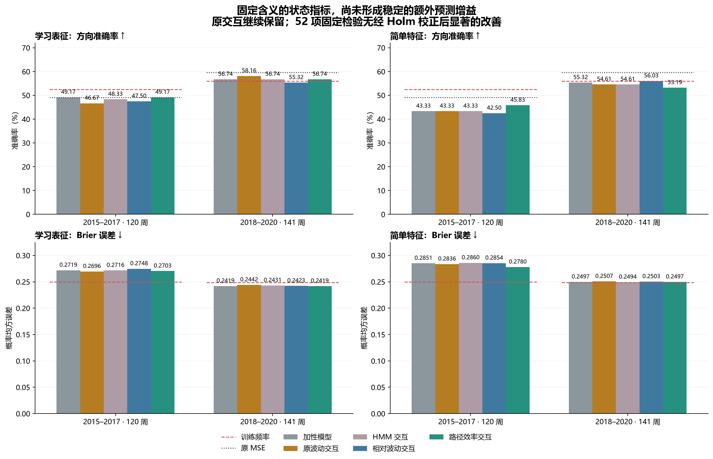
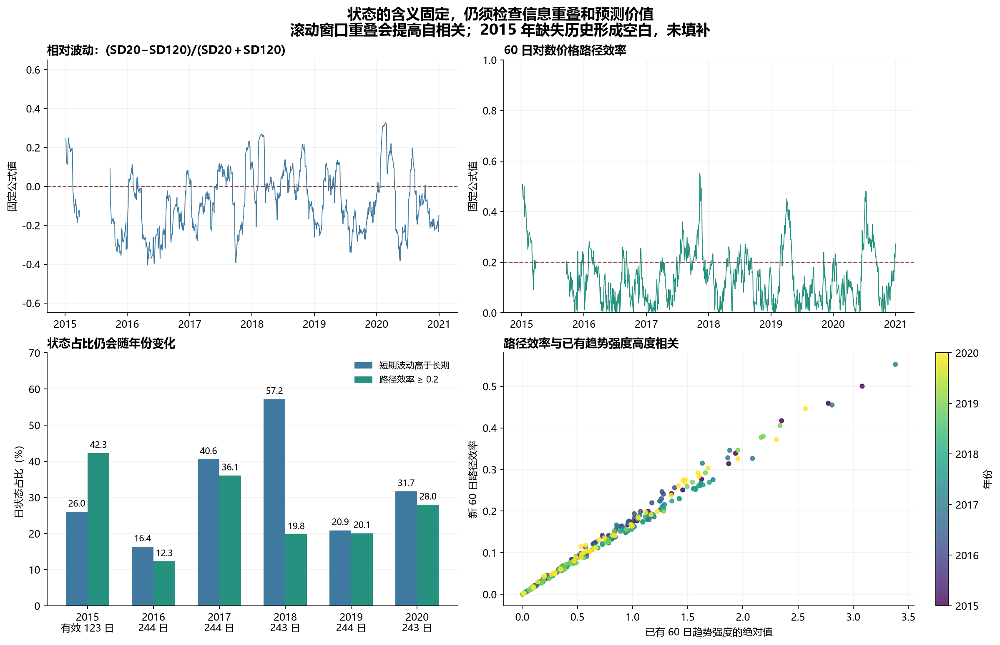

# 第二十二轮方法测试：相对波动、路径效率与状态信息重叠

2026-09-12｜沪深 300｜固定历史划分｜60 个分类头全部拟合后才进行本轮新评分

本轮没有发现足以替换原方案的稳定增益。学习表征的路径效率交互在前段为 59/120（49.17%）、后段为 80/141（56.74%），两段的逐条方向均与原加性模型完全相同。它的 Brier 从 0.271899／0.241936 小幅降到 0.270341／0.241881。原全历史波动交互后段 82/141（58.16%）继续完整保留。

相对波动交互的学习分支下降到 47.50%／55.32%；简单特征分支为 42.50%／56.03%。路径效率交互的简单分支前段从加性的 43.33% 提升至 45.83%，后段却由 55.32% 降到 53.19%，没有跨时期改善。四个候选均未通过冻结的描述筛选。

52 项固定比较中没有经 Holm 校正后显著的改善。前段简单特征相对波动交互的 Brier 相对全训练频率较差，校正 p=0.0260。学习路径效率相对原交互的后段 Brier 虽然原始 p=0.0075，但校正后为 0.3750；不能只取未校正值宣称成功。

本轮更有用的发现是信息重叠：路径效率与已有趋势强度绝对值的逐年评估相关系数约为 0.995–0.999。指标名称改变和数值平滑，并不自动产生新的方向信息。

## 冻结设计

本轮分别测试两个含义固定、无需训练状态识别器的连续指标。每个指标单独与原信号相乘，经训练期 OLS 残差化后，只增加一个分类斜率；同时设置各自的单指标逻辑回归对照。原来的全历史加性、波动交互、HMM 交互、三年窗口及全部旧方法均保留。

相对波动：令 σ20、σ120 分别为截至当天的 20、120 个日对数收益的总体标准差，u_v=(σ20−σ120)/max(σ20+σ120,10⁻⁸)。它描述短期波动相对本身较长历史的增减，范围约为 [−1,1]，不是高波动的后验概率，也不保证不同资产或时期拥有相同分布。

路径效率：ER60=|Σr_i|/max(Σ|r_i|,10⁻⁸)，其中 r_i 是截至当天的 60 个日对数收益，结果截到 [0,1]；交互门控为 u_e=2ER60−1。它衡量净位移占总路径长度的比例，取绝对值后不区分上涨和下跌。这是对数价格版本的路径效率，和通常直接用价格变化的效率比率有区别；参考 [StockSharp 指标实现说明](https://doc.stocksharp.com/en/topics/api/indicators/list_of_indicators/kaufman_efficiency_ratio)。

平价历史使相对波动为 0、ER 为 0；分母下限为固定 10⁻⁸。窗口 20／60／120 沿用已有研究尺度，没有选择网格或结果后调参。诊断标签固定为 u_v>0 时“短期波动升高”，ER≥0.2 时“较高路径效率”；标签阈值只用于表格和连续段统计，模型始终使用连续数值。

这两个状态特征在历史任一日期都只依赖当时及更早的价格，不用年度末重新拟合其定义。已检查整个价格前缀的一致性与未来后缀扰动。因此消除了上一轮 HMM 状态参数在训练期由整段样本估计的那一层不一致。原神经表征、监督信号射线、投影和分类器仍是在各自整段训练样本上拟合；整个模型不能称为时间顺序 OOF。

时间评估仍按已成熟标签的历史训练、下一年度应用进行，避免随机打乱时间顺序。该原则可参见 [scikit-learn 时间序列交叉验证说明](https://scikit-learn.org/stable/modules/cross_validation.html)。本轮没有调用 TimeSeriesSplit 自动生成新划分，而是复用原来的六个固定年度边界。

## 样本和训练口径

数据源为 4046 根沪深 300 日线（2010-01-04 至 2026-08-31）。本轮评估仍是 2015–2020 年已经多次使用的 261 周，前段 120 周、后段 141 周；“后段／最近年份”在本报告中指 2018–2020，不能理解为新取得的 2026 样本。

六折训练样本数为 1077、1190、1434、1678、1921、2165，测试为 22、48、50、49、46、46。目标是已有执行口径的周收益严格大于 0；训练要求 joint_completed≤cutoff。以前的测试日期在标签成熟后可以合法进入后来的训练折，不能称其为永久留出数据。

状态计算要求截至当天连续 121 根 OHLC 日线都有效且收盘价有限、为正。2015-03-27 的无效条导致该条至其后第 120 条的状态缺失，共 121 个日步；前 120 个历史锚点也无法计算。旧 125 日观察窗口更严格，因此没有新增分类训练或测试剔除。2015 年状态日诊断只有 123 个有效日、评分只有原来的 22 周，未填补缺失历史。

保留原 R18 的标准化加性 X 和前 25 个监督系数射线 r=X[:25]·w_parent[:25]。每个门控 u 单独形成 q=u·r，对 [X,1] 做训练期 OLS 投影，再以训练残差均值和总体标准差（下限 10⁻⁶）得到 h。下一年冻结这些变换并追加一个 h。新增交互系数为 0 时精确包含原加性模型；全部加性系数和截距可以重新拟合。

学习分支 36 次拟合，每个 30 个斜率；简单分支 12 次拟合，每个 27 个斜率；两个单状态对照共 12 次拟合，每个 1 个斜率。共 60 个分类头、1476 个分类系数（含截距）、48 个交互投影，94650 行累计训练输入（跨折与方法重复计数）。射线和残差化的参数量不包含在分类系数计数中。

所有分类头使用相同 λ=0.01、等权平均二元对数损失、截距不惩罚、严格 p>0.5 判涨。学习分支平均三个种子的预测概率。本轮没有神经权重训练、神经前向计算、HMM 拟合或联合双门控模型。

## 主要结果

准确率和 AUROC 越高越好，Brier 和对数损失越低越好。原 MSE 仅有收益分数，不填未经校准的概率指标。

### 2015–2017

| 方法 | 正确/样本 | 准确率 | 平衡准确率 | AUROC | Brier | 对数损失 |
| --- | --- | --- | --- | --- | --- | --- |
| 学习表征＋加性市场特征 | 59/120 | 49.17% | 49.55% | 0.488313 | 0.271899 | 0.740763 |
| 学习表征＋原波动交互 | 56/120 | 46.67% | 46.92% | 0.500422 | 0.269597 | 0.735540 |
| 学习表征＋HMM 交互 | 58/120 | 48.33% | 49.00% | 0.491129 | 0.271577 | 0.740089 |
| 学习表征＋相对波动交互 | 57/120 | 47.50% | 48.25% | 0.487750 | 0.274811 | 0.747073 |
| 学习表征＋路径效率交互 | 59/120 | 49.17% | 49.55% | 0.495917 | 0.270341 | 0.737439 |
| 简单特征＋加性趋势 | 52/120 | 43.33% | 46.30% | 0.457899 | 0.285063 | 0.768797 |
| 简单特征＋原波动交互 | 52/120 | 43.33% | 46.49% | 0.448888 | 0.283603 | 0.767351 |
| 简单特征＋HMM 交互 | 52/120 | 43.33% | 46.10% | 0.453393 | 0.286015 | 0.770795 |
| 简单特征＋相对波动交互 | 51/120 | 42.50% | 45.55% | 0.444382 | 0.285431 | 0.770256 |
| 简单特征＋路径效率交互 | 55/120 | 45.83% | 48.93% | 0.478175 | 0.277966 | 0.753568 |
| 仅相对波动 | 52/120 | 43.33% | 44.13% | 0.460152 | 0.260888 | 0.715307 |
| 仅路径效率 | 58/120 | 48.33% | 47.82% | 0.411433 | 0.256351 | 0.705944 |
| 原 MSE 模型 | 59/120 | 49.17% | 48.17% | 0.487750 | — | — |
| 全训练期上涨频率 | 63/120 | 52.50% | 48.79% | 0.494086 | 0.249839 | 0.692824 |

### 2018–2020

| 方法 | 正确/样本 | 准确率 | 平衡准确率 | AUROC | Brier | 对数损失 |
| --- | --- | --- | --- | --- | --- | --- |
| 学习表征＋加性市场特征 | 80/141 | 56.74% | 55.84% | 0.602082 | 0.241936 | 0.676994 |
| 学习表征＋原波动交互 | 82/141 | 58.16% | 57.45% | 0.592895 | 0.244168 | 0.681889 |
| 学习表征＋HMM 交互 | 80/141 | 56.74% | 55.84% | 0.594937 | 0.243117 | 0.679524 |
| 学习表征＋相对波动交互 | 78/141 | 55.32% | 54.57% | 0.599224 | 0.242295 | 0.677909 |
| 学习表征＋路径效率交互 | 80/141 | 56.74% | 55.84% | 0.600449 | 0.241881 | 0.676830 |
| 简单特征＋加性趋势 | 78/141 | 55.32% | 54.75% | 0.549000 | 0.249651 | 0.692508 |
| 简单特征＋原波动交互 | 77/141 | 54.61% | 53.77% | 0.538996 | 0.250733 | 0.694682 |
| 简单特征＋HMM 交互 | 77/141 | 54.61% | 54.11% | 0.543691 | 0.249385 | 0.692023 |
| 简单特征＋相对波动交互 | 79/141 | 56.03% | 55.55% | 0.541037 | 0.250284 | 0.693736 |
| 简单特征＋路径效率交互 | 75/141 | 53.19% | 52.50% | 0.547570 | 0.249734 | 0.692937 |
| 仅相对波动 | 74/141 | 52.48% | 48.05% | 0.421805 | 0.249956 | 0.693063 |
| 仅路径效率 | 69/141 | 48.94% | 45.23% | 0.476113 | 0.249942 | 0.693028 |
| 原 MSE 模型 | 84/141 | 59.57% | 58.20% | 0.601470 | — | — |
| 全训练期上涨频率 | 79/141 | 56.03% | 50.00% | 0.480604 | 0.248705 | 0.690557 |

学习路径效率交互相对加性模型，两段都没有改变任何方向。它只是轻微移动概率，后段 Brier 差约 −0.000055，不能把这称作方向能力提高。相对原学习交互，前段 7 个方向不同（5 个由错变对、2 个由对变错），后段 4 个方向不同（1 个由错变对、3 个由对变错）。

学习相对波动交互相对加性模型，前段 6 次方向变化中 4 次由对变错、2 次由错变对；后段 2 次均由对变错。单独使用相对波动或路径效率的模型在两个时期的 Brier 都高于全训练期上涨频率，尚未显示状态本身能提供稳定的方向预测。

### 年度正确周数

| 年份 | 样本 | 学习表征＋加性市场特征 | 学习表征＋原波动交互 | 学习表征＋HMM 交互 | 学习表征＋相对波动交互 | 学习表征＋路径效率交互 | 原 MSE 模型 | 全训练期上涨频率 |
| --- | --- | --- | --- | --- | --- | --- | --- | --- |
| 2015 | 22 | 12 | 12 | 12 | 10 | 12 | 11 | 9 |
| 2016 | 48 | 25 | 23 | 25 | 25 | 25 | 25 | 26 |
| 2017 | 50 | 22 | 21 | 21 | 22 | 22 | 23 | 28 |
| 2018 | 49 | 30 | 32 | 30 | 29 | 30 | 32 | 21 |
| 2019 | 46 | 25 | 24 | 25 | 24 | 25 | 26 | 30 |
| 2020 | 46 | 25 | 26 | 25 | 25 | 25 | 26 | 28 |

| 年份 | 样本 | 简单特征＋加性趋势 | 简单特征＋原波动交互 | 简单特征＋HMM 交互 | 简单特征＋相对波动交互 | 简单特征＋路径效率交互 | 原 MSE 模型 | 全训练期上涨频率 |
| --- | --- | --- | --- | --- | --- | --- | --- | --- |
| 2015 | 22 | 8 | 9 | 9 | 9 | 9 | 11 | 9 |
| 2016 | 48 | 23 | 22 | 23 | 22 | 22 | 25 | 26 |
| 2017 | 50 | 21 | 21 | 20 | 20 | 24 | 23 | 28 |
| 2018 | 49 | 27 | 27 | 27 | 29 | 27 | 32 | 21 |
| 2019 | 46 | 23 | 23 | 23 | 23 | 21 | 26 | 30 |
| 2020 | 46 | 28 | 27 | 27 | 27 | 27 | 26 | 28 |

## 状态持续性与新增信息

固定公式避免了 HMM 状态名称在年度重拟合时改变尺度，但实际分布和占比依然变化。相对波动的下一年度一阶自相关约 0.955–0.982，路径效率约 0.895–0.967；这些长窗口存在大量重叠，自相关高并不能证明识别了经济上真实、可预测的市场阶段。

连续段统计按相邻交易锚点计算，缺失状态会中断，不跨缺失连线。年度／历史边界与缺失边界导致左右删失。表中的连续段长度包含删失段，仅是观察到的长度，不能直接解释为完整状态寿命。路径效率的固定阈值附近还会反复切换，例如 2015 年中位连续段仅 1 日。

| 预测年 | 指标 | 有效日 | 缺失日 | 较高组占比 | 相邻相关 | 切换/有效相邻对 | 段长中位数 | 最长观察段 | 删失段/总段 |
| --- | --- | --- | --- | --- | --- | --- | --- | --- | --- |
| 2015 | 相对波动 | 123 | 121 | 26.02% | 0.9824 | 2/121 | 27 | 67 | 4/4 |
| 2015 | 路径效率 | 123 | 121 | 42.28% | 0.9659 | 17/121 | 1 | 42 | 4/19 |
| 2016 | 相对波动 | 244 | 0 | 16.39% | 0.9666 | 7/243 | 6.5 | 190 | 2/8 |
| 2016 | 路径效率 | 244 | 0 | 12.30% | 0.8953 | 12/243 | 7 | 115 | 2/13 |
| 2017 | 相对波动 | 244 | 0 | 40.57% | 0.9718 | 6/243 | 27 | 94 | 2/7 |
| 2017 | 路径效率 | 244 | 0 | 36.07% | 0.9642 | 16/243 | 4 | 57 | 2/17 |
| 2018 | 相对波动 | 243 | 0 | 57.20% | 0.9545 | 21/242 | 4 | 30 | 2/22 |
| 2018 | 路径效率 | 243 | 0 | 19.75% | 0.9246 | 28/242 | 3 | 73 | 2/29 |
| 2019 | 相对波动 | 244 | 0 | 20.90% | 0.9659 | 10/243 | 5 | 145 | 2/11 |
| 2019 | 路径效率 | 244 | 0 | 20.08% | 0.9671 | 8/243 | 9 | 122 | 2/9 |
| 2020 | 相对波动 | 243 | 0 | 31.69% | 0.9811 | 8/242 | 20 | 60 | 2/9 |
| 2020 | 路径效率 | 243 | 0 | 27.98% | 0.9575 | 8/242 | 5 | 96 | 2/9 |

### 与已有特征的关系

下表是评分周上的相关系数，只用于检查信息重叠。路径效率与 |trend60| 的高度相关不代表其与原有线性输入完全等价：绝对值本身是非线性变换；相乘和残差化也会形成新的函数。但它更像已有趋势幅度的重新表达，不能仅凭名字把它当成独立的市场识别来源。

| 预测年 | 指标 | 与原 volatility20 的相关 | 与 |trend60| 的相关 |
| --- | --- | --- | --- |
| 2015 | 相对波动 | 0.626151 | 0.814368 |
| 2015 | 路径效率 | 0.287184 | 0.998560 |
| 2016 | 相对波动 | 0.554078 | 0.465896 |
| 2016 | 路径效率 | 0.411751 | 0.996059 |
| 2017 | 相对波动 | 0.937900 | 0.115561 |
| 2017 | 路径效率 | 0.016497 | 0.994913 |
| 2018 | 相对波动 | 0.711531 | -0.183382 |
| 2018 | 路径效率 | -0.264936 | 0.998664 |
| 2019 | 相对波动 | 0.877233 | 0.531158 |
| 2019 | 路径效率 | 0.517857 | 0.998838 |
| 2020 | 相对波动 | 0.913468 | -0.096151 |
| 2020 | 路径效率 | 0.050882 | 0.995918 |

代数上，已有 |trend60|=|Σr60|/(σ60√60)，ER60=|Σr60|/Σ|r60|。两者共享分子，只是用不同尺度归一化。这解释了为何它们可能高度相关；是否产生增量预测仍由上述比较决定。

相对波动在简单特征分支中的训练线性可解释度 R² 达到约 0.906–0.965，提示它的大部分变化已能由现有标准化输入线性表达。学习分支没有达到同样程度，但这轮也没有显示更好的预测。这里的 R² 是训练输入解释度，不是涨跌预测 R²。

| 新增交互 | 门控被已有 X 解释的 R² 最小 | 均值 | 最大 |
| --- | --- | --- | --- |
| 学习表征＋路径效率交互 | 0.384585 | 0.456732 | 0.566729 |
| 学习表征＋相对波动交互 | 0.376992 | 0.532008 | 0.826449 |
| 简单特征＋路径效率交互 | 0.442388 | 0.470077 | 0.503115 |
| 简单特征＋相对波动交互 | 0.905628 | 0.933742 | 0.965238 |

### 路径效率不等于涨跌排列的持续性

ER 只取收益总和与绝对收益总和，在窗口内重排收益不会改变它，因此没有直接编码涨跌出现的顺序。一个固定的代数例子：60 日中有 40 次 +1% 对数收益和 20 次 −1% 对数收益，先涨后跌与交错排列都得到 ER=1/3；相邻同号对却可以分别为 58/59 与 19/59。此例只说明指标定义的局限，没有使用标签、训练新模型或扩展本轮候选。

因此本轮虽然用 persistence 命名代码字段，严格解释应是“路径效率代理”，不能宣称已经检验了所有趋势持续性方法。这也是下一轮应关注真正含时间顺序的信息，而不是继续替换同类归一化公式的原因。

## 固定统计比较

每个时期 26 项，共 52 项，候选减对照损失，负值较好。循环区块为 8 个保留观测、10000 次重采样、种子 20260910，两段单独生成。表中 95% 区间为边际区间，不是同时区间；双侧中心化 p 在全部 52 项上作 Holm 校正。没有校正此前多轮历史选择，也没有做合并时期的主要检验。

| 时期 | 候选 / 对照 | 指标 | 差值 | 95% 区间 | 原始 p | Holm p |
| --- | --- | --- | --- | --- | --- | --- |
| 2015–2017 | 学习表征＋相对波动交互 / 学习表征＋加性市场特征 | Brier | +0.002912 | [-0.000202, +0.006884] | 0.1036 | 1.0000 |
| 2015–2017 | 学习表征＋相对波动交互 / 学习表征＋加性市场特征 | 方向错误率 | +0.016667 | [-0.025000, +0.058333] | 0.4557 | 1.0000 |
| 2015–2017 | 学习表征＋相对波动交互 / 学习表征＋原波动交互 | Brier | +0.005214 | [-0.001218, +0.012072] | 0.1275 | 1.0000 |
| 2015–2017 | 学习表征＋相对波动交互 / 学习表征＋原波动交互 | 方向错误率 | -0.008333 | [-0.066667, +0.041667] | 0.7524 | 1.0000 |
| 2015–2017 | 学习表征＋相对波动交互 / 全训练期上涨频率 | Brier | +0.024973 | [+0.004646, +0.044239] | 0.0125 | 0.5874 |
| 2015–2017 | 学习表征＋相对波动交互 / 仅相对波动 | Brier | +0.013924 | [-0.005975, +0.033262] | 0.1720 | 1.0000 |
| 2015–2017 | 简单特征＋相对波动交互 / 简单特征＋加性趋势 | Brier | +0.000368 | [-0.005564, +0.005907] | 0.9016 | 1.0000 |
| 2015–2017 | 简单特征＋相对波动交互 / 简单特征＋加性趋势 | 方向错误率 | +0.008333 | [-0.025000, +0.050000] | 0.6687 | 1.0000 |
| 2015–2017 | 简单特征＋相对波动交互 / 简单特征＋原波动交互 | Brier | +0.001828 | [-0.004755, +0.008137] | 0.5841 | 1.0000 |
| 2015–2017 | 简单特征＋相对波动交互 / 简单特征＋原波动交互 | 方向错误率 | +0.008333 | [-0.016667, +0.033333] | 0.5922 | 1.0000 |
| 2015–2017 | 简单特征＋相对波动交互 / 全训练期上涨频率 | Brier | +0.035593 | [+0.017092, +0.055101] | 0.0005 | 0.0260 |
| 2015–2017 | 简单特征＋相对波动交互 / 仅相对波动 | Brier | +0.024544 | [+0.008384, +0.041275] | 0.0041 | 0.2091 |
| 2015–2017 | 学习表征＋路径效率交互 / 学习表征＋加性市场特征 | Brier | -0.001558 | [-0.003178, -0.000023] | 0.0532 | 1.0000 |
| 2015–2017 | 学习表征＋路径效率交互 / 学习表征＋加性市场特征 | 方向错误率 | +0.000000 | [+0.000000, +0.000000] | 1.0000 | 1.0000 |
| 2015–2017 | 学习表征＋路径效率交互 / 学习表征＋原波动交互 | Brier | +0.000744 | [-0.004556, +0.006785] | 0.8019 | 1.0000 |
| 2015–2017 | 学习表征＋路径效率交互 / 学习表征＋原波动交互 | 方向错误率 | -0.025000 | [-0.066667, +0.008333] | 0.1950 | 1.0000 |
| 2015–2017 | 学习表征＋路径效率交互 / 全训练期上涨频率 | Brier | +0.020502 | [+0.001059, +0.039093] | 0.0342 | 1.0000 |
| 2015–2017 | 学习表征＋路径效率交互 / 仅路径效率 | Brier | +0.013990 | [-0.004290, +0.032207] | 0.1442 | 1.0000 |
| 2015–2017 | 简单特征＋路径效率交互 / 简单特征＋加性趋势 | Brier | -0.007097 | [-0.013531, -0.000790] | 0.0293 | 1.0000 |
| 2015–2017 | 简单特征＋路径效率交互 / 简单特征＋加性趋势 | 方向错误率 | -0.025000 | [-0.058333, +0.008333] | 0.1631 | 1.0000 |
| 2015–2017 | 简单特征＋路径效率交互 / 简单特征＋原波动交互 | Brier | -0.005637 | [-0.014481, +0.002283] | 0.1815 | 1.0000 |
| 2015–2017 | 简单特征＋路径效率交互 / 简单特征＋原波动交互 | 方向错误率 | -0.025000 | [-0.050000, +0.000000] | 0.0759 | 1.0000 |
| 2015–2017 | 简单特征＋路径效率交互 / 全训练期上涨频率 | Brier | +0.028127 | [+0.007782, +0.050044] | 0.0086 | 0.4214 |
| 2015–2017 | 简单特征＋路径效率交互 / 仅路径效率 | Brier | +0.021615 | [+0.001091, +0.044283] | 0.0484 | 1.0000 |
| 2015–2017 | 仅相对波动 / 全训练期上涨频率 | Brier | +0.011049 | [+0.002606, +0.019938] | 0.0127 | 0.5874 |
| 2015–2017 | 仅路径效率 / 全训练期上涨频率 | Brier | +0.006512 | [+0.001826, +0.011617] | 0.0090 | 0.4320 |
| 2018–2020 | 学习表征＋相对波动交互 / 学习表征＋加性市场特征 | Brier | +0.000359 | [-0.000433, +0.001142] | 0.3667 | 1.0000 |
| 2018–2020 | 学习表征＋相对波动交互 / 学习表征＋加性市场特征 | 方向错误率 | +0.014184 | [+0.000000, +0.035461] | 0.1181 | 1.0000 |
| 2018–2020 | 学习表征＋相对波动交互 / 学习表征＋原波动交互 | Brier | -0.001873 | [-0.003454, -0.000421] | 0.0159 | 0.7154 |
| 2018–2020 | 学习表征＋相对波动交互 / 学习表征＋原波动交互 | 方向错误率 | +0.028369 | [+0.007092, +0.056738] | 0.0271 | 1.0000 |
| 2018–2020 | 学习表征＋相对波动交互 / 全训练期上涨频率 | Brier | -0.006410 | [-0.023638, +0.010447] | 0.4529 | 1.0000 |
| 2018–2020 | 学习表征＋相对波动交互 / 仅相对波动 | Brier | -0.007661 | [-0.025645, +0.009364] | 0.3832 | 1.0000 |
| 2018–2020 | 简单特征＋相对波动交互 / 简单特征＋加性趋势 | Brier | +0.000633 | [-0.000798, +0.002153] | 0.3879 | 1.0000 |
| 2018–2020 | 简单特征＋相对波动交互 / 简单特征＋加性趋势 | 方向错误率 | -0.007092 | [-0.042553, +0.021277] | 0.6523 | 1.0000 |
| 2018–2020 | 简单特征＋相对波动交互 / 简单特征＋原波动交互 | Brier | -0.000449 | [-0.001834, +0.000639] | 0.4760 | 1.0000 |
| 2018–2020 | 简单特征＋相对波动交互 / 简单特征＋原波动交互 | 方向错误率 | -0.014184 | [-0.042553, +0.014184] | 0.3182 | 1.0000 |
| 2018–2020 | 简单特征＋相对波动交互 / 全训练期上涨频率 | Brier | +0.001578 | [-0.010540, +0.014085] | 0.8024 | 1.0000 |
| 2018–2020 | 简单特征＋相对波动交互 / 仅相对波动 | Brier | +0.000327 | [-0.011866, +0.012750] | 0.9579 | 1.0000 |
| 2018–2020 | 学习表征＋路径效率交互 / 学习表征＋加性市场特征 | Brier | -0.000055 | [-0.000721, +0.000649] | 0.8773 | 1.0000 |
| 2018–2020 | 学习表征＋路径效率交互 / 学习表征＋加性市场特征 | 方向错误率 | +0.000000 | [+0.000000, +0.000000] | 1.0000 | 1.0000 |
| 2018–2020 | 学习表征＋路径效率交互 / 学习表征＋原波动交互 | Brier | -0.002287 | [-0.004044, -0.000787] | 0.0075 | 0.3750 |
| 2018–2020 | 学习表征＋路径效率交互 / 学习表征＋原波动交互 | 方向错误率 | +0.014184 | [-0.014184, +0.042553] | 0.3113 | 1.0000 |
| 2018–2020 | 学习表征＋路径效率交互 / 全训练期上涨频率 | Brier | -0.006824 | [-0.024066, +0.009941] | 0.4268 | 1.0000 |
| 2018–2020 | 学习表征＋路径效率交互 / 仅路径效率 | Brier | -0.008061 | [-0.026845, +0.009545] | 0.3795 | 1.0000 |
| 2018–2020 | 简单特征＋路径效率交互 / 简单特征＋加性趋势 | Brier | +0.000083 | [-0.001955, +0.002533] | 0.9407 | 1.0000 |
| 2018–2020 | 简单特征＋路径效率交互 / 简单特征＋加性趋势 | 方向错误率 | +0.021277 | [-0.014184, +0.063830] | 0.2779 | 1.0000 |
| 2018–2020 | 简单特征＋路径效率交互 / 简单特征＋原波动交互 | Brier | -0.000998 | [-0.003716, +0.001744] | 0.4724 | 1.0000 |
| 2018–2020 | 简单特征＋路径效率交互 / 简单特征＋原波动交互 | 方向错误率 | +0.014184 | [+0.000000, +0.035461] | 0.1165 | 1.0000 |
| 2018–2020 | 简单特征＋路径效率交互 / 全训练期上涨频率 | Brier | +0.001029 | [-0.010784, +0.013500] | 0.8663 | 1.0000 |
| 2018–2020 | 简单特征＋路径效率交互 / 仅路径效率 | Brier | -0.000208 | [-0.012349, +0.012128] | 0.9755 | 1.0000 |
| 2018–2020 | 仅相对波动 / 全训练期上涨频率 | Brier | +0.001251 | [-0.000080, +0.002807] | 0.0874 | 1.0000 |
| 2018–2020 | 仅路径效率 / 全训练期上涨频率 | Brier | +0.001237 | [-0.001215, +0.003991] | 0.3529 | 1.0000 |

## 冻结描述筛选

每个候选每段 11 条严格条件：准确率超过原加性、原交互、原 MSE、训练频率（4 条）；Brier 低于原加性、原交互、训练频率、匹配的单状态对照（4 条）；对数损失低于训练频率（1 条）；至少两年准确率超过原 MSE、至少两年 Brier 低于训练频率（2 条）。相等不通过，两段必须均满足全部条件，不自动挑选两个门控中表现最好的一项。

| 时期 | 候选 | 满足条件 | 跨时期通过 | 原交互留存 |
| --- | --- | --- | --- | --- |
| 2015–2017 | 学习表征＋相对波动交互 | 1/11 | 否 | 是 |
| 2015–2017 | 简单特征＋相对波动交互 | 0/11 | 否 | 是 |
| 2015–2017 | 学习表征＋路径效率交互 | 2/11 | 否 | 是 |
| 2015–2017 | 简单特征＋路径效率交互 | 4/11 | 否 | 是 |
| 2018–2020 | 学习表征＋相对波动交互 | 5/11 | 否 | 是 |
| 2018–2020 | 简单特征＋相对波动交互 | 3/11 | 否 | 是 |
| 2018–2020 | 学习表征＋路径效率交互 | 7/11 | 否 | 是 |
| 2018–2020 | 简单特征＋路径效率交互 | 2/11 | 否 | 是 |

状态诊断完整保留旧 12 个分组单元、HMM 的 3 个后验组、新指标的 2＋2 个单指标组和 4 个交叉组，共 23 个状态单元。26 个方法、两个时期共有 1196 行状态指标，少于 20 个样本均标为稀疏。交叉组只作诊断，没有训练联合门控、按组挑样本或按组决定交易。

## 复算与交付证据

60 个头共执行 219 次 Newton 更新，全部达到梯度无穷范数≤10⁻⁹，Hessian 正定；48 个交互精确嵌套原加性模型。独立 L-BFGS-B 对全部 60 个分类目标、独立 QR 对全部 48 个交互投影及门控解释度进行复算，均通过。

逐条新预测的最大误差为 5.262e-14；两个状态公式相对独立标量算法的最大差为 3.569e-14。独立分类优化的目标最大差为 7.550e-15、训练概率最大差为 1.552e-07。复算系数未用于交付预测。

已验证 12 组训练／评估状态序列、18 个实际历史未来后缀扰动、缺失值、平价／单向／交替收益、价格缩放与连续段删失处理。全部 1520 组指标、250 个可靠性分箱和 52 项比较均经过复核。旧证据 3166 个文件哈希未变。新增 2610 条单模型概率，加上 8613 条旧记录共 11223 条；26 个方法各 261 条集成记录，共 6786 条。计算验证 PASS 不代表研究效果通过。

训练内指标只作拟合诊断；学习分支为三种子平均，简单及单状态分支为单次拟合。

| 方法 | 截止日 | 训练准确率 | 训练 Brier | 惩罚目标 |
| --- | --- | --- | --- | --- |
| 学习表征＋路径效率交互 | 2014-12-31 | 63.73% | 0.220727 | 0.635608 |
| 学习表征＋路径效率交互 | 2015-12-31 | 62.80% | 0.223644 | 0.641897 |
| 学习表征＋路径效率交互 | 2016-12-31 | 61.79% | 0.230030 | 0.653673 |
| 学习表征＋路径效率交互 | 2017-12-31 | 61.96% | 0.227777 | 0.649103 |
| 学习表征＋路径效率交互 | 2018-12-31 | 62.35% | 0.224952 | 0.642470 |
| 学习表征＋路径效率交互 | 2019-12-31 | 62.19% | 0.227843 | 0.648512 |
| 学习表征＋相对波动交互 | 2014-12-31 | 64.13% | 0.220347 | 0.634988 |
| 学习表征＋相对波动交互 | 2015-12-31 | 62.66% | 0.223814 | 0.642193 |
| 学习表征＋相对波动交互 | 2016-12-31 | 61.09% | 0.229792 | 0.653094 |
| 学习表征＋相对波动交互 | 2017-12-31 | 61.78% | 0.227688 | 0.648919 |
| 学习表征＋相对波动交互 | 2018-12-31 | 62.40% | 0.224898 | 0.642293 |
| 学习表征＋相对波动交互 | 2019-12-31 | 62.19% | 0.227978 | 0.648853 |
| 仅路径效率 | 2014-12-31 | 54.50% | 0.248107 | 0.689477 |
| 仅路径效率 | 2015-12-31 | 54.54% | 0.248746 | 0.690731 |
| 仅路径效率 | 2016-12-31 | 51.95% | 0.249409 | 0.692004 |
| 仅路径效率 | 2017-12-31 | 52.03% | 0.249509 | 0.692171 |
| 仅路径效率 | 2018-12-31 | 50.70% | 0.249425 | 0.692031 |
| 仅路径效率 | 2019-12-31 | 52.15% | 0.249499 | 0.692148 |
| 简单特征＋路径效率交互 | 2014-12-31 | 62.49% | 0.228060 | 0.653543 |
| 简单特征＋路径效率交互 | 2015-12-31 | 60.08% | 0.233997 | 0.664332 |
| 简单特征＋路径效率交互 | 2016-12-31 | 59.00% | 0.236283 | 0.669092 |
| 简单特征＋路径效率交互 | 2017-12-31 | 56.62% | 0.241700 | 0.678955 |
| 简单特征＋路径效率交互 | 2018-12-31 | 58.36% | 0.241452 | 0.678702 |
| 简单特征＋路径效率交互 | 2019-12-31 | 58.24% | 0.243194 | 0.681862 |
| 简单特征＋相对波动交互 | 2014-12-31 | 61.47% | 0.228909 | 0.654611 |
| 简单特征＋相对波动交互 | 2015-12-31 | 60.17% | 0.234182 | 0.664481 |
| 简单特征＋相对波动交互 | 2016-12-31 | 58.44% | 0.236690 | 0.669764 |
| 简单特征＋相对波动交互 | 2017-12-31 | 57.09% | 0.241819 | 0.679138 |
| 简单特征＋相对波动交互 | 2018-12-31 | 58.30% | 0.241604 | 0.678934 |
| 简单特征＋相对波动交互 | 2019-12-31 | 57.64% | 0.243166 | 0.681781 |
| 仅相对波动 | 2014-12-31 | 56.55% | 0.244679 | 0.682799 |
| 仅相对波动 | 2015-12-31 | 55.63% | 0.247397 | 0.688110 |
| 仅相对波动 | 2016-12-31 | 53.14% | 0.248972 | 0.691154 |
| 仅相对波动 | 2017-12-31 | 52.15% | 0.249479 | 0.692112 |
| 仅相对波动 | 2018-12-31 | 47.84% | 0.249677 | 0.692514 |
| 仅相对波动 | 2019-12-31 | 52.15% | 0.249537 | 0.692222 |

## 研究决定与后续方向

保留全历史交互及其后段 58.16% 的方向结果，保留原加性作为概率误差对照。本轮路径效率交互的轻微 Brier 改善也作为研究记录留存，但不替换原方案。相对波动版本未获得支持，暂不增加它的复杂度。

下一步优先检查含时间顺序的持续性信息，例如固定窗口内的同号转移或符号自相关，先核对它与已有特征的重叠程度，再考察原交互误差是否随这种状态改变。为保留已有交互成果，可把原交互作为明确对照，另测试少量状态偏置／校准参数；不要一开始就分成两个大网络。以上是研究建议，本轮未测试这些指标或证明它们有效。

监督射线与条件校准也应逐步使用时间顺序 OOF 预测来构建，避免在监督训练内误差上识别“适用状态”。无论指标更平滑还是状态更容易解释，都要以增量预测和跨时期稳健性来判断，而不能把稳定的状态曲线当成模型成功。

## 限制与复现入口

全部 261 个评分日期已被多轮查看，**不能作为独立确认**。日频训练标签对应的周区间相互重叠，不是独立样本；8 观测区块重采样只是在特定设定下的近似。2015 年覆盖不完整。没有市场状态真值、没有交易成本／执行／净收益检验，也不是完整论文方法复现。已用过的 2021–2026 日期不能通过改名成为新留出集。

冻结协议 SHA-256：`3a26398eff4725ae21df89872e25458922eab40f8147f18dfcb83a77f899a324`。

主要记录：[协议](../protocol.json)、[独立验证](verification.json)、[门控公式](../states22.py)、[训练状态](training_signal_states.csv)、[评估状态](validation_signal_states.csv)、[日状态](validation_daily_states.csv)、[连续段](validation_state_runs.csv)、[持续性统计](validation_stability.csv)、[状态相关性](state_correlations.csv)、[输入解释度](gate_novelty.csv)、[单模型预测](model_predictions.csv)、[集成预测](ensemble_predictions.csv)、[汇总指标](ensemble_metrics.csv)、[年度指标](yearly_metrics.csv)、[种子指标](seed_metrics.csv)、[全部状态指标](state_metrics.csv)、[可靠性分箱](reliability_bins.csv)、[方向变化](direction_changes.csv)、[固定比较](primary_comparisons.json)、[描述筛选](assessments.json)、[定义反例](report_facts.json)。

图表：[模型对比 SVG](fixed_state_comparison.svg)、[状态与重叠 SVG](state_stability_and_overlap.svg)。在独立副本和空结果目录按 prepare22.py → contract22.py → train22.py → score22.py → evaluate22.py → verify22.py 执行，不覆盖当前冻结记录。科学计算解释器为 research_v4/.venv_gpu/Scripts/python.exe；报告绘图使用默认 Python。
