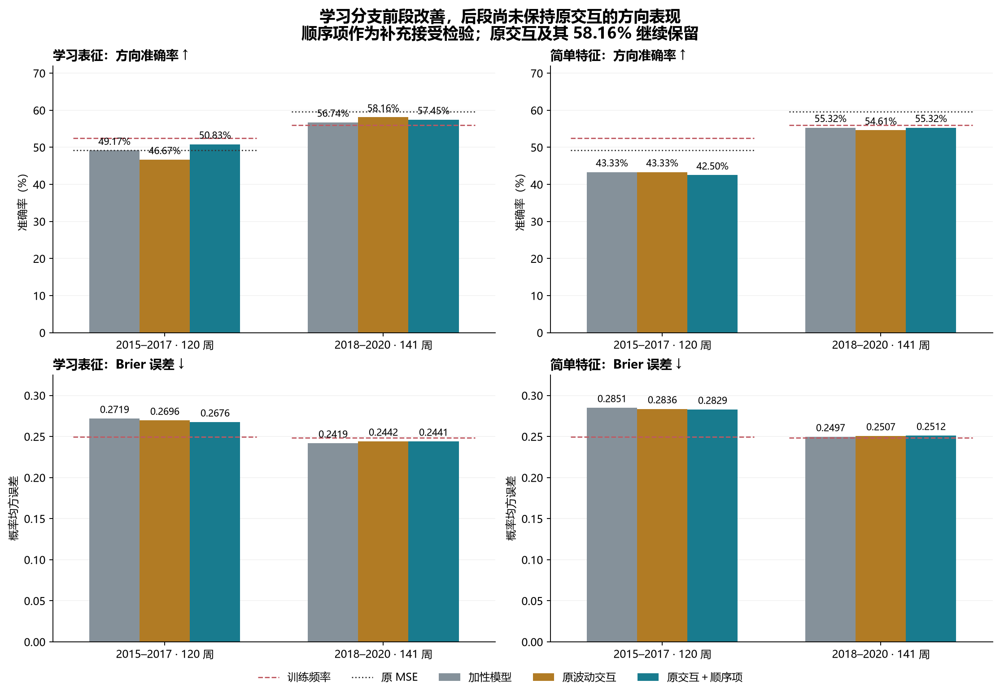
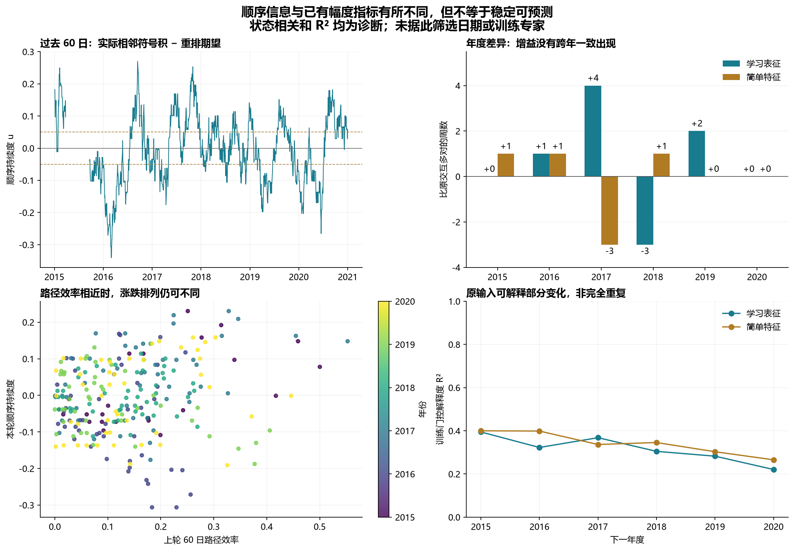

# 第二十三轮方法测试：在原交互上增加涨跌顺序信息

2026-09-12｜沪深 300｜30 个新分类头｜原交互保留｜历史研究实验

本轮有局部改善，尚不足以替代原模型。学习分支从原交互的前段 56/120（46.67%）提高到 61/120（50.83%）：改变的 5 个方向全部由错变对。后段从 82/141（58.16%）降到 81/141（57.45%），5 次变化中 2 次由错变对、3 次由对变错。原交互和新增顺序项的结果均继续保留。

学习分支的 Brier 前段从 0.269597 降到 0.267551，后段从 0.244168 微降到 0.244092；后段仍不如原加性模型的 0.241936。简单特征分支前段准确率由 43.33% 降到 42.50%，后段由 54.61% 升到 55.32%，没有一致改善。

26 项固定比较中没有经 Holm 校正后显著的改善或恶化。学习分支前段相对原交互的方向改善，原始 p=0.0212，校正后 p=0.5087。两个候选都未通过冻结的跨时期描述筛选。数值复算 PASS 只说明实现和计算通过核验。

## 本轮检验什么

上一轮路径效率只利用收益总和与绝对收益总和，不能区分同一组日收益仅改变先后顺序的不同排列。本轮只增加一个“顺序持续度”门控，用相邻涨跌符号是否更容易连续，提供含时间顺序的信息。

本轮父模型直接采用第十九轮原波动交互，而第廿二轮父模型是第十八轮加性模型。因此本轮对原交互的比较是受控的新增项检验；不能把与上轮不同方法的表现差异全部归因于状态定义。新增项沿用第十九轮缓存中的原监督射线，不改用第十九轮重新拟合的前 25 个系数。

在每个年度，保留原交互的全部输入坐标和变换，追加一个经过训练期残差化的顺序乘积。所有分类系数（包括原波动交互系数）允许重新拟合；新增顺序系数设为零时精确包含原交互模型。原模型预测本身另外完整保存，并未覆盖。

## 顺序持续度的定义与边界

取截至当天的 60 个日涨跌符号 s_i：收盘价比前一日大为 +1、小为 −1、完全相等为 0。使用直接价格比较，不设微小变动阈值。

实际相邻符号积均值 A=(Σ_{i=2}^{60}s_i s_{i−1})/59。同号且非零贡献 +1，异号贡献 −1，其中任何一天平价贡献 0。保持这 60 个符号的数量不变、均匀随机重排时，相邻符号积的精确期望为 B=((Σs_i)²−Σs_i²)/(60×59)。新门控 u=A−B。

B 的公式来自两项无放回抽取：所有有序不同位置的符号乘积之和是 (Σs)²−Σs²。每个相邻对的期望相同，所以相邻乘积的平均期望也是 B。本轮直接使用解析值，没有逐窗口随机打乱、没有从未来估计参数。含平价符号的小样本全排列检查已经通过。

u>0 表示相对同一涨跌数量的随机排列，同号相邻更多；u<0 表示交替更多。它不是状态后验概率，也不是标准相关系数或随机性检验的 p 值。连续段与随机性的背景可参见 [NIST Runs Test 说明](https://www.itl.nist.gov/div898/handbook/eda/section3/eda35d.htm)，本轮使用的是自定义中心化符号积，而非调用该检验。

| 固定 60 日例子 | 上涨数 | 下跌数 | 实际 A | 重排期望 B | 顺序持续度 u |
| --- | --- | --- | --- | --- | --- |
| 先 40 次涨、后 20 次跌 | 40 | 20 | 0.966102 | 0.096045 | 0.870056 |
| 重复（涨、跌、涨、跌、涨、涨） | 40 | 20 | -0.355932 | 0.096045 | -0.451977 |

这个指标对任意重排通常敏感，但仍有边界：全部上涨、全部下跌或全部平价都会得到 u=0，因为给定这种符号数量后已没有排列变化；它不等于没有趋势。它忽略收益幅度，对整体涨跌符号翻转、时间反转不变，也不刻画所有更长滞后的依赖关系。

只有一个固定 60 日窗口和一阶相邻关系，不搜索窗口、滞后或阈值。描述组固定为 u<−0.05、−0.05≤u≤0.05、u>0.05；“接近零”不代表已证实随机。模型使用连续值，分组只用于诊断。

## 数据、因果性与模型

所有样本和评估口径沿用旧实验：沪深 300 数据源共 4046 根日线（2010-01-04 至 2026-08-31），本轮只评分 2015–2020 年反复使用过的 261 个周信号。前段 120 周、后段 141 周。后段指 2018–2020，不是新的 2026 留出集。

六折的训练样本数为 1077、1190、1434、1678、1921、2165；下一年测试为 22、48、50、49、46、46。训练只含 joint_completed≤cutoff 的标签，目标为已有执行口径下周收益严格大于 0。较早测试日的标签成熟后可进入后续训练折。

公式本身需要 61 个收盘价。为保持与上轮日状态诊断的有效历史一致，本轮仍要求 121 根 OHLC 日线有效；旧分类观察窗口要求 125 根，更严格，所以训练／评分样本没有变化。2015-03-27 无效条导致 121 个日步的状态缺失，2015 年状态诊断只剩 123 个有效日，周评分仍为 22 个。没有填补或压缩缺失日，连续段在缺失处中断。

符号门控是完全确定的过去窗口函数，修改未来价格不改变此前特征。原神经表征、监督射线、OLS 变换和分类头仍按整段训练样本拟合，不能称整个模型为时间顺序 OOF。

令 X_parent 为原第十九轮标准化输入，包括第十八轮加性坐标和原波动交互；r=X_parent[:25]·ray，ray 精确复用第十九轮缓存中的第十八轮监督射线。对 q=u·r 在训练期做 q~[X_parent,1] 的 OLS，残差按训练均值和总体标准差（下限 10⁻⁶）变成 h_order。把它追加到原输入，下一年冻结射线、投影和归一化参数。

学习分支 18 个头由 30 变成 31 个斜率，简单分支 6 个头由 27 变成 28 个斜率。仅顺序对照有 6 个头，每个把 u 按训练均值／标准差变成单坐标，再拟合一个斜率和截距。共 30 个头、762 个分类系数（含截距）、24 个新乘积投影、47325 行累计训练输入；投影参数另计。

统一采用 λ=0.01 的等权岭逻辑回归，截距不惩罚，严格 p>0.5 判涨。学习分支平均三个种子的概率。本轮不新增神经训练、神经前向或 HMM 拟合。训练内目标的下降是嵌套模型增加自由度后的拟合结果，不是泛化证明。

## 主要结果

准确率与 AUROC 越高越好，Brier 与对数损失越低越好。原 MSE 的收益分数未经概率校准，不报告 Brier 或对数损失。

### 2015–2017

| 方法 | 正确/样本 | 准确率 | 平衡准确率 | AUROC | Brier | 对数损失 |
| --- | --- | --- | --- | --- | --- | --- |
| 学习表征＋加性市场特征 | 59/120 | 49.17% | 49.55% | 0.488313 | 0.271899 | 0.740763 |
| 学习表征＋原波动交互 | 56/120 | 46.67% | 46.92% | 0.500422 | 0.269597 | 0.735540 |
| 学习表征＋原交互＋顺序项 | 61/120 | 50.83% | 50.84% | 0.507744 | 0.267551 | 0.732927 |
| 简单特征＋加性趋势 | 52/120 | 43.33% | 46.30% | 0.457899 | 0.285063 | 0.768797 |
| 简单特征＋原波动交互 | 52/120 | 43.33% | 46.49% | 0.448888 | 0.283603 | 0.767351 |
| 简单特征＋原交互＋顺序项 | 51/120 | 42.50% | 45.75% | 0.448043 | 0.282931 | 0.765001 |
| 仅顺序指标 | 60/120 | 50.00% | 49.11% | 0.479020 | 0.251551 | 0.696265 |
| 原 MSE 模型 | 59/120 | 49.17% | 48.17% | 0.487750 | — | — |
| 全训练期上涨频率 | 63/120 | 52.50% | 48.79% | 0.494086 | 0.249839 | 0.692824 |

### 2018–2020

| 方法 | 正确/样本 | 准确率 | 平衡准确率 | AUROC | Brier | 对数损失 |
| --- | --- | --- | --- | --- | --- | --- |
| 学习表征＋加性市场特征 | 80/141 | 56.74% | 55.84% | 0.602082 | 0.241936 | 0.676994 |
| 学习表征＋原波动交互 | 82/141 | 58.16% | 57.45% | 0.592895 | 0.244168 | 0.681889 |
| 学习表征＋原交互＋顺序项 | 81/141 | 57.45% | 56.47% | 0.595958 | 0.244092 | 0.681886 |
| 简单特征＋加性趋势 | 78/141 | 55.32% | 54.75% | 0.549000 | 0.249651 | 0.692508 |
| 简单特征＋原波动交互 | 77/141 | 54.61% | 53.77% | 0.538996 | 0.250733 | 0.694682 |
| 简单特征＋原交互＋顺序项 | 78/141 | 55.32% | 54.57% | 0.532054 | 0.251154 | 0.695461 |
| 仅顺序指标 | 78/141 | 55.32% | 49.54% | 0.445794 | 0.249066 | 0.691277 |
| 原 MSE 模型 | 84/141 | 59.57% | 58.20% | 0.601470 | — | — |
| 全训练期上涨频率 | 79/141 | 56.03% | 50.00% | 0.480604 | 0.248705 | 0.690557 |

前段学习分支相对原加性为 +2 个正确方向，相对原交互为 +5；后段相对加性为 +1，相对原交互为 −1。这是不同对照给出的不同结论，不能只挑一个有利的对照。仅顺序指标前／后段准确率为 50.00%／55.32%，Brier 均高于训练频率基准，未显示单独可用的稳定方向能力。

### 每年正确周数

| 年份 | 样本 | 学习表征＋加性市场特征 | 学习表征＋原波动交互 | 学习表征＋原交互＋顺序项 | 仅顺序指标 | 原 MSE 模型 | 全训练期上涨频率 |
| --- | --- | --- | --- | --- | --- | --- | --- |
| 2015 | 22 | 12 | 12 | 12 | 13 | 11 | 9 |
| 2016 | 48 | 25 | 23 | 24 | 24 | 25 | 26 |
| 2017 | 50 | 22 | 21 | 25 | 23 | 23 | 28 |
| 2018 | 49 | 30 | 32 | 29 | 21 | 32 | 21 |
| 2019 | 46 | 25 | 24 | 26 | 29 | 26 | 30 |
| 2020 | 46 | 25 | 26 | 26 | 28 | 26 | 28 |

| 年份 | 样本 | 简单特征＋加性趋势 | 简单特征＋原波动交互 | 简单特征＋原交互＋顺序项 | 仅顺序指标 | 原 MSE 模型 | 全训练期上涨频率 |
| --- | --- | --- | --- | --- | --- | --- | --- |
| 2015 | 22 | 8 | 9 | 10 | 13 | 11 | 9 |
| 2016 | 48 | 23 | 22 | 23 | 24 | 25 | 26 |
| 2017 | 50 | 21 | 21 | 18 | 23 | 23 | 28 |
| 2018 | 49 | 27 | 27 | 28 | 21 | 32 | 21 |
| 2019 | 46 | 23 | 23 | 23 | 29 | 26 | 30 |
| 2020 | 46 | 28 | 27 | 27 | 28 | 26 | 28 |

学习分支相对原交互，2015–2020 各年的正确数变化依次为 0、+1、+4、−3、+2、0。前段的改善主要来自 2017 年；后段 2018 年的损失抵消了 2019 年的收益。不能据此事后规定某几个年份启用或停用顺序项。

## 状态信息与连续性诊断

本轮顺序持续度与 |trend60| 的训练相关系数约为 −0.074 至 0.095，评分周逐年约为 −0.447 至 0.575，没有上一轮路径效率接近 1 的相关模式。它提供了不同角度的描述，但低相关不保证含有未来标签的额外信息。

| 预测年 | 与原波动20相关 | 与 |trend60| 相关 | 与路径效率60相关 | 与相对波动相关 |
| --- | --- | --- | --- | --- |
| 2015 | 0.054403 | 0.575468 | 0.571342 | 0.708048 |
| 2016 | -0.717898 | -0.254209 | -0.247507 | -0.216265 |
| 2017 | -0.006543 | 0.380452 | 0.428056 | 0.043867 |
| 2018 | -0.176665 | 0.135181 | 0.142380 | -0.154137 |
| 2019 | -0.548888 | -0.447456 | -0.454381 | -0.753128 |
| 2020 | 0.089873 | 0.207312 | 0.233838 | 0.035435 |

原输入线性解释顺序门控的训练 R² 约为 0.199–0.416，说明部分变化已有线性解释、部分未被线性解释。这个 R² 不是预测涨跌的 R²，也没有被用作自动选择条件。

| 候选 | 门控解释度 R² 最小 | 均值 | 最大 |
| --- | --- | --- | --- |
| 学习表征＋原交互＋顺序项 | 0.199282 | 0.315605 | 0.415839 |
| 简单特征＋原交互＋顺序项 | 0.265691 | 0.341662 | 0.400052 |

| 预测年 | 有效日 | 缺失日 | 正顺序组占比 | 相邻相关 | 切换/相邻对 | 观察段中位数 | 最长观察段 | 删失段/总段 |
| --- | --- | --- | --- | --- | --- | --- | --- | --- |
| 2015 | 123 | 121 | 37.40% | 0.9714 | 17/121 | 4 | 36 | 4/19 |
| 2016 | 244 | 0 | 23.36% | 0.9814 | 20/243 | 5 | 91 | 2/21 |
| 2017 | 244 | 0 | 50.41% | 0.9716 | 17/243 | 6 | 70 | 2/18 |
| 2018 | 243 | 0 | 21.40% | 0.8924 | 39/242 | 3.5 | 35 | 2/40 |
| 2019 | 244 | 0 | 27.46% | 0.9631 | 22/243 | 5 | 62 | 2/23 |
| 2020 | 243 | 0 | 43.21% | 0.9742 | 24/242 | 3 | 61 | 2/25 |

60 日滚动窗口相互重叠会提高状态自相关。连续段按有效相邻交易锚点计数，缺失和年度边界导致删失，表中长度只是观察到的段长，不能当成完整真实市场阶段的持续期。

### 固定顺序组的结果

新分组前段样本数为 47／30／43，后段为 43／54／44。下表全部报告；这些仍是相关的历史样本，没有按状态选择交易或挑选有利子组。旧分组及新分组共 26 个状态单元、29 个方法、两个时期，共 1508 行状态指标，少于 20 的旧单元继续标为稀疏。

### 2015–2017 顺序组

| 顺序组 | 方法 | 样本 | 准确率 | Brier |
| --- | --- | --- | --- | --- |
| negative_order | 学习表征＋原波动交互 | 47 | 46.81% | 0.260417 |
| negative_order | 学习表征＋原交互＋顺序项 | 47 | 48.94% | 0.250518 |
| negative_order | 简单特征＋原交互＋顺序项 | 47 | 46.81% | 0.284644 |
| negative_order | 仅顺序指标 | 47 | 55.32% | 0.248739 |
| negative_order | 全训练期上涨频率 | 47 | 42.55% | 0.251340 |
| near_zero_order | 学习表征＋原波动交互 | 30 | 43.33% | 0.263425 |
| near_zero_order | 学习表征＋原交互＋顺序项 | 30 | 46.67% | 0.262573 |
| near_zero_order | 简单特征＋原交互＋顺序项 | 30 | 40.00% | 0.252631 |
| near_zero_order | 仅顺序指标 | 30 | 53.33% | 0.248641 |
| near_zero_order | 全训练期上涨频率 | 30 | 66.67% | 0.247710 |
| positive_order | 学习表征＋原波动交互 | 43 | 48.84% | 0.283937 |
| positive_order | 学习表征＋原交互＋顺序项 | 43 | 55.81% | 0.289642 |
| positive_order | 简单特征＋原交互＋顺序项 | 43 | 39.53% | 0.302199 |
| positive_order | 仅顺序指标 | 43 | 41.86% | 0.256654 |
| positive_order | 全训练期上涨频率 | 43 | 53.49% | 0.249682 |

### 2018–2020 顺序组

| 顺序组 | 方法 | 样本 | 准确率 | Brier |
| --- | --- | --- | --- | --- |
| negative_order | 学习表征＋原波动交互 | 43 | 53.49% | 0.245964 |
| negative_order | 学习表征＋原交互＋顺序项 | 43 | 55.81% | 0.245063 |
| negative_order | 简单特征＋原交互＋顺序项 | 43 | 58.14% | 0.243238 |
| negative_order | 仅顺序指标 | 43 | 62.79% | 0.243702 |
| negative_order | 全训练期上涨频率 | 43 | 62.79% | 0.246268 |
| near_zero_order | 学习表征＋原波动交互 | 54 | 59.26% | 0.239194 |
| near_zero_order | 学习表征＋原交互＋顺序项 | 54 | 55.56% | 0.239192 |
| near_zero_order | 简单特征＋原交互＋顺序项 | 54 | 53.70% | 0.252368 |
| near_zero_order | 仅顺序指标 | 54 | 42.59% | 0.254382 |
| near_zero_order | 全训练期上涨频率 | 54 | 42.59% | 0.253879 |
| positive_order | 学习表征＋原波动交互 | 44 | 61.36% | 0.248518 |
| positive_order | 学习表征＋原交互＋顺序项 | 44 | 61.36% | 0.249157 |
| positive_order | 简单特征＋原交互＋顺序项 | 44 | 54.55% | 0.257401 |
| positive_order | 仅顺序指标 | 44 | 63.64% | 0.247784 |
| positive_order | 全训练期上涨频率 | 44 | 65.91% | 0.244738 |

## 固定比较与筛选

每个时期 13 项，共 26 项，候选减对照损失，负值较好。循环区块长度 8 个保留观测，10000 次重采样，随机种子 20260910，两段单独生成。95% 区间为边际区间，双侧中心化 p 在全部 26 项上进行 Holm 校正；没有校正之前多轮历史设计选择，也没有使用合并时期作主要检验。

| 时期 | 候选 / 对照 | 损失 | 差值 | 95% 区间 | 原始 p | Holm p |
| --- | --- | --- | --- | --- | --- | --- |
| 2015–2017 | 学习表征＋原交互＋顺序项 / 学习表征＋原波动交互 | Brier | -0.002046 | [-0.008528, +0.003707] | 0.5125 | 1.0000 |
| 2015–2017 | 学习表征＋原交互＋顺序项 / 学习表征＋原波动交互 | 方向错误率 | -0.041667 | [-0.075000, -0.008333] | 0.0212 | 0.5087 |
| 2015–2017 | 学习表征＋原交互＋顺序项 / 学习表征＋加性市场特征 | Brier | -0.004348 | [-0.016142, +0.006097] | 0.4377 | 1.0000 |
| 2015–2017 | 学习表征＋原交互＋顺序项 / 学习表征＋加性市场特征 | 方向错误率 | -0.016667 | [-0.066667, +0.033333] | 0.5103 | 1.0000 |
| 2015–2017 | 学习表征＋原交互＋顺序项 / 全训练期上涨频率 | Brier | +0.017713 | [-0.003652, +0.038673] | 0.0984 | 1.0000 |
| 2015–2017 | 学习表征＋原交互＋顺序项 / 仅顺序指标 | Brier | +0.016000 | [-0.005898, +0.037667] | 0.1492 | 1.0000 |
| 2015–2017 | 简单特征＋原交互＋顺序项 / 简单特征＋原波动交互 | Brier | -0.000672 | [-0.005381, +0.003280] | 0.7646 | 1.0000 |
| 2015–2017 | 简单特征＋原交互＋顺序项 / 简单特征＋原波动交互 | 方向错误率 | +0.008333 | [-0.033333, +0.050000] | 0.6692 | 1.0000 |
| 2015–2017 | 简单特征＋原交互＋顺序项 / 简单特征＋加性趋势 | Brier | -0.002132 | [-0.007512, +0.003699] | 0.4524 | 1.0000 |
| 2015–2017 | 简单特征＋原交互＋顺序项 / 简单特征＋加性趋势 | 方向错误率 | +0.008333 | [-0.041667, +0.058333] | 0.7432 | 1.0000 |
| 2015–2017 | 简单特征＋原交互＋顺序项 / 全训练期上涨频率 | Brier | +0.033093 | [+0.013464, +0.055339] | 0.0028 | 0.0728 |
| 2015–2017 | 简单特征＋原交互＋顺序项 / 仅顺序指标 | Brier | +0.031380 | [+0.011971, +0.052707] | 0.0034 | 0.0850 |
| 2015–2017 | 仅顺序指标 / 全训练期上涨频率 | Brier | +0.001712 | [-0.003190, +0.006420] | 0.4771 | 1.0000 |
| 2018–2020 | 学习表征＋原交互＋顺序项 / 学习表征＋原波动交互 | Brier | -0.000076 | [-0.002008, +0.002003] | 0.9340 | 1.0000 |
| 2018–2020 | 学习表征＋原交互＋顺序项 / 学习表征＋原波动交互 | 方向错误率 | +0.007092 | [-0.028369, +0.042553] | 0.7044 | 1.0000 |
| 2018–2020 | 学习表征＋原交互＋顺序项 / 学习表征＋加性市场特征 | Brier | +0.002156 | [-0.000388, +0.004882] | 0.1046 | 1.0000 |
| 2018–2020 | 学习表征＋原交互＋顺序项 / 学习表征＋加性市场特征 | 方向错误率 | -0.007092 | [-0.028369, +0.014184] | 0.5635 | 1.0000 |
| 2018–2020 | 学习表征＋原交互＋顺序项 / 全训练期上涨频率 | Brier | -0.004613 | [-0.022458, +0.012795] | 0.6079 | 1.0000 |
| 2018–2020 | 学习表征＋原交互＋顺序项 / 仅顺序指标 | Brier | -0.004974 | [-0.023378, +0.012777] | 0.5910 | 1.0000 |
| 2018–2020 | 简单特征＋原交互＋顺序项 / 简单特征＋原波动交互 | Brier | +0.000422 | [-0.002235, +0.003030] | 0.7512 | 1.0000 |
| 2018–2020 | 简单特征＋原交互＋顺序项 / 简单特征＋原波动交互 | 方向错误率 | -0.007092 | [-0.021277, +0.000000] | 0.2674 | 1.0000 |
| 2018–2020 | 简单特征＋原交互＋顺序项 / 简单特征＋加性趋势 | Brier | +0.001503 | [-0.001740, +0.004796] | 0.3709 | 1.0000 |
| 2018–2020 | 简单特征＋原交互＋顺序项 / 简单特征＋加性趋势 | 方向错误率 | +0.000000 | [-0.035461, +0.042553] | 1.0000 | 1.0000 |
| 2018–2020 | 简单特征＋原交互＋顺序项 / 全训练期上涨频率 | Brier | +0.002449 | [-0.008824, +0.014216] | 0.6732 | 1.0000 |
| 2018–2020 | 简单特征＋原交互＋顺序项 / 仅顺序指标 | Brier | +0.002088 | [-0.009436, +0.014362] | 0.7267 | 1.0000 |
| 2018–2020 | 仅顺序指标 / 全训练期上涨频率 | Brier | +0.000361 | [-0.001164, +0.001866] | 0.6440 | 1.0000 |

11 条描述条件仍冻结为：准确率超过原交互、原加性、原 MSE、训练频率（4 条）；Brier 低于原交互、原加性、训练频率、仅顺序（4 条）；对数损失低于训练频率（1 条）；至少两年准确率超过原 MSE、至少两年 Brier 低于训练频率（2 条）。相等不通过，两段必须全部满足；仅顺序对照不自动晋升。

| 时期 | 候选 | 满足条件 | 跨时期通过 | 原交互留存 |
| --- | --- | --- | --- | --- |
| 2015–2017 | 学习表征＋原交互＋顺序项 | 6/11 | 否 | 是 |
| 2015–2017 | 简单特征＋原交互＋顺序项 | 2/11 | 否 | 是 |
| 2018–2020 | 学习表征＋原交互＋顺序项 | 7/11 | 否 | 是 |
| 2018–2020 | 简单特征＋原交互＋顺序项 | 1/11 | 否 | 是 |

## 原交互是否得到保留

原模型本身的输入、系数、预测、报告与哈希记录保持原样。在新增模型里，原波动交互的特征也保留，但系数随整个分类头一起重新拟合；新模型精确嵌套原模型，并不等于把原模型所有系数永久锁定。

下表学习分支为三种子系数均值，简单分支为单次值。系数依赖训练标准化坐标，不能跨变换直接当作因果重要性。逐条总 logit 已拆成重拟合的基础部分、原波动交互部分、新顺序部分，且复算和为总值。

| 候选 | 预测年 | 重拟合原交互系数 | 新增顺序系数 |
| --- | --- | --- | --- |
| 学习表征＋原交互＋顺序项 | 2015 | -0.020165 | 0.116756 |
| 学习表征＋原交互＋顺序项 | 2016 | -0.139136 | 0.210140 |
| 学习表征＋原交互＋顺序项 | 2017 | 0.074159 | 0.082558 |
| 学习表征＋原交互＋顺序项 | 2018 | 0.116344 | 0.100831 |
| 学习表征＋原交互＋顺序项 | 2019 | -0.021950 | 0.118729 |
| 学习表征＋原交互＋顺序项 | 2020 | -0.024211 | 0.054172 |
| 简单特征＋原交互＋顺序项 | 2015 | 0.034407 | 0.055410 |
| 简单特征＋原交互＋顺序项 | 2016 | 0.071870 | 0.041182 |
| 简单特征＋原交互＋顺序项 | 2017 | 0.042169 | 0.049622 |
| 简单特征＋原交互＋顺序项 | 2018 | 0.062890 | 0.095101 |
| 简单特征＋原交互＋顺序项 | 2019 | 0.008599 | 0.077396 |
| 简单特征＋原交互＋顺序项 | 2020 | -0.033916 | 0.025155 |

## 实现复核

30 个头共执行 109 次 Newton 更新，均达到梯度无穷范数≤10⁻⁹且 Hessian 正定。独立 L-BFGS-B 核验全部 30 个分类目标；独立 QR 核验 24 个新投影及门控线性解释度。24 个模型均在新增系数为零时精确重现第十九轮父模型及其训练目标。

逐条新预测的最大误差为 1.665e-16；状态表全部数值（包含继承的波动／路径效率）的独立标量公式最大差为 3.569e-14。独立分类器目标差最大 1.621e-14、训练概率差最大 2.327e-07。复算系数没有用于交付预测。

核验包括六类小样本符号全排列期望、平价、同号、符号翻转／时间反转、价格缩放、三种状态的连续段中断与删失，以及 18 个真实历史边界的未来后缀扰动。12 组训练／测试状态序列和全部 1868 组指标、280 个可靠性分箱、26 项比较均复核通过。

3292 个旧证据文件哈希保持不变。新增 1305 条单模型概率，加上 11223 条旧记录共 12528 条；29 个方法各有 261 条集成记录，共 7569 条。复用原来已核验的 18 个神经状态与缓存，本轮没有重新运行神经网络。

以下为训练内拟合诊断，不能当成样本外成绩；学习模型为三个种子均值。

| 方法 | 截止日 | 训练准确率 | 训练 Brier | 带惩罚目标 |
| --- | --- | --- | --- | --- |
| 学习表征＋原交互＋顺序项 | 2014-12-31 | 63.57% | 0.220218 | 0.634224 |
| 学习表征＋原交互＋顺序项 | 2015-12-31 | 63.53% | 0.220803 | 0.635357 |
| 学习表征＋原交互＋顺序项 | 2016-12-31 | 61.32% | 0.229197 | 0.651637 |
| 学习表征＋原交互＋顺序项 | 2017-12-31 | 61.84% | 0.226567 | 0.646263 |
| 学习表征＋原交互＋顺序项 | 2018-12-31 | 62.99% | 0.224162 | 0.640862 |
| 学习表征＋原交互＋顺序项 | 2019-12-31 | 62.56% | 0.227753 | 0.648472 |
| 仅顺序指标 | 2014-12-31 | 53.30% | 0.248446 | 0.690126 |
| 仅顺序指标 | 2015-12-31 | 50.84% | 0.248834 | 0.690881 |
| 仅顺序指标 | 2016-12-31 | 50.63% | 0.248761 | 0.690736 |
| 仅顺序指标 | 2017-12-31 | 51.13% | 0.249293 | 0.691750 |
| 仅顺序指标 | 2018-12-31 | 48.72% | 0.249671 | 0.692501 |
| 仅顺序指标 | 2019-12-31 | 52.75% | 0.249436 | 0.692024 |
| 简单特征＋原交互＋顺序项 | 2014-12-31 | 60.91% | 0.228610 | 0.654226 |
| 简单特征＋原交互＋顺序项 | 2015-12-31 | 60.50% | 0.234231 | 0.664615 |
| 简单特征＋原交互＋顺序项 | 2016-12-31 | 59.27% | 0.236886 | 0.670136 |
| 简单特征＋原交互＋顺序项 | 2017-12-31 | 58.28% | 0.241155 | 0.677898 |
| 简单特征＋原交互＋顺序项 | 2018-12-31 | 57.83% | 0.241220 | 0.678216 |
| 简单特征＋原交互＋顺序项 | 2019-12-31 | 57.78% | 0.243100 | 0.681647 |

## 研究决定与下一步

保留全历史交互及其后段 58.16%，保留本轮学习顺序扩展前段的 +5 个正确方向和两个时期 Brier 小幅改善，作为尚待检验的研究线索。新增模型暂不替代原模型，简单特征分支也没有足够支持。上轮路径效率的小幅概率改善同样保留，不因本轮结果被删除。

下一轮优先检验顺序补充项能否以更小、更稳定的幅度工作。可以在严格按时间先后划分的训练数据上校验新增项，并对新增系数加强收缩，同时把原交互作为固定比较对象。选择是否使用顺序项，应根据当时可用的训练证据，不能看完 2017／2018 年结果后按年份开关。这个收缩实验尚未在本轮执行。

若下一步声称使用 OOF 条件校准，需要追溯上游表征、预处理、射线和父交互的估计日期；只把最后分类头做时间切分，不能自动使整个流程变成 OOF。有限的顺序信息研究仍优先于立即扩展两个大专家网络。

## 限制与文件

本轮 261 个历史评分日期已多次查看，**不能作为独立确认**。周标签在日频训练样本间重叠，8 观测区块重采样仅提供特定设定下的近似。2015 年覆盖不完整，状态没有外部真实标签。本轮没有交易成本、执行或净收益检验，也不等于完整论文方法复现；已经使用过的 2021–2026 年日期不能仅通过重新命名成为新的独立留出集。

冻结协议 SHA-256：`1d2e488dc4af6d4a55f9ddd65b544f0d1eb95fe6876f750cf4be4b6191a3d7a9`。

主要文件：[协议](../protocol.json)、[顺序公式](../states23.py)、[计算验证](verification.json)、[训练状态](training_signal_states.csv)、[评分状态](validation_signal_states.csv)、[日状态](validation_daily_states.csv)、[持续性](validation_stability.csv)、[连续段](validation_state_runs.csv)、[相关性](state_correlations.csv)、[输入解释度](gate_novelty.csv)、[逐条 logit 分解](interaction_components.csv)、[全部单模型预测](model_predictions.csv)、[集成预测](ensemble_predictions.csv)、[汇总指标](ensemble_metrics.csv)、[年度指标](yearly_metrics.csv)、[种子指标](seed_metrics.csv)、[状态指标](state_metrics.csv)、[可靠性分箱](reliability_bins.csv)、[方向变化](direction_changes.csv)、[固定比较](primary_comparisons.json)、[筛选结果](assessments.json)、[公式例子](report_facts.json)。

图表矢量版：[模型对比 SVG](order_extension_comparison.svg)、[顺序诊断 SVG](order_state_diagnostics.svg)。独立副本的空结果目录中按 prepare23.py → contract23.py → train23.py → score23.py → evaluate23.py → verify23.py 执行，科学计算解释器为 research_v4/.venv_gpu/Scripts/python.exe。当前冻结记录不可覆盖；报告绘图使用默认 Python。
