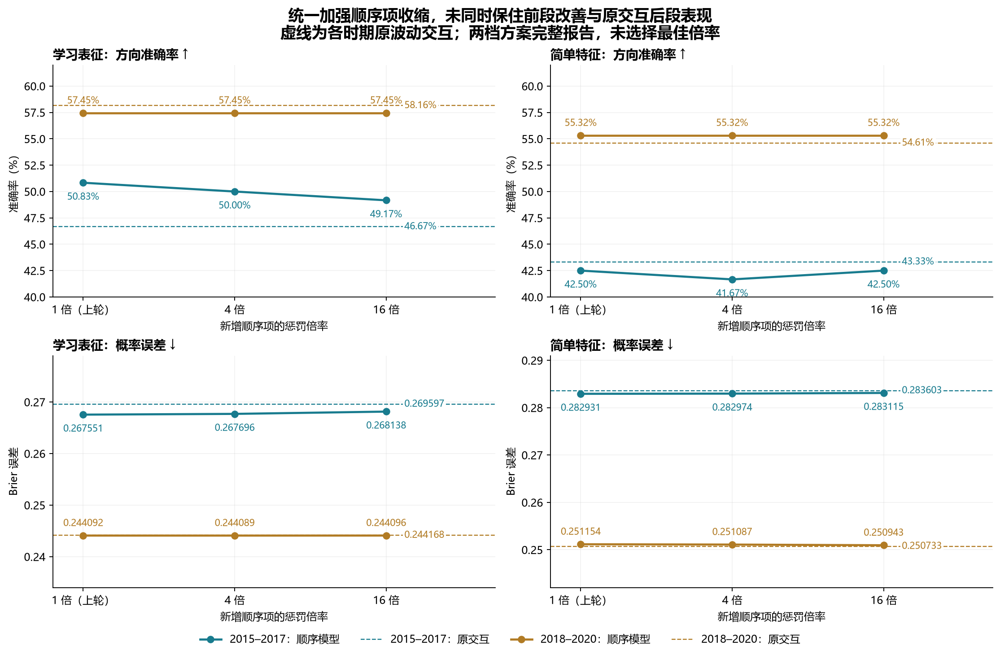
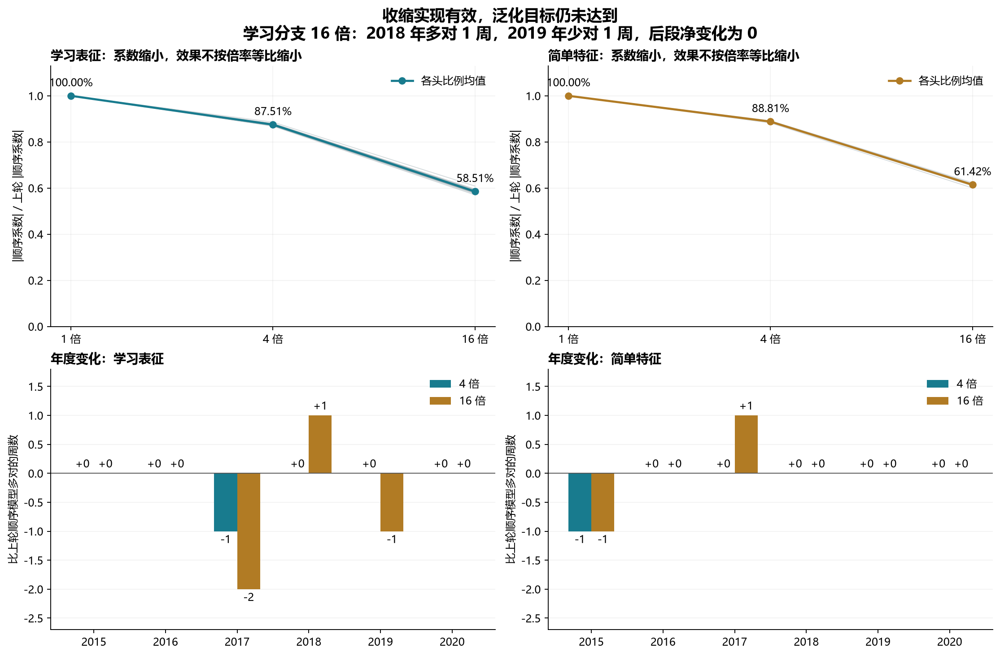

# 第二十四轮方法测试：仅加强新增顺序项的收缩

2026-09-12｜沪深 300｜4 倍、16 倍固定惩罚｜48 个最终分类头｜年度向前检验

**本轮没有达到“保住前段改善、恢复原交互后段表现”的目标。** 学习分支的前段准确率由上轮 61/120（50.83%），变为 4 倍的 60/120（50.00%）和 16 倍的 59/120（49.17%）。两档后段均为 81/141（57.45%），仍低于原交互 82/141（58.16%）。

新增系数确实缩小：学习分支 4 倍惩罚后的系数绝对值平均约为上轮的 87.51%，16 倍约为 58.51%。更强惩罚没有使系数等比缩小，也没有带来一致的评分改善。原交互、上轮顺序项以及更早路径效率的研究记录均保留，本轮两档模型暂不替代它们。

64 项固定比较经 Holm 校正后，没有显著改善或恶化。四个候选均未满足跨时期描述筛选，也未满足本轮的全部四项保留目标。实现独立复算 PASS 与预测能力改善是不同结论；这些历史样本已反复使用，不能作为独立确认。

## 固定方案与可归因的变化

完整复用第 23 轮的 31 维学习输入或 28 维简单输入，包括原波动交互和新增顺序交互。60 日顺序持续度、监督射线、残差投影、训练均值和标准差都保持原样。只把最后一维顺序项的惩罚从 0.01 增至 0.04 或 0.16；原波动交互和所有其他斜率仍用 0.01，截距不惩罚。

目标函数为：平均二元对数损失 + 0.01/2 × Σ（父模型斜率²）+ λ_order/2 × 顺序斜率²。所有系数一起重拟合，包括原波动交互。设顺序系数为零时精确包含第 19 轮原模型；无限大顺序惩罚的极限才是移除该项。本轮没有锁定父模型系数、没有预测后混合，也没有按年份启用或停用。

实现将原顺序特征 h 除以 √m，再运行已有的 0.01 岭逻辑回归；输出系数 θ_order 还原为 β_order=θ_order/√m。因而 θ_order²=mβ_order²，等价于所需的差异惩罚。缩小后的特征没有再做标准化，否则会抵消这一操作。原波动交互坐标没有缩放。

独立求解器直接使用未缩放输入和逐坐标惩罚向量；有限差分、梯度变换、目标值一致性以及六个人工数据拟合均核验通过。最终 48 个头还通过了原坐标中的独立 L-BFGS-B 解核验。

模型结构和样本固定时，提高唯一顺序系数的二次惩罚，最优解的该系数绝对值应不增。24 个来源模型全部满足这一性质。但总预测也受其他重拟合系数影响，样本外准确率、Brier 或离父模型的距离不必单调。

## 数据与时间顺序

沿用六个年底截止折：2014–2019 年底分别训练，预测下一年。每折训练数为 1077、1190、1434、1678、1921、2165；测试周数为 22、48、50、49、46、46。前段为 2015–2017 年 120 周，后段为 2018–2020 年 141 周。“后段”不是新的 2026 年留出集。

训练标签必须 joint_completed≤cutoff，保持原观察窗口、周收益目标、无效 OHLC 排除和严格 p>0.5 的判涨规则。学习分支取三个种子概率均值。没有新增数据、日期筛选、阈值选择、窗口选择或状态专家训练。两档参数都在本轮训练前固定并完整报告，没有依据年度测试结果选择一个最佳倍率。

已核对 24 条 R23→R19→R18→R17→R16 来源链、缓存行号、训练截止日与标签成熟时间，并核对学习检查点哈希。原神经表征、监督射线和交互变换在对应整段训练数据上估计，属于训练内拟合。只切分最后一个分类头不能把上游变成 OOF；本轮没有进行整条流程的时间顺序 OOF 重建或 OOF 参数选择。

上一轮通过的 18 个神经状态复核作为冻结证据继续使用，本轮神经前向、神经训练和 HMM 拟合次数均为零。顺序项仍是相邻涨跌符号积减去固定符号数量下的随机重排期望，忽略幅度且对符号翻转、时间反转不变；继承的 121 根日线有效条件与 125 根分类观察窗口也不变。

## 主要结果

准确率、平衡准确率和 AUROC 越高越好，Brier 与对数损失越低越好。原 MSE 模型不是概率输出，因此不报告其概率损失。

### 2015–2017

| 方法 | 正确/样本 | 准确率 | 平衡准确率 | AUROC | Brier | 对数损失 |
| --- | --- | --- | --- | --- | --- | --- |
| 学习：加性模型 | 59/120 | 49.17% | 49.55% | 0.488313 | 0.271899 | 0.740763 |
| 学习：原波动交互 | 56/120 | 46.67% | 46.92% | 0.500422 | 0.269597 | 0.735540 |
| 学习：顺序项 1 倍（上轮） | 61/120 | 50.83% | 50.84% | 0.507744 | 0.267551 | 0.732927 |
| 学习：顺序项 4 倍惩罚 | 60/120 | 50.00% | 50.10% | 0.506618 | 0.267696 | 0.732875 |
| 学习：顺序项 16 倍惩罚 | 59/120 | 49.17% | 49.16% | 0.506055 | 0.268138 | 0.733141 |
| 简单：加性趋势 | 52/120 | 43.33% | 46.30% | 0.457899 | 0.285063 | 0.768797 |
| 简单：原波动交互 | 52/120 | 43.33% | 46.49% | 0.448888 | 0.283603 | 0.767351 |
| 简单：顺序项 1 倍（上轮） | 51/120 | 42.50% | 45.75% | 0.448043 | 0.282931 | 0.765001 |
| 简单：顺序项 4 倍惩罚 | 50/120 | 41.67% | 44.80% | 0.447480 | 0.282974 | 0.765143 |
| 简单：顺序项 16 倍惩罚 | 51/120 | 42.50% | 45.75% | 0.449732 | 0.283115 | 0.765625 |
| 仅顺序指标 | 60/120 | 50.00% | 49.11% | 0.479020 | 0.251551 | 0.696265 |
| 原 MSE 模型 | 59/120 | 49.17% | 48.17% | 0.487750 | — | — |
| 训练期上涨频率 | 63/120 | 52.50% | 48.79% | 0.494086 | 0.249839 | 0.692824 |

### 2018–2020

| 方法 | 正确/样本 | 准确率 | 平衡准确率 | AUROC | Brier | 对数损失 |
| --- | --- | --- | --- | --- | --- | --- |
| 学习：加性模型 | 80/141 | 56.74% | 55.84% | 0.602082 | 0.241936 | 0.676994 |
| 学习：原波动交互 | 82/141 | 58.16% | 57.45% | 0.592895 | 0.244168 | 0.681889 |
| 学习：顺序项 1 倍（上轮） | 81/141 | 57.45% | 56.47% | 0.595958 | 0.244092 | 0.681886 |
| 学习：顺序项 4 倍惩罚 | 81/141 | 57.45% | 56.47% | 0.595141 | 0.244089 | 0.681858 |
| 学习：顺序项 16 倍惩罚 | 81/141 | 57.45% | 56.65% | 0.593508 | 0.244096 | 0.681824 |
| 简单：加性趋势 | 78/141 | 55.32% | 54.75% | 0.549000 | 0.249651 | 0.692508 |
| 简单：原波动交互 | 77/141 | 54.61% | 53.77% | 0.538996 | 0.250733 | 0.694682 |
| 简单：顺序项 1 倍（上轮） | 78/141 | 55.32% | 54.57% | 0.532054 | 0.251154 | 0.695461 |
| 简单：顺序项 4 倍惩罚 | 78/141 | 55.32% | 54.57% | 0.533687 | 0.251087 | 0.695324 |
| 简单：顺序项 16 倍惩罚 | 78/141 | 55.32% | 54.57% | 0.534504 | 0.250943 | 0.695042 |
| 仅顺序指标 | 78/141 | 55.32% | 49.54% | 0.445794 | 0.249066 | 0.691277 |
| 原 MSE 模型 | 84/141 | 59.57% | 58.20% | 0.601470 | — | — |
| 训练期上涨频率 | 79/141 | 56.03% | 50.00% | 0.480604 | 0.248705 | 0.690557 |

学习分支 4 倍惩罚的前段 Brier 从 0.267551 变为 0.267696，后段从 0.244092 微降至 0.244089。16 倍的两段分别为 0.268138、0.244096。两档仍较原交互的 Brier 略低，但没有同时优于上轮顺序模型；后段也均不如原加性模型的 0.241936。

简单特征分支的前段准确率为 4 倍 41.67%、16 倍 42.50%，后段均为 55.32%。后段 Brier 随收缩略有下降，但仍高于原交互和训练频率。这个分支没有提供一致支持。

### 各年正确周数

| 年份 | 样本 | 学习：原波动交互 | 学习：顺序项 1 倍（上轮） | 学习：顺序项 4 倍惩罚 | 学习：顺序项 16 倍惩罚 | 原 MSE 模型 | 训练期上涨频率 |
| --- | --- | --- | --- | --- | --- | --- | --- |
| 2015 | 22 | 12 | 12 | 12 | 12 | 11 | 9 |
| 2016 | 48 | 23 | 24 | 24 | 24 | 25 | 26 |
| 2017 | 50 | 21 | 25 | 24 | 23 | 23 | 28 |
| 2018 | 49 | 32 | 29 | 29 | 30 | 32 | 21 |
| 2019 | 46 | 24 | 26 | 26 | 25 | 26 | 30 |
| 2020 | 46 | 26 | 26 | 26 | 26 | 26 | 28 |

| 年份 | 样本 | 简单：原波动交互 | 简单：顺序项 1 倍（上轮） | 简单：顺序项 4 倍惩罚 | 简单：顺序项 16 倍惩罚 | 原 MSE 模型 | 训练期上涨频率 |
| --- | --- | --- | --- | --- | --- | --- | --- |
| 2015 | 22 | 9 | 10 | 9 | 9 | 11 | 9 |
| 2016 | 48 | 22 | 23 | 23 | 23 | 25 | 26 |
| 2017 | 50 | 21 | 18 | 18 | 19 | 23 | 28 |
| 2018 | 49 | 27 | 28 | 28 | 28 | 32 | 21 |
| 2019 | 46 | 23 | 23 | 23 | 23 | 26 | 30 |
| 2020 | 46 | 27 | 27 | 27 | 27 | 26 | 28 |

学习分支相对上轮：4 倍只在 2017 年少对 1 周，后段的方向逐条完全一致；16 倍在 2017 年少对 2 周，2018 年多对 1 周、2019 年少对 1 周。16 倍确实修复了一个 2018 年判断，但同时损失一个 2019 年判断，后段净正确数未提高。

### 相对原交互与上轮的方向变化

| 时期 | 候选 | 对照 | 改变数 | 对→错 | 错→对 |
| --- | --- | --- | --- | --- | --- |
| 2015–2017 | 学习：顺序项 4 倍惩罚 | 学习：原波动交互 | 4 | 0 | 4 |
| 2015–2017 | 学习：顺序项 4 倍惩罚 | 学习：顺序项 1 倍（上轮） | 1 | 1 | 0 |
| 2015–2017 | 学习：顺序项 16 倍惩罚 | 学习：原波动交互 | 3 | 0 | 3 |
| 2015–2017 | 学习：顺序项 16 倍惩罚 | 学习：顺序项 1 倍（上轮） | 2 | 2 | 0 |
| 2015–2017 | 简单：顺序项 4 倍惩罚 | 简单：原波动交互 | 4 | 3 | 1 |
| 2015–2017 | 简单：顺序项 4 倍惩罚 | 简单：顺序项 1 倍（上轮） | 1 | 1 | 0 |
| 2015–2017 | 简单：顺序项 16 倍惩罚 | 简单：原波动交互 | 3 | 2 | 1 |
| 2015–2017 | 简单：顺序项 16 倍惩罚 | 简单：顺序项 1 倍（上轮） | 2 | 1 | 1 |
| 2018–2020 | 学习：顺序项 4 倍惩罚 | 学习：原波动交互 | 5 | 3 | 2 |
| 2018–2020 | 学习：顺序项 4 倍惩罚 | 学习：顺序项 1 倍（上轮） | 0 | 0 | 0 |
| 2018–2020 | 学习：顺序项 16 倍惩罚 | 学习：原波动交互 | 3 | 2 | 1 |
| 2018–2020 | 学习：顺序项 16 倍惩罚 | 学习：顺序项 1 倍（上轮） | 2 | 1 | 1 |
| 2018–2020 | 简单：顺序项 4 倍惩罚 | 简单：原波动交互 | 1 | 0 | 1 |
| 2018–2020 | 简单：顺序项 4 倍惩罚 | 简单：顺序项 1 倍（上轮） | 0 | 0 | 0 |
| 2018–2020 | 简单：顺序项 16 倍惩罚 | 简单：原波动交互 | 1 | 0 | 1 |
| 2018–2020 | 简单：顺序项 16 倍惩罚 | 简单：顺序项 1 倍（上轮） | 0 | 0 | 0 |

## 系数与影响幅度

系数统一在未缩放的第 23 轮原输入坐标中报告，不能直接比较求解器缩放坐标里的数值。学习分支按三个种子取系数均值。

| 来源分支 | 预测年 | 上轮 1 倍系数 | 4 倍系数 | 16 倍系数 |
| --- | --- | --- | --- | --- |
| 学习：顺序项 1 倍（上轮） | 2015 | 0.116756 | 0.102002 | 0.067918 |
| 学习：顺序项 1 倍（上轮） | 2016 | 0.210140 | 0.183709 | 0.122833 |
| 学习：顺序项 1 倍（上轮） | 2017 | 0.082558 | 0.072228 | 0.048459 |
| 学习：顺序项 1 倍（上轮） | 2018 | 0.100831 | 0.088027 | 0.058619 |
| 学习：顺序项 1 倍（上轮） | 2019 | 0.118729 | 0.103588 | 0.068790 |
| 学习：顺序项 1 倍（上轮） | 2020 | 0.054172 | 0.047482 | 0.031813 |
| 简单：顺序项 1 倍（上轮） | 2015 | 0.055410 | 0.048892 | 0.033268 |
| 简单：顺序项 1 倍（上轮） | 2016 | 0.041182 | 0.036497 | 0.025097 |
| 简单：顺序项 1 倍（上轮） | 2017 | 0.049622 | 0.044095 | 0.030525 |
| 简单：顺序项 1 倍（上轮） | 2018 | 0.095101 | 0.084612 | 0.058806 |
| 简单：顺序项 1 倍（上轮） | 2019 | 0.077396 | 0.068870 | 0.047867 |
| 简单：顺序项 1 倍（上轮） | 2020 | 0.025155 | 0.022441 | 0.015678 |

| 来源分支 | 惩罚倍率 | 系数绝对值比例最小 | 均值 | 最大 |
| --- | --- | --- | --- | --- |
| 学习：顺序项 1 倍（上轮） | 4 | 86.83% | 87.51% | 88.59% |
| 学习：顺序项 1 倍（上轮） | 16 | 57.02% | 58.51% | 60.86% |
| 简单：顺序项 1 倍（上轮） | 4 | 88.24% | 88.81% | 89.21% |
| 简单：顺序项 1 倍（上轮） | 16 | 60.04% | 61.42% | 62.33% |

下表把下一年顺序 logit 的标准差，以及相对原交互／上轮顺序模型的概率变化均方根按各头取均值。它们描述改动幅度，不是风险、净收益或因果重要性；跨年度合并的均值也不是模型选择标准。

| 候选 | 下一年顺序 logit 标准差均值 | 相对原交互概率变化 RMS 均值 | 相对上轮概率变化 RMS 均值 |
| --- | --- | --- | --- |
| 学习：顺序项 16 倍惩罚 | 0.074241 | 0.016124 | 0.011020 |
| 学习：顺序项 4 倍惩罚 | 0.111122 | 0.023832 | 0.003292 |
| 简单：顺序项 16 倍惩罚 | 0.043548 | 0.010053 | 0.006444 |
| 简单：顺序项 4 倍惩罚 | 0.063114 | 0.014618 | 0.001878 |

## 预先固定的保留目标

四项要求分别是：前段准确率不低于该分支上轮顺序模型；后段准确率不低于该分支原交互；前段和后段 Brier 各自不高于上轮。它们是描述性目标，不代表统计显著或独立确认。

| 候选 | 保住前段准确率 | 恢复原交互后段准确率 | 保住前段 Brier | 保住后段 Brier | 全部满足 |
| --- | --- | --- | --- | --- | --- |
| 学习：顺序项 4 倍惩罚 | 否 | 否 | 否 | 是 | 否 |
| 学习：顺序项 16 倍惩罚 | 否 | 否 | 否 | 否 | 否 |
| 简单：顺序项 4 倍惩罚 | 否 | 是 | 否 | 是 | 否 |
| 简单：顺序项 16 倍惩罚 | 是 | 是 | 否 | 是 | 否 |

保留原有 11 条严格筛选：准确率超过原交互、原加性、原 MSE、训练频率；Brier 低于原交互、原加性、训练频率、仅顺序；对数损失低于训练频率；至少两年准确率超过原 MSE、至少两年 Brier 低于训练频率。相等不通过，两段都要全部满足。

| 时期 | 候选 | 满足条件 | 跨时期通过 |
| --- | --- | --- | --- |
| 2015–2017 | 学习：顺序项 4 倍惩罚 | 6/11 | 否 |
| 2015–2017 | 学习：顺序项 16 倍惩罚 | 3/11 | 否 |
| 2015–2017 | 简单：顺序项 4 倍惩罚 | 2/11 | 否 |
| 2015–2017 | 简单：顺序项 16 倍惩罚 | 2/11 | 否 |
| 2018–2020 | 学习：顺序项 4 倍惩罚 | 7/11 | 否 |
| 2018–2020 | 学习：顺序项 16 倍惩罚 | 7/11 | 否 |
| 2018–2020 | 简单：顺序项 4 倍惩罚 | 1/11 | 否 |
| 2018–2020 | 简单：顺序项 16 倍惩罚 | 1/11 | 否 |

## 固定比较与不确定性

每候选每时期相对原交互、上轮顺序模型、原加性模型，各比较 Brier 和方向错误率；另比较训练频率与仅顺序的 Brier。共 4×2×8=64 项，全部一起 Holm 校正。候选减对照损失，负值较好。循环区块为 8 个保留观测，10000 次重采样，种子 20260910，各时期单独生成；区间为边际 95% 区间，p 为双侧中心化结果。没有合并时期的主要检验。

| 时期 | 候选 / 对照 | 损失 | 差值 | 95% 区间 | 原始 p | Holm p |
| --- | --- | --- | --- | --- | --- | --- |
| 2015–2017 | 学习：顺序项 4 倍惩罚 / 学习：原波动交互 | Brier | -0.001901 | [-0.007696, +0.003208] | 0.4928 | 1.0000 |
| 2015–2017 | 学习：顺序项 4 倍惩罚 / 学习：原波动交互 | 方向错误率 | -0.033333 | [-0.066667, -0.008333] | 0.0294 | 1.0000 |
| 2015–2017 | 学习：顺序项 4 倍惩罚 / 学习：顺序项 1 倍（上轮） | Brier | +0.000145 | [-0.000519, +0.000860] | 0.6765 | 1.0000 |
| 2015–2017 | 学习：顺序项 4 倍惩罚 / 学习：顺序项 1 倍（上轮） | 方向错误率 | +0.008333 | [+0.000000, +0.025000] | 0.6163 | 1.0000 |
| 2015–2017 | 学习：顺序项 4 倍惩罚 / 学习：加性模型 | Brier | -0.004203 | [-0.015365, +0.005647] | 0.4272 | 1.0000 |
| 2015–2017 | 学习：顺序项 4 倍惩罚 / 学习：加性模型 | 方向错误率 | -0.008333 | [-0.058333, +0.041667] | 0.7575 | 1.0000 |
| 2015–2017 | 学习：顺序项 4 倍惩罚 / 训练期上涨频率 | Brier | +0.017857 | [-0.003208, +0.038503] | 0.0890 | 1.0000 |
| 2015–2017 | 学习：顺序项 4 倍惩罚 / 仅顺序指标 | Brier | +0.016145 | [-0.005634, +0.037492] | 0.1401 | 1.0000 |
| 2015–2017 | 学习：顺序项 16 倍惩罚 / 学习：原波动交互 | Brier | -0.001459 | [-0.005547, +0.002080] | 0.4507 | 1.0000 |
| 2015–2017 | 学习：顺序项 16 倍惩罚 / 学习：原波动交互 | 方向错误率 | -0.025000 | [-0.050000, +0.000000] | 0.0785 | 1.0000 |
| 2015–2017 | 学习：顺序项 16 倍惩罚 / 学习：顺序项 1 倍（上轮） | Brier | +0.000587 | [-0.001656, +0.003032] | 0.6205 | 1.0000 |
| 2015–2017 | 学习：顺序项 16 倍惩罚 / 学习：顺序项 1 倍（上轮） | 方向错误率 | +0.016667 | [+0.000000, +0.050000] | 0.2938 | 1.0000 |
| 2015–2017 | 学习：顺序项 16 倍惩罚 / 学习：加性模型 | Brier | -0.003761 | [-0.013415, +0.004695] | 0.4065 | 1.0000 |
| 2015–2017 | 学习：顺序项 16 倍惩罚 / 学习：加性模型 | 方向错误率 | +0.000000 | [-0.050000, +0.050000] | 1.0000 | 1.0000 |
| 2015–2017 | 学习：顺序项 16 倍惩罚 / 训练期上涨频率 | Brier | +0.018300 | [-0.002000, +0.037931] | 0.0724 | 1.0000 |
| 2015–2017 | 学习：顺序项 16 倍惩罚 / 仅顺序指标 | Brier | +0.016587 | [-0.004492, +0.037282] | 0.1178 | 1.0000 |
| 2015–2017 | 简单：顺序项 4 倍惩罚 / 简单：原波动交互 | Brier | -0.000630 | [-0.004800, +0.002868] | 0.7509 | 1.0000 |
| 2015–2017 | 简单：顺序项 4 倍惩罚 / 简单：原波动交互 | 方向错误率 | +0.016667 | [-0.016667, +0.050000] | 0.3271 | 1.0000 |
| 2015–2017 | 简单：顺序项 4 倍惩罚 / 简单：顺序项 1 倍（上轮） | Brier | +0.000042 | [-0.000414, +0.000580] | 0.8683 | 1.0000 |
| 2015–2017 | 简单：顺序项 4 倍惩罚 / 简单：顺序项 1 倍（上轮） | 方向错误率 | +0.008333 | [+0.000000, +0.025000] | 0.6146 | 1.0000 |
| 2015–2017 | 简单：顺序项 4 倍惩罚 / 简单：加性趋势 | Brier | -0.002090 | [-0.007381, +0.003613] | 0.4512 | 1.0000 |
| 2015–2017 | 简单：顺序项 4 倍惩罚 / 简单：加性趋势 | 方向错误率 | +0.016667 | [-0.016667, +0.058333] | 0.3795 | 1.0000 |
| 2015–2017 | 简单：顺序项 4 倍惩罚 / 训练期上涨频率 | Brier | +0.033135 | [+0.013473, +0.055302] | 0.0029 | 0.1827 |
| 2015–2017 | 简单：顺序项 4 倍惩罚 / 仅顺序指标 | Brier | +0.031423 | [+0.011977, +0.052725] | 0.0034 | 0.2074 |
| 2015–2017 | 简单：顺序项 16 倍惩罚 / 简单：原波动交互 | Brier | -0.000488 | [-0.003342, +0.001908] | 0.7183 | 1.0000 |
| 2015–2017 | 简单：顺序项 16 倍惩罚 / 简单：原波动交互 | 方向错误率 | +0.008333 | [-0.016667, +0.041667] | 0.6314 | 1.0000 |
| 2015–2017 | 简单：顺序项 16 倍惩罚 / 简单：顺序项 1 倍（上轮） | Brier | +0.000184 | [-0.001379, +0.002029] | 0.8339 | 1.0000 |
| 2015–2017 | 简单：顺序项 16 倍惩罚 / 简单：顺序项 1 倍（上轮） | 方向错误率 | +0.000000 | [-0.025000, +0.025000] | 1.0000 | 1.0000 |
| 2015–2017 | 简单：顺序项 16 倍惩罚 / 简单：加性趋势 | Brier | -0.001948 | [-0.007154, +0.003633] | 0.4768 | 1.0000 |
| 2015–2017 | 简单：顺序项 16 倍惩罚 / 简单：加性趋势 | 方向错误率 | +0.008333 | [-0.025000, +0.050000] | 0.7041 | 1.0000 |
| 2015–2017 | 简单：顺序项 16 倍惩罚 / 训练期上涨频率 | Brier | +0.033276 | [+0.013468, +0.055167] | 0.0027 | 0.1728 |
| 2015–2017 | 简单：顺序项 16 倍惩罚 / 仅顺序指标 | Brier | +0.031564 | [+0.011953, +0.052831] | 0.0032 | 0.1984 |
| 2018–2020 | 学习：顺序项 4 倍惩罚 / 学习：原波动交互 | Brier | -0.000079 | [-0.001765, +0.001734] | 0.9212 | 1.0000 |
| 2018–2020 | 学习：顺序项 4 倍惩罚 / 学习：原波动交互 | 方向错误率 | +0.007092 | [-0.028369, +0.042553] | 0.7044 | 1.0000 |
| 2018–2020 | 学习：顺序项 4 倍惩罚 / 学习：顺序项 1 倍（上轮） | Brier | -0.000003 | [-0.000270, +0.000245] | 0.9767 | 1.0000 |
| 2018–2020 | 学习：顺序项 4 倍惩罚 / 学习：顺序项 1 倍（上轮） | 方向错误率 | +0.000000 | [+0.000000, +0.000000] | 1.0000 | 1.0000 |
| 2018–2020 | 学习：顺序项 4 倍惩罚 / 学习：加性模型 | Brier | +0.002153 | [-0.000197, +0.004647] | 0.0784 | 1.0000 |
| 2018–2020 | 学习：顺序项 4 倍惩罚 / 学习：加性模型 | 方向错误率 | -0.007092 | [-0.028369, +0.014184] | 0.5635 | 1.0000 |
| 2018–2020 | 学习：顺序项 4 倍惩罚 / 训练期上涨频率 | Brier | -0.004616 | [-0.022385, +0.012744] | 0.6052 | 1.0000 |
| 2018–2020 | 学习：顺序项 4 倍惩罚 / 仅顺序指标 | Brier | -0.004977 | [-0.023298, +0.012730] | 0.5884 | 1.0000 |
| 2018–2020 | 学习：顺序项 16 倍惩罚 / 学习：原波动交互 | Brier | -0.000073 | [-0.001187, +0.001128] | 0.8935 | 1.0000 |
| 2018–2020 | 学习：顺序项 16 倍惩罚 / 学习：原波动交互 | 方向错误率 | +0.007092 | [-0.014184, +0.028369] | 0.5560 | 1.0000 |
| 2018–2020 | 学习：顺序项 16 倍惩罚 / 学习：顺序项 1 倍（上轮） | Brier | +0.000003 | [-0.000877, +0.000821] | 0.9931 | 1.0000 |
| 2018–2020 | 学习：顺序项 16 倍惩罚 / 学习：顺序项 1 倍（上轮） | 方向错误率 | +0.000000 | [-0.021277, +0.021277] | 1.0000 | 1.0000 |
| 2018–2020 | 学习：顺序项 16 倍惩罚 / 学习：加性模型 | Brier | +0.002159 | [+0.000250, +0.004215] | 0.0342 | 1.0000 |
| 2018–2020 | 学习：顺序项 16 倍惩罚 / 学习：加性模型 | 方向错误率 | -0.007092 | [-0.028369, +0.014184] | 0.5582 | 1.0000 |
| 2018–2020 | 学习：顺序项 16 倍惩罚 / 训练期上涨频率 | Brier | -0.004610 | [-0.022214, +0.012527] | 0.6016 | 1.0000 |
| 2018–2020 | 学习：顺序项 16 倍惩罚 / 仅顺序指标 | Brier | -0.004970 | [-0.023137, +0.012599] | 0.5850 | 1.0000 |
| 2018–2020 | 简单：顺序项 4 倍惩罚 / 简单：原波动交互 | Brier | +0.000354 | [-0.002011, +0.002672] | 0.7642 | 1.0000 |
| 2018–2020 | 简单：顺序项 4 倍惩罚 / 简单：原波动交互 | 方向错误率 | -0.007092 | [-0.021277, +0.000000] | 0.2674 | 1.0000 |
| 2018–2020 | 简单：顺序项 4 倍惩罚 / 简单：顺序项 1 倍（上轮） | Brier | -0.000068 | [-0.000354, +0.000223] | 0.6405 | 1.0000 |
| 2018–2020 | 简单：顺序项 4 倍惩罚 / 简单：顺序项 1 倍（上轮） | 方向错误率 | +0.000000 | [+0.000000, +0.000000] | 1.0000 | 1.0000 |
| 2018–2020 | 简单：顺序项 4 倍惩罚 / 简单：加性趋势 | Brier | +0.001436 | [-0.001542, +0.004508] | 0.3577 | 1.0000 |
| 2018–2020 | 简单：顺序项 4 倍惩罚 / 简单：加性趋势 | 方向错误率 | +0.000000 | [-0.035461, +0.042553] | 1.0000 | 1.0000 |
| 2018–2020 | 简单：顺序项 4 倍惩罚 / 训练期上涨频率 | Brier | +0.002381 | [-0.008983, +0.014200] | 0.6834 | 1.0000 |
| 2018–2020 | 简单：顺序项 4 倍惩罚 / 仅顺序指标 | Brier | +0.002021 | [-0.009598, +0.014275] | 0.7365 | 1.0000 |
| 2018–2020 | 简单：顺序项 16 倍惩罚 / 简单：原波动交互 | Brier | +0.000211 | [-0.001437, +0.001821] | 0.7980 | 1.0000 |
| 2018–2020 | 简单：顺序项 16 倍惩罚 / 简单：原波动交互 | 方向错误率 | -0.007092 | [-0.021277, +0.000000] | 0.2674 | 1.0000 |
| 2018–2020 | 简单：顺序项 16 倍惩罚 / 简单：顺序项 1 倍（上轮） | Brier | -0.000211 | [-0.001207, +0.000801] | 0.6779 | 1.0000 |
| 2018–2020 | 简单：顺序项 16 倍惩罚 / 简单：顺序项 1 倍（上轮） | 方向错误率 | +0.000000 | [+0.000000, +0.000000] | 1.0000 | 1.0000 |
| 2018–2020 | 简单：顺序项 16 倍惩罚 / 简单：加性趋势 | Brier | +0.001292 | [-0.001134, +0.003869] | 0.3117 | 1.0000 |
| 2018–2020 | 简单：顺序项 16 倍惩罚 / 简单：加性趋势 | 方向错误率 | +0.000000 | [-0.035461, +0.042553] | 1.0000 | 1.0000 |
| 2018–2020 | 简单：顺序项 16 倍惩罚 / 训练期上涨频率 | Brier | +0.002238 | [-0.009195, +0.014123] | 0.7051 | 1.0000 |
| 2018–2020 | 简单：顺序项 16 倍惩罚 / 仅顺序指标 | Brier | +0.001877 | [-0.009883, +0.014168] | 0.7578 | 1.0000 |

这些校正没有覆盖之前多轮历史设计选择，不能把“没有显著恶化”解释为等效或非劣证明。逐状态的 26 个固定单元、33 个方法、两个时期全部保留为 1716 行诊断；少于 20 个样本继续标记稀疏，未据此筛选日期或选择倍率。

## 实现核验与完整运行记录

最终交付包含 48 个分类头、1500 个分类系数、75720 行累计训练输入，执行 186 次 Newton 更新；24 个已有顺序投影复用，没有新增投影拟合。训练在任何本轮新评分之前完成。梯度无穷范数≤10⁻⁹、Hessian 正定，48 个独立原坐标解均通过。

新预测最大复算误差 1.665e-16；独立目标值最大差 7.216e-15、训练概率最大差 2.761e-07。另核对 48 组训练／下一年输入、2130 组汇总／年度／种子／状态指标、320 个可靠性分箱和 64 项比较。独立求解器的系数没有替代交付预测。

第一遍已完成 48 个头及 2088 条新评分，但评估函数中的局部变量 flags 遮蔽同名函数，产生 UnboundLocalError，未生成评估结论。完整的 85 个文件及归档清单保存在 research_v24_attempt1。修复仅涉及变量名，并增加归档复核；模型设计、惩罚、样本和求解参数不变。随后重新冻结并完整重跑，两个版本的头记录与全部预测逐条一致。

因此本轮实际执行了 96 次主要拟合（首遍 48＋最终 48），共 372 次主要 Newton 更新；重复评分不增加独立样本数。最终独立核验为 48 个解，另外的人工数据检查单列。3389 个前轮证据文件加 86 个失败运行归档文件，共 3475 个哈希保持不变。

最终预测表有 2088 条本轮单头概率与 12528 条旧记录，共 14616 条；33 个方法各有 261 条集成记录，共 8613 条。训练内指标只作拟合诊断，不是样本外成绩。

| 方法 | 截止日 | 训练准确率 | 训练 Brier | 带惩罚目标 |
| --- | --- | --- | --- | --- |
| 学习：顺序项 16 倍惩罚 | 2014-12-31 | 63.63% | 0.220288 | 0.634856 |
| 学习：顺序项 16 倍惩罚 | 2015-12-31 | 63.36% | 0.221093 | 0.637318 |
| 学习：顺序项 16 倍惩罚 | 2016-12-31 | 61.69% | 0.229351 | 0.652314 |
| 学习：顺序项 16 倍惩罚 | 2017-12-31 | 61.82% | 0.226666 | 0.646853 |
| 学习：顺序项 16 倍惩罚 | 2018-12-31 | 62.73% | 0.224344 | 0.641489 |
| 学习：顺序项 16 倍惩罚 | 2019-12-31 | 62.60% | 0.227789 | 0.648616 |
| 学习：顺序项 4 倍惩罚 | 2014-12-31 | 63.73% | 0.220215 | 0.634414 |
| 学习：顺序项 4 倍惩罚 | 2015-12-31 | 63.45% | 0.220819 | 0.635945 |
| 学习：顺序项 4 倍惩罚 | 2016-12-31 | 61.41% | 0.229220 | 0.651841 |
| 学习：顺序项 4 倍惩罚 | 2017-12-31 | 61.84% | 0.226575 | 0.646440 |
| 学习：顺序项 4 倍惩罚 | 2018-12-31 | 63.02% | 0.224196 | 0.641051 |
| 学习：顺序项 4 倍惩罚 | 2019-12-31 | 62.62% | 0.227759 | 0.648515 |
| 简单：顺序项 16 倍惩罚 | 2014-12-31 | 61.19% | 0.228676 | 0.654364 |
| 简单：顺序项 16 倍惩罚 | 2015-12-31 | 60.34% | 0.234260 | 0.664693 |
| 简单：顺序项 16 倍惩罚 | 2016-12-31 | 58.65% | 0.236917 | 0.670249 |
| 简单：顺序项 16 倍惩罚 | 2017-12-31 | 58.46% | 0.241255 | 0.678317 |
| 简单：顺序项 16 倍惩罚 | 2018-12-31 | 58.09% | 0.241289 | 0.678493 |
| 简单：顺序项 16 倍惩罚 | 2019-12-31 | 57.69% | 0.243108 | 0.681677 |
| 简单：顺序项 4 倍惩罚 | 2014-12-31 | 60.72% | 0.228624 | 0.654266 |
| 简单：顺序项 4 倍惩罚 | 2015-12-31 | 60.50% | 0.234236 | 0.664638 |
| 简单：顺序项 4 倍惩罚 | 2016-12-31 | 59.21% | 0.236891 | 0.670168 |
| 简单：顺序项 4 倍惩罚 | 2017-12-31 | 58.05% | 0.241168 | 0.678019 |
| 简单：顺序项 4 倍惩罚 | 2018-12-31 | 57.83% | 0.241230 | 0.678296 |
| 简单：顺序项 4 倍惩罚 | 2019-12-31 | 57.78% | 0.243101 | 0.681655 |

## 研究决定与下一步

保留原交互后段 58.16%，保留上轮顺序扩展的前段 50.83% 及小幅概率改善。本轮两档收缩作为完整的未达目标记录保留。它们说明统一压小顺序项的幅度不足以解决已观察到的年度取舍，不能据此否定所有状态识别方法，也不能宣称已经证明需要按某一年切换。

下一步优先检验一个可分辨原因的改动：固定原交互模型的全部系数，将其 logit 作为固定基底，仅拟合一个顺序补充系数，观察后段损失来自新增项本身还是父模型系数重拟合的联动。这个实验尚未执行，固定基底也不保证方向准确率不会下降。暂不继续扩大统一惩罚的参数网格。

若之后希望让模型根据市场阶段自动启用补充项，先建立整个上游流程都按历史边界估计的时间顺序校验，再用当时可获得的证据确定规则。当前的年度向前结果可以用于探索，但不足以支撑一个经独立验证的状态选择器。

## 限制与文件

**不能作为独立确认**：261 个日期已被反复查看，2015 年覆盖不完整，标签在日频训练样本间重叠，固定长度区块重采样只是特定假设下的近似。没有交易成本、执行或净收益测试，没有完整复现论文方法。已经使用过的 2021–2026 年记录不能重新命名为独立留出集。

本轮最终冻结协议 SHA-256：`b00f8d681cecebf93d7166876c21d98c0304f1199d0c6a68af6d352754079314`。

主要文件：[协议](../protocol.json)、[独立验证](verification.json)、[时间来源链](temporal_provenance.csv)、[人工等价性测试](synthetic_penalty_checks.csv)、[收缩路径](shrinkage_path.csv)、[系数](coefficients.csv)、[影响幅度](component_summary.csv)、[逐条 logit 分解](interaction_components.csv)、[集成预测](ensemble_predictions.csv)、[全部单模型预测](model_predictions.csv)、[汇总指标](ensemble_metrics.csv)、[年度指标](yearly_metrics.csv)、[种子指标](seed_metrics.csv)、[状态指标](state_metrics.csv)、[固定比较](primary_comparisons.json)、[保留目标](retention_targets.csv)、[筛选结果](assessments.json)、[方向变化](direction_changes.csv)、[运行归档](../../research_v24_attempt1/attempt_preservation.json)。

图表矢量版：[表现 SVG](shrinkage_comparison.svg)、[机制 SVG](shrinkage_mechanism.svg)。复现请在独立副本及空结果目录中，保留前轮和首遍归档依赖，按 prepare24.py → contract24.py → train24.py → score24.py → evaluate24.py → verify24.py 顺序运行；计算解释器为 research_v4/.venv_gpu/Scripts/python.exe，报告绘图使用默认 Python。不得覆盖当前冻结记录。
