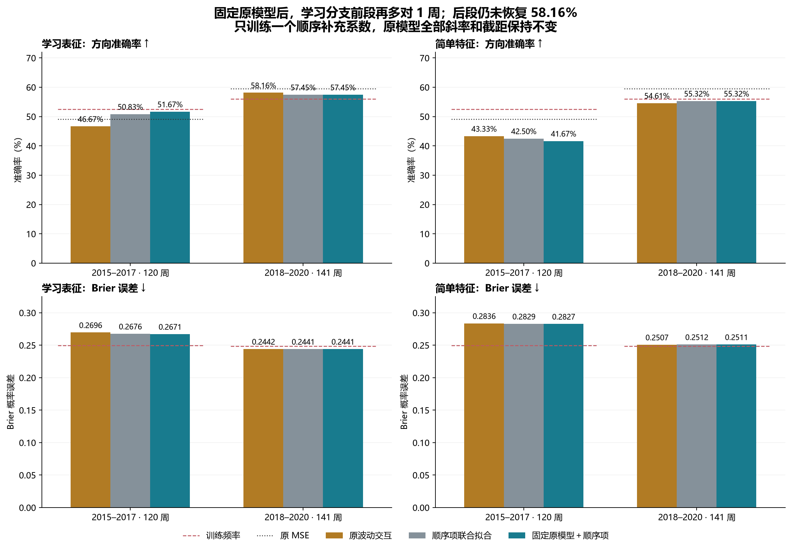
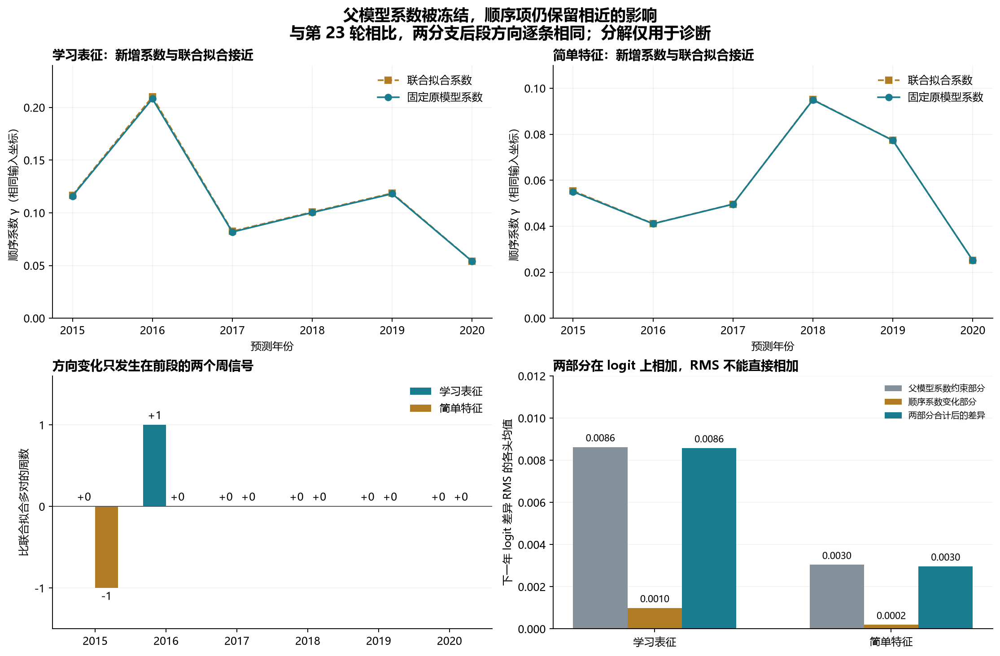

# 第二十五轮方法测试：固定原交互，只拟合一个顺序系数

2026-09-12｜沪深 300｜24 个单系数拟合｜原模型系数与截距冻结｜年度向前检验

**学习分支前段再改善 1 周，后段问题仍在。** 固定原波动交互后，前段准确率从第 23 轮联合拟合的 61/120（50.83%）提高到 62/120（51.67%）；相对原交互的 56/120（46.67%），共多对 6 周。后段为 81/141（57.45%），仍低于原交互的 82/141（58.16%），且与第 23 轮的方向逐条相同。

这说明在本次固定方案和历史样本上，后段损失并非只由父模型系数重拟合造成：完全锁定它们后，顺序补充项依然改变了原模型的 5 次后段判断，其中 3 次由对变错、2 次由错变对。这个结果不证明损失在未来必然重现，也不排除其他状态定义或训练方式。

学习分支前段 Brier 从 0.267551 降至 0.267098，后段从 0.244092 升至 0.244132。前段仍没有超过训练频率基准的 52.50% 准确率和 0.249839 Brier；后段仍没有恢复原交互准确率。因此保留本轮局部改善，暂不替换原模型。

32 项固定比较经 Holm 校正后，没有显著改善或恶化。前段学习分支相对原交互的方向改善原始 p=0.0058，校正后 p=0.1740。两个候选均未满足全部保留目标或跨时期描述筛选。实现核验 PASS 不等于预测能力已得到确认。

## 本轮只改变什么

原模型指每个年度截止日已经拟合并冻结的第 19 轮波动交互模型。保留它的全部斜率和截距，记其输出为 z_parent。沿用第 23 轮的顺序特征 h，只拟合一个 γ：z_fixed=z_parent+γh。没有新增截距、重新校准父模型、缩放原系数、预测后混合或按年份开关。

λ=0.01，与第 23 轮联合拟合相同。沿用同一 h、监督射线、投影、训练归一化、样本和标签。因此本轮与第 23 轮比较的是“父模型系数是否固定”这项约束。第 24 轮的两档收缩继续完整保留为描述对照，本轮没有再次搜索惩罚强度。

对每折训练数据，优化 J(γ)=平均二元对数损失(z_parent+γh,y)+0.01γ²/2。γ=0 时精确还原原模型。父模型惩罚常数 C=0.01×Σ父斜率²/2 在求解中省略，比较完整目标时加回。截距一直固定且不惩罚。

一阶导为 mean[h·(sigmoid(z_parent+γh)−y)]+0.01γ；二阶导为 mean[h²·p·(1−p)]+0.01，严格为正。因此这个一维问题有唯一最优解。主要求解器从 γ=0 做带回溯的 Newton 更新，独立求解器用另一套梯度／损失计算和区间求根核对。

训练内应满足：第 23 轮全部系数联合拟合的完整目标 ≤ 本轮固定父模型目标 ≤ 第 19 轮原模型目标。全部 24 个模型通过此检查。这只是可选系数范围不同导致的训练内性质，不能据此保证下一年表现。

原父模型每个学习头有 31 个分类系数（含截距），每个简单头有 28 个；本轮冻结共 726 个这样的系数，仅新增 24 个可训练 γ。组合模型序列化为 750 个分类坐标。上游神经表征和投影参数另计，不能把整个预测流程称为只有一个参数。

## 数据、状态与时间顺序

六个截止日为 2014–2019 年底，各预测下一年；训练数为 1077、1190、1434、1678、1921、2165，测试数为 22、48、50、49、46、46。前段是 2015–2017 年 120 周，后段是 2018–2020 年 141 周；没有把新近年份当作新增独立数据。

训练标签必须 joint_completed≤cutoff，预测严格采用 p>0.5。学习分支平均三个种子的概率，简单分支每年一个模型。原执行口径下周收益目标、周五信号、125 根观察窗口、OHLC 无效条排除和不完整的 2015 年覆盖保持不变。没有新增样本筛选。

顺序特征沿用 60 日涨跌符号相邻积减去同一符号数量随机排列下的期望，再与原监督信号相乘，并按训练期残差投影和标准差变换。它仍忽略幅度，对整体符号翻转和时间反转不变；日状态仍要求 121 根有效 OHLC。所有 24 个顺序投影复用，没有重新拟合。

24 条上游来源链、训练行号、标签成熟时间和检查点哈希继续核对。原神经表征、射线、父交互和残差化都在各自完整训练折上估计；本轮是年度向前评分，**不是整条流程的时间顺序 OOF**。本轮没有运行神经前向、神经训练或 HMM 拟合，18 个旧神经状态复算依赖冻结证据。

## 主要结果

准确率、平衡准确率、AUROC 越高越好；Brier 和对数损失越低越好。原 MSE 输出不作为概率，不报告它的概率损失。

### 2015–2017

| 方法 | 正确/样本 | 准确率 | 平衡准确率 | AUROC | Brier | 对数损失 |
| --- | --- | --- | --- | --- | --- | --- |
| 学习：加性模型 | 59/120 | 49.17% | 49.55% | 0.488313 | 0.271899 | 0.740763 |
| 学习：原波动交互 | 56/120 | 46.67% | 46.92% | 0.500422 | 0.269597 | 0.735540 |
| 学习：顺序项联合拟合（R23） | 61/120 | 50.83% | 50.84% | 0.507744 | 0.267551 | 0.732927 |
| 学习：4 倍收缩（R24） | 60/120 | 50.00% | 50.10% | 0.506618 | 0.267696 | 0.732875 |
| 学习：16 倍收缩（R24） | 59/120 | 49.17% | 49.16% | 0.506055 | 0.268138 | 0.733141 |
| 学习：固定原模型＋顺序项 | 62/120 | 51.67% | 51.79% | 0.507181 | 0.267098 | 0.731760 |
| 简单：加性趋势 | 52/120 | 43.33% | 46.30% | 0.457899 | 0.285063 | 0.768797 |
| 简单：原波动交互 | 52/120 | 43.33% | 46.49% | 0.448888 | 0.283603 | 0.767351 |
| 简单：顺序项联合拟合（R23） | 51/120 | 42.50% | 45.75% | 0.448043 | 0.282931 | 0.765001 |
| 简单：4 倍收缩（R24） | 50/120 | 41.67% | 44.80% | 0.447480 | 0.282974 | 0.765143 |
| 简单：16 倍收缩（R24） | 51/120 | 42.50% | 45.75% | 0.449732 | 0.283115 | 0.765625 |
| 简单：固定原模型＋顺序项 | 50/120 | 41.67% | 44.80% | 0.447761 | 0.282733 | 0.764479 |
| 仅顺序指标 | 60/120 | 50.00% | 49.11% | 0.479020 | 0.251551 | 0.696265 |
| 原 MSE 模型 | 59/120 | 49.17% | 48.17% | 0.487750 | — | — |
| 训练期上涨频率 | 63/120 | 52.50% | 48.79% | 0.494086 | 0.249839 | 0.692824 |

### 2018–2020

| 方法 | 正确/样本 | 准确率 | 平衡准确率 | AUROC | Brier | 对数损失 |
| --- | --- | --- | --- | --- | --- | --- |
| 学习：加性模型 | 80/141 | 56.74% | 55.84% | 0.602082 | 0.241936 | 0.676994 |
| 学习：原波动交互 | 82/141 | 58.16% | 57.45% | 0.592895 | 0.244168 | 0.681889 |
| 学习：顺序项联合拟合（R23） | 81/141 | 57.45% | 56.47% | 0.595958 | 0.244092 | 0.681886 |
| 学习：4 倍收缩（R24） | 81/141 | 57.45% | 56.47% | 0.595141 | 0.244089 | 0.681858 |
| 学习：16 倍收缩（R24） | 81/141 | 57.45% | 56.65% | 0.593508 | 0.244096 | 0.681824 |
| 学习：固定原模型＋顺序项 | 81/141 | 57.45% | 56.47% | 0.596774 | 0.244132 | 0.681962 |
| 简单：加性趋势 | 78/141 | 55.32% | 54.75% | 0.549000 | 0.249651 | 0.692508 |
| 简单：原波动交互 | 77/141 | 54.61% | 53.77% | 0.538996 | 0.250733 | 0.694682 |
| 简单：顺序项联合拟合（R23） | 78/141 | 55.32% | 54.57% | 0.532054 | 0.251154 | 0.695461 |
| 简单：4 倍收缩（R24） | 78/141 | 55.32% | 54.57% | 0.533687 | 0.251087 | 0.695324 |
| 简单：16 倍收缩（R24） | 78/141 | 55.32% | 54.57% | 0.534504 | 0.250943 | 0.695042 |
| 简单：固定原模型＋顺序项 | 78/141 | 55.32% | 54.57% | 0.531237 | 0.251144 | 0.695441 |
| 仅顺序指标 | 78/141 | 55.32% | 49.54% | 0.445794 | 0.249066 | 0.691277 |
| 原 MSE 模型 | 84/141 | 59.57% | 58.20% | 0.601470 | — | — |
| 训练期上涨频率 | 79/141 | 56.03% | 50.00% | 0.480604 | 0.248705 | 0.690557 |

简单特征分支前段从第 23 轮的 42.50% 降为 41.67%，后段保持 55.32%，两段 Brier 略降但仍高于训练频率基准。没有出现与学习分支一致的方向改善。

### 每年正确周数

| 年份 | 样本 | 学习：原波动交互 | 学习：顺序项联合拟合（R23） | 学习：固定原模型＋顺序项 | 原 MSE 模型 | 训练期上涨频率 |
| --- | --- | --- | --- | --- | --- | --- |
| 2015 | 22 | 12 | 12 | 12 | 11 | 9 |
| 2016 | 48 | 23 | 24 | 25 | 25 | 26 |
| 2017 | 50 | 21 | 25 | 25 | 23 | 28 |
| 2018 | 49 | 32 | 29 | 29 | 32 | 21 |
| 2019 | 46 | 24 | 26 | 26 | 26 | 30 |
| 2020 | 46 | 26 | 26 | 26 | 26 | 28 |

| 年份 | 样本 | 简单：原波动交互 | 简单：顺序项联合拟合（R23） | 简单：固定原模型＋顺序项 | 原 MSE 模型 | 训练期上涨频率 |
| --- | --- | --- | --- | --- | --- | --- |
| 2015 | 22 | 9 | 10 | 9 | 11 | 9 |
| 2016 | 48 | 22 | 23 | 23 | 25 | 26 |
| 2017 | 50 | 21 | 18 | 18 | 23 | 28 |
| 2018 | 49 | 27 | 28 | 28 | 32 | 21 |
| 2019 | 46 | 23 | 23 | 23 | 26 | 30 |
| 2020 | 46 | 27 | 27 | 27 | 26 | 28 |

学习分支比第 23 轮多对的 1 周在 2016 年，其他年份正确数不变；简单分支少对的 1 周在 2015 年。两分支后段不仅总准确率相同，方向预测也逐条相同。

### 相对原交互与联合拟合的变化

| 时期 | 候选 | 对照 | 改变数 | 对→错 | 错→对 |
| --- | --- | --- | --- | --- | --- |
| 2015–2017 | 学习：固定原模型＋顺序项 | 学习：原波动交互 | 6 | 0 | 6 |
| 2015–2017 | 学习：固定原模型＋顺序项 | 学习：顺序项联合拟合（R23） | 1 | 0 | 1 |
| 2015–2017 | 简单：固定原模型＋顺序项 | 简单：原波动交互 | 4 | 3 | 1 |
| 2015–2017 | 简单：固定原模型＋顺序项 | 简单：顺序项联合拟合（R23） | 1 | 1 | 0 |
| 2018–2020 | 学习：固定原模型＋顺序项 | 学习：原波动交互 | 5 | 3 | 2 |
| 2018–2020 | 学习：固定原模型＋顺序项 | 学习：顺序项联合拟合（R23） | 0 | 0 | 0 |
| 2018–2020 | 简单：固定原模型＋顺序项 | 简单：原波动交互 | 1 | 0 | 1 |
| 2018–2020 | 简单：固定原模型＋顺序项 | 简单：顺序项联合拟合（R23） | 0 | 0 | 0 |

以下是与联合拟合相比发生方向变化的全部两条信号，而非挑选有利案例。概率是模型估计值，接近 0.5 表示在固定阈值附近；不能由此另行选择阈值。

| 候选 | 日期 | 实际方向 | 原交互概率 | 联合拟合概率 | 本轮概率 | 联合拟合正确 | 本轮正确 |
| --- | --- | --- | --- | --- | --- | --- | --- |
| 学习：固定原模型＋顺序项 | 2016-12-09 | 非涨 | 0.500718 | 0.500147 | 0.498716 | 否 | 是 |
| 简单：固定原模型＋顺序项 | 2015-11-20 | 非涨 | 0.509999 | 0.498897 | 0.500419 | 是 | 否 |

学习分支在 2016-12-09 从略高于 0.5 降到略低于 0.5，由错变对；简单分支在 2015-11-20 则反向跨过阈值，由对变错。它们说明方向准确率可能被很小的概率变化改变，不能把多对 1 周视为大幅结构突破。

## 系数与差异分解

下面的学习分支系数是同一年三个种子的均值，简单分支为单模型。h 的坐标完全相同，所以这里的 γ 可以直接比较；父模型斜率和截距在本轮均逐项保持原值。

| 候选 | 预测年 | 联合拟合 γ | 固定父模型 γ | 差值 |
| --- | --- | --- | --- | --- |
| 学习：固定原模型＋顺序项 | 2015 | 0.116756 | 0.115936 | -0.000820 |
| 学习：固定原模型＋顺序项 | 2016 | 0.210140 | 0.208240 | -0.001900 |
| 学习：固定原模型＋顺序项 | 2017 | 0.082558 | 0.081792 | -0.000766 |
| 学习：固定原模型＋顺序项 | 2018 | 0.100831 | 0.100257 | -0.000573 |
| 学习：固定原模型＋顺序项 | 2019 | 0.118729 | 0.118085 | -0.000643 |
| 学习：固定原模型＋顺序项 | 2020 | 0.054172 | 0.054008 | -0.000164 |
| 简单：固定原模型＋顺序项 | 2015 | 0.055410 | 0.055018 | -0.000392 |
| 简单：固定原模型＋顺序项 | 2016 | 0.041182 | 0.041086 | -0.000096 |
| 简单：固定原模型＋顺序项 | 2017 | 0.049622 | 0.049588 | -0.000034 |
| 简单：固定原模型＋顺序项 | 2018 | 0.095101 | 0.094965 | -0.000136 |
| 简单：固定原模型＋顺序项 | 2019 | 0.077396 | 0.077320 | -0.000076 |
| 简单：固定原模型＋顺序项 | 2020 | 0.025155 | 0.025150 | -0.000005 |

两种模型的差异精确写为：z_fixed−z_joint=(z_parent−z_joint_parent)+(γ_fixed−γ_joint)h。第一部分来自父模型系数约束，第二部分来自这一约束下 γ 的变化。约束会改变 γ 的最优值，不能把本轮描述为只把联合模型的父系数机械替换、其他一切不动。

逐个模型、逐条样本的上述分解已核验。下面按各头等权取下一年均方根差异的均值；RMS 不能相加，因此两部分的 RMS 不应被解释为百分比贡献。学习分支的系数均值图也不是三种子平均概率的 logit。

| 候选 | 父系数约束部分 RMS | 顺序系数变化部分 RMS | 总 logit 差异 RMS | 相对原交互概率变化 RMS | 相对联合拟合概率变化 RMS |
| --- | --- | --- | --- | --- | --- |
| 学习：固定原模型＋顺序项 | 0.008632 | 0.000999 | 0.008584 | 0.027274 | 0.001729 |
| 简单：固定原模型＋顺序项 | 0.003049 | 0.000202 | 0.002974 | 0.016682 | 0.000647 |

这些分解仅说明两个已训练模型如何不同，不是市场因果归因，也没有把未训练的拆分版本作为额外预测策略评分。

## 固定保留目标与描述筛选

四项保留目标沿用前轮：前段准确率不低于第 23 轮对应分支；后段准确率不低于原交互；前段和后段 Brier 分别不高于第 23 轮。全部满足才算达到该描述目标。

| 候选 | 保住前段准确率 | 恢复原交互后段准确率 | 保住前段 Brier | 保住后段 Brier | 全部满足 |
| --- | --- | --- | --- | --- | --- |
| 学习：固定原模型＋顺序项 | 是 | 否 | 是 | 否 | 否 |
| 简单：固定原模型＋顺序项 | 否 | 是 | 是 | 是 | 否 |

另保留 11 条严格筛选：准确率分别超过原交互、原加性、原 MSE、训练频率；Brier 分别低于原交互、原加性、训练频率、仅顺序；对数损失低于训练频率；至少两年准确率超过原 MSE、至少两年 Brier 低于训练频率。相等不通过，两时期都要全部满足。

| 时期 | 候选 | 满足条件 | 跨时期通过 |
| --- | --- | --- | --- |
| 2015–2017 | 学习：固定原模型＋顺序项 | 6/11 | 否 |
| 2015–2017 | 简单：固定原模型＋顺序项 | 2/11 | 否 |
| 2018–2020 | 学习：固定原模型＋顺序项 | 7/11 | 否 |
| 2018–2020 | 简单：固定原模型＋顺序项 | 1/11 | 否 |

## 固定比较与统计限制

每候选每时期相对原交互、联合拟合、原加性模型各比较 Brier 和方向错误率，另比较训练频率与仅顺序的 Brier，共 2×2×8=32 项。候选减对照的损失，负值较好。循环区块长度 8 个保留观测，10000 次重采样，随机种子 20260910，各时期单独生成；双侧中心化 p 一起做 Holm 校正。区间为边际 95% 区间，没有合并时期主要检验。

| 时期 | 候选 / 对照 | 损失 | 差值 | 95% 区间 | 原始 p | Holm p |
| --- | --- | --- | --- | --- | --- | --- |
| 2015–2017 | 学习：固定原模型＋顺序项 / 学习：原波动交互 | Brier | -0.002499 | [-0.008913, +0.003100] | 0.4130 | 1.0000 |
| 2015–2017 | 学习：固定原模型＋顺序项 / 学习：原波动交互 | 方向错误率 | -0.050000 | [-0.083333, -0.016667] | 0.0058 | 0.1740 |
| 2015–2017 | 学习：固定原模型＋顺序项 / 学习：顺序项联合拟合（R23） | Brier | -0.000453 | [-0.000909, -0.000062] | 0.0356 | 1.0000 |
| 2015–2017 | 学习：固定原模型＋顺序项 / 学习：顺序项联合拟合（R23） | 方向错误率 | -0.008333 | [-0.025000, +0.000000] | 0.6162 | 1.0000 |
| 2015–2017 | 学习：固定原模型＋顺序项 / 学习：加性模型 | Brier | -0.004801 | [-0.016555, +0.005420] | 0.3820 | 1.0000 |
| 2015–2017 | 学习：固定原模型＋顺序项 / 学习：加性模型 | 方向错误率 | -0.025000 | [-0.075000, +0.016667] | 0.2933 | 1.0000 |
| 2015–2017 | 学习：固定原模型＋顺序项 / 训练期上涨频率 | Brier | +0.017260 | [-0.003839, +0.037844] | 0.1020 | 1.0000 |
| 2015–2017 | 学习：固定原模型＋顺序项 / 仅顺序指标 | Brier | +0.015547 | [-0.006081, +0.036863] | 0.1538 | 1.0000 |
| 2015–2017 | 简单：固定原模型＋顺序项 / 简单：原波动交互 | Brier | -0.000870 | [-0.005688, +0.003106] | 0.6988 | 1.0000 |
| 2015–2017 | 简单：固定原模型＋顺序项 / 简单：原波动交互 | 方向错误率 | +0.016667 | [-0.016667, +0.050000] | 0.3271 | 1.0000 |
| 2015–2017 | 简单：固定原模型＋顺序项 / 简单：顺序项联合拟合（R23） | Brier | -0.000198 | [-0.000431, -0.000012] | 0.0616 | 1.0000 |
| 2015–2017 | 简单：固定原模型＋顺序项 / 简单：顺序项联合拟合（R23） | 方向错误率 | +0.008333 | [+0.000000, +0.025000] | 0.6146 | 1.0000 |
| 2015–2017 | 简单：固定原模型＋顺序项 / 简单：加性趋势 | Brier | -0.002330 | [-0.007613, +0.003385] | 0.4039 | 1.0000 |
| 2015–2017 | 简单：固定原模型＋顺序项 / 简单：加性趋势 | 方向错误率 | +0.016667 | [-0.016667, +0.058333] | 0.3795 | 1.0000 |
| 2015–2017 | 简单：固定原模型＋顺序项 / 训练期上涨频率 | Brier | +0.032895 | [+0.013370, +0.055038] | 0.0028 | 0.0896 |
| 2015–2017 | 简单：固定原模型＋顺序项 / 仅顺序指标 | Brier | +0.031183 | [+0.011863, +0.052363] | 0.0034 | 0.1054 |
| 2018–2020 | 学习：固定原模型＋顺序项 / 学习：原波动交互 | Brier | -0.000037 | [-0.001968, +0.002056] | 0.9713 | 1.0000 |
| 2018–2020 | 学习：固定原模型＋顺序项 / 学习：原波动交互 | 方向错误率 | +0.007092 | [-0.028369, +0.042553] | 0.7044 | 1.0000 |
| 2018–2020 | 学习：固定原模型＋顺序项 / 学习：顺序项联合拟合（R23） | Brier | +0.000039 | [-0.000097, +0.000180] | 0.5774 | 1.0000 |
| 2018–2020 | 学习：固定原模型＋顺序项 / 学习：顺序项联合拟合（R23） | 方向错误率 | +0.000000 | [+0.000000, +0.000000] | 1.0000 | 1.0000 |
| 2018–2020 | 学习：固定原模型＋顺序项 / 学习：加性模型 | Brier | +0.002195 | [-0.000378, +0.004922] | 0.0979 | 1.0000 |
| 2018–2020 | 学习：固定原模型＋顺序项 / 学习：加性模型 | 方向错误率 | -0.007092 | [-0.028369, +0.014184] | 0.5635 | 1.0000 |
| 2018–2020 | 学习：固定原模型＋顺序项 / 训练期上涨频率 | Brier | -0.004574 | [-0.022341, +0.012766] | 0.6083 | 1.0000 |
| 2018–2020 | 学习：固定原模型＋顺序项 / 仅顺序指标 | Brier | -0.004934 | [-0.023254, +0.012749] | 0.5928 | 1.0000 |
| 2018–2020 | 简单：固定原模型＋顺序项 / 简单：原波动交互 | Brier | +0.000411 | [-0.002272, +0.003049] | 0.7590 | 1.0000 |
| 2018–2020 | 简单：固定原模型＋顺序项 / 简单：原波动交互 | 方向错误率 | -0.007092 | [-0.021277, +0.000000] | 0.2674 | 1.0000 |
| 2018–2020 | 简单：固定原模型＋顺序项 / 简单：顺序项联合拟合（R23） | Brier | -0.000011 | [-0.000074, +0.000057] | 0.7377 | 1.0000 |
| 2018–2020 | 简单：固定原模型＋顺序项 / 简单：顺序项联合拟合（R23） | 方向错误率 | +0.000000 | [+0.000000, +0.000000] | 1.0000 | 1.0000 |
| 2018–2020 | 简单：固定原模型＋顺序项 / 简单：加性趋势 | Brier | +0.001493 | [-0.001771, +0.004790] | 0.3768 | 1.0000 |
| 2018–2020 | 简单：固定原模型＋顺序项 / 简单：加性趋势 | 方向错误率 | +0.000000 | [-0.035461, +0.042553] | 1.0000 | 1.0000 |
| 2018–2020 | 简单：固定原模型＋顺序项 / 训练期上涨频率 | Brier | +0.002438 | [-0.008779, +0.014192] | 0.6740 | 1.0000 |
| 2018–2020 | 简单：固定原模型＋顺序项 / 仅顺序指标 | Brier | +0.002078 | [-0.009415, +0.014329] | 0.7275 | 1.0000 |

本轮校正不覆盖以前多轮设计选择，也没有修正上游拟合不确定性。没有显著恶化不代表等效或非劣。旧的 26 个固定状态单元、35 个方法、两个时期共 1820 行状态诊断全部保留，少于 20 个样本继续标稀疏，未用于日期或模型选择。

## 实现与验证

24 个标量模型共执行 66 次 Newton 更新，梯度绝对值≤10⁻¹⁰、曲率≥0.01。独立区间求根验证全部 24 个解，系数最大差 2.545e-10、目标最大差 2.220e-16、训练概率最大差 2.554e-10。独立解没有用于交付预测。

1044 条新单模型概率的最大复算误差为 1.665e-16。原模型 γ=0 的概率复核最大差为 1.110e-16；同输入联合拟合概率复核最大差为 1.665e-16。冻结的父斜率和截距均逐项一致。

六组人工数据覆盖普通、零特征、常数特征、全涨标签、全非涨标签和极端固定 logit；检查一阶／二阶有限差分、符号翻转、零特征精确复原。真实数据复核 48 组训练／下一年输入及 24 条上游来源链。训练完成后才生成本轮新评分。

总计 37860 行累计训练输入，24 个新增可训练系数；保留 726 个父模型分类系数，组合序列化坐标为 750。3585 个旧证据文件哈希保持不变。新单模型记录 1044 条加旧记录 14616 条，共 15660 条；35 个方法各有 261 条集成记录，共 9135 条。2261 组指标、340 个可靠性分箱、32 项比较均复核通过。

训练内指标如下，仅用于拟合诊断。完整带惩罚目标包含冻结父模型的惩罚常数，才能与旧模型对比。

| 方法 | 截止日 | 训练准确率 | 训练 Brier | 完整带惩罚目标 |
| --- | --- | --- | --- | --- |
| 学习：固定原模型＋顺序项 | 2014-12-31 | 63.70% | 0.220222 | 0.634232 |
| 学习：固定原模型＋顺序项 | 2015-12-31 | 63.45% | 0.220829 | 0.635383 |
| 学习：固定原模型＋顺序项 | 2016-12-31 | 61.27% | 0.229205 | 0.651648 |
| 学习：固定原模型＋顺序项 | 2017-12-31 | 61.74% | 0.226572 | 0.646268 |
| 学习：固定原模型＋顺序项 | 2018-12-31 | 63.02% | 0.224163 | 0.640868 |
| 学习：固定原模型＋顺序项 | 2019-12-31 | 62.59% | 0.227754 | 0.648472 |
| 简单：固定原模型＋顺序项 | 2014-12-31 | 60.91% | 0.228637 | 0.654228 |
| 简单：固定原模型＋顺序项 | 2015-12-31 | 60.50% | 0.234237 | 0.664616 |
| 简单：固定原模型＋顺序项 | 2016-12-31 | 59.27% | 0.236887 | 0.670136 |
| 简单：固定原模型＋顺序项 | 2017-12-31 | 58.22% | 0.241169 | 0.677899 |
| 简单：固定原模型＋顺序项 | 2018-12-31 | 57.83% | 0.241229 | 0.678216 |
| 简单：固定原模型＋顺序项 | 2019-12-31 | 57.78% | 0.243101 | 0.681647 |

## 研究决定与下一步

保留原交互后段 58.16%，保留第 23 轮顺序项和第 22 轮路径效率的改善记录，也保留本轮学习分支前段 51.67% 的结果。本轮固定父模型是一个参数更受限的补充方案，尚未达到跨时期替换条件。简单分支的方向表现也没有给出一致支持。

在本次设定下，仅提高统一惩罚、或锁定全部父模型系数，都没有修复学习分支的后段净损失。后续应优先检验顺序补充项的效用是否随当时可见的市场条件稳定变化，而非继续按已见测试年调整参数。先建立整个上游都只使用当时历史的时间顺序训练／验证证据，再决定是否需要条件化补充或允许 γ 接近零。这个条件化模型尚未在本轮训练。

不能根据本轮的两个临界信号事后改变 0.5 阈值，也不能根据 2017／2018 年得失设置年份开关。固定父模型可以限制改动范围，但不保证原模型方向准确率不会下降。

## 限制与文件

**不能作为独立确认**：261 个日期已多次查看，2015 年覆盖不完整，日频训练样本的周标签存在重叠，固定长度区块仅提供近似不确定性。没有交易成本、执行或净收益检验，也没有完整复现论文；已使用的 2021–2026 年日期不能重新命名成独立留出集。

冻结协议 SHA-256：`4d98b41085941887e2ed96e67d74f2b48f5a4827dd6e30f26da89af8c1c8bf13`。

主要文件：[协议](../protocol.json)、[单系数实现](../common25.py)、[独立验证](verification.json)、[时间来源链](temporal_provenance.csv)、[标量测试](synthetic_offset_checks.csv)、[系数](coefficients.csv)、[逐条差异分解](interaction_components.csv)、[影响幅度](component_summary.csv)、[全部方向变化信号](changed_signal_details.csv)、[集成预测](ensemble_predictions.csv)、[全部单模型预测](model_predictions.csv)、[汇总指标](ensemble_metrics.csv)、[年度指标](yearly_metrics.csv)、[种子指标](seed_metrics.csv)、[状态指标](state_metrics.csv)、[比较](primary_comparisons.json)、[保留目标](retention_targets.csv)、[筛选](assessments.json)。

图表矢量版：[模型对比 SVG](fixed_parent_comparison.svg)、[诊断 SVG](fixed_parent_diagnostics.svg)。复现请在保留所有前轮依赖的独立副本及空结果目录中，按 prepare25.py → contract25.py → train25.py → score25.py → evaluate25.py → verify25.py 执行；计算解释器为 research_v4/.venv_gpu/Scripts/python.exe，报告绘图使用默认 Python。不得覆盖当前冻结记录。
