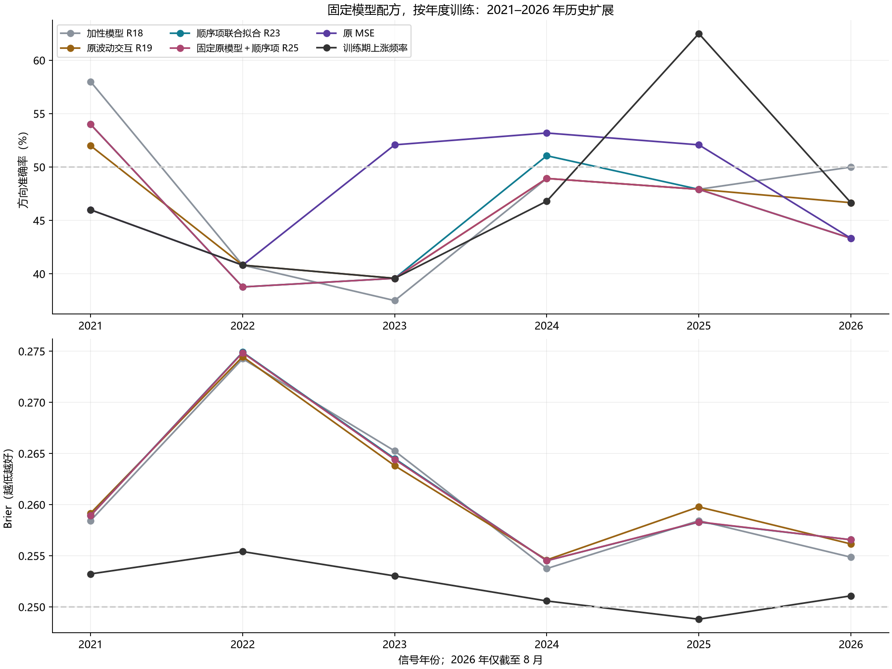

# 第二十六轮：2021–2026 年历史扩展测试

生成时间：2026-09-12T08:31:09.407797+00:00。全部 18 次神经网络训练、72 次分类拟合及 272 周评分已经完成，独立复核通过。

本轮沿用此前明确的三个学习分支，重新训练六个年度的完整上游模型。先完成全部训练，再统一评分，没有根据某一年的新结果调整后续设置。第 1–3 轮已查看全部 272 个信号；因此本轮属于当前配方的历史扩展检验，不是研究层面的全新独立盲测。

## 主要结果

### 2021–2023（147 周）

| 方法 | 正确/总数 | 准确率 | 平衡准确率 | AUROC | Brier↓ | 对数损失↓ |
|---|---|---|---|---|---|---|
| 加性模型 R18 | 67/147 | 45.58% | 47.49% | 0.453890 | 0.265938 | 0.726265 |
| 原波动交互 R19 | 65/147 | 44.22% | 46.31% | 0.455977 | 0.265783 | 0.726036 |
| 顺序项联合拟合 R23 | 65/147 | 44.22% | 46.31% | 0.454459 | 0.266073 | 0.726467 |
| 固定原模型＋顺序项 R25 | 65/147 | 44.22% | 46.31% | 0.454269 | 0.266028 | 0.726370 |
| 原 MSE | 68/147 | 46.26% | 48.95% | 0.459203 | — | — |
| 训练期上涨频率 | 62/147 | 42.18% | 50.00% | 0.529412 | 0.253892 | 0.700939 |

顺序项联合拟合 R23相对原波动交互：正确方向变化 +0 周，Brier 变化 +0.000290。

固定原模型＋顺序项 R25相对原波动交互：正确方向变化 +0 周，Brier 变化 +0.000245。

### 2024–2026 年 8 月（125 周）

| 方法 | 正确/总数 | 准确率 | 平衡准确率 | AUROC | Brier↓ | 对数损失↓ |
|---|---|---|---|---|---|---|
| 加性模型 R18 | 61/125 | 48.80% | 48.91% | 0.502825 | 0.255818 | 0.705250 |
| 原波动交互 R19 | 60/125 | 48.00% | 48.15% | 0.494350 | 0.256965 | 0.707631 |
| 顺序项联合拟合 R23 | 60/125 | 48.00% | 48.24% | 0.495634 | 0.256462 | 0.706507 |
| 固定原模型＋顺序项 R25 | 59/125 | 47.20% | 47.39% | 0.495378 | 0.256470 | 0.706523 |
| 原 MSE | 63/125 | 50.40% | 50.42% | 0.491525 | — | — |
| 训练期上涨频率 | 66/125 | 52.80% | 50.00% | 0.425013 | 0.250021 | 0.693189 |

顺序项联合拟合 R23相对原波动交互：正确方向变化 +0 周，Brier 变化 -0.000503。

固定原模型＋顺序项 R25相对原波动交互：正确方向变化 -1 周，Brier 变化 -0.000495。

24 项预设配对比较统一进行 Holm 校正，校正后 p<0.05 的比较共 0 项。显著性只覆盖本轮预设比较，不修正多轮查看历史和模型选择的影响。

## 各年度与随机种子

| 年份 | 周数 | 加性模型 R18 | 原波动交互 R19 | 顺序项联合拟合 R23 | 固定原模型＋顺序项 R25 | 原 MSE | 训练期上涨频率 |
|---|---|---|---|---|---|---|---|
| 2021 | 50 | 58.00% | 52.00% | 54.00% | 54.00% | 46.00% | 46.00% |
| 2022 | 49 | 40.82% | 40.82% | 38.78% | 38.78% | 40.82% | 40.82% |
| 2023 | 48 | 37.50% | 39.58% | 39.58% | 39.58% | 52.08% | 39.58% |
| 2024 | 47 | 48.94% | 48.94% | 51.06% | 48.94% | 53.19% | 46.81% |
| 2025 | 48 | 47.92% | 47.92% | 47.92% | 47.92% | 52.08% | 62.50% |
| 2026 | 30 | 50.00% | 46.67% | 43.33% | 43.33% | 43.33% | 46.67% |

完整年度指标见 yearly_metrics.csv；各随机种子及其年度结果见 seed_metrics.csv、seed_yearly_metrics.csv。下表给出各方法三种子准确率的最小值与最大值；范围不构成置信区间。

| 时期 | 方法 | 三种子准确率范围 |
|---|---|---|
| 2021–2023 | 加性模型 R18 | 46.26%–46.94% |
| 2021–2023 | 顺序项联合拟合 R23 | 45.58%–46.26% |
| 2021–2023 | 固定原模型＋顺序项 R25 | 45.58%–46.26% |
| 2021–2023 | 原波动交互 R19 | 44.90%–46.26% |
| 2021–2023 | 原 MSE | 44.90%–47.62% |
| 2024–2026 年 8 月 | 加性模型 R18 | 50.40%–54.40% |
| 2024–2026 年 8 月 | 顺序项联合拟合 R23 | 51.20%–54.40% |
| 2024–2026 年 8 月 | 固定原模型＋顺序项 R25 | 51.20%–54.40% |
| 2024–2026 年 8 月 | 原波动交互 R19 | 50.40%–54.40% |
| 2024–2026 年 8 月 | 原 MSE | 41.60%–55.20% |

## 改动影响了哪些信号

| 时期 | 候选 / 参照 | 方向改变 | 错→对 | 对→错 |
|---|---|---|---|---|
| 2021–2023 | 顺序项联合拟合 R23 / 原波动交互 R19 | 2 | 1 | 1 |
| 2021–2023 | 固定原模型＋顺序项 R25 / 原波动交互 R19 | 2 | 1 | 1 |
| 2021–2023 | 固定原模型＋顺序项 R25 / 顺序项联合拟合 R23 | 0 | 0 | 0 |
| 2024–2026 年 8 月 | 顺序项联合拟合 R23 / 原波动交互 R19 | 2 | 1 | 1 |
| 2024–2026 年 8 月 | 固定原模型＋顺序项 R25 / 原波动交互 R19 | 1 | 0 | 1 |
| 2024–2026 年 8 月 | 固定原模型＋顺序项 R25 / 顺序项联合拟合 R23 | 1 | 0 | 1 |

逐条日期和两侧概率保存在 changed_signal_details.csv。方向相同不代表概率相同；须同时检查 Brier 和对数损失。

## 固定配方与时间边界

- 六个预测年分别以 2020–2025 年底为训练截止日，训练必须满足 joint_completed≤截止日。标签未成熟的年末信号不会提前进入训练。
- 原始数据 2010-01-04 至 2026-08-31，共 4,046 根日线。当前最后可完整评分信号为 2026-08-21。2026 年只有前八个月，不能视作完整年度。
- 18 个全新 combined MSE20 Crossformer，每个 38,551 参数，三个固定种子；20 轮、batch 128、AdamW 学习率 0.001、weight decay 0.1、dropout 0.3、梯度裁剪 1。损失为标准化收益 MSE＋0.1×未来五根 OHLCV 辅助 MSE。
- 输入为沿用的原始 OHLCV 125 日窗口，25×5 固定分段，无预训练 tokenizer。每个窗口仅用自身历史归一化；标签尺度只由该折成熟训练样本得到。
- 25 维学习特征及四个市场描述量分别用训练期 1%/99% 分位截尾，再按训练均值/总体标准差归一化。
- R18 加性分类系数的前 25 维定义监督方向。R19 增加波动×该方向的一项训练残差；R23 再增加 60 日符号顺序×同一方向的一项训练残差，并联合拟合。R25 固定 R19 全部系数和截距，只拟合与 R23 相同的顺序特征系数。
- 所有逻辑回归斜率惩罚 λ=0.01，截距不惩罚；R25 只惩罚新增标量。没有超参数、阈值、窗口或种子搜索，没有状态择时或模型切换。
- 分类模型按三个种子的概率平均，再使用严格 p>0.5；原 MSE 平均原始收益预测再判正负，未人为转换为概率。训练上涨频率由同一成熟样本得到。
- 神经表征、监督方向、投影均在各折训练期内拟合，训练指标属于样本内诊断；本轮不声称完整上游的交叉拟合或独立确认。

## 统计口径

分别检验 2021–2023（147 周）和 2024–2026 年 8 月（125 周）。每段固定 12 个配对比较，总共 24 项统一 Holm 校正。采用 10,000 次循环移动区块重采样，每块连续 8 个有效周观察，种子 20260910；报告候选减参照的损失差值、边际 95% 区间和中心化双侧 p。合并 272 周只作描述，随机种子不当作独立周样本。

| 时期 | 候选 / 参照 | 损失 | 差值 | 边际 95% 区间 | 原始 p | Holm p |
|---|---|---|---|---|---|---|
| 2021–2023 | 顺序项联合拟合 R23 / 原波动交互 R19 | direction_error | 0.000000 | [-0.020408, +0.020408] | 1.000000 | 1.000000 |
| 2021–2023 | 顺序项联合拟合 R23 / 原波动交互 R19 | brier | 0.000290 | [-0.000900, +0.001449] | 0.611939 | 1.000000 |
| 2021–2023 | 固定原模型＋顺序项 R25 / 原波动交互 R19 | direction_error | 0.000000 | [-0.020408, +0.020408] | 1.000000 | 1.000000 |
| 2021–2023 | 固定原模型＋顺序项 R25 / 原波动交互 R19 | brier | 0.000245 | [-0.000931, +0.001417] | 0.667833 | 1.000000 |
| 2021–2023 | 固定原模型＋顺序项 R25 / 顺序项联合拟合 R23 | direction_error | 0.000000 | [+0.000000, +0.000000] | 1.000000 | 1.000000 |
| 2021–2023 | 固定原模型＋顺序项 R25 / 顺序项联合拟合 R23 | brier | -0.000045 | [-0.000111, +0.000014] | 0.148585 | 1.000000 |
| 2021–2023 | 原波动交互 R19 / 训练期上涨频率 | brier | 0.011891 | [-0.002393, +0.027097] | 0.109289 | 1.000000 |
| 2021–2023 | 原波动交互 R19 / 原 MSE | direction_error | 0.020408 | [-0.054422, +0.095238] | 0.599740 | 1.000000 |
| 2021–2023 | 顺序项联合拟合 R23 / 训练期上涨频率 | brier | 0.012181 | [-0.001940, +0.027074] | 0.096190 | 1.000000 |
| 2021–2023 | 顺序项联合拟合 R23 / 原 MSE | direction_error | 0.020408 | [-0.054422, +0.095238] | 0.602240 | 1.000000 |
| 2021–2023 | 固定原模型＋顺序项 R25 / 训练期上涨频率 | brier | 0.012136 | [-0.001935, +0.026997] | 0.096490 | 1.000000 |
| 2021–2023 | 固定原模型＋顺序项 R25 / 原 MSE | direction_error | 0.020408 | [-0.054422, +0.095238] | 0.602240 | 1.000000 |
| 2024–2026 年 8 月 | 顺序项联合拟合 R23 / 原波动交互 R19 | direction_error | 0.000000 | [-0.024000, +0.024000] | 1.000000 | 1.000000 |
| 2024–2026 年 8 月 | 顺序项联合拟合 R23 / 原波动交互 R19 | brier | -0.000503 | [-0.001595, +0.000517] | 0.352265 | 1.000000 |
| 2024–2026 年 8 月 | 固定原模型＋顺序项 R25 / 原波动交互 R19 | direction_error | 0.008000 | [+0.000000, +0.024000] | 0.419858 | 1.000000 |
| 2024–2026 年 8 月 | 固定原模型＋顺序项 R25 / 原波动交互 R19 | brier | -0.000495 | [-0.001602, +0.000537] | 0.363464 | 1.000000 |
| 2024–2026 年 8 月 | 固定原模型＋顺序项 R25 / 顺序项联合拟合 R23 | direction_error | 0.008000 | [+0.000000, +0.024000] | 0.427857 | 1.000000 |
| 2024–2026 年 8 月 | 固定原模型＋顺序项 R25 / 顺序项联合拟合 R23 | brier | 0.000008 | [-0.000016, +0.000033] | 0.505949 | 1.000000 |
| 2024–2026 年 8 月 | 原波动交互 R19 / 训练期上涨频率 | brier | 0.006944 | [-0.006904, +0.020496] | 0.325267 | 1.000000 |
| 2024–2026 年 8 月 | 原波动交互 R19 / 原 MSE | direction_error | 0.024000 | [-0.024000, +0.072000] | 0.328767 | 1.000000 |
| 2024–2026 年 8 月 | 顺序项联合拟合 R23 / 训练期上涨频率 | brier | 0.006441 | [-0.007158, +0.019665] | 0.353265 | 1.000000 |
| 2024–2026 年 8 月 | 顺序项联合拟合 R23 / 原 MSE | direction_error | 0.024000 | [-0.016000, +0.072000] | 0.314069 | 1.000000 |
| 2024–2026 年 8 月 | 固定原模型＋顺序项 R25 / 训练期上涨频率 | brier | 0.006449 | [-0.007150, +0.019669] | 0.351965 | 1.000000 |
| 2024–2026 年 8 月 | 固定原模型＋顺序项 R25 / 原 MSE | direction_error | 0.032000 | [-0.008000, +0.080000] | 0.152485 | 1.000000 |

## 核验与保留结论

训练共 8640 个神经网络更新，72 次分类拟合、36 次训练期交互投影；训练耗时 8.99 分钟。72 个分类解由独立 L-BFGS-B / 标量括区间求根核验，18 个检查点全部回放。

原始窗口与标签全量重算；训练与测试特征按保存的检查点逐一复现。独立代数预测最大差异 1.67e-16；3,697 份既有证据文件哈希保持一致（含首次预检查归档）。协议 SHA-256：`535da4e21c6ed47af82f8f6b13ebf83ca612df2f4d388a49de1bb2907a23428a`。

首次预检查因新校验误用零舍入容差而停止，尚未进行新年度训练或评分。原数据下载规则允许 0.011 点 OHLC 舍入误差。本轮恢复原有校验口径，保留所有样本与模型设置；首次尝试的 24 份文件及保全记录位于 research_v26_attempt1。

本轮不自动替换原模型。此前 2018–2020 年原波动交互 58.16%、R25 为 57.45%，以及 2015–2017 年 R25 为 51.67% 的记录继续保留；本轮扩展结果用于判断这些改进是否跨时期延续，不能抹去旧区间的得失。

下一步先结合年度、种子和逐条信号差异判断稳定性。市场状态的条件化使用需要另立固定实验，训练与选择只能使用当时已经成熟的数据。真正的前向验证应在目标结果发生前带时间戳保存预测，等待标签成熟后评分。预测准确率不直接代表扣除交易成本后的盈利。

核心文件：protocol.json、membership.csv、models.json、heads.json、model_predictions.csv、ensemble_predictions.csv、primary_comparisons.json、verification.json。