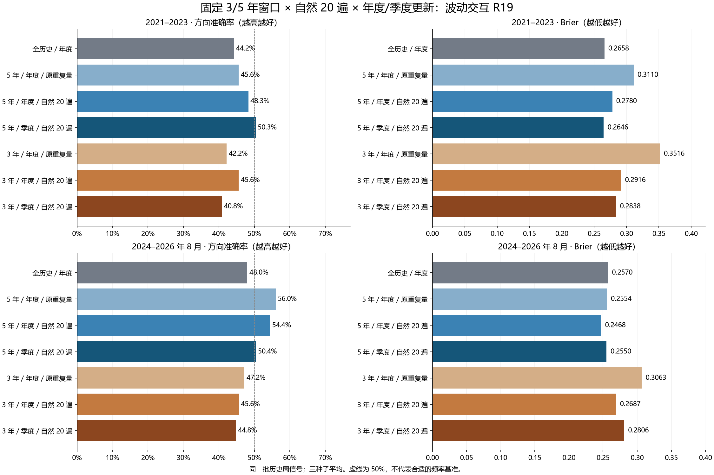

# 第二十八轮：固定窗口与季度 walk-forward

本轮完成最近 3 年、5 年固定窗口的自然 20 遍训练，并在同一批 272 个周信号上比较年度与季度重训。所有历史数据已在前轮查看，属于历史研究复核。

**原流程已经是年度 walk-forward。** 本轮检验两个具体变化：减少短窗口内的重复训练，以及缩短模型使用到下一次重训的时间。不能仅凭最近年份准确率下降就认定必须滚动，也不能把训练样本内损失和未来方向准确率混为一谈。

## 预先固定的实验

第一组：自然 20 遍的年度模型，对照第 27 轮相同窗口、相同截止日的重复训练模型。第二组：自然 20 遍的季度模型，对照同窗口自然 20 遍年度模型。全历史年度模型和第 27 轮两个短窗口对照原样复用。

每个截止日使用之前 3 或 5 个日历年的信号，并要求执行收益及辅助标签全部成熟。起始边界为“截止日减 K 年再加一天”；输入 125 根历史柱可早于训练信号窗口。年度模型在上一年末重训；季度模型在上一季末重训。遇到季末当天的信号，使用该信号之前的上一季模型。

每个新模型都从固定随机种子重新初始化，20 次完整随机排列，每条保留样本每遍恰好使用一次。网络结构、损失、学习率、正则、4 类市场描述、波动与顺序交互、分类头和三种子等权概率融合保持原配方。每次重训同时重新拟合目标尺度、表征、截尾和标准化、交互投影及分类系数。没有早停、窗口择优、种子择优、校准器或新增市场分类器。

季度更新改变了模型年龄及新旧数据的组成，同时增加全年计算量；因此比较的是整套更新政策。共同的年末模型只训练一次，推理按该模型所需日期并集计算一次，再把同一预测分配到两种日历。输入变换不在测试批次上拟合。

| 项目 | 数量 |
|---|---|
| 独立截止日 | 23 |
| 新网络 | 138 |
| 其中与年度方案共享的网络 | 36 |
| 新分类解 | 552 |
| 交互投影 | 276 |
| 自然训练遍数总计 | 2760 |
| 优化器更新 | 22080 |
| 样本呈现总数 | 2662680 |
| 新模型推理去重后的记录 | 15232 |
| 路由后全部模型记录 | 30464 |
| 三种子融合及频率记录 | 11424 |
| 保留旧证据文件 | 4002 |

神经训练及分类拟合耗时 24.81 分钟。138 个网络和 552 个分类解全部完成后，才开始本轮新周信号评分。训练窗口、逐周模型选择和实际预算分别见 membership.csv、routing.csv、budgets.csv。

## 2021–2023（147 周）

| 训练及更新 | 方法 | 正确/总数 | 准确率 | 平衡准确率 | AUROC | Brier↓ | 对数损失↓ |
|---|---|---|---|---|---|---|---|
| 全历史／年度 | 加性 R18 | 67/147 | 45.58% | 47.49% | 0.453890 | 0.265938 | 0.726265 |
| 全历史／年度 | 波动交互 R19 | 65/147 | 44.22% | 46.31% | 0.455977 | 0.265783 | 0.726036 |
| 全历史／年度 | 联合顺序项 R23 | 65/147 | 44.22% | 46.31% | 0.454459 | 0.266073 | 0.726467 |
| 全历史／年度 | 固定原模型＋顺序项 R25 | 65/147 | 44.22% | 46.31% | 0.454269 | 0.266028 | 0.726370 |
| 全历史／年度 | 原 MSE | 68/147 | 46.26% | 48.95% | 0.459203 | — | — |
| 全历史／年度 | 训练上涨频率 | 62/147 | 42.18% | 50.00% | 0.529412 | 0.253892 | 0.700939 |
| 5 年／年度／原重复量 | 加性 R18 | 65/147 | 44.22% | 46.09% | 0.448008 | 0.309837 | 0.834563 |
| 5 年／年度／原重复量 | 波动交互 R19 | 67/147 | 45.58% | 47.49% | 0.448956 | 0.310966 | 0.838337 |
| 5 年／年度／原重复量 | 联合顺序项 R23 | 68/147 | 46.26% | 47.86% | 0.453700 | 0.311375 | 0.845381 |
| 5 年／年度／原重复量 | 固定原模型＋顺序项 R25 | 69/147 | 46.94% | 48.66% | 0.453700 | 0.310431 | 0.841951 |
| 5 年／年度／原重复量 | 原 MSE | 60/147 | 40.82% | 42.28% | 0.432638 | — | — |
| 5 年／年度／原重复量 | 训练上涨频率 | 62/147 | 42.18% | 50.00% | 0.529412 | 0.256412 | 0.706022 |
| 5 年／年度／自然 20 遍 | 加性 R18 | 68/147 | 46.26% | 47.86% | 0.463188 | 0.277344 | 0.751325 |
| 5 年／年度／自然 20 遍 | 波动交互 R19 | 71/147 | 48.30% | 50.28% | 0.468121 | 0.277967 | 0.752923 |
| 5 年／年度／自然 20 遍 | 联合顺序项 R23 | 68/147 | 46.26% | 48.29% | 0.476850 | 0.276195 | 0.749569 |
| 5 年／年度／自然 20 遍 | 固定原模型＋顺序项 R25 | 68/147 | 46.26% | 48.29% | 0.475712 | 0.276108 | 0.749367 |
| 5 年／年度／自然 20 遍 | 原 MSE | 73/147 | 49.66% | 51.02% | 0.481025 | — | — |
| 5 年／年度／自然 20 遍 | 训练上涨频率 | 62/147 | 42.18% | 50.00% | 0.529412 | 0.256412 | 0.706022 |
| 5 年／季度／自然 20 遍 | 加性 R18 | 73/147 | 49.66% | 51.45% | 0.507590 | 0.264364 | 0.723883 |
| 5 年／季度／自然 20 遍 | 波动交互 R19 | 74/147 | 50.34% | 52.04% | 0.504175 | 0.264609 | 0.724441 |
| 5 年／季度／自然 20 遍 | 联合顺序项 R23 | 74/147 | 50.34% | 51.82% | 0.496395 | 0.265643 | 0.726598 |
| 5 年／季度／自然 20 遍 | 固定原模型＋顺序项 R25 | 75/147 | 51.02% | 52.63% | 0.495256 | 0.265518 | 0.726259 |
| 5 年／季度／自然 20 遍 | 原 MSE | 68/147 | 46.26% | 48.73% | 0.488615 | — | — |
| 5 年／季度／自然 20 遍 | 训练上涨频率 | 62/147 | 42.18% | 50.00% | 0.498008 | 0.255891 | 0.704963 |
| 3 年／年度／原重复量 | 加性 R18 | 64/147 | 43.54% | 45.94% | 0.437951 | 0.348823 | 1.002294 |
| 3 年／年度／原重复量 | 波动交互 R19 | 62/147 | 42.18% | 44.33% | 0.436053 | 0.351648 | 1.001819 |
| 3 年／年度／原重复量 | 联合顺序项 R23 | 63/147 | 42.86% | 44.91% | 0.441176 | 0.350953 | 1.005916 |
| 3 年／年度／原重复量 | 固定原模型＋顺序项 R25 | 63/147 | 42.86% | 44.91% | 0.438710 | 0.350269 | 0.999940 |
| 3 年／年度／原重复量 | 原 MSE | 63/147 | 42.86% | 43.61% | 0.433776 | — | — |
| 3 年／年度／原重复量 | 训练上涨频率 | 72/147 | 48.98% | 51.74% | 0.505313 | 0.256466 | 0.706159 |
| 3 年／年度／自然 20 遍 | 加性 R18 | 70/147 | 47.62% | 49.69% | 0.488425 | 0.287645 | 0.784399 |
| 3 年／年度／自然 20 遍 | 波动交互 R19 | 67/147 | 45.58% | 48.14% | 0.488805 | 0.291585 | 0.799377 |
| 3 年／年度／自然 20 遍 | 联合顺序项 R23 | 65/147 | 44.22% | 46.53% | 0.485199 | 0.296165 | 0.811695 |
| 3 年／年度／自然 20 遍 | 固定原模型＋顺序项 R25 | 65/147 | 44.22% | 46.53% | 0.486338 | 0.295895 | 0.810717 |
| 3 年／年度／自然 20 遍 | 原 MSE | 61/147 | 41.50% | 46.14% | 0.468501 | — | — |
| 3 年／年度／自然 20 遍 | 训练上涨频率 | 72/147 | 48.98% | 51.74% | 0.505313 | 0.256466 | 0.706159 |
| 3 年／季度／自然 20 遍 | 加性 R18 | 63/147 | 42.86% | 45.35% | 0.440228 | 0.283069 | 0.766789 |
| 3 年／季度／自然 20 遍 | 波动交互 R19 | 60/147 | 40.82% | 42.93% | 0.440607 | 0.283765 | 0.770226 |
| 3 年／季度／自然 20 遍 | 联合顺序项 R23 | 59/147 | 40.14% | 41.69% | 0.436622 | 0.287316 | 0.779247 |
| 3 年／季度／自然 20 遍 | 固定原模型＋顺序项 R25 | 59/147 | 40.14% | 41.69% | 0.437381 | 0.287022 | 0.778448 |
| 3 年／季度／自然 20 遍 | 原 MSE | 70/147 | 47.62% | 51.65% | 0.488994 | — | — |
| 3 年／季度／自然 20 遍 | 训练上涨频率 | 72/147 | 48.98% | 50.43% | 0.516034 | 0.253155 | 0.699491 |

## 2024–2026 年 8 月（125 周）

| 训练及更新 | 方法 | 正确/总数 | 准确率 | 平衡准确率 | AUROC | Brier↓ | 对数损失↓ |
|---|---|---|---|---|---|---|---|
| 全历史／年度 | 加性 R18 | 61/125 | 48.80% | 48.91% | 0.502825 | 0.255818 | 0.705250 |
| 全历史／年度 | 波动交互 R19 | 60/125 | 48.00% | 48.15% | 0.494350 | 0.256965 | 0.707631 |
| 全历史／年度 | 联合顺序项 R23 | 60/125 | 48.00% | 48.24% | 0.495634 | 0.256462 | 0.706507 |
| 全历史／年度 | 固定原模型＋顺序项 R25 | 59/125 | 47.20% | 47.39% | 0.495378 | 0.256470 | 0.706523 |
| 全历史／年度 | 原 MSE | 63/125 | 50.40% | 50.42% | 0.491525 | — | — |
| 全历史／年度 | 训练上涨频率 | 66/125 | 52.80% | 50.00% | 0.425013 | 0.250021 | 0.693189 |
| 5 年／年度／原重复量 | 加性 R18 | 71/125 | 56.80% | 57.20% | 0.593734 | 0.255695 | 0.709330 |
| 5 年／年度／原重复量 | 波动交互 R19 | 70/125 | 56.00% | 56.36% | 0.594761 | 0.255385 | 0.708607 |
| 5 年／年度／原重复量 | 联合顺序项 R23 | 72/125 | 57.60% | 57.87% | 0.587571 | 0.257509 | 0.714541 |
| 5 年／年度／原重复量 | 固定原模型＋顺序项 R25 | 73/125 | 58.40% | 58.72% | 0.587314 | 0.257626 | 0.714563 |
| 5 年／年度／原重复量 | 原 MSE | 69/125 | 55.20% | 55.60% | 0.579353 | — | — |
| 5 年／年度／原重复量 | 训练上涨频率 | 56/125 | 44.80% | 45.48% | 0.425526 | 0.252748 | 0.698649 |
| 5 年／年度／自然 20 遍 | 加性 R18 | 69/125 | 55.20% | 55.96% | 0.578839 | 0.246152 | 0.685806 |
| 5 年／年度／自然 20 遍 | 波动交互 R19 | 68/125 | 54.40% | 55.02% | 0.582435 | 0.246843 | 0.687439 |
| 5 年／年度／自然 20 遍 | 联合顺序项 R23 | 72/125 | 57.60% | 58.41% | 0.563174 | 0.249790 | 0.693613 |
| 5 年／年度／自然 20 遍 | 固定原模型＋顺序项 R25 | 71/125 | 56.80% | 57.65% | 0.562917 | 0.249824 | 0.693671 |
| 5 年／年度／自然 20 遍 | 原 MSE | 66/125 | 52.80% | 53.15% | 0.521315 | — | — |
| 5 年／年度／自然 20 遍 | 训练上涨频率 | 56/125 | 44.80% | 45.48% | 0.425526 | 0.252748 | 0.698649 |
| 5 年／季度／自然 20 遍 | 加性 R18 | 63/125 | 50.40% | 50.78% | 0.506420 | 0.255872 | 0.705187 |
| 5 年／季度／自然 20 遍 | 波动交互 R19 | 63/125 | 50.40% | 50.78% | 0.516949 | 0.254990 | 0.703625 |
| 5 年／季度／自然 20 遍 | 联合顺序项 R23 | 63/125 | 50.40% | 50.78% | 0.508988 | 0.256565 | 0.706808 |
| 5 年／季度／自然 20 遍 | 固定原模型＋顺序项 R25 | 63/125 | 50.40% | 50.78% | 0.508218 | 0.256537 | 0.706748 |
| 5 年／季度／自然 20 遍 | 原 MSE | 68/125 | 54.40% | 55.11% | 0.529533 | — | — |
| 5 年／季度／自然 20 遍 | 训练上涨频率 | 60/125 | 48.00% | 50.31% | 0.414355 | 0.252495 | 0.698143 |
| 3 年／年度／原重复量 | 加性 R18 | 61/125 | 48.80% | 49.81% | 0.513097 | 0.304196 | 0.849948 |
| 3 年／年度／原重复量 | 波动交互 R19 | 59/125 | 47.20% | 48.11% | 0.511556 | 0.306329 | 0.855198 |
| 3 年／年度／原重复量 | 联合顺序项 R23 | 60/125 | 48.00% | 48.96% | 0.506677 | 0.308806 | 0.858351 |
| 3 年／年度／原重复量 | 固定原模型＋顺序项 R25 | 58/125 | 46.40% | 47.27% | 0.505393 | 0.309074 | 0.858567 |
| 3 年／年度／原重复量 | 原 MSE | 64/125 | 51.20% | 52.08% | 0.529533 | — | — |
| 3 年／年度／原重复量 | 训练上涨频率 | 57/125 | 45.60% | 47.05% | 0.425013 | 0.258769 | 0.710820 |
| 3 年／年度／自然 20 遍 | 加性 R18 | 56/125 | 44.80% | 46.29% | 0.519004 | 0.270266 | 0.734749 |
| 3 年／年度／自然 20 遍 | 波动交互 R19 | 57/125 | 45.60% | 46.96% | 0.529276 | 0.268735 | 0.731466 |
| 3 年／年度／自然 20 遍 | 联合顺序项 R23 | 55/125 | 44.00% | 45.35% | 0.529533 | 0.270941 | 0.736425 |
| 3 年／年度／自然 20 遍 | 固定原模型＋顺序项 R25 | 55/125 | 44.00% | 45.35% | 0.527992 | 0.271075 | 0.736739 |
| 3 年／年度／自然 20 遍 | 原 MSE | 57/125 | 45.60% | 47.05% | 0.506163 | — | — |
| 3 年／年度／自然 20 遍 | 训练上涨频率 | 57/125 | 45.60% | 47.05% | 0.425013 | 0.258769 | 0.710820 |
| 3 年／季度／自然 20 遍 | 加性 R18 | 55/125 | 44.00% | 45.35% | 0.510529 | 0.281694 | 0.765481 |
| 3 年／季度／自然 20 遍 | 波动交互 R19 | 56/125 | 44.80% | 46.20% | 0.508475 | 0.280636 | 0.763509 |
| 3 年／季度／自然 20 遍 | 联合顺序项 R23 | 57/125 | 45.60% | 46.87% | 0.507704 | 0.282461 | 0.767530 |
| 3 年／季度／自然 20 遍 | 固定原模型＋顺序项 R25 | 57/125 | 45.60% | 46.87% | 0.508218 | 0.282587 | 0.767788 |
| 3 年／季度／自然 20 遍 | 原 MSE | 63/125 | 50.40% | 51.14% | 0.554956 | — | — |
| 3 年／季度／自然 20 遍 | 训练上涨频率 | 54/125 | 43.20% | 44.59% | 0.475475 | 0.255667 | 0.704546 |

## 预设配对比较

64 项比较统一 Holm 校正，p<0.05 的改善 3 项、恶化 0 项。负损失差表示候选更好。每段采用固定种子的 10,000 次循环区块重采样，每块 8 个有效周观察；区间为边际 95% 区间，p 为中心化双侧值。此校正仅覆盖本轮，不能消除多轮查看历史的影响。

| 时期 | 干预 | 候选 | 参照 | 方法/参照方法 | 损失 | 差值 | 边际 95% 区间 | 原始 p | Holm p |
|---|---|---|---|---|---|---|---|---|---|
| 2021–2023 | passes | 5 年／年度／自然 20 遍 | 5 年／年度／原重复量 | 波动交互 R19/波动交互 R19 | direction_error | -0.027211 | [-0.102041, +0.040816] | 0.450055 | 1.000000 |
| 2021–2023 | passes | 5 年／年度／自然 20 遍 | 5 年／年度／原重复量 | 波动交互 R19/波动交互 R19 | brier | -0.032999 | [-0.052815, -0.012964] | 0.001500 | 0.088491 |
| 2021–2023 | passes | 5 年／年度／自然 20 遍 | 5 年／年度／原重复量 | 联合顺序项 R23/联合顺序项 R23 | direction_error | 0.000000 | [-0.061224, +0.061224] | 1.000000 | 1.000000 |
| 2021–2023 | passes | 5 年／年度／自然 20 遍 | 5 年／年度／原重复量 | 联合顺序项 R23/联合顺序项 R23 | brier | -0.035181 | [-0.055806, -0.014296] | 0.000900 | 0.054895 |
| 2021–2023 | passes | 5 年／年度／自然 20 遍 | 5 年／年度／原重复量 | 固定原模型＋顺序项 R25/固定原模型＋顺序项 R25 | direction_error | 0.006803 | [-0.054422, +0.068027] | 0.838416 | 1.000000 |
| 2021–2023 | passes | 5 年／年度／自然 20 遍 | 5 年／年度／原重复量 | 固定原模型＋顺序项 R25/固定原模型＋顺序项 R25 | brier | -0.034323 | [-0.054603, -0.013829] | 0.001100 | 0.065993 |
| 2021–2023 | cadence | 5 年／季度／自然 20 遍 | 5 年／年度／自然 20 遍 | 波动交互 R19/波动交互 R19 | direction_error | -0.020408 | [-0.102041, +0.061224] | 0.646335 | 1.000000 |
| 2021–2023 | cadence | 5 年／季度／自然 20 遍 | 5 年／年度／自然 20 遍 | 波动交互 R19/波动交互 R19 | brier | -0.013358 | [-0.027073, -0.000887] | 0.045695 | 1.000000 |
| 2021–2023 | cadence | 5 年／季度／自然 20 遍 | 5 年／年度／自然 20 遍 | 联合顺序项 R23/联合顺序项 R23 | direction_error | -0.040816 | [-0.115646, +0.034014] | 0.293871 | 1.000000 |
| 2021–2023 | cadence | 5 年／季度／自然 20 遍 | 5 年／年度／自然 20 遍 | 联合顺序项 R23/联合顺序项 R23 | brier | -0.010551 | [-0.022918, +0.001136] | 0.087091 | 1.000000 |
| 2021–2023 | cadence | 5 年／季度／自然 20 遍 | 5 年／年度／自然 20 遍 | 固定原模型＋顺序项 R25/固定原模型＋顺序项 R25 | direction_error | -0.047619 | [-0.122449, +0.027211] | 0.210179 | 1.000000 |
| 2021–2023 | cadence | 5 年／季度／自然 20 遍 | 5 年／年度／自然 20 遍 | 固定原模型＋顺序项 R25/固定原模型＋顺序项 R25 | brier | -0.010590 | [-0.022949, +0.001070] | 0.082792 | 1.000000 |
| 2021–2023 | control | 5 年／年度／自然 20 遍 | 5 年／年度／自然 20 遍 | 波动交互 R19/训练上涨频率 | brier | 0.021555 | [+0.002938, +0.039879] | 0.022498 | 1.000000 |
| 2021–2023 | control | 5 年／年度／自然 20 遍 | 5 年／年度／自然 20 遍 | 波动交互 R19/原 MSE | direction_error | 0.013605 | [-0.040816, +0.068027] | 0.625537 | 1.000000 |
| 2021–2023 | control | 5 年／季度／自然 20 遍 | 5 年／季度／自然 20 遍 | 波动交互 R19/训练上涨频率 | brier | 0.008719 | [-0.006679, +0.024972] | 0.277672 | 1.000000 |
| 2021–2023 | control | 5 年／季度／自然 20 遍 | 5 年／季度／自然 20 遍 | 波动交互 R19/原 MSE | direction_error | -0.040816 | [-0.122449, +0.040816] | 0.334567 | 1.000000 |
| 2021–2023 | passes | 3 年／年度／自然 20 遍 | 3 年／年度／原重复量 | 波动交互 R19/波动交互 R19 | direction_error | -0.034014 | [-0.102041, +0.027211] | 0.322568 | 1.000000 |
| 2021–2023 | passes | 3 年／年度／自然 20 遍 | 3 年／年度／原重复量 | 波动交互 R19/波动交互 R19 | brier | -0.060063 | [-0.089747, -0.031391] | 0.000100 | 0.006399 |
| 2021–2023 | passes | 3 年／年度／自然 20 遍 | 3 年／年度／原重复量 | 联合顺序项 R23/联合顺序项 R23 | direction_error | -0.013605 | [-0.081633, +0.054422] | 0.690731 | 1.000000 |
| 2021–2023 | passes | 3 年／年度／自然 20 遍 | 3 年／年度／原重复量 | 联合顺序项 R23/联合顺序项 R23 | brier | -0.054788 | [-0.084772, -0.025754] | 0.000400 | 0.025197 |
| 2021–2023 | passes | 3 年／年度／自然 20 遍 | 3 年／年度／原重复量 | 固定原模型＋顺序项 R25/固定原模型＋顺序项 R25 | direction_error | -0.013605 | [-0.081633, +0.054422] | 0.690731 | 1.000000 |
| 2021–2023 | passes | 3 年／年度／自然 20 遍 | 3 年／年度／原重复量 | 固定原模型＋顺序项 R25/固定原模型＋顺序项 R25 | brier | -0.054374 | [-0.084387, -0.025379] | 0.000400 | 0.025197 |
| 2021–2023 | cadence | 3 年／季度／自然 20 遍 | 3 年／年度／自然 20 遍 | 波动交互 R19/波动交互 R19 | direction_error | 0.047619 | [-0.034014, +0.129252] | 0.270573 | 1.000000 |
| 2021–2023 | cadence | 3 年／季度／自然 20 遍 | 3 年／年度／自然 20 遍 | 波动交互 R19/波动交互 R19 | brier | -0.007821 | [-0.037371, +0.018485] | 0.582642 | 1.000000 |
| 2021–2023 | cadence | 3 年／季度／自然 20 遍 | 3 年／年度／自然 20 遍 | 联合顺序项 R23/联合顺序项 R23 | direction_error | 0.040816 | [-0.047619, +0.129252] | 0.363064 | 1.000000 |
| 2021–2023 | cadence | 3 年／季度／自然 20 遍 | 3 年／年度／自然 20 遍 | 联合顺序项 R23/联合顺序项 R23 | brier | -0.008849 | [-0.039510, +0.018863] | 0.550845 | 1.000000 |
| 2021–2023 | cadence | 3 年／季度／自然 20 遍 | 3 年／年度／自然 20 遍 | 固定原模型＋顺序项 R25/固定原模型＋顺序项 R25 | direction_error | 0.040816 | [-0.047619, +0.129252] | 0.363064 | 1.000000 |
| 2021–2023 | cadence | 3 年／季度／自然 20 遍 | 3 年／年度／自然 20 遍 | 固定原模型＋顺序项 R25/固定原模型＋顺序项 R25 | brier | -0.008873 | [-0.039497, +0.018682] | 0.547545 | 1.000000 |
| 2021–2023 | control | 3 年／年度／自然 20 遍 | 3 年／年度／自然 20 遍 | 波动交互 R19/训练上涨频率 | brier | 0.035119 | [+0.006537, +0.068241] | 0.022798 | 1.000000 |
| 2021–2023 | control | 3 年／年度／自然 20 遍 | 3 年／年度／自然 20 遍 | 波动交互 R19/原 MSE | direction_error | -0.040816 | [-0.122449, +0.034014] | 0.308769 | 1.000000 |
| 2021–2023 | control | 3 年／季度／自然 20 遍 | 3 年／季度／自然 20 遍 | 波动交互 R19/训练上涨频率 | brier | 0.030609 | [+0.012436, +0.052149] | 0.003500 | 0.202980 |
| 2021–2023 | control | 3 年／季度／自然 20 遍 | 3 年／季度／自然 20 遍 | 波动交互 R19/原 MSE | direction_error | 0.068027 | [-0.013605, +0.163265] | 0.131787 | 1.000000 |
| 2024–2026 年 8 月 | passes | 5 年／年度／自然 20 遍 | 5 年／年度／原重复量 | 波动交互 R19/波动交互 R19 | direction_error | 0.016000 | [-0.096000, +0.128000] | 0.781422 | 1.000000 |
| 2024–2026 年 8 月 | passes | 5 年／年度／自然 20 遍 | 5 年／年度／原重复量 | 波动交互 R19/波动交互 R19 | brier | -0.008543 | [-0.039088, +0.021746] | 0.589741 | 1.000000 |
| 2024–2026 年 8 月 | passes | 5 年／年度／自然 20 遍 | 5 年／年度／原重复量 | 联合顺序项 R23/联合顺序项 R23 | direction_error | 0.000000 | [-0.112000, +0.112000] | 1.000000 | 1.000000 |
| 2024–2026 年 8 月 | passes | 5 年／年度／自然 20 遍 | 5 年／年度／原重复量 | 联合顺序项 R23/联合顺序项 R23 | brier | -0.007719 | [-0.040959, +0.025123] | 0.645935 | 1.000000 |
| 2024–2026 年 8 月 | passes | 5 年／年度／自然 20 遍 | 5 年／年度／原重复量 | 固定原模型＋顺序项 R25/固定原模型＋顺序项 R25 | direction_error | 0.016000 | [-0.088000, +0.120000] | 0.771423 | 1.000000 |
| 2024–2026 年 8 月 | passes | 5 年／年度／自然 20 遍 | 5 年／年度／原重复量 | 固定原模型＋顺序项 R25/固定原模型＋顺序项 R25 | brier | -0.007802 | [-0.040571, +0.024630] | 0.638236 | 1.000000 |
| 2024–2026 年 8 月 | cadence | 5 年／季度／自然 20 遍 | 5 年／年度／自然 20 遍 | 波动交互 R19/波动交互 R19 | direction_error | 0.040000 | [-0.024000, +0.104000] | 0.227477 | 1.000000 |
| 2024–2026 年 8 月 | cadence | 5 年／季度／自然 20 遍 | 5 年／年度／自然 20 遍 | 波动交互 R19/波动交互 R19 | brier | 0.008147 | [-0.003372, +0.019017] | 0.156884 | 1.000000 |
| 2024–2026 年 8 月 | cadence | 5 年／季度／自然 20 遍 | 5 年／年度／自然 20 遍 | 联合顺序项 R23/联合顺序项 R23 | direction_error | 0.072000 | [+0.000000, +0.152000] | 0.075692 | 1.000000 |
| 2024–2026 年 8 月 | cadence | 5 年／季度／自然 20 遍 | 5 年／年度／自然 20 遍 | 联合顺序项 R23/联合顺序项 R23 | brier | 0.006775 | [-0.005200, +0.018238] | 0.253375 | 1.000000 |
| 2024–2026 年 8 月 | cadence | 5 年／季度／自然 20 遍 | 5 年／年度／自然 20 遍 | 固定原模型＋顺序项 R25/固定原模型＋顺序项 R25 | direction_error | 0.064000 | [-0.008000, +0.144000] | 0.098290 | 1.000000 |
| 2024–2026 年 8 月 | cadence | 5 年／季度／自然 20 遍 | 5 年／年度／自然 20 遍 | 固定原模型＋顺序项 R25/固定原模型＋顺序项 R25 | brier | 0.006713 | [-0.005207, +0.018131] | 0.256774 | 1.000000 |
| 2024–2026 年 8 月 | control | 5 年／年度／自然 20 遍 | 5 年／年度／自然 20 遍 | 波动交互 R19/训练上涨频率 | brier | -0.005905 | [-0.021283, +0.010783] | 0.467353 | 1.000000 |
| 2024–2026 年 8 月 | control | 5 年／年度／自然 20 遍 | 5 年／年度／自然 20 遍 | 波动交互 R19/原 MSE | direction_error | -0.016000 | [-0.144000, +0.104000] | 0.798820 | 1.000000 |
| 2024–2026 年 8 月 | control | 5 年／季度／自然 20 遍 | 5 年／季度／自然 20 遍 | 波动交互 R19/训练上涨频率 | brier | 0.002495 | [-0.012587, +0.017151] | 0.749225 | 1.000000 |
| 2024–2026 年 8 月 | control | 5 年／季度／自然 20 遍 | 5 年／季度／自然 20 遍 | 波动交互 R19/原 MSE | direction_error | 0.040000 | [-0.040000, +0.120000] | 0.330467 | 1.000000 |
| 2024–2026 年 8 月 | passes | 3 年／年度／自然 20 遍 | 3 年／年度／原重复量 | 波动交互 R19/波动交互 R19 | direction_error | 0.016000 | [-0.064000, +0.104000] | 0.724928 | 1.000000 |
| 2024–2026 年 8 月 | passes | 3 年／年度／自然 20 遍 | 3 年／年度／原重复量 | 波动交互 R19/波动交互 R19 | brier | -0.037594 | [-0.073364, -0.003676] | 0.034297 | 1.000000 |
| 2024–2026 年 8 月 | passes | 3 年／年度／自然 20 遍 | 3 年／年度／原重复量 | 联合顺序项 R23/联合顺序项 R23 | direction_error | 0.040000 | [-0.048000, +0.128000] | 0.386761 | 1.000000 |
| 2024–2026 年 8 月 | passes | 3 年／年度／自然 20 遍 | 3 年／年度／原重复量 | 联合顺序项 R23/联合顺序项 R23 | brier | -0.037865 | [-0.073860, -0.004096] | 0.032397 | 1.000000 |
| 2024–2026 年 8 月 | passes | 3 年／年度／自然 20 遍 | 3 年／年度／原重复量 | 固定原模型＋顺序项 R25/固定原模型＋顺序项 R25 | direction_error | 0.024000 | [-0.064000, +0.112000] | 0.598840 | 1.000000 |
| 2024–2026 年 8 月 | passes | 3 年／年度／自然 20 遍 | 3 年／年度／原重复量 | 固定原模型＋顺序项 R25/固定原模型＋顺序项 R25 | brier | -0.037999 | [-0.073780, -0.004319] | 0.031497 | 1.000000 |
| 2024–2026 年 8 月 | cadence | 3 年／季度／自然 20 遍 | 3 年／年度／自然 20 遍 | 波动交互 R19/波动交互 R19 | direction_error | 0.008000 | [-0.048000, +0.064000] | 0.779022 | 1.000000 |
| 2024–2026 年 8 月 | cadence | 3 年／季度／自然 20 遍 | 3 年／年度／自然 20 遍 | 波动交互 R19/波动交互 R19 | brier | 0.011901 | [-0.006937, +0.033483] | 0.251275 | 1.000000 |
| 2024–2026 年 8 月 | cadence | 3 年／季度／自然 20 遍 | 3 年／年度／自然 20 遍 | 联合顺序项 R23/联合顺序项 R23 | direction_error | -0.016000 | [-0.080000, +0.048000] | 0.609839 | 1.000000 |
| 2024–2026 年 8 月 | cadence | 3 年／季度／自然 20 遍 | 3 年／年度／自然 20 遍 | 联合顺序项 R23/联合顺序项 R23 | brier | 0.011519 | [-0.008812, +0.033467] | 0.281272 | 1.000000 |
| 2024–2026 年 8 月 | cadence | 3 年／季度／自然 20 遍 | 3 年／年度／自然 20 遍 | 固定原模型＋顺序项 R25/固定原模型＋顺序项 R25 | direction_error | -0.016000 | [-0.080000, +0.048000] | 0.609839 | 1.000000 |
| 2024–2026 年 8 月 | cadence | 3 年／季度／自然 20 遍 | 3 年／年度／自然 20 遍 | 固定原模型＋顺序项 R25/固定原模型＋顺序项 R25 | brier | 0.011513 | [-0.008642, +0.033168] | 0.278772 | 1.000000 |
| 2024–2026 年 8 月 | control | 3 年／年度／自然 20 遍 | 3 年／年度／自然 20 遍 | 波动交互 R19/训练上涨频率 | brier | 0.009966 | [-0.012261, +0.030911] | 0.367463 | 1.000000 |
| 2024–2026 年 8 月 | control | 3 年／年度／自然 20 遍 | 3 年／年度／自然 20 遍 | 波动交互 R19/原 MSE | direction_error | 0.000000 | [-0.080000, +0.072000] | 1.000000 | 1.000000 |
| 2024–2026 年 8 月 | control | 3 年／季度／自然 20 遍 | 3 年／季度／自然 20 遍 | 波动交互 R19/训练上涨频率 | brier | 0.024969 | [-0.001984, +0.058255] | 0.101090 | 1.000000 |
| 2024–2026 年 8 月 | control | 3 年／季度／自然 20 遍 | 3 年／季度／自然 20 遍 | 波动交互 R19/原 MSE | direction_error | 0.056000 | [-0.024000, +0.136000] | 0.172483 | 1.000000 |

## 各年度：波动交互 R19

| 信号年 | 周数 | 全历史／年度 | 5 年／年度／原重复量 | 5 年／年度／自然 20 遍 | 5 年／季度／自然 20 遍 | 3 年／年度／原重复量 | 3 年／年度／自然 20 遍 | 3 年／季度／自然 20 遍 |
|---|---|---|---|---|---|---|---|---|
| 2021 | 50 | 52.00% | 56.00% | 58.00% | 60.00% | 46.00% | 50.00% | 48.00% |
| 2022 | 49 | 40.82% | 32.65% | 42.86% | 34.69% | 40.82% | 40.82% | 36.73% |
| 2023 | 48 | 39.58% | 47.92% | 43.75% | 56.25% | 39.58% | 45.83% | 37.50% |
| 2024 | 47 | 48.94% | 63.83% | 72.34% | 65.96% | 57.45% | 57.45% | 57.45% |
| 2025 | 48 | 47.92% | 50.00% | 45.83% | 45.83% | 35.42% | 35.42% | 37.50% |
| 2026 | 30 | 46.67% | 53.33% | 40.00% | 33.33% | 50.00% | 43.33% | 36.67% |

## 各年度：联合顺序项 R23

| 信号年 | 周数 | 全历史／年度 | 5 年／年度／原重复量 | 5 年／年度／自然 20 遍 | 5 年／季度／自然 20 遍 | 3 年／年度／原重复量 | 3 年／年度／自然 20 遍 | 3 年／季度／自然 20 遍 |
|---|---|---|---|---|---|---|---|---|
| 2021 | 50 | 54.00% | 56.00% | 58.00% | 60.00% | 46.00% | 48.00% | 42.00% |
| 2022 | 49 | 38.78% | 34.69% | 38.78% | 34.69% | 40.82% | 40.82% | 40.82% |
| 2023 | 48 | 39.58% | 47.92% | 41.67% | 56.25% | 41.67% | 43.75% | 37.50% |
| 2024 | 47 | 51.06% | 65.96% | 70.21% | 63.83% | 57.45% | 55.32% | 57.45% |
| 2025 | 48 | 47.92% | 52.08% | 47.92% | 45.83% | 35.42% | 33.33% | 37.50% |
| 2026 | 30 | 43.33% | 53.33% | 53.33% | 36.67% | 53.33% | 43.33% | 40.00% |

## 各年度：固定原模型＋顺序项 R25

| 信号年 | 周数 | 全历史／年度 | 5 年／年度／原重复量 | 5 年／年度／自然 20 遍 | 5 年／季度／自然 20 遍 | 3 年／年度／原重复量 | 3 年／年度／自然 20 遍 | 3 年／季度／自然 20 遍 |
|---|---|---|---|---|---|---|---|---|
| 2021 | 50 | 54.00% | 56.00% | 58.00% | 62.00% | 46.00% | 48.00% | 42.00% |
| 2022 | 49 | 38.78% | 34.69% | 38.78% | 34.69% | 40.82% | 40.82% | 40.82% |
| 2023 | 48 | 39.58% | 50.00% | 41.67% | 56.25% | 41.67% | 43.75% | 37.50% |
| 2024 | 47 | 48.94% | 68.09% | 68.09% | 63.83% | 55.32% | 55.32% | 57.45% |
| 2025 | 48 | 47.92% | 52.08% | 47.92% | 45.83% | 35.42% | 33.33% | 37.50% |
| 2026 | 30 | 43.33% | 53.33% | 53.33% | 36.67% | 50.00% | 43.33% | 40.00% |

## 种子稳定性与复核

| 时期 | 更新政策 | 方法 | 三个种子准确率范围 | 融合准确率 | 方向分歧周数 |
|---|---|---|---|---|---|
| 2021–2023 | 全历史／年度 | 波动交互 R19 | 44.90%–46.26% | 44.22% | 99 |
| 2021–2023 | 3 年／年度／自然 20 遍 | 波动交互 R19 | 48.98%–51.02% | 45.58% | 81 |
| 2021–2023 | 3 年／年度／原重复量 | 波动交互 R19 | 43.54%–47.62% | 42.18% | 78 |
| 2021–2023 | 3 年／季度／自然 20 遍 | 波动交互 R19 | 40.82%–46.26% | 40.82% | 85 |
| 2021–2023 | 5 年／年度／自然 20 遍 | 波动交互 R19 | 43.54%–45.58% | 48.30% | 70 |
| 2021–2023 | 5 年／年度／原重复量 | 波动交互 R19 | 37.41%–50.34% | 45.58% | 88 |
| 2021–2023 | 5 年／季度／自然 20 遍 | 波动交互 R19 | 46.94%–51.70% | 50.34% | 84 |
| 2024–2026 年 8 月 | 全历史／年度 | 波动交互 R19 | 50.40%–54.40% | 48.00% | 68 |
| 2024–2026 年 8 月 | 3 年／年度／自然 20 遍 | 波动交互 R19 | 48.00%–49.60% | 45.60% | 44 |
| 2024–2026 年 8 月 | 3 年／年度／原重复量 | 波动交互 R19 | 43.20%–51.20% | 47.20% | 68 |
| 2024–2026 年 8 月 | 3 年／季度／自然 20 遍 | 波动交互 R19 | 46.40%–52.80% | 44.80% | 48 |
| 2024–2026 年 8 月 | 5 年／年度／自然 20 遍 | 波动交互 R19 | 52.80%–54.40% | 54.40% | 72 |
| 2024–2026 年 8 月 | 5 年／年度／原重复量 | 波动交互 R19 | 51.20%–56.00% | 56.00% | 75 |
| 2024–2026 年 8 月 | 5 年／季度／自然 20 遍 | 波动交互 R19 | 47.20%–53.60% | 50.40% | 70 |

全部方法和种子的结果见 seed_metrics.csv、seed_yearly_metrics.csv。逐周概率分歧及平方损失的方差恒等式已复核，仅作诊断，没有改成多数票或选择最好种子。

复核通过：138 个检查点及其训练/测试特征复现，552 个独立凸优化解比较；特征代数最大差 1.78e-15，概率最大差 2.22e-16。训练样本、成熟边界、每遍排列、逐周模型选择、所有指标和比较均已核对。

输入原始 OHLCV 与标签沿用第 26 轮逐项重构的冻结文件，包括 0.011 点舍入容差；本轮核验输入哈希。检查通过说明结果可复现，不等于预测有效或可以交易。

第 19 轮 2018–2020 的局部改善和第 27 轮最近 5 年窗口的近期改善均保留。所有旧文件未改动；本轮不自动替换研究基线。2026 年仅到 8 月，最后完整标签信号为 8 月 21 日。当前比较不能证明市场状态的因果解释，也不是未见年份的独立确认。

图中的 R19 用于观察训练量与更新频率；完整 R18/R19/R23/R25 及两个对照以上表为准。

协议 SHA256：`a4eb970769c94600dd081a6d9cd5d53bacbac658353940e399688a6665810721`
