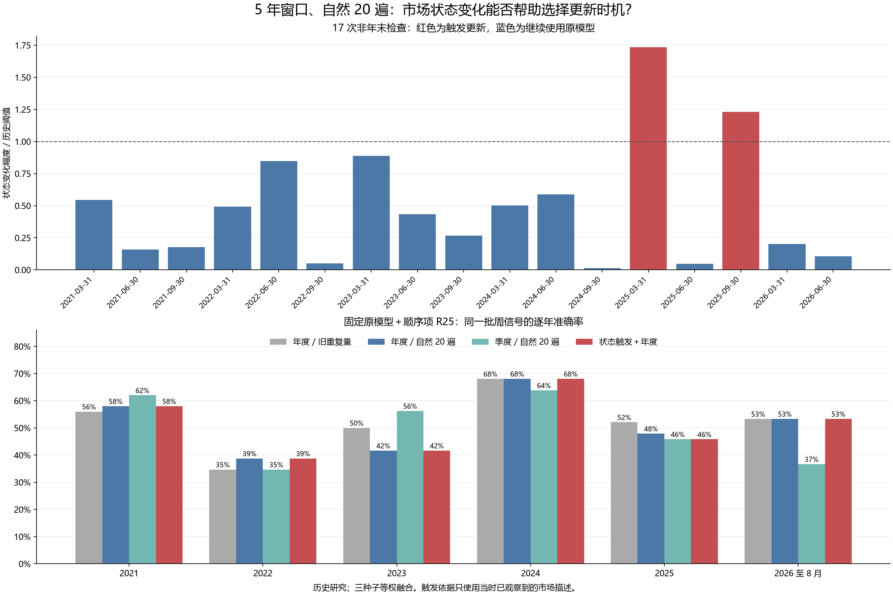

# 第二十九轮：市场状态触发模型更新

固定一条只依赖历史市场描述的触发规则，在 17 次非年末季度检查中触发 2 次额外更新；另有 6 次固定年末更新。全部计算复核通过。

**本轮没有重新训练神经网络或分类头。** 第 28 轮已有所需各季度的 5 年窗口、自然 20 遍模型，本轮复用其冻结权重，模拟哪些日期启用新模型。共同预测保持原样；只补算被保留的季末模型在原评分季度之后所需的预测。所有 272 个历史周已经被查看，结果属于历史研究。

## 预先固定的触发规则

年末固定更新。其余季末，计算最近 60 个可用日信号的四维平均状态：趋势、波动、振幅、成交量变化。四维描述沿用 R18；截尾和标准化参数只使用当前模型截止日的 5 年成熟训练样本拟合。当前状态和参考状态均使用当时已观察到的价格，状态观察不要求未来标签成熟。

参考状态为当前使用模型的截止日、最后 60 个可用日信号的平均状态。变化幅度 D 为四个标准化坐标均值差的平方再取平均。历史参照集只来自该模型截止日之前 5 年：取相隔同样观察天数的两段 60 日状态，计算相同 D。只有当前 D 严格超过历史 D 的第 90 百分位才更新。更新后重置参考状态，保留年末例行更新。

间隔匹配用于区分距离上次更新约一季、两季或三季的情况。历史比较对重叠，因此第 90 百分位仅是预设的经验阈值，不代表 10% 假警报率或显著性检验。该规则识别描述均值变化，未建立经过验证的市场类别，也没有根据预测错误决定更新。

神经训练窗口、20 遍、模型结构、市场与交互特征、分类参数和三种子等权融合均沿用 R28。触发日历对全部方法和种子相同；没有用收益方向、准确率、预测概率或损失选择更新日期，没有搜索其他阈值。季末当天的信号仍使用该检查日之前的模型，新决定仅影响之后的信号。

## 每次检查与实际选择

| 检查日 | 检查前模型 | 是否例行 | D／阈值 | 是否更新 | 检查后模型 |
|---|---|---|---|---|---|
| 2020-12-31 | — | 是 | — | 是 | 2020-12-31 |
| 2021-03-31 | 2020-12-31 | 否 | 0.5449 | 否 | 2020-12-31 |
| 2021-06-30 | 2020-12-31 | 否 | 0.1573 | 否 | 2020-12-31 |
| 2021-09-30 | 2020-12-31 | 否 | 0.1772 | 否 | 2020-12-31 |
| 2021-12-31 | 2020-12-31 | 是 | — | 是 | 2021-12-31 |
| 2022-03-31 | 2021-12-31 | 否 | 0.4925 | 否 | 2021-12-31 |
| 2022-06-30 | 2021-12-31 | 否 | 0.8485 | 否 | 2021-12-31 |
| 2022-09-30 | 2021-12-31 | 否 | 0.0505 | 否 | 2021-12-31 |
| 2022-12-31 | 2021-12-31 | 是 | — | 是 | 2022-12-31 |
| 2023-03-31 | 2022-12-31 | 否 | 0.8867 | 否 | 2022-12-31 |
| 2023-06-30 | 2022-12-31 | 否 | 0.4328 | 否 | 2022-12-31 |
| 2023-09-30 | 2022-12-31 | 否 | 0.2659 | 否 | 2022-12-31 |
| 2023-12-31 | 2022-12-31 | 是 | — | 是 | 2023-12-31 |
| 2024-03-31 | 2023-12-31 | 否 | 0.5023 | 否 | 2023-12-31 |
| 2024-06-30 | 2023-12-31 | 否 | 0.5886 | 否 | 2023-12-31 |
| 2024-09-30 | 2023-12-31 | 否 | 0.0135 | 否 | 2023-12-31 |
| 2024-12-31 | 2023-12-31 | 是 | — | 是 | 2024-12-31 |
| 2025-03-31 | 2024-12-31 | 否 | 1.7335 | 是 | 2025-03-31 |
| 2025-06-30 | 2025-03-31 | 否 | 0.0486 | 否 | 2025-03-31 |
| 2025-09-30 | 2025-03-31 | 否 | 1.2295 | 是 | 2025-09-30 |
| 2025-12-31 | 2025-09-30 | 是 | — | 是 | 2025-12-31 |
| 2026-03-31 | 2025-12-31 | 否 | 0.2019 | 否 | 2025-12-31 |
| 2026-06-30 | 2025-12-31 | 否 | 0.1052 | 否 | 2025-12-31 |

阈值分布、历史窗口两端行号、最近与参考状态、模型训练行号保存在 cache/state_*.npz；每周选用的模型见 routing.csv。

## 若按历史逐期运行的训练预算

| 更新政策 | 更新日期数 | 三种子网络训练数 | 优化器更新次数 |
|---|---|---|---|
| 5 年／年度／自然 20 遍 | 6 | 18 | 3600 |
| 5 年／季度／自然 20 遍 | 23 | 69 | 13800 |
| 5 年／状态触发＋年度／自然 20 遍 | 8 | 24 | 4800 |

上述是逐期运行该政策时的预算。此次实际新增神经训练为 0、分类拟合为 0；对 13 个缺失模型周、3 个已有网络补算推理。需要补算的日期在新评分前已冻结。

## 2021–2023（147 周）

| 政策 | 方法 | 正确/总数 | 准确率 | 平衡准确率 | AUROC | Brier↓ | 对数损失↓ |
|---|---|---|---|---|---|---|---|
| 5 年／年度／上一轮重复量 | 加性 R18 | 65/147 | 44.22% | 46.09% | 0.448008 | 0.309837 | 0.834563 |
| 5 年／年度／上一轮重复量 | 波动交互 R19 | 67/147 | 45.58% | 47.49% | 0.448956 | 0.310966 | 0.838337 |
| 5 年／年度／上一轮重复量 | 联合顺序项 R23 | 68/147 | 46.26% | 47.86% | 0.453700 | 0.311375 | 0.845381 |
| 5 年／年度／上一轮重复量 | 固定原模型＋顺序项 R25 | 69/147 | 46.94% | 48.66% | 0.453700 | 0.310431 | 0.841951 |
| 5 年／年度／上一轮重复量 | 原 MSE | 60/147 | 40.82% | 42.28% | 0.432638 | — | — |
| 5 年／年度／上一轮重复量 | 训练上涨频率 | 62/147 | 42.18% | 50.00% | 0.529412 | 0.256412 | 0.706022 |
| 5 年／年度／自然 20 遍 | 加性 R18 | 68/147 | 46.26% | 47.86% | 0.463188 | 0.277344 | 0.751325 |
| 5 年／年度／自然 20 遍 | 波动交互 R19 | 71/147 | 48.30% | 50.28% | 0.468121 | 0.277967 | 0.752923 |
| 5 年／年度／自然 20 遍 | 联合顺序项 R23 | 68/147 | 46.26% | 48.29% | 0.476850 | 0.276195 | 0.749569 |
| 5 年／年度／自然 20 遍 | 固定原模型＋顺序项 R25 | 68/147 | 46.26% | 48.29% | 0.475712 | 0.276108 | 0.749367 |
| 5 年／年度／自然 20 遍 | 原 MSE | 73/147 | 49.66% | 51.02% | 0.481025 | — | — |
| 5 年／年度／自然 20 遍 | 训练上涨频率 | 62/147 | 42.18% | 50.00% | 0.529412 | 0.256412 | 0.706022 |
| 5 年／季度／自然 20 遍 | 加性 R18 | 73/147 | 49.66% | 51.45% | 0.507590 | 0.264364 | 0.723883 |
| 5 年／季度／自然 20 遍 | 波动交互 R19 | 74/147 | 50.34% | 52.04% | 0.504175 | 0.264609 | 0.724441 |
| 5 年／季度／自然 20 遍 | 联合顺序项 R23 | 74/147 | 50.34% | 51.82% | 0.496395 | 0.265643 | 0.726598 |
| 5 年／季度／自然 20 遍 | 固定原模型＋顺序项 R25 | 75/147 | 51.02% | 52.63% | 0.495256 | 0.265518 | 0.726259 |
| 5 年／季度／自然 20 遍 | 原 MSE | 68/147 | 46.26% | 48.73% | 0.488615 | — | — |
| 5 年／季度／自然 20 遍 | 训练上涨频率 | 62/147 | 42.18% | 50.00% | 0.498008 | 0.255891 | 0.704963 |
| 5 年／状态触发＋年度／自然 20 遍 | 加性 R18 | 68/147 | 46.26% | 47.86% | 0.463188 | 0.277344 | 0.751325 |
| 5 年／状态触发＋年度／自然 20 遍 | 波动交互 R19 | 71/147 | 48.30% | 50.28% | 0.468121 | 0.277967 | 0.752923 |
| 5 年／状态触发＋年度／自然 20 遍 | 联合顺序项 R23 | 68/147 | 46.26% | 48.29% | 0.476850 | 0.276195 | 0.749569 |
| 5 年／状态触发＋年度／自然 20 遍 | 固定原模型＋顺序项 R25 | 68/147 | 46.26% | 48.29% | 0.475712 | 0.276108 | 0.749367 |
| 5 年／状态触发＋年度／自然 20 遍 | 原 MSE | 73/147 | 49.66% | 51.02% | 0.481025 | — | — |
| 5 年／状态触发＋年度／自然 20 遍 | 训练上涨频率 | 62/147 | 42.18% | 50.00% | 0.529412 | 0.256412 | 0.706022 |

## 2024–2026 年 8 月（125 周）

| 政策 | 方法 | 正确/总数 | 准确率 | 平衡准确率 | AUROC | Brier↓ | 对数损失↓ |
|---|---|---|---|---|---|---|---|
| 5 年／年度／上一轮重复量 | 加性 R18 | 71/125 | 56.80% | 57.20% | 0.593734 | 0.255695 | 0.709330 |
| 5 年／年度／上一轮重复量 | 波动交互 R19 | 70/125 | 56.00% | 56.36% | 0.594761 | 0.255385 | 0.708607 |
| 5 年／年度／上一轮重复量 | 联合顺序项 R23 | 72/125 | 57.60% | 57.87% | 0.587571 | 0.257509 | 0.714541 |
| 5 年／年度／上一轮重复量 | 固定原模型＋顺序项 R25 | 73/125 | 58.40% | 58.72% | 0.587314 | 0.257626 | 0.714563 |
| 5 年／年度／上一轮重复量 | 原 MSE | 69/125 | 55.20% | 55.60% | 0.579353 | — | — |
| 5 年／年度／上一轮重复量 | 训练上涨频率 | 56/125 | 44.80% | 45.48% | 0.425526 | 0.252748 | 0.698649 |
| 5 年／年度／自然 20 遍 | 加性 R18 | 69/125 | 55.20% | 55.96% | 0.578839 | 0.246152 | 0.685806 |
| 5 年／年度／自然 20 遍 | 波动交互 R19 | 68/125 | 54.40% | 55.02% | 0.582435 | 0.246843 | 0.687439 |
| 5 年／年度／自然 20 遍 | 联合顺序项 R23 | 72/125 | 57.60% | 58.41% | 0.563174 | 0.249790 | 0.693613 |
| 5 年／年度／自然 20 遍 | 固定原模型＋顺序项 R25 | 71/125 | 56.80% | 57.65% | 0.562917 | 0.249824 | 0.693671 |
| 5 年／年度／自然 20 遍 | 原 MSE | 66/125 | 52.80% | 53.15% | 0.521315 | — | — |
| 5 年／年度／自然 20 遍 | 训练上涨频率 | 56/125 | 44.80% | 45.48% | 0.425526 | 0.252748 | 0.698649 |
| 5 年／季度／自然 20 遍 | 加性 R18 | 63/125 | 50.40% | 50.78% | 0.506420 | 0.255872 | 0.705187 |
| 5 年／季度／自然 20 遍 | 波动交互 R19 | 63/125 | 50.40% | 50.78% | 0.516949 | 0.254990 | 0.703625 |
| 5 年／季度／自然 20 遍 | 联合顺序项 R23 | 63/125 | 50.40% | 50.78% | 0.508988 | 0.256565 | 0.706808 |
| 5 年／季度／自然 20 遍 | 固定原模型＋顺序项 R25 | 63/125 | 50.40% | 50.78% | 0.508218 | 0.256537 | 0.706748 |
| 5 年／季度／自然 20 遍 | 原 MSE | 68/125 | 54.40% | 55.11% | 0.529533 | — | — |
| 5 年／季度／自然 20 遍 | 训练上涨频率 | 60/125 | 48.00% | 50.31% | 0.414355 | 0.252495 | 0.698143 |
| 5 年／状态触发＋年度／自然 20 遍 | 加性 R18 | 72/125 | 57.60% | 58.14% | 0.596816 | 0.243854 | 0.680943 |
| 5 年／状态触发＋年度／自然 20 遍 | 波动交互 R19 | 69/125 | 55.20% | 55.51% | 0.592964 | 0.245567 | 0.684795 |
| 5 年／状态触发＋年度／自然 20 遍 | 联合顺序项 R23 | 71/125 | 56.80% | 57.38% | 0.576271 | 0.248662 | 0.691363 |
| 5 年／状态触发＋年度／自然 20 遍 | 固定原模型＋顺序项 R25 | 70/125 | 56.00% | 56.63% | 0.575501 | 0.248691 | 0.691414 |
| 5 年／状态触发＋年度／自然 20 遍 | 原 MSE | 66/125 | 52.80% | 52.79% | 0.555470 | — | — |
| 5 年／状态触发＋年度／自然 20 遍 | 训练上涨频率 | 56/125 | 44.80% | 45.48% | 0.448639 | 0.252315 | 0.697782 |

## 预设配对比较

28 项比较统一 Holm 校正，p<0.05 的改善 0 项、恶化 0 项。负损失差为状态政策更好。

| 时期 | 候选方法 | 参照政策/方法 | 损失 | 差值 | 边际 95% 区间 | 原始 p | Holm p |
|---|---|---|---|---|---|---|---|
| 2021–2023 | 波动交互 R19 | 5 年／年度／自然 20 遍/波动交互 R19 | direction_error | 0.000000 | [+0.000000, +0.000000] | 1.000000 | 1.000000 |
| 2021–2023 | 波动交互 R19 | 5 年／年度／自然 20 遍/波动交互 R19 | brier | 0.000000 | [+0.000000, +0.000000] | 1.000000 | 1.000000 |
| 2021–2023 | 联合顺序项 R23 | 5 年／年度／自然 20 遍/联合顺序项 R23 | direction_error | 0.000000 | [+0.000000, +0.000000] | 1.000000 | 1.000000 |
| 2021–2023 | 联合顺序项 R23 | 5 年／年度／自然 20 遍/联合顺序项 R23 | brier | 0.000000 | [+0.000000, +0.000000] | 1.000000 | 1.000000 |
| 2021–2023 | 固定原模型＋顺序项 R25 | 5 年／年度／自然 20 遍/固定原模型＋顺序项 R25 | direction_error | 0.000000 | [+0.000000, +0.000000] | 1.000000 | 1.000000 |
| 2021–2023 | 固定原模型＋顺序项 R25 | 5 年／年度／自然 20 遍/固定原模型＋顺序项 R25 | brier | 0.000000 | [+0.000000, +0.000000] | 1.000000 | 1.000000 |
| 2021–2023 | 波动交互 R19 | 5 年／季度／自然 20 遍/波动交互 R19 | direction_error | 0.020408 | [-0.061224, +0.102041] | 0.646335 | 1.000000 |
| 2021–2023 | 波动交互 R19 | 5 年／季度／自然 20 遍/波动交互 R19 | brier | 0.013358 | [+0.000887, +0.027073] | 0.045695 | 1.000000 |
| 2021–2023 | 联合顺序项 R23 | 5 年／季度／自然 20 遍/联合顺序项 R23 | direction_error | 0.040816 | [-0.034014, +0.115646] | 0.293871 | 1.000000 |
| 2021–2023 | 联合顺序项 R23 | 5 年／季度／自然 20 遍/联合顺序项 R23 | brier | 0.010551 | [-0.001136, +0.022918] | 0.087091 | 1.000000 |
| 2021–2023 | 固定原模型＋顺序项 R25 | 5 年／季度／自然 20 遍/固定原模型＋顺序项 R25 | direction_error | 0.047619 | [-0.027211, +0.122449] | 0.210179 | 1.000000 |
| 2021–2023 | 固定原模型＋顺序项 R25 | 5 年／季度／自然 20 遍/固定原模型＋顺序项 R25 | brier | 0.010590 | [-0.001070, +0.022949] | 0.082792 | 1.000000 |
| 2021–2023 | 波动交互 R19 | 5 年／状态触发＋年度／自然 20 遍/训练上涨频率 | brier | 0.021555 | [+0.002938, +0.039879] | 0.022498 | 0.607439 |
| 2021–2023 | 波动交互 R19 | 5 年／状态触发＋年度／自然 20 遍/原 MSE | direction_error | 0.013605 | [-0.040816, +0.068027] | 0.625537 | 1.000000 |
| 2024–2026 年 8 月 | 波动交互 R19 | 5 年／年度／自然 20 遍/波动交互 R19 | direction_error | -0.008000 | [-0.064000, +0.048000] | 0.781622 | 1.000000 |
| 2024–2026 年 8 月 | 波动交互 R19 | 5 年／年度／自然 20 遍/波动交互 R19 | brier | -0.001275 | [-0.011502, +0.006808] | 0.785221 | 1.000000 |
| 2024–2026 年 8 月 | 联合顺序项 R23 | 5 年／年度／自然 20 遍/联合顺序项 R23 | direction_error | 0.008000 | [-0.056000, +0.080000] | 0.810919 | 1.000000 |
| 2024–2026 年 8 月 | 联合顺序项 R23 | 5 年／年度／自然 20 遍/联合顺序项 R23 | brier | -0.001128 | [-0.011892, +0.007556] | 0.823118 | 1.000000 |
| 2024–2026 年 8 月 | 固定原模型＋顺序项 R25 | 5 年／年度／自然 20 遍/固定原模型＋顺序项 R25 | direction_error | 0.008000 | [-0.056000, +0.080000] | 0.810919 | 1.000000 |
| 2024–2026 年 8 月 | 固定原模型＋顺序项 R25 | 5 年／年度／自然 20 遍/固定原模型＋顺序项 R25 | brier | -0.001133 | [-0.011820, +0.007460] | 0.821318 | 1.000000 |
| 2024–2026 年 8 月 | 波动交互 R19 | 5 年／季度／自然 20 遍/波动交互 R19 | direction_error | -0.048000 | [-0.088000, -0.008000] | 0.019598 | 0.548745 |
| 2024–2026 年 8 月 | 波动交互 R19 | 5 年／季度／自然 20 遍/波动交互 R19 | brier | -0.009422 | [-0.018533, -0.000902] | 0.036396 | 0.946305 |
| 2024–2026 年 8 月 | 联合顺序项 R23 | 5 年／季度／自然 20 遍/联合顺序项 R23 | direction_error | -0.064000 | [-0.128000, -0.008000] | 0.045695 | 1.000000 |
| 2024–2026 年 8 月 | 联合顺序项 R23 | 5 年／季度／自然 20 遍/联合顺序项 R23 | brier | -0.007903 | [-0.016836, +0.000558] | 0.078592 | 1.000000 |
| 2024–2026 年 8 月 | 固定原模型＋顺序项 R25 | 5 年／季度／自然 20 遍/固定原模型＋顺序项 R25 | direction_error | -0.056000 | [-0.120000, +0.000000] | 0.071093 | 1.000000 |
| 2024–2026 年 8 月 | 固定原模型＋顺序项 R25 | 5 年／季度／自然 20 遍/固定原模型＋顺序项 R25 | brier | -0.007846 | [-0.016825, +0.000618] | 0.080792 | 1.000000 |
| 2024–2026 年 8 月 | 波动交互 R19 | 5 年／状态触发＋年度／自然 20 遍/训练上涨频率 | brier | -0.006748 | [-0.020980, +0.008419] | 0.370563 | 1.000000 |
| 2024–2026 年 8 月 | 波动交互 R19 | 5 年／状态触发＋年度／自然 20 遍/原 MSE | direction_error | -0.024000 | [-0.144000, +0.088000] | 0.682132 | 1.000000 |

两段分别使用 10,000 次循环移动区块重采样，每块 8 个有效周观察、固定种子 20260910；p 为中心化双侧值。校正只覆盖本轮比较，不能消除多轮查看历史的影响。合并 272 周仅作描述。

## 各年度：波动交互 R19

| 信号年 | 周数 | 5 年／年度／上一轮重复量 | 5 年／年度／自然 20 遍 | 5 年／季度／自然 20 遍 | 5 年／状态触发＋年度／自然 20 遍 |
|---|---|---|---|---|---|
| 2021 | 50 | 56.00% | 58.00% | 60.00% | 58.00% |
| 2022 | 49 | 32.65% | 42.86% | 34.69% | 42.86% |
| 2023 | 48 | 47.92% | 43.75% | 56.25% | 43.75% |
| 2024 | 47 | 63.83% | 72.34% | 65.96% | 72.34% |
| 2025 | 48 | 50.00% | 45.83% | 45.83% | 47.92% |
| 2026 | 30 | 53.33% | 40.00% | 33.33% | 40.00% |

## 各年度：联合顺序项 R23

| 信号年 | 周数 | 5 年／年度／上一轮重复量 | 5 年／年度／自然 20 遍 | 5 年／季度／自然 20 遍 | 5 年／状态触发＋年度／自然 20 遍 |
|---|---|---|---|---|---|
| 2021 | 50 | 56.00% | 58.00% | 60.00% | 58.00% |
| 2022 | 49 | 34.69% | 38.78% | 34.69% | 38.78% |
| 2023 | 48 | 47.92% | 41.67% | 56.25% | 41.67% |
| 2024 | 47 | 65.96% | 70.21% | 63.83% | 70.21% |
| 2025 | 48 | 52.08% | 47.92% | 45.83% | 45.83% |
| 2026 | 30 | 53.33% | 53.33% | 36.67% | 53.33% |

## 各年度：固定原模型＋顺序项 R25

| 信号年 | 周数 | 5 年／年度／上一轮重复量 | 5 年／年度／自然 20 遍 | 5 年／季度／自然 20 遍 | 5 年／状态触发＋年度／自然 20 遍 |
|---|---|---|---|---|---|
| 2021 | 50 | 56.00% | 58.00% | 62.00% | 58.00% |
| 2022 | 49 | 34.69% | 38.78% | 34.69% | 38.78% |
| 2023 | 48 | 50.00% | 41.67% | 56.25% | 41.67% |
| 2024 | 47 | 68.09% | 68.09% | 63.83% | 68.09% |
| 2025 | 48 | 52.08% | 47.92% | 45.83% | 45.83% |
| 2026 | 30 | 53.33% | 53.33% | 36.67% | 53.33% |

## 种子稳定性

| 时期 | 政策 | 方法 | 种子准确率范围 | 融合准确率 |
|---|---|---|---|---|
| 2021–2023 | 5 年／年度／自然 20 遍 | 固定原模型＋顺序项 R25 | 43.54%–45.58% | 46.26% |
| 2021–2023 | 5 年／年度／上一轮重复量 | 固定原模型＋顺序项 R25 | 38.10%–50.34% | 46.94% |
| 2021–2023 | 5 年／季度／自然 20 遍 | 固定原模型＋顺序项 R25 | 48.98%–49.66% | 51.02% |
| 2021–2023 | 5 年／状态触发＋年度／自然 20 遍 | 固定原模型＋顺序项 R25 | 43.54%–45.58% | 46.26% |
| 2024–2026 年 8 月 | 5 年／年度／自然 20 遍 | 固定原模型＋顺序项 R25 | 51.20%–55.20% | 56.80% |
| 2024–2026 年 8 月 | 5 年／年度／上一轮重复量 | 固定原模型＋顺序项 R25 | 52.00%–55.20% | 58.40% |
| 2024–2026 年 8 月 | 5 年／季度／自然 20 遍 | 固定原模型＋顺序项 R25 | 44.00%–55.20% | 50.40% |
| 2024–2026 年 8 月 | 5 年／状态触发＋年度／自然 20 遍 | 固定原模型＋顺序项 R25 | 49.60%–56.00% | 56.00% |

## 复核与边界

17 个触发检查以独立逐窗求和、分位数插值和逐坐标变换复核，并逐次扰动未来特征检查决定不变。独立状态代数最大差 7.99e-15；新推理特征代数最大差 4.44e-16，概率最大差 1.67e-16。

既有训练、凸分类解和旧预测继承 R28 的冻结验证；本轮核验选用检查点及旧文件哈希，独立复现补充推理和全部指标。4,522 个旧证据文件保持原样，上一轮 5 年窗口的局部改善继续保留。复核通过说明实现可复现，不能证明变化触发与未来可预测性的因果关系。

当前规则只有季末检查，60 日平均可能忽略短暂突变；市场描述变化也可能与预测关系的失效无关。若本轮结果不理想，应保留失败结果，不根据已知好坏年份反向改变阈值。没有自动替换研究基线。

协议 SHA256：`bd2ca1f149eb4e9e2f89621bc0769dfd3afb6947a699033bf53f87b58388d35c`
