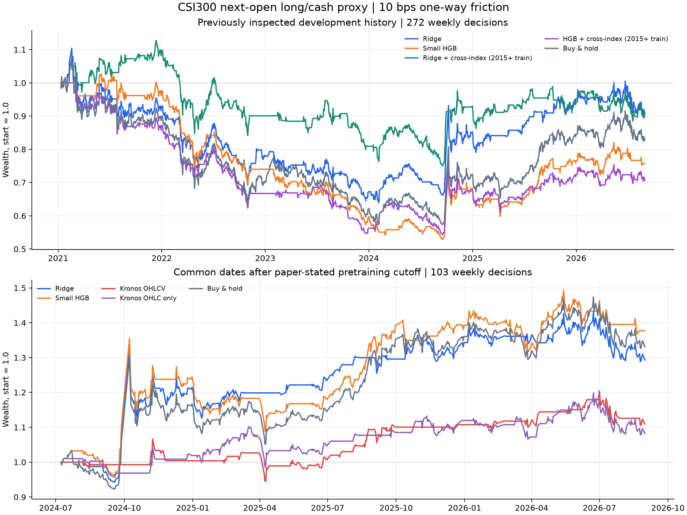
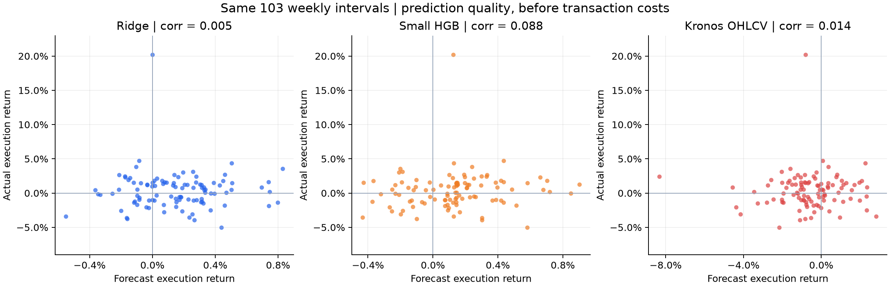

# 第三轮方法测试：非线性模型、官方 Kronos 与跨指数信息

生成日期：2026-09-10。本轮是已查看历史上的开发验证，不能当作全新盲测或实盘业绩。

## 结果概览

本轮完成六组本地模型对照，以及真实官方 Kronos-small 的两种输入测试。完整历史共 272 个周度持仓区间；包含 Kronos 的共同区间从 2024-07-05 信号开始，共 103 个区间，最后统一在 2026-08-31 开盘结束。下述收益均使用单边 10 bp 的假设摩擦、零现金利息及不加杠杆的指数多头／空仓口径。

- 小型非线性模型：完整历史方向准确率 47.79%，累计净收益 -24.34%；相同完整训练历史的 Ridge 为 51.10%、-9.25%。
- 新增跨指数信息：Ridge 的准确率为 52.21%、净收益 -10.24%。因其他指数历史较短，必须与下表的“匹配历史”对照比较信息增量，不能只对比完整历史结果。
- 官方 Kronos OHLCV：共同区间准确率 53.40%，净收益 10.93%；同区间买入持有为 33.09%。这与五年多的完整历史收益不能直接比较。
- 计算校验状态：**PASS**。此前两轮的 111 个证据文件保持原哈希。

**研究判断：本轮没有找到足以稳定替换第二轮 Ridge 基线的证据。**六个本地模型在完整区间的收益预测均方误差都没有优于零收益预测。小型树模型在 2024 年 7 月后的区间取得 37.68%，但在完整区间为 -24.34%，且共同区间相对 Ridge 的误差／周收益差置信区间均跨零。它相对买入持有的累计对数净值优势为 0.0339；单是 2024-07-19 信号区间的正贡献就有 0.0376，显示短区间超额对个别行情敏感。这是已冻结结果的贡献拆解，不是删除该周后的新回测。

跨指数特征使匹配历史的 Ridge 准确率从 47.06% 升至 52.21%，但净收益从 -8.52% 变为 -10.24%，主要误差检验也未达到校正后的显著改善。官方 Kronos OHLCV 的共同区间收益 RMSE 为 0.03296，高于 Ridge 的 0.02758；这一“误差更大”的差异在本轮探索性 MSE 检验中 Holm 校正 p=0.030。Kronos 的较低回撤同时伴随较低持仓比例，不能只据回撤认定预测更优。

仅 OHLC 的 Kronos 诊断准确率达到 56.31%，但净收益只有 8.19%。准确率、预测收益大小、持仓时机与成本需要共同评估。上述结论只针对已运行的模型、输入和标签，不代表全部非线性模型或微调后 Kronos 的能力上限。

## 1. 六组传统模型：完整开发区间

| 模型／策略 | 周数 | 方向准确率 | 收益 RMSE | 收益相关性 | 累计净收益 | 最大回撤 | 持仓时间占比 |
| --- | --- | --- | --- | --- | --- | --- | --- |
| Ridge：原有特征／完整历史 | 272 | 51.10% | 0.02653 | 0.027 | -9.25% | -42.09% | 79.43% |
| 小型树模型：原有特征／完整历史 | 272 | 47.79% | 0.02672 | -0.001 | -24.34% | -50.81% | 70.64% |
| Ridge：原有特征／匹配历史 | 272 | 47.06% | 0.02667 | -0.041 | -8.52% | -30.37% | 70.64% |
| Ridge：加入跨指数特征 | 272 | 52.21% | 0.02651 | 0.031 | -10.24% | -33.46% | 67.94% |
| 小型树模型：原有特征／匹配历史 | 272 | 46.32% | 0.02698 | -0.065 | -34.74% | -51.51% | 55.49% |
| 小型树模型：加入跨指数特征 | 272 | 45.96% | 0.02704 | -0.054 | -29.29% | -46.21% | 70.94% |
| 训练样本平均收益 | 272 | 47.06% | 0.02652 | -0.099 | -17.28% | -46.66% | 100.00% |
| 买入持有 | 272 | 47.06% | — | — | -17.28% | -46.66% | 100.00% |
| 零收益预测／空仓 | 272 | 52.94% | 0.02642 | — | 0.00% | 0.00% | 0.00% |

“准确率”统一按预测的持仓收益符号与实际开盘至开盘收益符号比较。空仓行是零收益预测按非上涨分类的机械参照；其准确率不代表预测能力。买入持有是交易基准，未将极小正数编码视为有意义的收益预测。

完整历史 Ridge 的验证参数再次选中 λ=10，其逐期预测与第二轮冻结基线数值一致。“完整历史”和“匹配历史”都采用季度扩展窗口更新；季度更新沿用第二轮方案，本轮没有再次寻找最优更新频率。

## 2. 官方 Kronos 的共同区间

| 模型／策略 | 周数 | 方向准确率 | 收益 RMSE | 收益相关性 | 累计净收益 | 最大回撤 | 持仓时间占比 |
| --- | --- | --- | --- | --- | --- | --- | --- |
| Ridge：原有特征／完整历史 | 103 | 55.34% | 0.02758 | 0.005 | 29.29% | -15.16% | 70.31% |
| 小型树模型：原有特征／完整历史 | 103 | 56.31% | 0.02737 | 0.088 | 37.68% | -19.69% | 70.69% |
| Ridge：原有特征／匹配历史 | 103 | 47.57% | 0.02770 | -0.045 | 11.55% | -12.40% | 62.26% |
| Ridge：加入跨指数特征 | 103 | 52.43% | 0.02756 | -0.001 | 10.35% | -11.62% | 74.52% |
| 小型树模型：原有特征／匹配历史 | 103 | 51.46% | 0.02777 | -0.039 | 20.18% | -10.46% | 52.11% |
| 小型树模型：加入跨指数特征 | 103 | 53.40% | 0.02775 | -0.064 | 19.97% | -20.25% | 81.23% |
| 官方 Kronos-small：OHLCV | 103 | 53.40% | 0.03296 | 0.014 | 10.93% | -11.44% | 32.95% |
| 官方 Kronos-small：仅 OHLC（诊断） | 103 | 56.31% | 0.02917 | -0.064 | 8.19% | -10.51% | 61.30% |
| 买入持有 | 103 | 54.37% | — | — | 33.09% | -19.15% | 100.00% |
| 零收益预测／空仓 | 103 | 45.63% | 0.02759 | — | 0.00% | 0.00% | 0.00% |

Kronos 使用官方 tokenizer 和 24.7M 参数的 small 模型，全部权重冻结，调用官方 `KronosPredictor.predict`。这次确实运行了预训练模型，但还不是方法文章提出的自适应分段＋Kronos tokenizer＋Crossformer 组合。

模型读取每个决策时点之前的 125 根日线。预测区间覆盖入场开盘直至下一次实际周五信号后的退出开盘，通常生成 6 根日线；遇节假日按已冻结交易日历延长。只传入未来日期，不传入未来价格。交易收益预测为“预测退出 open / 预测入场 open − 1”，分母也来自模型预测。实际次日开盘仅用于事后标签与净值。

这是本地季度重训练方法与官方预训练模型直接迁移的方案对照；二者预训练数据、表示与目标适配方式不同，不能把差异全部解释成模型架构优劣，也不能外推到 Kronos 微调后的表现。

每种输入、每个日期固定使用三个种子，每个种子由官方接口平均 8 条采样路径。先将三个种子的 OHLCVA 预测均值合并，再计算收益。所有种子的结果都保留，没有选择表现最好的种子或调整交易阈值。

## 3. 数据与时间边界

数据仍为前两轮归档的腾讯 OHLCV 快照，截止 2026-08-31。沿用所有原始质量标记，保留交易日行位置；目标输入、标签跨越严重错误 OHLC 的样本被排除。没有重新下载或改写价格。

七个其他指数为上证综指、上证 50、中证 500、中证 1000、深证成指、中小 100、创业板指。新增 72 个特征：各指数在 5／20／60 日的相对收益、波动差和收益相关性，以及跨指数上涨比例、平均收益、收益离散程度。加上原有 255 个经济与固定多尺度特征，总计 327 维。所有窗口只使用当时已观察的数据，并按确切日期对齐，没有向前或向后填补缺失。

跨指数共同有效输入从 2015-09-25 开始。在 2020-12-31 训练截止时，完整历史有 2413 个完成标签的日度训练样本，匹配历史有 1277 个；这些周度目标在日度训练中互相重叠，不能视为同数量的独立周样本。两种模型都增加了“同样缩短训练历史、仍只用目标指数特征”的对照，因而跨指数增量比较的样本与参数完全一致。指数之间的相关性也没有被当作独立样本数量。

原始数据没有真实成交额。当前官方预测代码在只缺 amount 时会自动计算“volume × OHLC 均价”，因此本轮显式将 amount 通道置零，阻止自动合成；这里的零代表缺失占位。OHLC-only 是额外的输入诊断，同时将 volume 置零。两者都存在与六通道完整数据不同的输入条件，不能宣称是文章的完整 OHLCAV 复现。

[Kronos 论文附录](https://arxiv.org/html/2508.02739v1)声明预训练数据截止 2024 年 6 月。本轮据此将包含 Kronos 的主要共同比较限定为 2024 年 7 月以后。模型卡没有独立披露该权重专属的训练截止日期，因此这里是依照论文声明划分的历史检验，不能独立认证其所有预训练数据未覆盖测试期。下载的模型及 tokenizer 权重哈希都与 2025-06-30 的首次模型上传记录一致；后续提交为说明文档更新。

另列 2025-08-18 以后的保守发布后敏感性窗口，晚于公开论文与微调脚本公告。使用的官方代码修订时间为 2026 年 4 月，故这个切片也不等同于历史时点可获得软件的逐版本重演。归档行情本身也不是逐时点修订数据库。

## 4. 发布后窗口与成本敏感性

| 模型／策略 | 周数 | 方向准确率 | 收益 RMSE | 收益相关性 | 累计净收益 | 最大回撤 | 持仓时间占比 |
| --- | --- | --- | --- | --- | --- | --- | --- |
| Ridge：原有特征／完整历史 | 48 | 50.00% | 0.01884 | -0.029 | -0.52% | -10.02% | 82.93% |
| 小型树模型：原有特征／完整历史 | 48 | 52.08% | 0.01854 | 0.119 | 3.54% | -8.43% | 69.92% |
| Ridge：加入跨指数特征 | 48 | 50.00% | 0.01910 | -0.105 | -5.96% | -10.54% | 78.05% |
| 小型树模型：加入跨指数特征 | 48 | 54.17% | 0.01905 | -0.064 | 3.54% | -7.64% | 80.49% |
| 官方 Kronos-small：OHLCV | 48 | 54.17% | 0.02780 | -0.031 | 1.45% | -8.15% | 34.15% |
| 官方 Kronos-small：仅 OHLC（诊断） | 48 | 58.33% | 0.02028 | 0.062 | 0.45% | -10.02% | 73.17% |
| 买入持有 | 48 | 52.08% | — | — | 3.09% | -10.02% | 100.00% |
| 零收益预测／空仓 | 48 | 47.92% | 0.01869 | — | 0.00% | 0.00% | 0.00% |

每个子区间均从空仓和净值 1 开始计算，并在同一结束开盘平仓。指数收益只是可执行时点的价格代理；本轮成本是单边 0／5／10／20 bp 的情景假设，不是券商或交易所实际收费，也不包含 ETF 跟踪误差、分红、冲击与真实买卖价差。最大回撤按每日开盘净值计算。

### 完整开发区间成本敏感性

| 模型 | 0 bp | 5 bp | 10 bp | 20 bp |
| --- | --- | --- | --- | --- |
| Ridge：原有特征／完整历史 | -4.79% | -7.05% | -9.25% | -13.51% |
| 小型树模型：原有特征／完整历史 | -19.82% | -22.11% | -24.34% | -28.61% |
| Ridge：加入跨指数特征 | -2.95% | -6.67% | -10.24% | -16.98% |
| 小型树模型：加入跨指数特征 | -23.55% | -26.48% | -29.29% | -34.60% |
| 买入持有 | -17.12% | -17.20% | -17.28% | -17.45% |

### Kronos 共同区间成本敏感性

| 模型 | 0 bp | 5 bp | 10 bp | 20 bp |
| --- | --- | --- | --- | --- |
| Ridge：原有特征／完整历史 | 31.91% | 30.59% | 29.29% | 26.73% |
| 小型树模型：原有特征／完整历史 | 41.59% | 39.63% | 37.68% | 33.88% |
| 官方 Kronos-small：OHLCV | 15.23% | 13.06% | 10.93% | 6.79% |
| 官方 Kronos-small：仅 OHLC（诊断） | 11.93% | 10.05% | 8.19% | 4.57% |
| 买入持有 | 33.36% | 33.23% | 33.09% | 32.83% |

## 5. 预先约定的配对比较

负的 RMSE 差表示模型 A 误差更小；收益差使用平均每个周度持仓区间的净收益，单位为百分点。置信区间来自每块 8 个周度观察的循环区块、10,000 次重采样；节假日会使少数持仓区间长于一周。RMSE 对应的均方误差检验在每个窗口内进行 Holm 校正。所有检验都属于已查看历史上的探索性结果。

### 完整开发区间

| A vs B | RMSE 差及 95% 区间 | MSE 校正 p | 平均周净收益差及 95% 区间（pp） |
| --- | --- | --- | --- |
| 小型树模型：原有特征／完整历史 vs Ridge：原有特征／完整历史 | 0.000191 [-0.000166, 0.000579] | 0.598 | -0.071 [-0.219, 0.073] |
| Ridge：加入跨指数特征 vs Ridge：原有特征／匹配历史 | -0.000163 [-0.000312, 0.000009] | 0.193 | -0.008 [-0.103, 0.079] |
| 小型树模型：加入跨指数特征 vs 小型树模型：原有特征／匹配历史 | 0.000063 [-0.000238, 0.000410] | 0.694 | 0.030 [-0.103, 0.167] |

### 论文训练截止后的共同区间

| A vs B | RMSE 差及 95% 区间 | MSE 校正 p | 平均周净收益差及 95% 区间（pp） |
| --- | --- | --- | --- |
| 小型树模型：原有特征／完整历史 vs Ridge：原有特征／完整历史 | -0.000208 [-0.000788, 0.000380] | 1.000 | 0.062 [-0.173, 0.317] |
| Ridge：加入跨指数特征 vs Ridge：原有特征／匹配历史 | -0.000140 [-0.000351, 0.000185] | 1.000 | -0.008 [-0.087, 0.063] |
| 小型树模型：加入跨指数特征 vs 小型树模型：原有特征／匹配历史 | -0.000019 [-0.000407, 0.000473] | 1.000 | 0.004 [-0.221, 0.224] |
| 官方 Kronos-small：OHLCV vs Ridge：原有特征／完整历史 | 0.005387 [0.002595, 0.010069] | 0.030 | -0.172 [-0.646, 0.163] |
| 官方 Kronos-small：OHLCV vs 小型树模型：原有特征／完整历史 | 0.005595 [0.002772, 0.010261] | 0.030 | -0.234 [-0.702, 0.122] |

## 6. 年份、单周贡献与采样波动

| 年份 | 模型 | 周数 | 准确率 | 该段净收益 |
| --- | --- | --- | --- | --- |
| 2024 | Ridge：原有特征／完整历史 | 25 | 56.00% | 14.82% |
| 2024 | 小型树模型：原有特征／完整历史 | 25 | 52.00% | 17.57% |
| 2024 | 官方 Kronos-small：OHLCV | 25 | 52.00% | 0.41% |
| 2024 | 买入持有 | 25 | 48.00% | 10.27% |
| 2025 | Ridge：原有特征／完整历史 | 48 | 60.42% | 19.73% |
| 2025 | 小型树模型：原有特征／完整历史 | 48 | 64.58% | 21.26% |
| 2025 | 官方 Kronos-small：OHLCV | 48 | 50.00% | 10.29% |
| 2025 | 买入持有 | 48 | 62.50% | 26.32% |
| 2026 | Ridge：原有特征／完整历史 | 30 | 46.67% | -5.95% |
| 2026 | 小型树模型：原有特征／完整历史 | 30 | 46.67% | -3.43% |
| 2026 | 官方 Kronos-small：OHLCV | 30 | 60.00% | 0.17% |
| 2026 | 买入持有 | 30 | 46.67% | -4.45% |

2024 与 2026 为不完整年份。该段净收益按持续持仓路径中的周收益分组复利，包含实际边界的交易成本，没有每年重新清仓。完整区间所有模型逐年结果在 `yearly_metrics.csv`。

| 输入 | 种子（各平均 8 条路径） | 准确率 | RMSE | 累计净收益 |
| --- | --- | --- | --- | --- |
| 官方 Kronos-small：OHLCV | 20260910 | 47.57% | 0.03449 | -5.09% |
| 官方 Kronos-small：OHLCV | 20260911 | 51.46% | 0.03256 | 6.28% |
| 官方 Kronos-small：OHLCV | 20260912 | 53.40% | 0.03366 | 13.99% |
| 官方 Kronos-small：仅 OHLC（诊断） | 20260910 | 53.40% | 0.02894 | 24.24% |
| 官方 Kronos-small：仅 OHLC（诊断） | 20260911 | 56.31% | 0.02956 | 8.52% |
| 官方 Kronos-small：仅 OHLC（诊断） | 20260912 | 50.49% | 0.02961 | -11.21% |

官方 Kronos-small：仅 OHLC（诊断）：三个种子方向完全一致的日期占 62.14%，逐日期预测收益在种子间的平均标准差为 0.35%。

官方 Kronos-small：OHLCV：三个种子方向完全一致的日期占 71.84%，逐日期预测收益在种子间的平均标准差为 0.65%。

| 相对买入持有 | 最大正贡献信号日 | 累计对数净值差 | 去掉最大正贡献 | 去掉前三个正贡献 |
| --- | --- | --- | --- | --- |
| 小型树模型：原有特征／完整历史 | 2024-07-19 | 0.0339 | -0.0037 | -0.0708 |
| Ridge：加入跨指数特征 | 2025-03-28 | -0.1874 | -0.2223 | -0.2618 |
| 小型树模型：加入跨指数特征 | 2025-11-14 | -0.1038 | -0.1344 | -0.1795 |
| 官方 Kronos-small：OHLCV | 2024-12-27 | -0.1822 | -0.2340 | -0.3130 |

这些贡献分析仅拆解已经冻结的预测，不是删除某周后重新训练或重新执行的回测；数值不能当作另一项可交易业绩。完整历史与所有预先约定比较的贡献记录见 `influence_diagnostics.json`。

官方 Kronos-small：仅 OHLC（诊断） 的集成预测中，625 根输出 K 线有 0 根违反高低价约束（0.00%）。没有按输出质量删样本或事后投影，预测开盘价均通过有限正数检查。

官方 Kronos-small：OHLCV 的集成预测中，625 根输出 K 线有 0 根违反高低价约束（0.00%）。没有按输出质量删样本或事后投影，预测开盘价均通过有限正数检查。

## 7. 冻结参数、验证集与复现

Ridge λ=10.0；小型树模型配置为 `{'max_leaf_nodes': 7, 'max_iter': 50}`，学习率 0.03、叶节点最少 100 个日度训练样本、L2=10，关闭随机验证集早停。只在 2018—2020 年的 141 个周度验证日期选择参数，然后将相同参数复制给匹配历史和跨指数模型。

| 验证集模型 | 周数 | 收益 RMSE | 方向准确率 |
| --- | --- | --- | --- |
| 小型树模型：加入跨指数特征 | 141 | 0.03095 | 50.35% |
| 小型树模型：原有特征／完整历史 | 141 | 0.03014 | 60.99% |
| 小型树模型：原有特征／匹配历史 | 141 | 0.03130 | 48.23% |
| Ridge：加入跨指数特征 | 141 | 0.03099 | 51.77% |
| Ridge：原有特征／完整历史 | 141 | 0.03056 | 54.61% |
| Ridge：原有特征／匹配历史 | 141 | 0.03090 | 53.19% |

模型选择记录时间：`2026-09-10T02:14:18.327793+00:00`。协议哈希：`ce41967443249e696298ff8dfc8dabaea1c79b57bcde5d78e1f699eaf4d84121`。运行中曾在第一次本地验证前遇到 pandas 只读掩码兼容问题，修复只涉及复制数组；初始源码与失败清单在 `../sources/`，没有据开发结果改动方案。

关键产物：

- [冻结协议](../protocol.json)、[选参记录](selection.json)、[校验结果](verification.json)、[测试输出](test_results.txt)。
- [逐期预测](predictions.csv)、[全窗口指标](metrics.csv)、[成本情景](cost_sensitivity.csv)、[逐年结果](yearly_metrics.csv)。
- [配对检验](paired_comparisons.json)、[额外诊断](diagnostic_comparisons.json)、[单周贡献](influence_diagnostics.json)。
- [Kronos 采样种子指标](kronos_seed_metrics.csv)、[输入审计](kronos_input_audit.json)、`kronos_paths/` 中全部预测路径均值。
- [本地运行清单](local_run_manifest.json)、[Kronos 运行清单](kronos_run_manifest.json)、[权重来源与哈希](../sources/weights_manifest.json)。

核验覆盖 222 个训练／验证折、2926 条主预测、618 份官方分种子预测路径；重新计算全部标签、预测收益、验证集选择、同样本信息增量比较及净值。净值同时与逐日计算、逐周复利和买入持有解析式核对。

路径 CSV 按官方 float32 输出保存。初次复算直接用 float64 解释十进制文本，出现小于 1e-7 的收益差；按原始 float32 恢复后，618 份路径的入场与退出预测价格全部精确一致，所有集成 OHLCVA 输出均逐位一致，收益复算差小于 1e-12。此修正只涉及校验读取精度，没有改动预测或评价结果。

复现命令见 [README](../README.md)。本机使用已有 CPU PyTorch 环境；新增依赖仅位于本轮目录，没有修改共享 Python 环境或显卡驱动。官方源码 commit：`67b630e67f6a18c9e9be918d9b4337c960db1e9a`。模型 commit：`901c26c1332695a2a8f243eb2f37243a37bea320`；tokenizer commit：`0e0117387f39004a9016484a186a908917e22426`。各文件 SHA256 保存在清单中。

研究范围仍是沪深 300 周度择时。自适应分段配合神经网络、Crossformer 以及跨资产排序尚未测试，本报告不对这些未运行的组合给出效果结论。

## 参考来源

- [Kronos 官方实现及接口](https://github.com/shiyu-coder/Kronos/tree/67b630e67f6a18c9e9be918d9b4337c960db1e9a)。
- [Kronos 论文及训练截止声明](https://arxiv.org/html/2508.02739v1)。
- [官方模型权重提交历史](https://huggingface.co/NeoQuasar/Kronos-small/commits/main)、[官方 tokenizer 提交历史](https://huggingface.co/NeoQuasar/Kronos-Tokenizer-base/commits/main)。
- [scikit-learn HistGradientBoostingRegressor 官方文档](https://scikit-learn.org/stable/modules/generated/sklearn.ensemble.HistGradientBoostingRegressor.html)。
