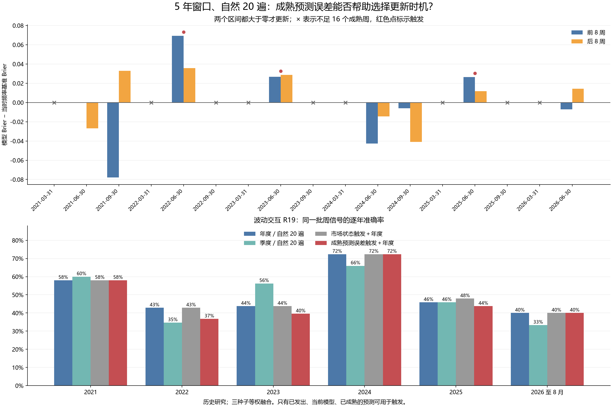

# 第三十轮：成熟预测误差触发模型更新

预先固定的规则在 17 次非年末季度检查中触发 3 次更新；其中 9 次检查因当前模型不足 16 个成熟周预测而保持原模型。另有 6 次固定年末更新。计算和因果顺序复核全部通过。

本轮复用已冻结的 5 年窗口、自然 20 遍神经网络和分类头，实际新增网络训练、分类拟合均为 0。测试的是何时使用新模型，模型结构、训练量和融合方式保持原配方。全部 272 个历史周此前已被查看，本轮不是新盲测。

## 固定的失效判断

统一用波动交互 R19 的三种子平均概率监测。每个非年末季末，取当前模型实际使用期间、到当天全部标签已成熟的最近 16 个周预测。分成相邻且不重叠的前 8 周和后 8 周，分别计算“模型 Brier − 当时训练上涨频率基准 Brier”的平均值。只有两段都严格大于 0 才更新。

这意味着持续落后于频率基准，不要求误差单调增加。两个区间是同一检查内不重叠的 8 周，不能解释成两次独立检验。零差值或只有一段落后都不触发；不足 16 周则保持原模型。每次年末或触发更新后，只积累新模型实际发出的预测，旧模型的误差不纳入新模型判断。

标签成熟沿用执行收益及辅助标签均已完成的 joint_completed 口径。模型训练截止日严格早于信号日；季末当天的信号仍使用原模型，新决定仅影响之后的信号。没有用训练集残差补历史记录，也没有把新模型回算过去样本当作新模型已经发出的预测。

所有 R18/R19/R23/R25、原 MSE 和频率基准共享 R19 触发日历，因此结果是在检验一个共同更新政策。该监测指标未必适合其他预测头，不能事后换成当轮表现最好的监测方法。16 周、两个 8 周和零阈值均预先固定，本轮没有搜索其他参数。

## 预测覆盖与顺序

在模拟触发前，先按日历固定 671 个模型周的通用覆盖；复用旧预测，补算其中 182 个模型周、33 个已有网络的推理。覆盖包含某些政策不会选到的模型，但触发函数只接收已发出、当前模型、已成熟的记录。

随后逐个季末回放，保存触发日历、已发出预测账本、每次检查使用的周与区间，并在汇总比较前冻结。最后才计算下一季度的新旧模型对照，用于判断触发是否有用；这些未来结果不参与当前或之后的触发计算。

## 触发记录

| 检查日 | 检查前模型 | 成熟周数 | 前 8 周超额 Brier | 后 8 周超额 Brier | 原因 | 检查后模型 |
|---|---|---|---|---|---|---|
| 2020-12-31 | — | 0 | — | — | 年末例行 | 2020-12-31 |
| 2021-03-31 | 2020-12-31 | 10 | — | — | 不足 16 周 | 2020-12-31 |
| 2021-06-30 | 2020-12-31 | 23 | -0.000396 | -0.026951 | 未持续落后 | 2020-12-31 |
| 2021-09-30 | 2020-12-31 | 36 | -0.077770 | 0.032896 | 未持续落后 | 2020-12-31 |
| 2021-12-31 | 2020-12-31 | 48 | — | — | 年末例行 | 2021-12-31 |
| 2022-03-31 | 2021-12-31 | 10 | — | — | 不足 16 周 | 2021-12-31 |
| 2022-06-30 | 2021-12-31 | 22 | 0.069224 | 0.035695 | 两段均落后 | 2022-06-30 |
| 2022-09-30 | 2022-06-30 | 12 | — | — | 不足 16 周 | 2022-06-30 |
| 2022-12-31 | 2022-06-30 | 24 | — | — | 年末例行 | 2022-12-31 |
| 2023-03-31 | 2022-12-31 | 10 | — | — | 不足 16 周 | 2022-12-31 |
| 2023-06-30 | 2022-12-31 | 22 | 0.026810 | 0.028674 | 两段均落后 | 2023-06-30 |
| 2023-09-30 | 2023-06-30 | 11 | — | — | 不足 16 周 | 2023-06-30 |
| 2023-12-31 | 2023-06-30 | 22 | — | — | 年末例行 | 2023-12-31 |
| 2024-03-31 | 2023-12-31 | 9 | — | — | 不足 16 周 | 2023-12-31 |
| 2024-06-30 | 2023-12-31 | 20 | -0.042659 | -0.014372 | 未持续落后 | 2023-12-31 |
| 2024-09-30 | 2023-12-31 | 34 | -0.005898 | -0.040893 | 未持续落后 | 2023-12-31 |
| 2024-12-31 | 2023-12-31 | 46 | — | — | 年末例行 | 2024-12-31 |
| 2025-03-31 | 2024-12-31 | 11 | — | — | 不足 16 周 | 2024-12-31 |
| 2025-06-30 | 2024-12-31 | 22 | 0.026296 | 0.011837 | 两段均落后 | 2025-06-30 |
| 2025-09-30 | 2025-06-30 | 12 | — | — | 不足 16 周 | 2025-06-30 |
| 2025-12-31 | 2025-06-30 | 24 | — | — | 年末例行 | 2025-12-31 |
| 2026-03-31 | 2025-12-31 | 10 | — | — | 不足 16 周 | 2025-12-31 |
| 2026-06-30 | 2025-12-31 | 21 | -0.007116 | 0.014239 | 未持续落后 | 2025-12-31 |

逐次使用的样本和区间见 monitor_membership.csv；已发出概率与当时频率基准见 published_ledger.csv。年末行只作例行重置，不计算 16 周触发统计。

## 逐期运行时的训练预算

| 政策 | 更新日期数 | 三种子网络训练数 | 优化器更新次数 |
|---|---|---|---|
| 年度／自然 20 遍 | 6 | 18 | 3600 |
| 季度／自然 20 遍 | 23 | 69 | 13800 |
| 市场状态触发＋年度 | 8 | 24 | 4800 |
| 成熟预测误差触发＋年度 | 9 | 27 | 5400 |

此表是如果按历史逐期运行该政策所需的训练量；此次研究复用权重，实际新增网络/分类训练为 0，补充推理的计算也包括未被最终政策选中的路径。

## 2021–2023（147 周）

| 政策 | 方法 | 正确/总数 | 准确率 | 平衡准确率 | AUROC | Brier↓ | 对数损失↓ |
|---|---|---|---|---|---|---|---|
| 年度／旧重复量 | 加性 R18 | 65/147 | 44.22% | 46.09% | 0.448008 | 0.309837 | 0.834563 |
| 年度／旧重复量 | 波动交互 R19 | 67/147 | 45.58% | 47.49% | 0.448956 | 0.310966 | 0.838337 |
| 年度／旧重复量 | 联合顺序项 R23 | 68/147 | 46.26% | 47.86% | 0.453700 | 0.311375 | 0.845381 |
| 年度／旧重复量 | 固定原模型＋顺序项 R25 | 69/147 | 46.94% | 48.66% | 0.453700 | 0.310431 | 0.841951 |
| 年度／旧重复量 | 原 MSE | 60/147 | 40.82% | 42.28% | 0.432638 | — | — |
| 年度／旧重复量 | 训练上涨频率 | 62/147 | 42.18% | 50.00% | 0.529412 | 0.256412 | 0.706022 |
| 年度／自然 20 遍 | 加性 R18 | 68/147 | 46.26% | 47.86% | 0.463188 | 0.277344 | 0.751325 |
| 年度／自然 20 遍 | 波动交互 R19 | 71/147 | 48.30% | 50.28% | 0.468121 | 0.277967 | 0.752923 |
| 年度／自然 20 遍 | 联合顺序项 R23 | 68/147 | 46.26% | 48.29% | 0.476850 | 0.276195 | 0.749569 |
| 年度／自然 20 遍 | 固定原模型＋顺序项 R25 | 68/147 | 46.26% | 48.29% | 0.475712 | 0.276108 | 0.749367 |
| 年度／自然 20 遍 | 原 MSE | 73/147 | 49.66% | 51.02% | 0.481025 | — | — |
| 年度／自然 20 遍 | 训练上涨频率 | 62/147 | 42.18% | 50.00% | 0.529412 | 0.256412 | 0.706022 |
| 季度／自然 20 遍 | 加性 R18 | 73/147 | 49.66% | 51.45% | 0.507590 | 0.264364 | 0.723883 |
| 季度／自然 20 遍 | 波动交互 R19 | 74/147 | 50.34% | 52.04% | 0.504175 | 0.264609 | 0.724441 |
| 季度／自然 20 遍 | 联合顺序项 R23 | 74/147 | 50.34% | 51.82% | 0.496395 | 0.265643 | 0.726598 |
| 季度／自然 20 遍 | 固定原模型＋顺序项 R25 | 75/147 | 51.02% | 52.63% | 0.495256 | 0.265518 | 0.726259 |
| 季度／自然 20 遍 | 原 MSE | 68/147 | 46.26% | 48.73% | 0.488615 | — | — |
| 季度／自然 20 遍 | 训练上涨频率 | 62/147 | 42.18% | 50.00% | 0.498008 | 0.255891 | 0.704963 |
| 市场状态触发＋年度 | 加性 R18 | 68/147 | 46.26% | 47.86% | 0.463188 | 0.277344 | 0.751325 |
| 市场状态触发＋年度 | 波动交互 R19 | 71/147 | 48.30% | 50.28% | 0.468121 | 0.277967 | 0.752923 |
| 市场状态触发＋年度 | 联合顺序项 R23 | 68/147 | 46.26% | 48.29% | 0.476850 | 0.276195 | 0.749569 |
| 市场状态触发＋年度 | 固定原模型＋顺序项 R25 | 68/147 | 46.26% | 48.29% | 0.475712 | 0.276108 | 0.749367 |
| 市场状态触发＋年度 | 原 MSE | 73/147 | 49.66% | 51.02% | 0.481025 | — | — |
| 市场状态触发＋年度 | 训练上涨频率 | 62/147 | 42.18% | 50.00% | 0.529412 | 0.256412 | 0.706022 |
| 成熟预测误差触发＋年度 | 加性 R18 | 66/147 | 44.90% | 47.55% | 0.472106 | 0.274054 | 0.743857 |
| 成熟预测误差触发＋年度 | 波动交互 R19 | 66/147 | 44.90% | 47.99% | 0.475901 | 0.274670 | 0.745338 |
| 成熟预测误差触发＋年度 | 联合顺序项 R23 | 67/147 | 45.58% | 48.58% | 0.481214 | 0.274268 | 0.744880 |
| 成熟预测误差触发＋年度 | 固定原模型＋顺序项 R25 | 67/147 | 45.58% | 48.58% | 0.479127 | 0.274242 | 0.744813 |
| 成熟预测误差触发＋年度 | 原 MSE | 70/147 | 47.62% | 49.47% | 0.500380 | — | — |
| 成熟预测误差触发＋年度 | 训练上涨频率 | 62/147 | 42.18% | 50.00% | 0.530076 | 0.256049 | 0.705285 |

## 2024–2026 年 8 月（125 周）

| 政策 | 方法 | 正确/总数 | 准确率 | 平衡准确率 | AUROC | Brier↓ | 对数损失↓ |
|---|---|---|---|---|---|---|---|
| 年度／旧重复量 | 加性 R18 | 71/125 | 56.80% | 57.20% | 0.593734 | 0.255695 | 0.709330 |
| 年度／旧重复量 | 波动交互 R19 | 70/125 | 56.00% | 56.36% | 0.594761 | 0.255385 | 0.708607 |
| 年度／旧重复量 | 联合顺序项 R23 | 72/125 | 57.60% | 57.87% | 0.587571 | 0.257509 | 0.714541 |
| 年度／旧重复量 | 固定原模型＋顺序项 R25 | 73/125 | 58.40% | 58.72% | 0.587314 | 0.257626 | 0.714563 |
| 年度／旧重复量 | 原 MSE | 69/125 | 55.20% | 55.60% | 0.579353 | — | — |
| 年度／旧重复量 | 训练上涨频率 | 56/125 | 44.80% | 45.48% | 0.425526 | 0.252748 | 0.698649 |
| 年度／自然 20 遍 | 加性 R18 | 69/125 | 55.20% | 55.96% | 0.578839 | 0.246152 | 0.685806 |
| 年度／自然 20 遍 | 波动交互 R19 | 68/125 | 54.40% | 55.02% | 0.582435 | 0.246843 | 0.687439 |
| 年度／自然 20 遍 | 联合顺序项 R23 | 72/125 | 57.60% | 58.41% | 0.563174 | 0.249790 | 0.693613 |
| 年度／自然 20 遍 | 固定原模型＋顺序项 R25 | 71/125 | 56.80% | 57.65% | 0.562917 | 0.249824 | 0.693671 |
| 年度／自然 20 遍 | 原 MSE | 66/125 | 52.80% | 53.15% | 0.521315 | — | — |
| 年度／自然 20 遍 | 训练上涨频率 | 56/125 | 44.80% | 45.48% | 0.425526 | 0.252748 | 0.698649 |
| 季度／自然 20 遍 | 加性 R18 | 63/125 | 50.40% | 50.78% | 0.506420 | 0.255872 | 0.705187 |
| 季度／自然 20 遍 | 波动交互 R19 | 63/125 | 50.40% | 50.78% | 0.516949 | 0.254990 | 0.703625 |
| 季度／自然 20 遍 | 联合顺序项 R23 | 63/125 | 50.40% | 50.78% | 0.508988 | 0.256565 | 0.706808 |
| 季度／自然 20 遍 | 固定原模型＋顺序项 R25 | 63/125 | 50.40% | 50.78% | 0.508218 | 0.256537 | 0.706748 |
| 季度／自然 20 遍 | 原 MSE | 68/125 | 54.40% | 55.11% | 0.529533 | — | — |
| 季度／自然 20 遍 | 训练上涨频率 | 60/125 | 48.00% | 50.31% | 0.414355 | 0.252495 | 0.698143 |
| 市场状态触发＋年度 | 加性 R18 | 72/125 | 57.60% | 58.14% | 0.596816 | 0.243854 | 0.680943 |
| 市场状态触发＋年度 | 波动交互 R19 | 69/125 | 55.20% | 55.51% | 0.592964 | 0.245567 | 0.684795 |
| 市场状态触发＋年度 | 联合顺序项 R23 | 71/125 | 56.80% | 57.38% | 0.576271 | 0.248662 | 0.691363 |
| 市场状态触发＋年度 | 固定原模型＋顺序项 R25 | 70/125 | 56.00% | 56.63% | 0.575501 | 0.248691 | 0.691414 |
| 市场状态触发＋年度 | 原 MSE | 66/125 | 52.80% | 52.79% | 0.555470 | — | — |
| 市场状态触发＋年度 | 训练上涨频率 | 56/125 | 44.80% | 45.48% | 0.448639 | 0.252315 | 0.697782 |
| 成熟预测误差触发＋年度 | 加性 R18 | 69/125 | 55.20% | 55.96% | 0.579353 | 0.245435 | 0.684193 |
| 成熟预测误差触发＋年度 | 波动交互 R19 | 67/125 | 53.60% | 54.17% | 0.582691 | 0.245633 | 0.684637 |
| 成熟预测误差触发＋年度 | 联合顺序项 R23 | 72/125 | 57.60% | 58.41% | 0.571392 | 0.248160 | 0.689971 |
| 成熟预测误差触发＋年度 | 固定原模型＋顺序项 R25 | 71/125 | 56.80% | 57.65% | 0.570878 | 0.248182 | 0.690003 |
| 成熟预测误差触发＋年度 | 原 MSE | 61/125 | 48.80% | 49.36% | 0.508218 | — | — |
| 成熟预测误差触发＋年度 | 训练上涨频率 | 56/125 | 44.80% | 45.48% | 0.417052 | 0.252955 | 0.699065 |

## 40 项预设配对比较

统一 Holm 校正后，p<0.05 的改善 0 项、恶化 0 项。负损失差表示误差触发政策更好。

| 时期 | 方法 | 参照政策/方法 | 损失 | 差值 | 边际 95% 区间 | 原始 p | Holm p |
|---|---|---|---|---|---|---|---|
| 2021–2023 | 波动交互 R19 | 年度／自然 20 遍/波动交互 R19 | direction_error | 0.034014 | [-0.020408, +0.102041] | 0.280172 | 1.000000 |
| 2021–2023 | 波动交互 R19 | 年度／自然 20 遍/波动交互 R19 | brier | -0.003297 | [-0.017345, +0.009496] | 0.614139 | 1.000000 |
| 2021–2023 | 联合顺序项 R23 | 年度／自然 20 遍/联合顺序项 R23 | direction_error | 0.006803 | [-0.054422, +0.068027] | 0.817418 | 1.000000 |
| 2021–2023 | 联合顺序项 R23 | 年度／自然 20 遍/联合顺序项 R23 | brier | -0.001927 | [-0.015032, +0.010106] | 0.749225 | 1.000000 |
| 2021–2023 | 固定原模型＋顺序项 R25 | 年度／自然 20 遍/固定原模型＋顺序项 R25 | direction_error | 0.006803 | [-0.054422, +0.068027] | 0.817418 | 1.000000 |
| 2021–2023 | 固定原模型＋顺序项 R25 | 年度／自然 20 遍/固定原模型＋顺序项 R25 | brier | -0.001866 | [-0.014965, +0.010111] | 0.755724 | 1.000000 |
| 2021–2023 | 波动交互 R19 | 季度／自然 20 遍/波动交互 R19 | direction_error | 0.054422 | [-0.006803, +0.122449] | 0.109689 | 1.000000 |
| 2021–2023 | 波动交互 R19 | 季度／自然 20 遍/波动交互 R19 | brier | 0.010061 | [+0.000423, +0.020071] | 0.044696 | 1.000000 |
| 2021–2023 | 联合顺序项 R23 | 季度／自然 20 遍/联合顺序项 R23 | direction_error | 0.047619 | [-0.013605, +0.122449] | 0.176782 | 1.000000 |
| 2021–2023 | 联合顺序项 R23 | 季度／自然 20 遍/联合顺序项 R23 | brier | 0.008625 | [-0.001470, +0.019003] | 0.103690 | 1.000000 |
| 2021–2023 | 固定原模型＋顺序项 R25 | 季度／自然 20 遍/固定原模型＋顺序项 R25 | direction_error | 0.054422 | [-0.006803, +0.122449] | 0.118488 | 1.000000 |
| 2021–2023 | 固定原模型＋顺序项 R25 | 季度／自然 20 遍/固定原模型＋顺序项 R25 | brier | 0.008725 | [-0.001234, +0.018943] | 0.094791 | 1.000000 |
| 2021–2023 | 波动交互 R19 | 市场状态触发＋年度/波动交互 R19 | direction_error | 0.034014 | [-0.020408, +0.102041] | 0.280172 | 1.000000 |
| 2021–2023 | 波动交互 R19 | 市场状态触发＋年度/波动交互 R19 | brier | -0.003297 | [-0.017345, +0.009496] | 0.614139 | 1.000000 |
| 2021–2023 | 联合顺序项 R23 | 市场状态触发＋年度/联合顺序项 R23 | direction_error | 0.006803 | [-0.054422, +0.068027] | 0.817418 | 1.000000 |
| 2021–2023 | 联合顺序项 R23 | 市场状态触发＋年度/联合顺序项 R23 | brier | -0.001927 | [-0.015032, +0.010106] | 0.749225 | 1.000000 |
| 2021–2023 | 固定原模型＋顺序项 R25 | 市场状态触发＋年度/固定原模型＋顺序项 R25 | direction_error | 0.006803 | [-0.054422, +0.068027] | 0.817418 | 1.000000 |
| 2021–2023 | 固定原模型＋顺序项 R25 | 市场状态触发＋年度/固定原模型＋顺序项 R25 | brier | -0.001866 | [-0.014965, +0.010111] | 0.755724 | 1.000000 |
| 2021–2023 | 波动交互 R19 | 成熟预测误差触发＋年度/训练上涨频率 | brier | 0.018621 | [+0.002958, +0.033874] | 0.017298 | 0.691931 |
| 2021–2023 | 波动交互 R19 | 成熟预测误差触发＋年度/原 MSE | direction_error | 0.027211 | [-0.034014, +0.095238] | 0.400960 | 1.000000 |
| 2024–2026 年 8 月 | 波动交互 R19 | 年度／自然 20 遍/波动交互 R19 | direction_error | 0.008000 | [-0.024000, +0.048000] | 0.667533 | 1.000000 |
| 2024–2026 年 8 月 | 波动交互 R19 | 年度／自然 20 遍/波动交互 R19 | brier | -0.001210 | [-0.007051, +0.003857] | 0.657434 | 1.000000 |
| 2024–2026 年 8 月 | 联合顺序项 R23 | 年度／自然 20 遍/联合顺序项 R23 | direction_error | 0.000000 | [-0.024000, +0.024000] | 1.000000 | 1.000000 |
| 2024–2026 年 8 月 | 联合顺序项 R23 | 年度／自然 20 遍/联合顺序项 R23 | brier | -0.001630 | [-0.008541, +0.004155] | 0.612939 | 1.000000 |
| 2024–2026 年 8 月 | 固定原模型＋顺序项 R25 | 年度／自然 20 遍/固定原模型＋顺序项 R25 | direction_error | 0.000000 | [-0.024000, +0.024000] | 1.000000 | 1.000000 |
| 2024–2026 年 8 月 | 固定原模型＋顺序项 R25 | 年度／自然 20 遍/固定原模型＋顺序项 R25 | brier | -0.001642 | [-0.008515, +0.004095] | 0.597840 | 1.000000 |
| 2024–2026 年 8 月 | 波动交互 R19 | 季度／自然 20 遍/波动交互 R19 | direction_error | -0.032000 | [-0.080000, +0.016000] | 0.214779 | 1.000000 |
| 2024–2026 年 8 月 | 波动交互 R19 | 季度／自然 20 遍/波动交互 R19 | brier | -0.009357 | [-0.018377, -0.001128] | 0.033997 | 1.000000 |
| 2024–2026 年 8 月 | 联合顺序项 R23 | 季度／自然 20 遍/联合顺序项 R23 | direction_error | -0.072000 | [-0.144000, -0.008000] | 0.046395 | 1.000000 |
| 2024–2026 年 8 月 | 联合顺序项 R23 | 季度／自然 20 遍/联合顺序项 R23 | brier | -0.008405 | [-0.017370, -0.000304] | 0.056294 | 1.000000 |
| 2024–2026 年 8 月 | 固定原模型＋顺序项 R25 | 季度／自然 20 遍/固定原模型＋顺序项 R25 | direction_error | -0.064000 | [-0.136000, +0.000000] | 0.062094 | 1.000000 |
| 2024–2026 年 8 月 | 固定原模型＋顺序项 R25 | 季度／自然 20 遍/固定原模型＋顺序项 R25 | brier | -0.008355 | [-0.017336, -0.000277] | 0.058194 | 1.000000 |
| 2024–2026 年 8 月 | 波动交互 R19 | 市场状态触发＋年度/波动交互 R19 | direction_error | 0.016000 | [-0.016000, +0.056000] | 0.459854 | 1.000000 |
| 2024–2026 年 8 月 | 波动交互 R19 | 市场状态触发＋年度/波动交互 R19 | brier | 0.000065 | [-0.006108, +0.006794] | 0.981902 | 1.000000 |
| 2024–2026 年 8 月 | 联合顺序项 R23 | 市场状态触发＋年度/联合顺序项 R23 | direction_error | -0.008000 | [-0.064000, +0.040000] | 0.768623 | 1.000000 |
| 2024–2026 年 8 月 | 联合顺序项 R23 | 市场状态触发＋年度/联合顺序项 R23 | brier | -0.000502 | [-0.006804, +0.005987] | 0.873813 | 1.000000 |
| 2024–2026 年 8 月 | 固定原模型＋顺序项 R25 | 市场状态触发＋年度/固定原模型＋顺序项 R25 | direction_error | -0.008000 | [-0.064000, +0.040000] | 0.768623 | 1.000000 |
| 2024–2026 年 8 月 | 固定原模型＋顺序项 R25 | 市场状态触发＋年度/固定原模型＋顺序项 R25 | brier | -0.000509 | [-0.006814, +0.005931] | 0.871313 | 1.000000 |
| 2024–2026 年 8 月 | 波动交互 R19 | 成熟预测误差触发＋年度/训练上涨频率 | brier | -0.007323 | [-0.020554, +0.006018] | 0.284772 | 1.000000 |
| 2024–2026 年 8 月 | 波动交互 R19 | 成熟预测误差触发＋年度/原 MSE | direction_error | -0.048000 | [-0.152000, +0.048000] | 0.366663 | 1.000000 |

两段各用 10,000 次循环移动区块重采样，每块 8 个有效周观察、种子 20260910；p 为中心化双侧值。区间为边际 95% 区间。该校正只覆盖本轮，不能消除多轮历史研究中的选择影响。合并 272 周仅作补充描述。

## 逐年：波动交互 R19

| 信号年 | 周数 | 年度／旧重复量 | 年度／自然 20 遍 | 季度／自然 20 遍 | 市场状态触发＋年度 | 成熟预测误差触发＋年度 |
|---|---|---|---|---|---|---|
| 2021 | 50 | 56.00% | 58.00% | 60.00% | 58.00% | 58.00% |
| 2022 | 49 | 32.65% | 42.86% | 34.69% | 42.86% | 36.73% |
| 2023 | 48 | 47.92% | 43.75% | 56.25% | 43.75% | 39.58% |
| 2024 | 47 | 63.83% | 72.34% | 65.96% | 72.34% | 72.34% |
| 2025 | 48 | 50.00% | 45.83% | 45.83% | 47.92% | 43.75% |
| 2026 | 30 | 53.33% | 40.00% | 33.33% | 40.00% | 40.00% |

## 逐年：联合顺序项 R23

| 信号年 | 周数 | 年度／旧重复量 | 年度／自然 20 遍 | 季度／自然 20 遍 | 市场状态触发＋年度 | 成熟预测误差触发＋年度 |
|---|---|---|---|---|---|---|
| 2021 | 50 | 56.00% | 58.00% | 60.00% | 58.00% | 58.00% |
| 2022 | 49 | 34.69% | 38.78% | 34.69% | 38.78% | 38.78% |
| 2023 | 48 | 47.92% | 41.67% | 56.25% | 41.67% | 39.58% |
| 2024 | 47 | 65.96% | 70.21% | 63.83% | 70.21% | 70.21% |
| 2025 | 48 | 52.08% | 47.92% | 45.83% | 45.83% | 47.92% |
| 2026 | 30 | 53.33% | 53.33% | 36.67% | 53.33% | 53.33% |

## 逐年：固定原模型＋顺序项 R25

| 信号年 | 周数 | 年度／旧重复量 | 年度／自然 20 遍 | 季度／自然 20 遍 | 市场状态触发＋年度 | 成熟预测误差触发＋年度 |
|---|---|---|---|---|---|---|
| 2021 | 50 | 56.00% | 58.00% | 62.00% | 58.00% | 58.00% |
| 2022 | 49 | 34.69% | 38.78% | 34.69% | 38.78% | 38.78% |
| 2023 | 48 | 50.00% | 41.67% | 56.25% | 41.67% | 39.58% |
| 2024 | 47 | 68.09% | 68.09% | 63.83% | 68.09% | 68.09% |
| 2025 | 48 | 52.08% | 47.92% | 45.83% | 45.83% | 47.92% |
| 2026 | 30 | 53.33% | 53.33% | 36.67% | 53.33% | 53.33% |

## 诊断：触发后换模型是否有帮助

对每个非年末检查，事后比较下一个季度内继续用原模型与改用当季新模型的 R19 预测。下表是描述性诊断，没有添加候选规则或额外显著性筛选，也没有反向修改触发记录。暖机不足的行仍列出，便于看到检查机制的覆盖限制。

| 检查日 | 判定 | 下一段周数 | 继续原模型正确数 | 改用新模型正确数 | 新减旧 Brier |
|---|---|---|---|---|---|
| 2021-03-31 | 不足 16 周 | 13 | 7 | 6 | -0.009140 |
| 2021-06-30 | 未持续落后 | 13 | 9 | 10 | -0.001150 |
| 2021-09-30 | 未持续落后 | 13 | 6 | 7 | -0.018543 |
| 2022-03-31 | 不足 16 周 | 12 | 4 | 4 | -0.044819 |
| 2022-06-30 | 两段均落后 | 14 | 7 | 4 | -0.025536 |
| 2022-09-30 | 不足 16 周 | 12 | 6 | 5 | 0.013859 |
| 2023-03-31 | 不足 16 周 | 12 | 5 | 7 | -0.010607 |
| 2023-06-30 | 两段均落后 | 12 | 7 | 7 | -0.004171 |
| 2023-09-30 | 不足 16 周 | 12 | 3 | 9 | -0.050444 |
| 2024-03-31 | 不足 16 周 | 11 | 6 | 4 | 0.056996 |
| 2024-06-30 | 未持续落后 | 13 | 9 | 9 | 0.008113 |
| 2024-09-30 | 未持续落后 | 12 | 10 | 9 | 0.001615 |
| 2025-03-31 | 不足 16 周 | 11 | 5 | 4 | 0.018218 |
| 2025-06-30 | 两段均落后 | 13 | 6 | 4 | -0.005465 |
| 2025-09-30 | 不足 16 周 | 12 | 5 | 7 | -0.018612 |
| 2026-03-31 | 不足 16 周 | 11 | 3 | 2 | 0.015409 |
| 2026-06-30 | 未持续落后 | 8 | 3 | 2 | 0.033910 |

## 种子稳定性

| 时期 | 政策 | 方法 | 三个种子准确率范围 | 融合准确率 |
|---|---|---|---|---|
| 2021–2023 | 成熟预测误差触发＋年度 | 固定原模型＋顺序项 R25 | 46.26%–48.30% | 45.58% |
| 2021–2023 | 成熟预测误差触发＋年度 | 波动交互 R19 | 45.58%–46.94% | 44.90% |
| 2021–2023 | 年度／自然 20 遍 | 固定原模型＋顺序项 R25 | 43.54%–45.58% | 46.26% |
| 2021–2023 | 年度／自然 20 遍 | 波动交互 R19 | 43.54%–45.58% | 48.30% |
| 2024–2026 年 8 月 | 成熟预测误差触发＋年度 | 固定原模型＋顺序项 R25 | 51.20%–59.20% | 56.80% |
| 2024–2026 年 8 月 | 成熟预测误差触发＋年度 | 波动交互 R19 | 52.80%–57.60% | 53.60% |
| 2024–2026 年 8 月 | 年度／自然 20 遍 | 固定原模型＋顺序项 R25 | 51.20%–55.20% | 56.80% |
| 2024–2026 年 8 月 | 年度／自然 20 遍 | 波动交互 R19 | 52.80%–54.40% | 54.40% |

全部方法、年度和种子的结果见 yearly_metrics.csv、seed_metrics.csv 和 seed_yearly_metrics.csv。未选择最好种子，也未修改概率均值融合。

## 复核与限制

69 个旧检查点的来源与状态已核验；新增推理复现 33 个已有网络，新特征代数最大差 1.78e-15、概率最大差 2.22e-16。独立标量回放逐条核对触发日历、272 条已发出周预测和监测区间。

10 个合成检查覆盖暖机、零阈值、只有一段落后、标签成熟边界、重置及最新 16 周。17 次非年末检查分别扰动尚未成熟的标签、未来预测概率和其他模型的误差，确认原决定不变。所有指标、40 项比较、下一季度诊断和 4,600 个旧证据文件已核验。

持续落后于一个简单基准可能来自噪声、长期缺少预测信息或模型失效；本轮规则不能自动区分这些原因。更换模型也可能无效。16 周的积累会延迟反应，且一次实际更新会改变未来的监测样本组成。复核通过不等于预测优势或经济收益得到确认。本轮不自动替换基线，原有近期改善记录继续保留。

协议 SHA256：`6d482c4994e391cf9dedfbfe4d795fc5390731a0fd8f782480873ecfcfd3b1d8`
