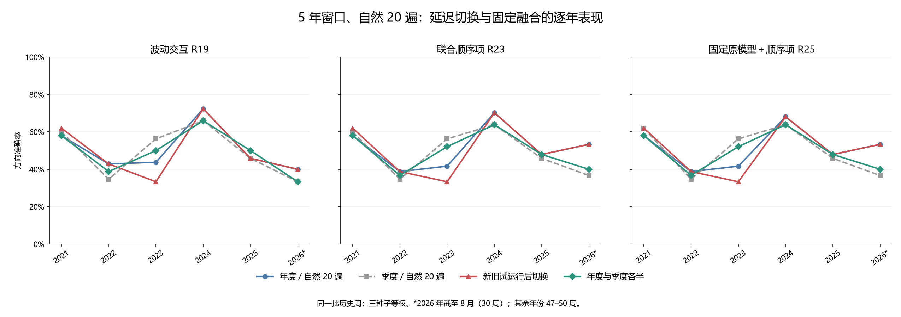

# 第三十一轮：先比较新旧模型，再决定是否替换

固定试运行规则在 11 次不同模型的非年末比较中采用了 3 次候选模型，另有 6 次强制年末重置。其他 6 次非年末检查发生在 3 月末，新旧模型相同。本轮同时检验年度模型与季度模型各占一半的固定融合。

计算与因果时序复核通过。复用 69 个旧神经网络及 276 个分类头，新增训练、分类拟合和神经推理均为 0。所有 272 周历史结果此前已被查看，本轮是历史研究，不是新盲测。文中的“发出预测”指逐期回放中预先指定模型的预测，并非声称存在当年真实运行日志。

## 预先固定的两项政策

试运行政策：每个季度内，旧模型和上个季末训练的新模型并行预测。到本季末，仅取本轮试运行期间双方共同发出、所有标签已成熟的周预测，要求至少 8 周；新模型的平均 Brier 必须严格更低，方向正确周数必须严格更多，才在下一季度接替旧模型。两项指标任一打平都保持原模型。所有方法共享 R19 三种子等权概率的判断，不事后改用表现最好的监测头。

例如，6 月末评估的是 3 月模型在第二季度的预测；通过后第三季度采用 3 月模型。刚在 6 月末训练的模型只进入第三季度试运行，不能直接视为已经通过评估。一次试运行只比较这个季度的固定新旧模型对，其他模型和前轮试运行误差不参与。

年末始终使用新年度模型重置，下一季度的试运行模型与之相同。因此 3 月末没有不同模型可采用；9 月启动的试运行也不能绕过年末强制重置。沿用这个年度规则是与此前方案保持可比的选择，不是本轮发现的最优规则。标签成熟统一要求 joint_completed 不晚于检查日，决策只影响之后的信号，季末当天的信号仍归前一个季度。

固定融合政策：每个信号日取最近的年度模型与最近的季度模型，二者训练截止日都必须严格早于信号日，各占 1/2。先在同一种子内平均概率，再等权平均三个种子；原 MSE 只平均原始收益预测并用零阈值，不构造概率；频率基准按相同权重平均。没有拟合融合权重，也没有根据未来结果切换成分。

8 周是一个季度内的最低共同证据量，使用该季度全部成熟周，未搜索最优周数。双指标门槛针对上一轮概率误差和方向准确率不一致的问题提出；它是研究假设，不是显著性检验，也不保证新模型持续更好。

## 证据与冻结顺序

先冻结协议、全部源码、输入和 4,696 个旧证据文件，再核对 671 个模型周的既有预测覆盖及 16 项合成边界检查。随后做一次逐期回放，冻结新旧预测账本、试运行成员和两种政策的模型来源，再计算汇总指标及下一季度诊断。旧预测、模型和历史报告没有改写。

paired_ledger.csv 记录每周新旧模型及概率；trial_membership.csv 记录实际用于每次检查的成熟周；shadow_routing.csv 记录采用的模型；blend_routing.csv 记录固定融合的两个截止日及权重。融合预测表的 cutoff 仅表示较新的成分训练截止日，不代表单一模型。

## 试运行决策

| 检查日 | 原模型 | 已试运行模型 | 共同成熟周 | 新减旧 Brier | 正确周数增量 | 决定 | 下一季度采用 |
|---|---|---|---|---|---|---|---|
| 2020-12-31 | — | — | 0 | — | 0 | 年末重置 | 2020-12-31 |
| 2021-03-31 | 2020-12-31 | 2020-12-31 | 10 | 0.000000 | 0 | 两者相同 | 2020-12-31 |
| 2021-06-30 | 2020-12-31 | 2021-03-31 | 12 | -0.015557 | -1 | 保持原模型 | 2020-12-31 |
| 2021-09-30 | 2020-12-31 | 2021-06-30 | 12 | -0.006962 | 1 | 采用试运行模型 | 2021-06-30 |
| 2021-12-31 | 2021-06-30 | 2021-09-30 | 11 | — | 0 | 年末重置 | 2021-12-31 |
| 2022-03-31 | 2021-12-31 | 2021-12-31 | 10 | 0.000000 | 0 | 两者相同 | 2021-12-31 |
| 2022-06-30 | 2021-12-31 | 2022-03-31 | 11 | -0.043956 | 0 | 保持原模型 | 2021-12-31 |
| 2022-09-30 | 2021-12-31 | 2022-06-30 | 12 | -0.020816 | -3 | 保持原模型 | 2021-12-31 |
| 2022-12-31 | 2021-12-31 | 2022-09-30 | 10 | — | 0 | 年末重置 | 2022-12-31 |
| 2023-03-31 | 2022-12-31 | 2022-12-31 | 10 | 0.000000 | 0 | 两者相同 | 2022-12-31 |
| 2023-06-30 | 2022-12-31 | 2023-03-31 | 10 | -0.012695 | 1 | 采用试运行模型 | 2023-03-31 |
| 2023-09-30 | 2023-03-31 | 2023-06-30 | 11 | -0.030636 | 2 | 采用试运行模型 | 2023-06-30 |
| 2023-12-31 | 2023-06-30 | 2023-09-30 | 10 | — | 0 | 年末重置 | 2023-12-31 |
| 2024-03-31 | 2023-12-31 | 2023-12-31 | 9 | 0.000000 | 0 | 两者相同 | 2023-12-31 |
| 2024-06-30 | 2023-12-31 | 2024-03-31 | 9 | 0.034056 | -1 | 保持原模型 | 2023-12-31 |
| 2024-09-30 | 2023-12-31 | 2024-06-30 | 12 | 0.012472 | 0 | 保持原模型 | 2023-12-31 |
| 2024-12-31 | 2023-12-31 | 2024-09-30 | 11 | — | 0 | 年末重置 | 2024-12-31 |
| 2025-03-31 | 2024-12-31 | 2024-12-31 | 11 | 0.000000 | 0 | 两者相同 | 2024-12-31 |
| 2025-06-30 | 2024-12-31 | 2025-03-31 | 10 | 0.019874 | -1 | 保持原模型 | 2024-12-31 |
| 2025-09-30 | 2024-12-31 | 2025-06-30 | 12 | -0.011245 | -1 | 保持原模型 | 2024-12-31 |
| 2025-12-31 | 2024-12-31 | 2025-09-30 | 11 | — | 0 | 年末重置 | 2025-12-31 |
| 2026-03-31 | 2025-12-31 | 2025-12-31 | 10 | 0.000000 | 0 | 两者相同 | 2025-12-31 |
| 2026-06-30 | 2025-12-31 | 2026-03-31 | 10 | 0.020524 | -1 | 保持原模型 | 2025-12-31 |

年末行只记录重置，未应用比较门槛；其差值不用于晋升。所有新候选均在检查后开始下一季度试运行。

## 逐期运行时所需训练量

| 政策 | 训练日期数 | 三种子网络数 | 分类头拟合数 | 优化器更新次数 |
|---|---|---|---|---|
| 年度／自然 20 遍 | 6 | 18 | 72 | 3600 |
| 季度／自然 20 遍 | 23 | 69 | 276 | 13800 |
| 市场状态触发 | 8 | 24 | 96 | 4800 |
| 成熟误差触发 | 9 | 27 | 108 | 5400 |
| 新旧试运行后切换 | 23 | 69 | 276 | 13800 |
| 年度与季度各半 | 23 | 69 | 276 | 13800 |

两项新政策都需要完整的季度候选模型，因此与每季度训练的预算相同，即 23 个截止日、69 个网络、276 个分类头及 13,800 次优化器更新。试运行中拒绝某个候选不会退回已发生的训练成本。表中是逐期运行的假设预算，本轮实际新增训练为 0。

## 2021–2023（147 周）

| 政策 | 方法 | 正确/总数 | 准确率 | 平衡准确率 | AUROC | Brier↓ | 对数损失↓ |
|---|---|---|---|---|---|---|---|
| 年度／旧重复量 | 加性 R18 | 65/147 | 44.22% | 46.09% | 0.448008 | 0.309837 | 0.834563 |
| 年度／旧重复量 | 波动交互 R19 | 67/147 | 45.58% | 47.49% | 0.448956 | 0.310966 | 0.838337 |
| 年度／旧重复量 | 联合顺序项 R23 | 68/147 | 46.26% | 47.86% | 0.453700 | 0.311375 | 0.845381 |
| 年度／旧重复量 | 固定原模型＋顺序项 R25 | 69/147 | 46.94% | 48.66% | 0.453700 | 0.310431 | 0.841951 |
| 年度／旧重复量 | 原 MSE | 60/147 | 40.82% | 42.28% | 0.432638 | — | — |
| 年度／旧重复量 | 训练上涨频率 | 62/147 | 42.18% | 50.00% | 0.529412 | 0.256412 | 0.706022 |
| 年度／自然 20 遍 | 加性 R18 | 68/147 | 46.26% | 47.86% | 0.463188 | 0.277344 | 0.751325 |
| 年度／自然 20 遍 | 波动交互 R19 | 71/147 | 48.30% | 50.28% | 0.468121 | 0.277967 | 0.752923 |
| 年度／自然 20 遍 | 联合顺序项 R23 | 68/147 | 46.26% | 48.29% | 0.476850 | 0.276195 | 0.749569 |
| 年度／自然 20 遍 | 固定原模型＋顺序项 R25 | 68/147 | 46.26% | 48.29% | 0.475712 | 0.276108 | 0.749367 |
| 年度／自然 20 遍 | 原 MSE | 73/147 | 49.66% | 51.02% | 0.481025 | — | — |
| 年度／自然 20 遍 | 训练上涨频率 | 62/147 | 42.18% | 50.00% | 0.529412 | 0.256412 | 0.706022 |
| 季度／自然 20 遍 | 加性 R18 | 73/147 | 49.66% | 51.45% | 0.507590 | 0.264364 | 0.723883 |
| 季度／自然 20 遍 | 波动交互 R19 | 74/147 | 50.34% | 52.04% | 0.504175 | 0.264609 | 0.724441 |
| 季度／自然 20 遍 | 联合顺序项 R23 | 74/147 | 50.34% | 51.82% | 0.496395 | 0.265643 | 0.726598 |
| 季度／自然 20 遍 | 固定原模型＋顺序项 R25 | 75/147 | 51.02% | 52.63% | 0.495256 | 0.265518 | 0.726259 |
| 季度／自然 20 遍 | 原 MSE | 68/147 | 46.26% | 48.73% | 0.488615 | — | — |
| 季度／自然 20 遍 | 训练上涨频率 | 62/147 | 42.18% | 50.00% | 0.498008 | 0.255891 | 0.704963 |
| 市场状态触发 | 加性 R18 | 68/147 | 46.26% | 47.86% | 0.463188 | 0.277344 | 0.751325 |
| 市场状态触发 | 波动交互 R19 | 71/147 | 48.30% | 50.28% | 0.468121 | 0.277967 | 0.752923 |
| 市场状态触发 | 联合顺序项 R23 | 68/147 | 46.26% | 48.29% | 0.476850 | 0.276195 | 0.749569 |
| 市场状态触发 | 固定原模型＋顺序项 R25 | 68/147 | 46.26% | 48.29% | 0.475712 | 0.276108 | 0.749367 |
| 市场状态触发 | 原 MSE | 73/147 | 49.66% | 51.02% | 0.481025 | — | — |
| 市场状态触发 | 训练上涨频率 | 62/147 | 42.18% | 50.00% | 0.529412 | 0.256412 | 0.706022 |
| 成熟误差触发 | 加性 R18 | 66/147 | 44.90% | 47.55% | 0.472106 | 0.274054 | 0.743857 |
| 成熟误差触发 | 波动交互 R19 | 66/147 | 44.90% | 47.99% | 0.475901 | 0.274670 | 0.745338 |
| 成熟误差触发 | 联合顺序项 R23 | 67/147 | 45.58% | 48.58% | 0.481214 | 0.274268 | 0.744880 |
| 成熟误差触发 | 固定原模型＋顺序项 R25 | 67/147 | 45.58% | 48.58% | 0.479127 | 0.274242 | 0.744813 |
| 成熟误差触发 | 原 MSE | 70/147 | 47.62% | 49.47% | 0.500380 | — | — |
| 成熟误差触发 | 训练上涨频率 | 62/147 | 42.18% | 50.00% | 0.530076 | 0.256049 | 0.705285 |
| 新旧试运行后切换 | 加性 R18 | 66/147 | 44.90% | 46.90% | 0.457116 | 0.277466 | 0.751109 |
| 新旧试运行后切换 | 波动交互 R19 | 68/147 | 46.26% | 48.51% | 0.459962 | 0.277855 | 0.752026 |
| 新旧试运行后切换 | 联合顺序项 R23 | 66/147 | 44.90% | 47.33% | 0.472486 | 0.275358 | 0.747293 |
| 新旧试运行后切换 | 固定原模型＋顺序项 R25 | 66/147 | 44.90% | 47.33% | 0.470968 | 0.275184 | 0.746850 |
| 新旧试运行后切换 | 原 MSE | 69/147 | 46.94% | 49.10% | 0.473055 | — | — |
| 新旧试运行后切换 | 训练上涨频率 | 62/147 | 42.18% | 50.00% | 0.522486 | 0.256732 | 0.706662 |
| 年度与季度各半 | 加性 R18 | 72/147 | 48.98% | 51.08% | 0.481784 | 0.269164 | 0.733765 |
| 年度与季度各半 | 波动交互 R19 | 72/147 | 48.98% | 51.08% | 0.484630 | 0.269418 | 0.734408 |
| 年度与季度各半 | 联合顺序项 R23 | 72/147 | 48.98% | 51.08% | 0.489564 | 0.268852 | 0.733469 |
| 年度与季度各半 | 固定原模型＋顺序项 R25 | 72/147 | 48.98% | 51.08% | 0.488425 | 0.268785 | 0.733286 |
| 年度与季度各半 | 原 MSE | 74/147 | 50.34% | 51.60% | 0.486907 | — | — |
| 年度与季度各半 | 训练上涨频率 | 62/147 | 42.18% | 50.00% | 0.502562 | 0.256111 | 0.705410 |

## 2024–2026 年 8 月（125 周）

| 政策 | 方法 | 正确/总数 | 准确率 | 平衡准确率 | AUROC | Brier↓ | 对数损失↓ |
|---|---|---|---|---|---|---|---|
| 年度／旧重复量 | 加性 R18 | 71/125 | 56.80% | 57.20% | 0.593734 | 0.255695 | 0.709330 |
| 年度／旧重复量 | 波动交互 R19 | 70/125 | 56.00% | 56.36% | 0.594761 | 0.255385 | 0.708607 |
| 年度／旧重复量 | 联合顺序项 R23 | 72/125 | 57.60% | 57.87% | 0.587571 | 0.257509 | 0.714541 |
| 年度／旧重复量 | 固定原模型＋顺序项 R25 | 73/125 | 58.40% | 58.72% | 0.587314 | 0.257626 | 0.714563 |
| 年度／旧重复量 | 原 MSE | 69/125 | 55.20% | 55.60% | 0.579353 | — | — |
| 年度／旧重复量 | 训练上涨频率 | 56/125 | 44.80% | 45.48% | 0.425526 | 0.252748 | 0.698649 |
| 年度／自然 20 遍 | 加性 R18 | 69/125 | 55.20% | 55.96% | 0.578839 | 0.246152 | 0.685806 |
| 年度／自然 20 遍 | 波动交互 R19 | 68/125 | 54.40% | 55.02% | 0.582435 | 0.246843 | 0.687439 |
| 年度／自然 20 遍 | 联合顺序项 R23 | 72/125 | 57.60% | 58.41% | 0.563174 | 0.249790 | 0.693613 |
| 年度／自然 20 遍 | 固定原模型＋顺序项 R25 | 71/125 | 56.80% | 57.65% | 0.562917 | 0.249824 | 0.693671 |
| 年度／自然 20 遍 | 原 MSE | 66/125 | 52.80% | 53.15% | 0.521315 | — | — |
| 年度／自然 20 遍 | 训练上涨频率 | 56/125 | 44.80% | 45.48% | 0.425526 | 0.252748 | 0.698649 |
| 季度／自然 20 遍 | 加性 R18 | 63/125 | 50.40% | 50.78% | 0.506420 | 0.255872 | 0.705187 |
| 季度／自然 20 遍 | 波动交互 R19 | 63/125 | 50.40% | 50.78% | 0.516949 | 0.254990 | 0.703625 |
| 季度／自然 20 遍 | 联合顺序项 R23 | 63/125 | 50.40% | 50.78% | 0.508988 | 0.256565 | 0.706808 |
| 季度／自然 20 遍 | 固定原模型＋顺序项 R25 | 63/125 | 50.40% | 50.78% | 0.508218 | 0.256537 | 0.706748 |
| 季度／自然 20 遍 | 原 MSE | 68/125 | 54.40% | 55.11% | 0.529533 | — | — |
| 季度／自然 20 遍 | 训练上涨频率 | 60/125 | 48.00% | 50.31% | 0.414355 | 0.252495 | 0.698143 |
| 市场状态触发 | 加性 R18 | 72/125 | 57.60% | 58.14% | 0.596816 | 0.243854 | 0.680943 |
| 市场状态触发 | 波动交互 R19 | 69/125 | 55.20% | 55.51% | 0.592964 | 0.245567 | 0.684795 |
| 市场状态触发 | 联合顺序项 R23 | 71/125 | 56.80% | 57.38% | 0.576271 | 0.248662 | 0.691363 |
| 市场状态触发 | 固定原模型＋顺序项 R25 | 70/125 | 56.00% | 56.63% | 0.575501 | 0.248691 | 0.691414 |
| 市场状态触发 | 原 MSE | 66/125 | 52.80% | 52.79% | 0.555470 | — | — |
| 市场状态触发 | 训练上涨频率 | 56/125 | 44.80% | 45.48% | 0.448639 | 0.252315 | 0.697782 |
| 成熟误差触发 | 加性 R18 | 69/125 | 55.20% | 55.96% | 0.579353 | 0.245435 | 0.684193 |
| 成熟误差触发 | 波动交互 R19 | 67/125 | 53.60% | 54.17% | 0.582691 | 0.245633 | 0.684637 |
| 成熟误差触发 | 联合顺序项 R23 | 72/125 | 57.60% | 58.41% | 0.571392 | 0.248160 | 0.689971 |
| 成熟误差触发 | 固定原模型＋顺序项 R25 | 71/125 | 56.80% | 57.65% | 0.570878 | 0.248182 | 0.690003 |
| 成熟误差触发 | 原 MSE | 61/125 | 48.80% | 49.36% | 0.508218 | — | — |
| 成熟误差触发 | 训练上涨频率 | 56/125 | 44.80% | 45.48% | 0.417052 | 0.252955 | 0.699065 |
| 新旧试运行后切换 | 加性 R18 | 69/125 | 55.20% | 55.96% | 0.578839 | 0.246152 | 0.685806 |
| 新旧试运行后切换 | 波动交互 R19 | 68/125 | 54.40% | 55.02% | 0.582435 | 0.246843 | 0.687439 |
| 新旧试运行后切换 | 联合顺序项 R23 | 72/125 | 57.60% | 58.41% | 0.563174 | 0.249790 | 0.693613 |
| 新旧试运行后切换 | 固定原模型＋顺序项 R25 | 71/125 | 56.80% | 57.65% | 0.562917 | 0.249824 | 0.693671 |
| 新旧试运行后切换 | 原 MSE | 66/125 | 52.80% | 53.15% | 0.521315 | — | — |
| 新旧试运行后切换 | 训练上涨频率 | 56/125 | 44.80% | 45.48% | 0.425526 | 0.252748 | 0.698649 |
| 年度与季度各半 | 加性 R18 | 66/125 | 52.80% | 53.33% | 0.542886 | 0.249814 | 0.692788 |
| 年度与季度各半 | 波动交互 R19 | 65/125 | 52.00% | 52.48% | 0.546225 | 0.249695 | 0.692740 |
| 年度与季度各半 | 联合顺序项 R23 | 65/125 | 52.00% | 52.48% | 0.539548 | 0.251905 | 0.697382 |
| 年度与季度各半 | 固定原模型＋顺序项 R25 | 65/125 | 52.00% | 52.48% | 0.539805 | 0.251920 | 0.697407 |
| 年度与季度各半 | 原 MSE | 70/125 | 56.00% | 56.54% | 0.517720 | — | — |
| 年度与季度各半 | 训练上涨频率 | 60/125 | 48.00% | 50.31% | 0.408192 | 0.252583 | 0.698319 |

## 68 项预设比较

两段时期、两个新政策相对年度与季度方案、各自简单基准，以及两个新政策之间的预设比较共 68 项。统一 Holm 校正后，显著改善 0 项、显著恶化 0 项。

| 时期 | 政策 | 方法 | 参照政策/方法 | 损失 | 差值 | 边际 95% 区间 | 原始 p | Holm p |
|---|---|---|---|---|---|---|---|---|
| 2021–2023 | 新旧试运行后切换 | 波动交互 R19 | 年度／自然 20 遍/波动交互 R19 | direction_error | 0.020408 | [-0.027211, +0.074830] | 0.452355 | 1.000000 |
| 2021–2023 | 新旧试运行后切换 | 波动交互 R19 | 年度／自然 20 遍/波动交互 R19 | brier | -0.000112 | [-0.009914, +0.009889] | 0.981602 | 1.000000 |
| 2021–2023 | 新旧试运行后切换 | 联合顺序项 R23 | 年度／自然 20 遍/联合顺序项 R23 | direction_error | 0.013605 | [-0.027211, +0.061224] | 0.541146 | 1.000000 |
| 2021–2023 | 新旧试运行后切换 | 联合顺序项 R23 | 年度／自然 20 遍/联合顺序项 R23 | brier | -0.000836 | [-0.011909, +0.009320] | 0.869513 | 1.000000 |
| 2021–2023 | 新旧试运行后切换 | 固定原模型＋顺序项 R25 | 年度／自然 20 遍/固定原模型＋顺序项 R25 | direction_error | 0.013605 | [-0.027211, +0.061224] | 0.541146 | 1.000000 |
| 2021–2023 | 新旧试运行后切换 | 固定原模型＋顺序项 R25 | 年度／自然 20 遍/固定原模型＋顺序项 R25 | brier | -0.000924 | [-0.011958, +0.009224] | 0.856914 | 1.000000 |
| 2021–2023 | 新旧试运行后切换 | 波动交互 R19 | 季度／自然 20 遍/波动交互 R19 | direction_error | 0.040816 | [-0.054422, +0.136054] | 0.412659 | 1.000000 |
| 2021–2023 | 新旧试运行后切换 | 波动交互 R19 | 季度／自然 20 遍/波动交互 R19 | brier | 0.013246 | [-0.001816, +0.028552] | 0.088691 | 1.000000 |
| 2021–2023 | 新旧试运行后切换 | 联合顺序项 R23 | 季度／自然 20 遍/联合顺序项 R23 | direction_error | 0.054422 | [-0.040816, +0.149660] | 0.280472 | 1.000000 |
| 2021–2023 | 新旧试运行后切换 | 联合顺序项 R23 | 季度／自然 20 遍/联合顺序项 R23 | brier | 0.009715 | [-0.005870, +0.024183] | 0.203380 | 1.000000 |
| 2021–2023 | 新旧试运行后切换 | 固定原模型＋顺序项 R25 | 季度／自然 20 遍/固定原模型＋顺序项 R25 | direction_error | 0.061224 | [-0.027211, +0.149660] | 0.202180 | 1.000000 |
| 2021–2023 | 新旧试运行后切换 | 固定原模型＋顺序项 R25 | 季度／自然 20 遍/固定原模型＋顺序项 R25 | brier | 0.009667 | [-0.005676, +0.023965] | 0.200080 | 1.000000 |
| 2021–2023 | 新旧试运行后切换 | 波动交互 R19 | 新旧试运行后切换/训练上涨频率 | brier | 0.021123 | [+0.003610, +0.038263] | 0.018198 | 1.000000 |
| 2021–2023 | 新旧试运行后切换 | 波动交互 R19 | 新旧试运行后切换/原 MSE | direction_error | 0.006803 | [-0.054422, +0.068027] | 0.825417 | 1.000000 |
| 2021–2023 | 年度与季度各半 | 波动交互 R19 | 年度／自然 20 遍/波动交互 R19 | direction_error | -0.006803 | [-0.054422, +0.047619] | 0.801920 | 1.000000 |
| 2021–2023 | 年度与季度各半 | 波动交互 R19 | 年度／自然 20 遍/波动交互 R19 | brier | -0.008549 | [-0.015651, -0.002284] | 0.014299 | 0.972303 |
| 2021–2023 | 年度与季度各半 | 联合顺序项 R23 | 年度／自然 20 遍/联合顺序项 R23 | direction_error | -0.027211 | [-0.081633, +0.027211] | 0.316968 | 1.000000 |
| 2021–2023 | 年度与季度各半 | 联合顺序项 R23 | 年度／自然 20 遍/联合顺序项 R23 | brier | -0.007343 | [-0.013689, -0.001478] | 0.018498 | 1.000000 |
| 2021–2023 | 年度与季度各半 | 固定原模型＋顺序项 R25 | 年度／自然 20 遍/固定原模型＋顺序项 R25 | direction_error | -0.027211 | [-0.081633, +0.027211] | 0.316968 | 1.000000 |
| 2021–2023 | 年度与季度各半 | 固定原模型＋顺序项 R25 | 年度／自然 20 遍/固定原模型＋顺序项 R25 | brier | -0.007323 | [-0.013645, -0.001504] | 0.018198 | 1.000000 |
| 2021–2023 | 年度与季度各半 | 波动交互 R19 | 季度／自然 20 遍/波动交互 R19 | direction_error | 0.013605 | [-0.047619, +0.081633] | 0.675832 | 1.000000 |
| 2021–2023 | 年度与季度各半 | 波动交互 R19 | 季度／自然 20 遍/波动交互 R19 | brier | 0.004809 | [-0.001452, +0.011476] | 0.141786 | 1.000000 |
| 2021–2023 | 年度与季度各半 | 联合顺序项 R23 | 季度／自然 20 遍/联合顺序项 R23 | direction_error | 0.013605 | [-0.040816, +0.068027] | 0.648235 | 1.000000 |
| 2021–2023 | 年度与季度各半 | 联合顺序项 R23 | 季度／自然 20 遍/联合顺序项 R23 | brier | 0.003209 | [-0.002788, +0.009370] | 0.305369 | 1.000000 |
| 2021–2023 | 年度与季度各半 | 固定原模型＋顺序项 R25 | 季度／自然 20 遍/固定原模型＋顺序项 R25 | direction_error | 0.020408 | [-0.034014, +0.074830] | 0.492351 | 1.000000 |
| 2021–2023 | 年度与季度各半 | 固定原模型＋顺序项 R25 | 季度／自然 20 遍/固定原模型＋顺序项 R25 | brier | 0.003267 | [-0.002668, +0.009361] | 0.292471 | 1.000000 |
| 2021–2023 | 年度与季度各半 | 波动交互 R19 | 年度与季度各半/训练上涨频率 | brier | 0.013307 | [-0.002739, +0.029603] | 0.104090 | 1.000000 |
| 2021–2023 | 年度与季度各半 | 波动交互 R19 | 年度与季度各半/原 MSE | direction_error | 0.013605 | [-0.061224, +0.088435] | 0.718828 | 1.000000 |
| 2021–2023 | 新旧试运行后切换 | 波动交互 R19 | 年度与季度各半/波动交互 R19 | direction_error | 0.027211 | [-0.054422, +0.108844] | 0.500050 | 1.000000 |
| 2021–2023 | 新旧试运行后切换 | 波动交互 R19 | 年度与季度各半/波动交互 R19 | brier | 0.008437 | [-0.002715, +0.019410] | 0.135786 | 1.000000 |
| 2021–2023 | 新旧试运行后切换 | 联合顺序项 R23 | 年度与季度各半/联合顺序项 R23 | direction_error | 0.040816 | [-0.034014, +0.122449] | 0.308469 | 1.000000 |
| 2021–2023 | 新旧试运行后切换 | 联合顺序项 R23 | 年度与季度各半/联合顺序项 R23 | brier | 0.006507 | [-0.005423, +0.017181] | 0.259874 | 1.000000 |
| 2021–2023 | 新旧试运行后切换 | 固定原模型＋顺序项 R25 | 年度与季度各半/固定原模型＋顺序项 R25 | direction_error | 0.040816 | [-0.034014, +0.122449] | 0.308469 | 1.000000 |
| 2021–2023 | 新旧试运行后切换 | 固定原模型＋顺序项 R25 | 年度与季度各半/固定原模型＋顺序项 R25 | brier | 0.006399 | [-0.005359, +0.016975] | 0.262574 | 1.000000 |
| 2024–2026 年 8 月 | 新旧试运行后切换 | 波动交互 R19 | 年度／自然 20 遍/波动交互 R19 | direction_error | 0.000000 | [+0.000000, +0.000000] | 1.000000 | 1.000000 |
| 2024–2026 年 8 月 | 新旧试运行后切换 | 波动交互 R19 | 年度／自然 20 遍/波动交互 R19 | brier | 0.000000 | [+0.000000, +0.000000] | 1.000000 | 1.000000 |
| 2024–2026 年 8 月 | 新旧试运行后切换 | 联合顺序项 R23 | 年度／自然 20 遍/联合顺序项 R23 | direction_error | 0.000000 | [+0.000000, +0.000000] | 1.000000 | 1.000000 |
| 2024–2026 年 8 月 | 新旧试运行后切换 | 联合顺序项 R23 | 年度／自然 20 遍/联合顺序项 R23 | brier | 0.000000 | [+0.000000, +0.000000] | 1.000000 | 1.000000 |
| 2024–2026 年 8 月 | 新旧试运行后切换 | 固定原模型＋顺序项 R25 | 年度／自然 20 遍/固定原模型＋顺序项 R25 | direction_error | 0.000000 | [+0.000000, +0.000000] | 1.000000 | 1.000000 |
| 2024–2026 年 8 月 | 新旧试运行后切换 | 固定原模型＋顺序项 R25 | 年度／自然 20 遍/固定原模型＋顺序项 R25 | brier | 0.000000 | [+0.000000, +0.000000] | 1.000000 | 1.000000 |
| 2024–2026 年 8 月 | 新旧试运行后切换 | 波动交互 R19 | 季度／自然 20 遍/波动交互 R19 | direction_error | -0.040000 | [-0.104000, +0.024000] | 0.227477 | 1.000000 |
| 2024–2026 年 8 月 | 新旧试运行后切换 | 波动交互 R19 | 季度／自然 20 遍/波动交互 R19 | brier | -0.008147 | [-0.019017, +0.003372] | 0.156884 | 1.000000 |
| 2024–2026 年 8 月 | 新旧试运行后切换 | 联合顺序项 R23 | 季度／自然 20 遍/联合顺序项 R23 | direction_error | -0.072000 | [-0.152000, +0.000000] | 0.075692 | 1.000000 |
| 2024–2026 年 8 月 | 新旧试运行后切换 | 联合顺序项 R23 | 季度／自然 20 遍/联合顺序项 R23 | brier | -0.006775 | [-0.018238, +0.005200] | 0.253375 | 1.000000 |
| 2024–2026 年 8 月 | 新旧试运行后切换 | 固定原模型＋顺序项 R25 | 季度／自然 20 遍/固定原模型＋顺序项 R25 | direction_error | -0.064000 | [-0.144000, +0.008000] | 0.098290 | 1.000000 |
| 2024–2026 年 8 月 | 新旧试运行后切换 | 固定原模型＋顺序项 R25 | 季度／自然 20 遍/固定原模型＋顺序项 R25 | brier | -0.006713 | [-0.018131, +0.005207] | 0.256774 | 1.000000 |
| 2024–2026 年 8 月 | 新旧试运行后切换 | 波动交互 R19 | 新旧试运行后切换/训练上涨频率 | brier | -0.005905 | [-0.021283, +0.010783] | 0.467353 | 1.000000 |
| 2024–2026 年 8 月 | 新旧试运行后切换 | 波动交互 R19 | 新旧试运行后切换/原 MSE | direction_error | -0.016000 | [-0.144000, +0.104000] | 0.798820 | 1.000000 |
| 2024–2026 年 8 月 | 年度与季度各半 | 波动交互 R19 | 年度／自然 20 遍/波动交互 R19 | direction_error | 0.024000 | [-0.032000, +0.080000] | 0.397460 | 1.000000 |
| 2024–2026 年 8 月 | 年度与季度各半 | 波动交互 R19 | 年度／自然 20 遍/波动交互 R19 | brier | 0.002853 | [-0.002876, +0.008148] | 0.306269 | 1.000000 |
| 2024–2026 年 8 月 | 年度与季度各半 | 联合顺序项 R23 | 年度／自然 20 遍/联合顺序项 R23 | direction_error | 0.056000 | [-0.008000, +0.120000] | 0.078392 | 1.000000 |
| 2024–2026 年 8 月 | 年度与季度各半 | 联合顺序项 R23 | 年度／自然 20 遍/联合顺序项 R23 | brier | 0.002115 | [-0.003898, +0.007674] | 0.468953 | 1.000000 |
| 2024–2026 年 8 月 | 年度与季度各半 | 固定原模型＋顺序项 R25 | 年度／自然 20 遍/固定原模型＋顺序项 R25 | direction_error | 0.048000 | [-0.008000, +0.112000] | 0.135186 | 1.000000 |
| 2024–2026 年 8 月 | 年度与季度各半 | 固定原模型＋顺序项 R25 | 年度／自然 20 遍/固定原模型＋顺序项 R25 | brier | 0.002096 | [-0.003892, +0.007637] | 0.471653 | 1.000000 |
| 2024–2026 年 8 月 | 年度与季度各半 | 波动交互 R19 | 季度／自然 20 遍/波动交互 R19 | direction_error | -0.016000 | [-0.056000, +0.016000] | 0.430257 | 1.000000 |
| 2024–2026 年 8 月 | 年度与季度各半 | 波动交互 R19 | 季度／自然 20 遍/波动交互 R19 | brier | -0.005294 | [-0.010911, +0.000517] | 0.072393 | 1.000000 |
| 2024–2026 年 8 月 | 年度与季度各半 | 联合顺序项 R23 | 季度／自然 20 遍/联合顺序项 R23 | direction_error | -0.016000 | [-0.064000, +0.032000] | 0.531447 | 1.000000 |
| 2024–2026 年 8 月 | 年度与季度各半 | 联合顺序项 R23 | 季度／自然 20 遍/联合顺序项 R23 | brier | -0.004660 | [-0.010587, +0.001312] | 0.124388 | 1.000000 |
| 2024–2026 年 8 月 | 年度与季度各半 | 固定原模型＋顺序项 R25 | 季度／自然 20 遍/固定原模型＋顺序项 R25 | direction_error | -0.016000 | [-0.064000, +0.032000] | 0.531447 | 1.000000 |
| 2024–2026 年 8 月 | 年度与季度各半 | 固定原模型＋顺序项 R25 | 季度／自然 20 遍/固定原模型＋顺序项 R25 | brier | -0.004617 | [-0.010543, +0.001337] | 0.126687 | 1.000000 |
| 2024–2026 年 8 月 | 年度与季度各半 | 波动交互 R19 | 年度与季度各半/训练上涨频率 | brier | -0.002888 | [-0.017303, +0.011502] | 0.695630 | 1.000000 |
| 2024–2026 年 8 月 | 年度与季度各半 | 波动交互 R19 | 年度与季度各半/原 MSE | direction_error | 0.040000 | [-0.040000, +0.120000] | 0.333767 | 1.000000 |
| 2024–2026 年 8 月 | 新旧试运行后切换 | 波动交互 R19 | 年度与季度各半/波动交互 R19 | direction_error | -0.024000 | [-0.080000, +0.032000] | 0.397460 | 1.000000 |
| 2024–2026 年 8 月 | 新旧试运行后切换 | 波动交互 R19 | 年度与季度各半/波动交互 R19 | brier | -0.002853 | [-0.008148, +0.002876] | 0.306269 | 1.000000 |
| 2024–2026 年 8 月 | 新旧试运行后切换 | 联合顺序项 R23 | 年度与季度各半/联合顺序项 R23 | direction_error | -0.056000 | [-0.120000, +0.008000] | 0.078392 | 1.000000 |
| 2024–2026 年 8 月 | 新旧试运行后切换 | 联合顺序项 R23 | 年度与季度各半/联合顺序项 R23 | brier | -0.002115 | [-0.007674, +0.003898] | 0.468953 | 1.000000 |
| 2024–2026 年 8 月 | 新旧试运行后切换 | 固定原模型＋顺序项 R25 | 年度与季度各半/固定原模型＋顺序项 R25 | direction_error | -0.048000 | [-0.112000, +0.008000] | 0.135186 | 1.000000 |
| 2024–2026 年 8 月 | 新旧试运行后切换 | 固定原模型＋顺序项 R25 | 年度与季度各半/固定原模型＋顺序项 R25 | brier | -0.002096 | [-0.007637, +0.003892] | 0.471653 | 1.000000 |

负损失差表示候选更好。每段用 10,000 次循环移动区块重采样、每块 8 个有效周观察、种子 20260910；p 为中心化双侧值，区间为边际 95% 区间。本轮多重校正不能消除跨轮历史研究中的选择影响。合并 272 周只作补充描述，状态触发、误差触发和旧训练量年度方案保留为描述性对照。

## 逐年：波动交互 R19

| 年份 | 周数 | 年度／旧重复量 | 年度／自然 20 遍 | 季度／自然 20 遍 | 市场状态触发 | 成熟误差触发 | 新旧试运行后切换 | 年度与季度各半 |
|---|---|---|---|---|---|---|---|---|
| 2021 | 50 | 56.00% | 58.00% | 60.00% | 58.00% | 58.00% | 62.00% | 58.00% |
| 2022 | 49 | 32.65% | 42.86% | 34.69% | 42.86% | 36.73% | 42.86% | 38.78% |
| 2023 | 48 | 47.92% | 43.75% | 56.25% | 43.75% | 39.58% | 33.33% | 50.00% |
| 2024 | 47 | 63.83% | 72.34% | 65.96% | 72.34% | 72.34% | 72.34% | 65.96% |
| 2025 | 48 | 50.00% | 45.83% | 45.83% | 47.92% | 43.75% | 45.83% | 50.00% |
| 2026 | 30 | 53.33% | 40.00% | 33.33% | 40.00% | 40.00% | 40.00% | 33.33% |

## 逐年：联合顺序项 R23

| 年份 | 周数 | 年度／旧重复量 | 年度／自然 20 遍 | 季度／自然 20 遍 | 市场状态触发 | 成熟误差触发 | 新旧试运行后切换 | 年度与季度各半 |
|---|---|---|---|---|---|---|---|---|
| 2021 | 50 | 56.00% | 58.00% | 60.00% | 58.00% | 58.00% | 62.00% | 58.00% |
| 2022 | 49 | 34.69% | 38.78% | 34.69% | 38.78% | 38.78% | 38.78% | 36.73% |
| 2023 | 48 | 47.92% | 41.67% | 56.25% | 41.67% | 39.58% | 33.33% | 52.08% |
| 2024 | 47 | 65.96% | 70.21% | 63.83% | 70.21% | 70.21% | 70.21% | 63.83% |
| 2025 | 48 | 52.08% | 47.92% | 45.83% | 45.83% | 47.92% | 47.92% | 47.92% |
| 2026 | 30 | 53.33% | 53.33% | 36.67% | 53.33% | 53.33% | 53.33% | 40.00% |

## 逐年：固定原模型＋顺序项 R25

| 年份 | 周数 | 年度／旧重复量 | 年度／自然 20 遍 | 季度／自然 20 遍 | 市场状态触发 | 成熟误差触发 | 新旧试运行后切换 | 年度与季度各半 |
|---|---|---|---|---|---|---|---|---|
| 2021 | 50 | 56.00% | 58.00% | 62.00% | 58.00% | 58.00% | 62.00% | 58.00% |
| 2022 | 49 | 34.69% | 38.78% | 34.69% | 38.78% | 38.78% | 38.78% | 36.73% |
| 2023 | 48 | 50.00% | 41.67% | 56.25% | 41.67% | 39.58% | 33.33% | 52.08% |
| 2024 | 47 | 68.09% | 68.09% | 63.83% | 68.09% | 68.09% | 68.09% | 63.83% |
| 2025 | 48 | 52.08% | 47.92% | 45.83% | 45.83% | 47.92% | 47.92% | 47.92% |
| 2026 | 30 | 53.33% | 53.33% | 36.67% | 53.33% | 53.33% | 53.33% | 40.00% |

## 事后诊断：已比较的候选在下一季度如何

下表仅比较 11 次不同模型的非年末检查之后，下一个季度候选与原模型的表现，采用与未采用均列出。它评估试运行效果能否延续，未用于改变任何当期或后续决策，也未据此增加政策或选择最佳季度。

| 检查日 | 当时是否采用 | 下一段周数 | 原模型正确数 | 候选正确数 | 候选减原模型 Brier |
|---|---|---|---|---|---|
| 2021-06-30 | 否 | 13 | 9 | 7 | 0.019117 |
| 2021-09-30 | 是 | 13 | 6 | 8 | -0.053615 |
| 2022-06-30 | 否 | 14 | 7 | 3 | -0.000700 |
| 2022-09-30 | 否 | 12 | 6 | 6 | -0.035739 |
| 2023-06-30 | 是 | 12 | 7 | 4 | 0.027396 |
| 2023-09-30 | 是 | 12 | 7 | 3 | 0.034147 |
| 2024-06-30 | 否 | 13 | 9 | 10 | 0.000109 |
| 2024-09-30 | 否 | 12 | 10 | 6 | 0.008389 |
| 2025-06-30 | 否 | 13 | 6 | 5 | -0.004326 |
| 2025-09-30 | 否 | 12 | 4 | 5 | -0.006684 |
| 2026-06-30 | 否 | 8 | 3 | 3 | 0.001738 |

## 种子稳定性

| 时期 | 政策 | 方法 | 三个种子准确率范围 | 融合准确率 |
|---|---|---|---|---|
| 2021–2023 | 年度与季度各半 | 联合顺序项 R23 | 44.90%–51.02% | 48.98% |
| 2021–2023 | 年度与季度各半 | 固定原模型＋顺序项 R25 | 44.22%–50.34% | 48.98% |
| 2021–2023 | 年度与季度各半 | 波动交互 R19 | 46.26%–51.70% | 48.98% |
| 2021–2023 | 年度／自然 20 遍 | 联合顺序项 R23 | 43.54%–45.58% | 46.26% |
| 2021–2023 | 年度／自然 20 遍 | 固定原模型＋顺序项 R25 | 43.54%–45.58% | 46.26% |
| 2021–2023 | 年度／自然 20 遍 | 波动交互 R19 | 43.54%–45.58% | 48.30% |
| 2021–2023 | 新旧试运行后切换 | 联合顺序项 R23 | 42.86%–48.30% | 44.90% |
| 2021–2023 | 新旧试运行后切换 | 固定原模型＋顺序项 R25 | 42.86%–48.30% | 44.90% |
| 2021–2023 | 新旧试运行后切换 | 波动交互 R19 | 42.86%–47.62% | 46.26% |
| 2024–2026 年 8 月 | 年度与季度各半 | 联合顺序项 R23 | 47.20%–54.40% | 52.00% |
| 2024–2026 年 8 月 | 年度与季度各半 | 固定原模型＋顺序项 R25 | 47.20%–53.60% | 52.00% |
| 2024–2026 年 8 月 | 年度与季度各半 | 波动交互 R19 | 48.80%–56.80% | 52.00% |
| 2024–2026 年 8 月 | 年度／自然 20 遍 | 联合顺序项 R23 | 51.20%–55.20% | 57.60% |
| 2024–2026 年 8 月 | 年度／自然 20 遍 | 固定原模型＋顺序项 R25 | 51.20%–55.20% | 56.80% |
| 2024–2026 年 8 月 | 年度／自然 20 遍 | 波动交互 R19 | 52.80%–54.40% | 54.40% |
| 2024–2026 年 8 月 | 新旧试运行后切换 | 联合顺序项 R23 | 51.20%–55.20% | 57.60% |
| 2024–2026 年 8 月 | 新旧试运行后切换 | 固定原模型＋顺序项 R25 | 51.20%–55.20% | 56.80% |
| 2024–2026 年 8 月 | 新旧试运行后切换 | 波动交互 R19 | 52.80%–54.40% | 54.40% |

全部方法、年度、种子、概率分箱和方向变化见对应 CSV。没有选择最好种子或按结果修改融合规则。

## 复核与限制

69 个旧检查点的模型与优化器状态、来源和训练尺度均已核验。16 项合成检查、17 次未来信息/未发出模型/旧试运行记录扰动检查、272 条配对预测的独立标量回放均通过。固定融合独立代数最大差 0；所有指标、68 项统计比较及 11 项下一季度诊断通过复核。

试运行可以限制未验证的新模型立即接替，但一个季度的证据仍少，且通过评估时模型已经更旧。共同门槛可能错过方向持平而概率更好的候选，也未必适合所有预测头。年末强制重置及共同标签成熟要求会进一步限制响应时机。固定融合则可能稀释较好成分或保留较差成分，不能预先认定其更稳健。

全部结果来自已查看历史；本轮门槛还受到上一轮失败现象的启发。计算可复现、顺序因果并不等于得到新的独立验证。本轮不自动替换研究基线，不据此声称交易收益，之前交互方法和 R25 近期 58.4% 的记录继续保留。

协议 SHA256：`87193d7ee975e98397bd498a3a7a1b828462bbb70053bd956594e5572ba9abbb`
