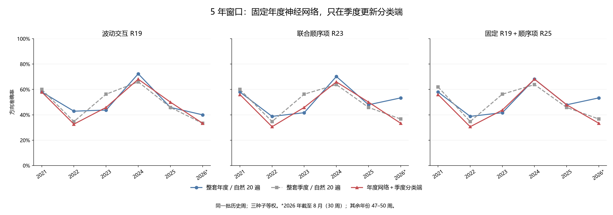

# 第三十二轮：年度神经网络固定，季度重拟合分类端

本轮实际新增 51 组季度分类端训练，共 204 个分类头和 102 个交互残差投影；18 个年度神经网络保持不变，没有新增神经网络训练。年末 72 个分类头及其变换直接复用旧证据。训练、评分和独立复核全部完成。

这是一项对更新层次的拆分研究：与整套年度更新相比，增加季度分类端适应；与整套季度更新相比，保留年度神经网络表征。全部 272 周历史结果此前已被查看，本轮不是新盲测。

## 固定规则与可解释范围

每个信号年固定使用上一年 12 月末训练的五年窗口、自然 20 遍神经网络，网络权重、归一化目标尺度和推理模式不变。每个非年末季末，仅对当时五个自然年锚点窗口内、全部标签已成熟的日观察重拟合分类端。每个种子的神经网络和分类端保持对应，最终概率仍为三种子等权平均。

“分类端”包括 25 个已解码特征与 4 个市场描述的 1/99 截尾和标准化、R18 的监督方向、波动与顺序交互的残差投影、R18/R19/R23 的系数，以及 R25 的单一顺序项系数。R25 保留的是该季度新拟合的 R19 系数，并非一直保留年初 R19。正则化、特征定义和拟合目标保持原配方，没有搜索新的训练窗口、阈值、种子或融合权重。

因此本轮检验整个分类端更新的效果，不能将差异单独归因于某一个系数、缩放或投影。神经特征对部分分类训练样本是训练内表征，与原流程相同；本轮不声称整条流程使用了折外特征。

年末的分类端直接复用年度模型，因此每年第一季度必须与年度方案逐周相同。季度更新只作用于检查日之后的信号，季度末当天仍使用上一季度分类端。标签成熟沿用 joint_completed 口径，收益和辅助目标都必须完成。训练包括所有合格工作日观察，测试仍为相同的周五信号。

原 MSE 对照只使用冻结年度网络的原始收益预测，逐周等于年度对照且没有构造概率。训练频率对照随季度训练样本更新，逐周等于整套季度方案的频率预测。routing.csv 分别记录网络与分类截止日；预测表 cutoff 在学习方法中表示分类端截止日，在原 MSE 中表示年度网络截止日。

## 特征来源与训练顺序

每个年度网络保留其已有训练特征和该年周测试特征的原值；只为缺失的日训练观察补算特征。18 个网络共补算 2490 条特征，建立 25062 条含来源标记的网络特征记录。

特征库包含为计算复用准备的后续样本，不代表当前分类器可用它们。每个拟合接口仅接收本季度成熟训练成员的特征、市场描述、顺序描述和涨跌标签；全部 51 个接口都通过了库内非训练行及未成熟标签扰动检查。来源 0 表示旧年度训练缓存，1 表示旧年度测试缓存，2 表示本轮新推理。缓存是计算角色，不是允许提前使用标签的角色。

先冻结协议、源码、输入和 4,759 个旧证据文件，再检查样本和边界、补齐特征并冻结特征库；随后完成并冻结全部 204 个新分类头，最后进行周评分及统计比较。训练期间没有用周测试表现选择模型。

## 每个季度的样本及来源

| 分类截止日 | 固定网络截止日 | 日训练样本 | 随后周测试数 | 分类端来源 |
|---|---|---|---|---|
| 2020-12-31 | 2020-12-31 | 1212 | 11 | 旧年度复用 |
| 2021-03-31 | 2020-12-31 | 1211 | 13 | 本轮重拟合 |
| 2021-06-30 | 2020-12-31 | 1210 | 13 | 本轮重拟合 |
| 2021-09-30 | 2020-12-31 | 1210 | 13 | 本轮重拟合 |
| 2021-12-31 | 2021-12-31 | 1211 | 11 | 旧年度复用 |
| 2022-03-31 | 2021-12-31 | 1210 | 12 | 本轮重拟合 |
| 2022-06-30 | 2021-12-31 | 1209 | 14 | 本轮重拟合 |
| 2022-09-30 | 2021-12-31 | 1209 | 12 | 本轮重拟合 |
| 2022-12-31 | 2022-12-31 | 1209 | 12 | 旧年度复用 |
| 2023-03-31 | 2022-12-31 | 1209 | 12 | 本轮重拟合 |
| 2023-06-30 | 2022-12-31 | 1208 | 12 | 本轮重拟合 |
| 2023-09-30 | 2022-12-31 | 1208 | 12 | 本轮重拟合 |
| 2023-12-31 | 2023-12-31 | 1208 | 11 | 旧年度复用 |
| 2024-03-31 | 2023-12-31 | 1208 | 11 | 本轮重拟合 |
| 2024-06-30 | 2023-12-31 | 1207 | 13 | 本轮重拟合 |
| 2024-09-30 | 2023-12-31 | 1206 | 12 | 本轮重拟合 |
| 2024-12-31 | 2024-12-31 | 1206 | 12 | 旧年度复用 |
| 2025-03-31 | 2024-12-31 | 1205 | 11 | 本轮重拟合 |
| 2025-06-30 | 2024-12-31 | 1206 | 13 | 本轮重拟合 |
| 2025-09-30 | 2024-12-31 | 1206 | 12 | 本轮重拟合 |
| 2025-12-31 | 2025-12-31 | 1206 | 11 | 旧年度复用 |
| 2026-03-31 | 2025-12-31 | 1204 | 11 | 本轮重拟合 |
| 2026-06-30 | 2025-12-31 | 1204 | 8 | 本轮重拟合 |

五年窗口约束的是训练样本锚点，125 根日线的输入上下文可以早于该窗口下界；这与已有对照一致。

## 逐期运行预算

| 政策 | 参数更新日期数 | 神经网络训练数 | 分类头拟合数 | 神经优化器更新数 |
|---|---|---|---|---|
| 整套年度／自然 20 遍 | 6 | 18 | 72 | 3600 |
| 整套季度／自然 20 遍 | 23 | 69 | 276 | 13800 |
| 市场状态触发 | 8 | 24 | 96 | 4800 |
| 成熟误差触发 | 9 | 27 | 108 | 5400 |
| 新旧试运行后切换 | 23 | 69 | 276 | 13800 |
| 年度与季度各半 | 23 | 69 | 276 | 13800 |
| 年度网络＋季度分类端 | 23 | 18 | 276 | 3600 |

本轮候选逐期运行时需要 6 个年度网络截止日、三种子共 18 个网络，分类端则在 23 个截止日共拟合 276 个头。神经优化器更新 3,600 次，与年度方案相同，少于整套季度的 13,800 次；分类端拟合次数与季度方案相同。特征提取与分类拟合也有成本，这个表不是总耗时或总算力的等价比较。本轮实际仅新增 204 个分类头，未重训这 18 个神经网络。

## 2021–2023（147 周）

| 政策 | 方法 | 正确/总数 | 准确率 | 平衡准确率 | AUROC | Brier↓ | 对数损失↓ |
|---|---|---|---|---|---|---|---|
| 年度／旧重复量 | 加性 R18 | 65/147 | 44.22% | 46.09% | 0.448008 | 0.309837 | 0.834563 |
| 年度／旧重复量 | 波动交互 R19 | 67/147 | 45.58% | 47.49% | 0.448956 | 0.310966 | 0.838337 |
| 年度／旧重复量 | 联合顺序项 R23 | 68/147 | 46.26% | 47.86% | 0.453700 | 0.311375 | 0.845381 |
| 年度／旧重复量 | 固定 R19＋顺序项 R25 | 69/147 | 46.94% | 48.66% | 0.453700 | 0.310431 | 0.841951 |
| 年度／旧重复量 | 原 MSE | 60/147 | 40.82% | 42.28% | 0.432638 | — | — |
| 年度／旧重复量 | 训练上涨频率 | 62/147 | 42.18% | 50.00% | 0.529412 | 0.256412 | 0.706022 |
| 整套年度／自然 20 遍 | 加性 R18 | 68/147 | 46.26% | 47.86% | 0.463188 | 0.277344 | 0.751325 |
| 整套年度／自然 20 遍 | 波动交互 R19 | 71/147 | 48.30% | 50.28% | 0.468121 | 0.277967 | 0.752923 |
| 整套年度／自然 20 遍 | 联合顺序项 R23 | 68/147 | 46.26% | 48.29% | 0.476850 | 0.276195 | 0.749569 |
| 整套年度／自然 20 遍 | 固定 R19＋顺序项 R25 | 68/147 | 46.26% | 48.29% | 0.475712 | 0.276108 | 0.749367 |
| 整套年度／自然 20 遍 | 原 MSE | 73/147 | 49.66% | 51.02% | 0.481025 | — | — |
| 整套年度／自然 20 遍 | 训练上涨频率 | 62/147 | 42.18% | 50.00% | 0.529412 | 0.256412 | 0.706022 |
| 整套季度／自然 20 遍 | 加性 R18 | 73/147 | 49.66% | 51.45% | 0.507590 | 0.264364 | 0.723883 |
| 整套季度／自然 20 遍 | 波动交互 R19 | 74/147 | 50.34% | 52.04% | 0.504175 | 0.264609 | 0.724441 |
| 整套季度／自然 20 遍 | 联合顺序项 R23 | 74/147 | 50.34% | 51.82% | 0.496395 | 0.265643 | 0.726598 |
| 整套季度／自然 20 遍 | 固定 R19＋顺序项 R25 | 75/147 | 51.02% | 52.63% | 0.495256 | 0.265518 | 0.726259 |
| 整套季度／自然 20 遍 | 原 MSE | 68/147 | 46.26% | 48.73% | 0.488615 | — | — |
| 整套季度／自然 20 遍 | 训练上涨频率 | 62/147 | 42.18% | 50.00% | 0.498008 | 0.255891 | 0.704963 |
| 市场状态触发 | 加性 R18 | 68/147 | 46.26% | 47.86% | 0.463188 | 0.277344 | 0.751325 |
| 市场状态触发 | 波动交互 R19 | 71/147 | 48.30% | 50.28% | 0.468121 | 0.277967 | 0.752923 |
| 市场状态触发 | 联合顺序项 R23 | 68/147 | 46.26% | 48.29% | 0.476850 | 0.276195 | 0.749569 |
| 市场状态触发 | 固定 R19＋顺序项 R25 | 68/147 | 46.26% | 48.29% | 0.475712 | 0.276108 | 0.749367 |
| 市场状态触发 | 原 MSE | 73/147 | 49.66% | 51.02% | 0.481025 | — | — |
| 市场状态触发 | 训练上涨频率 | 62/147 | 42.18% | 50.00% | 0.529412 | 0.256412 | 0.706022 |
| 成熟误差触发 | 加性 R18 | 66/147 | 44.90% | 47.55% | 0.472106 | 0.274054 | 0.743857 |
| 成熟误差触发 | 波动交互 R19 | 66/147 | 44.90% | 47.99% | 0.475901 | 0.274670 | 0.745338 |
| 成熟误差触发 | 联合顺序项 R23 | 67/147 | 45.58% | 48.58% | 0.481214 | 0.274268 | 0.744880 |
| 成熟误差触发 | 固定 R19＋顺序项 R25 | 67/147 | 45.58% | 48.58% | 0.479127 | 0.274242 | 0.744813 |
| 成熟误差触发 | 原 MSE | 70/147 | 47.62% | 49.47% | 0.500380 | — | — |
| 成熟误差触发 | 训练上涨频率 | 62/147 | 42.18% | 50.00% | 0.530076 | 0.256049 | 0.705285 |
| 新旧试运行后切换 | 加性 R18 | 66/147 | 44.90% | 46.90% | 0.457116 | 0.277466 | 0.751109 |
| 新旧试运行后切换 | 波动交互 R19 | 68/147 | 46.26% | 48.51% | 0.459962 | 0.277855 | 0.752026 |
| 新旧试运行后切换 | 联合顺序项 R23 | 66/147 | 44.90% | 47.33% | 0.472486 | 0.275358 | 0.747293 |
| 新旧试运行后切换 | 固定 R19＋顺序项 R25 | 66/147 | 44.90% | 47.33% | 0.470968 | 0.275184 | 0.746850 |
| 新旧试运行后切换 | 原 MSE | 69/147 | 46.94% | 49.10% | 0.473055 | — | — |
| 新旧试运行后切换 | 训练上涨频率 | 62/147 | 42.18% | 50.00% | 0.522486 | 0.256732 | 0.706662 |
| 年度与季度各半 | 加性 R18 | 72/147 | 48.98% | 51.08% | 0.481784 | 0.269164 | 0.733765 |
| 年度与季度各半 | 波动交互 R19 | 72/147 | 48.98% | 51.08% | 0.484630 | 0.269418 | 0.734408 |
| 年度与季度各半 | 联合顺序项 R23 | 72/147 | 48.98% | 51.08% | 0.489564 | 0.268852 | 0.733469 |
| 年度与季度各半 | 固定 R19＋顺序项 R25 | 72/147 | 48.98% | 51.08% | 0.488425 | 0.268785 | 0.733286 |
| 年度与季度各半 | 原 MSE | 74/147 | 50.34% | 51.60% | 0.486907 | — | — |
| 年度与季度各半 | 训练上涨频率 | 62/147 | 42.18% | 50.00% | 0.502562 | 0.256111 | 0.705410 |
| 年度网络＋季度分类端 | 加性 R18 | 65/147 | 44.22% | 46.09% | 0.445920 | 0.275376 | 0.745866 |
| 年度网络＋季度分类端 | 波动交互 R19 | 67/147 | 45.58% | 48.14% | 0.456546 | 0.275662 | 0.746719 |
| 年度网络＋季度分类端 | 联合顺序项 R23 | 65/147 | 44.22% | 46.75% | 0.472296 | 0.270726 | 0.736537 |
| 年度网络＋季度分类端 | 固定 R19＋顺序项 R25 | 64/147 | 43.54% | 46.16% | 0.471537 | 0.270748 | 0.736574 |
| 年度网络＋季度分类端 | 原 MSE | 73/147 | 49.66% | 51.02% | 0.481025 | — | — |
| 年度网络＋季度分类端 | 训练上涨频率 | 62/147 | 42.18% | 50.00% | 0.498008 | 0.255891 | 0.704963 |

## 2024–2026 年 8 月（125 周）

| 政策 | 方法 | 正确/总数 | 准确率 | 平衡准确率 | AUROC | Brier↓ | 对数损失↓ |
|---|---|---|---|---|---|---|---|
| 年度／旧重复量 | 加性 R18 | 71/125 | 56.80% | 57.20% | 0.593734 | 0.255695 | 0.709330 |
| 年度／旧重复量 | 波动交互 R19 | 70/125 | 56.00% | 56.36% | 0.594761 | 0.255385 | 0.708607 |
| 年度／旧重复量 | 联合顺序项 R23 | 72/125 | 57.60% | 57.87% | 0.587571 | 0.257509 | 0.714541 |
| 年度／旧重复量 | 固定 R19＋顺序项 R25 | 73/125 | 58.40% | 58.72% | 0.587314 | 0.257626 | 0.714563 |
| 年度／旧重复量 | 原 MSE | 69/125 | 55.20% | 55.60% | 0.579353 | — | — |
| 年度／旧重复量 | 训练上涨频率 | 56/125 | 44.80% | 45.48% | 0.425526 | 0.252748 | 0.698649 |
| 整套年度／自然 20 遍 | 加性 R18 | 69/125 | 55.20% | 55.96% | 0.578839 | 0.246152 | 0.685806 |
| 整套年度／自然 20 遍 | 波动交互 R19 | 68/125 | 54.40% | 55.02% | 0.582435 | 0.246843 | 0.687439 |
| 整套年度／自然 20 遍 | 联合顺序项 R23 | 72/125 | 57.60% | 58.41% | 0.563174 | 0.249790 | 0.693613 |
| 整套年度／自然 20 遍 | 固定 R19＋顺序项 R25 | 71/125 | 56.80% | 57.65% | 0.562917 | 0.249824 | 0.693671 |
| 整套年度／自然 20 遍 | 原 MSE | 66/125 | 52.80% | 53.15% | 0.521315 | — | — |
| 整套年度／自然 20 遍 | 训练上涨频率 | 56/125 | 44.80% | 45.48% | 0.425526 | 0.252748 | 0.698649 |
| 整套季度／自然 20 遍 | 加性 R18 | 63/125 | 50.40% | 50.78% | 0.506420 | 0.255872 | 0.705187 |
| 整套季度／自然 20 遍 | 波动交互 R19 | 63/125 | 50.40% | 50.78% | 0.516949 | 0.254990 | 0.703625 |
| 整套季度／自然 20 遍 | 联合顺序项 R23 | 63/125 | 50.40% | 50.78% | 0.508988 | 0.256565 | 0.706808 |
| 整套季度／自然 20 遍 | 固定 R19＋顺序项 R25 | 63/125 | 50.40% | 50.78% | 0.508218 | 0.256537 | 0.706748 |
| 整套季度／自然 20 遍 | 原 MSE | 68/125 | 54.40% | 55.11% | 0.529533 | — | — |
| 整套季度／自然 20 遍 | 训练上涨频率 | 60/125 | 48.00% | 50.31% | 0.414355 | 0.252495 | 0.698143 |
| 市场状态触发 | 加性 R18 | 72/125 | 57.60% | 58.14% | 0.596816 | 0.243854 | 0.680943 |
| 市场状态触发 | 波动交互 R19 | 69/125 | 55.20% | 55.51% | 0.592964 | 0.245567 | 0.684795 |
| 市场状态触发 | 联合顺序项 R23 | 71/125 | 56.80% | 57.38% | 0.576271 | 0.248662 | 0.691363 |
| 市场状态触发 | 固定 R19＋顺序项 R25 | 70/125 | 56.00% | 56.63% | 0.575501 | 0.248691 | 0.691414 |
| 市场状态触发 | 原 MSE | 66/125 | 52.80% | 52.79% | 0.555470 | — | — |
| 市场状态触发 | 训练上涨频率 | 56/125 | 44.80% | 45.48% | 0.448639 | 0.252315 | 0.697782 |
| 成熟误差触发 | 加性 R18 | 69/125 | 55.20% | 55.96% | 0.579353 | 0.245435 | 0.684193 |
| 成熟误差触发 | 波动交互 R19 | 67/125 | 53.60% | 54.17% | 0.582691 | 0.245633 | 0.684637 |
| 成熟误差触发 | 联合顺序项 R23 | 72/125 | 57.60% | 58.41% | 0.571392 | 0.248160 | 0.689971 |
| 成熟误差触发 | 固定 R19＋顺序项 R25 | 71/125 | 56.80% | 57.65% | 0.570878 | 0.248182 | 0.690003 |
| 成熟误差触发 | 原 MSE | 61/125 | 48.80% | 49.36% | 0.508218 | — | — |
| 成熟误差触发 | 训练上涨频率 | 56/125 | 44.80% | 45.48% | 0.417052 | 0.252955 | 0.699065 |
| 新旧试运行后切换 | 加性 R18 | 69/125 | 55.20% | 55.96% | 0.578839 | 0.246152 | 0.685806 |
| 新旧试运行后切换 | 波动交互 R19 | 68/125 | 54.40% | 55.02% | 0.582435 | 0.246843 | 0.687439 |
| 新旧试运行后切换 | 联合顺序项 R23 | 72/125 | 57.60% | 58.41% | 0.563174 | 0.249790 | 0.693613 |
| 新旧试运行后切换 | 固定 R19＋顺序项 R25 | 71/125 | 56.80% | 57.65% | 0.562917 | 0.249824 | 0.693671 |
| 新旧试运行后切换 | 原 MSE | 66/125 | 52.80% | 53.15% | 0.521315 | — | — |
| 新旧试运行后切换 | 训练上涨频率 | 56/125 | 44.80% | 45.48% | 0.425526 | 0.252748 | 0.698649 |
| 年度与季度各半 | 加性 R18 | 66/125 | 52.80% | 53.33% | 0.542886 | 0.249814 | 0.692788 |
| 年度与季度各半 | 波动交互 R19 | 65/125 | 52.00% | 52.48% | 0.546225 | 0.249695 | 0.692740 |
| 年度与季度各半 | 联合顺序项 R23 | 65/125 | 52.00% | 52.48% | 0.539548 | 0.251905 | 0.697382 |
| 年度与季度各半 | 固定 R19＋顺序项 R25 | 65/125 | 52.00% | 52.48% | 0.539805 | 0.251920 | 0.697407 |
| 年度与季度各半 | 原 MSE | 70/125 | 56.00% | 56.54% | 0.517720 | — | — |
| 年度与季度各半 | 训练上涨频率 | 60/125 | 48.00% | 50.31% | 0.408192 | 0.252583 | 0.698319 |
| 年度网络＋季度分类端 | 加性 R18 | 63/125 | 50.40% | 51.05% | 0.555727 | 0.249342 | 0.692233 |
| 年度网络＋季度分类端 | 波动交互 R19 | 66/125 | 52.80% | 53.51% | 0.561376 | 0.250407 | 0.694725 |
| 年度网络＋季度分类端 | 联合顺序项 R23 | 65/125 | 52.00% | 52.75% | 0.549820 | 0.252458 | 0.698936 |
| 年度网络＋季度分类端 | 固定 R19＋顺序项 R25 | 65/125 | 52.00% | 52.84% | 0.548536 | 0.252474 | 0.698965 |
| 年度网络＋季度分类端 | 原 MSE | 66/125 | 52.80% | 53.15% | 0.521315 | — | — |
| 年度网络＋季度分类端 | 训练上涨频率 | 60/125 | 48.00% | 50.31% | 0.414355 | 0.252495 | 0.698143 |

## 28 项预设比较

两个时期内，三个主配方分别相对整套年度及整套季度比较方向误差和 Brier，并加入 R19 相对本政策频率 Brier 及原 MSE 方向误差，共 28 项。统一 Holm 校正后，显著改善 0 项、显著恶化 0 项。

| 时期 | 方法 | 参照政策/方法 | 损失 | 差值 | 边际 95% 区间 | 原始 p | Holm p |
|---|---|---|---|---|---|---|---|
| 2021–2023 | 波动交互 R19 | 整套年度／自然 20 遍/波动交互 R19 | direction_error | 0.027211 | [-0.027211, +0.088435] | 0.345765 | 1.000000 |
| 2021–2023 | 波动交互 R19 | 整套年度／自然 20 遍/波动交互 R19 | brier | -0.002305 | [-0.011818, +0.006524] | 0.616138 | 1.000000 |
| 2021–2023 | 联合顺序项 R23 | 整套年度／自然 20 遍/联合顺序项 R23 | direction_error | 0.020408 | [-0.040816, +0.081633] | 0.527247 | 1.000000 |
| 2021–2023 | 联合顺序项 R23 | 整套年度／自然 20 遍/联合顺序项 R23 | brier | -0.005469 | [-0.019056, +0.005652] | 0.381262 | 1.000000 |
| 2021–2023 | 固定 R19＋顺序项 R25 | 整套年度／自然 20 遍/固定 R19＋顺序项 R25 | direction_error | 0.027211 | [-0.034014, +0.088435] | 0.366063 | 1.000000 |
| 2021–2023 | 固定 R19＋顺序项 R25 | 整套年度／自然 20 遍/固定 R19＋顺序项 R25 | brier | -0.005360 | [-0.018966, +0.005865] | 0.392161 | 1.000000 |
| 2021–2023 | 波动交互 R19 | 整套季度／自然 20 遍/波动交互 R19 | direction_error | 0.047619 | [-0.013605, +0.108844] | 0.118588 | 1.000000 |
| 2021–2023 | 波动交互 R19 | 整套季度／自然 20 遍/波动交互 R19 | brier | 0.011053 | [+0.002281, +0.019644] | 0.013699 | 0.375162 |
| 2021–2023 | 联合顺序项 R23 | 整套季度／自然 20 遍/联合顺序项 R23 | direction_error | 0.061224 | [+0.000000, +0.129252] | 0.077692 | 1.000000 |
| 2021–2023 | 联合顺序项 R23 | 整套季度／自然 20 遍/联合顺序项 R23 | brier | 0.005083 | [-0.004491, +0.014521] | 0.283872 | 1.000000 |
| 2021–2023 | 固定 R19＋顺序项 R25 | 整套季度／自然 20 遍/固定 R19＋顺序项 R25 | direction_error | 0.074830 | [+0.013605, +0.142857] | 0.032497 | 0.844916 |
| 2021–2023 | 固定 R19＋顺序项 R25 | 整套季度／自然 20 遍/固定 R19＋顺序项 R25 | brier | 0.005230 | [-0.004240, +0.014622] | 0.272073 | 1.000000 |
| 2021–2023 | 波动交互 R19 | 年度网络＋季度分类端/训练上涨频率 | brier | 0.019772 | [+0.003716, +0.034981] | 0.013399 | 0.375162 |
| 2021–2023 | 波动交互 R19 | 年度网络＋季度分类端/原 MSE | direction_error | 0.040816 | [-0.020408, +0.108844] | 0.235576 | 1.000000 |
| 2024–2026 年 8 月 | 波动交互 R19 | 整套年度／自然 20 遍/波动交互 R19 | direction_error | 0.016000 | [-0.032000, +0.072000] | 0.540446 | 1.000000 |
| 2024–2026 年 8 月 | 波动交互 R19 | 整套年度／自然 20 遍/波动交互 R19 | brier | 0.003565 | [-0.000624, +0.008396] | 0.118388 | 1.000000 |
| 2024–2026 年 8 月 | 联合顺序项 R23 | 整套年度／自然 20 遍/联合顺序项 R23 | direction_error | 0.056000 | [-0.008000, +0.128000] | 0.111689 | 1.000000 |
| 2024–2026 年 8 月 | 联合顺序项 R23 | 整套年度／自然 20 遍/联合顺序项 R23 | brier | 0.002667 | [-0.002338, +0.008322] | 0.313469 | 1.000000 |
| 2024–2026 年 8 月 | 固定 R19＋顺序项 R25 | 整套年度／自然 20 遍/固定 R19＋顺序项 R25 | direction_error | 0.048000 | [-0.016000, +0.120000] | 0.178982 | 1.000000 |
| 2024–2026 年 8 月 | 固定 R19＋顺序项 R25 | 整套年度／自然 20 遍/固定 R19＋顺序项 R25 | brier | 0.002650 | [-0.002351, +0.008297] | 0.318268 | 1.000000 |
| 2024–2026 年 8 月 | 波动交互 R19 | 整套季度／自然 20 遍/波动交互 R19 | direction_error | -0.024000 | [-0.096000, +0.040000] | 0.482452 | 1.000000 |
| 2024–2026 年 8 月 | 波动交互 R19 | 整套季度／自然 20 遍/波动交互 R19 | brier | -0.004582 | [-0.014563, +0.006081] | 0.389261 | 1.000000 |
| 2024–2026 年 8 月 | 联合顺序项 R23 | 整套季度／自然 20 遍/联合顺序项 R23 | direction_error | -0.016000 | [-0.072000, +0.032000] | 0.535246 | 1.000000 |
| 2024–2026 年 8 月 | 联合顺序项 R23 | 整套季度／自然 20 遍/联合顺序项 R23 | brier | -0.004107 | [-0.013870, +0.006567] | 0.434957 | 1.000000 |
| 2024–2026 年 8 月 | 固定 R19＋顺序项 R25 | 整套季度／自然 20 遍/固定 R19＋顺序项 R25 | direction_error | -0.016000 | [-0.064000, +0.032000] | 0.499550 | 1.000000 |
| 2024–2026 年 8 月 | 固定 R19＋顺序项 R25 | 整套季度／自然 20 遍/固定 R19＋顺序项 R25 | brier | -0.004063 | [-0.013848, +0.006617] | 0.439056 | 1.000000 |
| 2024–2026 年 8 月 | 波动交互 R19 | 年度网络＋季度分类端/训练上涨频率 | brier | -0.002088 | [-0.018269, +0.015190] | 0.812319 | 1.000000 |
| 2024–2026 年 8 月 | 波动交互 R19 | 年度网络＋季度分类端/原 MSE | direction_error | 0.000000 | [-0.112000, +0.120000] | 1.000000 | 1.000000 |

负损失差表示本轮候选更好。每段采用 10,000 次循环移动区块重采样，每块 8 个有效周观察、种子 20260910；p 为中心化双侧值，区间为边际 95% 区间。校正只覆盖本轮，不能消除跨轮历史试验的选择影响。其他七项旧政策、全部方法、年度和种子均保留，合并 272 周只作补充描述。

## 逐年：波动交互 R19

| 年份 | 周数 | 年度／旧重复量 | 整套年度／自然 20 遍 | 整套季度／自然 20 遍 | 年度网络＋季度分类端 |
|---|---|---|---|---|---|
| 2021 | 50 | 56.00% | 58.00% | 60.00% | 58.00% |
| 2022 | 49 | 32.65% | 42.86% | 34.69% | 32.65% |
| 2023 | 48 | 47.92% | 43.75% | 56.25% | 45.83% |
| 2024 | 47 | 63.83% | 72.34% | 65.96% | 68.09% |
| 2025 | 48 | 50.00% | 45.83% | 45.83% | 50.00% |
| 2026 | 30 | 53.33% | 40.00% | 33.33% | 33.33% |

## 逐年：联合顺序项 R23

| 年份 | 周数 | 年度／旧重复量 | 整套年度／自然 20 遍 | 整套季度／自然 20 遍 | 年度网络＋季度分类端 |
|---|---|---|---|---|---|
| 2021 | 50 | 56.00% | 58.00% | 60.00% | 56.00% |
| 2022 | 49 | 34.69% | 38.78% | 34.69% | 30.61% |
| 2023 | 48 | 47.92% | 41.67% | 56.25% | 45.83% |
| 2024 | 47 | 65.96% | 70.21% | 63.83% | 65.96% |
| 2025 | 48 | 52.08% | 47.92% | 45.83% | 50.00% |
| 2026 | 30 | 53.33% | 53.33% | 36.67% | 33.33% |

## 逐年：固定 R19＋顺序项 R25

| 年份 | 周数 | 年度／旧重复量 | 整套年度／自然 20 遍 | 整套季度／自然 20 遍 | 年度网络＋季度分类端 |
|---|---|---|---|---|---|
| 2021 | 50 | 56.00% | 58.00% | 62.00% | 56.00% |
| 2022 | 49 | 34.69% | 38.78% | 34.69% | 30.61% |
| 2023 | 48 | 50.00% | 41.67% | 56.25% | 43.75% |
| 2024 | 47 | 68.09% | 68.09% | 63.83% | 68.09% |
| 2025 | 48 | 52.08% | 47.92% | 45.83% | 47.92% |
| 2026 | 30 | 53.33% | 53.33% | 36.67% | 33.33% |

## 种子稳定性

| 时期 | 政策 | 方法 | 三种子准确率范围 | 融合准确率 |
|---|---|---|---|---|
| 2021–2023 | 年度网络＋季度分类端 | 联合顺序项 R23 | 41.50%–44.22% | 44.22% |
| 2021–2023 | 年度网络＋季度分类端 | 固定 R19＋顺序项 R25 | 41.50%–44.22% | 43.54% |
| 2021–2023 | 年度网络＋季度分类端 | 波动交互 R19 | 41.50%–44.22% | 45.58% |
| 2021–2023 | 整套年度／自然 20 遍 | 联合顺序项 R23 | 43.54%–45.58% | 46.26% |
| 2021–2023 | 整套年度／自然 20 遍 | 固定 R19＋顺序项 R25 | 43.54%–45.58% | 46.26% |
| 2021–2023 | 整套年度／自然 20 遍 | 波动交互 R19 | 43.54%–45.58% | 48.30% |
| 2021–2023 | 整套季度／自然 20 遍 | 联合顺序项 R23 | 48.98%–50.34% | 50.34% |
| 2021–2023 | 整套季度／自然 20 遍 | 固定 R19＋顺序项 R25 | 48.98%–49.66% | 51.02% |
| 2021–2023 | 整套季度／自然 20 遍 | 波动交互 R19 | 46.94%–51.70% | 50.34% |
| 2024–2026 年 8 月 | 年度网络＋季度分类端 | 联合顺序项 R23 | 52.00%–52.80% | 52.00% |
| 2024–2026 年 8 月 | 年度网络＋季度分类端 | 固定 R19＋顺序项 R25 | 52.00%–52.00% | 52.00% |
| 2024–2026 年 8 月 | 年度网络＋季度分类端 | 波动交互 R19 | 52.00%–55.20% | 52.80% |
| 2024–2026 年 8 月 | 整套年度／自然 20 遍 | 联合顺序项 R23 | 51.20%–55.20% | 57.60% |
| 2024–2026 年 8 月 | 整套年度／自然 20 遍 | 固定 R19＋顺序项 R25 | 51.20%–55.20% | 56.80% |
| 2024–2026 年 8 月 | 整套年度／自然 20 遍 | 波动交互 R19 | 52.80%–54.40% | 54.40% |
| 2024–2026 年 8 月 | 整套季度／自然 20 遍 | 联合顺序项 R23 | 44.00%–56.00% | 50.40% |
| 2024–2026 年 8 月 | 整套季度／自然 20 遍 | 固定 R19＋顺序项 R25 | 44.00%–55.20% | 50.40% |
| 2024–2026 年 8 月 | 整套季度／自然 20 遍 | 波动交互 R19 | 47.20%–53.60% | 50.40% |

全部逐年与逐种子结果、方向改变及概率分箱见对应 CSV。没有改用最好种子或另一套概率融合规则。

## 独立复核

18 组缺失日特征推理按位复现，旧训练/测试特征和网络状态保持不变。51 组训练输入均通过因果成员检查；204 个分类头分别用独立 L-BFGS-B 或 Brent 求根验证，截尾、标准化、监督方向和交互残差投影也逐项重建。测试特征代数最大差 1.78e-15、概率最大差 1.67e-16。

六个年份的第一季度预测逐周等于年度方案；原 MSE 全段逐周等于年度方案，频率基准全段逐周等于季度方案。全部指标、28 项区块重采样及 Holm 校正由独立算术复核，4,759 个旧证据文件保持不变。

计算与因果顺序通过不等于预测优势或交易收益成立。所有历史周已被查看，当前拆分假设又来自此前年度与季度表现的差异，因此还需要与真正后续未查看数据区别对待。本轮不自动替换基线，旧 R25 近期 58.4% 的局部结果及原交互设计继续保留。

协议 SHA256：`de96ebbd3a541ef4f94893b09dfeaf8e5e0eb971848c94e1bc4d1e4ac4df0350`
