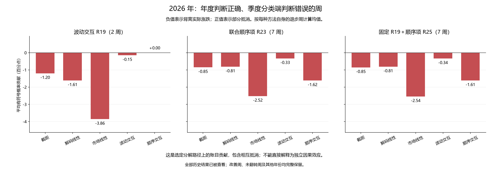

# 第三十三轮：季度分类端为何改变原有判断

本轮完成已有预测的数值贡献分解，没有新增训练、特征推理、候选策略或显著性检验。逐条分析年度分类端与季度分类端在同一个年度神经网络下的预测差异，覆盖全部 272 周、4 个学习方法、3 个种子；2026 年单列全部 30 周及所有改善、恶化的判断。原有准确率没有变化。

本报告中的贡献依赖明确的分组、坐标和分配路径，是既有预测差异的账目分解，不是某个参数的独立因果效应，也不是唯一的特征重要性。训练样本变化可能同时改变多个部分，不能仅凭其中一个系数变大就断言它造成错误。

## 2026 年的预测翻转

| 方法 | 周数 | 年度正确 | 季度分类端正确 | 对→错 | 错→对 | 仍正确 | 仍错误 |
|---|---|---|---|---|---|---|---|
| 加性 R18 | 30 | 14 | 11 | 4 | 1 | 10 | 15 |
| 联合顺序项 R23 | 30 | 16 | 10 | 7 | 1 | 9 | 13 |
| 固定 R19＋顺序项 R25 | 30 | 16 | 10 | 7 | 1 | 9 | 13 |
| 波动交互 R19 | 30 | 12 | 10 | 2 | 0 | 10 | 18 |

正确数的净变化等于“错→对”减“对→错”。各方法的翻转周可能重合，不能把方法间的计数相加解释为独立市场事件。其余未翻转的预测也保留在 all_2026_cases.csv。

## 如何分解

对每个种子分别重建涨跌对数几率：z = 截距 + 25 个解码特征线性项 + 4 个市场描述线性项 + 波动交互项 + 顺序交互项。方法中不存在的交互项记为零。原始神经特征和当日市场描述完全相同，但年度和季度分类端各用自己的缩放、监督方向、残差投影与系数。

每项变化为新贡献减旧贡献。对于乘积 θx，进一步对称拆分：系数部分 = (θ新−θ旧)(x新+x旧)/2，输入变换部分 = (θ新+θ旧)(x新−x旧)/2。二者相加恰好还原 θ新x新−θ旧x旧；截距全记为系数部分。输入变换部分包含缩放/截尾更新，以及交互项中监督方向、投影和残差尺度的更新。

为保留非线性的概率转换，每个种子使用 w = [sigmoid(z新)−sigmoid(z旧)]/(z新−z旧)，把各项对数几率差乘以 w。总差为零时取 sigmoid 导数，近零时使用稳定的等价公式。然后对三个种子的每项概率贡献取平均，得到融合概率的精确差额；没有用 sigmoid(平均 z) 替代原来的平均概率。

独立核验另用 64 点数值积分计算线性路径上 sigmoid 导数的平均值，与上述权重核对。五项概率贡献之和、每项系数和输入变换两部分之和均可还原存档预测，只有浮点舍入差异。该分配是选定线性路径的账目分解，没有进行置换 Shapley 或混合参数的新策略评分。

下面的有符号概率贡献再乘以实际涨跌方向：正值表示朝实际结果移动，负值表示背离实际结果。单位均为概率百分点。实际结果只用于事后解释，不参与重新产生预测。贡献之间可能相互抵消，因此不报告分母接近零的贡献百分比。

## 波动交互 R19：2 个对→错周的平均贡献

| 项 | 总贡献（百分点） | 系数变化部分 | 输入变换部分 | 作为最大不利项的周数 |
|---|---|---|---|---|
| 截距 | -1.20 | -1.20 | +0.00 | 0 |
| 解码线性 | -1.61 | -1.90 | +0.29 | 0 |
| 市场线性 | -3.86 | -3.65 | -0.21 | 2 |
| 波动交互 | -0.15 | -0.95 | +0.80 | 0 |
| 顺序交互 | +0.00 | +0.00 | +0.00 | 0 |

“最大不利项”仅指本轮分解中最负的单项，不能解释为唯一原因或单独改变它就一定能修复预测。系数变化与输入变换的拆分也依赖参数坐标；例如把输入扩大一倍、系数减半，预测可完全不变而两部分互相抵消。

### 波动交互 R19：全部 2026 年翻转周

| 信号日 | 实际 | 变化 | 年度上涨概率 | 季度上涨概率 | 截距 | 解码线性 | 市场线性 | 波动交互 | 顺序交互 | 合计有符号贡献 |
|---|---|---|---|---|---|---|---|---|---|---|
| 2026-08-07 | 跌 | 对→错 | 45.10% | 52.66% | -1.19 | -1.15 | -3.95 | -1.26 | -0.00 | -7.56 |
| 2026-08-14 | 跌 | 对→错 | 48.64% | 54.72% | -1.20 | -2.07 | -3.77 | +0.96 | -0.00 | -6.08 |

## 联合顺序项 R23：7 个对→错周的平均贡献

| 项 | 总贡献（百分点） | 系数变化部分 | 输入变换部分 | 作为最大不利项的周数 |
|---|---|---|---|---|
| 截距 | -0.85 | -0.85 | +0.00 | 0 |
| 解码线性 | -0.81 | -0.94 | +0.13 | 0 |
| 市场线性 | -2.52 | -2.30 | -0.22 | 4 |
| 波动交互 | -0.33 | -0.77 | +0.44 | 0 |
| 顺序交互 | -1.62 | -1.69 | +0.08 | 3 |

“最大不利项”仅指本轮分解中最负的单项，不能解释为唯一原因或单独改变它就一定能修复预测。系数变化与输入变换的拆分也依赖参数坐标；例如把输入扩大一倍、系数减半，预测可完全不变而两部分互相抵消。

### 联合顺序项 R23：全部 2026 年翻转周

| 信号日 | 实际 | 变化 | 年度上涨概率 | 季度上涨概率 | 截距 | 解码线性 | 市场线性 | 波动交互 | 顺序交互 | 合计有符号贡献 |
|---|---|---|---|---|---|---|---|---|---|---|
| 2026-05-08 | 跌 | 对→错 | 49.80% | 51.06% | +0.01 | -0.56 | +1.32 | -0.31 | -1.71 | -1.25 |
| 2026-05-22 | 涨 | 对→错 | 50.51% | 47.83% | -0.01 | -0.87 | -0.06 | +0.10 | -1.83 | -2.67 |
| 2026-07-03 | 跌 | 对→错 | 49.02% | 58.21% | -1.19 | +0.00 | -3.40 | -2.06 | -2.54 | -9.19 |
| 2026-07-10 | 跌 | 对→错 | 48.39% | 55.83% | -1.19 | -1.28 | -2.46 | +0.08 | -2.60 | -7.45 |
| 2026-07-17 | 涨 | 错→对 | 48.32% | 54.61% | +1.20 | -0.89 | +4.10 | +0.24 | +1.64 | +6.29 |
| 2026-07-24 | 跌 | 对→错 | 48.66% | 56.60% | -1.20 | +0.29 | -5.39 | +0.11 | -1.75 | -7.94 |
| 2026-08-07 | 跌 | 对→错 | 42.41% | 51.97% | -1.18 | -1.18 | -3.88 | -1.18 | -2.16 | -9.56 |
| 2026-08-14 | 跌 | 对→错 | 47.91% | 52.75% | -1.20 | -2.10 | -3.78 | +0.96 | +1.29 | -4.84 |

## 固定 R19＋顺序项 R25：7 个对→错周的平均贡献

| 项 | 总贡献（百分点） | 系数变化部分 | 输入变换部分 | 作为最大不利项的周数 |
|---|---|---|---|---|
| 截距 | -0.85 | -0.85 | +0.00 | 0 |
| 解码线性 | -0.81 | -0.94 | +0.12 | 0 |
| 市场线性 | -2.54 | -2.33 | -0.22 | 4 |
| 波动交互 | -0.34 | -0.78 | +0.44 | 0 |
| 顺序交互 | -1.61 | -1.69 | +0.08 | 3 |

“最大不利项”仅指本轮分解中最负的单项，不能解释为唯一原因或单独改变它就一定能修复预测。系数变化与输入变换的拆分也依赖参数坐标；例如把输入扩大一倍、系数减半，预测可完全不变而两部分互相抵消。

### 固定 R19＋顺序项 R25：全部 2026 年翻转周

| 信号日 | 实际 | 变化 | 年度上涨概率 | 季度上涨概率 | 截距 | 解码线性 | 市场线性 | 波动交互 | 顺序交互 | 合计有符号贡献 |
|---|---|---|---|---|---|---|---|---|---|---|
| 2026-05-08 | 跌 | 对→错 | 49.76% | 51.04% | +0.01 | -0.58 | +1.31 | -0.30 | -1.71 | -1.28 |
| 2026-05-22 | 涨 | 对→错 | 50.50% | 47.82% | -0.01 | -0.90 | -0.06 | +0.10 | -1.83 | -2.69 |
| 2026-07-03 | 跌 | 对→错 | 49.00% | 58.23% | -1.20 | +0.04 | -3.44 | -2.09 | -2.54 | -9.23 |
| 2026-07-10 | 跌 | 对→错 | 48.33% | 55.82% | -1.19 | -1.28 | -2.50 | +0.07 | -2.60 | -7.49 |
| 2026-07-17 | 涨 | 错→对 | 48.28% | 54.64% | +1.20 | -0.89 | +4.14 | +0.27 | +1.64 | +6.35 |
| 2026-07-24 | 跌 | 对→错 | 48.60% | 56.60% | -1.20 | +0.28 | -5.42 | +0.09 | -1.75 | -8.00 |
| 2026-08-07 | 跌 | 对→错 | 42.39% | 51.98% | -1.18 | -1.17 | -3.90 | -1.18 | -2.16 | -9.59 |
| 2026-08-14 | 跌 | 对→错 | 47.92% | 52.74% | -1.21 | -2.08 | -3.78 | +0.97 | +1.29 | -4.81 |

## 改善周也完整保留

| 方法 | 错→对周数 | 截距平均贡献 | 解码线性平均贡献 | 市场线性平均贡献 | 波动交互平均贡献 | 顺序交互平均贡献 |
|---|---|---|---|---|---|---|
| 波动交互 R19 | 0 | — | — | — | — | — |
| 联合顺序项 R23 | 1 | +1.20 | -0.89 | +4.10 | +0.24 | +1.64 |
| 固定 R19＋顺序项 R25 | 1 | +1.20 | -0.89 | +4.14 | +0.27 | +1.64 |

没有错→对样本时显示横线，不把缺失均值当作零效应。每一方法的全部稳定正确和稳定错误周也纳入 component_summary.csv，避免仅由新增错误反推结论。

## 训练窗口如何改变

下表逐项核对 2026 年两个季度分类截止日与 2025 年末年度训练样本的差异。新增、移出、保留按样本集合定义；新增可以包含此前日期但标签刚成熟的样本。这里只描述样本变化，没有进行加入/移除某批样本的控制重训，不能确认哪批样本单独造成系数变化。

| 分类截止日 | 年度样本 | 季度样本 | 保留 | 新增 | 移出 | 年度上涨占比 | 季度上涨占比 | 新增样本上涨占比 | 移出样本上涨占比 |
|---|---|---|---|---|---|---|---|---|---|
| 2026-03-31 | 1206 | 1204 | 1148 | 56 | 58 | 47.93% | 47.92% | 44.64% | 44.83% |
| 2026-06-30 | 1206 | 1204 | 1088 | 116 | 118 | 47.93% | 49.09% | 58.62% | 46.61% |

23 个截止日的完整汇总见 training_window_changes.csv，每条保留/新增/移出样本见 training_membership_changes.csv。缩放、截尾、监督方向与投影的变化见 transform_changes.csv；各组系数范数和截距见 parameter_changes.csv。不同坐标与不同维数下的范数不能直接横向当作影响大小。

## 其他年份与两段时期

### 2021–2023

| 方法 | 周数 | 年度准确率 | 季度分类端准确率 | 对→错 | 错→对 | 年度 Brier↓ | 季度分类端 Brier↓ |
|---|---|---|---|---|---|---|---|
| 加性 R18 | 147 | 46.26% | 44.22% | 9 | 6 | 0.277344 | 0.275376 |
| 联合顺序项 R23 | 147 | 46.26% | 44.22% | 12 | 9 | 0.276195 | 0.270726 |
| 固定 R19＋顺序项 R25 | 147 | 46.26% | 43.54% | 13 | 9 | 0.276108 | 0.270748 |
| 波动交互 R19 | 147 | 48.30% | 45.58% | 11 | 7 | 0.277967 | 0.275662 |

### 2024–2026 年 8 月

| 方法 | 周数 | 年度准确率 | 季度分类端准确率 | 对→错 | 错→对 | 年度 Brier↓ | 季度分类端 Brier↓ |
|---|---|---|---|---|---|---|---|
| 加性 R18 | 125 | 55.20% | 50.40% | 10 | 4 | 0.246152 | 0.249342 |
| 联合顺序项 R23 | 125 | 57.60% | 52.00% | 12 | 5 | 0.249790 | 0.252458 |
| 固定 R19＋顺序项 R25 | 125 | 56.80% | 52.00% | 12 | 6 | 0.249824 | 0.252474 |
| 波动交互 R19 | 125 | 54.40% | 52.80% | 7 | 5 | 0.246843 | 0.250407 |

### 2021

| 方法 | 周数 | 年度准确率 | 季度分类端准确率 | 对→错 | 错→对 | 年度 Brier↓ | 季度分类端 Brier↓ |
|---|---|---|---|---|---|---|---|
| 加性 R18 | 50 | 58.00% | 56.00% | 2 | 1 | 0.260946 | 0.256313 |
| 联合顺序项 R23 | 50 | 58.00% | 56.00% | 2 | 1 | 0.264765 | 0.257625 |
| 固定 R19＋顺序项 R25 | 50 | 58.00% | 56.00% | 2 | 1 | 0.264724 | 0.257633 |
| 波动交互 R19 | 50 | 58.00% | 58.00% | 1 | 1 | 0.262638 | 0.257425 |

### 2022

| 方法 | 周数 | 年度准确率 | 季度分类端准确率 | 对→错 | 错→对 | 年度 Brier↓ | 季度分类端 Brier↓ |
|---|---|---|---|---|---|---|---|
| 加性 R18 | 49 | 36.73% | 32.65% | 4 | 2 | 0.305724 | 0.295647 |
| 联合顺序项 R23 | 49 | 38.78% | 30.61% | 6 | 2 | 0.303415 | 0.285385 |
| 固定 R19＋顺序项 R25 | 49 | 38.78% | 30.61% | 6 | 2 | 0.303362 | 0.285278 |
| 波动交互 R19 | 49 | 42.86% | 32.65% | 7 | 2 | 0.306081 | 0.296136 |

### 2023

| 方法 | 周数 | 年度准确率 | 季度分类端准确率 | 对→错 | 错→对 | 年度 Brier↓ | 季度分类端 Brier↓ |
|---|---|---|---|---|---|---|---|
| 加性 R18 | 48 | 43.75% | 43.75% | 3 | 3 | 0.265456 | 0.274540 |
| 联合顺序项 R23 | 48 | 41.67% | 45.83% | 4 | 6 | 0.260313 | 0.269408 |
| 固定 R19＋顺序项 R25 | 48 | 41.67% | 43.75% | 5 | 6 | 0.260144 | 0.269575 |
| 波动交互 R19 | 48 | 43.75% | 45.83% | 3 | 4 | 0.265235 | 0.273759 |

### 2024

| 方法 | 周数 | 年度准确率 | 季度分类端准确率 | 对→错 | 错→对 | 年度 Brier↓ | 季度分类端 Brier↓ |
|---|---|---|---|---|---|---|---|
| 加性 R18 | 47 | 72.34% | 63.83% | 5 | 1 | 0.221353 | 0.221454 |
| 联合顺序项 R23 | 47 | 70.21% | 65.96% | 4 | 2 | 0.231496 | 0.229575 |
| 固定 R19＋顺序项 R25 | 47 | 68.09% | 68.09% | 3 | 3 | 0.231754 | 0.229751 |
| 波动交互 R19 | 47 | 72.34% | 68.09% | 4 | 2 | 0.222808 | 0.223216 |

### 2025

| 方法 | 周数 | 年度准确率 | 季度分类端准确率 | 对→错 | 错→对 | 年度 Brier↓ | 季度分类端 Brier↓ |
|---|---|---|---|---|---|---|---|
| 加性 R18 | 48 | 43.75% | 45.83% | 1 | 2 | 0.263066 | 0.266894 |
| 联合顺序项 R23 | 48 | 47.92% | 50.00% | 1 | 2 | 0.263110 | 0.267226 |
| 固定 R19＋顺序项 R25 | 48 | 47.92% | 47.92% | 2 | 2 | 0.262972 | 0.267111 |
| 波动交互 R19 | 48 | 45.83% | 50.00% | 1 | 3 | 0.263715 | 0.268140 |

### 2026

| 方法 | 周数 | 年度准确率 | 季度分类端准确率 | 对→错 | 错→对 | 年度 Brier↓ | 季度分类端 Brier↓ |
|---|---|---|---|---|---|---|---|
| 加性 R18 | 30 | 46.67% | 36.67% | 4 | 1 | 0.257942 | 0.264951 |
| 联合顺序项 R23 | 30 | 53.33% | 33.33% | 7 | 1 | 0.257140 | 0.264678 |
| 固定 R19＋顺序项 R25 | 30 | 53.33% | 33.33% | 7 | 1 | 0.257098 | 0.264657 |
| 波动交互 R19 | 30 | 40.00% | 33.33% | 2 | 0 | 0.257501 | 0.264634 |

## 复核与用途边界

3,264 组种子周比较、16,320 条分项贡献和 1,088 组融合周比较全部独立复核。标量项差最大 6.66e-16，存档概率差最大 2.22e-16，积分分配差最大 8.08e-15，融合概率求和残差最大 2.91e-16。第一季度所有归因项严格为零。

九项合成检查覆盖加和、系数/输入拆分、相同模型、只改截距、坐标抵消、零/近零差以及平均概率与平均对数几率不等价。训练窗口和汇总计数均核对源文件，4,895 个旧证据文件保持不变。

本轮没有新增统计显著性检验。第 32 轮原有 28 项比较完整保留在 baseline_comparisons.json；其中经多重校正没有显著改善或恶化。本轮寻找某项贡献出现在哪些错误周，不会增加独立验证证据。全部结果来自已查看历史，不能据此筛选后再称为新盲测。

年度基线、R19/R23/R25 交互设计与旧训练重复量 R25 近期 58.4% 的记录继续保留。本轮仅解释预测变化，不自动取消某个特征、改变阈值、冻结部分系数或替换模型。

协议 SHA256：`2fb768f6c80e8403e7f9f649f3dcd8facf4f5d6b1d901a04bdb536ecf0441cfc`
