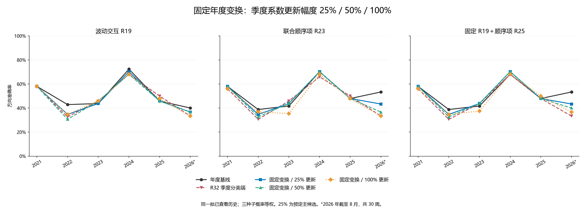

# 第三十四轮：固定年度变换，限制季度系数更新

本轮完成 51 组季度与种子组合的训练，新增 204 个固定坐标下的分类拟合端点，生成 612 个政策系数向量。18 个年度神经网络、年度缩放和交互投影、原始特征缓存保持不变；没有新神经训练或特征推理。主候选 25%，敏感性 50%，固定变换完整系数更新对照 100%，三者均在看到本轮结果之前冻结。

## 更新规则

每个季度使用五个自然年锚点窗口内 joint_completed 不晚于截止日的全部日训练样本。年度神经网络、神经目标尺度、25 个解码特征与 4 个市场描述的截尾和标准化、R18 监督方向、波动与顺序交互的投影及残差尺度，全年保持年度值。新的季度 R18 系数不用于重建交互方向；年度交互在季度样本上不再要求正交，也不重新残差化。

在固定年度坐标上，沿用原 lambda=0.01、斜率惩罚而截距不惩罚的逻辑回归，重拟合 R18、R19、R23。R25 在该季度完整更新的 R19 上拟合单一顺序系数 gamma。然后按 θ(α)=θ年度+α(θ季度完整−θ年度) 更新所有系数，包括截距。每个季度都以同一个年度模型为起点，下一年重置年度起点。

25% 和 50% 是拟合完成后的系数插值，不是分别求解的受约束逻辑回归最优解；系数位移范数在同一坐标下严格缩小到完整位移的对应比例。每个种子的预测等价于先插值新旧 logit，再转换成概率；最后对三个种子概率等权平均。它与新旧概率平均、先平均种子 logit 均不同。

每个更新幅度下，R25 非顺序系数及截距严格等于相同幅度的 R19；gamma 也按该幅度插值，没有在插值后的 R19 上再次求最优 gamma。所有交互结构继续保留。年度基线相当于 α=0；第一季度直接复用年度预测。原 MSE 逐周等于年度基线，训练频率逐周等于完整季度方案。

## 研究口径

同一批 272 个周信号，2021–2023 为 147 周，2024–2026 年 8 月为 125 周。信号日之后的执行周收益方向仍用原定义，严格概率 >0.5 才判涨；种子固定为 20260910、20260911、20260912。全部历史此前已查看，这项实验受到先前归因结果启发，不是新的盲测。

25% 与年度比较检查有限适应，25% 与固定变换 100% 比较检查同一坐标下缩小系数更新的影响；固定变换 100% 与 R32 的差别包括年度截尾、缩放、监督方向及交互投影的整体冻结。不能将结果单独归因于某个市场或顺序系数。主候选始终是预定的 25%，不按本轮结果另选幅度。

## 2021–2023（147 周）

| 政策 | 方法 | 正确/总数 | 准确率 | 平衡准确率 | AUROC | Brier↓ | 对数损失↓ |
|---|---|---|---|---|---|---|---|
| 年度／旧重复量 | 加性 R18 | 65/147 | 44.22% | 46.09% | 0.448008 | 0.309837 | 0.834563 |
| 年度／旧重复量 | 波动交互 R19 | 67/147 | 45.58% | 47.49% | 0.448956 | 0.310966 | 0.838337 |
| 年度／旧重复量 | 联合顺序项 R23 | 68/147 | 46.26% | 47.86% | 0.453700 | 0.311375 | 0.845381 |
| 年度／旧重复量 | 固定 R19＋顺序项 R25 | 69/147 | 46.94% | 48.66% | 0.453700 | 0.310431 | 0.841951 |
| 年度／旧重复量 | 原 MSE | 60/147 | 40.82% | 42.28% | 0.432638 | — | — |
| 年度／旧重复量 | 训练上涨频率 | 62/147 | 42.18% | 50.00% | 0.529412 | 0.256412 | 0.706022 |
| 年度基线 | 加性 R18 | 68/147 | 46.26% | 47.86% | 0.463188 | 0.277344 | 0.751325 |
| 年度基线 | 波动交互 R19 | 71/147 | 48.30% | 50.28% | 0.468121 | 0.277967 | 0.752923 |
| 年度基线 | 联合顺序项 R23 | 68/147 | 46.26% | 48.29% | 0.476850 | 0.276195 | 0.749569 |
| 年度基线 | 固定 R19＋顺序项 R25 | 68/147 | 46.26% | 48.29% | 0.475712 | 0.276108 | 0.749367 |
| 年度基线 | 原 MSE | 73/147 | 49.66% | 51.02% | 0.481025 | — | — |
| 年度基线 | 训练上涨频率 | 62/147 | 42.18% | 50.00% | 0.529412 | 0.256412 | 0.706022 |
| 整套季度 | 加性 R18 | 73/147 | 49.66% | 51.45% | 0.507590 | 0.264364 | 0.723883 |
| 整套季度 | 波动交互 R19 | 74/147 | 50.34% | 52.04% | 0.504175 | 0.264609 | 0.724441 |
| 整套季度 | 联合顺序项 R23 | 74/147 | 50.34% | 51.82% | 0.496395 | 0.265643 | 0.726598 |
| 整套季度 | 固定 R19＋顺序项 R25 | 75/147 | 51.02% | 52.63% | 0.495256 | 0.265518 | 0.726259 |
| 整套季度 | 原 MSE | 68/147 | 46.26% | 48.73% | 0.488615 | — | — |
| 整套季度 | 训练上涨频率 | 62/147 | 42.18% | 50.00% | 0.498008 | 0.255891 | 0.704963 |
| 市场状态触发 | 加性 R18 | 68/147 | 46.26% | 47.86% | 0.463188 | 0.277344 | 0.751325 |
| 市场状态触发 | 波动交互 R19 | 71/147 | 48.30% | 50.28% | 0.468121 | 0.277967 | 0.752923 |
| 市场状态触发 | 联合顺序项 R23 | 68/147 | 46.26% | 48.29% | 0.476850 | 0.276195 | 0.749569 |
| 市场状态触发 | 固定 R19＋顺序项 R25 | 68/147 | 46.26% | 48.29% | 0.475712 | 0.276108 | 0.749367 |
| 市场状态触发 | 原 MSE | 73/147 | 49.66% | 51.02% | 0.481025 | — | — |
| 市场状态触发 | 训练上涨频率 | 62/147 | 42.18% | 50.00% | 0.529412 | 0.256412 | 0.706022 |
| 成熟误差触发 | 加性 R18 | 66/147 | 44.90% | 47.55% | 0.472106 | 0.274054 | 0.743857 |
| 成熟误差触发 | 波动交互 R19 | 66/147 | 44.90% | 47.99% | 0.475901 | 0.274670 | 0.745338 |
| 成熟误差触发 | 联合顺序项 R23 | 67/147 | 45.58% | 48.58% | 0.481214 | 0.274268 | 0.744880 |
| 成熟误差触发 | 固定 R19＋顺序项 R25 | 67/147 | 45.58% | 48.58% | 0.479127 | 0.274242 | 0.744813 |
| 成熟误差触发 | 原 MSE | 70/147 | 47.62% | 49.47% | 0.500380 | — | — |
| 成熟误差触发 | 训练上涨频率 | 62/147 | 42.18% | 50.00% | 0.530076 | 0.256049 | 0.705285 |
| 新旧试运行切换 | 加性 R18 | 66/147 | 44.90% | 46.90% | 0.457116 | 0.277466 | 0.751109 |
| 新旧试运行切换 | 波动交互 R19 | 68/147 | 46.26% | 48.51% | 0.459962 | 0.277855 | 0.752026 |
| 新旧试运行切换 | 联合顺序项 R23 | 66/147 | 44.90% | 47.33% | 0.472486 | 0.275358 | 0.747293 |
| 新旧试运行切换 | 固定 R19＋顺序项 R25 | 66/147 | 44.90% | 47.33% | 0.470968 | 0.275184 | 0.746850 |
| 新旧试运行切换 | 原 MSE | 69/147 | 46.94% | 49.10% | 0.473055 | — | — |
| 新旧试运行切换 | 训练上涨频率 | 62/147 | 42.18% | 50.00% | 0.522486 | 0.256732 | 0.706662 |
| 年度与季度概率各半 | 加性 R18 | 72/147 | 48.98% | 51.08% | 0.481784 | 0.269164 | 0.733765 |
| 年度与季度概率各半 | 波动交互 R19 | 72/147 | 48.98% | 51.08% | 0.484630 | 0.269418 | 0.734408 |
| 年度与季度概率各半 | 联合顺序项 R23 | 72/147 | 48.98% | 51.08% | 0.489564 | 0.268852 | 0.733469 |
| 年度与季度概率各半 | 固定 R19＋顺序项 R25 | 72/147 | 48.98% | 51.08% | 0.488425 | 0.268785 | 0.733286 |
| 年度与季度概率各半 | 原 MSE | 74/147 | 50.34% | 51.60% | 0.486907 | — | — |
| 年度与季度概率各半 | 训练上涨频率 | 62/147 | 42.18% | 50.00% | 0.502562 | 0.256111 | 0.705410 |
| R32 季度分类端 | 加性 R18 | 65/147 | 44.22% | 46.09% | 0.445920 | 0.275376 | 0.745866 |
| R32 季度分类端 | 波动交互 R19 | 67/147 | 45.58% | 48.14% | 0.456546 | 0.275662 | 0.746719 |
| R32 季度分类端 | 联合顺序项 R23 | 65/147 | 44.22% | 46.75% | 0.472296 | 0.270726 | 0.736537 |
| R32 季度分类端 | 固定 R19＋顺序项 R25 | 64/147 | 43.54% | 46.16% | 0.471537 | 0.270748 | 0.736574 |
| R32 季度分类端 | 原 MSE | 73/147 | 49.66% | 51.02% | 0.481025 | — | — |
| R32 季度分类端 | 训练上涨频率 | 62/147 | 42.18% | 50.00% | 0.498008 | 0.255891 | 0.704963 |
| 固定变换／25% 更新 | 加性 R18 | 66/147 | 44.90% | 46.68% | 0.459583 | 0.276651 | 0.749383 |
| 固定变换／25% 更新 | 波动交互 R19 | 67/147 | 45.58% | 47.49% | 0.465085 | 0.277103 | 0.750600 |
| 固定变换／25% 更新 | 联合顺序项 R23 | 67/147 | 45.58% | 47.49% | 0.473055 | 0.274344 | 0.744998 |
| 固定变换／25% 更新 | 固定 R19＋顺序项 R25 | 67/147 | 45.58% | 47.49% | 0.473624 | 0.274168 | 0.744613 |
| 固定变换／25% 更新 | 原 MSE | 73/147 | 49.66% | 51.02% | 0.481025 | — | — |
| 固定变换／25% 更新 | 训练上涨频率 | 62/147 | 42.18% | 50.00% | 0.498008 | 0.255891 | 0.704963 |
| 固定变换／50% 更新 | 加性 R18 | 65/147 | 44.22% | 46.09% | 0.454459 | 0.276094 | 0.747839 |
| 固定变换／50% 更新 | 波动交互 R19 | 66/147 | 44.90% | 47.12% | 0.464516 | 0.276404 | 0.748744 |
| 固定变换／50% 更新 | 联合顺序项 R23 | 66/147 | 44.90% | 47.12% | 0.472676 | 0.272725 | 0.741175 |
| 固定变换／50% 更新 | 固定 R19＋顺序项 R25 | 66/147 | 44.90% | 47.12% | 0.473624 | 0.272481 | 0.740657 |
| 固定变换／50% 更新 | 原 MSE | 73/147 | 49.66% | 51.02% | 0.481025 | — | — |
| 固定变换／50% 更新 | 训练上涨频率 | 62/147 | 42.18% | 50.00% | 0.498008 | 0.255891 | 0.704963 |
| 固定变换／100% 更新 | 加性 R18 | 65/147 | 44.22% | 46.09% | 0.446110 | 0.275430 | 0.745980 |
| 固定变换／100% 更新 | 波动交互 R19 | 68/147 | 46.26% | 48.73% | 0.456357 | 0.275556 | 0.746478 |
| 固定变换／100% 更新 | 联合顺序项 R23 | 63/147 | 42.86% | 45.57% | 0.471347 | 0.270540 | 0.736072 |
| 固定变换／100% 更新 | 固定 R19＋顺序项 R25 | 63/147 | 42.86% | 45.57% | 0.469829 | 0.270237 | 0.735439 |
| 固定变换／100% 更新 | 原 MSE | 73/147 | 49.66% | 51.02% | 0.481025 | — | — |
| 固定变换／100% 更新 | 训练上涨频率 | 62/147 | 42.18% | 50.00% | 0.498008 | 0.255891 | 0.704963 |

## 2024–2026 年 8 月（125 周）

| 政策 | 方法 | 正确/总数 | 准确率 | 平衡准确率 | AUROC | Brier↓ | 对数损失↓ |
|---|---|---|---|---|---|---|---|
| 年度／旧重复量 | 加性 R18 | 71/125 | 56.80% | 57.20% | 0.593734 | 0.255695 | 0.709330 |
| 年度／旧重复量 | 波动交互 R19 | 70/125 | 56.00% | 56.36% | 0.594761 | 0.255385 | 0.708607 |
| 年度／旧重复量 | 联合顺序项 R23 | 72/125 | 57.60% | 57.87% | 0.587571 | 0.257509 | 0.714541 |
| 年度／旧重复量 | 固定 R19＋顺序项 R25 | 73/125 | 58.40% | 58.72% | 0.587314 | 0.257626 | 0.714563 |
| 年度／旧重复量 | 原 MSE | 69/125 | 55.20% | 55.60% | 0.579353 | — | — |
| 年度／旧重复量 | 训练上涨频率 | 56/125 | 44.80% | 45.48% | 0.425526 | 0.252748 | 0.698649 |
| 年度基线 | 加性 R18 | 69/125 | 55.20% | 55.96% | 0.578839 | 0.246152 | 0.685806 |
| 年度基线 | 波动交互 R19 | 68/125 | 54.40% | 55.02% | 0.582435 | 0.246843 | 0.687439 |
| 年度基线 | 联合顺序项 R23 | 72/125 | 57.60% | 58.41% | 0.563174 | 0.249790 | 0.693613 |
| 年度基线 | 固定 R19＋顺序项 R25 | 71/125 | 56.80% | 57.65% | 0.562917 | 0.249824 | 0.693671 |
| 年度基线 | 原 MSE | 66/125 | 52.80% | 53.15% | 0.521315 | — | — |
| 年度基线 | 训练上涨频率 | 56/125 | 44.80% | 45.48% | 0.425526 | 0.252748 | 0.698649 |
| 整套季度 | 加性 R18 | 63/125 | 50.40% | 50.78% | 0.506420 | 0.255872 | 0.705187 |
| 整套季度 | 波动交互 R19 | 63/125 | 50.40% | 50.78% | 0.516949 | 0.254990 | 0.703625 |
| 整套季度 | 联合顺序项 R23 | 63/125 | 50.40% | 50.78% | 0.508988 | 0.256565 | 0.706808 |
| 整套季度 | 固定 R19＋顺序项 R25 | 63/125 | 50.40% | 50.78% | 0.508218 | 0.256537 | 0.706748 |
| 整套季度 | 原 MSE | 68/125 | 54.40% | 55.11% | 0.529533 | — | — |
| 整套季度 | 训练上涨频率 | 60/125 | 48.00% | 50.31% | 0.414355 | 0.252495 | 0.698143 |
| 市场状态触发 | 加性 R18 | 72/125 | 57.60% | 58.14% | 0.596816 | 0.243854 | 0.680943 |
| 市场状态触发 | 波动交互 R19 | 69/125 | 55.20% | 55.51% | 0.592964 | 0.245567 | 0.684795 |
| 市场状态触发 | 联合顺序项 R23 | 71/125 | 56.80% | 57.38% | 0.576271 | 0.248662 | 0.691363 |
| 市场状态触发 | 固定 R19＋顺序项 R25 | 70/125 | 56.00% | 56.63% | 0.575501 | 0.248691 | 0.691414 |
| 市场状态触发 | 原 MSE | 66/125 | 52.80% | 52.79% | 0.555470 | — | — |
| 市场状态触发 | 训练上涨频率 | 56/125 | 44.80% | 45.48% | 0.448639 | 0.252315 | 0.697782 |
| 成熟误差触发 | 加性 R18 | 69/125 | 55.20% | 55.96% | 0.579353 | 0.245435 | 0.684193 |
| 成熟误差触发 | 波动交互 R19 | 67/125 | 53.60% | 54.17% | 0.582691 | 0.245633 | 0.684637 |
| 成熟误差触发 | 联合顺序项 R23 | 72/125 | 57.60% | 58.41% | 0.571392 | 0.248160 | 0.689971 |
| 成熟误差触发 | 固定 R19＋顺序项 R25 | 71/125 | 56.80% | 57.65% | 0.570878 | 0.248182 | 0.690003 |
| 成熟误差触发 | 原 MSE | 61/125 | 48.80% | 49.36% | 0.508218 | — | — |
| 成熟误差触发 | 训练上涨频率 | 56/125 | 44.80% | 45.48% | 0.417052 | 0.252955 | 0.699065 |
| 新旧试运行切换 | 加性 R18 | 69/125 | 55.20% | 55.96% | 0.578839 | 0.246152 | 0.685806 |
| 新旧试运行切换 | 波动交互 R19 | 68/125 | 54.40% | 55.02% | 0.582435 | 0.246843 | 0.687439 |
| 新旧试运行切换 | 联合顺序项 R23 | 72/125 | 57.60% | 58.41% | 0.563174 | 0.249790 | 0.693613 |
| 新旧试运行切换 | 固定 R19＋顺序项 R25 | 71/125 | 56.80% | 57.65% | 0.562917 | 0.249824 | 0.693671 |
| 新旧试运行切换 | 原 MSE | 66/125 | 52.80% | 53.15% | 0.521315 | — | — |
| 新旧试运行切换 | 训练上涨频率 | 56/125 | 44.80% | 45.48% | 0.425526 | 0.252748 | 0.698649 |
| 年度与季度概率各半 | 加性 R18 | 66/125 | 52.80% | 53.33% | 0.542886 | 0.249814 | 0.692788 |
| 年度与季度概率各半 | 波动交互 R19 | 65/125 | 52.00% | 52.48% | 0.546225 | 0.249695 | 0.692740 |
| 年度与季度概率各半 | 联合顺序项 R23 | 65/125 | 52.00% | 52.48% | 0.539548 | 0.251905 | 0.697382 |
| 年度与季度概率各半 | 固定 R19＋顺序项 R25 | 65/125 | 52.00% | 52.48% | 0.539805 | 0.251920 | 0.697407 |
| 年度与季度概率各半 | 原 MSE | 70/125 | 56.00% | 56.54% | 0.517720 | — | — |
| 年度与季度概率各半 | 训练上涨频率 | 60/125 | 48.00% | 50.31% | 0.408192 | 0.252583 | 0.698319 |
| R32 季度分类端 | 加性 R18 | 63/125 | 50.40% | 51.05% | 0.555727 | 0.249342 | 0.692233 |
| R32 季度分类端 | 波动交互 R19 | 66/125 | 52.80% | 53.51% | 0.561376 | 0.250407 | 0.694725 |
| R32 季度分类端 | 联合顺序项 R23 | 65/125 | 52.00% | 52.75% | 0.549820 | 0.252458 | 0.698936 |
| R32 季度分类端 | 固定 R19＋顺序项 R25 | 65/125 | 52.00% | 52.84% | 0.548536 | 0.252474 | 0.698965 |
| R32 季度分类端 | 原 MSE | 66/125 | 52.80% | 53.15% | 0.521315 | — | — |
| R32 季度分类端 | 训练上涨频率 | 60/125 | 48.00% | 50.31% | 0.414355 | 0.252495 | 0.698143 |
| 固定变换／25% 更新 | 加性 R18 | 67/125 | 53.60% | 54.26% | 0.571392 | 0.246830 | 0.687164 |
| 固定变换／25% 更新 | 波动交互 R19 | 66/125 | 52.80% | 53.42% | 0.573960 | 0.247591 | 0.688954 |
| 固定变换／25% 更新 | 联合顺序项 R23 | 69/125 | 55.20% | 55.87% | 0.560092 | 0.250423 | 0.694884 |
| 固定变换／25% 更新 | 固定 R19＋顺序项 R25 | 69/125 | 55.20% | 55.87% | 0.559322 | 0.250492 | 0.695011 |
| 固定变换／25% 更新 | 原 MSE | 66/125 | 52.80% | 53.15% | 0.521315 | — | — |
| 固定变换／25% 更新 | 训练上涨频率 | 60/125 | 48.00% | 50.31% | 0.414355 | 0.252495 | 0.698143 |
| 固定变换／50% 更新 | 加性 R18 | 67/125 | 53.60% | 54.17% | 0.562917 | 0.247590 | 0.688695 |
| 固定变换／50% 更新 | 波动交互 R19 | 65/125 | 52.00% | 52.57% | 0.569081 | 0.248442 | 0.690683 |
| 固定变换／50% 更新 | 联合顺序项 R23 | 67/125 | 53.60% | 54.17% | 0.553416 | 0.251195 | 0.696435 |
| 固定变换／50% 更新 | 固定 R19＋顺序项 R25 | 68/125 | 54.40% | 55.02% | 0.551875 | 0.251302 | 0.696641 |
| 固定变换／50% 更新 | 原 MSE | 66/125 | 52.80% | 53.15% | 0.521315 | — | — |
| 固定变换／50% 更新 | 训练上涨频率 | 60/125 | 48.00% | 50.31% | 0.414355 | 0.252495 | 0.698143 |
| 固定变换／100% 更新 | 加性 R18 | 63/125 | 50.40% | 51.05% | 0.554700 | 0.249356 | 0.692269 |
| 固定变换／100% 更新 | 波动交互 R19 | 65/125 | 52.00% | 52.75% | 0.559322 | 0.250445 | 0.694781 |
| 固定变换／100% 更新 | 联合顺序项 R23 | 65/125 | 52.00% | 52.84% | 0.547252 | 0.253135 | 0.700368 |
| 固定变换／100% 更新 | 固定 R19＋顺序项 R25 | 67/125 | 53.60% | 54.35% | 0.546995 | 0.253329 | 0.700757 |
| 固定变换／100% 更新 | 原 MSE | 66/125 | 52.80% | 53.15% | 0.521315 | — | — |
| 固定变换／100% 更新 | 训练上涨频率 | 60/125 | 48.00% | 50.31% | 0.414355 | 0.252495 | 0.698143 |

## 逐年：波动交互 R19

| 年份 | 周数 | 年度基线 | R32 季度分类端 | 固定变换／25% 更新 | 固定变换／50% 更新 | 固定变换／100% 更新 |
|---|---|---|---|---|---|---|
| 2021 | 50 | 58.00% | 58.00% | 58.00% | 58.00% | 58.00% |
| 2022 | 49 | 42.86% | 32.65% | 34.69% | 30.61% | 34.69% |
| 2023 | 48 | 43.75% | 45.83% | 43.75% | 45.83% | 45.83% |
| 2024 | 47 | 72.34% | 68.09% | 70.21% | 68.09% | 68.09% |
| 2025 | 48 | 45.83% | 50.00% | 45.83% | 45.83% | 47.92% |
| 2026 | 30 | 40.00% | 33.33% | 36.67% | 36.67% | 33.33% |

## 逐年：联合顺序项 R23

| 年份 | 周数 | 年度基线 | R32 季度分类端 | 固定变换／25% 更新 | 固定变换／50% 更新 | 固定变换／100% 更新 |
|---|---|---|---|---|---|---|
| 2021 | 50 | 58.00% | 56.00% | 58.00% | 58.00% | 56.00% |
| 2022 | 49 | 38.78% | 30.61% | 34.69% | 32.65% | 36.73% |
| 2023 | 48 | 41.67% | 45.83% | 43.75% | 43.75% | 35.42% |
| 2024 | 47 | 70.21% | 65.96% | 70.21% | 70.21% | 68.09% |
| 2025 | 48 | 47.92% | 50.00% | 47.92% | 47.92% | 47.92% |
| 2026 | 30 | 53.33% | 33.33% | 43.33% | 36.67% | 33.33% |

## 逐年：固定 R19＋顺序项 R25

| 年份 | 周数 | 年度基线 | R32 季度分类端 | 固定变换／25% 更新 | 固定变换／50% 更新 | 固定变换／100% 更新 |
|---|---|---|---|---|---|---|
| 2021 | 50 | 58.00% | 56.00% | 58.00% | 58.00% | 56.00% |
| 2022 | 49 | 38.78% | 30.61% | 34.69% | 32.65% | 34.69% |
| 2023 | 48 | 41.67% | 43.75% | 43.75% | 43.75% | 37.50% |
| 2024 | 47 | 68.09% | 68.09% | 70.21% | 70.21% | 68.09% |
| 2025 | 48 | 47.92% | 47.92% | 47.92% | 47.92% | 50.00% |
| 2026 | 30 | 53.33% | 33.33% | 43.33% | 40.00% | 36.67% |

## 2026 年相对年度的方向翻转

| 政策 | 方法 | 从对变错 | 从错变对 |
|---|---|---|---|
| 固定变换／25% 更新 | 波动交互 R19 | 1 | 0 |
| 固定变换／25% 更新 | 联合顺序项 R23 | 3 | 0 |
| 固定变换／25% 更新 | 固定 R19＋顺序项 R25 | 3 | 0 |
| 固定变换／50% 更新 | 波动交互 R19 | 1 | 0 |
| 固定变换／50% 更新 | 联合顺序项 R23 | 6 | 1 |
| 固定变换／50% 更新 | 固定 R19＋顺序项 R25 | 5 | 1 |
| 固定变换／100% 更新 | 波动交互 R19 | 2 | 0 |
| 固定变换／100% 更新 | 联合顺序项 R23 | 7 | 1 |
| 固定变换／100% 更新 | 固定 R19＋顺序项 R25 | 7 | 2 |

完整各年翻转见 direction_flips.csv，不仅记录先前 7 个退步周。2026 年只有 30 个周信号，1 周对应约 3.33 个准确率百分点。

## 60 项预设比较

两个时期内，三个幅度、三个主方法的方向误差和 Brier 分别对年度比较；另加主候选 25% 相对固定变换 100% 和 R32 的比较，共 60 项统一 Holm 校正。显著改善 0 项、显著恶化 0 项。

| 时期 | 候选 | 方法 | 参照 | 损失 | 差值 | 边际 95% 区间 | 原始 p | Holm p |
|---|---|---|---|---|---|---|---|---|
| 2021–2023 | 固定变换／25% 更新 | 波动交互 R19 | 年度基线 | direction_error | 0.027211 | [+0.006803, +0.054422] | 0.031897 | 1.000000 |
| 2021–2023 | 固定变换／25% 更新 | 波动交互 R19 | 年度基线 | brier | -0.000864 | [-0.003270, +0.001308] | 0.452855 | 1.000000 |
| 2021–2023 | 固定变换／25% 更新 | 联合顺序项 R23 | 年度基线 | direction_error | 0.006803 | [-0.020408, +0.034014] | 0.675832 | 1.000000 |
| 2021–2023 | 固定变换／25% 更新 | 联合顺序项 R23 | 年度基线 | brier | -0.001850 | [-0.005662, +0.001115] | 0.282972 | 1.000000 |
| 2021–2023 | 固定变换／25% 更新 | 固定 R19＋顺序项 R25 | 年度基线 | direction_error | 0.006803 | [-0.020408, +0.034014] | 0.675832 | 1.000000 |
| 2021–2023 | 固定变换／25% 更新 | 固定 R19＋顺序项 R25 | 年度基线 | brier | -0.001940 | [-0.005815, +0.001102] | 0.267973 | 1.000000 |
| 2021–2023 | 固定变换／50% 更新 | 波动交互 R19 | 年度基线 | direction_error | 0.034014 | [-0.006803, +0.081633] | 0.146485 | 1.000000 |
| 2021–2023 | 固定变换／50% 更新 | 波动交互 R19 | 年度基线 | brier | -0.001563 | [-0.006450, +0.002878] | 0.501050 | 1.000000 |
| 2021–2023 | 固定变换／50% 更新 | 联合顺序项 R23 | 年度基线 | direction_error | 0.013605 | [-0.013605, +0.047619] | 0.412959 | 1.000000 |
| 2021–2023 | 固定变换／50% 更新 | 联合顺序项 R23 | 年度基线 | brier | -0.003469 | [-0.011088, +0.002543] | 0.315068 | 1.000000 |
| 2021–2023 | 固定变换／50% 更新 | 固定 R19＋顺序项 R25 | 年度基线 | direction_error | 0.013605 | [-0.013605, +0.047619] | 0.412959 | 1.000000 |
| 2021–2023 | 固定变换／50% 更新 | 固定 R19＋顺序项 R25 | 年度基线 | brier | -0.003627 | [-0.011389, +0.002547] | 0.301370 | 1.000000 |
| 2021–2023 | 固定变换／100% 更新 | 波动交互 R19 | 年度基线 | direction_error | 0.020408 | [-0.027211, +0.074830] | 0.478752 | 1.000000 |
| 2021–2023 | 固定变换／100% 更新 | 波动交互 R19 | 年度基线 | brier | -0.002411 | [-0.012267, +0.006778] | 0.610239 | 1.000000 |
| 2021–2023 | 固定变换／100% 更新 | 联合顺序项 R23 | 年度基线 | direction_error | 0.034014 | [-0.020408, +0.095238] | 0.247975 | 1.000000 |
| 2021–2023 | 固定变换／100% 更新 | 联合顺序项 R23 | 年度基线 | brier | -0.005655 | [-0.020194, +0.006344] | 0.397960 | 1.000000 |
| 2021–2023 | 固定变换／100% 更新 | 固定 R19＋顺序项 R25 | 年度基线 | direction_error | 0.034014 | [-0.020408, +0.102041] | 0.285071 | 1.000000 |
| 2021–2023 | 固定变换／100% 更新 | 固定 R19＋顺序项 R25 | 年度基线 | brier | -0.005871 | [-0.020625, +0.006441] | 0.389561 | 1.000000 |
| 2021–2023 | 固定变换／25% 更新 | 波动交互 R19 | 固定变换／100% 更新 | direction_error | 0.006803 | [-0.040816, +0.047619] | 0.769823 | 1.000000 |
| 2021–2023 | 固定变换／25% 更新 | 波动交互 R19 | 固定变换／100% 更新 | brier | 0.001547 | [-0.005476, +0.009014] | 0.666733 | 1.000000 |
| 2021–2023 | 固定变换／25% 更新 | 联合顺序项 R23 | 固定变换／100% 更新 | direction_error | -0.027211 | [-0.088435, +0.027211] | 0.352565 | 1.000000 |
| 2021–2023 | 固定变换／25% 更新 | 联合顺序项 R23 | 固定变换／100% 更新 | brier | 0.003804 | [-0.005208, +0.014555] | 0.444256 | 1.000000 |
| 2021–2023 | 固定变换／25% 更新 | 固定 R19＋顺序项 R25 | 固定变换／100% 更新 | direction_error | -0.027211 | [-0.088435, +0.027211] | 0.371563 | 1.000000 |
| 2021–2023 | 固定变换／25% 更新 | 固定 R19＋顺序项 R25 | 固定变换／100% 更新 | brier | 0.003930 | [-0.005365, +0.014827] | 0.434857 | 1.000000 |
| 2021–2023 | 固定变换／25% 更新 | 波动交互 R19 | R32 季度分类端 | direction_error | 0.000000 | [-0.047619, +0.040816] | 1.000000 | 1.000000 |
| 2021–2023 | 固定变换／25% 更新 | 波动交互 R19 | R32 季度分类端 | brier | 0.001441 | [-0.005222, +0.008570] | 0.675332 | 1.000000 |
| 2021–2023 | 固定变换／25% 更新 | 联合顺序项 R23 | R32 季度分类端 | direction_error | -0.013605 | [-0.068027, +0.040816] | 0.630837 | 1.000000 |
| 2021–2023 | 固定变换／25% 更新 | 联合顺序项 R23 | R32 季度分类端 | brier | 0.003619 | [-0.004566, +0.013374] | 0.423758 | 1.000000 |
| 2021–2023 | 固定变换／25% 更新 | 固定 R19＋顺序项 R25 | R32 季度分类端 | direction_error | -0.020408 | [-0.074830, +0.034014] | 0.500250 | 1.000000 |
| 2021–2023 | 固定变换／25% 更新 | 固定 R19＋顺序项 R25 | R32 季度分类端 | brier | 0.003420 | [-0.004716, +0.013181] | 0.452255 | 1.000000 |
| 2024–2026 年 8 月 | 固定变换／25% 更新 | 波动交互 R19 | 年度基线 | direction_error | 0.016000 | [+0.000000, +0.040000] | 0.177982 | 1.000000 |
| 2024–2026 年 8 月 | 固定变换／25% 更新 | 波动交互 R19 | 年度基线 | brier | 0.000748 | [-0.000284, +0.001930] | 0.184282 | 1.000000 |
| 2024–2026 年 8 月 | 固定变换／25% 更新 | 联合顺序项 R23 | 年度基线 | direction_error | 0.024000 | [+0.000000, +0.072000] | 0.333767 | 1.000000 |
| 2024–2026 年 8 月 | 固定变换／25% 更新 | 联合顺序项 R23 | 年度基线 | brier | 0.000633 | [-0.000597, +0.001968] | 0.323368 | 1.000000 |
| 2024–2026 年 8 月 | 固定变换／25% 更新 | 固定 R19＋顺序项 R25 | 年度基线 | direction_error | 0.016000 | [-0.016000, +0.072000] | 0.534947 | 1.000000 |
| 2024–2026 年 8 月 | 固定变换／25% 更新 | 固定 R19＋顺序项 R25 | 年度基线 | brier | 0.000668 | [-0.000545, +0.001993] | 0.292471 | 1.000000 |
| 2024–2026 年 8 月 | 固定变换／50% 更新 | 波动交互 R19 | 年度基线 | direction_error | 0.024000 | [+0.000000, +0.056000] | 0.131587 | 1.000000 |
| 2024–2026 年 8 月 | 固定变换／50% 更新 | 波动交互 R19 | 年度基线 | brier | 0.001599 | [-0.000483, +0.004010] | 0.163484 | 1.000000 |
| 2024–2026 年 8 月 | 固定变换／50% 更新 | 联合顺序项 R23 | 年度基线 | direction_error | 0.040000 | [+0.000000, +0.096000] | 0.099590 | 1.000000 |
| 2024–2026 年 8 月 | 固定变换／50% 更新 | 联合顺序项 R23 | 年度基线 | brier | 0.001405 | [-0.001077, +0.004151] | 0.280072 | 1.000000 |
| 2024–2026 年 8 月 | 固定变换／50% 更新 | 固定 R19＋顺序项 R25 | 年度基线 | direction_error | 0.024000 | [-0.016000, +0.072000] | 0.318668 | 1.000000 |
| 2024–2026 年 8 月 | 固定变换／50% 更新 | 固定 R19＋顺序项 R25 | 年度基线 | brier | 0.001478 | [-0.000987, +0.004192] | 0.254275 | 1.000000 |
| 2024–2026 年 8 月 | 固定变换／100% 更新 | 波动交互 R19 | 年度基线 | direction_error | 0.024000 | [-0.024000, +0.080000] | 0.348865 | 1.000000 |
| 2024–2026 年 8 月 | 固定变换／100% 更新 | 波动交互 R19 | 年度基线 | brier | 0.003602 | [-0.000654, +0.008631] | 0.126487 | 1.000000 |
| 2024–2026 年 8 月 | 固定变换／100% 更新 | 联合顺序项 R23 | 年度基线 | direction_error | 0.056000 | [-0.008000, +0.128000] | 0.113089 | 1.000000 |
| 2024–2026 年 8 月 | 固定变换／100% 更新 | 联合顺序项 R23 | 年度基线 | brier | 0.003345 | [-0.001759, +0.009125] | 0.219878 | 1.000000 |
| 2024–2026 年 8 月 | 固定变换／100% 更新 | 固定 R19＋顺序项 R25 | 年度基线 | direction_error | 0.032000 | [-0.024000, +0.096000] | 0.288871 | 1.000000 |
| 2024–2026 年 8 月 | 固定变换／100% 更新 | 固定 R19＋顺序项 R25 | 年度基线 | brier | 0.003505 | [-0.001565, +0.009198] | 0.196380 | 1.000000 |
| 2024–2026 年 8 月 | 固定变换／25% 更新 | 波动交互 R19 | 固定变换／100% 更新 | direction_error | -0.008000 | [-0.048000, +0.032000] | 0.669933 | 1.000000 |
| 2024–2026 年 8 月 | 固定变换／25% 更新 | 波动交互 R19 | 固定变换／100% 更新 | brier | -0.002854 | [-0.006704, +0.000373] | 0.113789 | 1.000000 |
| 2024–2026 年 8 月 | 固定变换／25% 更新 | 联合顺序项 R23 | 固定变换／100% 更新 | direction_error | -0.032000 | [-0.088000, +0.016000] | 0.248975 | 1.000000 |
| 2024–2026 年 8 月 | 固定变换／25% 更新 | 联合顺序项 R23 | 固定变换／100% 更新 | brier | -0.002712 | [-0.007144, +0.001148] | 0.194181 | 1.000000 |
| 2024–2026 年 8 月 | 固定变换／25% 更新 | 固定 R19＋顺序项 R25 | 固定变换／100% 更新 | direction_error | -0.016000 | [-0.064000, +0.032000] | 0.517948 | 1.000000 |
| 2024–2026 年 8 月 | 固定变换／25% 更新 | 固定 R19＋顺序项 R25 | 固定变换／100% 更新 | brier | -0.002837 | [-0.007231, +0.001005] | 0.171983 | 1.000000 |
| 2024–2026 年 8 月 | 固定变换／25% 更新 | 波动交互 R19 | R32 季度分类端 | direction_error | 0.000000 | [-0.032000, +0.032000] | 1.000000 | 1.000000 |
| 2024–2026 年 8 月 | 固定变换／25% 更新 | 波动交互 R19 | R32 季度分类端 | brier | -0.002816 | [-0.006478, +0.000346] | 0.103590 | 1.000000 |
| 2024–2026 年 8 月 | 固定变换／25% 更新 | 联合顺序项 R23 | R32 季度分类端 | direction_error | -0.032000 | [-0.088000, +0.016000] | 0.246075 | 1.000000 |
| 2024–2026 年 8 月 | 固定变换／25% 更新 | 联合顺序项 R23 | R32 季度分类端 | brier | -0.002034 | [-0.006356, +0.001772] | 0.319068 | 1.000000 |
| 2024–2026 年 8 月 | 固定变换／25% 更新 | 固定 R19＋顺序项 R25 | R32 季度分类端 | direction_error | -0.032000 | [-0.088000, +0.016000] | 0.248975 | 1.000000 |
| 2024–2026 年 8 月 | 固定变换／25% 更新 | 固定 R19＋顺序项 R25 | R32 季度分类端 | brier | -0.001982 | [-0.006327, +0.001858] | 0.333667 | 1.000000 |

负损失差表示候选更好。沿用 10,000 次循环区块重采样，每块 8 个有效周观察，种子 20260910；中心化双侧 p 和边际 95% 区间。校正仅覆盖本轮 60 项，不能消除跨轮反复查看历史的影响。原 R32 的 28 项比较原样保存在 baseline_comparisons.json。

## 种子稳定性

| 时期 | 政策 | 方法 | 三种子准确率范围 | 融合准确率 |
|---|---|---|---|---|
| 2021–2023 | R32 季度分类端 | 联合顺序项 R23 | 41.50%–44.22% | 44.22% |
| 2021–2023 | R32 季度分类端 | 固定 R19＋顺序项 R25 | 41.50%–44.22% | 43.54% |
| 2021–2023 | R32 季度分类端 | 波动交互 R19 | 41.50%–44.22% | 45.58% |
| 2021–2023 | 固定变换／100% 更新 | 联合顺序项 R23 | 40.14%–44.90% | 42.86% |
| 2021–2023 | 固定变换／100% 更新 | 固定 R19＋顺序项 R25 | 40.14%–43.54% | 42.86% |
| 2021–2023 | 固定变换／100% 更新 | 波动交互 R19 | 42.18%–45.58% | 46.26% |
| 2021–2023 | 固定变换／25% 更新 | 联合顺序项 R23 | 42.18%–44.22% | 45.58% |
| 2021–2023 | 固定变换／25% 更新 | 固定 R19＋顺序项 R25 | 42.18%–44.22% | 45.58% |
| 2021–2023 | 固定变换／25% 更新 | 波动交互 R19 | 43.54%–44.90% | 45.58% |
| 2021–2023 | 固定变换／50% 更新 | 联合顺序项 R23 | 42.18%–44.90% | 44.90% |
| 2021–2023 | 固定变换／50% 更新 | 固定 R19＋顺序项 R25 | 42.18%–44.90% | 44.90% |
| 2021–2023 | 固定变换／50% 更新 | 波动交互 R19 | 42.18%–44.90% | 44.90% |
| 2021–2023 | 年度基线 | 联合顺序项 R23 | 43.54%–45.58% | 46.26% |
| 2021–2023 | 年度基线 | 固定 R19＋顺序项 R25 | 43.54%–45.58% | 46.26% |
| 2021–2023 | 年度基线 | 波动交互 R19 | 43.54%–45.58% | 48.30% |
| 2024–2026 年 8 月 | R32 季度分类端 | 联合顺序项 R23 | 52.00%–52.80% | 52.00% |
| 2024–2026 年 8 月 | R32 季度分类端 | 固定 R19＋顺序项 R25 | 52.00%–52.00% | 52.00% |
| 2024–2026 年 8 月 | R32 季度分类端 | 波动交互 R19 | 52.00%–55.20% | 52.80% |
| 2024–2026 年 8 月 | 固定变换／100% 更新 | 联合顺序项 R23 | 49.60%–53.60% | 52.00% |
| 2024–2026 年 8 月 | 固定变换／100% 更新 | 固定 R19＋顺序项 R25 | 50.40%–53.60% | 53.60% |
| 2024–2026 年 8 月 | 固定变换／100% 更新 | 波动交互 R19 | 52.80%–55.20% | 52.00% |
| 2024–2026 年 8 月 | 固定变换／25% 更新 | 联合顺序项 R23 | 48.80%–55.20% | 55.20% |
| 2024–2026 年 8 月 | 固定变换／25% 更新 | 固定 R19＋顺序项 R25 | 48.80%–54.40% | 55.20% |
| 2024–2026 年 8 月 | 固定变换／25% 更新 | 波动交互 R19 | 51.20%–55.20% | 52.80% |
| 2024–2026 年 8 月 | 固定变换／50% 更新 | 联合顺序项 R23 | 48.80%–55.20% | 53.60% |
| 2024–2026 年 8 月 | 固定变换／50% 更新 | 固定 R19＋顺序项 R25 | 49.60%–54.40% | 54.40% |
| 2024–2026 年 8 月 | 固定变换／50% 更新 | 波动交互 R19 | 51.20%–55.20% | 52.00% |
| 2024–2026 年 8 月 | 年度基线 | 联合顺序项 R23 | 51.20%–55.20% | 57.60% |
| 2024–2026 年 8 月 | 年度基线 | 固定 R19＋顺序项 R25 | 51.20%–55.20% | 56.80% |
| 2024–2026 年 8 月 | 年度基线 | 波动交互 R19 | 52.80%–54.40% | 54.40% |

全部方法、种子、年份、方向翻转、概率分箱和系数位移见相应 CSV。没有改用最佳种子或按年份挑选幅度。

## 独立复核与限制

204 个拟合端点通过独立 L-BFGS-B 或 Brent 求根；612 个系数向量逐项检查年度坐标来源、更新比例和 R25 对 R19 的约束。51 个拟合接口全部通过非训练行的特征、市场描述、顺序描述及标签扰动检查。变换代数最大差 1.78e-15，测试概率最大差 2.22e-16，年度起点概率最大差 1.67e-16。

六年第一季度逐周等于年度，原 MSE 与频率基准符合原定义，全部指标及 60 项区块重采样与校正均由独立算术复核。4,946 个旧证据文件未变。没有重新执行已通过复核的旧神经网络推理；本轮通过来源哈希继承该证据，并重建固定变换后的全部训练和测试设计。

较小参数更新不保证更好预测，年度模型本身也会判断错误。部分神经特征对分类训练样本仍为训练内表征，不能声称整条流程折外。旧重复量 R25 近期 73/125、58.4% 的记录继续保留；本轮不自动替换基线或声称交易收益改善。

协议 SHA256：`ebc6046507515e2ee22249ef5241086761cff7ba7fa9f4412fac0ac5fc4b3526`
