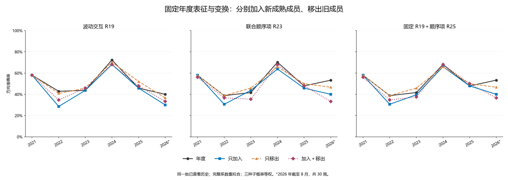
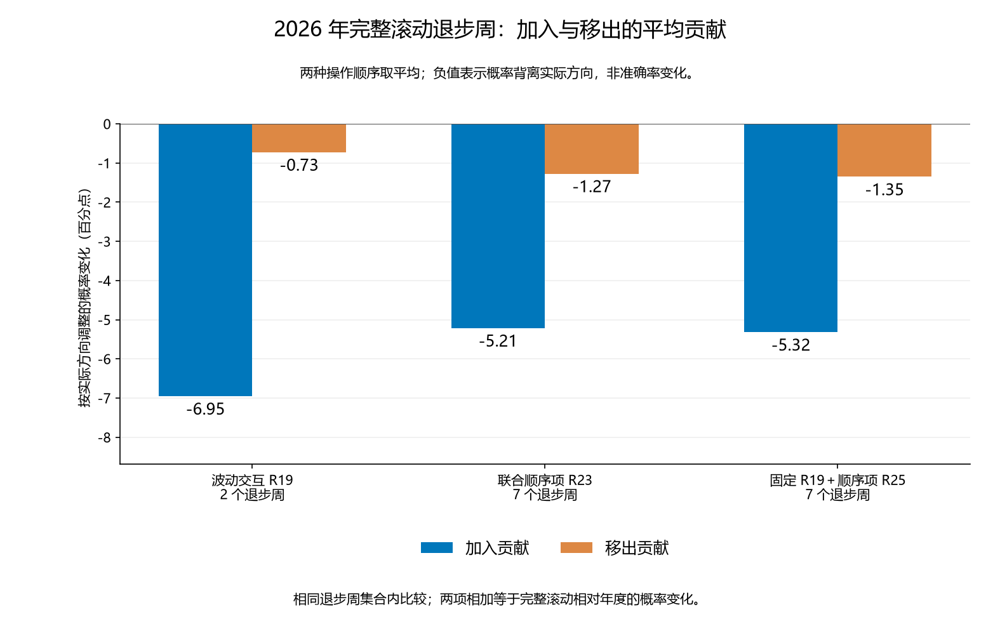

# 第三十五轮：滚动窗口加入与移出的受控对照

本轮新增 102 组样本操作与季度种子组合的拟合，共 408 个分类头；复用年度 72 个头和上一轮完整滚动 204 个头。年度神经网络、全部缩放、交互方向和投影、原始特征缓存不变，无新神经训练或特征推理。训练前冻结四组成员及全部比较，全部新头冻结后才进行周预测。

## 四组训练成员

对每个季度，A 为当年年度训练成员，Q 为本季度完整五年滚动成员，N=Q\A 为新增成员，O=A\Q 为移出成员，R=A∩Q 为保留成员。每年重新定义 A。

| 组别 | 成员 | 作用 |
|---|---|---|
| 年度 | A | 直接复用年度系数 |
| 只加入 | A∪Q=A∪N | 保留年度成员，再加入本季度新增成员 |
| 只移出 | A∩Q=A\O | 移出超出当前窗口的旧成员，不加入新成员 |
| 加入＋移出 | Q=R∪N | 完整滚动，直接复用 R34 固定年度变换的 100% 系数更新 |

所有组别按行身份去重，成员标签必须在季度截止时全部成熟。新增指相对年度集合新获得资格，可能包含日期早于本季度、但标签刚成熟的观察。只加入组在年内保留年度下界，可能超过五年；只移出组样本减少，且不引入年度截止后新成熟的标签，因此这两组是诊断性成员干预，不能统称为固定五年训练。

本轮只改变分类系数损失函数中的样本成员。年度神经网络、特征截尾和标准化、监督交互方向、残差投影及尺度仍保留原年度训练信息，包括被移出成员的信息。因此“只移出”不等于整套模型忘记这些数据，也不是整条流程的留出实验。

R18、R19、R23 沿用 lambda=0.01、只惩罚斜率的平均逻辑损失；R25 固定同组同季度的 R19，完整拟合顺序系数 gamma。本轮采用完整系数拟合，不叠加上一轮 25% 或 50% 插值。相同正则强度下，样本操作仍同时改变数量、类别构成、覆盖范围及平均损失中各样本的权重，无法单独区分数量与质量。

## 样本数量变化

| 季度截止 | 年度数 | 新增数 | 移出数 | 只加入数 | 只移出数 | 完整滚动数 |
|---|---|---|---|---|---|---|
| 2020-12-31 | 1212 | 0 | 0 | 1212 | 1212 | 1212 |
| 2021-03-31 | 1212 | 58 | 59 | 1270 | 1153 | 1211 |
| 2021-06-30 | 1212 | 118 | 120 | 1330 | 1092 | 1210 |
| 2021-09-30 | 1212 | 182 | 184 | 1394 | 1028 | 1210 |
| 2021-12-31 | 1211 | 0 | 0 | 1211 | 1211 | 1211 |
| 2022-03-31 | 1211 | 58 | 59 | 1269 | 1152 | 1210 |
| 2022-06-30 | 1211 | 117 | 119 | 1328 | 1092 | 1209 |
| 2022-09-30 | 1211 | 182 | 184 | 1393 | 1027 | 1209 |
| 2022-12-31 | 1209 | 0 | 0 | 1209 | 1209 | 1209 |
| 2023-03-31 | 1209 | 59 | 59 | 1268 | 1150 | 1209 |
| 2023-06-30 | 1209 | 118 | 119 | 1327 | 1090 | 1208 |
| 2023-09-30 | 1209 | 182 | 183 | 1391 | 1026 | 1208 |
| 2023-12-31 | 1208 | 0 | 0 | 1208 | 1208 | 1208 |
| 2024-03-31 | 1208 | 58 | 58 | 1266 | 1150 | 1208 |
| 2024-06-30 | 1208 | 117 | 118 | 1325 | 1090 | 1207 |
| 2024-09-30 | 1208 | 181 | 183 | 1389 | 1025 | 1206 |
| 2024-12-31 | 1206 | 0 | 0 | 1206 | 1206 | 1206 |
| 2025-03-31 | 1206 | 57 | 58 | 1263 | 1148 | 1205 |
| 2025-06-30 | 1206 | 117 | 117 | 1323 | 1089 | 1206 |
| 2025-09-30 | 1206 | 183 | 183 | 1389 | 1023 | 1206 |
| 2025-12-31 | 1206 | 0 | 0 | 1206 | 1206 | 1206 |
| 2026-03-31 | 1206 | 56 | 58 | 1262 | 1148 | 1204 |
| 2026-06-30 | 1206 | 116 | 118 | 1322 | 1088 | 1204 |

全部 92 个组别与截止日组合的最早日期、最晚日期、标签最晚成熟时间、上涨标签比例见 membership_summary.csv；逐个成员见 ablation_membership.csv。

## 预测与比较口径

同一批 272 个周信号，2021–2023 为 147 周，2024–2026 年 8 月为 125 周。预测目标仍为原定义的随后执行周收益方向，三个固定种子的概率等权平均，概率严格 >0.5 才判断上涨。各组第一季度与年度方案完全相同；原 MSE 全段沿用年度结果，训练频率对照则使用每组自己的成熟成员标签比例。11 个旧政策完整保留。

所有历史结果此前已被查看，本轮假设来自此前滚动训练与归因结果，不是新的盲测，也没有根据本轮表现选择新的训练窗口、更新强度或种子。

## 2021–2023（147 周）

| 政策 | 方法 | 正确/总数 | 准确率 | 平衡准确率 | AUROC | Brier↓ | 对数损失↓ |
|---|---|---|---|---|---|---|---|
| 年度／旧重复量 | 加性 R18 | 65/147 | 44.22% | 46.09% | 0.448008 | 0.309837 | 0.834563 |
| 年度／旧重复量 | 波动交互 R19 | 67/147 | 45.58% | 47.49% | 0.448956 | 0.310966 | 0.838337 |
| 年度／旧重复量 | 联合顺序项 R23 | 68/147 | 46.26% | 47.86% | 0.453700 | 0.311375 | 0.845381 |
| 年度／旧重复量 | 固定 R19＋顺序项 R25 | 69/147 | 46.94% | 48.66% | 0.453700 | 0.310431 | 0.841951 |
| 年度／旧重复量 | 原 MSE | 60/147 | 40.82% | 42.28% | 0.432638 | — | — |
| 年度／旧重复量 | 训练上涨频率 | 62/147 | 42.18% | 50.00% | 0.529412 | 0.256412 | 0.706022 |
| 年度基线 | 加性 R18 | 68/147 | 46.26% | 47.86% | 0.463188 | 0.277344 | 0.751325 |
| 年度基线 | 波动交互 R19 | 71/147 | 48.30% | 50.28% | 0.468121 | 0.277967 | 0.752923 |
| 年度基线 | 联合顺序项 R23 | 68/147 | 46.26% | 48.29% | 0.476850 | 0.276195 | 0.749569 |
| 年度基线 | 固定 R19＋顺序项 R25 | 68/147 | 46.26% | 48.29% | 0.475712 | 0.276108 | 0.749367 |
| 年度基线 | 原 MSE | 73/147 | 49.66% | 51.02% | 0.481025 | — | — |
| 年度基线 | 训练上涨频率 | 62/147 | 42.18% | 50.00% | 0.529412 | 0.256412 | 0.706022 |
| 整套季度 | 加性 R18 | 73/147 | 49.66% | 51.45% | 0.507590 | 0.264364 | 0.723883 |
| 整套季度 | 波动交互 R19 | 74/147 | 50.34% | 52.04% | 0.504175 | 0.264609 | 0.724441 |
| 整套季度 | 联合顺序项 R23 | 74/147 | 50.34% | 51.82% | 0.496395 | 0.265643 | 0.726598 |
| 整套季度 | 固定 R19＋顺序项 R25 | 75/147 | 51.02% | 52.63% | 0.495256 | 0.265518 | 0.726259 |
| 整套季度 | 原 MSE | 68/147 | 46.26% | 48.73% | 0.488615 | — | — |
| 整套季度 | 训练上涨频率 | 62/147 | 42.18% | 50.00% | 0.498008 | 0.255891 | 0.704963 |
| 市场状态触发 | 加性 R18 | 68/147 | 46.26% | 47.86% | 0.463188 | 0.277344 | 0.751325 |
| 市场状态触发 | 波动交互 R19 | 71/147 | 48.30% | 50.28% | 0.468121 | 0.277967 | 0.752923 |
| 市场状态触发 | 联合顺序项 R23 | 68/147 | 46.26% | 48.29% | 0.476850 | 0.276195 | 0.749569 |
| 市场状态触发 | 固定 R19＋顺序项 R25 | 68/147 | 46.26% | 48.29% | 0.475712 | 0.276108 | 0.749367 |
| 市场状态触发 | 原 MSE | 73/147 | 49.66% | 51.02% | 0.481025 | — | — |
| 市场状态触发 | 训练上涨频率 | 62/147 | 42.18% | 50.00% | 0.529412 | 0.256412 | 0.706022 |
| 成熟误差触发 | 加性 R18 | 66/147 | 44.90% | 47.55% | 0.472106 | 0.274054 | 0.743857 |
| 成熟误差触发 | 波动交互 R19 | 66/147 | 44.90% | 47.99% | 0.475901 | 0.274670 | 0.745338 |
| 成熟误差触发 | 联合顺序项 R23 | 67/147 | 45.58% | 48.58% | 0.481214 | 0.274268 | 0.744880 |
| 成熟误差触发 | 固定 R19＋顺序项 R25 | 67/147 | 45.58% | 48.58% | 0.479127 | 0.274242 | 0.744813 |
| 成熟误差触发 | 原 MSE | 70/147 | 47.62% | 49.47% | 0.500380 | — | — |
| 成熟误差触发 | 训练上涨频率 | 62/147 | 42.18% | 50.00% | 0.530076 | 0.256049 | 0.705285 |
| 新旧试运行切换 | 加性 R18 | 66/147 | 44.90% | 46.90% | 0.457116 | 0.277466 | 0.751109 |
| 新旧试运行切换 | 波动交互 R19 | 68/147 | 46.26% | 48.51% | 0.459962 | 0.277855 | 0.752026 |
| 新旧试运行切换 | 联合顺序项 R23 | 66/147 | 44.90% | 47.33% | 0.472486 | 0.275358 | 0.747293 |
| 新旧试运行切换 | 固定 R19＋顺序项 R25 | 66/147 | 44.90% | 47.33% | 0.470968 | 0.275184 | 0.746850 |
| 新旧试运行切换 | 原 MSE | 69/147 | 46.94% | 49.10% | 0.473055 | — | — |
| 新旧试运行切换 | 训练上涨频率 | 62/147 | 42.18% | 50.00% | 0.522486 | 0.256732 | 0.706662 |
| 年度与季度概率各半 | 加性 R18 | 72/147 | 48.98% | 51.08% | 0.481784 | 0.269164 | 0.733765 |
| 年度与季度概率各半 | 波动交互 R19 | 72/147 | 48.98% | 51.08% | 0.484630 | 0.269418 | 0.734408 |
| 年度与季度概率各半 | 联合顺序项 R23 | 72/147 | 48.98% | 51.08% | 0.489564 | 0.268852 | 0.733469 |
| 年度与季度概率各半 | 固定 R19＋顺序项 R25 | 72/147 | 48.98% | 51.08% | 0.488425 | 0.268785 | 0.733286 |
| 年度与季度概率各半 | 原 MSE | 74/147 | 50.34% | 51.60% | 0.486907 | — | — |
| 年度与季度概率各半 | 训练上涨频率 | 62/147 | 42.18% | 50.00% | 0.502562 | 0.256111 | 0.705410 |
| R32 季度分类端 | 加性 R18 | 65/147 | 44.22% | 46.09% | 0.445920 | 0.275376 | 0.745866 |
| R32 季度分类端 | 波动交互 R19 | 67/147 | 45.58% | 48.14% | 0.456546 | 0.275662 | 0.746719 |
| R32 季度分类端 | 联合顺序项 R23 | 65/147 | 44.22% | 46.75% | 0.472296 | 0.270726 | 0.736537 |
| R32 季度分类端 | 固定 R19＋顺序项 R25 | 64/147 | 43.54% | 46.16% | 0.471537 | 0.270748 | 0.736574 |
| R32 季度分类端 | 原 MSE | 73/147 | 49.66% | 51.02% | 0.481025 | — | — |
| R32 季度分类端 | 训练上涨频率 | 62/147 | 42.18% | 50.00% | 0.498008 | 0.255891 | 0.704963 |
| 固定变换／25% 更新 | 加性 R18 | 66/147 | 44.90% | 46.68% | 0.459583 | 0.276651 | 0.749383 |
| 固定变换／25% 更新 | 波动交互 R19 | 67/147 | 45.58% | 47.49% | 0.465085 | 0.277103 | 0.750600 |
| 固定变换／25% 更新 | 联合顺序项 R23 | 67/147 | 45.58% | 47.49% | 0.473055 | 0.274344 | 0.744998 |
| 固定变换／25% 更新 | 固定 R19＋顺序项 R25 | 67/147 | 45.58% | 47.49% | 0.473624 | 0.274168 | 0.744613 |
| 固定变换／25% 更新 | 原 MSE | 73/147 | 49.66% | 51.02% | 0.481025 | — | — |
| 固定变换／25% 更新 | 训练上涨频率 | 62/147 | 42.18% | 50.00% | 0.498008 | 0.255891 | 0.704963 |
| 固定变换／50% 更新 | 加性 R18 | 65/147 | 44.22% | 46.09% | 0.454459 | 0.276094 | 0.747839 |
| 固定变换／50% 更新 | 波动交互 R19 | 66/147 | 44.90% | 47.12% | 0.464516 | 0.276404 | 0.748744 |
| 固定变换／50% 更新 | 联合顺序项 R23 | 66/147 | 44.90% | 47.12% | 0.472676 | 0.272725 | 0.741175 |
| 固定变换／50% 更新 | 固定 R19＋顺序项 R25 | 66/147 | 44.90% | 47.12% | 0.473624 | 0.272481 | 0.740657 |
| 固定变换／50% 更新 | 原 MSE | 73/147 | 49.66% | 51.02% | 0.481025 | — | — |
| 固定变换／50% 更新 | 训练上涨频率 | 62/147 | 42.18% | 50.00% | 0.498008 | 0.255891 | 0.704963 |
| 加入＋移出／完整滚动 | 加性 R18 | 65/147 | 44.22% | 46.09% | 0.446110 | 0.275430 | 0.745980 |
| 加入＋移出／完整滚动 | 波动交互 R19 | 68/147 | 46.26% | 48.73% | 0.456357 | 0.275556 | 0.746478 |
| 加入＋移出／完整滚动 | 联合顺序项 R23 | 63/147 | 42.86% | 45.57% | 0.471347 | 0.270540 | 0.736072 |
| 加入＋移出／完整滚动 | 固定 R19＋顺序项 R25 | 63/147 | 42.86% | 45.57% | 0.469829 | 0.270237 | 0.735439 |
| 加入＋移出／完整滚动 | 原 MSE | 73/147 | 49.66% | 51.02% | 0.481025 | — | — |
| 加入＋移出／完整滚动 | 训练上涨频率 | 62/147 | 42.18% | 50.00% | 0.498008 | 0.255891 | 0.704963 |
| 只加入新成熟成员 | 加性 R18 | 63/147 | 42.86% | 44.48% | 0.450854 | 0.275339 | 0.746015 |
| 只加入新成熟成员 | 波动交互 R19 | 64/147 | 43.54% | 45.50% | 0.456736 | 0.275498 | 0.746584 |
| 只加入新成熟成员 | 联合顺序项 R23 | 65/147 | 44.22% | 46.09% | 0.469070 | 0.270017 | 0.735240 |
| 只加入新成熟成员 | 固定 R19＋顺序项 R25 | 63/147 | 42.86% | 44.91% | 0.467932 | 0.269953 | 0.735101 |
| 只加入新成熟成员 | 原 MSE | 73/147 | 49.66% | 51.02% | 0.481025 | — | — |
| 只加入新成熟成员 | 训练上涨频率 | 62/147 | 42.18% | 50.00% | 0.507116 | 0.255583 | 0.704349 |
| 只移出旧成员 | 加性 R18 | 71/147 | 48.30% | 50.49% | 0.457116 | 0.277105 | 0.750432 |
| 只移出旧成员 | 波动交互 R19 | 71/147 | 48.30% | 50.71% | 0.467173 | 0.277543 | 0.751668 |
| 只移出旧成员 | 联合顺序项 R23 | 70/147 | 47.62% | 49.69% | 0.471727 | 0.275851 | 0.748582 |
| 只移出旧成员 | 固定 R19＋顺序项 R25 | 70/147 | 47.62% | 49.69% | 0.474194 | 0.275527 | 0.747833 |
| 只移出旧成员 | 原 MSE | 73/147 | 49.66% | 51.02% | 0.481025 | — | — |
| 只移出旧成员 | 训练上涨频率 | 62/147 | 42.18% | 50.00% | 0.519450 | 0.256847 | 0.706895 |

## 2024–2026 年 8 月（125 周）

| 政策 | 方法 | 正确/总数 | 准确率 | 平衡准确率 | AUROC | Brier↓ | 对数损失↓ |
|---|---|---|---|---|---|---|---|
| 年度／旧重复量 | 加性 R18 | 71/125 | 56.80% | 57.20% | 0.593734 | 0.255695 | 0.709330 |
| 年度／旧重复量 | 波动交互 R19 | 70/125 | 56.00% | 56.36% | 0.594761 | 0.255385 | 0.708607 |
| 年度／旧重复量 | 联合顺序项 R23 | 72/125 | 57.60% | 57.87% | 0.587571 | 0.257509 | 0.714541 |
| 年度／旧重复量 | 固定 R19＋顺序项 R25 | 73/125 | 58.40% | 58.72% | 0.587314 | 0.257626 | 0.714563 |
| 年度／旧重复量 | 原 MSE | 69/125 | 55.20% | 55.60% | 0.579353 | — | — |
| 年度／旧重复量 | 训练上涨频率 | 56/125 | 44.80% | 45.48% | 0.425526 | 0.252748 | 0.698649 |
| 年度基线 | 加性 R18 | 69/125 | 55.20% | 55.96% | 0.578839 | 0.246152 | 0.685806 |
| 年度基线 | 波动交互 R19 | 68/125 | 54.40% | 55.02% | 0.582435 | 0.246843 | 0.687439 |
| 年度基线 | 联合顺序项 R23 | 72/125 | 57.60% | 58.41% | 0.563174 | 0.249790 | 0.693613 |
| 年度基线 | 固定 R19＋顺序项 R25 | 71/125 | 56.80% | 57.65% | 0.562917 | 0.249824 | 0.693671 |
| 年度基线 | 原 MSE | 66/125 | 52.80% | 53.15% | 0.521315 | — | — |
| 年度基线 | 训练上涨频率 | 56/125 | 44.80% | 45.48% | 0.425526 | 0.252748 | 0.698649 |
| 整套季度 | 加性 R18 | 63/125 | 50.40% | 50.78% | 0.506420 | 0.255872 | 0.705187 |
| 整套季度 | 波动交互 R19 | 63/125 | 50.40% | 50.78% | 0.516949 | 0.254990 | 0.703625 |
| 整套季度 | 联合顺序项 R23 | 63/125 | 50.40% | 50.78% | 0.508988 | 0.256565 | 0.706808 |
| 整套季度 | 固定 R19＋顺序项 R25 | 63/125 | 50.40% | 50.78% | 0.508218 | 0.256537 | 0.706748 |
| 整套季度 | 原 MSE | 68/125 | 54.40% | 55.11% | 0.529533 | — | — |
| 整套季度 | 训练上涨频率 | 60/125 | 48.00% | 50.31% | 0.414355 | 0.252495 | 0.698143 |
| 市场状态触发 | 加性 R18 | 72/125 | 57.60% | 58.14% | 0.596816 | 0.243854 | 0.680943 |
| 市场状态触发 | 波动交互 R19 | 69/125 | 55.20% | 55.51% | 0.592964 | 0.245567 | 0.684795 |
| 市场状态触发 | 联合顺序项 R23 | 71/125 | 56.80% | 57.38% | 0.576271 | 0.248662 | 0.691363 |
| 市场状态触发 | 固定 R19＋顺序项 R25 | 70/125 | 56.00% | 56.63% | 0.575501 | 0.248691 | 0.691414 |
| 市场状态触发 | 原 MSE | 66/125 | 52.80% | 52.79% | 0.555470 | — | — |
| 市场状态触发 | 训练上涨频率 | 56/125 | 44.80% | 45.48% | 0.448639 | 0.252315 | 0.697782 |
| 成熟误差触发 | 加性 R18 | 69/125 | 55.20% | 55.96% | 0.579353 | 0.245435 | 0.684193 |
| 成熟误差触发 | 波动交互 R19 | 67/125 | 53.60% | 54.17% | 0.582691 | 0.245633 | 0.684637 |
| 成熟误差触发 | 联合顺序项 R23 | 72/125 | 57.60% | 58.41% | 0.571392 | 0.248160 | 0.689971 |
| 成熟误差触发 | 固定 R19＋顺序项 R25 | 71/125 | 56.80% | 57.65% | 0.570878 | 0.248182 | 0.690003 |
| 成熟误差触发 | 原 MSE | 61/125 | 48.80% | 49.36% | 0.508218 | — | — |
| 成熟误差触发 | 训练上涨频率 | 56/125 | 44.80% | 45.48% | 0.417052 | 0.252955 | 0.699065 |
| 新旧试运行切换 | 加性 R18 | 69/125 | 55.20% | 55.96% | 0.578839 | 0.246152 | 0.685806 |
| 新旧试运行切换 | 波动交互 R19 | 68/125 | 54.40% | 55.02% | 0.582435 | 0.246843 | 0.687439 |
| 新旧试运行切换 | 联合顺序项 R23 | 72/125 | 57.60% | 58.41% | 0.563174 | 0.249790 | 0.693613 |
| 新旧试运行切换 | 固定 R19＋顺序项 R25 | 71/125 | 56.80% | 57.65% | 0.562917 | 0.249824 | 0.693671 |
| 新旧试运行切换 | 原 MSE | 66/125 | 52.80% | 53.15% | 0.521315 | — | — |
| 新旧试运行切换 | 训练上涨频率 | 56/125 | 44.80% | 45.48% | 0.425526 | 0.252748 | 0.698649 |
| 年度与季度概率各半 | 加性 R18 | 66/125 | 52.80% | 53.33% | 0.542886 | 0.249814 | 0.692788 |
| 年度与季度概率各半 | 波动交互 R19 | 65/125 | 52.00% | 52.48% | 0.546225 | 0.249695 | 0.692740 |
| 年度与季度概率各半 | 联合顺序项 R23 | 65/125 | 52.00% | 52.48% | 0.539548 | 0.251905 | 0.697382 |
| 年度与季度概率各半 | 固定 R19＋顺序项 R25 | 65/125 | 52.00% | 52.48% | 0.539805 | 0.251920 | 0.697407 |
| 年度与季度概率各半 | 原 MSE | 70/125 | 56.00% | 56.54% | 0.517720 | — | — |
| 年度与季度概率各半 | 训练上涨频率 | 60/125 | 48.00% | 50.31% | 0.408192 | 0.252583 | 0.698319 |
| R32 季度分类端 | 加性 R18 | 63/125 | 50.40% | 51.05% | 0.555727 | 0.249342 | 0.692233 |
| R32 季度分类端 | 波动交互 R19 | 66/125 | 52.80% | 53.51% | 0.561376 | 0.250407 | 0.694725 |
| R32 季度分类端 | 联合顺序项 R23 | 65/125 | 52.00% | 52.75% | 0.549820 | 0.252458 | 0.698936 |
| R32 季度分类端 | 固定 R19＋顺序项 R25 | 65/125 | 52.00% | 52.84% | 0.548536 | 0.252474 | 0.698965 |
| R32 季度分类端 | 原 MSE | 66/125 | 52.80% | 53.15% | 0.521315 | — | — |
| R32 季度分类端 | 训练上涨频率 | 60/125 | 48.00% | 50.31% | 0.414355 | 0.252495 | 0.698143 |
| 固定变换／25% 更新 | 加性 R18 | 67/125 | 53.60% | 54.26% | 0.571392 | 0.246830 | 0.687164 |
| 固定变换／25% 更新 | 波动交互 R19 | 66/125 | 52.80% | 53.42% | 0.573960 | 0.247591 | 0.688954 |
| 固定变换／25% 更新 | 联合顺序项 R23 | 69/125 | 55.20% | 55.87% | 0.560092 | 0.250423 | 0.694884 |
| 固定变换／25% 更新 | 固定 R19＋顺序项 R25 | 69/125 | 55.20% | 55.87% | 0.559322 | 0.250492 | 0.695011 |
| 固定变换／25% 更新 | 原 MSE | 66/125 | 52.80% | 53.15% | 0.521315 | — | — |
| 固定变换／25% 更新 | 训练上涨频率 | 60/125 | 48.00% | 50.31% | 0.414355 | 0.252495 | 0.698143 |
| 固定变换／50% 更新 | 加性 R18 | 67/125 | 53.60% | 54.17% | 0.562917 | 0.247590 | 0.688695 |
| 固定变换／50% 更新 | 波动交互 R19 | 65/125 | 52.00% | 52.57% | 0.569081 | 0.248442 | 0.690683 |
| 固定变换／50% 更新 | 联合顺序项 R23 | 67/125 | 53.60% | 54.17% | 0.553416 | 0.251195 | 0.696435 |
| 固定变换／50% 更新 | 固定 R19＋顺序项 R25 | 68/125 | 54.40% | 55.02% | 0.551875 | 0.251302 | 0.696641 |
| 固定变换／50% 更新 | 原 MSE | 66/125 | 52.80% | 53.15% | 0.521315 | — | — |
| 固定变换／50% 更新 | 训练上涨频率 | 60/125 | 48.00% | 50.31% | 0.414355 | 0.252495 | 0.698143 |
| 加入＋移出／完整滚动 | 加性 R18 | 63/125 | 50.40% | 51.05% | 0.554700 | 0.249356 | 0.692269 |
| 加入＋移出／完整滚动 | 波动交互 R19 | 65/125 | 52.00% | 52.75% | 0.559322 | 0.250445 | 0.694781 |
| 加入＋移出／完整滚动 | 联合顺序项 R23 | 65/125 | 52.00% | 52.84% | 0.547252 | 0.253135 | 0.700368 |
| 加入＋移出／完整滚动 | 固定 R19＋顺序项 R25 | 67/125 | 53.60% | 54.35% | 0.546995 | 0.253329 | 0.700757 |
| 加入＋移出／完整滚动 | 原 MSE | 66/125 | 52.80% | 53.15% | 0.521315 | — | — |
| 加入＋移出／完整滚动 | 训练上涨频率 | 60/125 | 48.00% | 50.31% | 0.414355 | 0.252495 | 0.698143 |
| 只加入新成熟成员 | 加性 R18 | 65/125 | 52.00% | 52.48% | 0.571135 | 0.245953 | 0.685144 |
| 只加入新成熟成员 | 波动交互 R19 | 63/125 | 50.40% | 50.96% | 0.576785 | 0.246831 | 0.687192 |
| 只加入新成熟成员 | 联合顺序项 R23 | 64/125 | 51.20% | 51.63% | 0.558808 | 0.249564 | 0.692845 |
| 只加入新成熟成员 | 固定 R19＋顺序项 R25 | 66/125 | 52.80% | 53.24% | 0.559065 | 0.249608 | 0.692938 |
| 只加入新成熟成员 | 原 MSE | 66/125 | 52.80% | 53.15% | 0.521315 | — | — |
| 只加入新成熟成员 | 训练上涨频率 | 56/125 | 44.80% | 46.02% | 0.447740 | 0.251876 | 0.696902 |
| 只移出旧成员 | 加性 R18 | 70/125 | 56.00% | 56.99% | 0.564458 | 0.250528 | 0.695023 |
| 只移出旧成员 | 波动交互 R19 | 69/125 | 55.20% | 56.14% | 0.565485 | 0.251797 | 0.697829 |
| 只移出旧成员 | 联合顺序项 R23 | 69/125 | 55.20% | 56.14% | 0.538521 | 0.255122 | 0.704727 |
| 只移出旧成员 | 固定 R19＋顺序项 R25 | 69/125 | 55.20% | 56.14% | 0.540575 | 0.255108 | 0.704698 |
| 只移出旧成员 | 原 MSE | 66/125 | 52.80% | 53.15% | 0.521315 | — | — |
| 只移出旧成员 | 训练上涨频率 | 60/125 | 48.00% | 50.31% | 0.437725 | 0.253752 | 0.700672 |

## 逐年：波动交互 R19

| 年份 | 周数 | 年度 | 只加入 | 只移出 | 加入＋移出 |
|---|---|---|---|---|---|
| 2021 | 50 | 58.00% | 58.00% | 58.00% | 58.00% |
| 2022 | 49 | 42.86% | 28.57% | 40.82% | 34.69% |
| 2023 | 48 | 43.75% | 43.75% | 45.83% | 45.83% |
| 2024 | 47 | 72.34% | 68.09% | 70.21% | 68.09% |
| 2025 | 48 | 45.83% | 45.83% | 52.08% | 47.92% |
| 2026 | 30 | 40.00% | 30.00% | 36.67% | 33.33% |

## 逐年：联合顺序项 R23

| 年份 | 周数 | 年度 | 只加入 | 只移出 | 加入＋移出 |
|---|---|---|---|---|---|
| 2021 | 50 | 58.00% | 58.00% | 58.00% | 56.00% |
| 2022 | 49 | 38.78% | 30.61% | 38.78% | 36.73% |
| 2023 | 48 | 41.67% | 43.75% | 45.83% | 35.42% |
| 2024 | 47 | 70.21% | 63.83% | 65.96% | 68.09% |
| 2025 | 48 | 47.92% | 45.83% | 50.00% | 47.92% |
| 2026 | 30 | 53.33% | 40.00% | 46.67% | 33.33% |

## 逐年：固定 R19＋顺序项 R25

| 年份 | 周数 | 年度 | 只加入 | 只移出 | 加入＋移出 |
|---|---|---|---|---|---|
| 2021 | 50 | 58.00% | 58.00% | 58.00% | 56.00% |
| 2022 | 49 | 38.78% | 30.61% | 38.78% | 34.69% |
| 2023 | 48 | 41.67% | 39.58% | 45.83% | 37.50% |
| 2024 | 47 | 68.09% | 65.96% | 65.96% | 68.09% |
| 2025 | 48 | 47.92% | 47.92% | 50.00% | 50.00% |
| 2026 | 30 | 53.33% | 40.00% | 46.67% | 36.67% |

## 两种操作如何改变预测概率

记 p0、pA、pR、pB 分别为年度、只加入、只移出、同时操作的上涨概率。加入的条件影响为 pA−p0（尚未移出时）及 pB−pR（已经移出时）；移出的条件影响为 pR−p0（尚未加入时）及 pB−pA（已经加入时）。

对两种顺序取等权平均：加入贡献=[(pA−p0)+(pB−pR)]/2；移出贡献=[(pR−p0)+(pB−pA)]/2；两者之和严格等于 pB−p0。非加和差异为 pB−pA−pR+p0，反映两种操作的条件影响不同，其中包含重新拟合和概率转换的非线性；它不是模型内部的市场或顺序交互特征。

先按每个种子的实际概率计算，再平均三个种子的贡献，保持原概率融合定义。该归因是约定的操作顺序平均，不是唯一自然因果分配，因此两个条件路径也全部报告。符号按随后实际涨跌方向调整，负值表示概率向错误方向移动，单位为概率百分点，不是准确率百分点。

### 2021–2023：全部周及完整滚动的退步／改善周

| 方法 | 周类型 | 周数 | 加入平均贡献 | 移出平均贡献 | 总变化 | 非加和差异 | 加入最大不利周 | 移出最大不利周 |
|---|---|---|---|---|---|---|---|---|
| 联合顺序项 R23 | 全部 | 147 | +0.186 | -0.047 | +0.139 | -0.036 | 40 | 40 |
| 联合顺序项 R23 | 对→错 | 13 | -3.881 | -2.847 | -6.728 | -0.372 | 8 | 5 |
| 联合顺序项 R23 | 错→对 | 8 | +6.330 | +5.094 | +11.424 | +0.180 | 0 | 0 |
| 固定 R19＋顺序项 R25 | 全部 | 147 | +0.185 | -0.028 | +0.156 | -0.029 | 42 | 37 |
| 固定 R19＋顺序项 R25 | 对→错 | 14 | -3.930 | -2.503 | -6.433 | -0.335 | 9 | 5 |
| 固定 R19＋顺序项 R25 | 错→对 | 9 | +6.700 | +4.835 | +11.535 | +0.134 | 0 | 0 |
| 波动交互 R19 | 全部 | 147 | -0.071 | -0.033 | -0.104 | -0.023 | 43 | 35 |
| 波动交互 R19 | 对→错 | 10 | -2.865 | -2.007 | -4.872 | -0.239 | 6 | 4 |
| 波动交互 R19 | 错→对 | 7 | +2.707 | +3.360 | +6.066 | -0.038 | 0 | 1 |

### 2024–2026 年 8 月：全部周及完整滚动的退步／改善周

| 方法 | 周类型 | 周数 | 加入平均贡献 | 移出平均贡献 | 总变化 | 非加和差异 | 加入最大不利周 | 移出最大不利周 |
|---|---|---|---|---|---|---|---|---|
| 联合顺序项 R23 | 全部 | 125 | +0.100 | -0.382 | -0.283 | +0.093 | 32 | 41 |
| 联合顺序项 R23 | 对→错 | 12 | -4.084 | -0.920 | -5.004 | -0.786 | 11 | 1 |
| 联合顺序项 R23 | 错→对 | 5 | +2.967 | +2.441 | +5.409 | +0.670 | 0 | 1 |
| 固定 R19＋顺序项 R25 | 全部 | 125 | +0.083 | -0.382 | -0.299 | +0.076 | 32 | 42 |
| 固定 R19＋顺序项 R25 | 对→错 | 11 | -4.429 | -1.212 | -5.641 | -0.886 | 10 | 1 |
| 固定 R19＋顺序项 R25 | 错→对 | 7 | +4.172 | +1.392 | +5.564 | +1.154 | 0 | 3 |
| 波动交互 R19 | 全部 | 125 | +0.049 | -0.354 | -0.305 | +0.060 | 33 | 42 |
| 波动交互 R19 | 对→错 | 7 | -4.041 | -0.512 | -4.553 | -1.123 | 6 | 1 |
| 波动交互 R19 | 错→对 | 4 | +1.805 | +3.242 | +5.048 | +0.288 | 0 | 0 |

### 2026 年：全部周及完整滚动的退步／改善周

| 方法 | 周类型 | 周数 | 加入平均贡献 | 移出平均贡献 | 总变化 | 非加和差异 | 加入最大不利周 | 移出最大不利周 |
|---|---|---|---|---|---|---|---|---|
| 联合顺序项 R23 | 全部 | 30 | -0.715 | -0.184 | -0.899 | -0.115 | 10 | 8 |
| 联合顺序项 R23 | 对→错 | 7 | -5.215 | -1.273 | -6.488 | -0.815 | 6 | 1 |
| 联合顺序项 R23 | 错→对 | 1 | +6.328 | -0.336 | +5.992 | +1.865 | 0 | 1 |
| 固定 R19＋顺序项 R25 | 全部 | 30 | -0.724 | -0.192 | -0.916 | -0.143 | 10 | 8 |
| 固定 R19＋顺序项 R25 | 对→错 | 7 | -5.319 | -1.353 | -6.671 | -0.991 | 6 | 1 |
| 固定 R19＋顺序项 R25 | 错→对 | 2 | +7.574 | -0.349 | +7.225 | +2.032 | 0 | 2 |
| 波动交互 R19 | 全部 | 30 | -0.617 | -0.176 | -0.793 | -0.152 | 10 | 8 |
| 波动交互 R19 | 对→错 | 2 | -6.953 | -0.726 | -7.679 | -1.719 | 2 | 0 |

### 2026 年退步周：两个条件路径

| 方法 | 周数 | 先加入 | 移出后再加入 | 先移出 | 加入后再移出 |
|---|---|---|---|---|---|
| 联合顺序项 R23 | 7 | -4.807 | -5.622 | -0.866 | -1.681 |
| 固定 R19＋顺序项 R25 | 7 | -4.823 | -5.814 | -0.857 | -1.848 |
| 波动交互 R19 | 2 | -6.093 | -7.812 | +0.133 | -1.586 |

“退步周”按完整滚动组相对年度组定义，使用相同集合比较加减影响。稳定正确和稳定错误、所有年度的同口径汇总亦保存在 effect_summary.csv。系数逐坐标对照与同样的操作分解见 coefficient_effects.csv；不能仅凭系数位移范数推断预测好坏。

## 2026 年各组相对年度的翻转

| 组别 | 方法 | 对→错 | 错→对 |
|---|---|---|---|
| 只加入 | 波动交互 R19 | 3 | 0 |
| 只加入 | 联合顺序项 R23 | 6 | 2 |
| 只加入 | 固定 R19＋顺序项 R25 | 6 | 2 |
| 只移出 | 波动交互 R19 | 1 | 0 |
| 只移出 | 联合顺序项 R23 | 4 | 2 |
| 只移出 | 固定 R19＋顺序项 R25 | 4 | 2 |
| 加入＋移出 | 波动交互 R19 | 2 | 0 |
| 加入＋移出 | 联合顺序项 R23 | 7 | 1 |
| 加入＋移出 | 固定 R19＋顺序项 R25 | 7 | 2 |

## 60 项预设比较

加入相对年度、移出相对年度、完整滚动相对只移出、完整滚动相对只加入、完整滚动相对年度，共五组关系；两个时期、三个主方法、方向误差和 Brier，共 60 项统一 Holm 校正。显著改善 0 项，显著恶化 0 项。

| 时期 | 候选 | 方法 | 参照 | 损失 | 差值 | 边际 95% 区间 | 原始 p | Holm p |
|---|---|---|---|---|---|---|---|---|
| 2021–2023 | 只加入新成熟成员 | 波动交互 R19 | 年度基线 | direction_error | 0.047619 | [-0.006803, +0.108844] | 0.105489 | 1.000000 |
| 2021–2023 | 只加入新成熟成员 | 波动交互 R19 | 年度基线 | brier | -0.002469 | [-0.009217, +0.003899] | 0.461554 | 1.000000 |
| 2021–2023 | 只加入新成熟成员 | 联合顺序项 R23 | 年度基线 | direction_error | 0.020408 | [-0.020408, +0.068027] | 0.411959 | 1.000000 |
| 2021–2023 | 只加入新成熟成员 | 联合顺序项 R23 | 年度基线 | brier | -0.006177 | [-0.017121, +0.002568] | 0.214979 | 1.000000 |
| 2021–2023 | 只加入新成熟成员 | 固定 R19＋顺序项 R25 | 年度基线 | direction_error | 0.034014 | [-0.006803, +0.081633] | 0.123688 | 1.000000 |
| 2021–2023 | 只加入新成熟成员 | 固定 R19＋顺序项 R25 | 年度基线 | brier | -0.006155 | [-0.017362, +0.002963] | 0.233777 | 1.000000 |
| 2021–2023 | 只移出旧成员 | 波动交互 R19 | 年度基线 | direction_error | 0.000000 | [-0.040816, +0.040816] | 1.000000 | 1.000000 |
| 2021–2023 | 只移出旧成员 | 波动交互 R19 | 年度基线 | brier | -0.000424 | [-0.004650, +0.003732] | 0.833817 | 1.000000 |
| 2021–2023 | 只移出旧成员 | 联合顺序项 R23 | 年度基线 | direction_error | -0.013605 | [-0.047619, +0.020408] | 0.431757 | 1.000000 |
| 2021–2023 | 只移出旧成员 | 联合顺序项 R23 | 年度基线 | brier | -0.000344 | [-0.005518, +0.004441] | 0.890511 | 1.000000 |
| 2021–2023 | 只移出旧成员 | 固定 R19＋顺序项 R25 | 年度基线 | direction_error | -0.013605 | [-0.047619, +0.020408] | 0.431757 | 1.000000 |
| 2021–2023 | 只移出旧成员 | 固定 R19＋顺序项 R25 | 年度基线 | brier | -0.000581 | [-0.005643, +0.004117] | 0.809019 | 1.000000 |
| 2021–2023 | 加入＋移出／完整滚动 | 波动交互 R19 | 只移出旧成员 | direction_error | 0.020408 | [-0.020408, +0.068027] | 0.403360 | 1.000000 |
| 2021–2023 | 加入＋移出／完整滚动 | 波动交互 R19 | 只移出旧成员 | brier | -0.001987 | [-0.009075, +0.004724] | 0.573443 | 1.000000 |
| 2021–2023 | 加入＋移出／完整滚动 | 联合顺序项 R23 | 只移出旧成员 | direction_error | 0.047619 | [-0.006803, +0.115646] | 0.116088 | 1.000000 |
| 2021–2023 | 加入＋移出／完整滚动 | 联合顺序项 R23 | 只移出旧成员 | brier | -0.005311 | [-0.015688, +0.003358] | 0.277072 | 1.000000 |
| 2021–2023 | 加入＋移出／完整滚动 | 固定 R19＋顺序项 R25 | 只移出旧成员 | direction_error | 0.047619 | [-0.006803, +0.115646] | 0.140286 | 1.000000 |
| 2021–2023 | 加入＋移出／完整滚动 | 固定 R19＋顺序项 R25 | 只移出旧成员 | brier | -0.005290 | [-0.015890, +0.003786] | 0.294171 | 1.000000 |
| 2021–2023 | 加入＋移出／完整滚动 | 波动交互 R19 | 只加入新成熟成员 | direction_error | -0.027211 | [-0.061224, +0.006803] | 0.121088 | 1.000000 |
| 2021–2023 | 加入＋移出／完整滚动 | 波动交互 R19 | 只加入新成熟成员 | brier | 0.000058 | [-0.004364, +0.004372] | 0.979102 | 1.000000 |
| 2021–2023 | 加入＋移出／完整滚动 | 联合顺序项 R23 | 只加入新成熟成员 | direction_error | 0.013605 | [-0.034014, +0.068027] | 0.600540 | 1.000000 |
| 2021–2023 | 加入＋移出／完整滚动 | 联合顺序项 R23 | 只加入新成熟成员 | brier | 0.000523 | [-0.004096, +0.005213] | 0.819418 | 1.000000 |
| 2021–2023 | 加入＋移出／完整滚动 | 固定 R19＋顺序项 R25 | 只加入新成熟成员 | direction_error | 0.000000 | [-0.054422, +0.054422] | 1.000000 | 1.000000 |
| 2021–2023 | 加入＋移出／完整滚动 | 固定 R19＋顺序项 R25 | 只加入新成熟成员 | brier | 0.000284 | [-0.004215, +0.004854] | 0.898510 | 1.000000 |
| 2021–2023 | 加入＋移出／完整滚动 | 波动交互 R19 | 年度基线 | direction_error | 0.020408 | [-0.027211, +0.074830] | 0.478752 | 1.000000 |
| 2021–2023 | 加入＋移出／完整滚动 | 波动交互 R19 | 年度基线 | brier | -0.002411 | [-0.012267, +0.006778] | 0.610239 | 1.000000 |
| 2021–2023 | 加入＋移出／完整滚动 | 联合顺序项 R23 | 年度基线 | direction_error | 0.034014 | [-0.020408, +0.095238] | 0.247975 | 1.000000 |
| 2021–2023 | 加入＋移出／完整滚动 | 联合顺序项 R23 | 年度基线 | brier | -0.005655 | [-0.020194, +0.006344] | 0.397960 | 1.000000 |
| 2021–2023 | 加入＋移出／完整滚动 | 固定 R19＋顺序项 R25 | 年度基线 | direction_error | 0.034014 | [-0.020408, +0.102041] | 0.285071 | 1.000000 |
| 2021–2023 | 加入＋移出／完整滚动 | 固定 R19＋顺序项 R25 | 年度基线 | brier | -0.005871 | [-0.020625, +0.006441] | 0.389561 | 1.000000 |
| 2024–2026 年 8 月 | 只加入新成熟成员 | 波动交互 R19 | 年度基线 | direction_error | 0.040000 | [-0.016000, +0.104000] | 0.194881 | 1.000000 |
| 2024–2026 年 8 月 | 只加入新成熟成员 | 波动交互 R19 | 年度基线 | brier | -0.000012 | [-0.003503, +0.003986] | 0.995000 | 1.000000 |
| 2024–2026 年 8 月 | 只加入新成熟成员 | 联合顺序项 R23 | 年度基线 | direction_error | 0.064000 | [+0.008000, +0.128000] | 0.039296 | 1.000000 |
| 2024–2026 年 8 月 | 只加入新成熟成员 | 联合顺序项 R23 | 年度基线 | brier | -0.000226 | [-0.004313, +0.004422] | 0.922708 | 1.000000 |
| 2024–2026 年 8 月 | 只加入新成熟成员 | 固定 R19＋顺序项 R25 | 年度基线 | direction_error | 0.040000 | [-0.008000, +0.096000] | 0.114989 | 1.000000 |
| 2024–2026 年 8 月 | 只加入新成熟成员 | 固定 R19＋顺序项 R25 | 年度基线 | brier | -0.000217 | [-0.004127, +0.004316] | 0.922908 | 1.000000 |
| 2024–2026 年 8 月 | 只移出旧成员 | 波动交互 R19 | 年度基线 | direction_error | -0.008000 | [-0.040000, +0.032000] | 0.672133 | 1.000000 |
| 2024–2026 年 8 月 | 只移出旧成员 | 波动交互 R19 | 年度基线 | brier | 0.004954 | [+0.001019, +0.009114] | 0.017498 | 1.000000 |
| 2024–2026 年 8 月 | 只移出旧成员 | 联合顺序项 R23 | 年度基线 | direction_error | 0.024000 | [-0.024000, +0.072000] | 0.343066 | 1.000000 |
| 2024–2026 年 8 月 | 只移出旧成员 | 联合顺序项 R23 | 年度基线 | brier | 0.005332 | [+0.001096, +0.009879] | 0.017898 | 1.000000 |
| 2024–2026 年 8 月 | 只移出旧成员 | 固定 R19＋顺序项 R25 | 年度基线 | direction_error | 0.016000 | [-0.024000, +0.064000] | 0.495750 | 1.000000 |
| 2024–2026 年 8 月 | 只移出旧成员 | 固定 R19＋顺序项 R25 | 年度基线 | brier | 0.005284 | [+0.000961, +0.009896] | 0.019998 | 1.000000 |
| 2024–2026 年 8 月 | 加入＋移出／完整滚动 | 波动交互 R19 | 只移出旧成员 | direction_error | 0.032000 | [-0.008000, +0.080000] | 0.159484 | 1.000000 |
| 2024–2026 年 8 月 | 加入＋移出／完整滚动 | 波动交互 R19 | 只移出旧成员 | brier | -0.001352 | [-0.006718, +0.004177] | 0.626037 | 1.000000 |
| 2024–2026 年 8 月 | 加入＋移出／完整滚动 | 联合顺序项 R23 | 只移出旧成员 | direction_error | 0.032000 | [-0.024000, +0.104000] | 0.343266 | 1.000000 |
| 2024–2026 年 8 月 | 加入＋移出／完整滚动 | 联合顺序项 R23 | 只移出旧成员 | brier | -0.001987 | [-0.007934, +0.004122] | 0.516948 | 1.000000 |
| 2024–2026 年 8 月 | 加入＋移出／完整滚动 | 固定 R19＋顺序项 R25 | 只移出旧成员 | direction_error | 0.016000 | [-0.032000, +0.072000] | 0.556544 | 1.000000 |
| 2024–2026 年 8 月 | 加入＋移出／完整滚动 | 固定 R19＋顺序项 R25 | 只移出旧成员 | brier | -0.001779 | [-0.007601, +0.004247] | 0.561644 | 1.000000 |
| 2024–2026 年 8 月 | 加入＋移出／完整滚动 | 波动交互 R19 | 只加入新成熟成员 | direction_error | -0.016000 | [-0.056000, +0.024000] | 0.440456 | 1.000000 |
| 2024–2026 年 8 月 | 加入＋移出／完整滚动 | 波动交互 R19 | 只加入新成熟成员 | brier | 0.003614 | [+0.000775, +0.006355] | 0.013699 | 0.821918 |
| 2024–2026 年 8 月 | 加入＋移出／完整滚动 | 联合顺序项 R23 | 只加入新成熟成员 | direction_error | -0.008000 | [-0.056000, +0.040000] | 0.746025 | 1.000000 |
| 2024–2026 年 8 月 | 加入＋移出／完整滚动 | 联合顺序项 R23 | 只加入新成熟成员 | brier | 0.003571 | [+0.000608, +0.006472] | 0.017898 | 1.000000 |
| 2024–2026 年 8 月 | 加入＋移出／完整滚动 | 固定 R19＋顺序项 R25 | 只加入新成熟成员 | direction_error | -0.008000 | [-0.048000, +0.032000] | 0.714429 | 1.000000 |
| 2024–2026 年 8 月 | 加入＋移出／完整滚动 | 固定 R19＋顺序项 R25 | 只加入新成熟成员 | brier | 0.003722 | [+0.000625, +0.006724] | 0.018598 | 1.000000 |
| 2024–2026 年 8 月 | 加入＋移出／完整滚动 | 波动交互 R19 | 年度基线 | direction_error | 0.024000 | [-0.024000, +0.080000] | 0.348865 | 1.000000 |
| 2024–2026 年 8 月 | 加入＋移出／完整滚动 | 波动交互 R19 | 年度基线 | brier | 0.003602 | [-0.000654, +0.008631] | 0.126487 | 1.000000 |
| 2024–2026 年 8 月 | 加入＋移出／完整滚动 | 联合顺序项 R23 | 年度基线 | direction_error | 0.056000 | [-0.008000, +0.128000] | 0.113089 | 1.000000 |
| 2024–2026 年 8 月 | 加入＋移出／完整滚动 | 联合顺序项 R23 | 年度基线 | brier | 0.003345 | [-0.001759, +0.009125] | 0.219878 | 1.000000 |
| 2024–2026 年 8 月 | 加入＋移出／完整滚动 | 固定 R19＋顺序项 R25 | 年度基线 | direction_error | 0.032000 | [-0.024000, +0.096000] | 0.288871 | 1.000000 |
| 2024–2026 年 8 月 | 加入＋移出／完整滚动 | 固定 R19＋顺序项 R25 | 年度基线 | brier | 0.003505 | [-0.001565, +0.009198] | 0.196380 | 1.000000 |

负损失差表示候选更好。沿用 10,000 次循环区块重采样，每块 8 个有效周观察，种子 20260910；中心化双侧 p，边际 95% 区间。校正只覆盖本轮，不能抵消跨轮选择。完整滚动相对年度的关系已在上一轮出现，不是新增独立证据。原 R34 的 60 项比较原样归档。

## 种子稳定性

| 时期 | 组别 | 方法 | 三种子准确率范围 | 融合准确率 |
|---|---|---|---|---|
| 2021–2023 | 只加入新成熟成员 | 联合顺序项 R23 | 43.54%–44.90% | 44.22% |
| 2021–2023 | 只加入新成熟成员 | 固定 R19＋顺序项 R25 | 43.54%–44.90% | 42.86% |
| 2021–2023 | 只加入新成熟成员 | 波动交互 R19 | 42.18%–43.54% | 43.54% |
| 2021–2023 | 只移出旧成员 | 联合顺序项 R23 | 42.86%–46.26% | 47.62% |
| 2021–2023 | 只移出旧成员 | 固定 R19＋顺序项 R25 | 42.86%–46.26% | 47.62% |
| 2021–2023 | 只移出旧成员 | 波动交互 R19 | 42.18%–46.26% | 48.30% |
| 2021–2023 | 加入＋移出／完整滚动 | 联合顺序项 R23 | 40.14%–44.90% | 42.86% |
| 2021–2023 | 加入＋移出／完整滚动 | 固定 R19＋顺序项 R25 | 40.14%–43.54% | 42.86% |
| 2021–2023 | 加入＋移出／完整滚动 | 波动交互 R19 | 42.18%–45.58% | 46.26% |
| 2021–2023 | 年度基线 | 联合顺序项 R23 | 43.54%–45.58% | 46.26% |
| 2021–2023 | 年度基线 | 固定 R19＋顺序项 R25 | 43.54%–45.58% | 46.26% |
| 2021–2023 | 年度基线 | 波动交互 R19 | 43.54%–45.58% | 48.30% |
| 2024–2026 年 8 月 | 只加入新成熟成员 | 联合顺序项 R23 | 50.40%–52.80% | 51.20% |
| 2024–2026 年 8 月 | 只加入新成熟成员 | 固定 R19＋顺序项 R25 | 52.00%–52.00% | 52.80% |
| 2024–2026 年 8 月 | 只加入新成熟成员 | 波动交互 R19 | 52.00%–54.40% | 50.40% |
| 2024–2026 年 8 月 | 只移出旧成员 | 联合顺序项 R23 | 50.40%–54.40% | 55.20% |
| 2024–2026 年 8 月 | 只移出旧成员 | 固定 R19＋顺序项 R25 | 52.00%–52.80% | 55.20% |
| 2024–2026 年 8 月 | 只移出旧成员 | 波动交互 R19 | 51.20%–56.00% | 55.20% |
| 2024–2026 年 8 月 | 加入＋移出／完整滚动 | 联合顺序项 R23 | 49.60%–53.60% | 52.00% |
| 2024–2026 年 8 月 | 加入＋移出／完整滚动 | 固定 R19＋顺序项 R25 | 50.40%–53.60% | 53.60% |
| 2024–2026 年 8 月 | 加入＋移出／完整滚动 | 波动交互 R19 | 52.80%–55.20% | 52.00% |
| 2024–2026 年 8 月 | 年度基线 | 联合顺序项 R23 | 51.20%–55.20% | 57.60% |
| 2024–2026 年 8 月 | 年度基线 | 固定 R19＋顺序项 R25 | 51.20%–55.20% | 56.80% |
| 2024–2026 年 8 月 | 年度基线 | 波动交互 R19 | 52.80%–54.40% | 54.40% |

## 独立复核与限制

408 个新分类头及 204 个复用完整滚动分类头通过独立 L-BFGS-B 或 Brent 检验。153 组拟合接口通过非训练行特征、市场描述、顺序描述和标签扰动检查，92 个样本集合独立重建。测试概率最大差 2.22e-16，固定年度坐标重建最大差 1.78e-15，两种操作分解最大代数差 5.55e-17。

3,264 组种子周、1,088 组融合周、6,375 个系数坐标的操作分解、全部指标和 60 项统计比较均复核。第一季度年度一致、各组频率来自自身成员、原 MSE 不生成虚假概率。5,063 个旧证据文件保持不变。

这项受控研究识别的是固定年度表征下、分类端加入与移出这些特定样本集合的影响。不能据此证明单个样本、特定市场状态或者一般意义上的滚动训练导致了某个市场结果。部分表征对分类训练样本仍属训练内表征，也不能声称全流程折外。旧 R25 近期 73/125、58.4% 保留，不自动替换研究基线。

协议 SHA256：`1b9e30f8d634387da2df8aec996fbc72d14ab1ea05c474b37c45db48a4fb9292`
