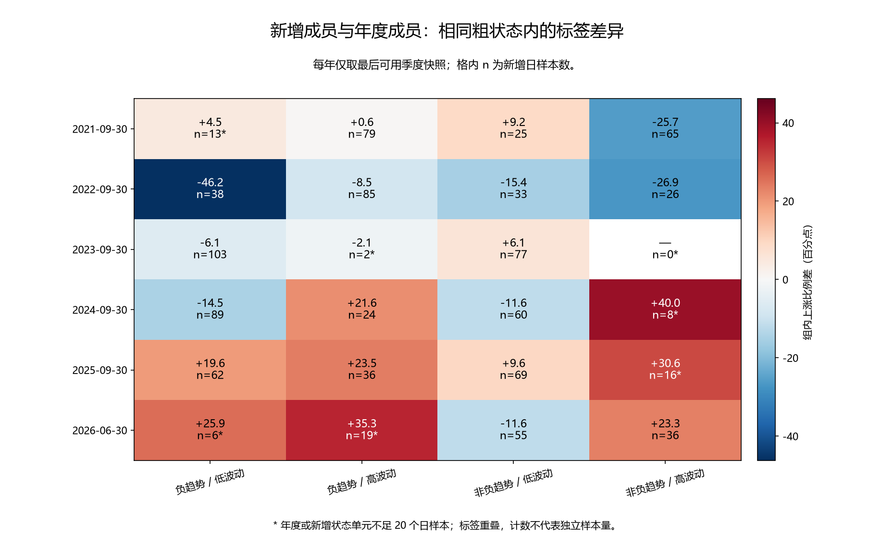
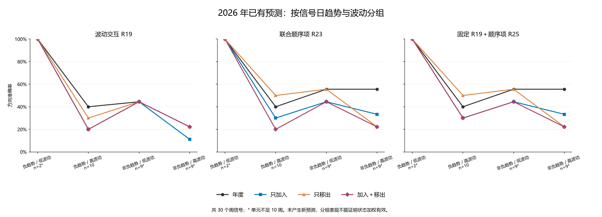

# 第三十六轮：新增训练成员的市场状态与特征覆盖

本轮只对已有数据、模型概率和 R35 操作分解做诊断，没有新增神经训练、分类训练、特征推理、预测或显著性检验。6 组年度状态边界和标签无关的覆盖指标先冻结，再汇总状态内标签与预测结果。所有原准确率及旧 R25 近期 73/125、58.4% 记录保持不变。

## 四个粗状态与时间边界

趋势采用已有 60 日收盘对数变化除以同期日收益标准差与 √60 的描述量，按符号划分：<0 为负趋势，=0 归入非负趋势。20 日波动按年度五年成熟训练成员的中位数划分，等于中位数归低波动。组合形成四组，不搜索状态数或阈值；这些是可观察粗分组，不是已验证的隐含市场状态分类器。

| 使用年度 | 年度校准截止 | 成熟训练日样本 | 20 日波动中位数 |
|---|---|---|---|
| 2021 | 2020-12-31 | 1212 | 0.009776 |
| 2022 | 2021-12-31 | 1211 | 0.010022 |
| 2023 | 2022-12-31 | 1209 | 0.010895 |
| 2024 | 2023-12-31 | 1208 | 0.009868 |
| 2025 | 2024-12-31 | 1206 | 0.009613 |
| 2026 | 2025-12-31 | 1206 | 0.009274 |

每年的边界固定到下一年度模型切换前，对所有季度、方法和种子一致。预测状态只用信号日及之前的价格量数据，边界在信号之前已确定。历史训练成员使用该年度坐标作组内比较，不能把这种诊断解释为在每个历史训练日已经知道年末边界。原 R17 的六格划分和 R29 的状态变化触发器均未改变。

每个训练状态单元少于 20 个日样本、每个预测状态单元少于 10 个周信号，会标记为“小样本”。这是描述性标记，不是有效独立样本数、统计显著性或模型资格判定；日标签重叠，周序列也存在时间依赖。空单元不平滑、不补标签比例、不与别组自动合并。

## 新增成员的状态与标签

年度 A、新增 Q\A、移出 A\Q、保留 A∩Q、完整滚动 Q 均沿用 R35 的成熟成员。季度集合相对年度累计，跨季度、角色相互重叠。下面按每年最后可用季度作单次快照；所有季度保存在 training_state_summary.csv，不能将这些日成员次数直接相加当成独立样本。

### 截至 2021-09-30：年度与新增成员

| 状态 | 年度 n／上涨比例 | 新增 n／上涨比例 | 年度占比 | 新增占比 | 组内上涨比例差 | 样本标记 |
|---|---|---|---|---|---|---|
| 负趋势／低波动 | 102／64.71% | 13／69.23% | 8.42% | 7.14% | +4.52 | 小样本／缺失 |
| 负趋势／高波动 | 353／56.37% | 79／56.96% | 29.13% | 43.41% | +0.59 | 计数达到门槛 |
| 非负趋势／低波动 | 504／54.76% | 25／64.00% | 41.58% | 13.74% | +9.24 | 计数达到门槛 |
| 非负趋势／高波动 | 253／53.36% | 65／27.69% | 20.87% | 35.71% | -25.67 | 计数达到门槛 |

### 截至 2022-09-30：年度与新增成员

| 状态 | 年度 n／上涨比例 | 新增 n／上涨比例 | 年度占比 | 新增占比 | 组内上涨比例差 | 样本标记 |
|---|---|---|---|---|---|---|
| 负趋势／低波动 | 161／64.60% | 38／18.42% | 13.29% | 20.88% | -46.18 | 计数达到门槛 |
| 负趋势／高波动 | 329／53.19% | 85／44.71% | 27.17% | 46.70% | -8.49 | 计数达到门槛 |
| 非负趋势／低波动 | 445／54.83% | 33／39.39% | 36.75% | 18.13% | -15.44 | 计数达到门槛 |
| 非负趋势／高波动 | 276／50.00% | 26／23.08% | 22.79% | 14.29% | -26.92 | 计数达到门槛 |

### 截至 2023-09-30：年度与新增成员

| 状态 | 年度 n／上涨比例 | 新增 n／上涨比例 | 年度占比 | 新增占比 | 组内上涨比例差 | 样本标记 |
|---|---|---|---|---|---|---|
| 负趋势／低波动 | 257／49.81% | 103／43.69% | 21.26% | 56.59% | -6.12 | 计数达到门槛 |
| 负趋势／高波动 | 382／52.09% | 2／50.00% | 31.60% | 1.10% | -2.09 | 小样本／缺失 |
| 非负趋势／低波动 | 348／49.71% | 77／55.84% | 28.78% | 42.31% | +6.13 | 计数达到门槛 |
| 非负趋势／高波动 | 222／48.65% | 0／— | 18.36% | 0.00% | — | 小样本／缺失 |

### 截至 2024-09-30：年度与新增成员

| 状态 | 年度 n／上涨比例 | 新增 n／上涨比例 | 年度占比 | 新增占比 | 组内上涨比例差 | 样本标记 |
|---|---|---|---|---|---|---|
| 负趋势／低波动 | 287／45.99% | 89／31.46% | 23.76% | 49.17% | -14.53 | 计数达到门槛 |
| 负趋势／高波动 | 322／53.42% | 24／75.00% | 26.66% | 13.26% | +21.58 | 计数达到门槛 |
| 非负趋势／低波动 | 317／53.31% | 60／41.67% | 26.24% | 33.15% | -11.65 | 计数达到门槛 |
| 非负趋势／高波动 | 282／47.52% | 8／87.50% | 23.34% | 4.42% | +39.98 | 小样本／缺失 |

### 截至 2025-09-30：年度与新增成员

| 状态 | 年度 n／上涨比例 | 新增 n／上涨比例 | 年度占比 | 新增占比 | 组内上涨比例差 | 样本标记 |
|---|---|---|---|---|---|---|
| 负趋势／低波动 | 330／38.48% | 62／58.06% | 27.36% | 33.88% | +19.58 | 计数达到门槛 |
| 负趋势／高波动 | 319／54.23% | 36／77.78% | 26.45% | 19.67% | +23.55 | 计数达到门槛 |
| 非负趋势／低波动 | 273／52.75% | 69／62.32% | 22.64% | 37.70% | +9.57 | 计数达到门槛 |
| 非负趋势／高波动 | 284／44.37% | 16／75.00% | 23.55% | 8.74% | +30.63 | 小样本／缺失 |

### 截至 2026-06-30：年度与新增成员

| 状态 | 年度 n／上涨比例 | 新增 n／上涨比例 | 年度占比 | 新增占比 | 组内上涨比例差 | 样本标记 |
|---|---|---|---|---|---|---|
| 负趋势／低波动 | 353／40.79% | 6／66.67% | 29.27% | 5.17% | +25.87 | 小样本／缺失 |
| 负趋势／高波动 | 334／54.19% | 19／89.47% | 27.69% | 16.38% | +35.28 | 小样本／缺失 |
| 非负趋势／低波动 | 250／51.60% | 55／40.00% | 20.73% | 47.41% | -11.60 | 计数达到门槛 |
| 非负趋势／高波动 | 269／46.10% | 36／69.44% | 22.31% | 31.03% | +23.35 | 计数达到门槛 |

## 标签比例变化：状态占比与组内变化

设 w 为状态占比、r 为状态内上涨比例。先保持年度组内比例，计算占比变化项 Σ(w新−w年)r年；再计算组内变化项 Σw新(r新−r年)。两项严格还原总体新减年度上涨比例。该顺序固定了年度组内比例，因此是约定的记账方式，不能当作因果分解。

目标某状态没有样本时，其权重为零，不补造该状态上涨率；目标整体为空则不计算。如果目标出现年度没有覆盖的状态，则两项标为不可定义。完整结果同时包括移出、滚动成员，但下表只展示新增成员。

| 季度截止 | 新增日样本 | 年度上涨比例 | 新增上涨比例 | 总体差／百分点 | 占比变化项 | 组内变化项 | 达到计数门槛状态数 |
|---|---|---|---|---|---|---|---|
| 2020-12-31 | 0 | 55.78% | — | — | — | — | 0/4 |
| 2021-03-31 | 58 | 55.78% | 46.55% | -9.22 | -1.92 | -7.31 | 1/4 |
| 2021-06-30 | 118 | 55.78% | 50.00% | -5.78 | -0.21 | -5.56 | 2/4 |
| 2021-09-30 | 182 | 55.78% | 48.35% | -7.42 | -0.10 | -7.32 | 3/4 |
| 2021-12-31 | 0 | 54.58% | — | — | — | — | 0/4 |
| 2022-03-31 | 58 | 54.58% | 24.14% | -30.45 | +2.51 | -32.96 | 1/4 |
| 2022-06-30 | 117 | 54.58% | 41.88% | -12.70 | +0.49 | -13.20 | 2/4 |
| 2022-09-30 | 182 | 54.58% | 35.16% | -19.42 | +0.83 | -20.25 | 4/4 |
| 2022-12-31 | 0 | 50.29% | — | — | — | — | 0/4 |
| 2023-03-31 | 59 | 50.29% | 59.32% | +9.03 | -0.57 | +9.60 | 1/4 |
| 2023-06-30 | 118 | 50.29% | 53.39% | +3.10 | -0.54 | +3.64 | 2/4 |
| 2023-09-30 | 182 | 50.29% | 48.90% | -1.39 | -0.50 | -0.89 | 2/4 |
| 2023-12-31 | 0 | 50.25% | — | — | — | — | 0/4 |
| 2024-03-31 | 58 | 50.25% | 56.90% | +6.65 | -0.09 | +6.74 | 1/4 |
| 2024-06-30 | 117 | 50.25% | 48.72% | -1.53 | +1.00 | -2.53 | 3/4 |
| 2024-09-30 | 181 | 50.25% | 43.09% | -7.15 | -0.78 | -6.38 | 3/4 |
| 2024-12-31 | 0 | 47.26% | — | — | — | — | 0/4 |
| 2025-03-31 | 57 | 47.26% | 57.89% | +10.63 | +0.22 | +10.41 | 1/4 |
| 2025-06-30 | 117 | 47.26% | 58.12% | +10.86 | -1.59 | +12.44 | 2/4 |
| 2025-09-30 | 183 | 47.26% | 65.03% | +17.76 | +0.21 | +17.55 | 3/4 |
| 2025-12-31 | 0 | 47.93% | — | — | — | — | 0/4 |
| 2026-03-31 | 56 | 47.93% | 44.64% | -3.28 | +2.07 | -5.35 | 1/4 |
| 2026-06-30 | 116 | 47.93% | 58.62% | +10.69 | +1.83 | +8.86 | 2/4 |

## 特征覆盖的含义

市场 5 维包含趋势、20 日波动、区间振幅、量变化，以及 60 日符号顺序描述。用年度成员原始描述的 1%／99% 分位数作常见范围，报告严格越界的坐标比例和任一坐标越界率。神经 25 维使用对应种子原年度模型已经保存的截尾边界，检查原始解码特征截尾前的越界情况。

同时记录原始坐标按年度均值／标准差缩放后的均方距离；市场使用年度原始均值与标准差，神经坐标使用原模型截尾训练均值与标准差。没有修改预测用缩放或阈值。神经覆盖先按每个种子计算，再平均种子指标，并非增加了三倍独立样本。5 维与 25 维的任一越界率不能直接比较；这些指标也不是多维异常概率或预测失效判定。

### 2026 年 6 月末：按状态的覆盖

| 角色 | 状态 | 日样本 | 市场任一越界 | 市场坐标越界 | 神经任一越界均值 | 神经坐标越界均值 |
|---|---|---|---|---|---|---|
| 年度成员 | 负趋势／低波动 | 353 | 12.46% | 2.55% | 21.91% | 1.98% |
| 年度成员 | 负趋势／高波动 | 334 | 2.99% | 0.60% | 27.45% | 2.57% |
| 年度成员 | 非负趋势／低波动 | 250 | 9.20% | 1.84% | 29.87% | 2.01% |
| 年度成员 | 非负趋势／高波动 | 269 | 11.52% | 3.87% | 26.27% | 2.00% |
| 新增成员 | 负趋势／低波动 | 6 | 16.67% | 3.33% | 22.22% | 1.33% |
| 新增成员 | 负趋势／高波动 | 19 | 0.00% | 0.00% | 21.05% | 1.61% |
| 新增成员 | 非负趋势／低波动 | 55 | 0.00% | 0.00% | 24.85% | 1.75% |
| 新增成员 | 非负趋势／高波动 | 36 | 0.00% | 0.00% | 28.70% | 2.89% |

全部季度、角色及每个市场描述的越界率、均值、均方距离见 training_state_summary.csv；逐个神经种子覆盖见 decoded_coverage_by_seed.csv。

## 预测发生时的状态

以下用信号日状态对 R35 原概率分组。它描述全体新增成员重拟合后，哪些预测状态出现改善或退步，不能说明训练成员中的哪个状态子集造成了该变化。本轮没有按训练状态删样本或重拟合。四组概率及三种子平均规则都保持原值。

### 2021–2023：原预测的分组表现

| 方法 | 状态 | 组别 | 正确／周数 | 准确率 | Brier↓ | AUROC | 样本标记 |
|---|---|---|---|---|---|---|---|
| 波动交互 R19 | 负趋势／低波动 | 年度 | 21/49 | 42.86% | 0.276921 | 0.522807 | 计数达到门槛 |
| 联合顺序项 R23 | 负趋势／低波动 | 年度 | 21/49 | 42.86% | 0.271982 | 0.545614 | 计数达到门槛 |
| 固定 R19＋顺序项 R25 | 负趋势／低波动 | 年度 | 21/49 | 42.86% | 0.271896 | 0.547368 | 计数达到门槛 |
| 波动交互 R19 | 负趋势／低波动 | 只加入 | 23/49 | 46.94% | 0.273642 | 0.512281 | 计数达到门槛 |
| 联合顺序项 R23 | 负趋势／低波动 | 只加入 | 24/49 | 48.98% | 0.262908 | 0.575439 | 计数达到门槛 |
| 固定 R19＋顺序项 R25 | 负趋势／低波动 | 只加入 | 22/49 | 44.90% | 0.263319 | 0.578947 | 计数达到门槛 |
| 波动交互 R19 | 负趋势／低波动 | 只移出 | 23/49 | 46.94% | 0.278376 | 0.514035 | 计数达到门槛 |
| 联合顺序项 R23 | 负趋势／低波动 | 只移出 | 22/49 | 44.90% | 0.272846 | 0.561404 | 计数达到门槛 |
| 固定 R19＋顺序项 R25 | 负趋势／低波动 | 只移出 | 22/49 | 44.90% | 0.272506 | 0.561404 | 计数达到门槛 |
| 波动交互 R19 | 负趋势／低波动 | 加入＋移出 | 23/49 | 46.94% | 0.275646 | 0.519298 | 计数达到门槛 |
| 联合顺序项 R23 | 负趋势／低波动 | 加入＋移出 | 21/49 | 42.86% | 0.265535 | 0.584211 | 计数达到门槛 |
| 固定 R19＋顺序项 R25 | 负趋势／低波动 | 加入＋移出 | 22/49 | 44.90% | 0.265711 | 0.580702 | 计数达到门槛 |
| 波动交互 R19 | 负趋势／高波动 | 年度 | 23/45 | 51.11% | 0.279825 | 0.353175 | 计数达到门槛 |
| 联合顺序项 R23 | 负趋势／高波动 | 年度 | 21/45 | 46.67% | 0.280654 | 0.349206 | 计数达到门槛 |
| 固定 R19＋顺序项 R25 | 负趋势／高波动 | 年度 | 21/45 | 46.67% | 0.280620 | 0.349206 | 计数达到门槛 |
| 波动交互 R19 | 负趋势／高波动 | 只加入 | 18/45 | 40.00% | 0.275181 | 0.355159 | 计数达到门槛 |
| 联合顺序项 R23 | 负趋势／高波动 | 只加入 | 18/45 | 40.00% | 0.273596 | 0.365079 | 计数达到门槛 |
| 固定 R19＋顺序项 R25 | 负趋势／高波动 | 只加入 | 18/45 | 40.00% | 0.273165 | 0.365079 | 计数达到门槛 |
| 波动交互 R19 | 负趋势／高波动 | 只移出 | 23/45 | 51.11% | 0.279391 | 0.337302 | 计数达到门槛 |
| 联合顺序项 R23 | 负趋势／高波动 | 只移出 | 21/45 | 46.67% | 0.281434 | 0.321429 | 计数达到门槛 |
| 固定 R19＋顺序项 R25 | 负趋势／高波动 | 只移出 | 21/45 | 46.67% | 0.280828 | 0.335317 | 计数达到门槛 |
| 波动交互 R19 | 负趋势／高波动 | 加入＋移出 | 22/45 | 48.89% | 0.274476 | 0.369048 | 计数达到门槛 |
| 联合顺序项 R23 | 负趋势／高波动 | 加入＋移出 | 19/45 | 42.22% | 0.273906 | 0.375000 | 计数达到门槛 |
| 固定 R19＋顺序项 R25 | 负趋势／高波动 | 加入＋移出 | 18/45 | 40.00% | 0.273089 | 0.369048 | 计数达到门槛 |
| 波动交互 R19 | 非负趋势／低波动 | 年度 | 14/35 | 40.00% | 0.296458 | 0.384354 | 计数达到门槛 |
| 联合顺序项 R23 | 非负趋势／低波动 | 年度 | 14/35 | 40.00% | 0.296804 | 0.384354 | 计数达到门槛 |
| 固定 R19＋顺序项 R25 | 非负趋势／低波动 | 年度 | 14/35 | 40.00% | 0.296585 | 0.384354 | 计数达到门槛 |
| 波动交互 R19 | 非负趋势／低波动 | 只加入 | 12/35 | 34.29% | 0.294353 | 0.377551 | 计数达到门槛 |
| 联合顺序项 R23 | 非负趋势／低波动 | 只加入 | 12/35 | 34.29% | 0.290317 | 0.370748 | 计数达到门槛 |
| 固定 R19＋顺序项 R25 | 非负趋势／低波动 | 只加入 | 12/35 | 34.29% | 0.290005 | 0.374150 | 计数达到门槛 |
| 波动交互 R19 | 非负趋势／低波动 | 只移出 | 13/35 | 37.14% | 0.293953 | 0.404762 | 计数达到门槛 |
| 联合顺序项 R23 | 非负趋势／低波动 | 只移出 | 14/35 | 40.00% | 0.294395 | 0.408163 | 计数达到门槛 |
| 固定 R19＋顺序项 R25 | 非负趋势／低波动 | 只移出 | 14/35 | 40.00% | 0.293845 | 0.408163 | 计数达到门槛 |
| 波动交互 R19 | 非负趋势／低波动 | 加入＋移出 | 13/35 | 37.14% | 0.292578 | 0.391156 | 计数达到门槛 |
| 联合顺序项 R23 | 非负趋势／低波动 | 加入＋移出 | 13/35 | 37.14% | 0.288241 | 0.384354 | 计数达到门槛 |
| 固定 R19＋顺序项 R25 | 非负趋势／低波动 | 加入＋移出 | 13/35 | 37.14% | 0.287581 | 0.380952 | 计数达到门槛 |
| 波动交互 R19 | 非负趋势／高波动 | 年度 | 13/18 | 72.22% | 0.240216 | 0.461538 | 计数达到门槛 |
| 联合顺序项 R23 | 非负趋势／高波动 | 年度 | 12/18 | 66.67% | 0.236439 | 0.492308 | 计数达到门槛 |
| 固定 R19＋顺序项 R25 | 非负趋势／高波动 | 年度 | 12/18 | 66.67% | 0.236478 | 0.507692 | 计数达到门槛 |
| 波动交互 R19 | 非负趋势／高波动 | 只加入 | 11/18 | 61.11% | 0.244677 | 0.400000 | 计数达到门槛 |
| 联合顺序项 R23 | 非负趋势／高波动 | 只加入 | 11/18 | 61.11% | 0.240952 | 0.430769 | 计数达到门槛 |
| 固定 R19＋顺序项 R25 | 非负趋势／高波动 | 只加入 | 11/18 | 61.11% | 0.240993 | 0.430769 | 计数达到门槛 |
| 波动交互 R19 | 非负趋势／高波动 | 只移出 | 12/18 | 66.67% | 0.238748 | 0.476923 | 计数达到门槛 |
| 联合顺序项 R23 | 非负趋势／高波动 | 只移出 | 13/18 | 72.22% | 0.234011 | 0.523077 | 计数达到门槛 |
| 固定 R19＋顺序项 R25 | 非负趋势／高波动 | 只移出 | 13/18 | 72.22% | 0.234877 | 0.523077 | 计数达到门槛 |
| 波动交互 R19 | 非负趋势／高波动 | 加入＋移出 | 10/18 | 55.56% | 0.244912 | 0.415385 | 计数达到门槛 |
| 联合顺序项 R23 | 非负趋势／高波动 | 加入＋移出 | 10/18 | 55.56% | 0.241331 | 0.461538 | 计数达到门槛 |
| 固定 R19＋顺序项 R25 | 非负趋势／高波动 | 加入＋移出 | 10/18 | 55.56% | 0.241705 | 0.446154 | 计数达到门槛 |

### 2024–2026 年 8 月：原预测的分组表现

| 方法 | 状态 | 组别 | 正确／周数 | 准确率 | Brier↓ | AUROC | 样本标记 |
|---|---|---|---|---|---|---|---|
| 波动交互 R19 | 负趋势／低波动 | 年度 | 20/32 | 62.50% | 0.235733 | 0.611336 | 计数达到门槛 |
| 联合顺序项 R23 | 负趋势／低波动 | 年度 | 19/32 | 59.38% | 0.240477 | 0.607287 | 计数达到门槛 |
| 固定 R19＋顺序项 R25 | 负趋势／低波动 | 年度 | 19/32 | 59.38% | 0.240527 | 0.611336 | 计数达到门槛 |
| 波动交互 R19 | 负趋势／低波动 | 只加入 | 21/32 | 65.62% | 0.235574 | 0.611336 | 计数达到门槛 |
| 联合顺序项 R23 | 负趋势／低波动 | 只加入 | 19/32 | 59.38% | 0.239192 | 0.595142 | 计数达到门槛 |
| 固定 R19＋顺序项 R25 | 负趋势／低波动 | 只加入 | 19/32 | 59.38% | 0.239723 | 0.595142 | 计数达到门槛 |
| 波动交互 R19 | 负趋势／低波动 | 只移出 | 20/32 | 62.50% | 0.237325 | 0.615385 | 计数达到门槛 |
| 联合顺序项 R23 | 负趋势／低波动 | 只移出 | 19/32 | 59.38% | 0.241659 | 0.578947 | 计数达到门槛 |
| 固定 R19＋顺序项 R25 | 负趋势／低波动 | 只移出 | 19/32 | 59.38% | 0.241564 | 0.574899 | 计数达到门槛 |
| 波动交互 R19 | 负趋势／低波动 | 加入＋移出 | 20/32 | 62.50% | 0.236969 | 0.595142 | 计数达到门槛 |
| 联合顺序项 R23 | 负趋势／低波动 | 加入＋移出 | 19/32 | 59.38% | 0.240232 | 0.587045 | 计数达到门槛 |
| 固定 R19＋顺序项 R25 | 负趋势／低波动 | 加入＋移出 | 19/32 | 59.38% | 0.240679 | 0.582996 | 计数达到门槛 |
| 波动交互 R19 | 负趋势／高波动 | 年度 | 11/20 | 55.00% | 0.237495 | 0.625000 | 计数达到门槛 |
| 联合顺序项 R23 | 负趋势／高波动 | 年度 | 11/20 | 55.00% | 0.233019 | 0.656250 | 计数达到门槛 |
| 固定 R19＋顺序项 R25 | 负趋势／高波动 | 年度 | 11/20 | 55.00% | 0.233062 | 0.645833 | 计数达到门槛 |
| 波动交互 R19 | 负趋势／高波动 | 只加入 | 9/20 | 45.00% | 0.240826 | 0.541667 | 计数达到门槛 |
| 联合顺序项 R23 | 负趋势／高波动 | 只加入 | 10/20 | 50.00% | 0.235293 | 0.625000 | 计数达到门槛 |
| 固定 R19＋顺序项 R25 | 负趋势／高波动 | 只加入 | 10/20 | 50.00% | 0.235294 | 0.635417 | 计数达到门槛 |
| 波动交互 R19 | 负趋势／高波动 | 只移出 | 11/20 | 55.00% | 0.243415 | 0.583333 | 计数达到门槛 |
| 联合顺序项 R23 | 负趋势／高波动 | 只移出 | 13/20 | 65.00% | 0.238459 | 0.614583 | 计数达到门槛 |
| 固定 R19＋顺序项 R25 | 负趋势／高波动 | 只移出 | 13/20 | 65.00% | 0.238480 | 0.625000 | 计数达到门槛 |
| 波动交互 R19 | 负趋势／高波动 | 加入＋移出 | 10/20 | 50.00% | 0.247498 | 0.541667 | 计数达到门槛 |
| 联合顺序项 R23 | 负趋势／高波动 | 加入＋移出 | 10/20 | 50.00% | 0.241294 | 0.614583 | 计数达到门槛 |
| 固定 R19＋顺序项 R25 | 负趋势／高波动 | 加入＋移出 | 11/20 | 55.00% | 0.241518 | 0.614583 | 计数达到门槛 |
| 波动交互 R19 | 非负趋势／低波动 | 年度 | 21/41 | 51.22% | 0.254078 | 0.569378 | 计数达到门槛 |
| 联合顺序项 R23 | 非负趋势／低波动 | 年度 | 23/41 | 56.10% | 0.259056 | 0.526316 | 计数达到门槛 |
| 固定 R19＋顺序项 R25 | 非负趋势／低波动 | 年度 | 23/41 | 56.10% | 0.259212 | 0.523923 | 计数达到门槛 |
| 波动交互 R19 | 非负趋势／低波动 | 只加入 | 21/41 | 51.22% | 0.255541 | 0.547847 | 计数达到门槛 |
| 联合顺序项 R23 | 非负趋势／低波动 | 只加入 | 21/41 | 51.22% | 0.260329 | 0.533493 | 计数达到门槛 |
| 固定 R19＋顺序项 R25 | 非负趋势／低波动 | 只加入 | 22/41 | 53.66% | 0.260003 | 0.531100 | 计数达到门槛 |
| 波动交互 R19 | 非负趋势／低波动 | 只移出 | 22/41 | 53.66% | 0.256683 | 0.569378 | 计数达到门槛 |
| 联合顺序项 R23 | 非负趋势／低波动 | 只移出 | 22/41 | 53.66% | 0.263215 | 0.502392 | 计数达到门槛 |
| 固定 R19＋顺序项 R25 | 非负趋势／低波动 | 只移出 | 22/41 | 53.66% | 0.263206 | 0.507177 | 计数达到门槛 |
| 波动交互 R19 | 非负趋势／低波动 | 加入＋移出 | 20/41 | 48.78% | 0.257922 | 0.569378 | 计数达到门槛 |
| 联合顺序项 R23 | 非负趋势／低波动 | 加入＋移出 | 20/41 | 48.78% | 0.263470 | 0.526316 | 计数达到门槛 |
| 固定 R19＋顺序项 R25 | 非负趋势／低波动 | 加入＋移出 | 21/41 | 51.22% | 0.263173 | 0.521531 | 计数达到门槛 |
| 波动交互 R19 | 非负趋势／高波动 | 年度 | 16/32 | 50.00% | 0.254524 | 0.497976 | 计数达到门槛 |
| 联合顺序项 R23 | 非负趋势／高波动 | 年度 | 19/32 | 59.38% | 0.257715 | 0.497976 | 计数达到门槛 |
| 固定 R19＋顺序项 R25 | 非负趋势／高波动 | 年度 | 18/32 | 56.25% | 0.257570 | 0.497976 | 计数达到门槛 |
| 波动交互 R19 | 非负趋势／高波动 | 只加入 | 12/32 | 37.50% | 0.250680 | 0.506073 | 计数达到门槛 |
| 联合顺序项 R23 | 非负趋势／高波动 | 只加入 | 14/32 | 43.75% | 0.255062 | 0.465587 | 计数达到门槛 |
| 固定 R19＋顺序项 R25 | 非负趋势／高波动 | 只加入 | 15/32 | 46.88% | 0.255119 | 0.465587 | 计数达到门槛 |
| 波动交互 R19 | 非负趋势／高波动 | 只移出 | 16/32 | 50.00% | 0.265248 | 0.465587 | 计数达到门槛 |
| 联合顺序项 R23 | 非负趋势／高波动 | 只移出 | 15/32 | 46.88% | 0.268631 | 0.489879 | 计数达到门槛 |
| 固定 R19＋顺序项 R25 | 非负趋势／高波动 | 只移出 | 15/32 | 46.88% | 0.268669 | 0.485830 | 计数达到门槛 |
| 波动交互 R19 | 非负趋势／高波动 | 加入＋移出 | 15/32 | 46.88% | 0.256181 | 0.473684 | 计数达到门槛 |
| 联合顺序项 R23 | 非负趋势／高波动 | 加入＋移出 | 16/32 | 50.00% | 0.260198 | 0.465587 | 计数达到门槛 |
| 固定 R19＋顺序项 R25 | 非负趋势／高波动 | 加入＋移出 | 16/32 | 50.00% | 0.260749 | 0.465587 | 计数达到门槛 |

### 2026 年：原预测的分组表现

| 方法 | 状态 | 组别 | 正确／周数 | 准确率 | Brier↓ | AUROC | 样本标记 |
|---|---|---|---|---|---|---|---|
| 波动交互 R19 | 负趋势／低波动 | 年度 | 2/2 | 100.00% | 0.212755 | 1.000000 | 小样本／缺失 |
| 联合顺序项 R23 | 负趋势／低波动 | 年度 | 2/2 | 100.00% | 0.217576 | 1.000000 | 小样本／缺失 |
| 固定 R19＋顺序项 R25 | 负趋势／低波动 | 年度 | 2/2 | 100.00% | 0.217583 | 1.000000 | 小样本／缺失 |
| 波动交互 R19 | 负趋势／低波动 | 只加入 | 2/2 | 100.00% | 0.212755 | 1.000000 | 小样本／缺失 |
| 联合顺序项 R23 | 负趋势／低波动 | 只加入 | 2/2 | 100.00% | 0.217576 | 1.000000 | 小样本／缺失 |
| 固定 R19＋顺序项 R25 | 负趋势／低波动 | 只加入 | 2/2 | 100.00% | 0.217583 | 1.000000 | 小样本／缺失 |
| 波动交互 R19 | 负趋势／低波动 | 只移出 | 2/2 | 100.00% | 0.212755 | 1.000000 | 小样本／缺失 |
| 联合顺序项 R23 | 负趋势／低波动 | 只移出 | 2/2 | 100.00% | 0.217576 | 1.000000 | 小样本／缺失 |
| 固定 R19＋顺序项 R25 | 负趋势／低波动 | 只移出 | 2/2 | 100.00% | 0.217583 | 1.000000 | 小样本／缺失 |
| 波动交互 R19 | 负趋势／低波动 | 加入＋移出 | 2/2 | 100.00% | 0.212755 | 1.000000 | 小样本／缺失 |
| 联合顺序项 R23 | 负趋势／低波动 | 加入＋移出 | 2/2 | 100.00% | 0.217576 | 1.000000 | 小样本／缺失 |
| 固定 R19＋顺序项 R25 | 负趋势／低波动 | 加入＋移出 | 2/2 | 100.00% | 0.217583 | 1.000000 | 小样本／缺失 |
| 波动交互 R19 | 负趋势／高波动 | 年度 | 4/10 | 40.00% | 0.260183 | 0.360000 | 计数达到门槛 |
| 联合顺序项 R23 | 负趋势／高波动 | 年度 | 4/10 | 40.00% | 0.257057 | 0.360000 | 计数达到门槛 |
| 固定 R19＋顺序项 R25 | 负趋势／高波动 | 年度 | 4/10 | 40.00% | 0.257071 | 0.360000 | 计数达到门槛 |
| 波动交互 R19 | 负趋势／高波动 | 只加入 | 2/10 | 20.00% | 0.269753 | 0.200000 | 计数达到门槛 |
| 联合顺序项 R23 | 负趋势／高波动 | 只加入 | 3/10 | 30.00% | 0.264221 | 0.280000 | 计数达到门槛 |
| 固定 R19＋顺序项 R25 | 负趋势／高波动 | 只加入 | 3/10 | 30.00% | 0.264095 | 0.280000 | 计数达到门槛 |
| 波动交互 R19 | 负趋势／高波动 | 只移出 | 3/10 | 30.00% | 0.266364 | 0.280000 | 计数达到门槛 |
| 联合顺序项 R23 | 负趋势／高波动 | 只移出 | 5/10 | 50.00% | 0.262953 | 0.240000 | 计数达到门槛 |
| 固定 R19＋顺序项 R25 | 负趋势／高波动 | 只移出 | 5/10 | 50.00% | 0.262803 | 0.240000 | 计数达到门槛 |
| 波动交互 R19 | 负趋势／高波动 | 加入＋移出 | 2/10 | 20.00% | 0.277738 | 0.200000 | 计数达到门槛 |
| 联合顺序项 R23 | 负趋势／高波动 | 加入＋移出 | 2/10 | 20.00% | 0.271458 | 0.240000 | 计数达到门槛 |
| 固定 R19＋顺序项 R25 | 负趋势／高波动 | 加入＋移出 | 3/10 | 30.00% | 0.271721 | 0.280000 | 计数达到门槛 |
| 波动交互 R19 | 非负趋势／低波动 | 年度 | 4/9 | 44.44% | 0.241132 | 0.666667 | 小样本／缺失 |
| 联合顺序项 R23 | 非负趋势／低波动 | 年度 | 5/9 | 55.56% | 0.241941 | 0.666667 | 小样本／缺失 |
| 固定 R19＋顺序项 R25 | 非负趋势／低波动 | 年度 | 5/9 | 55.56% | 0.241913 | 0.666667 | 小样本／缺失 |
| 波动交互 R19 | 非负趋势／低波动 | 只加入 | 4/9 | 44.44% | 0.244515 | 0.611111 | 小样本／缺失 |
| 联合顺序项 R23 | 非负趋势／低波动 | 只加入 | 4/9 | 44.44% | 0.245449 | 0.611111 | 小样本／缺失 |
| 固定 R19＋顺序项 R25 | 非负趋势／低波动 | 只加入 | 4/9 | 44.44% | 0.245400 | 0.611111 | 小样本／缺失 |
| 波动交互 R19 | 非负趋势／低波动 | 只移出 | 4/9 | 44.44% | 0.238483 | 0.666667 | 小样本／缺失 |
| 联合顺序项 R23 | 非负趋势／低波动 | 只移出 | 5/9 | 55.56% | 0.239144 | 0.666667 | 小样本／缺失 |
| 固定 R19＋顺序项 R25 | 非负趋势／低波动 | 只移出 | 5/9 | 55.56% | 0.239124 | 0.666667 | 小样本／缺失 |
| 波动交互 R19 | 非负趋势／低波动 | 加入＋移出 | 4/9 | 44.44% | 0.242547 | 0.666667 | 小样本／缺失 |
| 联合顺序项 R23 | 非负趋势／低波动 | 加入＋移出 | 4/9 | 44.44% | 0.243290 | 0.611111 | 小样本／缺失 |
| 固定 R19＋顺序项 R25 | 非负趋势／低波动 | 加入＋移出 | 4/9 | 44.44% | 0.243273 | 0.611111 | 小样本／缺失 |
| 波动交互 R19 | 非负趋势／高波动 | 年度 | 2/9 | 22.22% | 0.280833 | 0.150000 | 小样本／缺失 |
| 联合顺序项 R23 | 非负趋势／高波动 | 年度 | 5/9 | 55.56% | 0.281224 | 0.250000 | 小样本／缺失 |
| 固定 R19＋顺序项 R25 | 非负趋势／高波动 | 年度 | 5/9 | 55.56% | 0.281094 | 0.250000 | 小样本／缺失 |
| 波动交互 R19 | 非负趋势／高波动 | 只加入 | 1/9 | 11.11% | 0.285131 | 0.150000 | 小样本／缺失 |
| 联合顺序项 R23 | 非负趋势／高波动 | 只加入 | 3/9 | 33.33% | 0.291166 | 0.200000 | 小样本／缺失 |
| 固定 R19＋顺序项 R25 | 非负趋势／高波动 | 只加入 | 3/9 | 33.33% | 0.291030 | 0.200000 | 小样本／缺失 |
| 波动交互 R19 | 非负趋势／高波动 | 只移出 | 2/9 | 22.22% | 0.280355 | 0.100000 | 小样本／缺失 |
| 联合顺序项 R23 | 非负趋势／高波动 | 只移出 | 2/9 | 22.22% | 0.281584 | 0.150000 | 小样本／缺失 |
| 固定 R19＋顺序项 R25 | 非负趋势／高波动 | 只移出 | 2/9 | 22.22% | 0.281418 | 0.150000 | 小样本／缺失 |
| 波动交互 R19 | 非负趋势／高波动 | 加入＋移出 | 2/9 | 22.22% | 0.287427 | 0.100000 | 小样本／缺失 |
| 联合顺序项 R23 | 非负趋势／高波动 | 加入＋移出 | 2/9 | 22.22% | 0.293709 | 0.150000 | 小样本／缺失 |
| 固定 R19＋顺序项 R25 | 非负趋势／高波动 | 加入＋移出 | 2/9 | 22.22% | 0.294069 | 0.150000 | 小样本／缺失 |

### 2026 年：加入与移出影响按信号状态分组

| 方法 | 信号状态 | 周数 | 完整滚动对→错 | 错→对 | 加入贡献／概率百分点 | 移出贡献 | 新增同状态训练计数达标周 |
|---|---|---|---|---|---|---|---|
| 波动交互 R19 | 负趋势／低波动 | 2 | 0 | 0 | +0.00 | +0.00 | 0 |
| 联合顺序项 R23 | 负趋势／低波动 | 2 | 0 | 0 | +0.00 | +0.00 | 0 |
| 固定 R19＋顺序项 R25 | 负趋势／低波动 | 2 | 0 | 0 | +0.00 | +0.00 | 0 |
| 波动交互 R19 | 负趋势／高波动 | 10 | 2 | 0 | -1.03 | -0.64 | 0 |
| 联合顺序项 R23 | 负趋势／高波动 | 10 | 3 | 1 | -0.87 | -0.59 | 0 |
| 固定 R19＋顺序项 R25 | 负趋势／高波动 | 10 | 3 | 2 | -0.88 | -0.59 | 0 |
| 波动交互 R19 | 非负趋势／低波动 | 9 | 0 | 0 | -0.40 | +0.25 | 2 |
| 联合顺序项 R23 | 非负趋势／低波动 | 9 | 1 | 0 | -0.40 | +0.27 | 2 |
| 固定 R19＋顺序项 R25 | 非负趋势／低波动 | 9 | 1 | 0 | -0.40 | +0.27 | 2 |
| 波动交互 R19 | 非负趋势／高波动 | 9 | 0 | 0 | -0.51 | -0.12 | 2 |
| 联合顺序项 R23 | 非负趋势／高波动 | 9 | 3 | 0 | -1.01 | -0.23 | 2 |
| 固定 R19＋顺序项 R25 | 非负趋势／高波动 | 9 | 3 | 0 | -1.04 | -0.25 | 2 |

加入／移出贡献沿用 R35 的两种操作顺序平均，再按随后实际方向调整符号；负值表示背离实际方向。表内是概率百分点，不是准确率变化。训练计数达标表示该周之前的年度与新增同状态成员均不少于 20 个；不意味着标签关系稳定。所有年度、状态及稳定正确／稳定错误／退步／改善分类完整保留。

## 复核与限制

6 组年度中位数、分位数与均值尺度用独立算术核对；23 个季度段的描述量通过未来价格扰动检查。市场与神经覆盖按逐坐标标量算法复核，最大绝对差 1.78e-15。460 个训练状态单元、576 个融合预测单元、1,728 个种子预测单元，以及标签分解与所有空／单类指标均复核。

按状态相加可恢复原全段正确周数和 Brier，1,088 组周方法的原概率和操作效应不变。5,250 个旧证据文件保持不变。本轮没有新增显著性检验；R35 的 60 项探索比较原样归档。

状态划分粗、部分单元小、同一年度的新增集合累计重叠；条件上涨比例变化还可能来自未纳入状态的因素。所有历史结果已经查看，不能用本轮分组结果证明状态权重的未来收益，也不能直接按已知错误周设置权重或排除样本。年度主对照、交互设计及旧 R25 58.4% 记录继续保留。

协议 SHA256：`6147fabb809e0e1b8584237dfad47b1e70474091435d3ac78dcf7a40bc8735e2`
