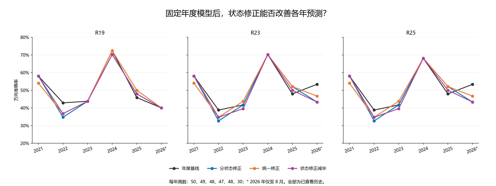
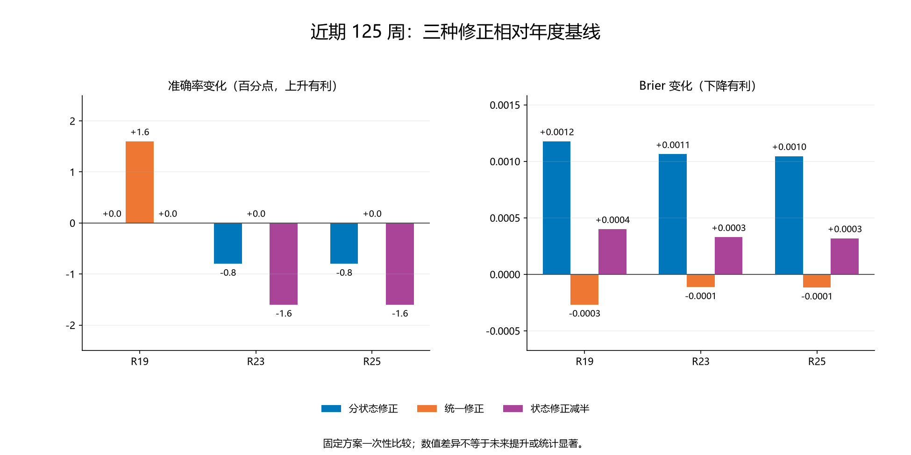

# 第三十七轮：年度模型上的受约束状态修正

本轮训练了少量新增修正参数，并生成新的历史滚动预测；年度神经网络、变换、分类主系数和交互系数全部固定。四状态沿用 R36 的年度边界，没有搜索状态数或波动阈值。全部 272 个历史周结果此前已查看，本轮是探索性历史比较，不是新增盲测。

## 固定规则

每季度使用相对该年度训练集新增、且联合标签已成熟的日样本。对每个方法和种子，用年度模型计算这些样本的原 logit z；每个有至少 20 个新增日成员的状态只拟合一个截距修正 d。目标为 Σ[log(1+exp(z+d))−y(z+d)]+20d²/2，且 |d|≤0.5。小于 20 个时 d=0，预测精确回退年度概率。每日标签有重叠，20 是预定启用规则，并非独立有效样本数或可靠性保证。

收缩强度 20、上限 0.5 在新预测前固定，未搜索。0.5 logit 上限最多改变约 12.44 个概率百分点；这不是固定加减 12.44 个百分点，也不是准确率保证。修正从零重算，季度之间不累加；每次年度模型切换后清零。新增训练样本集合跨季度累计重叠，不能将各季度计数相加当成独立样本。

统一修正对照使用相同的达标状态和样本，并把所有达标状态的修正强制相等。若有 K 个达标状态，共享截距的惩罚为 20K d²/2。因此它是分状态目标的等值约束版本；预测落在不达标状态时同样回退。只剩一个达标状态时两者相同。它不是对全部新样本无条件拟合的截距。

减半对照直接取已拟合状态修正的 0.5 倍，无新增拟合。三种子分别修正再转为概率，最后等权平均概率，并以严格大于 0.5 判上涨。R25 保持年度 R19 非顺序系数及原年度 gamma，只额外添加本轮截距；修正后的 R25 是新候选。原 native_mse 和训练频率对照直接复制年度结果，不做状态修正。

本轮实际拟合 408 个状态标量及 204 个共享标量；复用 18 个年度特征库，0 次新神经训练、0 次新变换拟合、0 次新特征推理。生成 9,792 条新学习模型种子预测；另复制年度控制行 3,264 条。

## 2021—2023：147 周

| 方法 | 方案 | 正确／周数 | 准确率 | Brier↓ | 对数损失↓ | 平衡准确率 | AUROC |
|---|---|---|---|---|---|---|---|
| R19 | 年度基线 | 71/147 | 48.30% | 0.277967 | 0.752923 | 50.28% | 0.468121 |
| R19 | 分状态修正（主方案） | 67/147 | 45.58% | 0.277485 | 0.751723 | 46.61% | 0.464326 |
| R19 | 统一修正（匹配对照） | 66/147 | 44.90% | 0.278101 | 0.752310 | 45.81% | 0.451044 |
| R19 | 状态修正减半 | 68/147 | 46.26% | 0.277420 | 0.751528 | 47.42% | 0.463947 |
| R19 | R35 只加入重拟合 | 64/147 | 43.54% | 0.275498 | 0.746584 | 45.50% | 0.456736 |
| R19 | R35 完整滚动系数 | 68/147 | 46.26% | 0.275556 | 0.746478 | 48.73% | 0.456357 |
| R23 | 年度基线 | 68/147 | 46.26% | 0.276195 | 0.749569 | 48.29% | 0.476850 |
| R23 | 分状态修正（主方案） | 65/147 | 44.22% | 0.275735 | 0.748723 | 45.22% | 0.472296 |
| R23 | 统一修正（匹配对照） | 65/147 | 44.22% | 0.276366 | 0.749078 | 45.22% | 0.457495 |
| R23 | 状态修正减半 | 65/147 | 44.22% | 0.275665 | 0.748375 | 45.44% | 0.475142 |
| R23 | R35 只加入重拟合 | 65/147 | 44.22% | 0.270017 | 0.735240 | 46.09% | 0.469070 |
| R23 | R35 完整滚动系数 | 63/147 | 42.86% | 0.270540 | 0.736072 | 45.57% | 0.471347 |
| R25 | 年度基线 | 68/147 | 46.26% | 0.276108 | 0.749367 | 48.29% | 0.475712 |
| R25 | 分状态修正（主方案） | 65/147 | 44.22% | 0.275637 | 0.748500 | 45.22% | 0.470778 |
| R25 | 统一修正（匹配对照） | 65/147 | 44.22% | 0.276286 | 0.748898 | 45.22% | 0.455977 |
| R25 | 状态修正减半 | 65/147 | 44.22% | 0.275573 | 0.748163 | 45.44% | 0.474953 |
| R25 | R35 只加入重拟合 | 63/147 | 42.86% | 0.269953 | 0.735101 | 44.91% | 0.467932 |
| R25 | R35 完整滚动系数 | 63/147 | 42.86% | 0.270237 | 0.735439 | 45.57% | 0.469829 |

## 2024—2026 年 8 月：125 周

| 方法 | 方案 | 正确／周数 | 准确率 | Brier↓ | 对数损失↓ | 平衡准确率 | AUROC |
|---|---|---|---|---|---|---|---|
| R19 | 年度基线 | 68/125 | 54.40% | 0.246843 | 0.687439 | 55.02% | 0.582435 |
| R19 | 分状态修正（主方案） | 68/125 | 54.40% | 0.248020 | 0.689535 | 55.11% | 0.572419 |
| R19 | 统一修正（匹配对照） | 70/125 | 56.00% | 0.246575 | 0.686765 | 56.63% | 0.583719 |
| R19 | 状态修正减半 | 68/125 | 54.40% | 0.247243 | 0.688101 | 55.11% | 0.577812 |
| R19 | R35 只加入重拟合 | 63/125 | 50.40% | 0.246831 | 0.687192 | 50.96% | 0.576785 |
| R19 | R35 完整滚动系数 | 65/125 | 52.00% | 0.250445 | 0.694781 | 52.75% | 0.559322 |
| R23 | 年度基线 | 72/125 | 57.60% | 0.249790 | 0.693613 | 58.41% | 0.563174 |
| R23 | 分状态修正（主方案） | 71/125 | 56.80% | 0.250854 | 0.695460 | 57.65% | 0.545198 |
| R23 | 统一修正（匹配对照） | 72/125 | 57.60% | 0.249677 | 0.693286 | 58.32% | 0.559836 |
| R23 | 状态修正减半 | 70/125 | 56.00% | 0.250119 | 0.694139 | 56.81% | 0.556497 |
| R23 | R35 只加入重拟合 | 64/125 | 51.20% | 0.249564 | 0.692845 | 51.63% | 0.558808 |
| R23 | R35 完整滚动系数 | 65/125 | 52.00% | 0.253135 | 0.700368 | 52.84% | 0.547252 |
| R25 | 年度基线 | 71/125 | 56.80% | 0.249824 | 0.693671 | 57.65% | 0.562917 |
| R25 | 分状态修正（主方案） | 70/125 | 56.00% | 0.250870 | 0.695488 | 56.90% | 0.544941 |
| R25 | 统一修正（匹配对照） | 71/125 | 56.80% | 0.249708 | 0.693343 | 57.56% | 0.558808 |
| R25 | 状态修正减半 | 69/125 | 55.20% | 0.250143 | 0.694179 | 56.05% | 0.555470 |
| R25 | R35 只加入重拟合 | 66/125 | 52.80% | 0.249608 | 0.692938 | 53.24% | 0.559065 |
| R25 | R35 完整滚动系数 | 67/125 | 53.60% | 0.253329 | 0.700757 | 54.35% | 0.546995 |

## 全段：272 周

| 方法 | 方案 | 正确／周数 | 准确率 | Brier↓ | 对数损失↓ | 平衡准确率 | AUROC |
|---|---|---|---|---|---|---|---|
| R19 | 年度基线 | 139/272 | 51.10% | 0.263664 | 0.722829 | 51.22% | 0.499132 |
| R19 | 分状态修正（主方案） | 135/272 | 49.63% | 0.263944 | 0.723144 | 49.52% | 0.491753 |
| R19 | 统一修正（匹配对照） | 136/272 | 50.00% | 0.263613 | 0.722189 | 49.91% | 0.489258 |
| R19 | 状态修正减半 | 136/272 | 50.00% | 0.263552 | 0.722379 | 49.91% | 0.494575 |
| R19 | R35 只加入重拟合 | 127/272 | 46.69% | 0.262324 | 0.719290 | 46.83% | 0.490885 |
| R19 | R35 完整滚动系数 | 133/272 | 48.90% | 0.264016 | 0.722720 | 49.05% | 0.479275 |
| R23 | 年度基线 | 140/272 | 51.47% | 0.264060 | 0.723854 | 51.52% | 0.496799 |
| R23 | 分状态修正（主方案） | 136/272 | 50.00% | 0.264301 | 0.724246 | 49.83% | 0.486437 |
| R23 | 统一修正（匹配对照） | 137/272 | 50.37% | 0.264100 | 0.723439 | 50.26% | 0.483453 |
| R23 | 状态修正减半 | 135/272 | 49.63% | 0.263925 | 0.723450 | 49.52% | 0.491211 |
| R23 | R35 只加入重拟合 | 129/272 | 47.43% | 0.260618 | 0.715757 | 47.61% | 0.492947 |
| R23 | R35 完整滚动系数 | 128/272 | 47.06% | 0.262541 | 0.719664 | 47.22% | 0.484809 |
| R25 | 年度基线 | 139/272 | 51.10% | 0.264029 | 0.723771 | 51.13% | 0.496257 |
| R25 | 分状态修正（主方案） | 135/272 | 49.63% | 0.264255 | 0.724138 | 49.44% | 0.485948 |
| R25 | 统一修正（匹配对照） | 136/272 | 50.00% | 0.264072 | 0.723367 | 49.87% | 0.482693 |
| R25 | 状态修正减半 | 134/272 | 49.26% | 0.263886 | 0.723354 | 49.13% | 0.490777 |
| R25 | R35 只加入重拟合 | 129/272 | 47.43% | 0.260603 | 0.715725 | 47.66% | 0.492296 |
| R25 | R35 完整滚动系数 | 130/272 | 47.79% | 0.262467 | 0.719500 | 48.00% | 0.484918 |

## 各年结果

### R19

| 年份 | 周数 | 年度 | 分状态 | 统一 | 减半 |
|---|---|---|---|---|---|
| 2021 | 50 | 29（58.00%） | 29（58.00%） | 27（54.00%） | 29（58.00%） |
| 2022 | 49 | 21（42.86%） | 17（34.69%） | 18（36.73%） | 18（36.73%） |
| 2023 | 48 | 21（43.75%） | 21（43.75%） | 21（43.75%） | 21（43.75%） |
| 2024 | 47 | 34（72.34%） | 33（70.21%） | 34（72.34%） | 33（70.21%） |
| 2025 | 48 | 22（45.83%） | 23（47.92%） | 24（50.00%） | 23（47.92%） |
| 2026 | 30 | 12（40.00%） | 12（40.00%） | 12（40.00%） | 12（40.00%） |

### R23

| 年份 | 周数 | 年度 | 分状态 | 统一 | 减半 |
|---|---|---|---|---|---|
| 2021 | 50 | 29（58.00%） | 29（58.00%） | 27（54.00%） | 29（58.00%） |
| 2022 | 49 | 19（38.78%） | 16（32.65%） | 17（34.69%） | 17（34.69%） |
| 2023 | 48 | 20（41.67%） | 20（41.67%） | 21（43.75%） | 19（39.58%） |
| 2024 | 47 | 33（70.21%） | 33（70.21%） | 33（70.21%） | 33（70.21%） |
| 2025 | 48 | 23（47.92%） | 25（52.08%） | 25（52.08%） | 24（50.00%） |
| 2026 | 30 | 16（53.33%） | 13（43.33%） | 14（46.67%） | 13（43.33%） |

### R25

| 年份 | 周数 | 年度 | 分状态 | 统一 | 减半 |
|---|---|---|---|---|---|
| 2021 | 50 | 29（58.00%） | 29（58.00%） | 27（54.00%） | 29（58.00%） |
| 2022 | 49 | 19（38.78%） | 16（32.65%） | 17（34.69%） | 17（34.69%） |
| 2023 | 48 | 20（41.67%） | 20（41.67%） | 21（43.75%） | 19（39.58%） |
| 2024 | 47 | 32（68.09%） | 32（68.09%） | 32（68.09%） | 32（68.09%） |
| 2025 | 48 | 23（47.92%） | 25（52.08%） | 25（52.08%） | 24（50.00%） |
| 2026 | 30 | 16（53.33%） | 13（43.33%） | 14（46.67%） | 13（43.33%） |

## 修正触发与方向改变

| 时段 | 方法 | 方案 | 有支持／全部周 | 错→对 | 对→错 | 平均实际方向概率变化 |
|---|---|---|---|---|---|---|
| extension_2021_2023 | R23 | 统一修正（匹配对照） | 72/147 | 6 | 9 | -0.104 个百分点 |
| extension_2021_2023 | R25 | 统一修正（匹配对照） | 72/147 | 6 | 9 | -0.103 个百分点 |
| extension_2021_2023 | R19 | 统一修正（匹配对照） | 72/147 | 4 | 9 | -0.111 个百分点 |
| extension_2021_2023 | R23 | 分状态修正（主方案） | 72/147 | 4 | 7 | +0.083 个百分点 |
| extension_2021_2023 | R25 | 分状态修正（主方案） | 72/147 | 4 | 7 | +0.084 个百分点 |
| extension_2021_2023 | R19 | 分状态修正（主方案） | 72/147 | 3 | 7 | +0.067 个百分点 |
| extension_2021_2023 | R23 | 状态修正减半 | 72/147 | 3 | 6 | +0.037 个百分点 |
| extension_2021_2023 | R25 | 状态修正减半 | 72/147 | 3 | 6 | +0.038 个百分点 |
| extension_2021_2023 | R19 | 状态修正减半 | 72/147 | 3 | 6 | +0.029 个百分点 |
| recent_2024_2026 | R23 | 统一修正（匹配对照） | 31/125 | 2 | 2 | -0.014 个百分点 |
| recent_2024_2026 | R25 | 统一修正（匹配对照） | 31/125 | 2 | 2 | -0.014 个百分点 |
| recent_2024_2026 | R19 | 统一修正（匹配对照） | 31/125 | 3 | 1 | +0.003 个百分点 |
| recent_2024_2026 | R23 | 分状态修正（主方案） | 31/125 | 4 | 5 | -0.067 个百分点 |
| recent_2024_2026 | R25 | 分状态修正（主方案） | 31/125 | 4 | 5 | -0.066 个百分点 |
| recent_2024_2026 | R19 | 分状态修正（主方案） | 31/125 | 4 | 4 | -0.058 个百分点 |
| recent_2024_2026 | R23 | 状态修正减半 | 31/125 | 2 | 4 | -0.031 个百分点 |
| recent_2024_2026 | R25 | 状态修正减半 | 31/125 | 2 | 4 | -0.030 个百分点 |
| recent_2024_2026 | R19 | 状态修正减半 | 31/125 | 2 | 2 | -0.027 个百分点 |
| year_2026 | R23 | 统一修正（匹配对照） | 4/30 | 0 | 2 | -0.433 个百分点 |
| year_2026 | R25 | 统一修正（匹配对照） | 4/30 | 0 | 2 | -0.433 个百分点 |
| year_2026 | R19 | 统一修正（匹配对照） | 4/30 | 0 | 0 | -0.403 个百分点 |
| year_2026 | R23 | 分状态修正（主方案） | 4/30 | 0 | 3 | -0.840 个百分点 |
| year_2026 | R25 | 分状态修正（主方案） | 4/30 | 0 | 3 | -0.840 个百分点 |
| year_2026 | R19 | 分状态修正（主方案） | 4/30 | 0 | 0 | -0.799 个百分点 |
| year_2026 | R23 | 状态修正减半 | 4/30 | 0 | 3 | -0.420 个百分点 |
| year_2026 | R25 | 状态修正减半 | 4/30 | 0 | 3 | -0.421 个百分点 |
| year_2026 | R19 | 状态修正减半 | 4/30 | 0 | 0 | -0.401 个百分点 |

触发取决于该信号状态在当期新增训练样本中的计数。修正后即使概率改变，方向也可能不变；方向变化同时列出改善与退步，不只展示成功案例。逐周概率、种子修正和全部 2026 年案例保存在 CSV。

## 2026 年修正参数与小样本

### 截至 2026-03-31

| 方法 | 状态 | 新增日样本 | 处理 | 新增上涨率 | 年度预测均值（三种子） | 平均 logit 修正 | 种子范围 |
|---|---|---|---|---|---|---|---|
| R19 | 负趋势／低波动 | 6 | 回退 | 66.67% | 47.07% | +0.0000 | +0.0000～+0.0000 |
| R19 | 负趋势／高波动 | 1 | 回退 | 100.00% | 44.35% | +0.0000 | +0.0000～+0.0000 |
| R19 | 非负趋势／低波动 | 44 | 启用 | 34.09% | 49.07% | -0.2145 | -0.2308～-0.1928 |
| R19 | 非负趋势／高波动 | 5 | 回退 | 100.00% | 49.68% | +0.0000 | +0.0000～+0.0000 |
| R23 | 负趋势／低波动 | 6 | 回退 | 66.67% | 47.48% | +0.0000 | +0.0000～+0.0000 |
| R23 | 负趋势／高波动 | 1 | 回退 | 100.00% | 45.35% | +0.0000 | +0.0000～+0.0000 |
| R23 | 非负趋势／低波动 | 44 | 启用 | 34.09% | 49.39% | -0.2190 | -0.2306～-0.1988 |
| R23 | 非负趋势／高波动 | 5 | 回退 | 100.00% | 50.57% | +0.0000 | +0.0000～+0.0000 |
| R25 | 负趋势／低波动 | 6 | 回退 | 66.67% | 47.49% | +0.0000 | +0.0000～+0.0000 |
| R25 | 负趋势／高波动 | 1 | 回退 | 100.00% | 45.34% | +0.0000 | +0.0000～+0.0000 |
| R25 | 非负趋势／低波动 | 44 | 启用 | 34.09% | 49.38% | -0.2188 | -0.2306～-0.1983 |
| R25 | 非负趋势／高波动 | 5 | 回退 | 100.00% | 50.55% | +0.0000 | +0.0000～+0.0000 |

### 截至 2026-06-30

| 方法 | 状态 | 新增日样本 | 处理 | 新增上涨率 | 年度预测均值（三种子） | 平均 logit 修正 | 种子范围 |
|---|---|---|---|---|---|---|---|
| R19 | 负趋势／低波动 | 6 | 回退 | 66.67% | 47.07% | +0.0000 | +0.0000～+0.0000 |
| R19 | 负趋势／高波动 | 19 | 回退 | 89.47% | 46.12% | +0.0000 | +0.0000～+0.0000 |
| R19 | 非负趋势／低波动 | 55 | 启用 | 40.00% | 50.05% | -0.1661 | -0.1745～-0.1588 |
| R19 | 非负趋势／高波动 | 36 | 启用 | 69.44% | 46.61% | +0.2859 | +0.2702～+0.3033 |
| R23 | 负趋势／低波动 | 6 | 回退 | 66.67% | 47.48% | +0.0000 | +0.0000～+0.0000 |
| R23 | 负趋势／高波动 | 19 | 回退 | 89.47% | 44.77% | +0.0000 | +0.0000～+0.0000 |
| R23 | 非负趋势／低波动 | 55 | 启用 | 40.00% | 50.05% | -0.1653 | -0.1874～-0.1501 |
| R23 | 非负趋势／高波动 | 36 | 启用 | 69.44% | 45.97% | +0.2953 | +0.2615～+0.3464 |
| R25 | 负趋势／低波动 | 6 | 回退 | 66.67% | 47.49% | +0.0000 | +0.0000～+0.0000 |
| R25 | 负趋势／高波动 | 19 | 回退 | 89.47% | 44.76% | +0.0000 | +0.0000～+0.0000 |
| R25 | 非负趋势／低波动 | 55 | 启用 | 40.00% | 50.03% | -0.1650 | -0.1872～-0.1502 |
| R25 | 非负趋势／高波动 | 36 | 启用 | 69.44% | 45.96% | +0.2954 | +0.2618～+0.3461 |

标签上涨率与年度预测均值的偏差决定修正的训练方向；R36 的年度标签均值差异不能直接代替模型残差。本轮训练集数值用于描述拟合，不是周预测成绩。

### 2026 年按信号状态评估

| 方法 | 状态 | 方案 | 正确／周数 | 准确率 | Brier↓ | 样本标记 |
|---|---|---|---|---|---|---|
| R19 | 负趋势／低波动 | 年度基线 | 2/2 | 100.00% | 0.212755 | 不足10周 |
| R19 | 负趋势／高波动 | 年度基线 | 4/10 | 40.00% | 0.260183 | 至少10周 |
| R19 | 非负趋势／低波动 | 年度基线 | 4/9 | 44.44% | 0.241132 | 不足10周 |
| R19 | 非负趋势／高波动 | 年度基线 | 2/9 | 22.22% | 0.280833 | 不足10周 |
| R23 | 负趋势／低波动 | 年度基线 | 2/2 | 100.00% | 0.217576 | 不足10周 |
| R23 | 负趋势／高波动 | 年度基线 | 4/10 | 40.00% | 0.257057 | 至少10周 |
| R23 | 非负趋势／低波动 | 年度基线 | 5/9 | 55.56% | 0.241941 | 不足10周 |
| R23 | 非负趋势／高波动 | 年度基线 | 5/9 | 55.56% | 0.281224 | 不足10周 |
| R25 | 负趋势／低波动 | 年度基线 | 2/2 | 100.00% | 0.217583 | 不足10周 |
| R25 | 负趋势／高波动 | 年度基线 | 4/10 | 40.00% | 0.257071 | 至少10周 |
| R25 | 非负趋势／低波动 | 年度基线 | 5/9 | 55.56% | 0.241913 | 不足10周 |
| R25 | 非负趋势／高波动 | 年度基线 | 5/9 | 55.56% | 0.281094 | 不足10周 |
| R19 | 负趋势／低波动 | 分状态修正（主方案） | 2/2 | 100.00% | 0.212755 | 不足10周 |
| R19 | 负趋势／高波动 | 分状态修正（主方案） | 4/10 | 40.00% | 0.260183 | 至少10周 |
| R19 | 非负趋势／低波动 | 分状态修正（主方案） | 4/9 | 44.44% | 0.251966 | 不足10周 |
| R19 | 非负趋势／高波动 | 分状态修正（主方案） | 2/9 | 22.22% | 0.297893 | 不足10周 |
| R23 | 负趋势／低波动 | 分状态修正（主方案） | 2/2 | 100.00% | 0.217576 | 不足10周 |
| R23 | 负趋势／高波动 | 分状态修正（主方案） | 4/10 | 40.00% | 0.257057 | 至少10周 |
| R23 | 非负趋势／低波动 | 分状态修正（主方案） | 4/9 | 44.44% | 0.253598 | 不足10周 |
| R23 | 非负趋势／高波动 | 分状态修正（主方案） | 3/9 | 33.33% | 0.298151 | 不足10周 |
| R25 | 负趋势／低波动 | 分状态修正（主方案） | 2/2 | 100.00% | 0.217583 | 不足10周 |
| R25 | 负趋势／高波动 | 分状态修正（主方案） | 4/10 | 40.00% | 0.257071 | 至少10周 |
| R25 | 非负趋势／低波动 | 分状态修正（主方案） | 4/9 | 44.44% | 0.253575 | 不足10周 |
| R25 | 非负趋势／高波动 | 分状态修正（主方案） | 3/9 | 33.33% | 0.298017 | 不足10周 |
| R19 | 负趋势／低波动 | 统一修正（匹配对照） | 2/2 | 100.00% | 0.212755 | 不足10周 |
| R19 | 负趋势／高波动 | 统一修正（匹配对照） | 4/10 | 40.00% | 0.260183 | 至少10周 |
| R19 | 非负趋势／低波动 | 统一修正（匹配对照） | 4/9 | 44.44% | 0.251966 | 不足10周 |
| R19 | 非负趋势／高波动 | 统一修正（匹配对照） | 2/9 | 22.22% | 0.283302 | 不足10周 |
| R23 | 负趋势／低波动 | 统一修正（匹配对照） | 2/2 | 100.00% | 0.217576 | 不足10周 |
| R23 | 负趋势／高波动 | 统一修正（匹配对照） | 4/10 | 40.00% | 0.257057 | 至少10周 |
| R23 | 非负趋势／低波动 | 统一修正（匹配对照） | 4/9 | 44.44% | 0.253598 | 不足10周 |
| R23 | 非负趋势／高波动 | 统一修正（匹配对照） | 4/9 | 44.44% | 0.283769 | 不足10周 |
| R25 | 负趋势／低波动 | 统一修正（匹配对照） | 2/2 | 100.00% | 0.217583 | 不足10周 |
| R25 | 负趋势／高波动 | 统一修正（匹配对照） | 4/10 | 40.00% | 0.257071 | 至少10周 |
| R25 | 非负趋势／低波动 | 统一修正（匹配对照） | 4/9 | 44.44% | 0.253575 | 不足10周 |
| R25 | 非负趋势／高波动 | 统一修正（匹配对照） | 4/9 | 44.44% | 0.283646 | 不足10周 |
| R19 | 负趋势／低波动 | 状态修正减半 | 2/2 | 100.00% | 0.212755 | 不足10周 |
| R19 | 负趋势／高波动 | 状态修正减半 | 4/10 | 40.00% | 0.260183 | 至少10周 |
| R19 | 非负趋势／低波动 | 状态修正减半 | 4/9 | 44.44% | 0.246417 | 不足10周 |
| R19 | 非负趋势／高波动 | 状态修正减半 | 2/9 | 22.22% | 0.289143 | 不足10周 |
| R23 | 负趋势／低波动 | 状态修正减半 | 2/2 | 100.00% | 0.217576 | 不足10周 |
| R23 | 负趋势／高波动 | 状态修正减半 | 4/10 | 40.00% | 0.257057 | 至少10周 |
| R23 | 非负趋势／低波动 | 状态修正减半 | 4/9 | 44.44% | 0.247608 | 不足10周 |
| R23 | 非负趋势／高波动 | 状态修正减半 | 3/9 | 33.33% | 0.289408 | 不足10周 |
| R25 | 负趋势／低波动 | 状态修正减半 | 2/2 | 100.00% | 0.217583 | 不足10周 |
| R25 | 负趋势／高波动 | 状态修正减半 | 4/10 | 40.00% | 0.257071 | 至少10周 |
| R25 | 非负趋势／低波动 | 状态修正减半 | 4/9 | 44.44% | 0.247583 | 不足10周 |
| R25 | 非负趋势／高波动 | 状态修正减半 | 3/9 | 33.33% | 0.289276 | 不足10周 |

## 种子稳健性

| 时段 | 方法 | 方案 | 种子最低／最高准确率 | 融合准确率 |
|---|---|---|---|---|
| extension_2021_2023 | R19 | 年度基线 | 43.54%／45.58% | 48.30% |
| extension_2021_2023 | R19 | 分状态修正（主方案） | 43.54%／46.94% | 45.58% |
| extension_2021_2023 | R19 | 统一修正（匹配对照） | 43.54%／46.26% | 44.90% |
| extension_2021_2023 | R19 | 状态修正减半 | 43.54%／45.58% | 46.26% |
| extension_2021_2023 | R23 | 年度基线 | 43.54%／45.58% | 46.26% |
| extension_2021_2023 | R23 | 分状态修正（主方案） | 42.18%／47.62% | 44.22% |
| extension_2021_2023 | R23 | 统一修正（匹配对照） | 42.86%／46.94% | 44.22% |
| extension_2021_2023 | R23 | 状态修正减半 | 42.18%／46.94% | 44.22% |
| extension_2021_2023 | R25 | 年度基线 | 43.54%／45.58% | 46.26% |
| extension_2021_2023 | R25 | 分状态修正（主方案） | 42.86%／47.62% | 44.22% |
| extension_2021_2023 | R25 | 统一修正（匹配对照） | 42.86%／46.94% | 44.22% |
| extension_2021_2023 | R25 | 状态修正减半 | 42.18%／46.26% | 44.22% |
| recent_2024_2026 | R19 | 年度基线 | 52.80%／54.40% | 54.40% |
| recent_2024_2026 | R19 | 分状态修正（主方案） | 52.00%／53.60% | 54.40% |
| recent_2024_2026 | R19 | 统一修正（匹配对照） | 52.00%／53.60% | 56.00% |
| recent_2024_2026 | R19 | 状态修正减半 | 53.60%／53.60% | 54.40% |
| recent_2024_2026 | R23 | 年度基线 | 51.20%／55.20% | 57.60% |
| recent_2024_2026 | R23 | 分状态修正（主方案） | 52.00%／54.40% | 56.80% |
| recent_2024_2026 | R23 | 统一修正（匹配对照） | 51.20%／56.00% | 57.60% |
| recent_2024_2026 | R23 | 状态修正减半 | 52.00%／56.00% | 56.00% |
| recent_2024_2026 | R25 | 年度基线 | 51.20%／55.20% | 56.80% |
| recent_2024_2026 | R25 | 分状态修正（主方案） | 52.00%／53.60% | 56.00% |
| recent_2024_2026 | R25 | 统一修正（匹配对照） | 51.20%／54.40% | 56.80% |
| recent_2024_2026 | R25 | 状态修正减半 | 52.00%／55.20% | 55.20% |

## 预定探索比较

三种新方案各自对年度，以及分状态对统一：三个主要方法、两个时段、方向错误与 Brier，共 48 项。采用固定 8 周循环区块、10,000 次配对 bootstrap，中心化双侧 p，再对 48 项统一作 Holm 调整。差值为候选损失减参考损失，负值有利于候选。该调整不覆盖历轮探索，也不能消除已查看历史结果后提出假设的选择偏差。

48 项中 Holm 调整 p<0.05 的数量为 0，最小调整 p 为 1.000000。

| 时段 | 方法 | 候选 | 参考 | 损失 | 差值 | 95% 区间 | 原始 p | Holm p |
|---|---|---|---|---|---|---|---|---|
| extension_2021_2023 | R19 | 分状态修正（主方案） | 年度基线 | direction_error | 0.027211 | [-0.006803, 0.068027] | 0.151185 | 1.000000 |
| extension_2021_2023 | R19 | 分状态修正（主方案） | 年度基线 | brier | -0.000481 | [-0.007363, 0.006147] | 0.885111 | 1.000000 |
| extension_2021_2023 | R23 | 分状态修正（主方案） | 年度基线 | direction_error | 0.020408 | [-0.006973, 0.054422] | 0.246975 | 1.000000 |
| extension_2021_2023 | R23 | 分状态修正（主方案） | 年度基线 | brier | -0.000459 | [-0.007192, 0.006026] | 0.886911 | 1.000000 |
| extension_2021_2023 | R25 | 分状态修正（主方案） | 年度基线 | direction_error | 0.020408 | [-0.006973, 0.054422] | 0.246975 | 1.000000 |
| extension_2021_2023 | R25 | 分状态修正（主方案） | 年度基线 | brier | -0.000471 | [-0.007197, 0.006028] | 0.884612 | 1.000000 |
| extension_2021_2023 | R19 | 统一修正（匹配对照） | 年度基线 | direction_error | 0.034014 | [0.000000, 0.074830] | 0.066593 | 1.000000 |
| extension_2021_2023 | R19 | 统一修正（匹配对照） | 年度基线 | brier | 0.000134 | [-0.006435, 0.006509] | 0.967303 | 1.000000 |
| extension_2021_2023 | R23 | 统一修正（匹配对照） | 年度基线 | direction_error | 0.020408 | [-0.013605, 0.061224] | 0.317968 | 1.000000 |
| extension_2021_2023 | R23 | 统一修正（匹配对照） | 年度基线 | brier | 0.000171 | [-0.006252, 0.006370] | 0.956204 | 1.000000 |
| extension_2021_2023 | R25 | 统一修正（匹配对照） | 年度基线 | direction_error | 0.020408 | [-0.013605, 0.061224] | 0.317968 | 1.000000 |
| extension_2021_2023 | R25 | 统一修正（匹配对照） | 年度基线 | brier | 0.000178 | [-0.006239, 0.006378] | 0.954705 | 1.000000 |
| extension_2021_2023 | R19 | 状态修正减半 | 年度基线 | direction_error | 0.020408 | [-0.013605, 0.054422] | 0.265973 | 1.000000 |
| extension_2021_2023 | R19 | 状态修正减半 | 年度基线 | brier | -0.000547 | [-0.004046, 0.002771] | 0.744126 | 1.000000 |
| extension_2021_2023 | R23 | 状态修正减半 | 年度基线 | direction_error | 0.020408 | [-0.006803, 0.054422] | 0.198680 | 1.000000 |
| extension_2021_2023 | R23 | 状态修正减半 | 年度基线 | brier | -0.000530 | [-0.003976, 0.002719] | 0.747525 | 1.000000 |
| extension_2021_2023 | R25 | 状态修正减半 | 年度基线 | direction_error | 0.020408 | [-0.006803, 0.054422] | 0.198680 | 1.000000 |
| extension_2021_2023 | R25 | 状态修正减半 | 年度基线 | brier | -0.000535 | [-0.003981, 0.002712] | 0.744726 | 1.000000 |
| extension_2021_2023 | R19 | 分状态修正（主方案） | 统一修正（匹配对照） | direction_error | -0.006803 | [-0.040816, 0.027211] | 0.715228 | 1.000000 |
| extension_2021_2023 | R19 | 分状态修正（主方案） | 统一修正（匹配对照） | brier | -0.000615 | [-0.003824, 0.002709] | 0.705729 | 1.000000 |
| extension_2021_2023 | R23 | 分状态修正（主方案） | 统一修正（匹配对照） | direction_error | 0.000000 | [-0.034014, 0.034014] | 1.000000 | 1.000000 |
| extension_2021_2023 | R23 | 分状态修正（主方案） | 统一修正（匹配对照） | brier | -0.000630 | [-0.003806, 0.002670] | 0.697130 | 1.000000 |
| extension_2021_2023 | R25 | 分状态修正（主方案） | 统一修正（匹配对照） | direction_error | 0.000000 | [-0.034014, 0.034014] | 1.000000 | 1.000000 |
| extension_2021_2023 | R25 | 分状态修正（主方案） | 统一修正（匹配对照） | brier | -0.000649 | [-0.003825, 0.002660] | 0.689331 | 1.000000 |
| recent_2024_2026 | R19 | 分状态修正（主方案） | 年度基线 | direction_error | 0.000000 | [-0.032000, 0.032000] | 1.000000 | 1.000000 |
| recent_2024_2026 | R19 | 分状态修正（主方案） | 年度基线 | brier | 0.001178 | [-0.003512, 0.005788] | 0.607139 | 1.000000 |
| recent_2024_2026 | R23 | 分状态修正（主方案） | 年度基线 | direction_error | 0.008000 | [-0.032000, 0.056000] | 0.745225 | 1.000000 |
| recent_2024_2026 | R23 | 分状态修正（主方案） | 年度基线 | brier | 0.001063 | [-0.003630, 0.005672] | 0.644636 | 1.000000 |
| recent_2024_2026 | R25 | 分状态修正（主方案） | 年度基线 | direction_error | 0.008000 | [-0.032000, 0.056000] | 0.745225 | 1.000000 |
| recent_2024_2026 | R25 | 分状态修正（主方案） | 年度基线 | brier | 0.001046 | [-0.003670, 0.005660] | 0.651435 | 1.000000 |
| recent_2024_2026 | R19 | 统一修正（匹配对照） | 年度基线 | direction_error | -0.016000 | [-0.048000, 0.008000] | 0.368563 | 1.000000 |
| recent_2024_2026 | R19 | 统一修正（匹配对照） | 年度基线 | brier | -0.000268 | [-0.003686, 0.002486] | 0.861114 | 1.000000 |
| recent_2024_2026 | R23 | 统一修正（匹配对照） | 年度基线 | direction_error | 0.000000 | [-0.032000, 0.032000] | 1.000000 | 1.000000 |
| recent_2024_2026 | R23 | 统一修正（匹配对照） | 年度基线 | brier | -0.000114 | [-0.003294, 0.002578] | 0.935406 | 1.000000 |
| recent_2024_2026 | R25 | 统一修正（匹配对照） | 年度基线 | direction_error | 0.000000 | [-0.032000, 0.032000] | 1.000000 | 1.000000 |
| recent_2024_2026 | R25 | 统一修正（匹配对照） | 年度基线 | brier | -0.000116 | [-0.003315, 0.002581] | 0.933807 | 1.000000 |
| recent_2024_2026 | R19 | 状态修正减半 | 年度基线 | direction_error | 0.000000 | [-0.024000, 0.024000] | 1.000000 | 1.000000 |
| recent_2024_2026 | R19 | 状态修正减半 | 年度基线 | brier | 0.000400 | [-0.002046, 0.002720] | 0.736426 | 1.000000 |
| recent_2024_2026 | R23 | 状态修正减半 | 年度基线 | direction_error | 0.016000 | [-0.016000, 0.064000] | 0.475052 | 1.000000 |
| recent_2024_2026 | R23 | 状态修正减半 | 年度基线 | brier | 0.000329 | [-0.002096, 0.002647] | 0.779722 | 1.000000 |
| recent_2024_2026 | R25 | 状态修正减半 | 年度基线 | direction_error | 0.016000 | [-0.016000, 0.064000] | 0.475052 | 1.000000 |
| recent_2024_2026 | R25 | 状态修正减半 | 年度基线 | brier | 0.000319 | [-0.002119, 0.002642] | 0.786921 | 1.000000 |
| recent_2024_2026 | R19 | 分状态修正（主方案） | 统一修正（匹配对照） | direction_error | 0.016000 | [-0.008000, 0.048000] | 0.264774 | 1.000000 |
| recent_2024_2026 | R19 | 分状态修正（主方案） | 统一修正（匹配对照） | brier | 0.001446 | [-0.000780, 0.004132] | 0.237476 | 1.000000 |
| recent_2024_2026 | R23 | 分状态修正（主方案） | 统一修正（匹配对照） | direction_error | 0.008000 | [-0.008000, 0.032000] | 0.486751 | 1.000000 |
| recent_2024_2026 | R23 | 分状态修正（主方案） | 统一修正（匹配对照） | brier | 0.001177 | [-0.001412, 0.004030] | 0.377962 | 1.000000 |
| recent_2024_2026 | R25 | 分状态修正（主方案） | 统一修正（匹配对照） | direction_error | 0.008000 | [-0.008000, 0.032000] | 0.486751 | 1.000000 |
| recent_2024_2026 | R25 | 分状态修正（主方案） | 统一修正（匹配对照） | brier | 0.001163 | [-0.001447, 0.004024] | 0.383862 | 1.000000 |

## 审计与解释边界

独立复核 612 个标量最优解；最大参数差 3.22e-15，最大新预测概率差 1.67e-16。51 个训练接口对所有非成员特征／标签污染保持不变；23 个季度段通过未来价格扰动检查。全部概率融合、方向、稀疏指标、48 项比较、时间路由和精确回退均复核。

5,315 个旧证据文件保持不变。原 R25 近期 73/125、58.4% 属于此前实验口径，继续单独保留；本轮直接比较的自然 20 遍年度 R25 是 71/125、56.8%，两者不能混为同一基线。该实验只检验受约束截距能否帮助方向分类，未测试交易成本、仓位或收益。

若结果改善，也只能作为继续研究的候选；若没有改善，也只否定本轮具体状态划分、记忆和截距修正规则，不能据此否定所有市场状态方法。不得按已知错误周修改强度或删状态后沿用本轮显著性结果。

协议 SHA256：`de42a4346b1c1589b895a0fe4fd5676bed6108156ba029c317c525dc5f582400`
