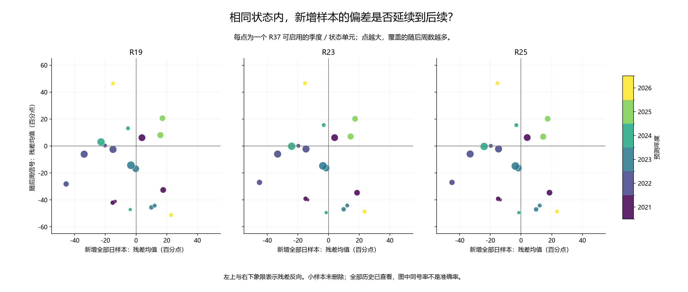
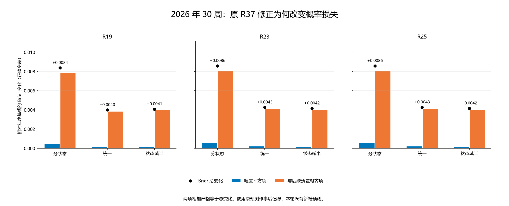

# 第三十八轮：新增日样本偏差能否迁移到后续周信号

本轮完成只读诊断，没有新增神经训练、分类／修正参数拟合、特征推理、预测策略或显著性检验。全部 R37 概率和成绩保持原值；用已保存的年度训练 logit 和周预测重新计算描述指标。所有历史结果此前已经查看，下面的后续标签只用于回顾诊断，未参与模型或门槛选择。

## 三个固定样本视角

每个季度比较：相对该年度训练集新增且联合标签成熟的全部日样本、其中周五子集、以及原路由分配给下一季度的周五评估信号。三者使用相同的年度模型和 R36 四状态边界。新增集按年度累计，跨季度重复；不能汇总其出现次数当成独立样本。年初新增集为空的单元也保留。

模型残差定义为实际上涨标签 y 减年度上涨概率 p。正值表示该样本中年度预测偏低，负值表示偏高；不是实际上涨率减年度训练标签率。融合残差使用三个种子概率的等权均值，未对平均 logit 取 sigmoid。

日样本和周样本比较可以显示取样差异；周五训练子集与随后周信号比较可进一步观察时间变化。但训练子集更小，差异不能自动解释为因果、可靠的启用规则或需要反向交易。

## 执行标签区间重叠

按原标签 entry 到 exit 的交易日边区间 [entry, exit) 计算覆盖。只共享边界不算收益区间重叠。“最多可取不重叠区间数”是区间调度计数，并非独立有效样本数；即便没有机械重叠，收益仍可能相关。这里没有量化辅助标签和 125 日输入上下文的重叠。

| 截止 | 样本视角 | n | 收益区间平均覆盖次数 | 最大覆盖次数 | 重叠区间对数 | 最多可取不重叠区间数 |
|---|---|---|---|---|---|---|
| 2021-09-30 | 新增全部日样本 | 182 | 4.892473 | 5 | 718 | 38 |
| 2021-09-30 | 新增周五子集 | 37 | 1.000000 | 1 | 0 | 37 |
| 2022-09-30 | 新增全部日样本 | 182 | 4.892473 | 5 | 718 | 38 |
| 2022-09-30 | 新增周五子集 | 37 | 1.000000 | 1 | 0 | 37 |
| 2023-09-30 | 新增全部日样本 | 182 | 4.892473 | 5 | 718 | 38 |
| 2023-09-30 | 新增周五子集 | 37 | 1.000000 | 1 | 0 | 37 |
| 2024-09-30 | 新增全部日样本 | 181 | 4.891892 | 5 | 714 | 38 |
| 2024-09-30 | 新增周五子集 | 36 | 1.000000 | 1 | 0 | 36 |
| 2025-09-30 | 新增全部日样本 | 183 | 4.893048 | 5 | 722 | 38 |
| 2025-09-30 | 新增周五子集 | 36 | 1.000000 | 1 | 0 | 36 |
| 2026-06-30 | 新增全部日样本 | 116 | 4.833333 | 5 | 454 | 25 |
| 2026-06-30 | 新增周五子集 | 22 | 1.000000 | 1 | 0 | 22 |

全部 23 个截止、三个视角和四状态／整体的 345 个区间单元均保存。训练与随后预测的执行标签区间没有交叉，前后比较不是把同一段未成熟收益同时放进两边。

## 偏差方向是否延续

以下每个单元是一个“季度截止×状态”，仅统计 R37 原规则允许修正的单元：新增日样本不少于 20 个，而且所选训练视角及随后状态周信号均非空。相同方向表示训练残差和随后残差同号；反向表示异号。接近零（绝对值≤1e−12）单列。周数是这些单元覆盖的实际后续周数，不是预测准确率；单元之间的训练集重复，不能当作独立试验。

### 2021—2023

| 方法 | 训练视角 | 可比较单元 | 同向单元 | 反向单元 | 近零单元 | 同向／覆盖后续周 |
|---|---|---|---|---|---|---|
| R19 | 新增全部日样本 | 12 | 8 | 4 | 0 | 59/72 |
| R19 | 新增周五子集 | 12 | 7 | 5 | 0 | 47/72 |
| R23 | 新增全部日样本 | 12 | 8 | 4 | 0 | 59/72 |
| R23 | 新增周五子集 | 12 | 8 | 4 | 0 | 56/72 |
| R25 | 新增全部日样本 | 12 | 8 | 4 | 0 | 59/72 |
| R25 | 新增周五子集 | 12 | 8 | 4 | 0 | 56/72 |

### 2024—2026 年 8 月

| 方法 | 训练视角 | 可比较单元 | 同向单元 | 反向单元 | 近零单元 | 同向／覆盖后续周 |
|---|---|---|---|---|---|---|
| R19 | 新增全部日样本 | 7 | 3 | 4 | 0 | 14/31 |
| R19 | 新增周五子集 | 7 | 3 | 4 | 0 | 14/31 |
| R23 | 新增全部日样本 | 7 | 4 | 3 | 0 | 25/31 |
| R23 | 新增周五子集 | 7 | 3 | 4 | 0 | 24/31 |
| R25 | 新增全部日样本 | 7 | 4 | 3 | 0 | 25/31 |
| R25 | 新增周五子集 | 7 | 3 | 4 | 0 | 24/31 |

### 2026 年已有 30 周

| 方法 | 训练视角 | 可比较单元 | 同向单元 | 反向单元 | 近零单元 | 同向／覆盖后续周 |
|---|---|---|---|---|---|---|
| R19 | 新增全部日样本 | 2 | 0 | 2 | 0 | 0/4 |
| R19 | 新增周五子集 | 2 | 0 | 2 | 0 | 0/4 |
| R23 | 新增全部日样本 | 2 | 0 | 2 | 0 | 0/4 |
| R23 | 新增周五子集 | 2 | 0 | 2 | 0 | 0/4 |
| R25 | 新增全部日样本 | 2 | 0 | 2 | 0 | 0/4 |
| R25 | 新增周五子集 | 2 | 0 | 2 | 0 | 0/4 |

### 小样本限制

| 方法 | 同时有至少10个新增周五和10个随后周信号的单元 | 覆盖后续周 |
|---|---|---|
| R19 | 2 | 22 |
| R23 | 2 | 22 |
| R25 | 2 | 22 |

这只是更严格的计数标记，没有用于生成新预测。所有单元、种子、非空比较及空单元在 residual_transfer.csv 和 transfer_summary.csv 中完整保存；未以同号率筛选状态。

## 2026 年：三个视角下的状态残差

### R23，截至 2026-03-31

| 状态 | 新增日 n／残差百分点 | 新增周五 n／残差百分点 | 随后周 n／残差百分点 | 日→随后 | 周五→随后 |
|---|---|---|---|---|---|
| 负趋势／低波动 | 6／+19.19 | 2／+3.14 | 0／— | undefined | undefined |
| 负趋势／高波动 | 1／+54.65 | 0／— | 3／+54.12 | same | undefined |
| 非负趋势／低波动 | 44／-15.30 | 8／-23.59 | 2／+46.56 | opposite | opposite |
| 非负趋势／高波动 | 5／+49.43 | 1／+48.32 | 6／+21.96 | same | same |

### R23，截至 2026-06-30

| 状态 | 新增日 n／残差百分点 | 新增周五 n／残差百分点 | 随后周 n／残差百分点 | 日→随后 | 周五→随后 |
|---|---|---|---|---|---|
| 负趋势／低波动 | 6／+19.19 | 2／+3.14 | 0／— | undefined | undefined |
| 负趋势／高波动 | 19／+44.70 | 4／+29.49 | 6／-13.33 | opposite | opposite |
| 非负趋势／低波动 | 55／-10.05 | 10／-9.56 | 0／— | undefined | undefined |
| 非负趋势／高波动 | 36／+23.47 | 6／+21.44 | 2／-48.70 | opposite | opposite |

## 取样与时间变化的组成分解

对残差均值差异，先固定来源状态内残差，计算状态占比变化项 Σ(w目标−w来源)r来源；再以目标占比加权状态内残差变化。两项相加等于总残差变化。若目标出现来源中没有样本的状态，则两项不可定义，不补造该状态残差。该分解依赖所规定顺序，只是记账。

| 截止 | 来源→目标 | 来源 n | 目标 n | 总变化／百分点 | 占比项 | 组内项 | 状态 |
|---|---|---|---|---|---|---|---|
| 2025-12-31 | 新增全部日样本→新增周五子集 | 0 | 0 | — | — | — | empty_source |
| 2025-12-31 | 新增周五子集→随后评估周信号 | 0 | 11 | — | — | — | empty_source |
| 2025-12-31 | 新增全部日样本→随后评估周信号 | 0 | 11 | — | — | — | empty_source |
| 2026-03-31 | 新增全部日样本→新增周五子集 | 56 | 11 | -7.61 | +1.43 | -9.05 | defined |
| 2026-03-31 | 新增周五子集→随后评估周信号 | 11 | 11 | +47.40 | — | — | target_state_absent_in_source |
| 2026-03-31 | 新增全部日样本→随后评估周信号 | 56 | 11 | +39.78 | +43.66 | -3.88 | defined |
| 2026-06-30 | 新增全部日样本→新增周五子集 | 116 | 22 | -3.68 | +0.87 | -4.56 | defined |
| 2026-06-30 | 新增周五子集→随后评估周信号 | 22 | 8 | -29.32 | +20.33 | -49.65 | defined |
| 2026-06-30 | 新增全部日样本→随后评估周信号 | 116 | 8 | -33.01 | +28.56 | -61.57 | defined |

## 排序能力：截距修正能改变什么

同一季度、同一状态、同一种子内，加一个共同 logit 截距再取 sigmoid 是严格递增变换，无法改善该单元内部的样本排序。融合三个种子则不一定是原平均概率的共同单调变换；跨状态、跨季度汇总也可能改变排序。因此不能从局部排序不变推断年度 AUROC 不变。

本轮 4416 个排序单元中，单种子共 0 对逆序，融合预测共 19 对逆序；所有并列改变和单类／空单元均保存。AUROC 缺失表示无法在该单元比较正负样本，不作 0.5 填充。

| 截止 | 视角 | 状态 | n | 上涨／下跌 | AUROC | Brier | 残差／百分点 |
|---|---|---|---|---|---|---|---|
| 2025-12-31 | 新增全部日样本 | 整体 | 0 | 0/0 | — | — | — |
| 2025-12-31 | 新增周五子集 | 整体 | 0 | 0/0 | — | — | — |
| 2025-12-31 | 随后评估周信号 | 整体 | 11 | 3/8 | 0.625000 | 0.237068 | -20.93 |
| 2026-03-31 | 新增全部日样本 | 整体 | 56 | 25/31 | 0.544516 | 0.247929 | -4.58 |
| 2026-03-31 | 新增周五子集 | 整体 | 11 | 4/7 | 0.571429 | 0.243517 | -12.19 |
| 2026-03-31 | 随后评估周信号 | 整体 | 11 | 9/2 | 0.222222 | 0.285228 | +35.20 |
| 2026-06-30 | 新增全部日样本 | 整体 | 116 | 68/48 | 0.356618 | 0.268584 | +10.84 |
| 2026-06-30 | 新增周五子集 | 整体 | 22 | 12/10 | 0.441667 | 0.261307 | +7.15 |
| 2026-06-30 | 随后评估周信号 | 整体 | 8 | 2/6 | 0.250000 | 0.246120 | -22.17 |

## R37 概率损失变化的精确记账

令 Δp=修正概率−年度概率，e=y−年度概率，则 Brier 变化为 Δp²−2Δp·e。第一项总非负；第二项用随后已观察残差衡量修正是否朝向标签。两项严格还原原 R37 的 Brier 差，不能用其事后符号建立本轮新策略。

| 时段 | 方法 | 原 R37 方案 | 周数 | 幅度平方项 | 与后续残差对齐项 | Brier 总变化 |
|---|---|---|---|---|---|---|
| recent_2024_2026 | R23 | 统一修正 | 125 | 0.000324 | -0.000438 | -0.000114 |
| recent_2024_2026 | R25 | 统一修正 | 125 | 0.000326 | -0.000442 | -0.000116 |
| recent_2024_2026 | R19 | 统一修正 | 125 | 0.000362 | -0.000631 | -0.000268 |
| recent_2024_2026 | R23 | 分状态修正 | 125 | 0.000763 | 0.000301 | 0.001063 |
| recent_2024_2026 | R25 | 分状态修正 | 125 | 0.000768 | 0.000278 | 0.001046 |
| recent_2024_2026 | R19 | 分状态修正 | 125 | 0.000733 | 0.000445 | 0.001178 |
| recent_2024_2026 | R23 | 状态修正减半 | 125 | 0.000192 | 0.000137 | 0.000329 |
| recent_2024_2026 | R25 | 状态修正减半 | 125 | 0.000193 | 0.000126 | 0.000319 |
| recent_2024_2026 | R19 | 状态修正减半 | 125 | 0.000185 | 0.000215 | 0.000400 |
| year_2026 | R23 | 统一修正 | 30 | 0.000198 | 0.004062 | 0.004260 |
| year_2026 | R25 | 统一修正 | 30 | 0.000198 | 0.004066 | 0.004264 |
| year_2026 | R19 | 统一修正 | 30 | 0.000172 | 0.003819 | 0.003991 |
| year_2026 | R23 | 分状态修正 | 30 | 0.000542 | 0.008033 | 0.008575 |
| year_2026 | R25 | 分状态修正 | 30 | 0.000542 | 0.008033 | 0.008576 |
| year_2026 | R19 | 分状态修正 | 30 | 0.000493 | 0.007875 | 0.008368 |
| year_2026 | R23 | 状态修正减半 | 30 | 0.000136 | 0.004020 | 0.004155 |
| year_2026 | R25 | 状态修正减半 | 30 | 0.000136 | 0.004020 | 0.004156 |
| year_2026 | R19 | 状态修正减半 | 30 | 0.000124 | 0.003954 | 0.004079 |

正的 Brier 总变化表示变差。这里只重述原概率产生的损失，没有重新训练或改变预测。全部周、种子及仅启用周的分解另存。

## 复核与研究边界

独立区间计数和动态规划复核 345 个区间单元；独立概率来源最大差 2.22e-16；5520 个指标单元、1472 个迁移单元、1104 个分解单元和 4416 个排序单元复核通过。Brier 恒等式最大误差 2.12e-16。

5,428 个旧证据文件保持不变，R37 的 48 项探索比较原样保留。本轮无新增 p 值，不把同号计数解释为未来提升，不从这些已查看历史中选择启用阈值。旧 R25 近期 73/125、58.4% 仍单独保留；自然 20 遍年度 R25 对照是 71/125、56.8%。

协议 SHA256：`23725f858a0d948681ce87330dd632d79bbbd83d7ca43841b3ee12091df52c7e`
