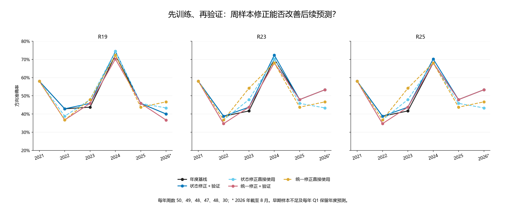
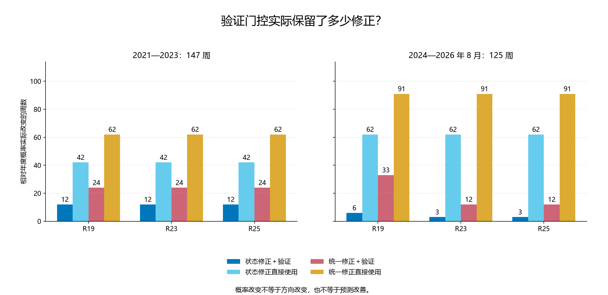

# 第三十九轮：成熟周样本训练、后续保留验证与修正启用

本轮实际拟合了新的概率修正参数，运行按历史时间顺序的保留验证，再计算之后的历史预测。年度网络、年度分类主系数、交互项和年度状态边界全部保留。全部历史此前已查看，本轮是探索性历史回放，不是新盲测，也不存在当年真实发出的本轮修正交易记录。

## 预先固定的规则

每个非年末季度截止，取最后 13 个联合标签已成熟的原年度周信号作验证。用第一个验证信号前一天作为修正器训练截止，只选该日前已经成熟的最近 52 个周标签作训练。相邻旧周即使信号日期更早，标签尚未成熟也要隔离，不能简单将相邻 65 行切成 52＋13。52 和 13 是信号数量，不是严格的一年和一季度。

历史不足时精确使用年度概率。年末保持年度重置，下一年第一季度不启用修正。每季度都独立训练当前候选，不累加旧修正。所有参数先冻结，再用保留验证标签决定是否启用；通过后也不将验证标签加入重拟合。

统一修正：每种子用 52 个训练周拟合一个截距。分状态修正：每状态训练周至少 10 个才拟合一个截距，否则为零。两者均使用 Σ二分类对数损失＋20d²/2，且 |d|≤0.5。强度和幅度沿用 R37，未搜索。

验证先分别修正三个种子概率，再等权平均。统一方案在全部 13 个验证周上检查；状态方案分别要求该状态至少 5 个验证周。只有 Brier 比年度低超过 1e−12，且方向正确周数不减少，才允许在随后信号使用该修正。严格大于 0.5 判上涨。计数和双指标门槛是固定启用规则，不代表显著性或模型已被证明可靠。

每个家族都保留“不经验证直接使用”的对照，它与通过验证的方案使用完全相同的较早 52 周训练参数。两者差异可以检查验证门控的作用；两种家族之间还存在支持样本和总惩罚量差异，不能当作仅改变状态数量的纯消融。原 native_mse 和训练频率均复制年度对照。

历史训练输入采用当时年度模型的原始周预测和当时年度边界给出的相对状态。没有用当前网络回算过去，也没有用当前中位数重新标过去的状态。校准样本因此跨越不同年度模型和不同绝对波动阈值；保留验证检验的是这个顺序校准流程，不能宣称当前／新年度网络本身经过独立验证。

本轮有 13 个非年末季度满足训练和验证总量要求；实际拟合 540 个标量参数，其中状态 384、统一 156。新增神经训练、变换拟合和特征推理均为 0。

## 时间边界与可用样本

| 决定日 | 处理 | 累计成熟周 | 训练周 | 验证周 | 修正训练截止 | 验证最早信号 | 边界隔离旧周 |
|---|---|---|---|---|---|---|---|
| 2020-12-31 | 年度重置 | 0 | 0 | 0 | — | — | 0 |
| 2021-03-31 | 历史不足 | 10 | 0 | 10 | 2021-01-07 | 2021-01-08 | 0 |
| 2021-06-30 | 历史不足 | 23 | 9 | 13 | 2021-03-25 | 2021-03-26 | 1 |
| 2021-09-30 | 历史不足 | 36 | 22 | 13 | 2021-06-24 | 2021-06-25 | 1 |
| 2021-12-31 | 年度重置 | 48 | 34 | 13 | 2021-09-16 | 2021-09-17 | 1 |
| 2022-03-31 | 历史不足 | 60 | 46 | 13 | 2021-12-16 | 2021-12-17 | 1 |
| 2022-06-30 | ready | 72 | 52 | 13 | 2022-03-17 | 2022-03-18 | 1 |
| 2022-09-30 | ready | 85 | 52 | 13 | 2022-06-23 | 2022-06-24 | 1 |
| 2022-12-31 | 年度重置 | 97 | 52 | 13 | 2022-09-15 | 2022-09-16 | 1 |
| 2023-03-31 | ready | 109 | 52 | 13 | 2022-12-15 | 2022-12-16 | 1 |
| 2023-06-30 | ready | 121 | 52 | 13 | 2023-03-16 | 2023-03-17 | 1 |
| 2023-09-30 | ready | 134 | 52 | 13 | 2023-06-15 | 2023-06-16 | 1 |
| 2023-12-31 | 年度重置 | 145 | 52 | 13 | 2023-09-07 | 2023-09-08 | 1 |
| 2024-03-31 | ready | 156 | 52 | 13 | 2023-12-07 | 2023-12-08 | 1 |
| 2024-06-30 | ready | 167 | 52 | 13 | 2024-03-07 | 2024-03-08 | 1 |
| 2024-09-30 | ready | 181 | 52 | 13 | 2024-06-27 | 2024-06-28 | 1 |
| 2024-12-31 | 年度重置 | 193 | 52 | 13 | 2024-09-19 | 2024-09-20 | 1 |
| 2025-03-31 | ready | 205 | 52 | 13 | 2024-12-19 | 2024-12-20 | 1 |
| 2025-06-30 | ready | 216 | 52 | 13 | 2025-03-13 | 2025-03-14 | 1 |
| 2025-09-30 | ready | 229 | 52 | 13 | 2025-06-26 | 2025-06-27 | 1 |
| 2025-12-31 | 年度重置 | 241 | 52 | 13 | 2025-09-18 | 2025-09-19 | 1 |
| 2026-03-31 | ready | 252 | 52 | 13 | 2025-12-11 | 2025-12-12 | 1 |
| 2026-06-30 | ready | 263 | 52 | 13 | 2026-03-12 | 2026-03-13 | 1 |

年度重置行中的数量仅用于审计潜在历史可用性，不表示实际进行了拟合或启用。训练最晚成熟日早于验证最早信号；验证最晚成熟日不晚于决定日；所有之后评估信号的日期严格晚于决定日。

## 2021—2023：147 周

| 方法 | 方案 | 正确／周数 | 准确率 | Brier↓ | 对数损失↓ | AUROC |
|---|---|---|---|---|---|---|
| R19 | 年度基线 | 71/147 | 48.30% | 0.277967 | 0.752923 | 0.468121 |
| R19 | 状态修正＋验证 | 72/147 | 48.98% | 0.277416 | 0.751825 | 0.471917 |
| R19 | 状态修正直接使用 | 71/147 | 48.30% | 0.275945 | 0.748529 | 0.472676 |
| R19 | 统一修正＋验证 | 69/147 | 46.94% | 0.277470 | 0.751829 | 0.467173 |
| R19 | 统一修正直接使用 | 70/147 | 47.62% | 0.269914 | 0.735745 | 0.493738 |
| R23 | 年度基线 | 68/147 | 46.26% | 0.276195 | 0.749569 | 0.476850 |
| R23 | 状态修正＋验证 | 69/147 | 46.94% | 0.275610 | 0.748399 | 0.480645 |
| R23 | 状态修正直接使用 | 70/147 | 47.62% | 0.274027 | 0.744955 | 0.483491 |
| R23 | 统一修正＋验证 | 67/147 | 45.58% | 0.275686 | 0.748465 | 0.476660 |
| R23 | 统一修正直接使用 | 73/147 | 49.66% | 0.267985 | 0.732262 | 0.508729 |
| R25 | 年度基线 | 68/147 | 46.26% | 0.276108 | 0.749367 | 0.475712 |
| R25 | 状态修正＋验证 | 69/147 | 46.94% | 0.275517 | 0.748182 | 0.479317 |
| R25 | 状态修正直接使用 | 70/147 | 47.62% | 0.273930 | 0.744735 | 0.482732 |
| R25 | 统一修正＋验证 | 67/147 | 45.58% | 0.275593 | 0.748251 | 0.475522 |
| R25 | 统一修正直接使用 | 73/147 | 49.66% | 0.267891 | 0.732050 | 0.508349 |

## 2024—2026 年 8 月：125 周

| 方法 | 方案 | 正确／周数 | 准确率 | Brier↓ | 对数损失↓ | AUROC |
|---|---|---|---|---|---|---|
| R19 | 年度基线 | 68/125 | 54.40% | 0.246843 | 0.687439 | 0.582435 |
| R19 | 状态修正＋验证 | 69/125 | 55.20% | 0.246156 | 0.686054 | 0.589882 |
| R19 | 状态修正直接使用 | 70/125 | 56.00% | 0.246324 | 0.686457 | 0.585773 |
| R19 | 统一修正＋验证 | 66/125 | 52.80% | 0.248804 | 0.691342 | 0.572676 |
| R19 | 统一修正直接使用 | 69/125 | 55.20% | 0.246286 | 0.686252 | 0.589625 |
| R23 | 年度基线 | 72/125 | 57.60% | 0.249790 | 0.693613 | 0.563174 |
| R23 | 状态修正＋验证 | 73/125 | 58.40% | 0.248903 | 0.691827 | 0.570108 |
| R23 | 状态修正直接使用 | 68/125 | 54.40% | 0.248801 | 0.691696 | 0.570108 |
| R23 | 统一修正＋验证 | 71/125 | 56.80% | 0.249998 | 0.694136 | 0.564458 |
| R23 | 统一修正直接使用 | 67/125 | 53.60% | 0.249022 | 0.692034 | 0.574217 |
| R25 | 年度基线 | 71/125 | 56.80% | 0.249824 | 0.693671 | 0.562917 |
| R25 | 状态修正＋验证 | 72/125 | 57.60% | 0.248933 | 0.691876 | 0.570108 |
| R25 | 状态修正直接使用 | 67/125 | 53.60% | 0.248814 | 0.691709 | 0.570108 |
| R25 | 统一修正＋验证 | 71/125 | 56.80% | 0.250034 | 0.694196 | 0.563945 |
| R25 | 统一修正直接使用 | 67/125 | 53.60% | 0.249046 | 0.692073 | 0.573703 |

## 全段：272 周

| 方法 | 方案 | 正确／周数 | 准确率 | Brier↓ | 对数损失↓ | AUROC |
|---|---|---|---|---|---|---|
| R19 | 年度基线 | 139/272 | 51.10% | 0.263664 | 0.722829 | 0.499132 |
| R19 | 状态修正＋验证 | 141/272 | 51.84% | 0.263050 | 0.721599 | 0.504069 |
| R19 | 状态修正直接使用 | 141/272 | 51.84% | 0.262332 | 0.720003 | 0.505588 |
| R19 | 统一修正＋验证 | 135/272 | 49.63% | 0.264296 | 0.724032 | 0.494086 |
| R19 | 统一修正直接使用 | 139/272 | 51.10% | 0.259056 | 0.713000 | 0.520779 |
| R23 | 年度基线 | 140/272 | 51.47% | 0.264060 | 0.723854 | 0.496799 |
| R23 | 状态修正＋验证 | 142/272 | 52.21% | 0.263337 | 0.722401 | 0.502062 |
| R23 | 状态修正直接使用 | 138/272 | 50.74% | 0.262434 | 0.720479 | 0.504340 |
| R23 | 统一修正＋验证 | 138/272 | 50.74% | 0.263881 | 0.723497 | 0.497396 |
| R23 | 统一修正直接使用 | 140/272 | 51.47% | 0.259271 | 0.713775 | 0.521539 |
| R25 | 年度基线 | 139/272 | 51.10% | 0.264029 | 0.723771 | 0.496257 |
| R25 | 状态修正＋验证 | 141/272 | 51.84% | 0.263300 | 0.722306 | 0.501519 |
| R25 | 状态修正直接使用 | 137/272 | 50.37% | 0.262388 | 0.720367 | 0.503906 |
| R25 | 统一修正＋验证 | 138/272 | 50.74% | 0.263847 | 0.723410 | 0.496582 |
| R25 | 统一修正直接使用 | 140/272 | 51.47% | 0.259230 | 0.713679 | 0.521159 |

## 各年方向结果

### R19

| 年份 | 周数 | 年度基线 | 状态修正＋验证 | 状态修正直接使用 | 统一修正＋验证 | 统一修正直接使用 |
|---|---|---|---|---|---|---|
| 2021 | 50 | 29（58.00%） | 29（58.00%） | 29（58.00%） | 29（58.00%） | 29（58.00%） |
| 2022 | 49 | 21（42.86%） | 21（42.86%） | 19（38.78%） | 18（36.73%） | 18（36.73%） |
| 2023 | 48 | 21（43.75%） | 22（45.83%） | 23（47.92%） | 22（45.83%） | 23（47.92%） |
| 2024 | 47 | 34（72.34%） | 35（74.47%） | 35（74.47%） | 33（70.21%） | 34（72.34%） |
| 2025 | 48 | 22（45.83%） | 22（45.83%） | 22（45.83%） | 22（45.83%） | 21（43.75%） |
| 2026 | 30 | 12（40.00%） | 12（40.00%） | 13（43.33%） | 11（36.67%） | 14（46.67%） |

### R23

| 年份 | 周数 | 年度基线 | 状态修正＋验证 | 状态修正直接使用 | 统一修正＋验证 | 统一修正直接使用 |
|---|---|---|---|---|---|---|
| 2021 | 50 | 29（58.00%） | 29（58.00%） | 29（58.00%） | 29（58.00%） | 29（58.00%） |
| 2022 | 49 | 19（38.78%） | 19（38.78%） | 18（36.73%） | 17（34.69%） | 18（36.73%） |
| 2023 | 48 | 20（41.67%） | 21（43.75%） | 23（47.92%） | 21（43.75%） | 26（54.17%） |
| 2024 | 47 | 33（70.21%） | 34（72.34%） | 33（70.21%） | 32（68.09%） | 32（68.09%） |
| 2025 | 48 | 23（47.92%） | 23（47.92%） | 22（45.83%） | 23（47.92%） | 21（43.75%） |
| 2026 | 30 | 16（53.33%） | 16（53.33%） | 13（43.33%） | 16（53.33%） | 14（46.67%） |

### R25

| 年份 | 周数 | 年度基线 | 状态修正＋验证 | 状态修正直接使用 | 统一修正＋验证 | 统一修正直接使用 |
|---|---|---|---|---|---|---|
| 2021 | 50 | 29（58.00%） | 29（58.00%） | 29（58.00%） | 29（58.00%） | 29（58.00%） |
| 2022 | 49 | 19（38.78%） | 19（38.78%） | 18（36.73%） | 17（34.69%） | 18（36.73%） |
| 2023 | 48 | 20（41.67%） | 21（43.75%） | 23（47.92%） | 21（43.75%） | 26（54.17%） |
| 2024 | 47 | 32（68.09%） | 33（70.21%） | 32（68.09%） | 32（68.09%） | 32（68.09%） |
| 2025 | 48 | 23（47.92%） | 23（47.92%） | 22（45.83%） | 23（47.92%） | 21（43.75%） |
| 2026 | 30 | 16（53.33%） | 16（53.33%） | 13（43.33%） | 16（53.33%） | 14（46.67%） |

## 启用覆盖与改善／退步

| 时期 | 方法 | 方案 | 可拟合覆盖周 | 验证通过覆盖周 | 概率实际变化周 | 错→对 | 对→错 |
|---|---|---|---|---|---|---|---|
| extension_2021_2023 | R23 | 统一修正直接使用 | 62 | 24 | 62 | 8 | 3 |
| extension_2021_2023 | R25 | 统一修正直接使用 | 62 | 24 | 62 | 8 | 3 |
| extension_2021_2023 | R19 | 统一修正直接使用 | 62 | 24 | 62 | 3 | 4 |
| extension_2021_2023 | R23 | 统一修正＋验证 | 62 | 24 | 24 | 2 | 3 |
| extension_2021_2023 | R25 | 统一修正＋验证 | 62 | 24 | 24 | 2 | 3 |
| extension_2021_2023 | R19 | 统一修正＋验证 | 62 | 24 | 24 | 1 | 3 |
| extension_2021_2023 | R23 | 状态修正直接使用 | 42 | 12 | 42 | 4 | 2 |
| extension_2021_2023 | R25 | 状态修正直接使用 | 42 | 12 | 42 | 4 | 2 |
| extension_2021_2023 | R19 | 状态修正直接使用 | 42 | 12 | 42 | 3 | 3 |
| extension_2021_2023 | R23 | 状态修正＋验证 | 42 | 12 | 12 | 1 | 0 |
| extension_2021_2023 | R25 | 状态修正＋验证 | 42 | 12 | 12 | 1 | 0 |
| extension_2021_2023 | R19 | 状态修正＋验证 | 42 | 12 | 12 | 1 | 0 |
| recent_2024_2026 | R23 | 统一修正直接使用 | 91 | 12 | 91 | 6 | 11 |
| recent_2024_2026 | R25 | 统一修正直接使用 | 91 | 12 | 91 | 6 | 10 |
| recent_2024_2026 | R19 | 统一修正直接使用 | 91 | 33 | 91 | 7 | 6 |
| recent_2024_2026 | R23 | 统一修正＋验证 | 91 | 12 | 12 | 0 | 1 |
| recent_2024_2026 | R25 | 统一修正＋验证 | 91 | 12 | 12 | 0 | 0 |
| recent_2024_2026 | R19 | 统一修正＋验证 | 91 | 33 | 33 | 2 | 4 |
| recent_2024_2026 | R23 | 状态修正直接使用 | 62 | 3 | 62 | 2 | 6 |
| recent_2024_2026 | R25 | 状态修正直接使用 | 62 | 3 | 62 | 2 | 6 |
| recent_2024_2026 | R19 | 状态修正直接使用 | 62 | 6 | 62 | 4 | 2 |
| recent_2024_2026 | R23 | 状态修正＋验证 | 62 | 3 | 3 | 1 | 0 |
| recent_2024_2026 | R25 | 状态修正＋验证 | 62 | 3 | 3 | 1 | 0 |
| recent_2024_2026 | R19 | 状态修正＋验证 | 62 | 6 | 6 | 1 | 0 |
| year_2026 | R23 | 统一修正直接使用 | 19 | 0 | 19 | 4 | 6 |
| year_2026 | R25 | 统一修正直接使用 | 19 | 0 | 19 | 4 | 6 |
| year_2026 | R19 | 统一修正直接使用 | 19 | 8 | 19 | 4 | 2 |
| year_2026 | R23 | 统一修正＋验证 | 19 | 0 | 0 | 0 | 0 |
| year_2026 | R25 | 统一修正＋验证 | 19 | 0 | 0 | 0 | 0 |
| year_2026 | R19 | 统一修正＋验证 | 19 | 8 | 8 | 0 | 1 |
| year_2026 | R23 | 状态修正直接使用 | 10 | 0 | 10 | 0 | 3 |
| year_2026 | R25 | 状态修正直接使用 | 10 | 0 | 10 | 0 | 3 |
| year_2026 | R19 | 状态修正直接使用 | 10 | 2 | 10 | 1 | 0 |
| year_2026 | R23 | 状态修正＋验证 | 10 | 0 | 0 | 0 | 0 |
| year_2026 | R25 | 状态修正＋验证 | 10 | 0 | 0 | 0 | 0 |
| year_2026 | R19 | 状态修正＋验证 | 10 | 2 | 2 | 0 | 0 |

验证通过覆盖数也附在直接使用对照上，用于比较同一批候选通过了哪些检查；直接使用对照不会据此回退。概率改变不一定跨过 0.5，也不一定改变方向。

## 所有通过验证的状态／统一候选

| 决定日 | 方法 | 家族 | 状态 | 训练周 | 验证周 | 验证 Brier 差 | 验证正确数：年度→候选 |
|---|---|---|---|---|---|---|---|
| 2022-06-30 | R19 | 分状态 | 负趋势／高波动 | 21 | 12 | -0.002042 | 5→5 |
| 2022-06-30 | R23 | 分状态 | 负趋势／高波动 | 21 | 12 | -0.002007 | 5→5 |
| 2022-06-30 | R25 | 分状态 | 负趋势／高波动 | 21 | 12 | -0.001987 | 5→5 |
| 2022-09-30 | R19 | 统一 | 全部状态 | 52 | 13 | -0.037856 | 6→6 |
| 2022-09-30 | R23 | 统一 | 全部状态 | 52 | 13 | -0.038007 | 5→6 |
| 2022-09-30 | R25 | 统一 | 全部状态 | 52 | 13 | -0.037946 | 5→6 |
| 2023-09-30 | R19 | 分状态 | 负趋势／低波动 | 12 | 9 | -0.008845 | 3→4 |
| 2023-09-30 | R19 | 统一 | 全部状态 | 52 | 13 | -0.009705 | 7→7 |
| 2023-09-30 | R23 | 分状态 | 负趋势／低波动 | 12 | 9 | -0.008647 | 3→4 |
| 2023-09-30 | R23 | 统一 | 全部状态 | 52 | 13 | -0.009822 | 6→7 |
| 2023-09-30 | R25 | 分状态 | 负趋势／低波动 | 12 | 9 | -0.008670 | 3→4 |
| 2023-09-30 | R25 | 统一 | 全部状态 | 52 | 13 | -0.009854 | 6→7 |
| 2024-03-31 | R19 | 分状态 | 负趋势／低波动 | 25 | 7 | -0.001937 | 3→3 |
| 2024-03-31 | R23 | 分状态 | 负趋势／低波动 | 25 | 7 | -0.002813 | 3→3 |
| 2024-03-31 | R25 | 分状态 | 负趋势／低波动 | 25 | 7 | -0.002891 | 3→3 |
| 2024-06-30 | R19 | 分状态 | 非负趋势／低波动 | 15 | 11 | -0.000049 | 7→7 |
| 2024-06-30 | R19 | 统一 | 全部状态 | 52 | 13 | -0.000045 | 8→8 |
| 2024-09-30 | R19 | 统一 | 全部状态 | 52 | 13 | -0.001899 | 8→8 |
| 2024-09-30 | R23 | 分状态 | 负趋势／低波动 | 32 | 12 | -0.001504 | 7→7 |
| 2024-09-30 | R23 | 统一 | 全部状态 | 52 | 13 | -0.004224 | 8→9 |
| 2024-09-30 | R25 | 分状态 | 负趋势／低波动 | 32 | 12 | -0.001639 | 7→7 |
| 2024-09-30 | R25 | 统一 | 全部状态 | 52 | 13 | -0.004330 | 8→9 |
| 2025-06-30 | R19 | 分状态 | 负趋势／低波动 | 18 | 9 | -0.000658 | 5→5 |
| 2025-06-30 | R23 | 分状态 | 负趋势／低波动 | 18 | 9 | -0.001469 | 4→4 |
| 2025-06-30 | R25 | 分状态 | 负趋势／低波动 | 18 | 9 | -0.001494 | 4→4 |
| 2026-06-30 | R19 | 分状态 | 非负趋势／高波动 | 10 | 5 | -0.004602 | 1→1 |
| 2026-06-30 | R19 | 统一 | 全部状态 | 52 | 13 | -0.010208 | 5→7 |

全部 460 个门控单元包含年度重置、历史不足、状态训练不足、状态验证不足、Brier 未改善和方向减少等拒绝原因。所有决定均在后续预测评分前冻结。

### R23 在 2026 年的全部决定

| 决定日 | 家族 | 状态 | 训练周 | 验证周 | 验证 Brier 差 | 验证正确数：年度→候选 | 决定 |
|---|---|---|---|---|---|---|---|
| 2026-03-31 | 分状态 | 负趋势／低波动 | 13 | 2 | 0.000099 | 2→2 | 状态验证不足 |
| 2026-03-31 | 分状态 | 负趋势／高波动 | 7 | 0 | — | 0→0 | 状态训练不足 |
| 2026-03-31 | 分状态 | 非负趋势／低波动 | 16 | 10 | 0.010659 | 5→6 | Brier 未改善 |
| 2026-03-31 | 分状态 | 非负趋势／高波动 | 16 | 1 | -0.007349 | 1→1 | 状态验证不足 |
| 2026-03-31 | 统一 | 全部状态 | 52 | 13 | 0.006055 | 8→9 | Brier 未改善 |
| 2026-06-30 | 分状态 | 负趋势／低波动 | 15 | 0 | — | 0→0 | 状态验证不足 |
| 2026-06-30 | 分状态 | 负趋势／高波动 | 4 | 4 | 0.000000 | 1→1 | 状态训练不足 |
| 2026-06-30 | 分状态 | 非负趋势／低波动 | 23 | 4 | 0.001078 | 4→4 | 状态验证不足 |
| 2026-06-30 | 分状态 | 非负趋势／高波动 | 10 | 5 | -0.004824 | 2→0 | 方向正确数减少 |
| 2026-06-30 | 统一 | 全部状态 | 52 | 13 | -0.010580 | 7→6 | 方向正确数减少 |

## 验证后的下一季度

在门控冻结以后，才计算下表的后续表现。通过但后续没有该状态信号的单元也保留为 n=0。这些后续结果没有反过来改变决定。完整季度表同时包含未通过候选的直接使用结果。

| 决定日 | 方法 | 家族 | 状态 | 后续周 | 通过验证后 Brier 差 | 错→对 | 对→错 |
|---|---|---|---|---|---|---|---|
| 2022-06-30 | R19 | 分状态 | 负趋势／高波动 | 0 | — | 0 | 0 |
| 2022-06-30 | R23 | 分状态 | 负趋势／高波动 | 0 | — | 0 | 0 |
| 2022-06-30 | R25 | 分状态 | 负趋势／高波动 | 0 | — | 0 | 0 |
| 2022-09-30 | R19 | 统一 | 全部状态 | 12 | 0.001487 | 0 | 3 |
| 2022-09-30 | R23 | 统一 | 全部状态 | 12 | 0.001651 | 1 | 3 |
| 2022-09-30 | R25 | 统一 | 全部状态 | 12 | 0.001671 | 1 | 3 |
| 2023-09-30 | R19 | 分状态 | 负趋势／低波动 | 12 | -0.006745 | 1 | 0 |
| 2023-09-30 | R19 | 统一 | 全部状态 | 12 | -0.007570 | 1 | 0 |
| 2023-09-30 | R23 | 分状态 | 负趋势／低波动 | 12 | -0.007157 | 1 | 0 |
| 2023-09-30 | R23 | 统一 | 全部状态 | 12 | -0.007887 | 1 | 0 |
| 2023-09-30 | R25 | 分状态 | 负趋势／低波动 | 12 | -0.007244 | 1 | 0 |
| 2023-09-30 | R25 | 统一 | 全部状态 | 12 | -0.007974 | 1 | 0 |
| 2024-03-31 | R19 | 分状态 | 负趋势／低波动 | 3 | -0.036057 | 1 | 0 |
| 2024-03-31 | R23 | 分状态 | 负趋势／低波动 | 3 | -0.036977 | 1 | 0 |
| 2024-03-31 | R25 | 分状态 | 负趋势／低波动 | 3 | -0.037151 | 1 | 0 |
| 2024-06-30 | R19 | 分状态 | 非负趋势／低波动 | 1 | -0.013604 | 0 | 0 |
| 2024-06-30 | R19 | 统一 | 全部状态 | 13 | 0.003955 | 2 | 2 |
| 2024-09-30 | R19 | 统一 | 全部状态 | 12 | 0.001065 | 0 | 1 |
| 2024-09-30 | R23 | 分状态 | 负趋势／低波动 | 0 | — | 0 | 0 |
| 2024-09-30 | R23 | 统一 | 全部状态 | 12 | 0.002165 | 0 | 1 |
| 2024-09-30 | R25 | 分状态 | 负趋势／低波动 | 0 | — | 0 | 0 |
| 2024-09-30 | R25 | 统一 | 全部状态 | 12 | 0.002184 | 0 | 0 |
| 2025-06-30 | R19 | 分状态 | 负趋势／低波动 | 0 | — | 0 | 0 |
| 2025-06-30 | R23 | 分状态 | 负趋势／低波动 | 0 | — | 0 | 0 |
| 2025-06-30 | R25 | 分状态 | 负趋势／低波动 | 0 | — | 0 | 0 |
| 2026-06-30 | R19 | 分状态 | 非负趋势／高波动 | 2 | 0.017981 | 0 | 0 |
| 2026-06-30 | R19 | 统一 | 全部状态 | 8 | 0.022616 | 0 | 1 |

## 种子范围

| 时期 | 方法 | 方案 | 种子最低／最高准确率 | 融合准确率 |
|---|---|---|---|---|
| extension_2021_2023 | R19 | 年度基线 | 43.54%／45.58% | 48.30% |
| extension_2021_2023 | R19 | 状态修正＋验证 | 43.54%／45.58% | 48.98% |
| extension_2021_2023 | R19 | 状态修正直接使用 | 44.22%／46.26% | 48.30% |
| extension_2021_2023 | R19 | 统一修正＋验证 | 44.22%／44.90% | 46.94% |
| extension_2021_2023 | R19 | 统一修正直接使用 | 45.58%／48.98% | 47.62% |
| extension_2021_2023 | R23 | 年度基线 | 43.54%／45.58% | 46.26% |
| extension_2021_2023 | R23 | 状态修正＋验证 | 43.54%／44.90% | 46.94% |
| extension_2021_2023 | R23 | 状态修正直接使用 | 44.90%／45.58% | 47.62% |
| extension_2021_2023 | R23 | 统一修正＋验证 | 43.54%／45.58% | 45.58% |
| extension_2021_2023 | R23 | 统一修正直接使用 | 45.58%／48.98% | 49.66% |
| extension_2021_2023 | R25 | 年度基线 | 43.54%／45.58% | 46.26% |
| extension_2021_2023 | R25 | 状态修正＋验证 | 43.54%／44.90% | 46.94% |
| extension_2021_2023 | R25 | 状态修正直接使用 | 44.90%／45.58% | 47.62% |
| extension_2021_2023 | R25 | 统一修正＋验证 | 42.86%／45.58% | 45.58% |
| extension_2021_2023 | R25 | 统一修正直接使用 | 46.26%／48.98% | 49.66% |
| recent_2024_2026 | R19 | 年度基线 | 52.80%／54.40% | 54.40% |
| recent_2024_2026 | R19 | 状态修正＋验证 | 52.00%／54.40% | 55.20% |
| recent_2024_2026 | R19 | 状态修正直接使用 | 53.60%／54.40% | 56.00% |
| recent_2024_2026 | R19 | 统一修正＋验证 | 51.20%／53.60% | 52.80% |
| recent_2024_2026 | R19 | 统一修正直接使用 | 52.00%／55.20% | 55.20% |
| recent_2024_2026 | R23 | 年度基线 | 51.20%／55.20% | 57.60% |
| recent_2024_2026 | R23 | 状态修正＋验证 | 51.20%／56.00% | 58.40% |
| recent_2024_2026 | R23 | 状态修正直接使用 | 52.00%／56.80% | 54.40% |
| recent_2024_2026 | R23 | 统一修正＋验证 | 50.40%／56.00% | 56.80% |
| recent_2024_2026 | R23 | 统一修正直接使用 | 52.80%／56.80% | 53.60% |
| recent_2024_2026 | R25 | 年度基线 | 51.20%／55.20% | 56.80% |
| recent_2024_2026 | R25 | 状态修正＋验证 | 51.20%／55.20% | 57.60% |
| recent_2024_2026 | R25 | 状态修正直接使用 | 52.00%／56.00% | 53.60% |
| recent_2024_2026 | R25 | 统一修正＋验证 | 49.60%／56.00% | 56.80% |
| recent_2024_2026 | R25 | 统一修正直接使用 | 52.00%／56.00% | 53.60% |

## 预定探索比较

4 个候选各自对年度、两个验证版各自对直接使用版、状态验证对统一验证，乘三个主要方法、方向错误和 Brier 两种损失、两个时期，共 84 项。固定 8 周循环区块，10,000 次配对 bootstrap，中心化双侧 p，再统一 Holm 调整。差值为候选损失减参考损失，负值有利。该调整不覆盖历轮探索，也不能消除已查看历史的选择影响。

84 项中调整后 p<0.05 的数量：0；最小调整 p：1.000000。

| 时期 | 方法 | 候选 | 参考 | 损失 | 差值 | 95% 区间 | 原 p | Holm p |
|---|---|---|---|---|---|---|---|---|
| extension_2021_2023 | R19 | 状态修正＋验证 | 年度基线 | direction_error | -0.006803 | [-0.020408, 0.000000] | 0.466653 | 1.000000 |
| extension_2021_2023 | R19 | 状态修正＋验证 | 年度基线 | brier | -0.000551 | [-0.001909, 0.000263] | 0.398960 | 1.000000 |
| extension_2021_2023 | R23 | 状态修正＋验证 | 年度基线 | direction_error | -0.006803 | [-0.020408, 0.000000] | 0.466653 | 1.000000 |
| extension_2021_2023 | R23 | 状态修正＋验证 | 年度基线 | brier | -0.000584 | [-0.001999, 0.000262] | 0.389361 | 1.000000 |
| extension_2021_2023 | R25 | 状态修正＋验证 | 年度基线 | direction_error | -0.006803 | [-0.020408, 0.000000] | 0.466653 | 1.000000 |
| extension_2021_2023 | R25 | 状态修正＋验证 | 年度基线 | brier | -0.000591 | [-0.002019, 0.000260] | 0.388461 | 1.000000 |
| extension_2021_2023 | R19 | 状态修正直接使用 | 年度基线 | direction_error | 0.000000 | [-0.034014, 0.040816] | 1.000000 | 1.000000 |
| extension_2021_2023 | R19 | 状态修正直接使用 | 年度基线 | brier | -0.002022 | [-0.004156, -0.000196] | 0.044496 | 1.000000 |
| extension_2021_2023 | R23 | 状态修正直接使用 | 年度基线 | direction_error | -0.013605 | [-0.047619, 0.020408] | 0.429357 | 1.000000 |
| extension_2021_2023 | R23 | 状态修正直接使用 | 年度基线 | brier | -0.002168 | [-0.004418, -0.000248] | 0.040496 | 1.000000 |
| extension_2021_2023 | R25 | 状态修正直接使用 | 年度基线 | direction_error | -0.013605 | [-0.047619, 0.020408] | 0.429357 | 1.000000 |
| extension_2021_2023 | R25 | 状态修正直接使用 | 年度基线 | brier | -0.002178 | [-0.004425, -0.000256] | 0.040096 | 1.000000 |
| extension_2021_2023 | R19 | 统一修正＋验证 | 年度基线 | direction_error | 0.013605 | [-0.013605, 0.047619] | 0.424458 | 1.000000 |
| extension_2021_2023 | R19 | 统一修正＋验证 | 年度基线 | brier | -0.000497 | [-0.002732, 0.001629] | 0.633337 | 1.000000 |
| extension_2021_2023 | R23 | 统一修正＋验证 | 年度基线 | direction_error | 0.006803 | [-0.013605, 0.034014] | 0.631237 | 1.000000 |
| extension_2021_2023 | R23 | 统一修正＋验证 | 年度基线 | brier | -0.000509 | [-0.002797, 0.001692] | 0.633637 | 1.000000 |
| extension_2021_2023 | R25 | 统一修正＋验证 | 年度基线 | direction_error | 0.006803 | [-0.013605, 0.034014] | 0.631237 | 1.000000 |
| extension_2021_2023 | R25 | 统一修正＋验证 | 年度基线 | brier | -0.000515 | [-0.002808, 0.001687] | 0.631037 | 1.000000 |
| extension_2021_2023 | R19 | 统一修正直接使用 | 年度基线 | direction_error | 0.006803 | [-0.034014, 0.047619] | 0.765023 | 1.000000 |
| extension_2021_2023 | R19 | 统一修正直接使用 | 年度基线 | brier | -0.008053 | [-0.015150, -0.002159] | 0.016398 | 1.000000 |
| extension_2021_2023 | R23 | 统一修正直接使用 | 年度基线 | direction_error | -0.034014 | [-0.081633, 0.006803] | 0.146085 | 1.000000 |
| extension_2021_2023 | R23 | 统一修正直接使用 | 年度基线 | brier | -0.008209 | [-0.015394, -0.002227] | 0.015298 | 1.000000 |
| extension_2021_2023 | R25 | 统一修正直接使用 | 年度基线 | direction_error | -0.034014 | [-0.081633, 0.006803] | 0.146085 | 1.000000 |
| extension_2021_2023 | R25 | 统一修正直接使用 | 年度基线 | brier | -0.008217 | [-0.015392, -0.002234] | 0.015198 | 1.000000 |
| extension_2021_2023 | R19 | 状态修正＋验证 | 状态修正直接使用 | direction_error | -0.006803 | [-0.040816, 0.027211] | 0.714929 | 1.000000 |
| extension_2021_2023 | R19 | 状态修正＋验证 | 状态修正直接使用 | brier | 0.001471 | [-0.000074, 0.003385] | 0.091591 | 1.000000 |
| extension_2021_2023 | R23 | 状态修正＋验证 | 状态修正直接使用 | direction_error | 0.006803 | [-0.027211, 0.040816] | 0.680232 | 1.000000 |
| extension_2021_2023 | R23 | 状态修正＋验证 | 状态修正直接使用 | brier | 0.001583 | [-0.000056, 0.003602] | 0.086391 | 1.000000 |
| extension_2021_2023 | R25 | 状态修正＋验证 | 状态修正直接使用 | direction_error | 0.006803 | [-0.027211, 0.040816] | 0.680232 | 1.000000 |
| extension_2021_2023 | R25 | 状态修正＋验证 | 状态修正直接使用 | brier | 0.001587 | [-0.000055, 0.003604] | 0.085891 | 1.000000 |
| extension_2021_2023 | R19 | 统一修正＋验证 | 统一修正直接使用 | direction_error | 0.006803 | [-0.013605, 0.034014] | 0.652435 | 1.000000 |
| extension_2021_2023 | R19 | 统一修正＋验证 | 统一修正直接使用 | brier | 0.007556 | [0.002130, 0.014298] | 0.015498 | 1.000000 |
| extension_2021_2023 | R23 | 统一修正＋验证 | 统一修正直接使用 | direction_error | 0.040816 | [0.006803, 0.081633] | 0.024898 | 1.000000 |
| extension_2021_2023 | R23 | 统一修正＋验证 | 统一修正直接使用 | brier | 0.007700 | [0.002217, 0.014484] | 0.014299 | 1.000000 |
| extension_2021_2023 | R25 | 统一修正＋验证 | 统一修正直接使用 | direction_error | 0.040816 | [0.006803, 0.081633] | 0.024898 | 1.000000 |
| extension_2021_2023 | R25 | 统一修正＋验证 | 统一修正直接使用 | brier | 0.007703 | [0.002221, 0.014479] | 0.014499 | 1.000000 |
| extension_2021_2023 | R19 | 状态修正＋验证 | 统一修正＋验证 | direction_error | -0.020408 | [-0.054422, 0.000000] | 0.222178 | 1.000000 |
| extension_2021_2023 | R19 | 状态修正＋验证 | 统一修正＋验证 | brier | -0.000054 | [-0.001869, 0.001664] | 0.934207 | 1.000000 |
| extension_2021_2023 | R23 | 状态修正＋验证 | 统一修正＋验证 | direction_error | -0.013605 | [-0.040816, 0.000000] | 0.251475 | 1.000000 |
| extension_2021_2023 | R23 | 状态修正＋验证 | 统一修正＋验证 | brier | -0.000075 | [-0.001947, 0.001683] | 0.914809 | 1.000000 |
| extension_2021_2023 | R25 | 状态修正＋验证 | 统一修正＋验证 | direction_error | -0.013605 | [-0.040816, 0.000000] | 0.251475 | 1.000000 |
| extension_2021_2023 | R25 | 状态修正＋验证 | 统一修正＋验证 | brier | -0.000077 | [-0.001944, 0.001679] | 0.913409 | 1.000000 |
| recent_2024_2026 | R19 | 状态修正＋验证 | 年度基线 | direction_error | -0.008000 | [-0.024000, 0.000000] | 0.429557 | 1.000000 |
| recent_2024_2026 | R19 | 状态修正＋验证 | 年度基线 | brier | -0.000687 | [-0.002705, 0.000718] | 0.483152 | 1.000000 |
| recent_2024_2026 | R23 | 状态修正＋验证 | 年度基线 | direction_error | -0.008000 | [-0.024000, 0.000000] | 0.429557 | 1.000000 |
| recent_2024_2026 | R23 | 状态修正＋验证 | 年度基线 | brier | -0.000887 | [-0.002662, 0.000000] | 0.176882 | 1.000000 |
| recent_2024_2026 | R25 | 状态修正＋验证 | 年度基线 | direction_error | -0.008000 | [-0.024000, 0.000000] | 0.429557 | 1.000000 |
| recent_2024_2026 | R25 | 状态修正＋验证 | 年度基线 | brier | -0.000892 | [-0.002675, 0.000000] | 0.367063 | 1.000000 |
| recent_2024_2026 | R19 | 状态修正直接使用 | 年度基线 | direction_error | -0.016000 | [-0.040000, 0.000000] | 0.210379 | 1.000000 |
| recent_2024_2026 | R19 | 状态修正直接使用 | 年度基线 | brier | -0.000519 | [-0.002773, 0.001525] | 0.643036 | 1.000000 |
| recent_2024_2026 | R23 | 状态修正直接使用 | 年度基线 | direction_error | 0.032000 | [0.000000, 0.072000] | 0.094791 | 1.000000 |
| recent_2024_2026 | R23 | 状态修正直接使用 | 年度基线 | brier | -0.000989 | [-0.003451, 0.001149] | 0.403860 | 1.000000 |
| recent_2024_2026 | R25 | 状态修正直接使用 | 年度基线 | direction_error | 0.032000 | [0.000000, 0.072000] | 0.094791 | 1.000000 |
| recent_2024_2026 | R25 | 状态修正直接使用 | 年度基线 | brier | -0.001010 | [-0.003485, 0.001131] | 0.397460 | 1.000000 |
| recent_2024_2026 | R19 | 统一修正＋验证 | 年度基线 | direction_error | 0.016000 | [-0.008000, 0.040000] | 0.225377 | 1.000000 |
| recent_2024_2026 | R19 | 统一修正＋验证 | 年度基线 | brier | 0.001961 | [-0.000878, 0.005218] | 0.198980 | 1.000000 |
| recent_2024_2026 | R23 | 统一修正＋验证 | 年度基线 | direction_error | 0.008000 | [0.000000, 0.024000] | 0.426657 | 1.000000 |
| recent_2024_2026 | R23 | 统一修正＋验证 | 年度基线 | brier | 0.000208 | [-0.000533, 0.001115] | 0.599140 | 1.000000 |
| recent_2024_2026 | R25 | 统一修正＋验证 | 年度基线 | direction_error | 0.000000 | [0.000000, 0.000000] | 1.000000 | 1.000000 |
| recent_2024_2026 | R25 | 统一修正＋验证 | 年度基线 | brier | 0.000210 | [-0.000533, 0.001118] | 0.595140 | 1.000000 |
| recent_2024_2026 | R19 | 统一修正直接使用 | 年度基线 | direction_error | -0.008000 | [-0.064000, 0.040000] | 0.787621 | 1.000000 |
| recent_2024_2026 | R19 | 统一修正直接使用 | 年度基线 | brier | -0.000556 | [-0.005190, 0.003983] | 0.819118 | 1.000000 |
| recent_2024_2026 | R23 | 统一修正直接使用 | 年度基线 | direction_error | 0.040000 | [-0.008000, 0.088000] | 0.106589 | 1.000000 |
| recent_2024_2026 | R23 | 统一修正直接使用 | 年度基线 | brier | -0.000768 | [-0.005610, 0.003870] | 0.764924 | 1.000000 |
| recent_2024_2026 | R25 | 统一修正直接使用 | 年度基线 | direction_error | 0.032000 | [-0.016000, 0.080000] | 0.180182 | 1.000000 |
| recent_2024_2026 | R25 | 统一修正直接使用 | 年度基线 | brier | -0.000778 | [-0.005634, 0.003869] | 0.762624 | 1.000000 |
| recent_2024_2026 | R19 | 状态修正＋验证 | 状态修正直接使用 | direction_error | 0.008000 | [-0.008000, 0.032000] | 0.479552 | 1.000000 |
| recent_2024_2026 | R19 | 状态修正＋验证 | 状态修正直接使用 | brier | -0.000167 | [-0.002046, 0.001861] | 0.863214 | 1.000000 |
| recent_2024_2026 | R23 | 状态修正＋验证 | 状态修正直接使用 | direction_error | -0.040000 | [-0.080000, -0.008000] | 0.026497 | 1.000000 |
| recent_2024_2026 | R23 | 状态修正＋验证 | 状态修正直接使用 | brier | 0.000102 | [-0.001842, 0.002359] | 0.917508 | 1.000000 |
| recent_2024_2026 | R25 | 状态修正＋验证 | 状态修正直接使用 | direction_error | -0.040000 | [-0.080000, -0.008000] | 0.026497 | 1.000000 |
| recent_2024_2026 | R25 | 状态修正＋验证 | 状态修正直接使用 | brier | 0.000119 | [-0.001833, 0.002390] | 0.906509 | 1.000000 |
| recent_2024_2026 | R19 | 统一修正＋验证 | 统一修正直接使用 | direction_error | 0.024000 | [-0.016000, 0.080000] | 0.356364 | 1.000000 |
| recent_2024_2026 | R19 | 统一修正＋验证 | 统一修正直接使用 | brier | 0.002517 | [-0.000962, 0.006534] | 0.196080 | 1.000000 |
| recent_2024_2026 | R23 | 统一修正＋验证 | 统一修正直接使用 | direction_error | -0.032000 | [-0.080000, 0.016000] | 0.180182 | 1.000000 |
| recent_2024_2026 | R23 | 统一修正＋验证 | 统一修正直接使用 | brier | 0.000976 | [-0.003387, 0.005649] | 0.685631 | 1.000000 |
| recent_2024_2026 | R25 | 统一修正＋验证 | 统一修正直接使用 | direction_error | -0.032000 | [-0.080000, 0.016000] | 0.180182 | 1.000000 |
| recent_2024_2026 | R25 | 统一修正＋验证 | 统一修正直接使用 | brier | 0.000988 | [-0.003388, 0.005682] | 0.681732 | 1.000000 |
| recent_2024_2026 | R19 | 状态修正＋验证 | 统一修正＋验证 | direction_error | -0.024000 | [-0.056000, 0.000000] | 0.110689 | 1.000000 |
| recent_2024_2026 | R19 | 状态修正＋验证 | 统一修正＋验证 | brier | -0.002647 | [-0.006048, 0.000377] | 0.107789 | 1.000000 |
| recent_2024_2026 | R23 | 状态修正＋验证 | 统一修正＋验证 | direction_error | -0.016000 | [-0.040000, 0.000000] | 0.157384 | 1.000000 |
| recent_2024_2026 | R23 | 状态修正＋验证 | 统一修正＋验证 | brier | -0.001095 | [-0.003081, 0.000309] | 0.221278 | 1.000000 |
| recent_2024_2026 | R25 | 状态修正＋验证 | 统一修正＋验证 | direction_error | -0.008000 | [-0.024000, 0.000000] | 0.429557 | 1.000000 |
| recent_2024_2026 | R25 | 状态修正＋验证 | 统一修正＋验证 | brier | -0.001101 | [-0.003095, 0.000308] | 0.203980 | 1.000000 |

## 审计与限制

独立复核 540 个标量解，最大参数差 1.92e-15；最大预测差 1.11e-16。训练接口 156 次非成员标签／概率污染检查、23 个验证接口的非验证行污染检查均通过。所有训练／验证／评估边界、门控、精确回退、4500 个指标单元和 84 项比较均复核。

5,484 个旧证据文件保持不变。原 R25 近期 73/125、58.4% 继续单独保留；当前自然 20 遍年度 R25 为 71/125、56.8%。R37 在 2025 年的局部改善及 2026 年退步均保留。

本轮只检验固定的周样本校准与验证规则。验证期领先仍可能不延续，拒绝候选也可能错失后续改善；样本不足与年度回退会降低启用覆盖。不能以未显著认定等效，也不能把局部较高准确率当作稳定进步。未做交易收益、成本或实盘部署测试。

协议 SHA256：`cda20f35aa213f2d084be2a9dd3b763c96b3746c5942d4dfe515d50bddd9e66e`
