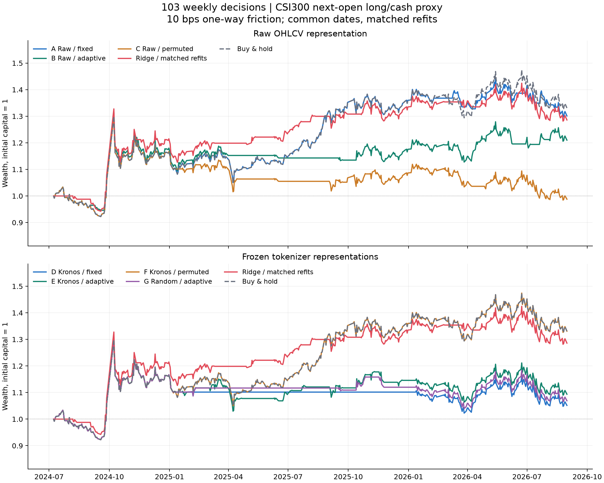
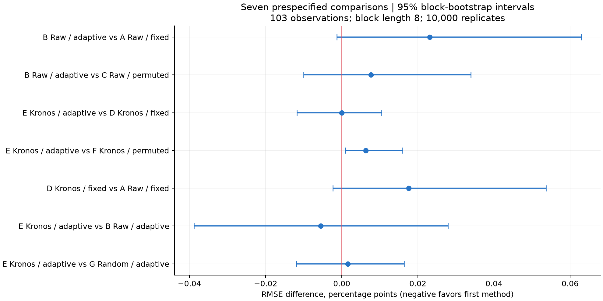
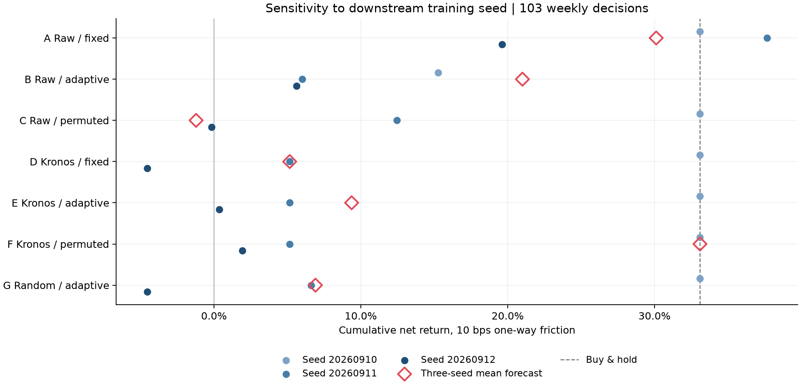

# 第四轮方法测试：Crossformer、分段和 Kronos 编码

实验日期：2026-09-10。研究目录：research_v4。完成七组模型、三个随机种子、三个滚动区间的 63 次开发期训练，并保存全部检查点。

## 结果与判断

**本轮没有获得支持自适应分段＋Kronos 编码组合的可靠增益证据。** 在共同 103 周、单边 10 bp 成本下，原始数值＋固定分段 Crossformer 的方向准确率为 55.34%、累计净收益为 +30.11%；改成自适应分段后为 49.51%、+21.00%；Kronos 编码＋自适应分段为 46.60%、+9.37%。同日期重训 Ridge 为 55.34%、+28.60%，买入持有为 +33.09%。这只针对本轮明确的小型网络、收益读出和训练预算，不是对所有 Crossformer 或 Kronos 用法的否定。

**自适应边界的局部好处没有转化为整套方法优势。** 原始数值下，自适应分段比打乱分段的净收益高 22.22 个百分点，平均净周收益差的未校正 95% 区间为正；但它仍落后于固定分段，RMSE 也没有改善。在 Kronos 表示下，自适应分段又落后于打乱分段。共同区间七项主要 MSE 比较经 Holm 校正均未达到 5% 显著性，最小校正 p 为 0.1491。

**预训练编码没有证明超过同架构随机编码。** E 组比 G 组准确率高 2.91 个百分点，但区间为 [−4.85, 10.68] 个百分点，RMSE 反而略高，MSE Holm p=1.0000。净收益 +9.37% 对 +6.91% 的差距中，2025-06-20 信号周贡献了约 96.6% 的对数净值差；不能据此确认预训练收益。

**表面的高收益主要提示要检查模型是否真正利用输入。** F 组 Kronos 编码＋打乱分段的 +33.09% 与买入持有完全相同，因为集成预测全为正。D 组的预测在各折内标准差仅约 0.03–0.05 bp，99.999% 的整体预测方差来自重训区间均值变化；E 组对应占比为 98.57%。标准化训练损失接近 1，且七个集成模型的共同区间 RMSE 都高于简单的同折训练均值预测。预测收缩本身不能区分欠拟合与输入缺乏可预测信息，需要先诊断学习过程。

**训练随机性也限制了结论。** E 组三个种子的独立净收益分别为 +33.09%、+5.16%、+0.36%，三个种子方向一致率仅为 29.13%。A 组虽较稳定，但其相对同日期重训 Ridge 的 1.52 个百分点累计净收益优势，在扣除贡献最大的 2025-08-15 信号周后转为负的对数净值差。48 周敏感性窗口内，B 组净收益为 +5.87%，高于 A 组的 +0.78%，但方向准确率相同、预测 RMSE 更差，配对区间不能确认优势。

本轮是补齐缺失接口后进行的探索性组合实验。前三轮已经检查过这段历史，因此这里的结果属于开发期证据，不能当作全新留出集的确认结果，也不能宣称精确复现原文的 57.81%。

## 共同区间：103 次周度决策

信号日为 2024-07-05 至 2026-08-21，首笔可执行开盘为 2024-07-08，最终结算为 2026-08-31 开盘。所有模型使用完全相同的信号与实际成交代理价格。各神经网络的主结果均取三个种子的收益预测均值，然后按预测大于零持有，否则空仓；不选择收益最好的种子。

下表累计收益和最大回撤均包含单边 10 bp 假设摩擦。方向准确率按预测收益符号计算，不是所有交易的盈利比例。买入持有的“准确率”只是实际上涨周的比例，RMSE 留空，因为它是仓位基准。

| 模型／策略 | 方向准确率 | 收益 RMSE | 收益相关性 | 累计净收益 | 最大回撤 | 持仓时间占比 |
| --- | --- | --- | --- | --- | --- | --- |
| A 原始数值＋固定分段 | 55.34% | 0.02750 | 0.010 | 30.11% | -19.15% | 91.00% |
| B 原始数值＋自适应分段 | 49.51% | 0.02773 | -0.104 | 21.00% | -16.76% | 69.35% |
| C 原始数值＋打乱分段 | 42.72% | 0.02765 | -0.111 | -1.22% | -24.25% | 75.10% |
| D Kronos 编码＋固定分段 | 42.72% | 0.02767 | -0.089 | 5.16% | -21.33% | 52.87% |
| E Kronos 编码＋自适应分段 | 46.60% | 0.02767 | -0.108 | 9.37% | -20.75% | 72.61% |
| F Kronos 编码＋打乱分段 | 54.37% | 0.02761 | -0.106 | 33.09% | -19.15% | 100.00% |
| G 随机编码＋自适应分段 | 43.69% | 0.02766 | -0.090 | 6.91% | -20.02% | 57.47% |
| Ridge：同日期重训 | 55.34% | 0.02759 | 0.003 | 28.60% | -15.16% | 70.31% |
| 训练样本平均收益 | 54.37% | 0.02748 | -0.075 | 33.09% | -19.15% | 100.00% |
| 买入持有 | 54.37% | — | — | 33.09% | -19.15% | 100.00% |
| 零收益预测／空仓 | 45.63% | 0.02759 | — | 0.00% | 0.00% | 0.00% |

图中净值包含区间内每日开盘价格波动，不只画周度结算点；最大回撤也按同一每日开盘净值口径计算。持仓时间占比按回测中的交易日开盘区间计，可能不同于预测为上涨的周数占比。价格指数不含分红，现金利息取零。

第三轮两条冻结预测仅作背景参照。季度 Ridge 与本轮同日期重训 Ridge 的训练截止日不同，直接 Kronos-small 与本轮 tokenizer＋Crossformer 也属于不同模型，不能混称同一控制组。

| 模型／策略 | 方向准确率 | 收益 RMSE | 收益相关性 | 累计净收益 | 最大回撤 | 持仓时间占比 |
| --- | --- | --- | --- | --- | --- | --- |
| 第三轮 Ridge：季度重训 | 55.34% | 0.02758 | 0.005 | 29.29% | -15.16% | 70.31% |
| 第三轮 Kronos-small：直接预测 | 53.40% | 0.03296 | 0.014 | 10.93% | -11.44% | 32.95% |

## 七个预先指定的配对比较

同一信号日配对，采用长度为 8 个观察值的循环分块 bootstrap，重复 10,000 次。RMSE 差值小于零代表前者更好；准确率差值大于零代表前者更好。MSE 的检验在每个评价窗口内对七项主要比较做 Holm 校正。RMSE 区间是边际 95% 区间，不是七项同时置信区间；方向及收益指标属于探索性诊断。

| 前者减后者 | ΔRMSE | RMSE 差 95% 区间 | MSE Holm p | Δ准确率／百分点 | 准确率差 95% 区间／百分点 |
| --- | --- | --- | --- | --- | --- |
| B − A | 0.000231 | [-0.000013, 0.000630] | 0.3984 | -5.83 | [-18.45, 4.85] |
| B − C | 0.000077 | [-0.000100, 0.000339] | 1.0000 | +6.80 | [0.00, 14.56] |
| E − D | -0.000000 | [-0.000117, 0.000105] | 1.0000 | +3.88 | [-4.85, 12.62] |
| E − F | 0.000063 | [0.000009, 0.000160] | 0.1491 | -7.77 | [-17.48, 0.97] |
| D − A | 0.000176 | [-0.000023, 0.000537] | 0.4895 | -12.62 | [-26.21, 0.00] |
| E − B | -0.000055 | [-0.000388, 0.000279] | 1.0000 | -2.91 | [-12.62, 6.80] |
| E − G | 0.000016 | [-0.000119, 0.000164] | 1.0000 | +2.91 | [-4.85, 10.68] |

完整结果还包含净周收益差的区间，以及每组模型相对 Ridge、零收益和买入持有的诊断比较。bootstrap 在观察周之间分块，未涵盖新市场时期的不确定性，也没有把三个训练种子当作三个独立市场样本。

## 预测有没有随样本变化

下表采用三种子集成预测，分别在三个固定模型区间内计算预测标准差。末列为每折最后一轮、三种子平均的训练期标准化 MSE；训练期按标签均值输出的标准化 MSE 基准为 1。训练日志中的损失含训练模式 dropout 和逐批更新，因此它是优化过程诊断，不能替代在固定最终权重上的完整训练集误差。

| 模型 | 2024 折内预测 SD／bp | 2025 折内预测 SD／bp | 2026 折内预测 SD／bp | 折间均值解释的预测方差 | 各折末轮训练损失范围 |
| --- | --- | --- | --- | --- | --- |
| A 原始数值＋固定分段 | 0.37 | 0.20 | 11.42 | 0.877% | 0.9973–1.0005 |
| B 原始数值＋自适应分段 | 8.88 | 8.73 | 24.50 | 25.451% | 0.9888–0.9988 |
| C 原始数值＋打乱分段 | 0.13 | 8.22 | 10.32 | 29.218% | 0.9979–1.0007 |
| D Kronos 编码＋固定分段 | 0.03 | 0.05 | 0.04 | 99.999% | 1.0008–1.0034 |
| E Kronos 编码＋自适应分段 | 1.19 | 2.52 | 0.66 | 98.570% | 1.0006–1.0054 |
| F Kronos 编码＋打乱分段 | 0.30 | 1.97 | 0.56 | 98.531% | 1.0010–1.0053 |
| G 随机编码＋自适应分段 | 0.43 | 3.89 | 1.56 | 95.195% | 1.0008–1.0021 |

折间解释比例按“1 − 各折内预测平方离差之和／全区间预测平方离差”计算。D 组几乎完全依靠重训后的整体偏移改变方向，E 组也主要受折间均值变化影响。这是完成实验后的描述性诊断，没有据此修改模型或预算。有效条件期望的波动本就可以远小于实际收益波动；这里需要验证的是新增预测能否降低误差，而不是强行放大预测幅度。

## 种子、年份与成本敏感性

以下是各个训练种子单独执行相同仓位规则的结果。集成结果是先平均预测再决定仓位，不能用三个单种子净收益的均值替代。随机 tokenizer 本身只用预先固定的一个初始化种子；因此 G 组只能检验该随机编码对照，尚未覆盖随机编码器初始化的分布。

| 模型 | 种子 20260910 净收益 | 种子 20260911 净收益 | 种子 20260912 净收益 | 三种子方向一致率 |
| --- | --- | --- | --- | --- |
| A 原始数值＋固定分段 | 33.09% | 37.66% | 19.61% | 64.08% |
| B 原始数值＋自适应分段 | 15.27% | 6.01% | 5.63% | 32.04% |
| C 原始数值＋打乱分段 | 33.09% | 12.47% | -0.17% | 37.86% |
| D Kronos 编码＋固定分段 | 33.09% | 5.16% | -4.54% | 29.13% |
| E Kronos 编码＋自适应分段 | 33.09% | 5.16% | 0.36% | 29.13% |
| F Kronos 编码＋打乱分段 | 33.09% | 5.16% | 1.92% | 29.13% |
| G 随机编码＋自适应分段 | 33.09% | 6.62% | -4.54% | 29.13% |

各年份使用连续持仓路径切片计算，没有每年重新空仓或重复收取期末清算成本；2024 和 2026 均不是完整年份。

| 模型 | 2024 年 7 月起 | 2025 年 | 2026 年至 8 月 |
| --- | --- | --- | --- |
| A 原始数值＋固定分段 | 10.27% | 26.32% | -6.59% |
| B 原始数值＋自适应分段 | 11.52% | 7.98% | 0.49% |
| C 原始数值＋打乱分段 | 10.27% | 0.92% | -11.24% |
| D Kronos 编码＋固定分段 | 10.27% | -0.10% | -4.54% |
| E Kronos 编码＋自适应分段 | 10.27% | 3.91% | -4.54% |
| F Kronos 编码＋打乱分段 | 10.27% | 26.32% | -4.45% |
| G 随机编码＋自适应分段 | 10.27% | 1.56% | -4.54% |
| Ridge：同日期重训 | 14.82% | 19.09% | -5.95% |
| 买入持有 | 10.27% | 26.32% | -4.45% |

单边成本同时作用于首次建仓、每次仓位变化和最后清算；持续持仓不重复收费。这里只设定 0、5、10、20 bp 的总摩擦情景，没有把它们解释成交易所法定费率或某家券商报价。

| 模型 | 0 bp | 5 bp | 10 bp | 20 bp |
| --- | --- | --- | --- | --- |
| A 原始数值＋固定分段 | 32.21% | 31.16% | 30.11% | 28.04% |
| B 原始数值＋自适应分段 | 23.45% | 22.22% | 21.00% | 18.60% |
| C 原始数值＋打乱分段 | 0.37% | -0.43% | -1.22% | -2.79% |
| D Kronos 编码＋固定分段 | 5.58% | 5.37% | 5.16% | 4.74% |
| E Kronos 编码＋自适应分段 | 12.03% | 10.69% | 9.37% | 6.77% |
| F Kronos 编码＋打乱分段 | 33.36% | 33.23% | 33.09% | 32.83% |
| G 随机编码＋自适应分段 | 8.20% | 7.55% | 6.91% | 5.63% |
| Ridge：同日期重训 | 31.20% | 29.89% | 28.60% | 26.05% |
| 买入持有 | 33.36% | 33.23% | 33.09% | 32.83% |

相对同日期重训 Ridge 的收益差还做了单周贡献检查。下面只是从已实现的对数收益差中扣除贡献，并未删除价格数据后重跑交易，更不是可事先执行的避开某周策略。

| 模型相对同重训 Ridge | 总对数净值差 | 贡献最大信号周 | 该周贡献 | 扣该周贡献后差值 | 扣前三周贡献后差值 |
| --- | --- | --- | --- | --- | --- |
| A 原始数值＋固定分段 | 0.0117 | 2025-08-15 | 0.0459 | -0.0342 | -0.0965 |
| B 原始数值＋自适应分段 | -0.0609 | 2026-04-03 | 0.0384 | -0.0992 | -0.1641 |
| C 原始数值＋打乱分段 | -0.2638 | 2024-07-12 | 0.0217 | -0.2854 | -0.3234 |
| D Kronos 编码＋固定分段 | -0.2012 | 2026-04-03 | 0.0384 | -0.2396 | -0.2952 |
| E Kronos 编码＋自适应分段 | -0.1619 | 2026-04-03 | 0.0384 | -0.2003 | -0.2459 |
| F Kronos 编码＋打乱分段 | 0.0344 | 2025-08-15 | 0.0459 | -0.0115 | -0.0768 |
| G 随机编码＋自适应分段 | -0.1847 | 2026-04-03 | 0.0384 | -0.2231 | -0.2687 |

## 公开发布后的敏感性窗口：48 次决策

起点按第三轮冻结口径保留为 2025-08-18，落入样本的第一个周五信号是 2025-08-22。该切片从空仓重新计算首笔成本。它有助于检查较短窗口的变化，但仍是已观察历史；本轮 Crossformer 并不是当时已发布、已保存的预测模型。

| 模型／策略 | 方向准确率 | 收益 RMSE | 收益相关性 | 累计净收益 | 最大回撤 | 持仓时间占比 |
| --- | --- | --- | --- | --- | --- | --- |
| A 原始数值＋固定分段 | 54.17% | 0.01867 | 0.031 | 0.78% | -10.26% | 80.89% |
| B 原始数值＋自适应分段 | 54.17% | 0.01905 | -0.109 | 5.87% | -7.71% | 76.83% |
| C 原始数值＋打乱分段 | 43.75% | 0.01875 | -0.054 | -6.37% | -12.06% | 88.21% |
| D Kronos 编码＋固定分段 | 43.75% | 0.01900 | -0.148 | -4.54% | -10.02% | 62.60% |
| E Kronos 编码＋自适应分段 | 47.92% | 0.01907 | -0.146 | -2.43% | -10.02% | 78.86% |
| F Kronos 编码＋打乱分段 | 52.08% | 0.01895 | -0.146 | 3.09% | -10.02% | 100.00% |
| G 随机编码＋自适应分段 | 43.75% | 0.01891 | -0.139 | -4.29% | -10.34% | 70.73% |
| Ridge：同日期重训 | 50.00% | 0.01885 | -0.034 | -1.06% | -10.02% | 82.93% |
| 买入持有 | 52.08% | — | — | 3.09% | -10.02% | 100.00% |

| 前者减后者 | ΔRMSE | RMSE 差 95% 区间 | MSE Holm p | Δ准确率／百分点 | 准确率差 95% 区间／百分点 |
| --- | --- | --- | --- | --- | --- |
| B − A | 0.000380 | [-0.000217, 0.000912] | 0.9319 | +0.00 | [-10.42, 12.50] |
| B − C | 0.000301 | [-0.000182, 0.000764] | 0.9319 | +10.42 | [-2.08, 25.00] |
| E − D | 0.000067 | [-0.000156, 0.000271] | 1.0000 | +4.17 | [-2.08, 12.50] |
| E − F | 0.000118 | [-0.000010, 0.000236] | 0.3948 | -4.17 | [-14.58, 6.25] |
| D − A | 0.000334 | [-0.000106, 0.000785] | 0.7349 | -10.42 | [-27.08, 4.17] |
| E − B | 0.000021 | [-0.000756, 0.000836] | 1.0000 | -6.25 | [-20.83, 8.33] |
| E − G | 0.000157 | [-0.000102, 0.000412] | 0.9319 | +4.17 | [0.00, 10.42] |

## 数据、训练和因果边界

复用前三轮冻结的腾讯日线与执行标签，没有补充新价格或改动早期结果。沪深 300 共 4,046 条日线，覆盖 2010-01-04 至 2026-08-31；2015-03-27 的 OHLC 异常行仍保留在交易日历中，输入或标签触及异常的样本不参与训练。全部模型使用 3,785 个候选日度窗口中在各截止日已经完成标签的样本。

输入均为信号日收盘后可观察的最近 125 根 K 线。标签是“当前信号后的实际开盘到下一个同星期信号后的实际开盘”的收益；训练可用周一至周五的成熟样本，评估只用冻结的周五样本。遇到周五休市，持有至下一个实际周五信号的下一交易日开盘，因此不是强行假设每次都相隔五个交易日。

| 训练截止日 | 完成标签的训练样本数 | 最晚训练标签完成日 | 预测信号范围 | 预测周数 |
| --- | --- | --- | --- | --- |
| 2024-06-30 | 3257 | 2024-06-28 | 2024-07-05 至 2024-12-27 | 25 |
| 2024-12-31 | 3382 | 2024-12-31 | 2025-01-03 至 2025-12-26 | 48 |
| 2025-12-31 | 3625 | 2025-12-31 | 2026-01-09 至 2026-08-21 | 30 |

所有新增模型都在同一日期从头训练，先用 2024-06-30 截止的历史，再于 2024 和 2025 年底重训。训练标签必须在截止日前完成。区间内不调参、不按测试收益改轮数、阈值或种子。Ridge 使用第三轮相同的 255 个经济特征、lambda=10，以及本轮相同的完成标签和重训日期。

训练轮数只由 A 组原始数值固定分段模型在 2018–2020 年的 141 个周五样本选择。每个年度、每个种子都训练至 10 轮，记录第 2、5、10 轮验证结果；按三种子预测均值的 RMSE 选择一次，再应用于全部七组。

| 训练轮数 | 2018–2020 验证 RMSE | 方向准确率 |
| --- | --- | --- |
| 2 | 0.030527 | 56.03% |
| 5 | 0.030411 | 59.57% |
| 10 | 0.030987 | 52.48% |

最终固定为 **5 轮**。验证期训练均值基准 RMSE 为 0.030573，零收益基准为 0.030560。验证准确率不是开发期准确率，所选轮数也只代表本轮小型网络和固定训练预算的结果。未针对编码模型分别寻优，因此这是共同预算下的消融，不是各方法最优性能排行榜。

AdamW 学习率 0.001、weight decay 0.01、batch 128、梯度范数裁剪 1.0，三个下游种子为 20260910、20260911、20260912。只打乱已经完成标签的训练样本，验证和开发信号保持时间顺序。GPU 使用 float32、确定性运算和关闭 TF32 的设置。

## 方法接口与控制组

**分段。** 固定分段为 25 个连续的五日片段。自适应分段复用第一轮冻结的年度 P0 和逆向 DTW：候选长度 5–25，L1 最小总路径距离再按该路径长度归一化，保留最前端不足五日的余段。P0 来自已取得的七个其他指数、八个原型，而不是原文缺失名单的 78 指数完整 P0。2024、2025、2026 年的原型分别只使用截至上年末的数据；训练样本也使用该折截止日可取得的特征提取器。

打乱分段沿用每个样本自适应分段的长度集合和有效片段数，用预先固定的 20260909＋anchor 随机种子重排长度，再切割原始时间顺序的窗口。它保留压缩程度，但破坏与形态匹配的边界。B 对 C、E 对 F 比较比单纯与固定 25 段比较更能检查边界选择的作用；这种对照仍非所有可能分段的穷举检验。

每段线性重采样到五个点，最多 25 个槽位右对齐，不足部分补零。额外传入片段长度／125、片段终点／125 和有效性掩码。原始数值为 log OHLC、log1p 成交量，各自在已观察的 125 日窗口内标准化。

**Kronos 编码。** 使用官方冻结 Kronos-Tokenizer-base，而非把高位 token ID 当连续数值。OHLCVA 采用官方 float32 窗口均值、标准差＋1e-5 及 ±5 裁剪；缺少的成交额明确置零。每个 125 日窗口单独调用编码器，再由官方 indices_to_bits 还原为 20 维、幅度 1／√20 的双极坐标。严禁先编码完整时间序列再切历史窗口。对分段内这些坐标做插值后，它们是连续向量特征，不再被解释为有效离散 token。

G 组使用同一个官方 tokenizer 架构、随机初始化种子 20260913、相同归一化和量化接口，随后冻结。E 与 G 的下游维度和参数量一致；原始数值与 tokenizer 组分别是 5 维和 20 维，比较它们同时改变了表达维度，不能把全部差异都归因于预训练。

编码器沿用第三轮按 LFS 核验过的公开权重。论文描述的预训练结束日为 2024 年 6 月，但该具体权重没有独立公布更细的训练截止证据，所以共同窗口依赖论文日期假设。仓库版本、权重实际发布时间和历史上能否使用是不同问题；本实验不是当时可用性的历史重建。预训练编码器没有参与 2018–2020 年轮数选择。

**Crossformer。** 保留官方 DSW 嵌入、时间／维度双阶段注意力、router、两层层次编码器和三层叠加解码器。使用 d_model=32、d_ff=64、4 heads、router factor=4、dropout=0.1、合并窗口 2；有效编码尺度为 25 槽到 13 槽。新增两维片段几何嵌入，以及从解码器 5×输入维度特征到一个收益值的线性读出层。收益标签按训练期均值／标准差缩放，预测后还原。

读出层零初始化，其余网络参数正常训练。解码器中间值是潜在特征，**没有训练成五日 OHLCAV 预测**；这是与原文目标函数的明确差别。原始数组三组各 138,441 个可训练参数，20 维编码四组各 150,996 个。固定、自适应、打乱分段在各自表示下参数量一致；预训练与随机编码对照也一致。

官方 Crossformer 原版没有变长补零掩码。本轮在时间注意力与解码器历史交叉注意力中屏蔽无效键，并在注意力、维度路由和分段合并后压制无效状态；合并后的有效性按参与片段取 OR。奇数槽位沿用官方末段复制规则。新增几何特征关闭且所有片段有效时，解码结果与未改动的官方模型通过数值一致性检查。

## 验证与可复查证据

最终验证状态：**PASS**。九项单元测试覆盖官方等价性、掩码数值不变性、无效输入梯度为零、仅一个有效片段、合成小样本可训练、未来价格扰动不影响当前窗口变换、固定重组一致性、打乱长度保持性以及编码坐标合法性。另独立重编码 12 个预训练／随机窗口，并加载 **63 个开发期检查点**回放全部种子预测，最大差异为 1e-16。

独立重算全部 1339 行主预测标签、2163 行种子预测的集成规则、训练边界、验证轮数选择和持仓方向；每日净值、周度复利与买入持有解析计算相符。输入、源码、原型、权重和检查点哈希均通过校验；前三轮 994 个纳入保全的证据文件未改变。外部 vendor 和权重目录不计入该证据文件数，它们另外按来源清单核验。

首次重编码复验发现 float32 均值／标准差因数组内存布局而有约 1e-5 的差异：准备程序先将全部窗口堆成 C 连续数组，最初验证程序直接处理 pandas 的列连续数组。验证程序恢复原有 C 连续布局后，全部 3,785 个窗口输入逐值完全一致，抽样编码也逐位一致；没有放宽比较精度或改动数据、训练及预测。首次失败日志和定位结果一并保留。

模型训练耗时 18.44 分钟，不含环境安装、输入准备、统计分析和检查点复验；设备为 NVIDIA GeForce RTX 4060 Laptop GPU，torch 2.6.0+cu124。本轮创建独立 GPU 虚拟环境，使用电脑已有驱动，没有修改前几轮源码、数据或账户配置。

- [冻结实验协议](../protocol.json)、[训练选择](selection.json)、[训练来源清单](training_manifest.json)、[输入准备清单](preparation_manifest.json)。
- [主预测逐行记录](predictions.csv)、[全部种子预测](development_seed_predictions.csv)、[训练曲线](training_curves.csv)、[滚动区间](folds.json)。
- [评价指标](metrics.csv)、[成本敏感性](cost_sensitivity.csv)、[年度结果](yearly_metrics.csv)、[种子结果](seed_metrics.csv)。
- [预测变化诊断](prediction_variation_diagnostics.csv)、[归一化布局定位](normalization_layout_diagnostic.json)、[首次复验日志](verification_first_attempt.txt)。
- [七项配对统计](paired_comparisons.json)、[基准诊断比较](diagnostic_comparisons.json)、[单周贡献诊断](influence_diagnostics.json)。
- [最终复验](verification.json)、[测试日志](test_results.txt)、[检查点与哈希](checkpoint_manifest.json)、[编码器重算核验](tokenizer_verification.json)。
- 图表提供 PNG 与可编辑矢量版：[净值 SVG](ablation_equity.svg)、[种子 SVG](seed_sensitivity.svg)、[配对误差 SVG](paired_rmse.svg)。
- [执行与复验说明](../README.md)。交付文件哈希保存在同目录 delivery_manifest.json；它不把自己递归纳入哈希。

## 后续方向

优先级应调整为：**先判断模型有没有学出依赖输入的有效预测，再讨论更复杂的分段与编码。** 保留本轮 A 组、同重训 Ridge、训练均值和买入持有作为冻结基线。下一轮的候选筛选应回到开发结果之外的训练／历史验证区间，预先规定训练损失、输入扰动敏感性、预测随样本变化的幅度和超过均值基准的门槛，避免仅凭持仓偏多获得漂亮收益。

具体可先做真实训练片段上的拟合能力检查，再单独比较连续数值／连续 tokenizer 潜变量与当前量化坐标接口。若要更贴近原文，则把原文的未来 OHLCAV 或价格重建目标作为一个明确的新任务，比较它和本轮直接收益读出；这些都属于新实验，不能拿当前结果直接推定有效。每次只改变一个接口或训练目标，采用同一验证规则和种子预算。

只有简单基线和训练健康检查通过，再投入完整原型库、真实成交额和更大网络。即使未来在这 103 周改进，也应视为开发期结果；确认性证据需要尚未使用的时间区间或事先保留的独立资产。当前结论不支持把本轮组合用于实盘，本文也没有修改任何交易运行代码或账户。

## 原始来源

方法结构依据 [Crossformer 官方仓库](https://github.com/Thinklab-SJTU/Crossformer/tree/c10c8eadb153d1dd9798250967747ca3ebb81383)，官方组件保持在 vendor 中，本轮的掩码和读出层位于 architecture.py。Kronos 编码器依据 [官方仓库固定版本](https://github.com/shiyu-coder/Kronos/tree/67b630e67f6a18c9e9be918d9b4337c960db1e9a) 与 [Kronos 原论文](https://arxiv.org/abs/2508.02739)，权重为 [Kronos-Tokenizer-base 固定版本](https://huggingface.co/NeoQuasar/Kronos-Tokenizer-base/tree/0e0117387f39004a9016484a186a908917e22426)。本报告中的数值均来自本地冻结实验，不是论文中的报告结果。
