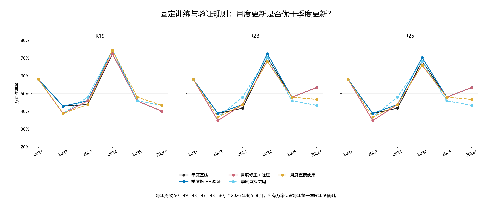
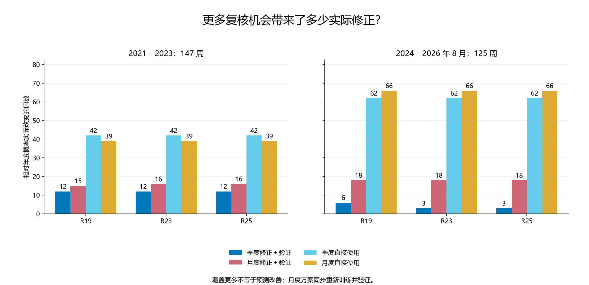

# 第四十轮：成熟周样本状态修正，月度与季度更新比较

本轮只改变修正器训练与保留验证的联合更新频率。年度模型、交互项、状态定义、52 周训练／13 周验证、成熟隔离、状态训练至少 10 周／验证至少 5 周、正则 20 和截距上限 0.5 均沿用 R39。验证要求三种子等权概率的 Brier 降低超过 1e−12，且方向正确周数不减少；严格大于 0.5 判上涨。

验证通过后不重拟合，不叠加旧修正。月度验证与月度直接使用共享同一批训练参数。样本不足或验证拒绝时精确复制年度概率。所有年份第一季度均保留年度预测，因此年末重置之外，1 月和 2 月的月底决定也不启用修正。月末周五信号仍使用此前月底决定，不能使用当天结束后才形成的修正。

这是训练和验证一起变频，不是只改变停止时机。额外月度更新会改变训练／验证成员、拟合参数和启用决定。所有历史结果此前已查看，本轮是探索性历史回放，没有新盲测、没有新增神经网络训练，也没有进行收益、交易成本或部署测试。

共 68 个月底决定，其中 39 个满足总量要求；实际拟合 1152 个状态标量，84/1088 个门控单元通过预定规则（包括诊断方法 R18）。同一状态和方法的多个月份并非独立试验。

## 预先冻结的时间安排

| 决定日 | 处理 | 训练截止 | 训练周 | 验证周 | 验证首信号 | 验证最晚成熟 |
|---|---|---|---|---|---|---|
| 2020-12-31 | 年度重置 | — | 0 | 0 | — | — |
| 2021-01-31 | 第一季度回退 | 2021-01-07 | 0 | 2 | 2021-01-08 | 2021-01-25 |
| 2021-02-28 | 第一季度回退 | 2021-01-07 | 0 | 5 | 2021-01-08 | 2021-02-22 |
| 2021-03-31 | 历史不足 | 2021-01-07 | 0 | 10 | 2021-01-08 | 2021-03-29 |
| 2021-04-30 | 历史不足 | 2021-01-14 | 0 | 13 | 2021-01-15 | 2021-04-26 |
| 2021-05-31 | 历史不足 | 2021-02-25 | 5 | 13 | 2021-02-26 | 2021-05-31 |
| 2021-06-30 | 历史不足 | 2021-03-25 | 9 | 13 | 2021-03-26 | 2021-06-28 |
| 2021-07-31 | 历史不足 | 2021-04-22 | 13 | 13 | 2021-04-23 | 2021-07-26 |
| 2021-08-31 | 历史不足 | 2021-05-27 | 18 | 13 | 2021-05-28 | 2021-08-30 |
| 2021-09-30 | 历史不足 | 2021-06-24 | 22 | 13 | 2021-06-25 | 2021-09-28 |
| 2021-10-31 | 历史不足 | 2021-07-15 | 25 | 13 | 2021-07-16 | 2021-10-25 |
| 2021-11-30 | 历史不足 | 2021-08-19 | 30 | 13 | 2021-08-20 | 2021-11-29 |
| 2021-12-31 | 年度重置 | 2021-09-16 | 34 | 13 | 2021-09-17 | 2021-12-27 |
| 2022-01-31 | 第一季度回退 | 2021-10-21 | 38 | 13 | 2021-10-22 | 2022-01-24 |
| 2022-02-28 | 第一季度回退 | 2021-11-18 | 42 | 13 | 2021-11-19 | 2022-02-28 |
| 2022-03-31 | 历史不足 | 2021-12-16 | 46 | 13 | 2021-12-17 | 2022-03-28 |
| 2022-04-30 | 历史不足 | 2022-01-13 | 50 | 13 | 2022-01-14 | 2022-04-25 |
| 2022-05-31 | ready | 2022-02-24 | 52 | 13 | 2022-02-25 | 2022-05-30 |
| 2022-06-30 | ready | 2022-03-17 | 52 | 13 | 2022-03-18 | 2022-06-27 |
| 2022-07-31 | ready | 2022-04-14 | 52 | 13 | 2022-04-15 | 2022-07-25 |
| 2022-08-31 | ready | 2022-05-19 | 52 | 13 | 2022-05-20 | 2022-08-29 |
| 2022-09-30 | ready | 2022-06-23 | 52 | 13 | 2022-06-24 | 2022-09-26 |
| 2022-10-31 | ready | 2022-07-21 | 52 | 13 | 2022-07-22 | 2022-10-31 |
| 2022-11-30 | ready | 2022-08-18 | 52 | 13 | 2022-08-19 | 2022-11-28 |
| 2022-12-31 | 年度重置 | 2022-09-15 | 52 | 13 | 2022-09-16 | 2022-12-26 |
| 2023-01-31 | 第一季度回退 | 2022-10-20 | 52 | 13 | 2022-10-21 | 2023-01-30 |
| 2023-02-28 | 第一季度回退 | 2022-11-17 | 52 | 13 | 2022-11-18 | 2023-02-27 |
| 2023-03-31 | ready | 2022-12-15 | 52 | 13 | 2022-12-16 | 2023-03-27 |
| 2023-04-30 | ready | 2023-01-12 | 52 | 13 | 2023-01-13 | 2023-04-24 |
| 2023-05-31 | ready | 2023-02-23 | 52 | 13 | 2023-02-24 | 2023-05-29 |
| 2023-06-30 | ready | 2023-03-16 | 52 | 13 | 2023-03-17 | 2023-06-19 |
| 2023-07-31 | ready | 2023-04-20 | 52 | 13 | 2023-04-21 | 2023-07-31 |
| 2023-08-31 | ready | 2023-05-18 | 52 | 13 | 2023-05-19 | 2023-08-28 |
| 2023-09-30 | ready | 2023-06-15 | 52 | 13 | 2023-06-16 | 2023-09-25 |
| 2023-10-31 | ready | 2023-07-13 | 52 | 13 | 2023-07-14 | 2023-10-30 |
| 2023-11-30 | ready | 2023-08-10 | 52 | 13 | 2023-08-11 | 2023-11-27 |
| 2023-12-31 | 年度重置 | 2023-09-07 | 52 | 13 | 2023-09-08 | 2023-12-25 |
| 2024-01-31 | 第一季度回退 | 2023-10-26 | 52 | 13 | 2023-10-27 | 2024-01-29 |
| 2024-02-29 | 第一季度回退 | 2023-11-09 | 52 | 13 | 2023-11-10 | 2024-02-26 |
| 2024-03-31 | ready | 2023-12-07 | 52 | 13 | 2023-12-08 | 2024-03-25 |
| 2024-04-30 | ready | 2024-01-04 | 52 | 13 | 2024-01-05 | 2024-04-29 |
| 2024-05-31 | ready | 2024-01-25 | 52 | 13 | 2024-01-26 | 2024-05-27 |
| 2024-06-30 | ready | 2024-03-07 | 52 | 13 | 2024-03-08 | 2024-06-24 |
| 2024-07-31 | ready | 2024-04-18 | 52 | 13 | 2024-04-19 | 2024-07-29 |
| 2024-08-31 | ready | 2024-05-23 | 52 | 13 | 2024-05-24 | 2024-08-26 |
| 2024-09-30 | ready | 2024-06-27 | 52 | 13 | 2024-06-28 | 2024-09-30 |
| 2024-10-31 | ready | 2024-07-18 | 52 | 13 | 2024-07-19 | 2024-10-28 |
| 2024-11-30 | ready | 2024-08-15 | 52 | 13 | 2024-08-16 | 2024-11-25 |
| 2024-12-31 | 年度重置 | 2024-09-19 | 52 | 13 | 2024-09-20 | 2024-12-30 |
| 2025-01-31 | 第一季度回退 | 2024-10-24 | 52 | 13 | 2024-10-25 | 2025-01-27 |
| 2025-02-28 | 第一季度回退 | 2024-11-14 | 52 | 13 | 2024-11-15 | 2025-02-24 |
| 2025-03-31 | ready | 2024-12-19 | 52 | 13 | 2024-12-20 | 2025-03-31 |
| 2025-04-30 | ready | 2025-01-09 | 52 | 13 | 2025-01-10 | 2025-04-28 |
| 2025-05-31 | ready | 2025-02-06 | 52 | 13 | 2025-02-07 | 2025-05-26 |
| 2025-06-30 | ready | 2025-03-13 | 52 | 13 | 2025-03-14 | 2025-06-30 |
| 2025-07-31 | ready | 2025-04-17 | 52 | 13 | 2025-04-18 | 2025-07-28 |
| 2025-08-31 | ready | 2025-05-22 | 52 | 13 | 2025-05-23 | 2025-08-25 |
| 2025-09-30 | ready | 2025-06-26 | 52 | 13 | 2025-06-27 | 2025-09-29 |
| 2025-10-31 | ready | 2025-07-17 | 52 | 13 | 2025-07-18 | 2025-10-27 |
| 2025-11-30 | ready | 2025-08-14 | 52 | 13 | 2025-08-15 | 2025-11-24 |
| 2025-12-31 | 年度重置 | 2025-09-18 | 52 | 13 | 2025-09-19 | 2025-12-29 |
| 2026-01-31 | 第一季度回退 | 2025-10-16 | 52 | 13 | 2025-10-17 | 2026-01-26 |
| 2026-02-28 | 第一季度回退 | 2025-11-06 | 52 | 13 | 2025-11-07 | 2026-02-24 |
| 2026-03-31 | ready | 2025-12-11 | 52 | 13 | 2025-12-12 | 2026-03-30 |
| 2026-04-30 | ready | 2026-01-15 | 52 | 13 | 2026-01-16 | 2026-04-27 |
| 2026-05-31 | ready | 2026-02-05 | 52 | 13 | 2026-02-06 | 2026-05-25 |
| 2026-06-30 | ready | 2026-03-12 | 52 | 13 | 2026-03-13 | 2026-06-29 |
| 2026-07-31 | ready | 2026-04-09 | 52 | 13 | 2026-04-10 | 2026-07-27 |

训练标签必须在第一个验证信号之前已经成熟；验证标签必须不晚于决定日成熟；评分信号严格晚于决定日。重置或回退行保留潜在成员数量仅作审计，不代表实际拟合。52 和 13 是周信号数量，不是严格的日历年和季度。

## 2021—2023：147 周

| 方法 | 方案 | 正确／周数 | 准确率 | Brier↓ | 对数损失↓ | AUROC |
|---|---|---|---|---|---|---|
| R19 | 年度基线 | 71/147 | 48.30% | 0.277967 | 0.752923 | 0.468121 |
| R19 | 季度修正＋验证 | 72/147 | 48.98% | 0.277416 | 0.751825 | 0.471917 |
| R19 | 月度修正＋验证 | 70/147 | 47.62% | 0.277601 | 0.752191 | 0.468501 |
| R19 | 季度直接使用 | 71/147 | 48.30% | 0.275945 | 0.748529 | 0.472676 |
| R19 | 月度直接使用 | 69/147 | 46.94% | 0.276896 | 0.750508 | 0.466793 |
| R23 | 年度基线 | 68/147 | 46.26% | 0.276195 | 0.749569 | 0.476850 |
| R23 | 季度修正＋验证 | 69/147 | 46.94% | 0.275610 | 0.748399 | 0.480645 |
| R23 | 月度修正＋验证 | 67/147 | 45.58% | 0.275831 | 0.748841 | 0.478368 |
| R23 | 季度直接使用 | 70/147 | 47.62% | 0.274027 | 0.744955 | 0.483491 |
| R23 | 月度直接使用 | 68/147 | 46.26% | 0.275006 | 0.746978 | 0.478178 |
| R25 | 年度基线 | 68/147 | 46.26% | 0.276108 | 0.749367 | 0.475712 |
| R25 | 季度修正＋验证 | 69/147 | 46.94% | 0.275517 | 0.748182 | 0.479317 |
| R25 | 月度修正＋验证 | 67/147 | 45.58% | 0.275735 | 0.748619 | 0.477609 |
| R25 | 季度直接使用 | 70/147 | 47.62% | 0.273930 | 0.744735 | 0.482732 |
| R25 | 月度直接使用 | 68/147 | 46.26% | 0.274909 | 0.746757 | 0.477040 |

## 2024—2026 年 8 月：125 周

| 方法 | 方案 | 正确／周数 | 准确率 | Brier↓ | 对数损失↓ | AUROC |
|---|---|---|---|---|---|---|
| R19 | 年度基线 | 68/125 | 54.40% | 0.246843 | 0.687439 | 0.582435 |
| R19 | 季度修正＋验证 | 69/125 | 55.20% | 0.246156 | 0.686054 | 0.589882 |
| R19 | 月度修正＋验证 | 68/125 | 54.40% | 0.247415 | 0.688587 | 0.581407 |
| R19 | 季度直接使用 | 70/125 | 56.00% | 0.246324 | 0.686457 | 0.585773 |
| R19 | 月度直接使用 | 71/125 | 56.80% | 0.245439 | 0.684598 | 0.591166 |
| R23 | 年度基线 | 72/125 | 57.60% | 0.249790 | 0.693613 | 0.563174 |
| R23 | 季度修正＋验证 | 73/125 | 58.40% | 0.248903 | 0.691827 | 0.570108 |
| R23 | 月度修正＋验证 | 71/125 | 56.80% | 0.249923 | 0.693900 | 0.562917 |
| R23 | 季度直接使用 | 68/125 | 54.40% | 0.248801 | 0.691696 | 0.570108 |
| R23 | 月度直接使用 | 69/125 | 55.20% | 0.247948 | 0.689901 | 0.577298 |
| R25 | 年度基线 | 71/125 | 56.80% | 0.249824 | 0.693671 | 0.562917 |
| R25 | 季度修正＋验证 | 72/125 | 57.60% | 0.248933 | 0.691876 | 0.570108 |
| R25 | 月度修正＋验证 | 70/125 | 56.00% | 0.249946 | 0.693936 | 0.562404 |
| R25 | 季度直接使用 | 67/125 | 53.60% | 0.248814 | 0.691709 | 0.570108 |
| R25 | 月度直接使用 | 68/125 | 54.40% | 0.247957 | 0.689907 | 0.577042 |

## 全段：272 周

| 方法 | 方案 | 正确／周数 | 准确率 | Brier↓ | 对数损失↓ | AUROC |
|---|---|---|---|---|---|---|
| R19 | 年度基线 | 139/272 | 51.10% | 0.263664 | 0.722829 | 0.499132 |
| R19 | 季度修正＋验证 | 141/272 | 51.84% | 0.263050 | 0.721599 | 0.504069 |
| R19 | 月度修正＋验证 | 138/272 | 50.74% | 0.263729 | 0.722961 | 0.499132 |
| R19 | 季度直接使用 | 141/272 | 51.84% | 0.262332 | 0.720003 | 0.505588 |
| R19 | 月度直接使用 | 140/272 | 51.47% | 0.262440 | 0.720218 | 0.504340 |
| R23 | 年度基线 | 140/272 | 51.47% | 0.264060 | 0.723854 | 0.496799 |
| R23 | 季度修正＋验证 | 142/272 | 52.21% | 0.263337 | 0.722401 | 0.502062 |
| R23 | 月度修正＋验证 | 138/272 | 50.74% | 0.263925 | 0.723592 | 0.497179 |
| R23 | 季度直接使用 | 138/272 | 50.74% | 0.262434 | 0.720479 | 0.504340 |
| R23 | 月度直接使用 | 137/272 | 50.37% | 0.262571 | 0.720748 | 0.502821 |
| R25 | 年度基线 | 139/272 | 51.10% | 0.264029 | 0.723771 | 0.496257 |
| R25 | 季度修正＋验证 | 141/272 | 51.84% | 0.263300 | 0.722306 | 0.501519 |
| R25 | 月度修正＋验证 | 137/272 | 50.37% | 0.263883 | 0.723489 | 0.496528 |
| R25 | 季度直接使用 | 137/272 | 50.37% | 0.262388 | 0.720367 | 0.503906 |
| R25 | 月度直接使用 | 136/272 | 50.00% | 0.262523 | 0.720631 | 0.502007 |

## 2026 年截至 8 月：30 周

| 方法 | 方案 | 正确／周数 | 准确率 | Brier↓ | 对数损失↓ | AUROC |
|---|---|---|---|---|---|---|
| R19 | 年度基线 | 12/30 | 40.00% | 0.257501 | 0.708270 | 0.392857 |
| R19 | 季度修正＋验证 | 12/30 | 40.00% | 0.258700 | 0.710673 | 0.383929 |
| R19 | 月度修正＋验证 | 12/30 | 40.00% | 0.258700 | 0.710673 | 0.383929 |
| R19 | 季度直接使用 | 13/30 | 43.33% | 0.255995 | 0.705123 | 0.410714 |
| R19 | 月度直接使用 | 13/30 | 43.33% | 0.254458 | 0.701974 | 0.419643 |
| R23 | 年度基线 | 16/30 | 53.33% | 0.257140 | 0.707785 | 0.415179 |
| R23 | 季度修正＋验证 | 16/30 | 53.33% | 0.257140 | 0.707785 | 0.415179 |
| R23 | 月度修正＋验证 | 16/30 | 53.33% | 0.257140 | 0.707785 | 0.415179 |
| R23 | 季度直接使用 | 13/30 | 43.33% | 0.255318 | 0.703999 | 0.415179 |
| R23 | 月度直接使用 | 14/30 | 46.67% | 0.253837 | 0.700944 | 0.433036 |
| R25 | 年度基线 | 16/30 | 53.33% | 0.257098 | 0.707697 | 0.415179 |
| R25 | 季度修正＋验证 | 16/30 | 53.33% | 0.257098 | 0.707697 | 0.415179 |
| R25 | 月度修正＋验证 | 16/30 | 53.33% | 0.257098 | 0.707697 | 0.415179 |
| R25 | 季度直接使用 | 13/30 | 43.33% | 0.255264 | 0.703889 | 0.415179 |
| R25 | 月度直接使用 | 14/30 | 46.67% | 0.253782 | 0.700835 | 0.433036 |

## 逐年方向正确数

### R19

| 年份 | 周数 | 年度基线 | 季度修正＋验证 | 月度修正＋验证 | 季度直接使用 | 月度直接使用 |
|---|---|---|---|---|---|---|
| 2021 | 50 | 29 | 29 | 29 | 29 | 29 |
| 2022 | 49 | 21 | 21 | 19 | 19 | 19 |
| 2023 | 48 | 21 | 22 | 22 | 23 | 21 |
| 2024 | 47 | 34 | 35 | 34 | 35 | 35 |
| 2025 | 48 | 22 | 22 | 22 | 22 | 23 |
| 2026 | 30 | 12 | 12 | 12 | 13 | 13 |

### R23

| 年份 | 周数 | 年度基线 | 季度修正＋验证 | 月度修正＋验证 | 季度直接使用 | 月度直接使用 |
|---|---|---|---|---|---|---|
| 2021 | 50 | 29 | 29 | 29 | 29 | 29 |
| 2022 | 49 | 19 | 19 | 17 | 18 | 18 |
| 2023 | 48 | 20 | 21 | 21 | 23 | 21 |
| 2024 | 47 | 33 | 34 | 32 | 33 | 32 |
| 2025 | 48 | 23 | 23 | 23 | 22 | 23 |
| 2026 | 30 | 16 | 16 | 16 | 13 | 14 |

### R25

| 年份 | 周数 | 年度基线 | 季度修正＋验证 | 月度修正＋验证 | 季度直接使用 | 月度直接使用 |
|---|---|---|---|---|---|---|
| 2021 | 50 | 29 | 29 | 29 | 29 | 29 |
| 2022 | 49 | 19 | 19 | 17 | 18 | 18 |
| 2023 | 48 | 20 | 21 | 21 | 23 | 21 |
| 2024 | 47 | 32 | 33 | 31 | 32 | 31 |
| 2025 | 48 | 23 | 23 | 23 | 22 | 23 |
| 2026 | 30 | 16 | 16 | 16 | 13 | 14 |

## 月度方案相对年度的覆盖与方向变化

| 时期 | 方法 | 方案 | 可拟合周 | 验证通过覆盖周 | 概率实际改变周 | 错→对 | 对→错 |
|---|---|---|---|---|---|---|---|
| extension_2021_2023 | R23 | 月度直接使用 | 39 | 16 | 39 | 2 | 2 |
| extension_2021_2023 | R25 | 月度直接使用 | 39 | 16 | 39 | 2 | 2 |
| extension_2021_2023 | R19 | 月度直接使用 | 39 | 15 | 39 | 1 | 3 |
| extension_2021_2023 | R23 | 月度修正＋验证 | 39 | 16 | 16 | 1 | 2 |
| extension_2021_2023 | R25 | 月度修正＋验证 | 39 | 16 | 16 | 1 | 2 |
| extension_2021_2023 | R19 | 月度修正＋验证 | 39 | 15 | 15 | 1 | 2 |
| recent_2024_2026 | R23 | 月度直接使用 | 66 | 18 | 66 | 3 | 6 |
| recent_2024_2026 | R25 | 月度直接使用 | 66 | 18 | 66 | 3 | 6 |
| recent_2024_2026 | R19 | 月度直接使用 | 66 | 18 | 66 | 5 | 2 |
| recent_2024_2026 | R23 | 月度修正＋验证 | 66 | 18 | 18 | 1 | 2 |
| recent_2024_2026 | R25 | 月度修正＋验证 | 66 | 18 | 18 | 1 | 2 |
| recent_2024_2026 | R19 | 月度修正＋验证 | 66 | 18 | 18 | 1 | 1 |
| year_2026 | R23 | 月度直接使用 | 10 | 0 | 10 | 1 | 3 |
| year_2026 | R25 | 月度直接使用 | 10 | 0 | 10 | 1 | 3 |
| year_2026 | R19 | 月度直接使用 | 10 | 2 | 10 | 1 | 0 |
| year_2026 | R23 | 月度修正＋验证 | 10 | 0 | 0 | 0 | 0 |
| year_2026 | R25 | 月度修正＋验证 | 10 | 0 | 0 | 0 | 0 |
| year_2026 | R19 | 月度修正＋验证 | 10 | 2 | 2 | 0 | 0 |

“验证通过覆盖周”也附在直接使用对照上供核对；直接使用不会据此回退。概率改变不一定改变方向。

## 月度相对对应季度：改善与退步

| 时期 | 方法 | 月度方案 | 比较周 | 概率变化周 | 错→对 | 对→错 | Brier 差↓ |
|---|---|---|---|---|---|---|---|
| extension_2021_2023 | R19 | 月度修正＋验证 | 147 | 12 | 0 | 2 | 0.000184 |
| extension_2021_2023 | R23 | 月度修正＋验证 | 147 | 13 | 0 | 2 | 0.000221 |
| extension_2021_2023 | R25 | 月度修正＋验证 | 147 | 13 | 0 | 2 | 0.000218 |
| extension_2021_2023 | R19 | 月度直接使用 | 147 | 31 | 0 | 2 | 0.000950 |
| extension_2021_2023 | R23 | 月度直接使用 | 147 | 31 | 0 | 2 | 0.000979 |
| extension_2021_2023 | R25 | 月度直接使用 | 147 | 31 | 0 | 2 | 0.000979 |
| recent_2024_2026 | R19 | 月度修正＋验证 | 125 | 18 | 1 | 2 | 0.001259 |
| recent_2024_2026 | R23 | 月度修正＋验证 | 125 | 21 | 1 | 3 | 0.001021 |
| recent_2024_2026 | R25 | 月度修正＋验证 | 125 | 21 | 1 | 3 | 0.001013 |
| recent_2024_2026 | R19 | 月度直接使用 | 125 | 34 | 1 | 0 | -0.000884 |
| recent_2024_2026 | R23 | 月度直接使用 | 125 | 34 | 2 | 1 | -0.000853 |
| recent_2024_2026 | R25 | 月度直接使用 | 125 | 34 | 2 | 1 | -0.000857 |
| year_2026 | R19 | 月度修正＋验证 | 30 | 0 | 0 | 0 | 0.000000 |
| year_2026 | R23 | 月度修正＋验证 | 30 | 0 | 0 | 0 | 0.000000 |
| year_2026 | R25 | 月度修正＋验证 | 30 | 0 | 0 | 0 | 0.000000 |
| year_2026 | R19 | 月度直接使用 | 30 | 7 | 0 | 0 | -0.001538 |
| year_2026 | R23 | 月度直接使用 | 30 | 7 | 1 | 0 | -0.001482 |
| year_2026 | R25 | 月度直接使用 | 30 | 7 | 1 | 0 | -0.001482 |

## 额外月份的状态启用／停用登记

下表保留所有主要方法在额外月底发生的启用或停用，包含随后无该状态信号的单元。启用和停用按相邻月底的验证决定变化定义；第一季度回退单独标明。后续 Brier 仅作事后诊断，未参与门控。正的后续 Brier 差不等于已估计出统计误报率。

| 决定日 | 方法 | 状态 | 处理 | 变化 | 季度门控启用 | 后续周 | 后续 Brier 相对季度 |
|---|---|---|---|---|---|---|---|
| 2022-05-31 | R23 | 负趋势／高波动 | ready | enabled | 否 | 1 | 0.004774 |
| 2022-05-31 | R25 | 负趋势／高波动 | ready | enabled | 否 | 1 | 0.004658 |
| 2022-07-31 | R19 | 负趋势／高波动 | ready | stopped | 是 | 0 | — |
| 2022-07-31 | R23 | 负趋势／高波动 | ready | stopped | 是 | 0 | — |
| 2022-07-31 | R25 | 负趋势／高波动 | ready | stopped | 是 | 0 | — |
| 2022-10-31 | R19 | 负趋势／低波动 | ready | enabled | 否 | 0 | — |
| 2022-10-31 | R23 | 负趋势／低波动 | ready | enabled | 否 | 0 | — |
| 2022-10-31 | R25 | 负趋势／低波动 | ready | enabled | 否 | 0 | — |
| 2022-11-30 | R19 | 负趋势／高波动 | ready | enabled | 否 | 3 | 0.006770 |
| 2022-11-30 | R23 | 负趋势／高波动 | ready | enabled | 否 | 3 | 0.007113 |
| 2022-11-30 | R25 | 负趋势／高波动 | ready | enabled | 否 | 3 | 0.007081 |
| 2024-04-30 | R19 | 负趋势／低波动 | ready | stopped | 是 | 0 | — |
| 2024-04-30 | R23 | 负趋势／低波动 | ready | stopped | 是 | 0 | — |
| 2024-04-30 | R25 | 负趋势／低波动 | ready | stopped | 是 | 0 | — |
| 2024-05-31 | R19 | 非负趋势／低波动 | ready | enabled | 否 | 1 | 0.004751 |
| 2024-05-31 | R23 | 非负趋势／低波动 | ready | enabled | 否 | 1 | 0.004485 |
| 2024-05-31 | R25 | 非负趋势／低波动 | ready | enabled | 否 | 1 | 0.004434 |
| 2024-07-31 | R19 | 负趋势／低波动 | ready | enabled | 否 | 5 | -0.011676 |
| 2024-07-31 | R23 | 负趋势／低波动 | ready | enabled | 否 | 5 | -0.016102 |
| 2024-07-31 | R23 | 非负趋势／低波动 | ready | enabled | 否 | 0 | — |
| 2024-07-31 | R25 | 负趋势／低波动 | ready | enabled | 否 | 5 | -0.016374 |
| 2024-07-31 | R25 | 非负趋势／低波动 | ready | enabled | 否 | 0 | — |
| 2024-08-31 | R19 | 非负趋势／低波动 | ready | stopped | 是 | 0 | — |
| 2024-08-31 | R23 | 非负趋势／低波动 | ready | stopped | 否 | 0 | — |
| 2024-08-31 | R25 | 非负趋势／低波动 | ready | stopped | 否 | 0 | — |
| 2024-10-31 | R19 | 负趋势／低波动 | ready | enabled | 否 | 0 | — |
| 2024-11-30 | R19 | 负趋势／低波动 | ready | stopped | 否 | 0 | — |
| 2025-04-30 | R19 | 负趋势／低波动 | ready | enabled | 否 | 4 | 0.007049 |
| 2025-04-30 | R23 | 负趋势／低波动 | ready | enabled | 否 | 4 | 0.008234 |
| 2025-04-30 | R25 | 负趋势／低波动 | ready | enabled | 否 | 4 | 0.008278 |
| 2025-05-31 | R19 | 负趋势／低波动 | ready | stopped | 否 | 3 | 0.000000 |
| 2025-07-31 | R19 | 负趋势／低波动 | ready | stopped | 是 | 0 | — |
| 2025-07-31 | R23 | 负趋势／低波动 | ready | stopped | 是 | 0 | — |
| 2025-07-31 | R25 | 负趋势／低波动 | ready | stopped | 是 | 0 | — |
| 2025-08-31 | R19 | 非负趋势／低波动 | ready | enabled | 否 | 0 | — |
| 2025-08-31 | R23 | 非负趋势／低波动 | ready | enabled | 否 | 0 | — |
| 2025-08-31 | R25 | 非负趋势／低波动 | ready | enabled | 否 | 0 | — |
| 2025-10-31 | R19 | 非负趋势／高波动 | ready | enabled | 否 | 2 | 0.000030 |
| 2025-10-31 | R23 | 非负趋势／高波动 | ready | enabled | 否 | 2 | -0.000005 |
| 2025-10-31 | R25 | 非负趋势／高波动 | ready | enabled | 否 | 2 | -0.000014 |

## R23 在 2026 年的月度验证决定

| 决定日 | 状态 | 训练周 | 验证周 | 验证 Brier 差 | 验证正确数：年度→候选 | 原因 |
|---|---|---|---|---|---|---|
| 2026-03-31 | 负趋势／低波动 | 13 | 2 | 0.000099 | 2→2 | 状态验证不足 |
| 2026-03-31 | 负趋势／高波动 | 7 | 0 | — | 0→0 | 状态训练不足 |
| 2026-03-31 | 非负趋势／低波动 | 16 | 10 | 0.010659 | 5→6 | Brier 未改善 |
| 2026-03-31 | 非负趋势／高波动 | 16 | 1 | -0.007349 | 1→1 | 状态验证不足 |
| 2026-04-30 | 负趋势／低波动 | 13 | 2 | 0.000099 | 2→2 | 状态验证不足 |
| 2026-04-30 | 负趋势／高波动 | 7 | 4 | 0.000000 | 1→1 | 状态训练不足 |
| 2026-04-30 | 非负趋势／低波动 | 20 | 6 | 0.032869 | 3→2 | Brier 未改善 |
| 2026-04-30 | 非负趋势／高波动 | 12 | 1 | -0.007517 | 1→1 | 状态验证不足 |
| 2026-05-31 | 负趋势／低波动 | 14 | 1 | 0.004729 | 1→0 | 状态验证不足 |
| 2026-05-31 | 负趋势／高波动 | 7 | 4 | 0.000000 | 1→1 | 状态训练不足 |
| 2026-05-31 | 非负趋势／低波动 | 21 | 5 | 0.018833 | 4→4 | Brier 未改善 |
| 2026-05-31 | 非负趋势／高波动 | 10 | 3 | -0.006111 | 2→1 | 状态验证不足 |
| 2026-06-30 | 负趋势／低波动 | 15 | 0 | — | 0→0 | 状态验证不足 |
| 2026-06-30 | 负趋势／高波动 | 4 | 4 | 0.000000 | 1→1 | 状态训练不足 |
| 2026-06-30 | 非负趋势／低波动 | 23 | 4 | 0.001078 | 4→4 | 状态验证不足 |
| 2026-06-30 | 非负趋势／高波动 | 10 | 5 | -0.004824 | 2→0 | 方向正确数减少 |
| 2026-07-31 | 负趋势／低波动 | 12 | 0 | — | 0→0 | 状态验证不足 |
| 2026-07-31 | 负趋势／高波动 | 4 | 3 | 0.000000 | 0→0 | 状态训练不足 |
| 2026-07-31 | 非负趋势／低波动 | 25 | 2 | -0.018097 | 2→2 | 状态验证不足 |
| 2026-07-31 | 非负趋势／高波动 | 11 | 8 | -0.001074 | 4→1 | 方向正确数减少 |

## 近期各种子表现

| 方法 | 方案 | 种子 | 正确数／125 | Brier↓ |
|---|---|---|---|---|
| R23 | 月度直接使用 | 20260910 | 66 | 0.256518 |
| R23 | 月度直接使用 | 20260911 | 72 | 0.248731 |
| R23 | 月度直接使用 | 20260912 | 69 | 0.254365 |
| R25 | 月度直接使用 | 20260910 | 66 | 0.256387 |
| R25 | 月度直接使用 | 20260911 | 71 | 0.248785 |
| R25 | 月度直接使用 | 20260912 | 68 | 0.254194 |
| R19 | 月度直接使用 | 20260910 | 67 | 0.259590 |
| R19 | 月度直接使用 | 20260911 | 70 | 0.242765 |
| R19 | 月度直接使用 | 20260912 | 69 | 0.250312 |
| R23 | 月度修正＋验证 | 20260910 | 65 | 0.258463 |
| R23 | 月度修正＋验证 | 20260911 | 69 | 0.250814 |
| R23 | 月度修正＋验证 | 20260912 | 69 | 0.256175 |
| R25 | 月度修正＋验证 | 20260910 | 65 | 0.258342 |
| R25 | 月度修正＋验证 | 20260911 | 68 | 0.250874 |
| R25 | 月度修正＋验证 | 20260912 | 69 | 0.256031 |
| R19 | 月度修正＋验证 | 20260910 | 66 | 0.261625 |
| R19 | 月度修正＋验证 | 20260911 | 67 | 0.244880 |
| R19 | 月度修正＋验证 | 20260912 | 68 | 0.252099 |
| R23 | 年度基线 | 20260910 | 64 | 0.258183 |
| R23 | 年度基线 | 20260911 | 69 | 0.250724 |
| R23 | 年度基线 | 20260912 | 69 | 0.256229 |
| R25 | 年度基线 | 20260910 | 64 | 0.258066 |
| R25 | 年度基线 | 20260911 | 68 | 0.250797 |
| R25 | 年度基线 | 20260912 | 69 | 0.256099 |
| R19 | 年度基线 | 20260910 | 66 | 0.261033 |
| R19 | 年度基线 | 20260911 | 68 | 0.244238 |
| R19 | 年度基线 | 20260912 | 68 | 0.251749 |
| R23 | 季度直接使用 | 20260910 | 65 | 0.257465 |
| R23 | 季度直接使用 | 20260911 | 71 | 0.249541 |
| R23 | 季度直接使用 | 20260912 | 68 | 0.255091 |
| R25 | 季度直接使用 | 20260910 | 65 | 0.257336 |
| R25 | 季度直接使用 | 20260911 | 70 | 0.249594 |
| R25 | 季度直接使用 | 20260912 | 67 | 0.254932 |
| R19 | 季度直接使用 | 20260910 | 67 | 0.260568 |
| R19 | 季度直接使用 | 20260911 | 68 | 0.243598 |
| R19 | 季度直接使用 | 20260912 | 68 | 0.251096 |
| R23 | 季度修正＋验证 | 20260910 | 64 | 0.257222 |
| R23 | 季度修正＋验证 | 20260911 | 70 | 0.249715 |
| R23 | 季度修正＋验证 | 20260912 | 69 | 0.255536 |
| R25 | 季度修正＋验证 | 20260910 | 64 | 0.257102 |
| R25 | 季度修正＋验证 | 20260911 | 69 | 0.249789 |
| R25 | 季度修正＋验证 | 20260912 | 69 | 0.255397 |
| R19 | 季度修正＋验证 | 20260910 | 65 | 0.260275 |
| R19 | 季度修正＋验证 | 20260911 | 68 | 0.243419 |
| R19 | 季度修正＋验证 | 20260912 | 68 | 0.251270 |

## 预先固定的 60 项探索性比较

月度验证对季度验证、月度直接对季度直接、月度验证对月度直接，以及两个新方案分别对年度：每种比较使用三个主要方法、方向误差与 Brier、两个固定时期。循环 8 周区块重采样 10,000 次，固定种子 20260910，中心化双侧 p 值，60 项统一 Holm 校正。误差差值越低越好。校正不覆盖此前多轮研究和自适应提出本轮假设。

本轮最小校正 p 值为 1.000000；校正后小于 0.05 的比较有 0 项。

| 时期 | 方法 | 候选 | 参照 | 损失 | 差 | 95% 区间 | 原始 p | Holm p |
|---|---|---|---|---|---|---|---|---|
| extension_2021_2023 | R19 | 月度修正＋验证 | 季度修正＋验证 | direction_error | 0.013605 | [0.000000, 0.040816] | 0.324868 | 1.000000 |
| extension_2021_2023 | R19 | 月度修正＋验证 | 季度修正＋验证 | brier | 0.000184 | [-0.000007, 0.000496] | 0.162684 | 1.000000 |
| extension_2021_2023 | R23 | 月度修正＋验证 | 季度修正＋验证 | direction_error | 0.013605 | [0.000000, 0.040816] | 0.324868 | 1.000000 |
| extension_2021_2023 | R23 | 月度修正＋验证 | 季度修正＋验证 | brier | 0.000221 | [0.000009, 0.000547] | 0.093691 | 1.000000 |
| extension_2021_2023 | R25 | 月度修正＋验证 | 季度修正＋验证 | direction_error | 0.013605 | [0.000000, 0.040816] | 0.324868 | 1.000000 |
| extension_2021_2023 | R25 | 月度修正＋验证 | 季度修正＋验证 | brier | 0.000218 | [0.000009, 0.000542] | 0.101690 | 1.000000 |
| extension_2021_2023 | R19 | 月度直接使用 | 季度直接使用 | direction_error | 0.013605 | [0.000000, 0.040816] | 0.288971 | 1.000000 |
| extension_2021_2023 | R19 | 月度直接使用 | 季度直接使用 | brier | 0.000950 | [-0.000009, 0.002341] | 0.102490 | 1.000000 |
| extension_2021_2023 | R23 | 月度直接使用 | 季度直接使用 | direction_error | 0.013605 | [0.000000, 0.040816] | 0.288971 | 1.000000 |
| extension_2021_2023 | R23 | 月度直接使用 | 季度直接使用 | brier | 0.000979 | [0.000001, 0.002411] | 0.102990 | 1.000000 |
| extension_2021_2023 | R25 | 月度直接使用 | 季度直接使用 | direction_error | 0.013605 | [0.000000, 0.040816] | 0.288971 | 1.000000 |
| extension_2021_2023 | R25 | 月度直接使用 | 季度直接使用 | brier | 0.000979 | [0.000000, 0.002411] | 0.103190 | 1.000000 |
| extension_2021_2023 | R19 | 月度修正＋验证 | 月度直接使用 | direction_error | -0.006803 | [-0.020408, 0.000000] | 0.451855 | 1.000000 |
| extension_2021_2023 | R19 | 月度修正＋验证 | 月度直接使用 | brier | 0.000705 | [-0.000464, 0.002170] | 0.298270 | 1.000000 |
| extension_2021_2023 | R23 | 月度修正＋验证 | 月度直接使用 | direction_error | 0.006803 | [0.000000, 0.020408] | 0.458154 | 1.000000 |
| extension_2021_2023 | R23 | 月度修正＋验证 | 月度直接使用 | brier | 0.000825 | [-0.000348, 0.002326] | 0.235076 | 1.000000 |
| extension_2021_2023 | R25 | 月度修正＋验证 | 月度直接使用 | direction_error | 0.006803 | [0.000000, 0.020408] | 0.458154 | 1.000000 |
| extension_2021_2023 | R25 | 月度修正＋验证 | 月度直接使用 | brier | 0.000827 | [-0.000345, 0.002327] | 0.234077 | 1.000000 |
| extension_2021_2023 | R19 | 月度修正＋验证 | 年度基线 | direction_error | 0.006803 | [-0.020408, 0.034014] | 0.671933 | 1.000000 |
| extension_2021_2023 | R19 | 月度修正＋验证 | 年度基线 | brier | -0.000366 | [-0.001672, 0.000486] | 0.539246 | 1.000000 |
| extension_2021_2023 | R23 | 月度修正＋验证 | 年度基线 | direction_error | 0.006803 | [-0.020408, 0.034014] | 0.671933 | 1.000000 |
| extension_2021_2023 | R23 | 月度修正＋验证 | 年度基线 | brier | -0.000363 | [-0.001728, 0.000522] | 0.555744 | 1.000000 |
| extension_2021_2023 | R25 | 月度修正＋验证 | 年度基线 | direction_error | 0.006803 | [-0.020408, 0.034014] | 0.671933 | 1.000000 |
| extension_2021_2023 | R25 | 月度修正＋验证 | 年度基线 | brier | -0.000373 | [-0.001751, 0.000519] | 0.556744 | 1.000000 |
| extension_2021_2023 | R19 | 月度直接使用 | 年度基线 | direction_error | 0.013605 | [-0.013605, 0.047619] | 0.390461 | 1.000000 |
| extension_2021_2023 | R19 | 月度直接使用 | 年度基线 | brier | -0.001071 | [-0.002881, 0.000468] | 0.214479 | 1.000000 |
| extension_2021_2023 | R23 | 月度直接使用 | 年度基线 | direction_error | 0.000000 | [-0.020408, 0.027211] | 1.000000 | 1.000000 |
| extension_2021_2023 | R23 | 月度直接使用 | 年度基线 | brier | -0.001189 | [-0.003077, 0.000416] | 0.184382 | 1.000000 |
| extension_2021_2023 | R25 | 月度直接使用 | 年度基线 | direction_error | 0.000000 | [-0.020408, 0.027211] | 1.000000 | 1.000000 |
| extension_2021_2023 | R25 | 月度直接使用 | 年度基线 | brier | -0.001199 | [-0.003085, 0.000407] | 0.182282 | 1.000000 |
| recent_2024_2026 | R19 | 月度修正＋验证 | 季度修正＋验证 | direction_error | 0.008000 | [0.000000, 0.024000] | 0.431957 | 1.000000 |
| recent_2024_2026 | R19 | 月度修正＋验证 | 季度修正＋验证 | brier | 0.001259 | [-0.000407, 0.003286] | 0.173383 | 1.000000 |
| recent_2024_2026 | R23 | 月度修正＋验证 | 季度修正＋验证 | direction_error | 0.016000 | [0.000000, 0.048000] | 0.319568 | 1.000000 |
| recent_2024_2026 | R23 | 月度修正＋验证 | 季度修正＋验证 | brier | 0.001021 | [-0.000844, 0.003141] | 0.295870 | 1.000000 |
| recent_2024_2026 | R25 | 月度修正＋验证 | 季度修正＋验证 | direction_error | 0.016000 | [0.000000, 0.048000] | 0.319568 | 1.000000 |
| recent_2024_2026 | R25 | 月度修正＋验证 | 季度修正＋验证 | brier | 0.001013 | [-0.000866, 0.003144] | 0.302170 | 1.000000 |
| recent_2024_2026 | R19 | 月度直接使用 | 季度直接使用 | direction_error | -0.008000 | [-0.024000, 0.000000] | 0.441656 | 1.000000 |
| recent_2024_2026 | R19 | 月度直接使用 | 季度直接使用 | brier | -0.000884 | [-0.001787, -0.000135] | 0.034897 | 1.000000 |
| recent_2024_2026 | R23 | 月度直接使用 | 季度直接使用 | direction_error | -0.008000 | [-0.040000, 0.016000] | 0.581042 | 1.000000 |
| recent_2024_2026 | R23 | 月度直接使用 | 季度直接使用 | brier | -0.000853 | [-0.001725, -0.000113] | 0.036696 | 1.000000 |
| recent_2024_2026 | R25 | 月度直接使用 | 季度直接使用 | direction_error | -0.008000 | [-0.040000, 0.016000] | 0.581042 | 1.000000 |
| recent_2024_2026 | R25 | 月度直接使用 | 季度直接使用 | brier | -0.000857 | [-0.001732, -0.000113] | 0.036796 | 1.000000 |
| recent_2024_2026 | R19 | 月度修正＋验证 | 月度直接使用 | direction_error | 0.024000 | [0.000000, 0.048000] | 0.058894 | 1.000000 |
| recent_2024_2026 | R19 | 月度修正＋验证 | 月度直接使用 | brier | 0.001976 | [0.000143, 0.004276] | 0.057194 | 1.000000 |
| recent_2024_2026 | R23 | 月度修正＋验证 | 月度直接使用 | direction_error | -0.016000 | [-0.040000, 0.008000] | 0.233577 | 1.000000 |
| recent_2024_2026 | R23 | 月度修正＋验证 | 月度直接使用 | brier | 0.001975 | [0.000108, 0.004300] | 0.061994 | 1.000000 |
| recent_2024_2026 | R25 | 月度修正＋验证 | 月度直接使用 | direction_error | -0.016000 | [-0.040000, 0.008000] | 0.233577 | 1.000000 |
| recent_2024_2026 | R25 | 月度修正＋验证 | 月度直接使用 | brier | 0.001989 | [0.000113, 0.004322] | 0.060794 | 1.000000 |
| recent_2024_2026 | R19 | 月度修正＋验证 | 年度基线 | direction_error | 0.000000 | [-0.008000, 0.008000] | 1.000000 | 1.000000 |
| recent_2024_2026 | R19 | 月度修正＋验证 | 年度基线 | brier | 0.000573 | [-0.000821, 0.001989] | 0.397060 | 1.000000 |
| recent_2024_2026 | R23 | 月度修正＋验证 | 年度基线 | direction_error | 0.008000 | [-0.008000, 0.024000] | 0.438856 | 1.000000 |
| recent_2024_2026 | R23 | 月度修正＋验证 | 年度基线 | brier | 0.000133 | [-0.001257, 0.001431] | 0.801620 | 1.000000 |
| recent_2024_2026 | R25 | 月度修正＋验证 | 年度基线 | direction_error | 0.008000 | [-0.008000, 0.024000] | 0.438856 | 1.000000 |
| recent_2024_2026 | R25 | 月度修正＋验证 | 年度基线 | brier | 0.000122 | [-0.001284, 0.001420] | 0.820818 | 1.000000 |
| recent_2024_2026 | R19 | 月度直接使用 | 年度基线 | direction_error | -0.024000 | [-0.056000, 0.000000] | 0.086191 | 1.000000 |
| recent_2024_2026 | R19 | 月度直接使用 | 年度基线 | brier | -0.001403 | [-0.004042, 0.000971] | 0.284472 | 1.000000 |
| recent_2024_2026 | R23 | 月度直接使用 | 年度基线 | direction_error | 0.024000 | [0.000000, 0.056000] | 0.080892 | 1.000000 |
| recent_2024_2026 | R23 | 月度直接使用 | 年度基线 | brier | -0.001842 | [-0.004671, 0.000614] | 0.174683 | 1.000000 |
| recent_2024_2026 | R25 | 月度直接使用 | 年度基线 | direction_error | 0.024000 | [0.000000, 0.056000] | 0.080892 | 1.000000 |
| recent_2024_2026 | R25 | 月度直接使用 | 年度基线 | brier | -0.001868 | [-0.004710, 0.000599] | 0.171183 | 1.000000 |

## 独立审计与解释边界

独立核对 1152 个标量解、4590 个指标单元与 60 项比较。季度重合点的 1104 个参数单元、368 个门控单元与 R39 一致；2184 条对应首月种子预测与季度方案完全相同，第一季度 1632 条种子预测精确回退年度。

训练非成员污染接口 468 次、验证非成员污染检查 68 个截止日均通过。独立复核 2176 个周比较、360 个汇总单元和 1088 个状态转移登记。5,554 个旧证据文件保持不变。

旧 R25 近期 73/125、58.4% 的训练预算结果继续单独保留；本轮自然 20 遍年度 R25 仍为 71/125、56.8%。上一轮状态验证 R23 的 73/125、58.4% 同样保留，不与旧 R25 混同。R37 的 2025 年局部改善及 2026 年退步均保留。

较多更新机会可能带来更及时的调整，也可能带来偶然通过。启用次数、样本覆盖和平均准确率都需结合逐年、逐周变化看待。少量验证周不足以证明状态可稳定迁移。训练输入跨不同年度模型与年度相对状态，不能宣称当前年度网络自身获得了独立验证。

协议 SHA256：`2a6ec5d62d3e800fe56f23bf34ba615c2d924a74efa86e92b9629f5dbf72c34b`
