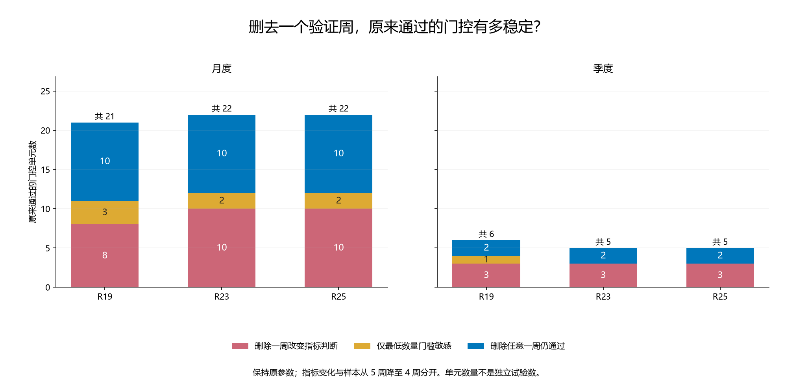
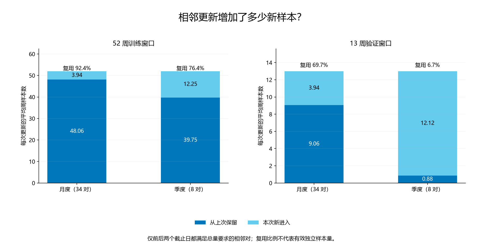

# 第四十一轮：验证门控的单周敏感性、样本复用与支持流失

本轮是只读诊断。沿用 R39 季度与 R40 月度状态修正的全部参数、验证概率、门控决定和已评分的后续预测；没有训练、参数更新、门控重选、预测重算或新增显著性检验。原有 22 条预测历史和 5,633 个旧证据文件保持不变。

原验证规则为：较早 52 个成熟周训练、随后 13 个成熟周验证，按原年度相对趋势／波动状态分组；状态训练至少 10 周、验证至少 5 周；三种子等权概率的 Brier 降低且方向正确数不减少。训练标签在验证开始之前成熟，验证标签不晚于决定日成熟。第一季度回退规则保持不变。

## 单周敏感性怎样测

仅对当时总量和状态支持均足够的单元，逐一删除一个验证周，以原来已冻结的参数和三种子概率重新计算剩余验证周的指标。训练集、参数与后续预测均不改变。支持不足的原单元仍保留登记，不通过删除样本获得资格。

分别记录两种判断：①暂时保持原支持资格，仅检查剩余周的 Brier 与方向正确数；②完整执行原门控，重新要求剩余样本至少 5 周。若原来刚好 5 周，删一周后只有 4 周，第二种必然拒绝；这与指标是否依赖单个观察值分开报告。删除一个周是一项敏感性诊断，不是新的资格认证，也不是置信区间。

共 1456 个原门控单元，其中 192 个满足敏感性检查所需的原始支持条件；实际核对 1560 次单周删除。季度和月度、不同方法之间存在共享信息，不能将单元数或删除次数当作独立样本量。

## 全部历史：通过与拒绝的敏感性

| 频率 | 方法 | 类别 | 单元数 | 指标敏感单元 | 原样本正好 5 周 | 删除次数 | 改变指标判断次数 |
|---|---|---|---|---|---|---|---|
| 月度 | R23 | 全部支持充足单元 | 37 | 14 | 9 | 293 | 42 |
| 月度 | R23 | 全部通过单元 | 22 | 10 | 3 | 180 | 29 |
| 月度 | R23 | 删一周会改变指标判断 | 10 | 10 | 1 | 82 | 29 |
| 月度 | R23 | 仅最低数量门槛敏感 | 2 | 0 | 2 | 10 | 0 |
| 月度 | R23 | 删任意一周仍通过 | 10 | 0 | 0 | 88 | 0 |
| 月度 | R23 | 拒绝：删一周可改变指标判断 | 4 | 4 | 2 | 28 | 13 |
| 月度 | R23 | 拒绝：删任意一周判断不变 | 11 | 0 | 4 | 85 | 0 |
| 月度 | R25 | 全部支持充足单元 | 37 | 14 | 9 | 293 | 42 |
| 月度 | R25 | 全部通过单元 | 22 | 10 | 3 | 180 | 29 |
| 月度 | R25 | 删一周会改变指标判断 | 10 | 10 | 1 | 82 | 29 |
| 月度 | R25 | 仅最低数量门槛敏感 | 2 | 0 | 2 | 10 | 0 |
| 月度 | R25 | 删任意一周仍通过 | 10 | 0 | 0 | 88 | 0 |
| 月度 | R25 | 拒绝：删一周可改变指标判断 | 4 | 4 | 2 | 28 | 13 |
| 月度 | R25 | 拒绝：删任意一周判断不变 | 11 | 0 | 4 | 85 | 0 |
| 月度 | R19 | 全部支持充足单元 | 37 | 16 | 9 | 293 | 47 |
| 月度 | R19 | 全部通过单元 | 21 | 8 | 4 | 166 | 24 |
| 月度 | R19 | 删一周会改变指标判断 | 8 | 8 | 1 | 66 | 24 |
| 月度 | R19 | 仅最低数量门槛敏感 | 3 | 0 | 3 | 15 | 0 |
| 月度 | R19 | 删任意一周仍通过 | 10 | 0 | 0 | 85 | 0 |
| 月度 | R19 | 拒绝：删一周可改变指标判断 | 8 | 8 | 3 | 60 | 23 |
| 月度 | R19 | 拒绝：删任意一周判断不变 | 8 | 0 | 2 | 67 | 0 |
| 季度 | R23 | 全部支持充足单元 | 11 | 5 | 3 | 97 | 20 |
| 季度 | R23 | 全部通过单元 | 5 | 3 | 0 | 49 | 12 |
| 季度 | R23 | 删一周会改变指标判断 | 3 | 3 | 0 | 31 | 12 |
| 季度 | R23 | 仅最低数量门槛敏感 | 0 | 0 | 0 | 0 | 0 |
| 季度 | R23 | 删任意一周仍通过 | 2 | 0 | 0 | 18 | 0 |
| 季度 | R23 | 拒绝：删一周可改变指标判断 | 2 | 2 | 1 | 16 | 8 |
| 季度 | R23 | 拒绝：删任意一周判断不变 | 4 | 0 | 2 | 32 | 0 |
| 季度 | R25 | 全部支持充足单元 | 11 | 5 | 3 | 97 | 20 |
| 季度 | R25 | 全部通过单元 | 5 | 3 | 0 | 49 | 12 |
| 季度 | R25 | 删一周会改变指标判断 | 3 | 3 | 0 | 31 | 12 |
| 季度 | R25 | 仅最低数量门槛敏感 | 0 | 0 | 0 | 0 | 0 |
| 季度 | R25 | 删任意一周仍通过 | 2 | 0 | 0 | 18 | 0 |
| 季度 | R25 | 拒绝：删一周可改变指标判断 | 2 | 2 | 1 | 16 | 8 |
| 季度 | R25 | 拒绝：删任意一周判断不变 | 4 | 0 | 2 | 32 | 0 |
| 季度 | R19 | 全部支持充足单元 | 11 | 5 | 3 | 97 | 19 |
| 季度 | R19 | 全部通过单元 | 6 | 3 | 1 | 53 | 11 |
| 季度 | R19 | 删一周会改变指标判断 | 3 | 3 | 0 | 30 | 11 |
| 季度 | R19 | 仅最低数量门槛敏感 | 1 | 0 | 1 | 5 | 0 |
| 季度 | R19 | 删任意一周仍通过 | 2 | 0 | 0 | 18 | 0 |
| 季度 | R19 | 拒绝：删一周可改变指标判断 | 2 | 2 | 1 | 17 | 8 |
| 季度 | R19 | 拒绝：删任意一周判断不变 | 3 | 0 | 1 | 27 | 0 |

“删一周会改变指标判断”按原接受／拒绝状态计算；原通过单元变成拒绝，或原支持充足的拒绝单元变成通过。分类“仅最低数量门槛敏感”要求指标判断对每一次删除都保持通过，但原样本数正好 5。

## 分时期的已通过单元

| 决定日期时期 | 频率 | 方法 | 通过单元 | 指标敏感单元 | 正好 5 周单元 |
|---|---|---|---|---|---|
| decision_2021_2023 | 月度 | R23 | 8 | 1 | 2 |
| decision_2021_2023 | 月度 | R25 | 8 | 1 | 2 |
| decision_2021_2023 | 月度 | R19 | 7 | 1 | 2 |
| decision_2021_2023 | 季度 | R23 | 2 | 1 | 0 |
| decision_2021_2023 | 季度 | R25 | 2 | 1 | 0 |
| decision_2021_2023 | 季度 | R19 | 2 | 1 | 0 |
| decision_2024_2026 | 月度 | R23 | 14 | 9 | 1 |
| decision_2024_2026 | 月度 | R25 | 14 | 9 | 1 |
| decision_2024_2026 | 月度 | R19 | 14 | 7 | 2 |
| decision_2024_2026 | 季度 | R23 | 3 | 2 | 0 |
| decision_2024_2026 | 季度 | R25 | 3 | 2 | 0 |
| decision_2024_2026 | 季度 | R19 | 4 | 2 | 1 |

时期按门控决定日归属，不是按之后信号日期归属。分时期诊断不能直接当作原固定测试窗口的准确率差。

## 相邻更新重复用了多少样本

每个频率分别比较相邻决定日，对训练／验证、全部样本／四个原状态，逐一登记保留、滚出和新进入的行。满足 当前数量＝之前数量−滚出数量＋新进入数量。以下主表只汇总前后两个决定日都处于 ready 的相邻对，所有回退和历史不足行仍保留在明细。

| 频率 | 角色 | 相邻对数 | 平均当前数量 | 平均保留数量 | 平均新进数量 | 保留占当前比例 |
|---|---|---|---|---|---|---|
| 月度 | 训练 | 34 | 52.00 | 48.06 | 3.94 | 92.4% |
| 月度 | 验证 | 34 | 13.00 | 9.06 | 3.94 | 69.7% |
| 季度 | 训练 | 8 | 52.00 | 39.75 | 12.25 | 76.4% |
| 季度 | 验证 | 8 | 13.00 | 0.88 | 12.12 | 6.7% |

复用比例仅计数同一个历史周是否再次出现；它不是有效独立样本量，也没有校正标签之间可能存在的相关性。参数也可能随更新改变，因此同标签复用不等于整项试验完全重复。

## 通过后因验证支持不足而停用

| 频率 | 方法 | 之前决定日 | 停用日 | 状态 | 前后均 ready | 之前周数 | 保留 | 滚出 | 新进 | 当前周数 |
|---|---|---|---|---|---|---|---|---|---|---|
| 月度 | R19 | 2024-03-31 | 2024-04-30 | 负趋势／低波动 | 是 | 7 | 3 | 4 | 0 | 3 |
| 月度 | R19 | 2024-07-31 | 2024-08-31 | 非负趋势／低波动 | 是 | 8 | 4 | 4 | 0 | 4 |
| 月度 | R23 | 2024-03-31 | 2024-04-30 | 负趋势／低波动 | 是 | 7 | 3 | 4 | 0 | 3 |
| 月度 | R23 | 2024-07-31 | 2024-08-31 | 非负趋势／低波动 | 是 | 8 | 4 | 4 | 0 | 4 |
| 月度 | R25 | 2024-03-31 | 2024-04-30 | 负趋势／低波动 | 是 | 7 | 3 | 4 | 0 | 3 |
| 月度 | R25 | 2024-07-31 | 2024-08-31 | 非负趋势／低波动 | 是 | 8 | 4 | 4 | 0 | 4 |
| 季度 | R19 | 2024-03-31 | 2024-06-30 | 负趋势／低波动 | 是 | 7 | 0 | 7 | 1 | 1 |
| 季度 | R19 | 2025-06-30 | 2025-09-30 | 负趋势／低波动 | 是 | 9 | 0 | 9 | 0 | 0 |
| 季度 | R19 | 2022-06-30 | 2022-09-30 | 负趋势／高波动 | 是 | 12 | 0 | 12 | 0 | 0 |
| 季度 | R19 | 2024-06-30 | 2024-09-30 | 非负趋势／低波动 | 是 | 11 | 0 | 11 | 1 | 1 |
| 季度 | R23 | 2024-03-31 | 2024-06-30 | 负趋势／低波动 | 是 | 7 | 0 | 7 | 1 | 1 |
| 季度 | R23 | 2025-06-30 | 2025-09-30 | 负趋势／低波动 | 是 | 9 | 0 | 9 | 0 | 0 |
| 季度 | R23 | 2022-06-30 | 2022-09-30 | 负趋势／高波动 | 是 | 12 | 0 | 12 | 0 | 0 |
| 季度 | R25 | 2024-03-31 | 2024-06-30 | 负趋势／低波动 | 是 | 7 | 0 | 7 | 1 | 1 |
| 季度 | R25 | 2025-06-30 | 2025-09-30 | 负趋势／低波动 | 是 | 9 | 0 | 9 | 0 | 0 |
| 季度 | R25 | 2022-06-30 | 2022-09-30 | 负趋势／高波动 | 是 | 12 | 0 | 12 | 0 | 0 |

这里的停用原因来自原门控，数量流失来自明确的成员对账；不能把原状态样本滚出短窗口解释为经济状态已经失效，也不能事后假设保留原修正一定更好。支持不足是信息不充分，既可能防止错误启用，也可能错失之后的改善。

## R23 连续通过的全部记录

| 频率 | 状态 | 开始 | 结束 | 连续决定数 | 验证使用次数 | 不同验证周 | 重复使用次数 | 使用次数／不同周 |
|---|---|---|---|---|---|---|---|---|
| 月度 | 负趋势／低波动 | 2022-10-31 | 2022-11-30 | 2 | 10 | 5 | 5 | 2.00 |
| 月度 | 负趋势／低波动 | 2023-09-30 | 2023-11-30 | 3 | 30 | 16 | 14 | 1.88 |
| 月度 | 负趋势／低波动 | 2024-03-31 | 2024-03-31 | 1 | 7 | 7 | 0 | 1.00 |
| 月度 | 负趋势／低波动 | 2024-07-31 | 2024-11-30 | 5 | 41 | 14 | 27 | 2.93 |
| 月度 | 负趋势／低波动 | 2025-04-30 | 2025-06-30 | 3 | 23 | 13 | 10 | 1.77 |
| 月度 | 负趋势／高波动 | 2022-05-31 | 2022-06-30 | 2 | 24 | 14 | 10 | 1.71 |
| 月度 | 负趋势／高波动 | 2022-11-30 | 2022-11-30 | 1 | 6 | 6 | 0 | 1.00 |
| 月度 | 非负趋势／低波动 | 2024-05-31 | 2024-05-31 | 1 | 8 | 8 | 0 | 1.00 |
| 月度 | 非负趋势／低波动 | 2024-07-31 | 2024-07-31 | 1 | 8 | 8 | 0 | 1.00 |
| 月度 | 非负趋势／低波动 | 2025-08-31 | 2025-08-31 | 1 | 8 | 8 | 0 | 1.00 |
| 月度 | 非负趋势／高波动 | 2025-10-31 | 2025-11-30 | 2 | 15 | 9 | 6 | 1.67 |
| 季度 | 负趋势／低波动 | 2023-09-30 | 2023-09-30 | 1 | 9 | 9 | 0 | 1.00 |
| 季度 | 负趋势／低波动 | 2024-03-31 | 2024-03-31 | 1 | 7 | 7 | 0 | 1.00 |
| 季度 | 负趋势／低波动 | 2024-09-30 | 2024-09-30 | 1 | 12 | 12 | 0 | 1.00 |
| 季度 | 负趋势／低波动 | 2025-06-30 | 2025-06-30 | 1 | 9 | 9 | 0 | 1.00 |
| 季度 | 负趋势／高波动 | 2022-06-30 | 2022-06-30 | 1 | 12 | 12 | 0 | 1.00 |

每个通过单元恰好归入一段连续记录；包含只有一次通过的记录。运行中的累计使用次数不能代替独立验证次数。强制年度重置和第一季度回退会打断连续记录。

## 敏感性与已经发生的后续表现

下表只连接原来已经评分的候选直接使用结果；通过单元与原验证方案相同。保留后续没有对应信号的单元。后续表现未用于删除样本、修改门控或构造新策略。方法之间和月度／季度之间重复使用了数据，表中比例不是独立胜率。

| 频率 | 方法 | 通过类别 | 单元 | 有后续信号 | 后续周 | Brier 变差单元 | Brier 变好单元 | 按周加权 Brier 差↓ |
|---|---|---|---|---|---|---|---|---|
| 月度 | R23 | 删一周会改变指标判断 | 10 | 4 | 15 | 2 | 2 | 0.000811 |
| 月度 | R23 | 仅最低数量门槛敏感 | 2 | 0 | 0 | 0 | 0 | — |
| 月度 | R23 | 删任意一周仍通过 | 10 | 7 | 19 | 4 | 3 | -0.002577 |
| 月度 | R25 | 删一周会改变指标判断 | 10 | 4 | 15 | 2 | 2 | 0.000720 |
| 月度 | R25 | 仅最低数量门槛敏感 | 2 | 0 | 0 | 0 | 0 | — |
| 月度 | R25 | 删任意一周仍通过 | 10 | 7 | 19 | 4 | 3 | -0.002653 |
| 月度 | R19 | 删一周会改变指标判断 | 8 | 3 | 10 | 1 | 2 | -0.004378 |
| 月度 | R19 | 仅最低数量门槛敏感 | 3 | 1 | 2 | 1 | 0 | 0.017981 |
| 月度 | R19 | 删任意一周仍通过 | 10 | 7 | 21 | 5 | 2 | 0.001217 |
| 季度 | R23 | 删一周会改变指标判断 | 3 | 1 | 3 | 0 | 1 | -0.036977 |
| 季度 | R23 | 仅最低数量门槛敏感 | 0 | 0 | 0 | 0 | 0 | — |
| 季度 | R23 | 删任意一周仍通过 | 2 | 1 | 12 | 0 | 1 | -0.007157 |
| 季度 | R25 | 删一周会改变指标判断 | 3 | 1 | 3 | 0 | 1 | -0.037151 |
| 季度 | R25 | 仅最低数量门槛敏感 | 0 | 0 | 0 | 0 | 0 | — |
| 季度 | R25 | 删任意一周仍通过 | 2 | 1 | 12 | 0 | 1 | -0.007244 |
| 季度 | R19 | 删一周会改变指标判断 | 3 | 2 | 4 | 0 | 2 | -0.030444 |
| 季度 | R19 | 仅最低数量门槛敏感 | 1 | 1 | 2 | 1 | 0 | 0.017981 |
| 季度 | R19 | 删任意一周仍通过 | 2 | 1 | 12 | 0 | 1 | -0.006745 |

## 旧结果与审计

本轮没有产生新的准确率。R40 近期月度验证 R19／R23／R25 为 68／71／70 个正确周，R39 季度验证为 69／73／72，均以 125 周为分母。2026 年两种频率的验证方案逐周预测相同。原 R25 近期 73/125、58.4% 属于旧训练预算协议；自然 20 遍年度 R25 是 71/125、56.8%；R39 季度验证 R23 的 73/125、58.4% 单独保留。R37 的 2025 年局部改善和 2026 年退步也保留。

独立复核 4528 个验证周贡献、1560 次删除、168 个汇总、890 个成员流汇总、12024 条成员流明细、1424 个门控转移及 69 段连续通过记录；共对账 106 个已通过单元。

全部历史此前已查看，本轮是探索性诊断，没有新增盲测、p 值或因果结论。删除单周后的判断稳定也可能在后续失败，不能直接用本轮敏感性分类作为新的启用门槛。

协议 SHA256：`ff219f7544c7703cd555ef0b2e81b8ec00886c3b0012a0b3900776f1315753eb`
