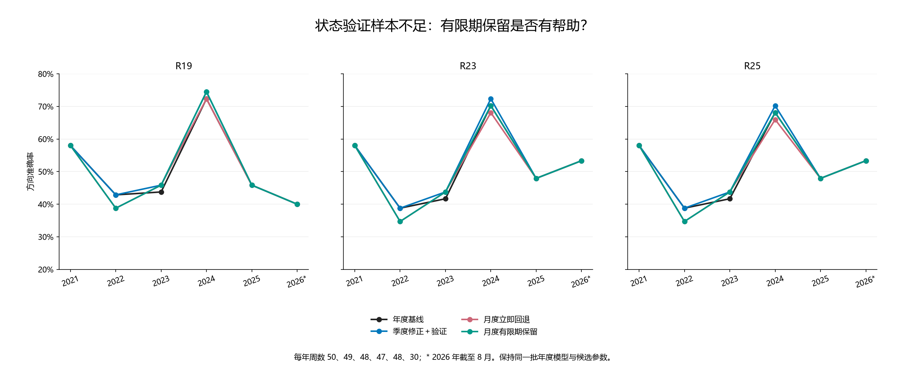
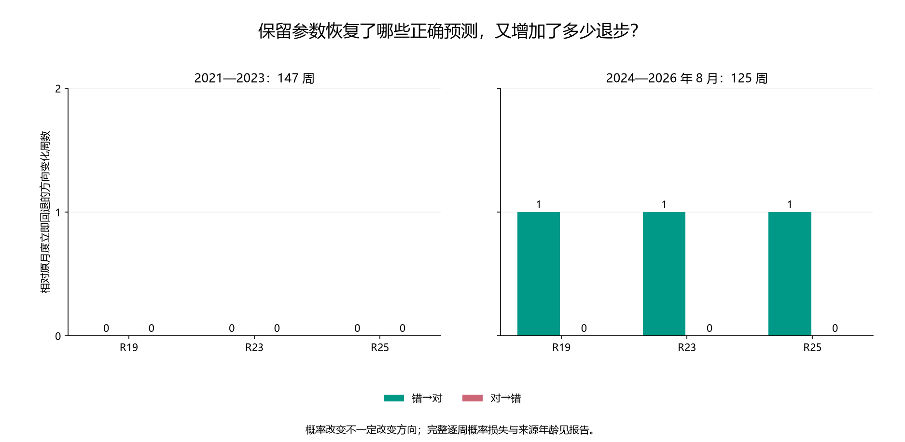

# 第四十二轮：验证状态样本不足时，有限期保留上次通过的修正

本轮新增一条历史预测路由规则，复用 R40 已冻结的月度训练参数和验证门控。没有重新训练神经网络或标量修正，也没有改变年度模型、交互项、四状态定义、52／13 周训练验证、成熟隔离、正则 20、截距上限 0.5 或验证指标门槛。所有历史此前已查看，本轮不是新盲测。

## 预先冻结的行为

每种方法和状态独立保存最近一次正式通过验证的三种子原参数。当前正式通过时，用当前参数替换记录；固定到期日为该正式通过日之后的第一个季度末。仅当当前训练支持仍足够、原门控唯一拒绝原因是验证状态周数少于 5 时，才可暂时使用尚未到期且仍属于同一年度模型／状态边界的记录。

保留不刷新来源日期，也不延长到期日。其他拒绝原因均清空记录，包括 Brier 未改善、方向正确数减少、训练或整体历史不足。记录清空后不能因下一次缺样本而复活。年末与第一季度回退同样清空；绝不把当前未经验证的新参数当成被保留参数。

到期日对预测信号包含当天：例如 3 月 31 日通过，可用于日期不晚于 6 月 30 日的后续信号。月末／季末当天的周信号只能使用此前月底决定；6 月 30 日形成的新决定面向更晚的信号，所以旧记录此时已不能继续保留。该日重新正式通过可以建立到期为 9 月 30 日的新记录。

全部 1,088 个决定单元先冻结后评分：84 个使用当前正式通过的参数，12 个保留旧参数，992 个回退年度（含 R18 诊断方法）。参数来源和到期日没有使用后续结果。新方案只针对支持不足的处理，不保证挡住当前验证通过但随后失效的修正。

## 2021—2023：147 周

| 方法 | 方案 | 正确／周数 | 准确率 | Brier↓ | 对数损失↓ | AUROC |
|---|---|---|---|---|---|---|
| R19 | 年度基线 | 71/147 | 48.30% | 0.277967 | 0.752923 | 0.468121 |
| R19 | 季度修正＋验证 | 72/147 | 48.98% | 0.277416 | 0.751825 | 0.471917 |
| R19 | 月度立即回退 | 70/147 | 47.62% | 0.277601 | 0.752191 | 0.468501 |
| R19 | 月度有限期保留 | 70/147 | 47.62% | 0.277601 | 0.752191 | 0.468501 |
| R23 | 年度基线 | 68/147 | 46.26% | 0.276195 | 0.749569 | 0.476850 |
| R23 | 季度修正＋验证 | 69/147 | 46.94% | 0.275610 | 0.748399 | 0.480645 |
| R23 | 月度立即回退 | 67/147 | 45.58% | 0.275831 | 0.748841 | 0.478368 |
| R23 | 月度有限期保留 | 67/147 | 45.58% | 0.275831 | 0.748841 | 0.478368 |
| R25 | 年度基线 | 68/147 | 46.26% | 0.276108 | 0.749367 | 0.475712 |
| R25 | 季度修正＋验证 | 69/147 | 46.94% | 0.275517 | 0.748182 | 0.479317 |
| R25 | 月度立即回退 | 67/147 | 45.58% | 0.275735 | 0.748619 | 0.477609 |
| R25 | 月度有限期保留 | 67/147 | 45.58% | 0.275735 | 0.748619 | 0.477609 |

## 2024—2026 年 8 月：125 周

| 方法 | 方案 | 正确／周数 | 准确率 | Brier↓ | 对数损失↓ | AUROC |
|---|---|---|---|---|---|---|
| R19 | 年度基线 | 68/125 | 54.40% | 0.246843 | 0.687439 | 0.582435 |
| R19 | 季度修正＋验证 | 69/125 | 55.20% | 0.246156 | 0.686054 | 0.589882 |
| R19 | 月度立即回退 | 68/125 | 54.40% | 0.247415 | 0.688587 | 0.581407 |
| R19 | 月度有限期保留 | 69/125 | 55.20% | 0.246550 | 0.686843 | 0.589111 |
| R23 | 年度基线 | 72/125 | 57.60% | 0.249790 | 0.693613 | 0.563174 |
| R23 | 季度修正＋验证 | 73/125 | 58.40% | 0.248903 | 0.691827 | 0.570108 |
| R23 | 月度立即回退 | 71/125 | 56.80% | 0.249923 | 0.693900 | 0.562917 |
| R23 | 月度有限期保留 | 72/125 | 57.60% | 0.249036 | 0.692114 | 0.570365 |
| R25 | 年度基线 | 71/125 | 56.80% | 0.249824 | 0.693671 | 0.562917 |
| R25 | 季度修正＋验证 | 72/125 | 57.60% | 0.248933 | 0.691876 | 0.570108 |
| R25 | 月度立即回退 | 70/125 | 56.00% | 0.249946 | 0.693936 | 0.562404 |
| R25 | 月度有限期保留 | 71/125 | 56.80% | 0.249054 | 0.692141 | 0.569851 |

## 全段：272 周

| 方法 | 方案 | 正确／周数 | 准确率 | Brier↓ | 对数损失↓ | AUROC |
|---|---|---|---|---|---|---|
| R19 | 年度基线 | 139/272 | 51.10% | 0.263664 | 0.722829 | 0.499132 |
| R19 | 季度修正＋验证 | 141/272 | 51.84% | 0.263050 | 0.721599 | 0.504069 |
| R19 | 月度立即回退 | 138/272 | 50.74% | 0.263729 | 0.722961 | 0.499132 |
| R19 | 月度有限期保留 | 139/272 | 51.10% | 0.263331 | 0.722160 | 0.501845 |
| R23 | 年度基线 | 140/272 | 51.47% | 0.264060 | 0.723854 | 0.496799 |
| R23 | 季度修正＋验证 | 142/272 | 52.21% | 0.263337 | 0.722401 | 0.502062 |
| R23 | 月度立即回退 | 138/272 | 50.74% | 0.263925 | 0.723592 | 0.497179 |
| R23 | 月度有限期保留 | 139/272 | 51.10% | 0.263517 | 0.722771 | 0.499946 |
| R25 | 年度基线 | 139/272 | 51.10% | 0.264029 | 0.723771 | 0.496257 |
| R25 | 季度修正＋验证 | 141/272 | 51.84% | 0.263300 | 0.722306 | 0.501519 |
| R25 | 月度立即回退 | 137/272 | 50.37% | 0.263883 | 0.723489 | 0.496528 |
| R25 | 月度有限期保留 | 138/272 | 50.74% | 0.263474 | 0.722664 | 0.499457 |

## 2026 年截至 8 月：30 周

| 方法 | 方案 | 正确／周数 | 准确率 | Brier↓ | 对数损失↓ | AUROC |
|---|---|---|---|---|---|---|
| R19 | 年度基线 | 12/30 | 40.00% | 0.257501 | 0.708270 | 0.392857 |
| R19 | 季度修正＋验证 | 12/30 | 40.00% | 0.258700 | 0.710673 | 0.383929 |
| R19 | 月度立即回退 | 12/30 | 40.00% | 0.258700 | 0.710673 | 0.383929 |
| R19 | 月度有限期保留 | 12/30 | 40.00% | 0.258700 | 0.710673 | 0.383929 |
| R23 | 年度基线 | 16/30 | 53.33% | 0.257140 | 0.707785 | 0.415179 |
| R23 | 季度修正＋验证 | 16/30 | 53.33% | 0.257140 | 0.707785 | 0.415179 |
| R23 | 月度立即回退 | 16/30 | 53.33% | 0.257140 | 0.707785 | 0.415179 |
| R23 | 月度有限期保留 | 16/30 | 53.33% | 0.257140 | 0.707785 | 0.415179 |
| R25 | 年度基线 | 16/30 | 53.33% | 0.257098 | 0.707697 | 0.415179 |
| R25 | 季度修正＋验证 | 16/30 | 53.33% | 0.257098 | 0.707697 | 0.415179 |
| R25 | 月度立即回退 | 16/30 | 53.33% | 0.257098 | 0.707697 | 0.415179 |
| R25 | 月度有限期保留 | 16/30 | 53.33% | 0.257098 | 0.707697 | 0.415179 |

## 逐年正确数

### R19

| 年份 | 周数 | 年度基线 | 季度修正＋验证 | 月度立即回退 | 月度有限期保留 |
|---|---|---|---|---|---|
| 2021 | 50 | 29 | 29 | 29 | 29 |
| 2022 | 49 | 21 | 21 | 19 | 19 |
| 2023 | 48 | 21 | 22 | 22 | 22 |
| 2024 | 47 | 34 | 35 | 34 | 35 |
| 2025 | 48 | 22 | 22 | 22 | 22 |
| 2026 | 30 | 12 | 12 | 12 | 12 |

### R23

| 年份 | 周数 | 年度基线 | 季度修正＋验证 | 月度立即回退 | 月度有限期保留 |
|---|---|---|---|---|---|
| 2021 | 50 | 29 | 29 | 29 | 29 |
| 2022 | 49 | 19 | 19 | 17 | 17 |
| 2023 | 48 | 20 | 21 | 21 | 21 |
| 2024 | 47 | 33 | 34 | 32 | 33 |
| 2025 | 48 | 23 | 23 | 23 | 23 |
| 2026 | 30 | 16 | 16 | 16 | 16 |

### R25

| 年份 | 周数 | 年度基线 | 季度修正＋验证 | 月度立即回退 | 月度有限期保留 |
|---|---|---|---|---|---|
| 2021 | 50 | 29 | 29 | 29 | 29 |
| 2022 | 49 | 19 | 19 | 17 | 17 |
| 2023 | 48 | 20 | 21 | 21 | 21 |
| 2024 | 47 | 32 | 33 | 31 | 32 |
| 2025 | 48 | 23 | 23 | 23 | 23 |
| 2026 | 30 | 16 | 16 | 16 | 16 |

## 所有主要方法的保留决定及后续覆盖

保留决定包括之后没有对应状态信号的单元。保留单元数、覆盖周数、概率实际变化周数和方向变化周数不是同一个量。来源年龄从最初正式通过日计算，而非从最近一次保留日计算。

| 决定日 | 方法 | 状态 | 参数来源 | 固定到期 | 后续周 | 概率变化周 | 错→对 | 对→错 | Brier 相对月度差↓ |
|---|---|---|---|---|---|---|---|---|---|
| 2024-04-30 | R19 | 负趋势／低波动 | 2024-03-31 | 2024-06-30 | 0 | 0 | 0 | 0 | — |
| 2024-05-31 | R19 | 负趋势／低波动 | 2024-03-31 | 2024-06-30 | 3 | 3 | 1 | 0 | -0.036057 |
| 2024-08-31 | R19 | 非负趋势／低波动 | 2024-07-31 | 2024-09-30 | 0 | 0 | 0 | 0 | — |
| 2024-04-30 | R23 | 负趋势／低波动 | 2024-03-31 | 2024-06-30 | 0 | 0 | 0 | 0 | — |
| 2024-05-31 | R23 | 负趋势／低波动 | 2024-03-31 | 2024-06-30 | 3 | 3 | 1 | 0 | -0.036977 |
| 2024-08-31 | R23 | 非负趋势／低波动 | 2024-07-31 | 2024-09-30 | 0 | 0 | 0 | 0 | — |
| 2024-04-30 | R25 | 负趋势／低波动 | 2024-03-31 | 2024-06-30 | 0 | 0 | 0 | 0 | — |
| 2024-05-31 | R25 | 负趋势／低波动 | 2024-03-31 | 2024-06-30 | 3 | 3 | 1 | 0 | -0.037151 |
| 2024-08-31 | R25 | 非负趋势／低波动 | 2024-07-31 | 2024-09-30 | 0 | 0 | 0 | 0 | — |

## 所有主要方法实际使用保留参数的周

| 信号日 | 方法 | 状态 | 参数来源 | 到期 | 来源年龄／日 | 原月度概率 | 保留概率 | 实际上涨 | 相对月度方向变化 |
|---|---|---|---|---|---|---|---|---|---|
| 2024-06-14 | R19 | 负趋势／低波动 | 2024-03-31 | 2024-06-30 | 75 | 0.558479 | 0.523204 | 0 | stable_wrong |
| 2024-06-21 | R19 | 负趋势／低波动 | 2024-03-31 | 2024-06-30 | 82 | 0.460420 | 0.422686 | 0 | stable_correct |
| 2024-06-28 | R19 | 负趋势／低波动 | 2024-03-31 | 2024-06-30 | 89 | 0.505629 | 0.467941 | 0 | recovery |
| 2024-06-14 | R23 | 负趋势／低波动 | 2024-03-31 | 2024-06-30 | 75 | 0.560788 | 0.524862 | 0 | stable_wrong |
| 2024-06-21 | R23 | 负趋势／低波动 | 2024-03-31 | 2024-06-30 | 82 | 0.467327 | 0.429191 | 0 | stable_correct |
| 2024-06-28 | R23 | 负趋势／低波动 | 2024-03-31 | 2024-06-30 | 89 | 0.512366 | 0.474107 | 0 | recovery |
| 2024-06-14 | R25 | 负趋势／低波动 | 2024-03-31 | 2024-06-30 | 75 | 0.560466 | 0.524360 | 0 | stable_wrong |
| 2024-06-21 | R25 | 负趋势／低波动 | 2024-03-31 | 2024-06-30 | 82 | 0.467351 | 0.429076 | 0 | stable_correct |
| 2024-06-28 | R25 | 负趋势／低波动 | 2024-03-31 | 2024-06-30 | 89 | 0.513381 | 0.474960 | 0 | recovery |

## 各时期覆盖

| 时期 | 方法 | 总周 | 新通过周 | 保留周 | 回退周 | 相对月度概率变化周 | 保留来源最大年龄 |
|---|---|---|---|---|---|---|---|
| extension_2021_2023 | R19 | 147 | 15 | 0 | 132 | 0 | — |
| extension_2021_2023 | R23 | 147 | 16 | 0 | 131 | 0 | — |
| extension_2021_2023 | R25 | 147 | 16 | 0 | 131 | 0 | — |
| recent_2024_2026 | R19 | 125 | 18 | 3 | 104 | 3 | 89 |
| recent_2024_2026 | R23 | 125 | 18 | 3 | 104 | 3 | 89 |
| recent_2024_2026 | R25 | 125 | 18 | 3 | 104 | 3 | 89 |
| year_2026 | R19 | 30 | 2 | 0 | 28 | 0 | — |
| year_2026 | R23 | 30 | 0 | 0 | 30 | 0 | — |
| year_2026 | R25 | 30 | 0 | 0 | 30 | 0 | — |

## 相对各参照的方向改善与退步

| 时期 | 方法 | 参照 | 概率变化周 | 错→对 | 对→错 | Brier 差↓ |
|---|---|---|---|---|---|---|
| extension_2021_2023 | R19 | 年度基线 | 15 | 1 | 2 | -0.000366 |
| extension_2021_2023 | R19 | 月度立即回退 | 0 | 0 | 0 | 0.000000 |
| extension_2021_2023 | R19 | 季度修正＋验证 | 12 | 0 | 2 | 0.000184 |
| extension_2021_2023 | R23 | 年度基线 | 16 | 1 | 2 | -0.000363 |
| extension_2021_2023 | R23 | 月度立即回退 | 0 | 0 | 0 | 0.000000 |
| extension_2021_2023 | R23 | 季度修正＋验证 | 13 | 0 | 2 | 0.000221 |
| extension_2021_2023 | R25 | 年度基线 | 16 | 1 | 2 | -0.000373 |
| extension_2021_2023 | R25 | 月度立即回退 | 0 | 0 | 0 | 0.000000 |
| extension_2021_2023 | R25 | 季度修正＋验证 | 13 | 0 | 2 | 0.000218 |
| recent_2024_2026 | R19 | 年度基线 | 21 | 2 | 1 | -0.000293 |
| recent_2024_2026 | R19 | 月度立即回退 | 3 | 1 | 0 | -0.000865 |
| recent_2024_2026 | R19 | 季度修正＋验证 | 15 | 1 | 1 | 0.000394 |
| recent_2024_2026 | R23 | 年度基线 | 21 | 2 | 2 | -0.000754 |
| recent_2024_2026 | R23 | 月度立即回退 | 3 | 1 | 0 | -0.000887 |
| recent_2024_2026 | R23 | 季度修正＋验证 | 18 | 1 | 2 | 0.000133 |
| recent_2024_2026 | R25 | 年度基线 | 21 | 2 | 2 | -0.000770 |
| recent_2024_2026 | R25 | 月度立即回退 | 3 | 1 | 0 | -0.000892 |
| recent_2024_2026 | R25 | 季度修正＋验证 | 18 | 1 | 2 | 0.000122 |
| year_2026 | R19 | 年度基线 | 2 | 0 | 0 | 0.001199 |
| year_2026 | R19 | 月度立即回退 | 0 | 0 | 0 | 0.000000 |
| year_2026 | R19 | 季度修正＋验证 | 0 | 0 | 0 | 0.000000 |
| year_2026 | R23 | 年度基线 | 0 | 0 | 0 | 0.000000 |
| year_2026 | R23 | 月度立即回退 | 0 | 0 | 0 | 0.000000 |
| year_2026 | R23 | 季度修正＋验证 | 0 | 0 | 0 | 0.000000 |
| year_2026 | R25 | 年度基线 | 0 | 0 | 0 | 0.000000 |
| year_2026 | R25 | 月度立即回退 | 0 | 0 | 0 | 0.000000 |
| year_2026 | R25 | 季度修正＋验证 | 0 | 0 | 0 | 0.000000 |

## 近期单种子诊断

| 方法 | 方案 | 种子 | 正确周／125 | Brier↓ |
|---|---|---|---|---|
| R23 | 月度有限期保留 | 20260910 | 65 | 0.257501 |
| R23 | 月度有限期保留 | 20260911 | 70 | 0.249805 |
| R23 | 月度有限期保留 | 20260912 | 69 | 0.255482 |
| R25 | 月度有限期保留 | 20260910 | 65 | 0.257378 |
| R25 | 月度有限期保留 | 20260911 | 69 | 0.249866 |
| R25 | 月度有限期保留 | 20260912 | 69 | 0.255329 |
| R19 | 月度有限期保留 | 20260910 | 66 | 0.260682 |
| R19 | 月度有限期保留 | 20260911 | 68 | 0.243886 |
| R19 | 月度有限期保留 | 20260912 | 68 | 0.251442 |
| R23 | 月度立即回退 | 20260910 | 65 | 0.258463 |
| R23 | 月度立即回退 | 20260911 | 69 | 0.250814 |
| R23 | 月度立即回退 | 20260912 | 69 | 0.256175 |
| R25 | 月度立即回退 | 20260910 | 65 | 0.258342 |
| R25 | 月度立即回退 | 20260911 | 68 | 0.250874 |
| R25 | 月度立即回退 | 20260912 | 69 | 0.256031 |
| R19 | 月度立即回退 | 20260910 | 66 | 0.261625 |
| R19 | 月度立即回退 | 20260911 | 67 | 0.244880 |
| R19 | 月度立即回退 | 20260912 | 68 | 0.252099 |
| R23 | 年度基线 | 20260910 | 64 | 0.258183 |
| R23 | 年度基线 | 20260911 | 69 | 0.250724 |
| R23 | 年度基线 | 20260912 | 69 | 0.256229 |
| R25 | 年度基线 | 20260910 | 64 | 0.258066 |
| R25 | 年度基线 | 20260911 | 68 | 0.250797 |
| R25 | 年度基线 | 20260912 | 69 | 0.256099 |
| R19 | 年度基线 | 20260910 | 66 | 0.261033 |
| R19 | 年度基线 | 20260911 | 68 | 0.244238 |
| R19 | 年度基线 | 20260912 | 68 | 0.251749 |
| R23 | 季度修正＋验证 | 20260910 | 64 | 0.257222 |
| R23 | 季度修正＋验证 | 20260911 | 70 | 0.249715 |
| R23 | 季度修正＋验证 | 20260912 | 69 | 0.255536 |
| R25 | 季度修正＋验证 | 20260910 | 64 | 0.257102 |
| R25 | 季度修正＋验证 | 20260911 | 69 | 0.249789 |
| R25 | 季度修正＋验证 | 20260912 | 69 | 0.255397 |
| R19 | 季度修正＋验证 | 20260910 | 65 | 0.260275 |
| R19 | 季度修正＋验证 | 20260911 | 68 | 0.243419 |
| R19 | 季度修正＋验证 | 20260912 | 68 | 0.251270 |

门控由原三种子集成决定，保留时三个种子使用同一次正式通过的各自原参数。单种子结果只作诊断，没有重新挑选种子。

## 36 项预先固定的探索性比较

新方案分别对原月度立即回退、季度验证和年度基线，三个主要方法、方向误差和 Brier、两个固定时期。循环 8 周区块重采样 10,000 次，固定种子 20260910，中心化双侧 p 值，36 项统一 Holm 校正。校正不覆盖此前多轮探索和提出本轮假设的自适应过程。

最小校正 p 值 1.000000；校正后小于 0.05 的比较有 0 项。

| 时期 | 方法 | 参照 | 损失 | 差↓ | 95% 区间 | 原始 p | Holm p |
|---|---|---|---|---|---|---|---|
| extension_2021_2023 | R19 | 月度立即回退 | direction_error | 0.000000 | [0.000000, 0.000000] | 1.000000 | 1.000000 |
| extension_2021_2023 | R19 | 月度立即回退 | brier | 0.000000 | [0.000000, 0.000000] | 1.000000 | 1.000000 |
| extension_2021_2023 | R23 | 月度立即回退 | direction_error | 0.000000 | [0.000000, 0.000000] | 1.000000 | 1.000000 |
| extension_2021_2023 | R23 | 月度立即回退 | brier | 0.000000 | [0.000000, 0.000000] | 1.000000 | 1.000000 |
| extension_2021_2023 | R25 | 月度立即回退 | direction_error | 0.000000 | [0.000000, 0.000000] | 1.000000 | 1.000000 |
| extension_2021_2023 | R25 | 月度立即回退 | brier | 0.000000 | [0.000000, 0.000000] | 1.000000 | 1.000000 |
| extension_2021_2023 | R19 | 季度修正＋验证 | direction_error | 0.013605 | [0.000000, 0.040816] | 0.324868 | 1.000000 |
| extension_2021_2023 | R19 | 季度修正＋验证 | brier | 0.000184 | [-0.000007, 0.000496] | 0.162684 | 1.000000 |
| extension_2021_2023 | R23 | 季度修正＋验证 | direction_error | 0.013605 | [0.000000, 0.040816] | 0.324868 | 1.000000 |
| extension_2021_2023 | R23 | 季度修正＋验证 | brier | 0.000221 | [0.000009, 0.000547] | 0.093691 | 1.000000 |
| extension_2021_2023 | R25 | 季度修正＋验证 | direction_error | 0.013605 | [0.000000, 0.040816] | 0.324868 | 1.000000 |
| extension_2021_2023 | R25 | 季度修正＋验证 | brier | 0.000218 | [0.000009, 0.000542] | 0.101690 | 1.000000 |
| extension_2021_2023 | R19 | 年度基线 | direction_error | 0.006803 | [-0.020408, 0.034014] | 0.671933 | 1.000000 |
| extension_2021_2023 | R19 | 年度基线 | brier | -0.000366 | [-0.001672, 0.000486] | 0.539246 | 1.000000 |
| extension_2021_2023 | R23 | 年度基线 | direction_error | 0.006803 | [-0.020408, 0.034014] | 0.671933 | 1.000000 |
| extension_2021_2023 | R23 | 年度基线 | brier | -0.000363 | [-0.001728, 0.000522] | 0.555744 | 1.000000 |
| extension_2021_2023 | R25 | 年度基线 | direction_error | 0.006803 | [-0.020408, 0.034014] | 0.671933 | 1.000000 |
| extension_2021_2023 | R25 | 年度基线 | brier | -0.000373 | [-0.001751, 0.000519] | 0.556744 | 1.000000 |
| recent_2024_2026 | R19 | 月度立即回退 | direction_error | -0.008000 | [-0.024000, 0.000000] | 0.429557 | 1.000000 |
| recent_2024_2026 | R19 | 月度立即回退 | brier | -0.000865 | [-0.002596, 0.000000] | 0.181382 | 1.000000 |
| recent_2024_2026 | R23 | 月度立即回退 | direction_error | -0.008000 | [-0.024000, 0.000000] | 0.429557 | 1.000000 |
| recent_2024_2026 | R23 | 月度立即回退 | brier | -0.000887 | [-0.002662, 0.000000] | 0.176882 | 1.000000 |
| recent_2024_2026 | R25 | 月度立即回退 | direction_error | -0.008000 | [-0.024000, 0.000000] | 0.429557 | 1.000000 |
| recent_2024_2026 | R25 | 月度立即回退 | brier | -0.000892 | [-0.002675, 0.000000] | 0.367063 | 1.000000 |
| recent_2024_2026 | R19 | 季度修正＋验证 | direction_error | 0.000000 | [-0.008000, 0.008000] | 1.000000 | 1.000000 |
| recent_2024_2026 | R19 | 季度修正＋验证 | brier | 0.000394 | [-0.000787, 0.001692] | 0.479952 | 1.000000 |
| recent_2024_2026 | R23 | 季度修正＋验证 | direction_error | 0.008000 | [-0.008000, 0.024000] | 0.438856 | 1.000000 |
| recent_2024_2026 | R23 | 季度修正＋验证 | brier | 0.000133 | [-0.001257, 0.001431] | 0.801620 | 1.000000 |
| recent_2024_2026 | R25 | 季度修正＋验证 | direction_error | 0.008000 | [-0.008000, 0.024000] | 0.438856 | 1.000000 |
| recent_2024_2026 | R25 | 季度修正＋验证 | brier | 0.000122 | [-0.001284, 0.001420] | 0.820818 | 1.000000 |
| recent_2024_2026 | R19 | 年度基线 | direction_error | -0.008000 | [-0.032000, 0.008000] | 0.506749 | 1.000000 |
| recent_2024_2026 | R19 | 年度基线 | brier | -0.000293 | [-0.002689, 0.001697] | 0.797220 | 1.000000 |
| recent_2024_2026 | R23 | 年度基线 | direction_error | 0.000000 | [-0.016000, 0.016000] | 1.000000 | 1.000000 |
| recent_2024_2026 | R23 | 年度基线 | brier | -0.000754 | [-0.003034, 0.001092] | 0.475952 | 1.000000 |
| recent_2024_2026 | R25 | 年度基线 | direction_error | 0.000000 | [-0.016000, 0.016000] | 1.000000 | 1.000000 |
| recent_2024_2026 | R25 | 年度基线 | brier | -0.000770 | [-0.003061, 0.001089] | 0.471353 | 1.000000 |

## 独立审计与限制

独立重建 1088 个保留决定，完成 68 个截止日前缀的后续门控污染检查。复核 3264 条新增学习方法种子预测、4923 个指标单元、1088 个逐周比较和 1088 个包含空后续的决定单元。

3228 条非保留种子预测与原月度精确相同；36 条使用保留来源。最大独立预测误差 1.11e-16。零偏移、第一季度、到期、其他拒绝清空及禁止复活均通过核对。5,691 个旧证据文件和原 22 条预测历史完整保留。

本轮并未获得未见过的未来数据。促成本假设的 2024 年支持流失案例已在之前检查，不能把针对该历史现象的改善称为盲测验证。有限期保留仍可能延续失效参数；即使没有新增方向退步，也需要看概率损失和更广时间覆盖。没有进行交易收益、成本或部署测试。

原 R25 近期 73/125、58.4% 属于旧训练预算协议；当前自然 20 遍年度 R25 为 71/125、56.8%；R39 季度验证 R23 的 73/125、58.4% 单独保留。R37 的 2025 年局部改善及 2026 年退步仍保留。

协议 SHA256：`1f2900ac51551b51a6770d9dc1b2496cfd8221ec4e7eb2fac9b24cf6d8f00c8e`
