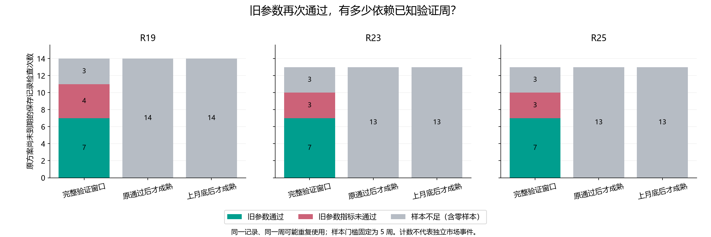
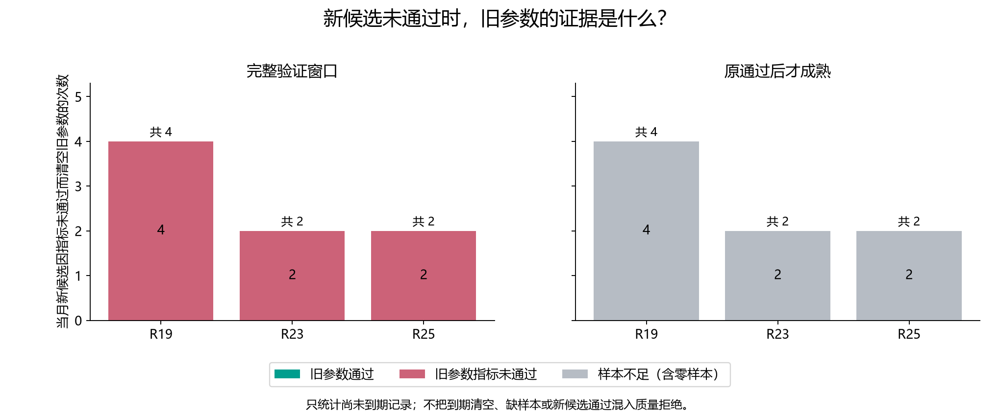

# 第四十三轮：旧参数与新候选在新增成熟验证数据上的对照

本轮是冻结历史上的参数诊断。没有新增训练、预测策略、准确率历史或 p 值；原 23 条预测历史保持不变。检查对象是 R42 每月决定发生前实际保存的旧记录，绝不寻找已清空的更早记录。到期记录单列描述，不改变到期规则。

同时计算三个固定口径：完整的当月最近 13 个成熟周中属于该状态的周；其中 joint_completed 严格晚于旧参数原通过日的周；其中 joint_completed 严格晚于上月底的周。后两个口径不会重新使用原通过时已成熟的标签。旧参数和当月新候选使用同一组周、同一批原年度概率，先对三个种子概率等权平均，再计算指标。

旧参数证据通过要求至少 5 个状态周、Brier 相对年度降低超过 1e-12，且方向正确数不减少。零样本和不足 5 周单独记录，即便观察到的损失较低，也不记为通过。当月未具备拟合条件的候选记为未拟合。此处是证据分类，不构成可投入使用的新门控；训练支持、到期及年度规则仍独立存在。

原训练使用更早 52 个成熟周，末尾 13 周用于验证，并隔离未成熟相邻标签；自然 20 遍、滚动 5 年的年度模型及四状态定义均不变。完整窗口使用原时间点保存的年度预测，可能包含年度切换前的模型版本，没有用最新模型重算历史。

## 尚未到期的旧记录：完整窗口与新证据

| 方法 | 证据口径 | 检查次数 | 旧通过 | 指标未通过 | 不足 5 周（含零） | 零样本 | 验证周使用次数 | 不同来源×周 | 重复来源×周使用 |
|---|---|---:|---:|---:|---:|---:|---:|---:|---:|
| R19 | 完整验证窗口 | 14 | 7 | 4 | 3 | 1 | 96 | 96 | 0 |
| R19 | 原通过后才成熟 | 14 | 0 | 0 | 14 | 7 | 20 | 20 | 0 |
| R19 | 上月底后才成熟 | 14 | 0 | 0 | 14 | 7 | 20 | 20 | 0 |
| R23 | 完整验证窗口 | 13 | 7 | 3 | 3 | 1 | 89 | 89 | 0 |
| R23 | 原通过后才成熟 | 13 | 0 | 0 | 13 | 8 | 16 | 16 | 0 |
| R23 | 上月底后才成熟 | 13 | 0 | 0 | 13 | 8 | 16 | 16 | 0 |
| R25 | 完整验证窗口 | 13 | 7 | 3 | 3 | 1 | 89 | 89 | 0 |
| R25 | 原通过后才成熟 | 13 | 0 | 0 | 13 | 8 | 16 | 16 | 0 |
| R25 | 上月底后才成熟 | 13 | 0 | 0 | 13 | 8 | 16 | 16 | 0 |

计数可跨月份重复，三个方法也共用市场日期；不同来源×周不等于独立样本量。完整窗口中的已知标签、原验证重合数与新增标签数在逐单元文件中列明。

## 当月新候选因质量拒绝而清空的旧记录

| 方法 | 月底 | 状态 | 旧来源 | 证据口径 | 周数 | 旧 Brier 差↓ | 旧正确数差 | 旧证据 | 新 Brier 差↓ | 新正确数差 | 新证据 |
|---|---|---|---|---|---:|---:|---:|---|---:|---:|---|
| R23 | 2022-07-31 | negative_high | 2022-06-30 | 完整验证窗口 | 8 | 0.003133 | 0 | brier_not_better | 0.005117 | -1 | brier_not_better |
| R23 | 2022-07-31 | negative_high | 2022-06-30 | 原通过后才成熟 | 0 | — | 0 | no_samples | — | 0 | no_samples |
| R23 | 2025-07-31 | negative_low | 2025-06-30 | 完整验证窗口 | 7 | 0.000929 | 0 | brier_not_better | 0.002346 | 0 | brier_not_better |
| R23 | 2025-07-31 | negative_low | 2025-06-30 | 原通过后才成熟 | 0 | — | 0 | no_samples | — | 0 | no_samples |
| R25 | 2022-07-31 | negative_high | 2022-06-30 | 完整验证窗口 | 8 | 0.003124 | 0 | brier_not_better | 0.005113 | -1 | brier_not_better |
| R25 | 2022-07-31 | negative_high | 2022-06-30 | 原通过后才成熟 | 0 | — | 0 | no_samples | — | 0 | no_samples |
| R25 | 2025-07-31 | negative_low | 2025-06-30 | 完整验证窗口 | 7 | 0.000935 | 0 | brier_not_better | 0.002337 | 0 | brier_not_better |
| R25 | 2025-07-31 | negative_low | 2025-06-30 | 原通过后才成熟 | 0 | — | 0 | no_samples | — | 0 | no_samples |
| R19 | 2022-07-31 | negative_high | 2022-06-30 | 完整验证窗口 | 8 | 0.003254 | 0 | brier_not_better | 0.005269 | 0 | brier_not_better |
| R19 | 2022-07-31 | negative_high | 2022-06-30 | 原通过后才成熟 | 0 | — | 0 | no_samples | — | 0 | no_samples |
| R19 | 2024-11-30 | negative_low | 2024-10-31 | 完整验证窗口 | 6 | 0.002642 | 0 | brier_not_better | 0.002830 | 0 | brier_not_better |
| R19 | 2024-11-30 | negative_low | 2024-10-31 | 原通过后才成熟 | 0 | — | 0 | no_samples | — | 0 | no_samples |
| R19 | 2025-05-31 | negative_low | 2025-04-30 | 完整验证窗口 | 8 | 0.000767 | 1 | brier_not_better | 0.000456 | 1 | brier_not_better |
| R19 | 2025-05-31 | negative_low | 2025-04-30 | 原通过后才成熟 | 2 | 0.008169 | 0 | insufficient_validation | 0.006064 | 0 | insufficient_validation |
| R19 | 2025-07-31 | negative_low | 2025-06-30 | 完整验证窗口 | 7 | 0.000543 | 0 | brier_not_better | 0.001966 | 0 | brier_not_better |
| R19 | 2025-07-31 | negative_low | 2025-06-30 | 原通过后才成熟 | 0 | — | 0 | no_samples | — | 0 | no_samples |

## 原方案保存记录的覆盖

| 方法 | 尚未到期 | 到期 | 没有旧记录 |
|---|---:|---:|---:|
| R19 | 14 | 9 | 249 |
| R23 | 13 | 12 | 247 |
| R25 | 13 | 12 | 247 |

全部 1,088 个原决定均保留，每个决定三个证据口径，共 3,264 个诊断单元；没有旧记录的单元记为未评估，不记为失败或通过。包括 R18 的所有方法、年度、近期和早期汇总均见 CSV。

## 审计与限制

独立复核 1088 个原保存记录、2031 条诊断种子概率、677 条逐周集成贡献、3264 个证据单元和 174 个汇总。对全部 68 个月底修改之后才成熟的标签／概率和之后的候选参数，当前诊断不变。5,754 个旧文件及全部原预测、指标文件保持不变。

完整验证窗口是重复使用的历史，不能作为旧参数新一次独立验证。通过后才成熟的子集虽然在原接受时不可见，但本轮设计前这些历史也已经查看；没有新增盲测。子集通过不保证之后有效，子集不足也不能证明参数已经失效。本轮没有生成基于重验证的新路由，未计算其收益或新预测准确率，也未修改研究基线。

原 R25 近期 73/125、58.4% 属于旧训练预算协议；当前自然 20 遍年度 R25 为 71/125、56.8%；R39 季度验证 R23 的 73/125、58.4% 分开保留。R42 近期 R19／R23／R25 为 69／72／71 个正确周，原结果未覆盖。

[全部诊断单元](diagnostic_cells.csv) · [逐周证据](validation_week_diagnostics.csv) · [种子概率与参数来源](validation_seed_diagnostics.csv) · [分期汇总](diagnostic_summary.csv) · [原保存记录](subjects.csv) · [独立复核](verification.json)
