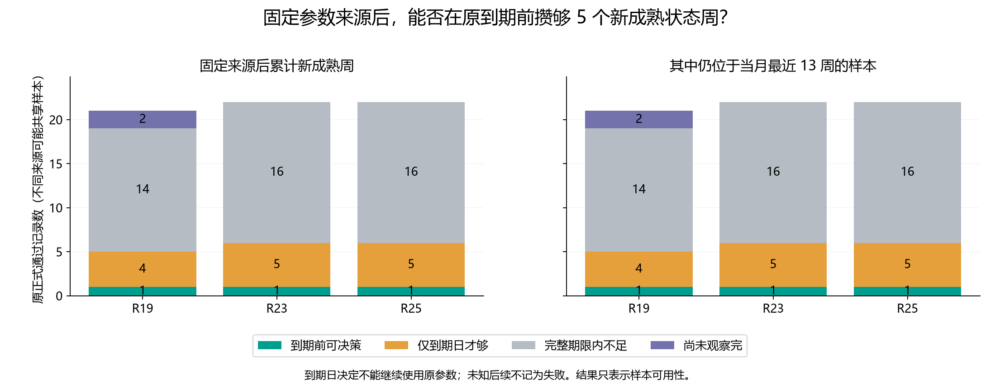
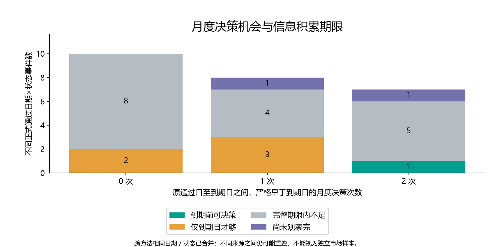

# 第四十四轮：固定原通过日后的新成熟状态样本积累

本轮只统计信息到达，不训练或评价新的预测策略。对原 84 次正式通过（R19／R23／R25 共 65 次，另有 R18 诊断方法），分别固定原日期、状态和参数来源。后来的月度通过、清空或替换不会重置该观察记录；这不表示原预测流程仍在使用它。

到期日保持为原通过日之后的第一个季度末。按月末检查，只有严格早于到期日的决定才算有机会使用原记录；到期日凑够 5 周单列。新样本按 joint_completed 严格晚于原通过日且不晚于检查日计算，不要求信号日期也晚于原通过日，相关区别已逐周记录。

累计口径保留来源后全部新成熟状态周；最近 13 周口径再与当月全市场最近 13 个成熟周取交集。状态、5 周门槛、年度模型边界及成熟定义未改变。计算仅使用时间和状态元数据，不读取收益标签或概率。数据截止为 2026-08-31，8 月底是元数据检查，未新增当月训练或候选门控。

## 每种方法的可用性

| 方法 | 口径 | 原通过次数 | 到期前可决策 | 仅到期日才够 | 完整期限不足 | 尚未观察完且未达到 | 完整期限数 | 已可决策且还有同状态可评价信号 |
|---|---|---:|---:|---:|---:|---:|---:|---:|
| R19 | 累计 | 21 | 1 | 4 | 14 | 2 | 19 | 1 |
| R19 | 最近 13 周 | 21 | 1 | 4 | 14 | 2 | 19 | 1 |
| R23 | 累计 | 22 | 1 | 5 | 16 | 0 | 22 | 1 |
| R23 | 最近 13 周 | 22 | 1 | 5 | 16 | 0 | 22 | 1 |
| R25 | 累计 | 22 | 1 | 5 | 16 | 0 | 22 | 1 |
| R25 | 最近 13 周 | 22 | 1 | 5 | 16 | 0 | 22 | 1 |

尚未观察完整期限的来源若已达到门槛，会归入已可决策；“尚未观察完且未达到”不是失败。未来同状态信号只统计原冻结数据中已可评价的周，截止后机会未知；不同来源的机会可能重叠，不能相加当作新样本量。

## 到期前已达到门槛的原来源（累计口径）

| 方法 | 原通过日 | 状态 | 第 5 周成熟日 | 最早可决策日 | 原到期日 | 剩余日数 | 已观察到的后续同状态可评价周 | 后续期限尚未观察完 |
|---|---|---|---|---|---|---:|---:|---|
| R23 | 2023-09-30 | negative_low | 2023-11-13 | 2023-11-30 | 2023-12-31 | 31 | 5 | False |
| R25 | 2023-09-30 | negative_low | 2023-11-13 | 2023-11-30 | 2023-12-31 | 31 | 5 | False |
| R19 | 2023-09-30 | negative_low | 2023-11-13 | 2023-11-30 | 2023-12-31 | 31 | 5 | False |

## 按原通过年份（累计口径）

| 年份 | 方法 | 来源数 | 到期前可决策 | 仅到期日才够 | 完整期限不足 | 尚未观察完且未达到 |
|---|---|---:|---:|---:|---:|---:|
| 2022 | R23 | 5 | 0 | 0 | 5 | 0 |
| 2022 | R25 | 5 | 0 | 0 | 5 | 0 |
| 2022 | R19 | 4 | 0 | 0 | 4 | 0 |
| 2023 | R23 | 3 | 1 | 1 | 1 | 0 |
| 2023 | R25 | 3 | 1 | 1 | 1 | 0 |
| 2023 | R19 | 3 | 1 | 1 | 1 | 0 |
| 2024 | R23 | 8 | 0 | 2 | 6 | 0 |
| 2024 | R25 | 8 | 0 | 2 | 6 | 0 |
| 2024 | R19 | 7 | 0 | 2 | 5 | 0 |
| 2025 | R23 | 6 | 0 | 2 | 4 | 0 |
| 2025 | R25 | 6 | 0 | 2 | 4 | 0 |
| 2025 | R19 | 5 | 0 | 1 | 4 | 0 |
| 2026 | R19 | 2 | 0 | 0 | 0 | 2 |

没有原正式通过记录的年份不生成虚构来源。R18、早期／近期、每个检查点、空样本及尚未观察的未来检查点均保存在 CSV。

## 边界与审计

独立复核 84 个来源、156 个预定检查点、306 个已观察计数、340 条检查点成员、242 条来源样本到达记录和 168 个来源／口径结果。复核 60 个汇总与 50 个合并事件／口径单元。

所有收益和概率列被替换后，四张计数输出表保持不变；对 153 个已观察检查点移除之后才成熟的行，当前计数不变。对 27 个时间前缀更改之后的通过门控，已有来源集合不变。5,800 个旧文件和原 23 条预测历史保持不变。

达到 5 周仅表示有机会做验证，不表示旧参数或新参数能通过概率误差与方向门槛，也不是收益改善。累计新信息来自已看过的历史，不是新增盲测；原接受条件本身仍有选择效应。固定观察起点可以发现被月度重置遮蔽的积累过程，但不能据此恢复已经清空的参数或延长期限。

原 R25 近期 73/125、58.4% 属于旧训练预算协议；自然 20 遍年度 R25 为 71/125、56.8%；季度验证 R23 的 73/125、58.4% 分开保留。R42 近期 R19／R23／R25 正确周数 69／72／71 不变。本轮没有新的准确率、p 值、模型训练或部署。

[逐来源结果](origin_feasibility.csv) · [全部检查点（含未来未知）](checkpoints.csv) · [样本到达记录](observed_arrivals.csv) · [检查点成员](checkpoint_members.csv) · [合并日期／状态事件](event_feasibility.csv) · [独立复核](verification.json)
