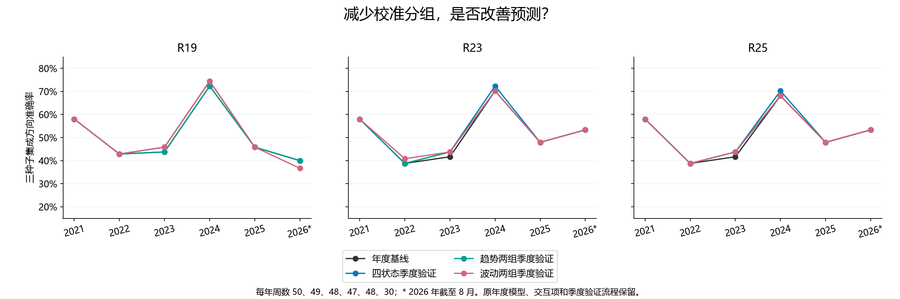
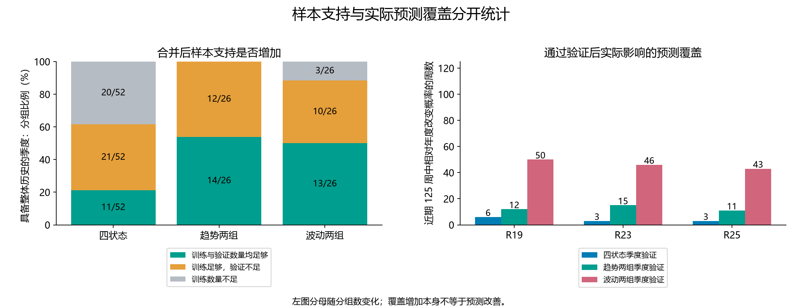

# 第四十五轮：趋势两组与波动两组的季度校准比较

本轮预先固定两个候选：趋势负／非负两组、波动低／高两组。均由原四状态作确定性合并，没有重新估计状态边界。原年度神经网络、滚动 5 年自然 20 遍训练、市场和订单交互均保留；仅重新拟合季度校准截距。

沿用原 23 个季度截止和 52／13 个成熟周训练验证划分，训练标签须早于首个验证信号成熟；每组训练至少 10 周、验证至少 5 周。拟合目标为总对数损失加 20δ²/2，|δ|≤0.5，60 次二分求解。三种子平均概率在留出验证上必须 Brier 改善超过 1e-12，且正确数不减少，方可用于后续预测。验证后不再拟合；年末重置、第一季度回退和季度末当天信号使用前一次决定均不变。

本轮独立复核 588 个标量最优解。所有训练参数先冻结，368 个门控随后冻结，再产生 6,528 条学习方法种子预测。两条新历史连同对照共新增 8,704 行；原 23 条历史保持不变。分组变大后总损失中的每样本正则强度会相应变化；本轮保持原 lambda=20，结论限定在这套既定训练配方下。

## 2021—2023：147 周

| 方法 | 方案 | 正确／周数 | 准确率 | Brier↓ | 对数损失↓ | AUROC |
|---|---|---:|---:|---:|---:|---:|
| R19 | 年度基线 | 71/147 | 48.30% | 0.277967 | 0.752923 | 0.468121 |
| R19 | 四状态季度验证 | 72/147 | 48.98% | 0.277416 | 0.751825 | 0.471917 |
| R19 | 趋势两组季度验证 | 71/147 | 48.30% | 0.277157 | 0.751290 | 0.471157 |
| R19 | 波动两组季度验证 | 72/147 | 48.98% | 0.277453 | 0.751915 | 0.471347 |
| R23 | 年度基线 | 68/147 | 46.26% | 0.276195 | 0.749569 | 0.476850 |
| R23 | 四状态季度验证 | 69/147 | 46.94% | 0.275610 | 0.748399 | 0.480645 |
| R23 | 趋势两组季度验证 | 69/147 | 46.94% | 0.275379 | 0.747943 | 0.481594 |
| R23 | 波动两组季度验证 | 70/147 | 47.62% | 0.274654 | 0.746413 | 0.484630 |
| R25 | 年度基线 | 68/147 | 46.26% | 0.276108 | 0.749367 | 0.475712 |
| R25 | 四状态季度验证 | 69/147 | 46.94% | 0.275517 | 0.748182 | 0.479317 |
| R25 | 趋势两组季度验证 | 69/147 | 46.94% | 0.275287 | 0.747730 | 0.480455 |
| R25 | 波动两组季度验证 | 69/147 | 46.94% | 0.275558 | 0.748282 | 0.479127 |

## 2024—2026 年 8 月：125 周

| 方法 | 方案 | 正确／周数 | 准确率 | Brier↓ | 对数损失↓ | AUROC |
|---|---|---:|---:|---:|---:|---:|
| R19 | 年度基线 | 68/125 | 54.40% | 0.246843 | 0.687439 | 0.582435 |
| R19 | 四状态季度验证 | 69/125 | 55.20% | 0.246156 | 0.686054 | 0.589882 |
| R19 | 趋势两组季度验证 | 68/125 | 54.40% | 0.247539 | 0.688839 | 0.578069 |
| R19 | 波动两组季度验证 | 68/125 | 54.40% | 0.247831 | 0.689468 | 0.578582 |
| R23 | 年度基线 | 72/125 | 57.60% | 0.249790 | 0.693613 | 0.563174 |
| R23 | 四状态季度验证 | 73/125 | 58.40% | 0.248903 | 0.691827 | 0.570108 |
| R23 | 趋势两组季度验证 | 72/125 | 57.60% | 0.249790 | 0.693613 | 0.563174 |
| R23 | 波动两组季度验证 | 72/125 | 57.60% | 0.249816 | 0.693863 | 0.569851 |
| R25 | 年度基线 | 71/125 | 56.80% | 0.249824 | 0.693671 | 0.562917 |
| R25 | 四状态季度验证 | 72/125 | 57.60% | 0.248933 | 0.691876 | 0.570108 |
| R25 | 趋势两组季度验证 | 71/125 | 56.80% | 0.249824 | 0.693671 | 0.562917 |
| R25 | 波动两组季度验证 | 71/125 | 56.80% | 0.249840 | 0.693904 | 0.569081 |

## 全段：272 周

| 方法 | 方案 | 正确／周数 | 准确率 | Brier↓ | 对数损失↓ | AUROC |
|---|---|---:|---:|---:|---:|---:|
| R19 | 年度基线 | 139/272 | 51.10% | 0.263664 | 0.722829 | 0.499132 |
| R19 | 四状态季度验证 | 141/272 | 51.84% | 0.263050 | 0.721599 | 0.504069 |
| R19 | 趋势两组季度验证 | 139/272 | 51.10% | 0.263546 | 0.722590 | 0.499457 |
| R19 | 波动两组季度验证 | 140/272 | 51.47% | 0.263840 | 0.723217 | 0.499674 |
| R23 | 年度基线 | 140/272 | 51.47% | 0.264060 | 0.723854 | 0.496799 |
| R23 | 四状态季度验证 | 142/272 | 52.21% | 0.263337 | 0.722401 | 0.502062 |
| R23 | 趋势两组季度验证 | 141/272 | 51.84% | 0.263619 | 0.722975 | 0.499783 |
| R23 | 波动两组季度验证 | 142/272 | 52.21% | 0.263239 | 0.722263 | 0.503255 |
| R25 | 年度基线 | 139/272 | 51.10% | 0.264029 | 0.723771 | 0.496257 |
| R25 | 四状态季度验证 | 141/272 | 51.84% | 0.263300 | 0.722306 | 0.501519 |
| R25 | 趋势两组季度验证 | 140/272 | 51.47% | 0.263585 | 0.722887 | 0.499186 |
| R25 | 波动两组季度验证 | 140/272 | 51.47% | 0.263739 | 0.723292 | 0.499295 |

## 2026 年截至 8 月：30 周

| 方法 | 方案 | 正确／周数 | 准确率 | Brier↓ | 对数损失↓ | AUROC |
|---|---|---:|---:|---:|---:|---:|
| R19 | 年度基线 | 12/30 | 40.00% | 0.257501 | 0.708270 | 0.392857 |
| R19 | 四状态季度验证 | 12/30 | 40.00% | 0.258700 | 0.710673 | 0.383929 |
| R19 | 趋势两组季度验证 | 12/30 | 40.00% | 0.260401 | 0.714100 | 0.383929 |
| R19 | 波动两组季度验证 | 11/30 | 36.67% | 0.260833 | 0.714920 | 0.361607 |
| R23 | 年度基线 | 16/30 | 53.33% | 0.257140 | 0.707785 | 0.415179 |
| R23 | 四状态季度验证 | 16/30 | 53.33% | 0.257140 | 0.707785 | 0.415179 |
| R23 | 趋势两组季度验证 | 16/30 | 53.33% | 0.257140 | 0.707785 | 0.415179 |
| R23 | 波动两组季度验证 | 16/30 | 53.33% | 0.257140 | 0.707785 | 0.415179 |
| R25 | 年度基线 | 16/30 | 53.33% | 0.257098 | 0.707697 | 0.415179 |
| R25 | 四状态季度验证 | 16/30 | 53.33% | 0.257098 | 0.707697 | 0.415179 |
| R25 | 趋势两组季度验证 | 16/30 | 53.33% | 0.257098 | 0.707697 | 0.415179 |
| R25 | 波动两组季度验证 | 16/30 | 53.33% | 0.257098 | 0.707697 | 0.415179 |

## 训练和验证数量支持

| 分组 | 具备整体历史的分组单元 | 训练≥10 | 同时验证≥5 | 两者均满足比例 |
|---|---:|---:|---:|---:|
| 四状态 | 52 | 32 | 11 | 21.2% |
| 趋势两组 | 26 | 26 | 14 | 53.8% |
| 波动两组 | 26 | 23 | 13 | 50.0% |

上述分母是 13 个具备整体历史的季度乘以分组数；数量支持不是模型通过验证。各方法的正式通过数另列：

| 方法 | 四状态通过／单元 | 趋势两组通过／单元 | 波动两组通过／单元 |
|---|---:|---:|---:|
| R19 | 6/52 | 4/26 | 7/26 |
| R23 | 5/52 | 4/26 | 7/26 |
| R25 | 5/52 | 4/26 | 6/26 |

## 近期种子诊断

| 方法 | 候选 | 种子 | 正确／125 | Brier↓ |
|---|---|---|---:|---:|
| R23 | 趋势两组季度验证 | 20260910 | 64 | 0.258183 |
| R23 | 趋势两组季度验证 | 20260911 | 69 | 0.250724 |
| R23 | 趋势两组季度验证 | 20260912 | 69 | 0.256229 |
| R23 | 波动两组季度验证 | 20260910 | 67 | 0.258296 |
| R23 | 波动两组季度验证 | 20260911 | 68 | 0.250650 |
| R23 | 波动两组季度验证 | 20260912 | 68 | 0.256205 |
| R25 | 趋势两组季度验证 | 20260910 | 64 | 0.258066 |
| R25 | 趋势两组季度验证 | 20260911 | 68 | 0.250797 |
| R25 | 趋势两组季度验证 | 20260912 | 69 | 0.256099 |
| R25 | 波动两组季度验证 | 20260910 | 67 | 0.258175 |
| R25 | 波动两组季度验证 | 20260911 | 67 | 0.250715 |
| R25 | 波动两组季度验证 | 20260912 | 68 | 0.256058 |
| R19 | 趋势两组季度验证 | 20260910 | 65 | 0.261780 |
| R19 | 趋势两组季度验证 | 20260911 | 67 | 0.244940 |
| R19 | 趋势两组季度验证 | 20260912 | 68 | 0.252382 |
| R19 | 波动两组季度验证 | 20260910 | 68 | 0.262089 |
| R19 | 波动两组季度验证 | 20260911 | 67 | 0.245116 |
| R19 | 波动两组季度验证 | 20260912 | 68 | 0.252682 |

单种子仅作诊断；门控和主结果仍使用全部原三种子等权平均概率。原四状态的子组表现、空后续单元和所有逐周改善／退步已保存，避免合并后遮蔽子状态差异。

## 统计与审计

48 项预定比较涵盖两个候选、四状态季度与年度两种参照、三个主要方法、方向误差与 Brier、两个固定时期。循环 8 周区块重采样 10,000 次，固定种子，中心化双侧 p 值；48 项统一 Holm 校正。最小原始 p=0.080492，最小校正 p=1.000000，校正后 p<0.05 的比较为 0 项。

独立复核最大系数差 2.86e-15，最大预测概率差 1.11e-16；5301 个指标单元、2176 条逐周比较、368 个决定后续单元及 736 个原四状态子组单元均通过核对。23 个训练截止的非训练标签污染和 23 个验证截止的未来标签污染均不影响对应结果。

此前所有历史均已查看，本轮没有新增盲测；多重比较校正不覆盖此前自适应研究。分组变粗可能增加支持，也可能丢失市场状态差异；不得仅按覆盖或单个年份选择候选。没有部署或交易收益测试。5,848 个旧文件、原预测历史及神经模型保持不变。

原旧训练预算 R25 近期 73/125、58.4%；自然 20 遍年度 R25 71/125、56.8%；原四状态季度 R23 73/125、58.4% 分别保留。R42 的局部改善与此前失败案例均未覆盖。

[全部指标](ensemble_metrics.csv) · [逐周比较](weekly_policy_effects.csv) · [各决定后续（含空样本）](decision_outcomes.csv) · [原四状态子组表现](substate_outcomes.csv) · [48 项比较](primary_comparisons.json) · [独立复核](verification.json)
