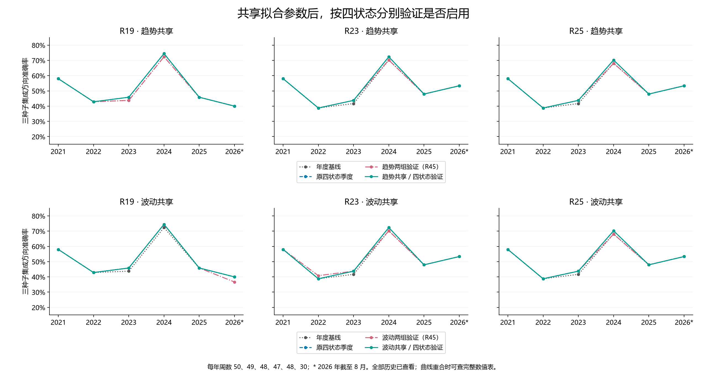
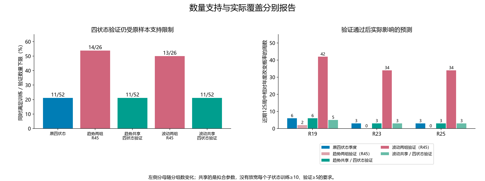

# 第四十六轮：共享拟合参数，按原四状态分别验证启用

本轮预先固定两个候选：共享第45轮趋势两组参数、共享第45轮波动两组参数，再按原四状态分别决定是否启用。588个已拟合的标量参数以及全部1,104条头记录逐字节复用，没有新增神经网络或校准拟合。独立复核重新求解原训练目标仅用于确认参数来源与最优性。

原年度模型、滚动5年自然20遍训练、市场和订单交互保持。沿用23个季度截止、原52／13成熟周训练验证划分，训练标签严格早于首个验证信号成熟。每个子状态仍需训练至少10周、验证至少5周；三种子平均概率在验证上的Brier改善超过1e-12，正确数不减少，才使用对应共享参数。共享参数的合并组在R45是否通过，不参与本轮门控。未通过时精确回退年度预测；没有叠加修正或验证后再拟合。

这项干预改变了原四状态拟合所用的参数来源，但没有解决子状态验证样本不足。与R45相比，它改变了验证分组及子状态数量支持要求；本轮不另行尝试放宽门槛。四状态边界、年末重置、第一季度回退、季度末当日使用前一次决定和原逐组Series.mean集成算法均保留。

## 早期：2021—2023，147周

| 方法 | 方案 | 正确／周数 | 准确率 | Brier↓ | 对数损失↓ | AUROC |
|---|---|---:|---:|---:|---:|---:|
| R19 | 年度基线 | 71/147 | 48.30% | 0.277967 | 0.752923 | 0.468121 |
| R19 | 原四状态季度 | 72/147 | 48.98% | 0.277416 | 0.751825 | 0.471917 |
| R19 | 趋势两组验证（R45） | 71/147 | 48.30% | 0.277157 | 0.751290 | 0.471157 |
| R19 | 波动两组验证（R45） | 72/147 | 48.98% | 0.277453 | 0.751915 | 0.471347 |
| R19 | 趋势共享／四状态验证 | 72/147 | 48.98% | 0.277524 | 0.752040 | 0.470778 |
| R19 | 波动共享／四状态验证 | 72/147 | 48.98% | 0.277446 | 0.751883 | 0.471537 |
| R23 | 年度基线 | 68/147 | 46.26% | 0.276195 | 0.749569 | 0.476850 |
| R23 | 原四状态季度 | 69/147 | 46.94% | 0.275610 | 0.748399 | 0.480645 |
| R23 | 趋势两组验证（R45） | 69/147 | 46.94% | 0.275379 | 0.747943 | 0.481594 |
| R23 | 波动两组验证（R45） | 70/147 | 47.62% | 0.274654 | 0.746413 | 0.484630 |
| R23 | 趋势共享／四状态验证 | 69/147 | 46.94% | 0.275734 | 0.748645 | 0.480645 |
| R23 | 波动共享／四状态验证 | 69/147 | 46.94% | 0.275648 | 0.748475 | 0.480455 |
| R25 | 年度基线 | 68/147 | 46.26% | 0.276108 | 0.749367 | 0.475712 |
| R25 | 原四状态季度 | 69/147 | 46.94% | 0.275517 | 0.748182 | 0.479317 |
| R25 | 趋势两组验证（R45） | 69/147 | 46.94% | 0.275287 | 0.747730 | 0.480455 |
| R25 | 波动两组验证（R45） | 69/147 | 46.94% | 0.275558 | 0.748282 | 0.479127 |
| R25 | 趋势共享／四状态验证 | 69/147 | 46.94% | 0.275642 | 0.748433 | 0.479507 |
| R25 | 波动共享／四状态验证 | 69/147 | 46.94% | 0.275555 | 0.748259 | 0.479507 |

## 近期：2024—2026年8月，125周

| 方法 | 方案 | 正确／周数 | 准确率 | Brier↓ | 对数损失↓ | AUROC |
|---|---|---:|---:|---:|---:|---:|
| R19 | 年度基线 | 68/125 | 54.40% | 0.246843 | 0.687439 | 0.582435 |
| R19 | 原四状态季度 | 69/125 | 55.20% | 0.246156 | 0.686054 | 0.589882 |
| R19 | 趋势两组验证（R45） | 68/125 | 54.40% | 0.247539 | 0.688839 | 0.578069 |
| R19 | 波动两组验证（R45） | 68/125 | 54.40% | 0.247831 | 0.689468 | 0.578582 |
| R19 | 趋势共享／四状态验证 | 69/125 | 55.20% | 0.246841 | 0.687433 | 0.585773 |
| R19 | 波动共享／四状态验证 | 69/125 | 55.20% | 0.246502 | 0.686750 | 0.587057 |
| R23 | 年度基线 | 72/125 | 57.60% | 0.249790 | 0.693613 | 0.563174 |
| R23 | 原四状态季度 | 73/125 | 58.40% | 0.248903 | 0.691827 | 0.570108 |
| R23 | 趋势两组验证（R45） | 72/125 | 57.60% | 0.249790 | 0.693613 | 0.563174 |
| R23 | 波动两组验证（R45） | 72/125 | 57.60% | 0.249816 | 0.693863 | 0.569851 |
| R23 | 趋势共享／四状态验证 | 73/125 | 58.40% | 0.249189 | 0.692403 | 0.568053 |
| R23 | 波动共享／四状态验证 | 73/125 | 58.40% | 0.249007 | 0.692036 | 0.569851 |
| R25 | 年度基线 | 71/125 | 56.80% | 0.249824 | 0.693671 | 0.562917 |
| R25 | 原四状态季度 | 72/125 | 57.60% | 0.248933 | 0.691876 | 0.570108 |
| R25 | 趋势两组验证（R45） | 71/125 | 56.80% | 0.249824 | 0.693671 | 0.562917 |
| R25 | 波动两组验证（R45） | 71/125 | 56.80% | 0.249840 | 0.693904 | 0.569081 |
| R25 | 趋势共享／四状态验证 | 72/125 | 57.60% | 0.249220 | 0.692455 | 0.567797 |
| R25 | 波动共享／四状态验证 | 72/125 | 57.60% | 0.249036 | 0.692085 | 0.569594 |

## 全段：272周

| 方法 | 方案 | 正确／周数 | 准确率 | Brier↓ | 对数损失↓ | AUROC |
|---|---|---:|---:|---:|---:|---:|
| R19 | 年度基线 | 139/272 | 51.10% | 0.263664 | 0.722829 | 0.499132 |
| R19 | 原四状态季度 | 141/272 | 51.84% | 0.263050 | 0.721599 | 0.504069 |
| R19 | 趋势两组验证（R45） | 139/272 | 51.10% | 0.263546 | 0.722590 | 0.499457 |
| R19 | 波动两组验证（R45） | 140/272 | 51.47% | 0.263840 | 0.723217 | 0.499674 |
| R19 | 趋势共享／四状态验证 | 141/272 | 51.84% | 0.263423 | 0.722349 | 0.501736 |
| R19 | 波动共享／四状态验证 | 141/272 | 51.84% | 0.263225 | 0.721951 | 0.502767 |
| R23 | 年度基线 | 140/272 | 51.47% | 0.264060 | 0.723854 | 0.496799 |
| R23 | 原四状态季度 | 142/272 | 52.21% | 0.263337 | 0.722401 | 0.502062 |
| R23 | 趋势两组验证（R45） | 141/272 | 51.84% | 0.263619 | 0.722975 | 0.499783 |
| R23 | 波动两组验证（R45） | 142/272 | 52.21% | 0.263239 | 0.722263 | 0.503255 |
| R23 | 趋势共享／四状态验证 | 142/272 | 52.21% | 0.263535 | 0.722799 | 0.500651 |
| R23 | 波动共享／四状态验证 | 142/272 | 52.21% | 0.263405 | 0.722538 | 0.501573 |
| R25 | 年度基线 | 139/272 | 51.10% | 0.264029 | 0.723771 | 0.496257 |
| R25 | 原四状态季度 | 141/272 | 51.84% | 0.263300 | 0.722306 | 0.501519 |
| R25 | 趋势两组验证（R45） | 140/272 | 51.47% | 0.263585 | 0.722887 | 0.499186 |
| R25 | 波动两组验证（R45） | 140/272 | 51.47% | 0.263739 | 0.723292 | 0.499295 |
| R25 | 趋势共享／四状态验证 | 141/272 | 51.84% | 0.263500 | 0.722708 | 0.500163 |
| R25 | 波动共享／四状态验证 | 141/272 | 51.84% | 0.263368 | 0.722444 | 0.500651 |

## 2026年截至8月：30周

| 方法 | 方案 | 正确／周数 | 准确率 | Brier↓ | 对数损失↓ | AUROC |
|---|---|---:|---:|---:|---:|---:|
| R19 | 年度基线 | 12/30 | 40.00% | 0.257501 | 0.708270 | 0.392857 |
| R19 | 原四状态季度 | 12/30 | 40.00% | 0.258700 | 0.710673 | 0.383929 |
| R19 | 趋势两组验证（R45） | 12/30 | 40.00% | 0.260401 | 0.714100 | 0.383929 |
| R19 | 波动两组验证（R45） | 11/30 | 36.67% | 0.260833 | 0.714920 | 0.361607 |
| R19 | 趋势共享／四状态验证 | 12/30 | 40.00% | 0.260401 | 0.714100 | 0.383929 |
| R19 | 波动共享／四状态验证 | 12/30 | 40.00% | 0.259241 | 0.711759 | 0.383929 |
| R23 | 年度基线 | 16/30 | 53.33% | 0.257140 | 0.707785 | 0.415179 |
| R23 | 原四状态季度 | 16/30 | 53.33% | 0.257140 | 0.707785 | 0.415179 |
| R23 | 趋势两组验证（R45） | 16/30 | 53.33% | 0.257140 | 0.707785 | 0.415179 |
| R23 | 波动两组验证（R45） | 16/30 | 53.33% | 0.257140 | 0.707785 | 0.415179 |
| R23 | 趋势共享／四状态验证 | 16/30 | 53.33% | 0.257140 | 0.707785 | 0.415179 |
| R23 | 波动共享／四状态验证 | 16/30 | 53.33% | 0.257140 | 0.707785 | 0.415179 |
| R25 | 年度基线 | 16/30 | 53.33% | 0.257098 | 0.707697 | 0.415179 |
| R25 | 原四状态季度 | 16/30 | 53.33% | 0.257098 | 0.707697 | 0.415179 |
| R25 | 趋势两组验证（R45） | 16/30 | 53.33% | 0.257098 | 0.707697 | 0.415179 |
| R25 | 波动两组验证（R45） | 16/30 | 53.33% | 0.257098 | 0.707697 | 0.415179 |
| R25 | 趋势共享／四状态验证 | 16/30 | 53.33% | 0.257098 | 0.707697 | 0.415179 |
| R25 | 波动共享／四状态验证 | 16/30 | 53.33% | 0.257098 | 0.707697 | 0.415179 |

## 数量支持与门控

| 方案 | 历史具备的分组单元 | 训练≥10 | 同时验证≥5 | 同时满足比例 |
|---|---:|---:|---:|---:|
| 原四状态 | 52 | 32 | 11 | 21.2% |
| 趋势两组 R45 | 26 | 26 | 14 | 53.8% |
| 趋势共享 四状态验证 | 52 | 32 | 11 | 21.2% |
| 波动两组 R45 | 26 | 23 | 13 | 50.0% |
| 波动共享 四状态验证 | 52 | 32 | 11 | 21.2% |

数量支持并不等于验证通过，且分母是13个可拟合季度乘以分组数，不是独立市场事件。以下门控转移按原四状态单元比较，合并组决定展开到其两个子状态，因此不能把分母或重复方法当成独立试验。

| 方法 | 共享来源 | 新通过 | 两者通过 | 合并组拒绝／子状态通过 | 合并组通过／子状态拒绝 |
|---|---|---:|---:|---:|---:|
| R18（诊断） | trend | 4/92 | 2 | 2 | 6 |
| R18（诊断） | volatility | 5/92 | 5 | 0 | 9 |
| R19 | trend | 4/92 | 2 | 2 | 6 |
| R19 | volatility | 4/92 | 4 | 0 | 10 |
| R23 | trend | 3/92 | 2 | 1 | 6 |
| R23 | volatility | 5/92 | 5 | 0 | 9 |
| R25 | trend | 3/92 | 2 | 1 | 6 |
| R25 | volatility | 4/92 | 4 | 0 | 8 |

## 近期三个种子诊断

| 方法 | 候选 | 种子 | 正确／125 | Brier↓ |
|---|---|---|---:|---:|
| R23 | 趋势共享／四状态验证 | 20260910 | 64 | 0.257445 |
| R23 | 趋势共享／四状态验证 | 20260911 | 70 | 0.250066 |
| R23 | 趋势共享／四状态验证 | 20260912 | 69 | 0.255805 |
| R23 | 波动共享／四状态验证 | 20260910 | 64 | 0.257334 |
| R23 | 波动共享／四状态验证 | 20260911 | 70 | 0.249808 |
| R23 | 波动共享／四状态验证 | 20260912 | 69 | 0.255639 |
| R25 | 趋势共享／四状态验证 | 20260910 | 64 | 0.257325 |
| R25 | 趋势共享／四状态验证 | 20260911 | 69 | 0.250142 |
| R25 | 趋势共享／四状态验证 | 20260912 | 69 | 0.255667 |
| R25 | 波动共享／四状态验证 | 20260910 | 64 | 0.257216 |
| R25 | 波动共享／四状态验证 | 20260911 | 69 | 0.249882 |
| R25 | 波动共享／四状态验证 | 20260912 | 69 | 0.255498 |
| R19 | 趋势共享／四状态验证 | 20260910 | 65 | 0.260931 |
| R19 | 趋势共享／四状态验证 | 20260911 | 68 | 0.244181 |
| R19 | 趋势共享／四状态验证 | 20260912 | 68 | 0.251879 |
| R19 | 波动共享／四状态验证 | 20260910 | 65 | 0.260644 |
| R19 | 波动共享／四状态验证 | 20260911 | 68 | 0.243753 |
| R19 | 波动共享／四状态验证 | 20260912 | 68 | 0.251592 |

单种子仅作诊断，不用于选择候选。原四状态分组结果、736个门控决定对应的未来结果（含零周）、逐周变化及全部年份均已保存。

## 统计与审计

预先固定72项探索性比较：两个候选各对照对应R45合并验证、原四状态季度和年度基线，三个主要方法、两种损失、两个时期。循环8周区块重采样10,000次，固定种子20260910，中心化双侧p值；全部72项统一Holm校正。最小原始p=0.106089；最小校正p=1.000000；校正后p<0.05共0项。

独立复核PASS：588个原标量最优解，最大系数差2.86e-15；736个子状态门控；6792条验证种子概率；6528条学习方法种子预测；5967个指标单元；2176条逐周效果及736个决定后续单元。2046条零修正集成概率与年度精确相同。23个训练截止的非训练输入污染及23个验证截止的未来输入污染均未改变相应结果。

两条新预测历史连同控制新增8,704条模型记录。原25条预测历史保持不变，5,986个旧文件及继承源代码、协议、输入经过哈希核验。原第45轮浮点归约问题的无效尝试继续留档；本轮使用修复后的R45成果并保留精确回退检查。

全部历史此前已查看，没有新增盲测，多重比较校正不覆盖此前多轮自适应研究。本轮不能证明独立泛化能力，不作交易收益或部署结论。原旧预算R25近期73/125、58.4%，自然20遍年度R25为71/125、56.8%，原四状态季度R23为73/125、58.4%，分别保留。

[完整指标](ensemble_metrics.csv) · [逐周变化](weekly_policy_effects.csv) · [门控及后续结果](decision_outcomes.csv) · [原四状态指标](state_metrics.csv) · [验证种子预测](validation_predictions.csv) · [72项比较](primary_comparisons.json) · [独立复核](verification.json)
