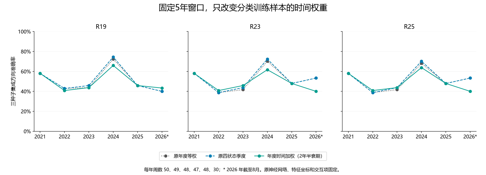
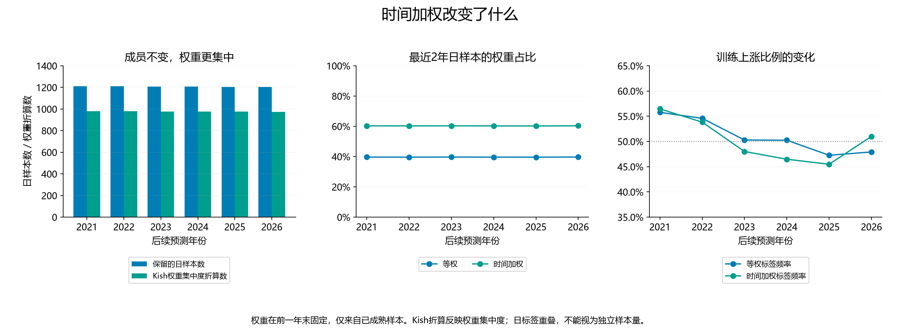

# 第四十七轮：固定5年窗口的年度时间加权分类头

本轮固定一个候选：保留5年成熟日样本成员、年度更新和现有年度神经网络，按2年半衰期加权分类头损失。原始权重为2^(−age_days/730.5)，age为决定截止日期减原信号日期的日数；归一化后总和为1。训练成员要求信号日期处于原5年窗口内，全部目标联合成熟时间不晚于截止。没有删样本、重采样或搜索半衰期。

原R28年度滚动5年、自然20遍网络，以及神经特征、1／99分位裁剪、均值与标准差、原等权R18监督射线、波动与订单交互残差投影全部固定。新的加权R18仅为诊断，不用于重新生成交互项。本轮仅改变固定特征坐标下分类损失的样本权重，不是整套特征工程的加权重训。

目标为归一化加权二元对数损失加0.01/2乘斜率平方和，普通分类头截距不惩罚，初始化为加权训练上涨比例的logit。R19、R23保留原交互结构；R25固定本轮新加权R19的全部系数与截距，仅拟合订单残差的一个gamma。沿用原Newton容差、回溯和迭代预算。共6个年度截止×3个种子×4个方法，54次联合拟合和18次条件标量拟合；全部72次拟合完成并冻结后才计算新周预测。没有神经训练或新特征推理。

直接对照为原年度等权分类头，额外参照为原四状态季度校准。候选没有叠加季度校准。三种子等权平均概率，严格大于0.5才判断上涨；原272周目标和日期不变。native_mse与原等权training_frequency完全保留；加权标签频率另作诊断，不替换学习模型或增加候选比较。

## 早期：2021—2023，147周

| 方法 | 方案 | 正确／周数 | 准确率 | Brier↓ | 对数损失↓ | AUROC |
|---|---|---:|---:|---:|---:|---:|
| R19 | 原年度等权 | 71/147 | 48.30% | 0.277967 | 0.752923 | 0.468121 |
| R19 | 原四状态季度 | 72/147 | 48.98% | 0.277416 | 0.751825 | 0.471917 |
| R19 | 年度时间加权（2年半衰期） | 70/147 | 47.62% | 0.272968 | 0.742189 | 0.486148 |
| R23 | 原年度等权 | 68/147 | 46.26% | 0.276195 | 0.749569 | 0.476850 |
| R23 | 原四状态季度 | 69/147 | 46.94% | 0.275610 | 0.748399 | 0.480645 |
| R23 | 年度时间加权（2年半衰期） | 71/147 | 48.30% | 0.269979 | 0.736237 | 0.494118 |
| R25 | 原年度等权 | 68/147 | 46.26% | 0.276108 | 0.749367 | 0.475712 |
| R25 | 原四状态季度 | 69/147 | 46.94% | 0.275517 | 0.748182 | 0.479317 |
| R25 | 年度时间加权（2年半衰期） | 70/147 | 47.62% | 0.270223 | 0.736725 | 0.493169 |

## 近期：2024—2026年8月，125周

| 方法 | 方案 | 正确／周数 | 准确率 | Brier↓ | 对数损失↓ | AUROC |
|---|---|---:|---:|---:|---:|---:|
| R19 | 原年度等权 | 68/125 | 54.40% | 0.246843 | 0.687439 | 0.582435 |
| R19 | 原四状态季度 | 69/125 | 55.20% | 0.246156 | 0.686054 | 0.589882 |
| R19 | 年度时间加权（2年半衰期） | 66/125 | 52.80% | 0.252067 | 0.698710 | 0.569594 |
| R23 | 原年度等权 | 72/125 | 57.60% | 0.249790 | 0.693613 | 0.563174 |
| R23 | 原四状态季度 | 73/125 | 58.40% | 0.248903 | 0.691827 | 0.570108 |
| R23 | 年度时间加权（2年半衰期） | 64/125 | 51.20% | 0.255758 | 0.706522 | 0.546995 |
| R25 | 原年度等权 | 71/125 | 56.80% | 0.249824 | 0.693671 | 0.562917 |
| R25 | 原四状态季度 | 72/125 | 57.60% | 0.248933 | 0.691876 | 0.570108 |
| R25 | 年度时间加权（2年半衰期） | 65/125 | 52.00% | 0.255844 | 0.706688 | 0.548023 |

## 全段：272周

| 方法 | 方案 | 正确／周数 | 准确率 | Brier↓ | 对数损失↓ | AUROC |
|---|---|---:|---:|---:|---:|---:|
| R19 | 原年度等权 | 139/272 | 51.10% | 0.263664 | 0.722829 | 0.499132 |
| R19 | 原四状态季度 | 141/272 | 51.84% | 0.263050 | 0.721599 | 0.504069 |
| R19 | 年度时间加权（2年半衰期） | 136/272 | 50.00% | 0.263363 | 0.722208 | 0.502604 |
| R23 | 原年度等权 | 140/272 | 51.47% | 0.264060 | 0.723854 | 0.496799 |
| R23 | 原四状态季度 | 142/272 | 52.21% | 0.263337 | 0.722401 | 0.502062 |
| R23 | 年度时间加权（2年半衰期） | 135/272 | 49.63% | 0.263444 | 0.722581 | 0.498372 |
| R25 | 原年度等权 | 139/272 | 51.10% | 0.264029 | 0.723771 | 0.496257 |
| R25 | 原四状态季度 | 141/272 | 51.84% | 0.263300 | 0.722306 | 0.501519 |
| R25 | 年度时间加权（2年半衰期） | 135/272 | 49.63% | 0.263615 | 0.722921 | 0.497884 |

## 2026年截至8月：30周

| 方法 | 方案 | 正确／周数 | 准确率 | Brier↓ | 对数损失↓ | AUROC |
|---|---|---:|---:|---:|---:|---:|
| R19 | 原年度等权 | 12/30 | 40.00% | 0.257501 | 0.708270 | 0.392857 |
| R19 | 原四状态季度 | 12/30 | 40.00% | 0.258700 | 0.710673 | 0.383929 |
| R19 | 年度时间加权（2年半衰期） | 13/30 | 43.33% | 0.257902 | 0.709094 | 0.450893 |
| R23 | 原年度等权 | 16/30 | 53.33% | 0.257140 | 0.707785 | 0.415179 |
| R23 | 原四状态季度 | 16/30 | 53.33% | 0.257140 | 0.707785 | 0.415179 |
| R23 | 年度时间加权（2年半衰期） | 12/30 | 40.00% | 0.257244 | 0.707775 | 0.450893 |
| R25 | 原年度等权 | 16/30 | 53.33% | 0.257098 | 0.707697 | 0.415179 |
| R25 | 原四状态季度 | 16/30 | 53.33% | 0.257098 | 0.707697 | 0.415179 |
| R25 | 年度时间加权（2年半衰期） | 12/30 | 40.00% | 0.257143 | 0.707569 | 0.459821 |

## 训练权重与标签比例

| 年末截止 | 保留日样本 | Kish折算数 | 最近2年权重占比 | 等权上涨比例 | 加权上涨比例 |
|---|---:|---:|---:|---:|---:|
| 2020-12-31 | 1212 | 979.86 | 60.34% | 55.78% | 56.46% |
| 2021-12-31 | 1211 | 979.02 | 60.29% | 54.58% | 53.83% |
| 2022-12-31 | 1209 | 977.49 | 60.35% | 50.29% | 48.01% |
| 2023-12-31 | 1208 | 977.11 | 60.28% | 50.25% | 46.48% |
| 2024-12-31 | 1206 | 975.55 | 60.25% | 47.26% | 45.49% |
| 2025-12-31 | 1206 | 975.18 | 60.37% | 47.93% | 51.00% |

Kish=1/Σw²，只描述权重集中程度。每日预测目标重叠，样本并非相互独立，不能把折算数当成独立观测量。加权标签频率不是学习模型，其独立诊断结果如下：

| 时期 | 加权频率正确／周数 | 准确率 | Brier↓ |
|---|---:|---:|---:|
| extension_2021_2023 | 72/147 | 48.98% | 0.254786 |
| recent_2024_2026 | 57/125 | 45.60% | 0.254922 |
| pooled_2021_2026 | 129/272 | 47.43% | 0.254849 |
| year_2026 | 14/30 | 46.67% | 0.250769 |

## 近期三个种子

| 方法 | 种子 | 正确／125 | Brier↓ |
|---|---|---:|---:|
| R23 | 20260910 | 63 | 0.268995 |
| R23 | 20260911 | 69 | 0.255536 |
| R23 | 20260912 | 65 | 0.263539 |
| R25 | 20260910 | 62 | 0.268931 |
| R25 | 20260911 | 69 | 0.255569 |
| R25 | 20260912 | 65 | 0.263336 |
| R19 | 20260910 | 61 | 0.270627 |
| R19 | 20260911 | 73 | 0.249091 |
| R19 | 20260912 | 67 | 0.256938 |

单种子及原四状态仅作诊断，不用于选择候选。所有年份、R18诊断、逐周恢复与退步、原四状态完整指标均保存。

## 统计与复核

24项预定探索性比较涵盖年度和原四状态季度两种参照、三个主要方法、方向误差与Brier、早期和近期。循环8周区块重采样10,000次，固定种子20260910，中心化双侧p值，统一Holm校正。最小原始p=0.008599，最小校正p=0.206379，校正后p<0.05为0项。

独立复核PASS：54个联合头由L-BFGS-B独立求解，18个条件标量由Brent独立求解；72个原等权头及其预测仍满足原目标和输出。18个年度／种子接口的未来特征与标签污染不影响训练输入。最大固定特征代数差1.78e-15，最大预测概率差1.67e-16；5733个指标单元、1,088条逐周效果和24项比较通过复核。

6,056个旧文件和27条旧预测历史保持，新增一条年度候选历史。所有训练权重、协议、11个源文件和输入在拟合前冻结。对原神经与缓存来源采用此前已独立验证的固定成果及哈希核验，本轮没有重新执行神经推理，不作新神经重放声明。

全部历史此前已查看，没有新增盲测；多重比较校正不覆盖此前自适应研究。日期加权不等于识别了隐藏市场状态，本轮只检验这一个固定配方。保留监督特征工程同样本拟合的原限制，不作全流程OOF、交易收益或部署结论。

原旧训练预算R25近期73/125、58.4%，自然20遍年度R25为71/125、56.8%，原四状态季度R23为73/125、58.4%，分别保留。

[完整指标](ensemble_metrics.csv) · [训练权重](training_weights.csv) · [加权频率诊断](weighted_frequency_metrics.csv) · [逐周比较](weekly_policy_effects.csv) · [原四状态指标](state_metrics.csv) · [24项比较](primary_comparisons.json) · [独立复核](verification.json)
