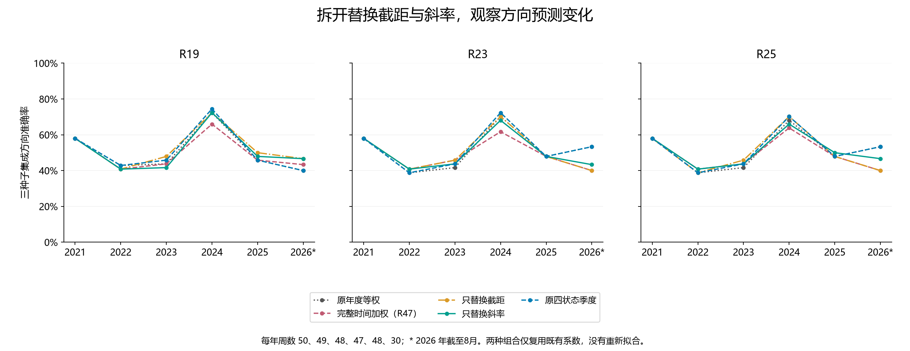
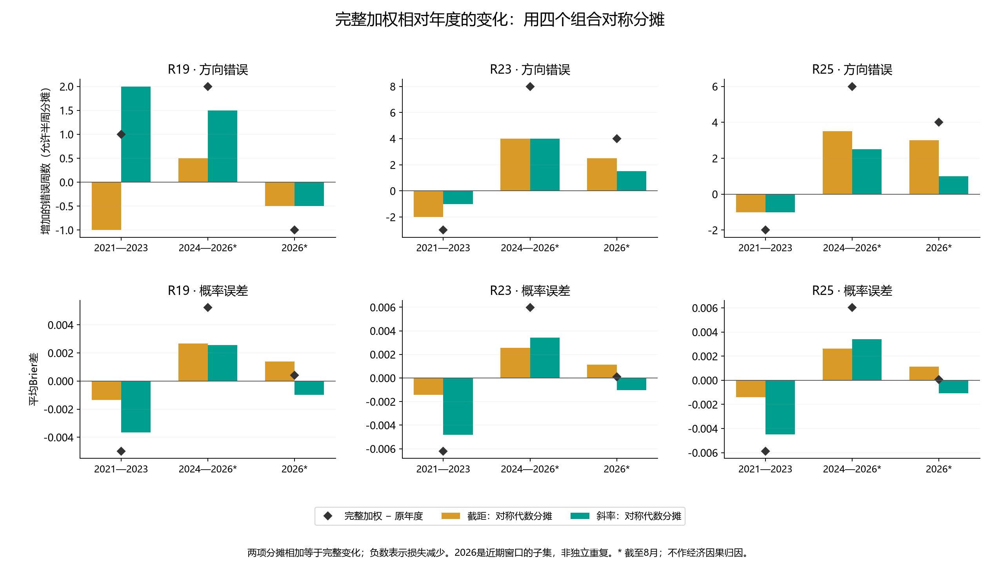

# 第四十八轮：截距与斜率的固定组合对照

本轮固定两个机械组合：原等权斜率＋第47轮加权截距，以及第47轮加权斜率＋原等权截距。原年度等权、完整时间加权和原四状态季度同时保留作参照。覆盖6个年度截止、3个种子、R18诊断及R19／R23／R25主要方法；共144条组合参数，所有元素直接从已验证的两套参数复制，没有新增拟合、神经训练、特征推理或校准。

可交换的前提是特征坐标相同。两套来源均使用原R28年度滚动5年自然20遍神经网络、相同特征标准化、原等权R18监督射线以及相同波动／订单交互残差。所有对应训练设计矩阵、行号和标签逐元素相同。R25所有斜率包含订单gamma一起复制；其混合组合不再声称是原约束目标的最优解。

组合参数先全部冻结，再按前一年末截止用于下一年的原周信号。沿用272个成熟周、原三种子概率等权平均和严格p>0.5上涨规则。原native_mse和等权training_frequency精确保留，不新增标签频率候选或选种子。全部28条旧历史继续保留。

这项实验拆分的是固定坐标下的模型系数。截距表示该坐标原点的logit，不等于纯粹的市场上涨概率；其变化可能与斜率共同适配。两个组合未经重新优化，不能直接当作训练所得的替代模型。

## 早期：2021—2023，147周

| 方法 | 方案 | 正确／周数 | 准确率 | Brier↓ | 对数损失↓ | AUROC |
|---|---|---:|---:|---:|---:|---:|
| R19 | 原年度等权 | 71/147 | 48.30% | 0.277967 | 0.752923 | 0.468121 |
| R19 | 完整时间加权（R47） | 70/147 | 47.62% | 0.272968 | 0.742189 | 0.486148 |
| R19 | 只替换截距 | 72/147 | 48.98% | 0.276540 | 0.749914 | 0.470778 |
| R19 | 只替换斜率 | 69/147 | 46.94% | 0.274240 | 0.744879 | 0.482922 |
| R19 | 原四状态季度 | 72/147 | 48.98% | 0.277416 | 0.751825 | 0.471917 |
| R23 | 原年度等权 | 68/147 | 46.26% | 0.276195 | 0.749569 | 0.476850 |
| R23 | 完整时间加权（R47） | 71/147 | 48.30% | 0.269979 | 0.736237 | 0.494118 |
| R23 | 只替换截距 | 71/147 | 48.30% | 0.274711 | 0.746488 | 0.480266 |
| R23 | 只替换斜率 | 70/147 | 47.62% | 0.271326 | 0.739051 | 0.492410 |
| R23 | 原四状态季度 | 69/147 | 46.94% | 0.275610 | 0.748399 | 0.480645 |
| R25 | 原年度等权 | 68/147 | 46.26% | 0.276108 | 0.749367 | 0.475712 |
| R25 | 完整时间加权（R47） | 70/147 | 47.62% | 0.270223 | 0.736725 | 0.493169 |
| R25 | 只替换截距 | 70/147 | 47.62% | 0.274620 | 0.746293 | 0.479507 |
| R25 | 只替换斜率 | 70/147 | 47.62% | 0.271543 | 0.739467 | 0.490702 |
| R25 | 原四状态季度 | 69/147 | 46.94% | 0.275517 | 0.748182 | 0.479317 |

## 近期：2024—2026年8月，125周

| 方法 | 方案 | 正确／周数 | 准确率 | Brier↓ | 对数损失↓ | AUROC |
|---|---|---:|---:|---:|---:|---:|
| R19 | 原年度等权 | 68/125 | 54.40% | 0.246843 | 0.687439 | 0.582435 |
| R19 | 完整时间加权（R47） | 66/125 | 52.80% | 0.252067 | 0.698710 | 0.569594 |
| R19 | 只替换截距 | 72/125 | 57.60% | 0.249373 | 0.692893 | 0.579096 |
| R19 | 只替换斜率 | 71/125 | 56.80% | 0.249262 | 0.692633 | 0.572933 |
| R19 | 原四状态季度 | 69/125 | 55.20% | 0.246156 | 0.686054 | 0.589882 |
| R23 | 原年度等权 | 72/125 | 57.60% | 0.249790 | 0.693613 | 0.563174 |
| R23 | 完整时间加权（R47） | 64/125 | 51.20% | 0.255758 | 0.706522 | 0.546995 |
| R23 | 只替换截距 | 68/125 | 54.40% | 0.252181 | 0.698778 | 0.564458 |
| R23 | 只替换斜率 | 68/125 | 54.40% | 0.253036 | 0.700574 | 0.552388 |
| R23 | 原四状态季度 | 73/125 | 58.40% | 0.248903 | 0.691827 | 0.570108 |
| R25 | 原年度等权 | 71/125 | 56.80% | 0.249824 | 0.693671 | 0.562917 |
| R25 | 完整时间加权（R47） | 65/125 | 52.00% | 0.255844 | 0.706688 | 0.548023 |
| R25 | 只替换截距 | 68/125 | 54.40% | 0.252272 | 0.698958 | 0.563174 |
| R25 | 只替换斜率 | 69/125 | 55.20% | 0.253074 | 0.700631 | 0.553159 |
| R25 | 原四状态季度 | 72/125 | 57.60% | 0.248933 | 0.691876 | 0.570108 |

## 全段：272周

| 方法 | 方案 | 正确／周数 | 准确率 | Brier↓ | 对数损失↓ | AUROC |
|---|---|---:|---:|---:|---:|---:|
| R19 | 原年度等权 | 139/272 | 51.10% | 0.263664 | 0.722829 | 0.499132 |
| R19 | 完整时间加权（R47） | 136/272 | 50.00% | 0.263363 | 0.722208 | 0.502604 |
| R19 | 只替换截距 | 144/272 | 52.94% | 0.264055 | 0.723710 | 0.498806 |
| R19 | 只替换斜率 | 140/272 | 51.47% | 0.262761 | 0.720869 | 0.501411 |
| R19 | 原四状态季度 | 141/272 | 51.84% | 0.263050 | 0.721599 | 0.504069 |
| R23 | 原年度等权 | 140/272 | 51.47% | 0.264060 | 0.723854 | 0.496799 |
| R23 | 完整时间加权（R47） | 135/272 | 49.63% | 0.263444 | 0.722581 | 0.498372 |
| R23 | 只替换截距 | 139/272 | 51.10% | 0.264357 | 0.724562 | 0.496094 |
| R23 | 只替换斜率 | 138/272 | 50.74% | 0.262921 | 0.721369 | 0.499891 |
| R23 | 原四状态季度 | 142/272 | 52.21% | 0.263337 | 0.722401 | 0.502062 |
| R25 | 原年度等权 | 139/272 | 51.10% | 0.264029 | 0.723771 | 0.496257 |
| R25 | 完整时间加权（R47） | 135/272 | 49.63% | 0.263615 | 0.722921 | 0.497884 |
| R25 | 只替换截距 | 138/272 | 50.74% | 0.264350 | 0.724540 | 0.495768 |
| R25 | 只替换斜率 | 139/272 | 51.10% | 0.263055 | 0.721619 | 0.499512 |
| R25 | 原四状态季度 | 141/272 | 51.84% | 0.263300 | 0.722306 | 0.501519 |

## 2026年截至8月：30周

| 方法 | 方案 | 正确／周数 | 准确率 | Brier↓ | 对数损失↓ | AUROC |
|---|---|---:|---:|---:|---:|---:|
| R19 | 原年度等权 | 12/30 | 40.00% | 0.257501 | 0.708270 | 0.392857 |
| R19 | 完整时间加权（R47） | 13/30 | 43.33% | 0.257902 | 0.709094 | 0.450893 |
| R19 | 只替换截距 | 14/30 | 46.67% | 0.258776 | 0.710733 | 0.388393 |
| R19 | 只替换斜率 | 14/30 | 46.67% | 0.256390 | 0.706136 | 0.450893 |
| R19 | 原四状态季度 | 12/30 | 40.00% | 0.258700 | 0.710673 | 0.383929 |
| R23 | 原年度等权 | 16/30 | 53.33% | 0.257140 | 0.707785 | 0.415179 |
| R23 | 完整时间加权（R47） | 12/30 | 40.00% | 0.257244 | 0.707775 | 0.450893 |
| R23 | 只替换截距 | 12/30 | 40.00% | 0.258076 | 0.709490 | 0.415179 |
| R23 | 只替换斜率 | 13/30 | 43.33% | 0.255924 | 0.705222 | 0.450893 |
| R23 | 原四状态季度 | 16/30 | 53.33% | 0.257140 | 0.707785 | 0.415179 |
| R25 | 原年度等权 | 16/30 | 53.33% | 0.257098 | 0.707697 | 0.415179 |
| R25 | 完整时间加权（R47） | 12/30 | 40.00% | 0.257143 | 0.707569 | 0.459821 |
| R25 | 只替换截距 | 12/30 | 40.00% | 0.258022 | 0.709381 | 0.415179 |
| R25 | 只替换斜率 | 14/30 | 46.67% | 0.255832 | 0.705035 | 0.459821 |
| R25 | 原四状态季度 | 16/30 | 53.33% | 0.257098 | 0.707697 | 0.415179 |

## 四组合的代数拆分

记原年度为U、只替换截距为I、只替换斜率为S、完整加权为W。每个种子每周的logit满足 zW−zU = 截距差 + x·斜率差。经过sigmoid、种子平均和方向阈值之后，概率与损失不再一般可加。每个固定年度和种子内，仅改变截距应保留排序；跨年度或三种子集成的排序不保证不变。

对每周方向误差与Brier，先计算四个组合的损失。截距条件影响分别为I−U、W−S；斜率条件影响分别为S−U、W−I；交互项为W−I−S+U。再对两条替换路径平均：截距分摊φI=[(I−U)+(W−S)]/2，斜率分摊φS=[(S−U)+(W−I)]/2，两者之和恰为W−U。这是描述性代数分摊，不是新的显著性检验或经济因果解释。方向错误的分摊允许半周数值。

| 时期 | 方法 | 完整加权增加错误周数 | 截距对称分摊 | 斜率对称分摊 | 非加性交互 |
|---|---|---:|---:|---:|---:|
| 2021—2023 | R19 | 1.0 | -1.0 | 2.0 | 0.0 |
| 2021—2023 | R23 | -3.0 | -2.0 | -1.0 | 2.0 |
| 2021—2023 | R25 | -2.0 | -1.0 | -1.0 | 2.0 |
| 2024—2026* | R19 | 2.0 | 0.5 | 1.5 | 9.0 |
| 2024—2026* | R23 | 8.0 | 4.0 | 4.0 | 0.0 |
| 2024—2026* | R25 | 6.0 | 3.5 | 2.5 | 1.0 |
| 2026* | R19 | -1.0 | -0.5 | -0.5 | 3.0 |
| 2026* | R23 | 4.0 | 2.5 | 1.5 | -3.0 |
| 2026* | R25 | 4.0 | 3.0 | 1.0 | -2.0 |

负值表示错误减少。各个年份、两个时期及全段的Brier分摊与条件效应均保存在完整表格；2026属于近期的一部分，不是独立重复。

## 近期种子诊断

| 方法 | 组合 | 种子 | 正确／125 | Brier↓ |
|---|---|---|---:|---:|
| R23 | 只替换截距 | 20260910 | 60 | 0.260230 |
| R23 | 只替换截距 | 20260911 | 73 | 0.253781 |
| R23 | 只替换截距 | 20260912 | 69 | 0.258305 |
| R23 | 只替换斜率 | 20260910 | 63 | 0.266801 |
| R23 | 只替换斜率 | 20260911 | 69 | 0.252569 |
| R23 | 只替换斜率 | 20260912 | 71 | 0.260673 |
| R25 | 只替换截距 | 20260910 | 60 | 0.260302 |
| R25 | 只替换截距 | 20260911 | 72 | 0.253813 |
| R25 | 只替换截距 | 20260912 | 69 | 0.258205 |
| R25 | 只替换斜率 | 20260910 | 64 | 0.266541 |
| R25 | 只替换斜率 | 20260911 | 67 | 0.252659 |
| R25 | 只替换斜率 | 20260912 | 71 | 0.260458 |
| R19 | 只替换截距 | 20260910 | 63 | 0.263248 |
| R19 | 只替换截距 | 20260911 | 75 | 0.247191 |
| R19 | 只替换截距 | 20260912 | 71 | 0.254095 |
| R19 | 只替换斜率 | 20260910 | 63 | 0.268275 |
| R19 | 只替换斜率 | 20260911 | 72 | 0.246317 |
| R19 | 只替换斜率 | 20260912 | 71 | 0.253862 |

所有种子均保留，主结果仍是三个原种子的等权概率集成。原四状态的完整指标、空样本单元和逐周错转对／对转错均保存。

## 统计与复核

预定72项探索性比较：两个组合分别对照原年度、完整时间加权、原四状态季度，三个主要方法、两种损失、两个时期。循环8周区块重采样10,000次，固定种子20260910，中心化双侧p，统一Holm校正。最小原始p=0.018598，最小校正p=1.000000；校正后p<0.05共0项。

独立复核PASS：18个来源任务、144个来源头预测重放、144个组合及4,500个系数坐标来源通过核对；6528条新学习方法种子预测、6390个指标单元、2,176条逐周比较、2,176个逐周四组合损失单元和72个时期分摊单元均已独立复核。144项年度／种子排序约束通过。最大logit恒等式残差8.05e-16，最大预测概率差2.22e-16。

6,143个旧文件、全部28条旧历史保持；新增两条机械组合历史。协议、10个源文件、来源参数和输入在评分前冻结。旧神经网络及缓存采用此前已核验成果的哈希证明，本轮不声称重新执行神经推理。

所有历史此前已查看，没有新增盲测；校正不覆盖此前多轮自适应研究。截距／斜率划分依赖固定特征坐标。本轮只解释这些具体模型的历史输出，不能识别市场机制、宣称独立泛化、策略收益或部署效果。

旧训练预算R25近期73/125、58.4%，自然20遍年度R25为71/125、56.8%，原四状态季度R23为73/125、58.4%，继续分别保留。

[完整指标](ensemble_metrics.csv) · [系数来源](coefficient_sources.csv) · [逐种子logit拆分](seed_logit_decomposition.csv) · [逐周比较](weekly_policy_effects.csv) · [四组合条件效应与分摊](factorial_effects.csv) · [原四状态指标](state_metrics.csv) · [72项比较](primary_comparisons.json) · [独立复核](verification.json)
