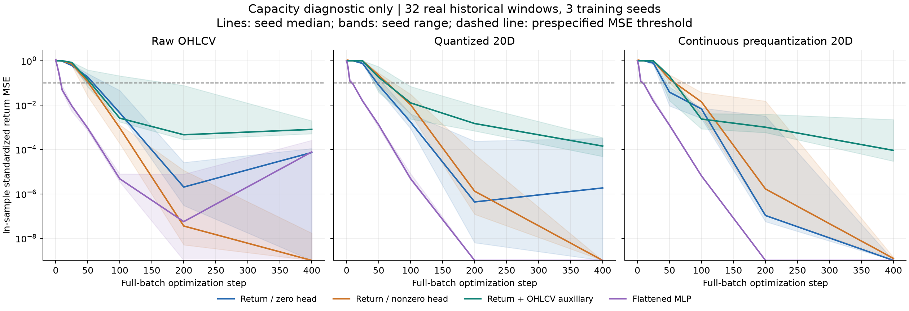
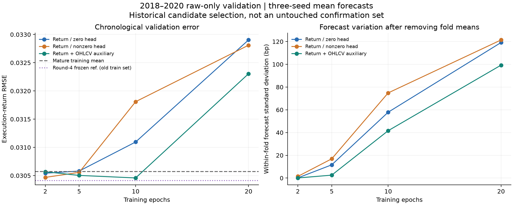

# 第五轮方法测试：训练能力、连续表示与辅助预测目标

实验日期：2026-09-10。研究目录：research_v5。本轮完成 45 次真实／打乱标签的小样本拟合，以及 27 次按时间先后进行的训练验证；保存并复验全部 153 个模型检查点。

## 主要判断

**主要问题更像过拟合与样本外信号不足，而不是网络无法学习。** 45 次小样本测试全部达到预设拟合标准；其中 27 次 Crossformer 真实标签测试全部通过，原始数值、量化坐标和连续坐标都能被拟合。原收益目标的零初始化模型也通过，因此不能把第四轮的近似常数预测简单解释为读出层阻断训练。该结论仅说明在 32 样本、关闭正则化、固定 400 步的诊断条件下有拟合能力。

**延长训练明显加重了过拟合。** 训练到 20 轮后，原收益、非零初始化、联合目标模型的最终训练期标准化收益 MSE 平均降至 0.610、0.567、0.648，但其集成验证 MSE 分别比训练均值基准更差 15.84%、15.19%、11.66%。训练误差下降与后续时间误差上升同时出现，当前证据不支持单纯增加训练轮数。

**联合 OHLCV 目标留下了一个很弱的候选线索。** 本轮 12 个候选中，联合目标训练 10 轮取得最低验证 RMSE 0.030458、方向准确率 58.87%，相对训练均值的 MSE 改善为 0.73%。折内预测标准差为 41.63 bp，循环错配输入后 MSE 从 0.0009277 升至 0.0009608，说明输出确实开始依赖样本。但四项预先指定的同轮数比较均为 Holm p=1.0000，尚未确认新增训练设置的可靠优势。

**这仍没有超过此前保存的验证结果。** 第四轮已冻结的原始数值固定分段模型，在相同 141 个验证日上的准确率为 59.57%、RMSE 为 0.030411，均略优于本轮选中的联合目标。两轮训练样本集合有五个早期样本的差别，不能据此做单一结构的严格归因；也不能把本轮 58.87% 表述成已实现策略改进。

**候选优势缺乏年度与种子的一致性。** 联合目标 10 轮在 2018、2019 年的准确率约为 63%，到 2020 年降为 50%，该年 MSE 比训练均值更差 3.05%。三个单独种子中，仍有一个的总体 MSE 比训练均值差 4.81%。连续表示的优秀小样本拟合也不能提供预测提升的证明，预训练表示在本轮没有进入早年验证。

本轮回答“第四轮的近似常数预测是否来自拟合能力或训练目标问题”。小样本拟合、历史验证、未来确认属于不同证据：能够记住训练标签不是可预测收益的证明；2018–2020 年也已经参与前几轮研究，因此本轮验证仍是探索性候选筛选。预训练编码器没有进入早年的预测验证。

## 第一层：真实窗口拟合能力

从截至 2017-12-31 已完成标签的合格样本中，按时间排序等距抽取 32 个窗口，不根据涨跌或收益大小选择。每个窗口含 125 根 K 线，固定为 25 个五日片段。所有容量测试使用同一批窗口、400 次全批量更新、学习率 0.001、梯度裁剪 1.0，并关闭 dropout 和 weight decay。这是检查能否拟合输入的受控条件，不等同于第四轮大样本训练配置。

原始数值是沿用第四轮的窗口内标准化 log OHLC、log1p 成交量。量化表示是官方 Kronos 的 20 维双极坐标；连续表示取同一冻结编码器在取符号之前、L2 归一化后的 20 维向量。两者每根 K 线向量范数都为 1，避免同时改变维度和总幅度。全体 3,785 个原窗口的 9,462,500 个坐标符号一致；连续范数最大误差约 1.79e-7。

预训练编码器包含晚于这些样本的训练数据。这里使用它，只检验既定输入能否被下游网络拟合；不能把预训练表示的拟合结果称为 2017 年或更早可取得的预测能力。

比较三种 Crossformer 训练设置：

- **原收益目标／零初始化**：保留第四轮的收益读出层初始化和单一收益 MSE。
- **收益目标／非零初始化**：只把收益读出权重改为 gain=0.1 的 Xavier uniform 初始化，偏置仍为零。
- **收益＋OHLCV 辅助目标**：收益读出仍为零初始化，在收益 MSE 上增加 0.1 倍未来五日 OHLCV 的平均标准化 MSE。

每种输入另用一个展平输入、64 个 GELU 隐藏单元的 MLP 拟合真实及打乱收益标签。标签打乱使用唯一固定种子 20260914，且在表示与训练种子之间保持相同排列。MLP 是容量对照，参数量不要求与 Crossformer 相同。

预先规定的拟合通过标准是：第 400 步最终标准化收益 MSE ≤ 0.1，且收益相关性 ≥ 0.9。表中通过数是三个训练种子中满足该条件的数量，不使用中途最好检查点或最好种子替代最终结果。

| 表示 | 模型／目标 | 训练标签 | 通过种子数 | 最终 MSE 中位数 | 最终 MSE 范围 |
| --- | --- | --- | --- | --- | --- |
| 20 维量化坐标 | 收益＋OHLCV 辅助目标 | 真实 | 3/3 | 0.000142372 | [4.84821e-05, 0.000342812] |
| 20 维量化坐标 | 展平 MLP | 打乱 | 3/3 | 1.93075e-15 | [6.52256e-16, 2.34708e-15] |
| 20 维量化坐标 | 展平 MLP | 真实 | 3/3 | 3.52496e-15 | [2.47892e-15, 4.60916e-15] |
| 20 维量化坐标 | 收益目标／非零初始化 | 真实 | 3/3 | 8.50361e-14 | [2.99084e-14, 6.21607e-12] |
| 20 维量化坐标 | 原收益目标／零初始化 | 真实 | 3/3 | 1.84495e-06 | [1.68164e-14, 0.000317797] |
| 20 维连续坐标 | 收益＋OHLCV 辅助目标 | 真实 | 3/3 | 9.10223e-05 | [2.97171e-05, 0.00222702] |
| 20 维连续坐标 | 展平 MLP | 打乱 | 3/3 | 4.22058e-15 | [9.7318e-16, 5.11396e-15] |
| 20 维连续坐标 | 展平 MLP | 真实 | 3/3 | 8.70831e-16 | [7.63278e-16, 1.32706e-15] |
| 20 维连续坐标 | 收益目标／非零初始化 | 真实 | 3/3 | 1.22621e-09 | [1.19653e-09, 1.37116e-09] |
| 20 维连续坐标 | 原收益目标／零初始化 | 真实 | 3/3 | 5.12177e-14 | [1.98192e-14, 1.84442e-12] |
| 原始 OHLCV | 收益＋OHLCV 辅助目标 | 真实 | 3/3 | 0.000804282 | [0.000514709, 0.00197154] |
| 原始 OHLCV | 展平 MLP | 打乱 | 3/3 | 3.31055e-09 | [1.17358e-09, 2.24754e-05] |
| 原始 OHLCV | 展平 MLP | 真实 | 3/3 | 7.74148e-05 | [5.46438e-15, 0.000261781] |
| 原始 OHLCV | 收益目标／非零初始化 | 真实 | 3/3 | 7.20987e-10 | [1.49441e-10, 1.69663e-08] |
| 原始 OHLCV | 原收益目标／零初始化 | 真实 | 3/3 | 7.32057e-05 | [2.32982e-13, 0.00011089] |

图中的线为三种子中位数，阴影为种子范围；为绘图可读性，低于 1e-9 的 MSE 画在该下界，原始数值完整保留。打乱标签控制单独列在表中，它检验记忆能力，不衡量预测泛化。

## 第二层：2018–2020 年时间顺序验证

本层只使用原始 OHLCV，避免预训练编码器对早年验证造成时间污染。三种训练设置都完整运行三个年度滚动区间和三个种子，训练至 20 轮并记录第 2、5、10、20 轮。容量测试表现没有改变候选列表、训练预算或任何阈值。

| 训练截止日 | 成熟日度训练样本 | 最晚训练标签完成日 | 验证信号范围 | 验证周数 |
| --- | --- | --- | --- | --- |
| 2017-12-31 | 1678 | 2017-12-29 | 2018-01-05 至 2018-12-28 | 49 |
| 2018-12-31 | 1921 | 2018-12-28 | 2019-01-04 至 2019-12-27 | 46 |
| 2019-12-31 | 2165 | 2019-12-31 | 2020-01-03 至 2020-12-18 | 46 |

全部训练样本的收益标签和辅助标签都已在对应截止日前完成；测试只用周五信号，最终标签还必须在 2020-12-31 前完成。候选结果由三个种子预测先取均值后计算，故种子平均准确率不一定等于这里的集成准确率。

| 训练设置 | 轮数 | 验证准确率 | 验证 RMSE | 相对训练均值 MSE 改善 | 折内预测 SD／bp |
| --- | --- | --- | --- | --- | --- |
| 收益＋OHLCV 辅助目标 | 2 | 56.03% | 0.030568 | 0.02% | 0.10 |
| 收益＋OHLCV 辅助目标 | 5 | 56.03% | 0.030503 | 0.44% | 2.55 |
| 收益＋OHLCV 辅助目标 | 10 | 58.87% | 0.030458 | 0.73% | 41.63 |
| 收益＋OHLCV 辅助目标 | 20 | 53.90% | 0.032305 | -11.66% | 99.27 |
| 收益目标／非零初始化 | 2 | 56.03% | 0.030468 | 0.67% | 1.45 |
| 收益目标／非零初始化 | 5 | 54.61% | 0.030557 | 0.09% | 16.90 |
| 收益目标／非零初始化 | 10 | 52.48% | 0.031810 | -8.27% | 74.85 |
| 收益目标／非零初始化 | 20 | 56.74% | 0.032811 | -15.19% | 121.42 |
| 原收益目标／零初始化 | 2 | 56.03% | 0.030542 | 0.19% | 0.14 |
| 原收益目标／零初始化 | 5 | 55.32% | 0.030580 | -0.06% | 11.61 |
| 原收益目标／零初始化 | 10 | 56.74% | 0.031095 | -3.46% | 57.88 |
| 原收益目标／零初始化 | 20 | 51.77% | 0.032904 | -15.84% | 119.16 |

同折成熟训练收益均值的验证 RMSE 为 **0.030571**，零收益基准为 **0.030560**。相对训练均值 MSE 改善大于零才代表误差更低；模型输出更多波动本身不是目标。

折内预测标准差先减去各年度模型自身的预测均值，再对残差合并计算，避免把年度重训造成的整体偏移误当成逐样本信号；全区间预测标准差和折间方差占比另存于指标文件。

预先固定的最小 RMSE 选择规则选出 **收益＋OHLCV 辅助目标，10 轮**，准确率 58.87%，RMSE 0.030458。这是这 12 个候选中的验证集选择结果，包含选参偏差，不是独立确认的最优模型。

还必须保留第四轮已经选出的原始数值固定分段模型作为背景参照：在完全相同的 141 个验证日上，它的冻结 5 轮预测准确率为 **59.57%**、RMSE 为 **0.030411**，仍优于本轮选中候选。本轮辅助目标要求使共享训练集多排除了五个早期样本，因此这不是用于归因某个结构变化的严格控制比较，但足以说明不能宣称已超越之前的验证结果。

选中候选的年度表现如下，各年样本数及市场变化不同，不能仅凭一个年度高分外推稳定收益。

| 年份 | 周数 | 准确率 | RMSE | 相对训练均值 MSE 改善 |
| --- | --- | --- | --- | --- |
| 2018 | 49 | 63.27% | 0.030594 | 3.76% |
| 2019 | 46 | 63.04% | 0.026223 | 2.33% |
| 2020 | 46 | 50.00% | 0.034043 | -3.05% |

## 同预算比较与输入依赖诊断

主要统计只比较同为 5 轮或 20 轮时，非零初始化和辅助目标相对原收益目标的误差。使用长度为 8 个观察值的循环分块 bootstrap、10,000 次重复、种子 20260910，并对四项 MSE 比较做 Holm 校正。RMSE 差值小于零代表新增设置更好；95% 区间为各项边际区间。它们仍属于历史验证上的探索性统计。

| 比较 | 相同轮数 | ΔRMSE | 95% 区间 | MSE Holm p |
| --- | --- | --- | --- | --- |
| 收益目标／非零初始化 − 原收益目标 | 5 | -0.000023 | [-0.000232, 0.000162] | 1.0000 |
| 收益＋OHLCV 辅助目标 − 原收益目标 | 5 | -0.000077 | [-0.000284, 0.000138] | 1.0000 |
| 收益目标／非零初始化 − 原收益目标 | 20 | -0.000093 | [-0.001501, 0.001278] | 1.0000 |
| 收益＋OHLCV 辅助目标 − 原收益目标 | 20 | -0.000599 | [-0.001962, 0.000843] | 1.0000 |

另外用每个已完成的最终检查点、关闭 dropout 后重算完整训练集损失，避免把逐批优化时的损失误当作最终模型误差。验证区间内还将整个输入窗口循环错配一位，保留窗口内容、几何和掩码，检查预测是否依赖与该标签对应的输入。这种错配没有参与模型选择，也不是可实施交易策略。

| 训练设置 | 轮数 | 最终模型训练标准化 MSE 均值 | 原样本验证 MSE | 重配输入验证 MSE | 重配后 MSE 增量 |
| --- | --- | --- | --- | --- | --- |
| 原收益目标／零初始化 | 5 | 0.9925 | 0.0009352 | 0.0009362 | 0.0000010 |
| 原收益目标／零初始化 | 20 | 0.6102 | 0.0010826 | 0.0010621 | -0.0000206 |
| 收益目标／非零初始化 | 5 | 0.9838 | 0.0009337 | 0.0009331 | -0.0000006 |
| 收益目标／非零初始化 | 20 | 0.5673 | 0.0010765 | 0.0009732 | -0.0001033 |
| 收益＋OHLCV 辅助目标 | 5 | 0.9971 | 0.0009304 | 0.0009323 | 0.0000019 |
| 收益＋OHLCV 辅助目标 | 20 | 0.6480 | 0.0010436 | 0.0010671 | 0.0000236 |

训练期标准化收益 MSE 的均值输出基准为 1；上表在九次“年度×种子”拟合之间取平均。预测随输入变化与预测变化有用是两个问题：错配后误差上升才提供与输入对应关系有关的诊断信息，而且需要结合原始验证误差和不确定性来判断。

从平方误差本身看，最佳的常数预测就是训练收益均值；标准化后这个常数为零。如果模型在当前数据与训练条件下没有学到更有用的条件差异，回到均值附近并不等于代码出错。需要判断的是它能否在后续时间样本上稳定超过这个简单解。

## 实现与因果口径

Crossformer 复用第四轮已经验证的 DSW 嵌入、时间／维度注意力、层次编码解码和掩码实现，尺寸保持 d_model=32、d_ff=64、4 heads、2 层编码器、router factor=4。每个变体都包含相同的 D→5 辅助线性头，以维持参数结构；原收益设置不计算辅助损失。原始数值模型各 138,471 个参数，20 维表示模型各 151,101 个参数。

辅助头采用独立随机数作用域，初始化完成后恢复 CPU 和 GPU 随机状态；非零收益读出也使用独立作用域。接口检查确认新增但未使用的辅助头不会改变原骨干参数、初始解码结果或后续随机数状态。零初始化下第一步纯收益损失不会把梯度传到骨干，这是链式求导的预期结果；辅助目标可在第一步传入骨干梯度。是否影响持续学习，需要看实际拟合与验证结果，不能仅根据第一步梯度判定故障。

收益标签沿用先前的“当前信号后的开盘到下一个同星期信号后的开盘”收益。辅助目标则为未来五根 K 线的 OHLCV：四个价格取相对当前收盘价的对数比，成交量取未来 log1p 成交量减去最近 20 根已观察成交量的 log1p 均值。25 个坐标只按成熟训练标签的均值和标准差缩放。总损失为标准化收益 MSE＋0.1×辅助坐标平均 MSE，没有把解码器输出冒充已训练的原文 OHLCAV 预测。

共享样本共 3,780 个，比第四轮多排除 5 个早期日度样本：本轮对未来辅助 OHLCV 使用严格的高低价包围检查，2010-07-20 的原始最低价 2685.460 略高于开盘价 2685.459，因而影响 2010-07-13 至 2010-07-19 的五个输入锚点。此前数据质量标记允许这种报价舍入差异。本轮保留原始数据，对全部候选使用同一排除规则；没有只给辅助目标模型减少训练样本。因此新的原收益基线会重新训练，不把它与第四轮预测冒充逐值相同。

验证阶段采用 AdamW、学习率 0.001、weight decay=0.01、dropout=0.1、batch 128、梯度范数裁剪 1.0；仅打乱成熟的训练样本。使用已有的独立 GPU 环境、确定性 float32、关闭 TF32、四个 CPU 线程，没有安装新依赖。

## 复验与文件

最终状态：**PASS**。四项接口检查通过；独立重算全部 94500 个辅助目标坐标和收益标签，核对所有训练标签成熟日期、等距抽样和三种子集成。共回放 **45 个容量检查点**及 **108 个验证检查点**，最大预测误差分别为 4.44e-16、1e-16。源码、输入缓存、权重和检查点哈希均匹配，前四轮 1147 个纳入保全的证据文件未改变。

容量测试运行 12.19 分钟，历史验证运行 11.37 分钟；不含数据准备、接口检查、统计和复验。两个阶段完整运行，结论文字写在训练结束后，未反向影响配置或预测。

- [冻结协议](../protocol.json)、[执行说明](../README.md)、[输入准备清单](preparation_manifest.json)、[表示核验](representation_verification.json)。
- [容量测试全部结果](capacity_summary.json)、[容量训练曲线](capacity_curves.csv)、[固定真实样本](capacity_samples.csv)、[真实及打乱标签预测](capacity_predictions.csv)。
- [验证候选指标](validation_metrics.csv)、[种子指标](validation_seed_metrics.csv)、[年度指标](validation_yearly_metrics.csv)、[逐条种子预测](validation_seed_predictions.csv)、[集成预测](validation_ensemble_predictions.csv)。
- [训练损失与错配诊断](validation_training_curves.csv)、[主要配对统计](paired_comparisons.json)、[选择结果](selection.json)。
- [第四轮冻结验证参照](frozen_round4_reference.json)、[重叠训练标签诊断](training_label_overlap.json)、[小样本达到误差阈值的步数](capacity_learning_speed.csv)。
- [最终复验](verification.json)、[测试日志](test_results.txt)、[容量检查点清单](capacity_checkpoint_manifest.json)、[验证检查点清单](validation_checkpoint_manifest.json)。
- 矢量图：[容量学习曲线 SVG](capacity_learning.svg)、[历史验证 SVG](validation_comparison.svg)。交付文件哈希保存在同目录 delivery_manifest.json。

## 后续判断

**下一轮的优先方向应是控制过拟合和检验样本稳定性。** 保留原始数值、固定分段及此前冻结基线，先在相同数据口径下比较较小模型或更强正则化，并按时间块检查结论是否稳定；联合 OHLCV 目标可以保留为一个受控候选。模型容量、目标函数和样本组织应分开改变，避免把一次验证分数的改善误当成机制已经解决。

三个训练区间内，相邻日度收益标签的相关系数都约为 0.78。这与持有区间高度重叠一致，表明 1,678–2,165 个日度训练样本不能视作同等数量的独立证据。该诊断不直接估算有效样本数，也不证明减少样本就会改善；更合理的下一步是对训练日期分块重采样，并检验样本集合的小幅变化是否改变候选排名。

保留本轮联合目标 10 轮检查点作为已定义的候选，而不把它升级为新的最优基线。后续如果进入 2024–2026 年窗口，需要预先冻结比较并承认该段历史已经被观察；真正的确认仍需未使用的时间段或事先保留的独立资产。本轮训练诊断和历史验证均已完成，没有生成新的 103 周收益宣称。

结构和表示的原始定义参照 [Crossformer 固定官方版本](https://github.com/Thinklab-SJTU/Crossformer/tree/c10c8eadb153d1dd9798250967747ca3ebb81383)、[Kronos tokenizer 官方实现](https://github.com/shiyu-coder/Kronos/blob/67b630e67f6a18c9e9be918d9b4337c960db1e9a/model/kronos.py) 及 [BSQuantizer 官方实现](https://github.com/shiyu-coder/Kronos/blob/67b630e67f6a18c9e9be918d9b4337c960db1e9a/model/module.py)。本轮改动是本地诊断实验，数值均来自保存的本地计算。
