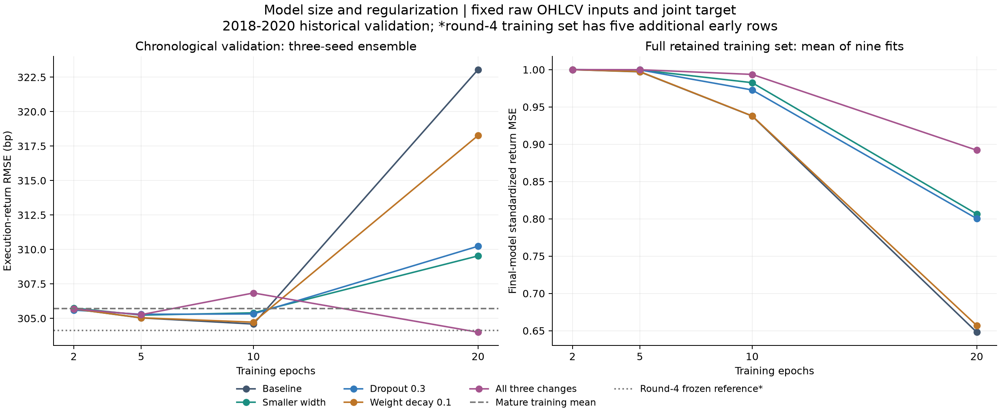
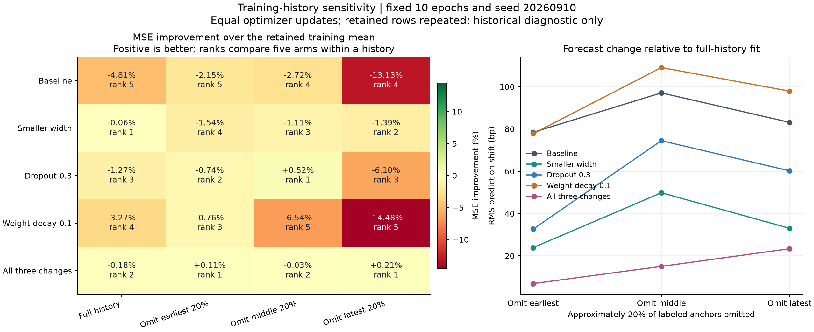

# 第六轮方法测试：模型大小、正则化与训练历史稳定性

**缩小模型并加强正则化确实缓解了长时间训练的过拟合，但验证改善很小，尚未得到稳定的预测优势。** 本轮保留组合设置第 20 轮作为研究候选，不把它升级为已经确认的新基线。

本轮使用同一组 **141 个周五信号（2018—2020 年）**。所有模型预测从信号后的下一个实际开盘，到下一同星期信号后的实际开盘之间的收益；这是前几轮已经查看过的历史验证。准确率、RMSE 均为预测指标，没有重新计算交易费用或策略净收益。

| 方法 | 训练轮数 | 方向准确率 | 执行收益 RMSE | 相对训练均值的 MSE 改善 |
| --- | --- | --- | --- | --- |
| 三项组合（本轮按 RMSE 选中） | 20 | 59.57% | 0.030399 | 1.12% |
| 原联合目标基准（第五轮选中方案） | 10 | 58.87% | 0.030458 | 0.73% |
| 第四轮已冻结参考* | 5 | 59.57% | 0.030411 | 训练集略有不同 |
| 成熟训练样本均值 | — | 56.03% | 0.030571 | 0.00% |

*第四轮参考仍使用其原先的训练集，比本轮多五个早期样本；作为冻结参考展示，不能据此严格归因正则化变化。第五轮联合目标基准与本轮训练样本、模型和目标完全一致，**1692 条逐种子预测逐条复现，最大差异 0**。

## 1. 本轮回答什么

上一轮发现模型能拟合少量真实样本，但训练延长后验证误差增加。本轮固定输入和联合目标，只改变模型宽度与正则化，再检查删除历史样本块时的表现。

| 组别 | d_model / d_ff | dropout | AdamW 权重衰减 | 参数量 |
| --- | --- | --- | --- | --- |
| 原联合目标基准 | 32 / 64 | 0.1 | 0.01 | 138,471 |
| 缩小模型 | 16 / 32 | 0.1 | 0.01 | 38,551 |
| 增加 dropout | 32 / 64 | 0.3 | 0.01 | 138,471 |
| 增加权重衰减 | 32 / 64 | 0.1 | 0.1 | 138,471 |
| 三项组合 | 16 / 32 | 0.3 | 0.1 | 38,551 |

小模型参数从 138,471 减至 38,551，减少约 72.2%。保持 2 层编码器、4 个注意力头、4 个路由向量和原有解码结构。缩小宽度也改变每个注意力头的维度；没有测试缩减层数。前三个修改可各自与原基准作单因素比较；“三项组合”是捆绑候选，不是完整因子实验，不能分离所有交互作用。

共同目标为标准化收益 MSE ＋ 0.1 × 未来五根 K 线 OHLCV 辅助目标 MSE；收益头零初始化，辅助头使用独立随机作用域。未来价格使用相对当前收盘的对数变化，未来成交量相对已观察到的最近 20 根 K 线作变换，再使用本折保留的成熟训练标签计算均值和标准差。该辅助目标属于本地明确定义的研究目标，不是缺失 OHLCAV 训练细节的论文原样复现。

原始输入、25 × 5 分段、125 根观察窗口以及全部 3,780 个样本都直接复用第五轮文件。没有引入量化 token、预训练表示、重新下载的数据或自适应分段变化。严格辅助标签过滤额外排除的五个早期样本仍然排除。

## 2. 时间划分和预先固定的预算

| 验证年 | 完整训练数 | 验证周数 | 删除早／中／近后训练数 | 每轮更新次数 |
| --- | --- | --- | --- | --- |
| 2017 → 2018 | 1678 | 49 | 1342 / 1342 / 1343 | 14 |
| 2018 → 2019 | 1921 | 46 | 1536 / 1537 / 1537 | 16 |
| 2019 → 2020 | 2165 | 46 | 1732 / 1732 / 1732 | 17 |

训练只使用 `joint_completed ≤ cutoff` 的日频标签。验证使用下一年度周五信号，最终标签须在 2020-12-31 前完成。训练日期和验证日期没有随机混合。训练标签互相重叠，因此训练行数不能当成独立样本数。

主实验共 **45 次拟合**：5 组 × 3 年 × 3 个种子，每次完成 20 轮，保存第 2、5、10、20 轮，共 180 个检查点。种子为 20260910、20260911、20260912。AdamW 学习率 0.001，batch 128，梯度裁剪 1.0。

全部主实验完成后，按每周三个种子的平均预测计算 RMSE，选择 20 个候选中最低者；同分时优先更少轮数，再按协议组别顺序。方向准确率和样本块删除结果均不参与选择。计算用时约 29.0 分钟。

主要推断比较预先固定为第 10 轮的四项变化对原基准：8 个相邻验证观察值的循环区块 bootstrap，10,000 次，随机种子 20260910，中心化双侧 p，四项 MSE 比较作 Holm 调整。区间仍受有限历史和多轮研究选择的限制。

## 3. 全部候选结果

| 组别 | 训练轮数 | 准确率 | RMSE | 相对均值 MSE 改善 | 折内预测标准差／bp |
| --- | --- | --- | --- | --- | --- |
| 原联合目标基准 | 2 | 56.03% | 0.030568 | 0.02% | 0.10 |
| 原联合目标基准 | 5 | 56.03% | 0.030503 | 0.44% | 2.55 |
| 原联合目标基准 | 10 | 58.87% | 0.030458 | 0.73% | 41.63 |
| 原联合目标基准 | 20 | 53.90% | 0.032305 | -11.66% | 99.27 |
| 缩小模型 | 2 | 56.03% | 0.030575 | -0.03% | 0.15 |
| 缩小模型 | 5 | 56.03% | 0.030523 | 0.31% | 0.56 |
| 缩小模型 | 10 | 55.32% | 0.030540 | 0.20% | 13.87 |
| 缩小模型 | 20 | 57.45% | 0.030953 | -2.51% | 77.27 |
| 增加 dropout | 2 | 56.03% | 0.030560 | 0.07% | 0.10 |
| 增加 dropout | 5 | 56.03% | 0.030529 | 0.27% | 0.53 |
| 增加 dropout | 10 | 53.19% | 0.030532 | 0.26% | 24.49 |
| 增加 dropout | 20 | 56.03% | 0.031023 | -2.98% | 74.54 |
| 增加权重衰减 | 2 | 56.03% | 0.030568 | 0.02% | 0.10 |
| 增加权重衰减 | 5 | 56.03% | 0.030504 | 0.44% | 2.35 |
| 增加权重衰减 | 10 | 58.87% | 0.030472 | 0.65% | 42.51 |
| 增加权重衰减 | 20 | 56.03% | 0.031827 | -8.38% | 101.96 |
| 三项组合 | 2 | 56.03% | 0.030568 | 0.02% | 0.14 |
| 三项组合 | 5 | 56.03% | 0.030526 | 0.29% | 0.34 |
| 三项组合 | 10 | 54.61% | 0.030684 | -0.74% | 7.73 |
| 三项组合 | 20 | 59.57% | 0.030399 | 1.12% | 61.03 |

图左为三种子集成的验证 RMSE，图右为九次拟合中最终模型训练标准化收益 MSE 的均值。图中的 bp 为收益率万分之一，便于读数，并非费用或盈利。训练和验证两栏的标准化口径不同，不应直接比较纵轴绝对数值。

同为第 10 轮，负的 ΔRMSE 表示优于原联合目标基准：

| 同为第 10 轮：相对原基准 | ΔRMSE | 95% 区间 | MSE 原始 p | MSE Holm p |
| --- | --- | --- | --- | --- |
| 缩小模型 | +0.000081 | [-0.000470, +0.000695] | 0.7857 | 1.0000 |
| 增加 dropout | +0.000073 | [-0.000387, +0.000568] | 0.7690 | 1.0000 |
| 增加权重衰减 | +0.000014 | [-0.000229, +0.000249] | 0.9121 | 1.0000 |
| 三项组合 | +0.000226 | [-0.000342, +0.000832] | 0.4425 | 1.0000 |

**控制过拟合的方向得到了一些支持。** 同为第 20 轮，原基准的训练标准化收益 MSE 为 0.648，验证 MSE 比训练均值差 11.66%；组合设置的训练误差为 0.892，验证 MSE 则比均值好 1.12%。单独缩小模型或增加 dropout 也把第 20 轮的验证劣势缩到约 2.51% 和 2.98%；单独增加权重衰减仍差约 8.38%。这些结果支持减少过度拟合，但不说明预测信号已经足够强。

**最优分数只比旧参考略好。** 组合设置第 20 轮 RMSE 为 0.030399，第四轮冻结参考为 0.030411；差约 0.12 bp 的 RMSE，相对 MSE 改善仅约 0.08%。二者方向准确率同为 59.57%（84/141），没有超过旧参考的正确周数。相比第五轮联合目标第 10 轮，本轮多预测正确一周、RMSE 下降约 0.59 bp。旧参考训练集还多五个早期样本，这个极小的差距不宜解释为已证实的结构优势。这里的 bp 仅是预测误差单位，不是收益或节省的交易成本。

**预先指定的第 10 轮对照未确认优势。** 四项变化的三种子集成 MSE 都略高于第 10 轮原基准，四项 Holm 调整 p 均为 1.0000，区间均跨零。第 20 轮组合设置的胜出来自 20 个候选中按 RMSE 筛选，不能把第 10 轮的统计比较当成对第 20 轮的直接检验，也不能将筛选结果当成独立确认。

**年度和种子表现仍不一致。** 选中组合第 20 轮在 2018、2019 年相对训练均值的 MSE 改善约为 3.10% 和 7.10%，2020 年则更差 4.44%，该年的预测与真实收益相关性略为负值。三个单独种子的总体 MSE 相对均值分别约改善 0.07%、变差 4.31%、变差 1.82%；主表的改善来自三种子平均预测。因此当前最值得保留的是一个有待验证的集成候选。

**本轮只测试了两个宽度和预先固定的正则化幅度。** 组合设置第 20 轮处于本轮训练预算上界，不能据此断言 20 轮是最优训练长度，也没有在看到结果后继续搜索更长训练或更多参数。

## 4. 选中候选的年度和种子稳定性

选中设置为 **三项组合，训练 20 轮**。下表年度数据均来自相应年度只使用历史训练资料的预测。

| 年份 | 周数 | 准确率 | RMSE | 相对均值 MSE 改善 |
| --- | --- | --- | --- | --- |
| 2018 | 49 | 65.31% | 0.030699 | 3.10% |
| 2019 | 46 | 56.52% | 0.025574 | 7.10% |
| 2020 | 46 | 56.52% | 0.034273 | -4.44% |

下表分别计算单个种子的 141 周表现，主结果表使用三个种子的平均预测；两者不能混用。

| 训练种子 | 准确率 | RMSE | 相对均值 MSE 改善 |
| --- | --- | --- | --- |
| 20260910 | 57.45% | 0.030560 | 0.07% |
| 20260911 | 55.32% | 0.031223 | -4.31% |
| 20260912 | 58.16% | 0.030847 | -1.82% |

训练误差随轮数的变化如下。每行训练值是三个年度 × 三个种子的均值，验证值为同一设置的三种子集成：

| 组别 | 轮数 | 训练收益标准化 MSE | 训练辅助目标标准化 MSE | 验证收益 RMSE |
| --- | --- | --- | --- | --- |
| 原联合目标基准 | 5 | 0.9971 | 1.0112 | 0.030503 |
| 原联合目标基准 | 10 | 0.9378 | 1.0595 | 0.030458 |
| 原联合目标基准 | 20 | 0.6480 | 0.9825 | 0.032305 |
| 缩小模型 | 5 | 0.9997 | 1.0045 | 0.030523 |
| 缩小模型 | 10 | 0.9825 | 1.0115 | 0.030540 |
| 缩小模型 | 20 | 0.8064 | 1.0078 | 0.030953 |
| 增加 dropout | 5 | 0.9997 | 1.0092 | 0.030529 |
| 增加 dropout | 10 | 0.9728 | 1.0346 | 0.030532 |
| 增加 dropout | 20 | 0.8003 | 1.0141 | 0.031023 |
| 增加权重衰减 | 5 | 0.9974 | 1.0106 | 0.030504 |
| 增加权重衰减 | 10 | 0.9380 | 1.0580 | 0.030472 |
| 增加权重衰减 | 20 | 0.6570 | 0.9787 | 0.031827 |
| 三项组合 | 5 | 0.9999 | 1.0064 | 0.030526 |
| 三项组合 | 10 | 0.9936 | 1.0041 | 0.030684 |
| 三项组合 | 20 | 0.8920 | 1.0204 | 0.030399 |

## 5. 删除训练历史块的压力测试

各年度把成熟训练样本按日期分成五段，分别删除第 1、3、5 段，约为最早、中间、最近的 20%。这是删除标签锚点；剩余样本的 125 根 K 线窗口仍可能覆盖部分被删除日期。没有宣称完全清除了这段底层行情。

| 截止日 | 删除位置 | 删除标签锚点日期范围 | 删除数量 |
| --- | --- | --- | --- |
| 2017-12-31 | 删除最早约 20% | 2010-07-09 至 2011-12-01 | 336 |
| 2017-12-31 | 删除中间约 20% | 2013-04-25 至 2014-09-10 | 336 |
| 2017-12-31 | 删除最近约 20% | 2016-08-09 至 2017-12-21 | 335 |
| 2018-12-31 | 删除最早约 20% | 2010-07-09 至 2012-02-17 | 385 |
| 2018-12-31 | 删除中间约 20% | 2013-09-17 至 2015-11-02 | 384 |
| 2018-12-31 | 删除最近约 20% | 2017-06-01 至 2018-12-20 | 384 |
| 2019-12-31 | 删除最早约 20% | 2010-07-09 至 2012-05-02 | 433 |
| 2019-12-31 | 删除中间约 20% | 2014-02-18 至 2016-06-03 | 433 |
| 2019-12-31 | 删除最近约 20% | 2018-03-16 至 2019-12-23 | 433 |

为保持优化更新预算一致，每轮仍展示完整历史对应的样本数量。先无放回打乱保留样本，不足部分再从新的随机排列补齐，所以部分保留样本会重复。各组用同一训练掩码与采样顺序；标准化只看保留样本。这项设计检验样本组成变化，不能解释为普通删除样本后的无权重重训。

删除实验固定 **10 轮、种子 20260910**，共 45 次拟合，约 15.6 分钟。完整历史参考取自主实验的相同种子和轮数，没有用集成预测替代。删除位置和轮数都不参与候选筛选。该项只有一个种子，不能分离所有样本组成与初始化的交互。

本轮主实验最终选中的是 **组合设置第 20 轮**，而删除测试按训练前协议固定为第 10 轮。因此下述删除结果直接描述第 10 轮各组的敏感性，**没有检验选中候选第 20 轮的删除稳定性**，也不能用第 10 轮的结果替它判定通过或失败。

部分主实验与删除实验使用独立进程同时运行，各自保持独立随机状态与输出，因此两项用时不能直接相加为总耗时，详见[运行说明](execution_overlap_note.json)。

| 组别 | 训练历史 | 准确率 | RMSE | 相对保留样本均值 MSE 改善 | ΔMSE 对同历史原基准 | 同历史排名 |
| --- | --- | --- | --- | --- | --- | --- |
| 原联合目标基准 | 完整历史 | 58.87% | 0.031298 | -4.81% | +0.0000000 | 5 |
| 原联合目标基准 | 删除最早约 20% | 54.61% | 0.030934 | -2.15% | +0.0000000 | 5 |
| 原联合目标基准 | 删除中间约 20% | 54.61% | 0.031216 | -2.72% | +0.0000000 | 4 |
| 原联合目标基准 | 删除最近约 20% | 50.35% | 0.032438 | -13.13% | +0.0000000 | 4 |
| 缩小模型 | 完整历史 | 55.32% | 0.030580 | -0.06% | -0.0000445 | 1 |
| 缩小模型 | 删除最早约 20% | 50.35% | 0.030842 | -1.54% | -0.0000057 | 4 |
| 缩小模型 | 删除中间约 20% | 51.06% | 0.030972 | -1.11% | -0.0000152 | 3 |
| 缩小模型 | 删除最近约 20% | 56.03% | 0.030709 | -1.39% | -0.0001092 | 2 |
| 增加 dropout | 完整历史 | 49.65% | 0.030764 | -1.27% | -0.0000331 | 3 |
| 增加 dropout | 删除最早约 20% | 58.16% | 0.030719 | -0.74% | -0.0000132 | 2 |
| 增加 dropout | 删除中间约 20% | 51.77% | 0.030720 | 0.52% | -0.0000307 | 1 |
| 增加 dropout | 删除最近约 20% | 52.48% | 0.031414 | -6.10% | -0.0000653 | 3 |
| 增加权重衰减 | 完整历史 | 61.70% | 0.031067 | -3.27% | -0.0000144 | 4 |
| 增加权重衰减 | 删除最早约 20% | 53.90% | 0.030722 | -0.76% | -0.0000131 | 3 |
| 增加权重衰减 | 删除中间约 20% | 50.35% | 0.031792 | -6.54% | +0.0000363 | 5 |
| 增加权重衰减 | 删除最近约 20% | 51.06% | 0.032632 | -14.48% | +0.0000126 | 5 |
| 三项组合 | 完整历史 | 58.16% | 0.030598 | -0.18% | -0.0000433 | 2 |
| 三项组合 | 删除最早约 20% | 56.03% | 0.030588 | 0.11% | -0.0000212 | 1 |
| 三项组合 | 删除中间约 20% | 46.10% | 0.030805 | -0.03% | -0.0000255 | 2 |
| 三项组合 | 删除最近约 20% | 51.77% | 0.030465 | 0.21% | -0.0001241 | 1 |

相对均值的改善分别使用当前保留样本的训练均值。“ΔMSE 对同历史原基准”则保持相同训练历史，负数表示该变化优于原模型。排名只在同一种训练历史下的五个模型之间计算。

四种训练历史共用同一段 141 周验证，彼此高度相关。“优于基准的历史数”是敏感性描述，不是四次独立验证，也没有为这些删除结果另作显著性宣称。

删除训练样本也会改变目标均值与标准差。例如，截至 2018 年底的训练集删除中间块后，平均收益从约 +11.46 bp 变为 −6.74 bp。因此绝对预测的改变同时包含训练标签分布变化和模型响应变化，不能全部归于网络不稳定。[标签分布诊断](training_history_label_statistics.csv)及[预测变化分解](block_prediction_sensitivity.csv)分别保留了训练均值变化和扣除均值后的预测差异；后者仍不分离标准差或所有交互的影响。

| 组别 | 优于均值的历史数 | 优于同历史原基准的历史数 | 排名范围 | 最大预测 RMS 改变／bp | 最大方向改变比例 |
| --- | --- | --- | --- | --- | --- |
| 原联合目标基准 | 0/4 | 自身 | 4–5 | 97.12 | 41.13% |
| 缩小模型 | 0/4 | 4/4 | 1–4 | 49.85 | 56.74% |
| 增加 dropout | 1/4 | 4/4 | 1–3 | 74.50 | 46.10% |
| 增加权重衰减 | 0/4 | 2/4 | 3–5 | 109.10 | 45.39% |
| 三项组合 | 2/4 | 4/4 | 1–2 | 23.37 | 23.40% |

**第 10 轮组合设置的相对排名较稳定，但绝对预测能力仍弱。** 在完整历史和三种删除历史中，它均优于相同种子的原神经网络，排名为第 1—2 名；但只有 2/4 种历史略优于各自训练均值，改善分别约 0.11% 和 0.21%。单独缩小模型在 4/4 种历史都不如均值。组合的最大预测 RMS 改变约 23.37 bp，原基准为 97.12 bp；同时组合完整历史第 10 轮的折内预测标准差仅约 5.98 bp，删除中间块后更降至约 0.62 bp，约 99.82% 的预测方差来自年度折均值之间，表现接近折内常数。删除最早块时，其 141 周预测全部为正。因此不能仅凭波动小就判断学到了稳定的样本信号。上述结论只针对固定第 10 轮、单个种子的压力测试；选中的第 20 轮在本轮尚未接受同样的删除检验。

## 6. 复验和证据

**4 项行为检查通过；90 次拟合、225 个检查点全部完成预测重放。** 主实验最大重放误差 1e-16，删除实验 1e-16，属于文本浮点存储精度差异。

核对了全部折的成熟标签条件、独立重建的删除掩码、保留标签的标准化参数、每轮样本展示数和更新次数。主实验保存 8,460 条逐种子预测，删除实验保存 2,115 条。既有 1,353 个证据文件的哈希保持不变，输入、训练源码和冻结协议均一致。

基准行为检查覆盖权重、CPU/GPU 随机状态及一次完整训练更新；所有组别检查辅助目标对主干的梯度连接；模型宽度和 dropout 配置、保留样本采样与预算亦作了确定性检查。复验结论是实现符合本轮协议，不等同于市场有效性证明。

可复查文件：

- [训练前固定协议](../protocol.json)、[来源与输入清单](preparation_manifest.json)、[模型参数量](model_parameters.json)。
- [完整样本及成熟日期](observation_table.csv)、[各折与删除定义](fold_history_definitions.csv)。
- [主实验逐种子预测](main_seed_predictions.csv)、[集成预测](main_ensemble_predictions.csv)、[全部指标](main_metrics.csv)、[年度指标](main_yearly_metrics.csv)、[种子指标](main_seed_metrics.csv)、[训练曲线](main_training_curves.csv)。
- [预先指定的四项比较](primary_comparisons.json)、[选中规则与结果](selection.json)、[旧基准精确复现](previous_reference.json)。
- [删除实验预测](blocks_seed_predictions.csv)、[完整及删除历史对照预测](block_comparison_predictions.csv)、[删除实验指标](block_metrics.csv)、[预测变化](block_prediction_sensitivity.csv)、[稳定性汇总](block_stability_summary.json)。
- [完整检查结果](verification.json)、[行为检查输出](contract_test_output.txt)、[主实验检查点哈希](main_checkpoint_manifest.json)、[删除实验检查点哈希](blocks_checkpoint_manifest.json)。
- 矢量图：[训练与验证](regularization_comparison.svg)、[训练历史稳定性](block_stability.svg)。

## 7. 下一步研究取舍

1. 先固定组合第 20 轮及当前基准，补齐针对第 20 轮、多个种子的时间块稳定性检验；比较口径预先固定，继续保留成熟训练均值。这个步骤回答候选是否稳定，不用于再挑删除位置或寻找更好看的参数。
2. 若继续改善方法，优先检验训练样本组织与标签稳定性：重叠持有区间造成的高度相关标签、训练历史远近和不同年份的目标分布。可以预先定义互不重叠标签或均衡时间块的受控对照，并匹配更新预算；不能假定删除样本本身一定会提升。暂不优先扩展网络规模或继续无边界参数搜索。
3. 只有候选经过固定规则的稳定性检验后，再进入事先保留的独立资产或后续时间验证。此前 2024—2026 年窗口也已被查看，若再使用只能作为已知历史的开发比较。当前结果不支持据此部署或宣称稳定交易收益。

本轮未对 2024—2026 年结果重新评分，也没有推进实盘或形成可部署的参数建议。历史验证已经经过多轮查看，即使某个候选优于旧结果，也需要在事先固定的后续检验中验证。
