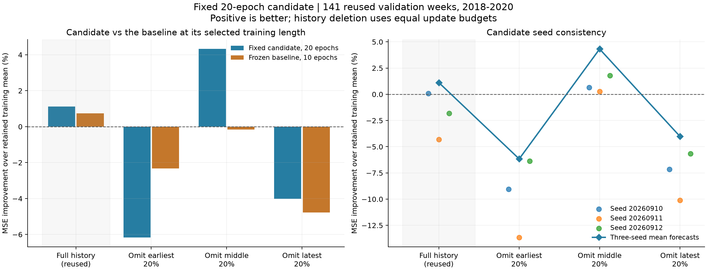
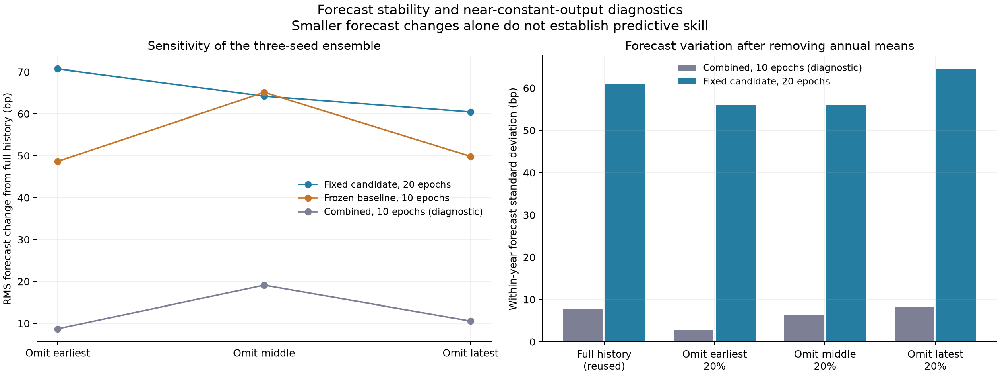

# 第七轮方法测试：固定 20 轮候选的多种子时间块检验

**固定组合模型第 20 轮未满足预先定义的多种子时间块一致性条件。** 它在完整历史中的小幅改善无法稳定保持；当前证据支持把研究重点转向训练样本组织与时期分布，而不是把这个候选升级为新基线。

本轮补齐第六轮的检验缺口：第六轮选中的是组合模型第 20 轮，而此前删除历史块的测试只跑到第 10 轮且只有一个种子。这里固定候选，新增 **54 次拟合**，每种删除方式均使用三个种子，并保留原基准和训练均值作对照。本轮没有重新挑选模型、轮数、种子或删除位置。

依然使用 **2018—2020 年的 141 个周五信号**。目标是从信号后的下一个实际开盘，到下一同星期信号后的实际开盘之间的收益。该历史已经被多轮查看，新增拟合次数并不代表新增独立市场样本。准确率、RMSE 和 MSE 均为预测指标，本轮没有生成交易净收益结论。

## 1. 固定候选的结果

下表为每周三个种子的平均预测。完整历史一行直接复用第六轮冻结结果；新增检验是其余三行。

| 训练历史 | 候选准确率 | 候选 RMSE | 原基准 10 轮 RMSE | 训练均值 RMSE | 候选对均值 MSE 改善 | 优于均值的候选种子 |
| --- | --- | --- | --- | --- | --- | --- |
| 完整历史（复用） | 59.57% | 0.030399 | 0.030458 | 0.030571 | 1.12% | 1/3 |
| 删除最早约 20% | 48.94% | 0.031535 | 0.030960 | 0.030606 | -6.16% | 0/3 |
| 删除中间约 20% | 55.32% | 0.030128 | 0.030825 | 0.030801 | 4.32% | 3/3 |
| 删除最近约 20% | 55.32% | 0.031105 | 0.031217 | 0.030498 | -4.02% | 0/3 |

三种删除历史中，候选集成优于训练均值的数量为 **1/3**，优于原基准 10 轮的数量为 **2/3**。

训练前固定的三个描述性一致性条件如下。本轮对该一致性检查的结论为 **不满足**。即使全部满足，也只是允许进一步研究的本地一致性线索，不等同于统计确认或可部署结论。

| 预先固定的一致性条件 | 结果 |
| --- | --- |
| 三个删除历史的集成 MSE 都低于训练均值 | 不满足 |
| 三个删除历史的集成 MSE 都低于原基准 10 轮 | 不满足 |
| 每个删除历史至少两个种子的 MSE 低于训练均值 | 不满足 |

**三个一致性条件全部不满足。** 删除最早块后，候选集成 RMSE 为 0.031535，MSE 比相应训练均值差 6.16%，方向准确率 48.94%；删除最近块后，RMSE 为 0.031105，MSE 更差 4.02%，准确率 55.32%。只有删除中间块时 RMSE 降至 0.030128，MSE 改善 4.32%，准确率 55.32%。原先完整历史的 59.57% 和 1.12% MSE 改善没有在三种样本扰动中保持。

**种子结果强化了样本组成敏感性的判断。** 删除最早块和最近块时，三个单独种子的 MSE 全部不如对应训练均值；删除中间块时，三个种子都优于均值。这不是仅由一个较差种子拖累的集成结果。但三种历史共享同一验证期，也不能把这种一致分化视为独立验证已经充足。

**相对强弱需要区分比较对象。** 候选在三种删除历史下都优于容易过拟合的原模型第 20 轮，相对 MSE 改善约为 14.95%、13.54%、4.30%。相对此前选中的原基准第 10 轮，则在删除最早块时更差 3.75%，删除中间与最近块时分别改善 4.47% 和 0.72%。因此正则化减轻长时间训练损失的结论仍成立，但单独优于原模型第 20 轮不足以证明候选有可靠的预测价值。

**六项主要比较没有给出经过调整的显著优势。** Holm 调整 p 值为 0.3864 或 0.8559，均高于 0.05。删除中间块相对均值的百分位 RMSE 区间几乎全部位于零以下，但原始中心化双侧 p 为 0.0644，Holm p 为 0.3864；本轮按事先规定的检验口径，不将其解释为显著成功。也不能据此把删除中间历史改成新选出来的策略参数。

**年度结果显示改善并非跨年一致。** 删除最早块时，候选在三个验证年份都不如训练均值。删除最近块时，2020 年 MSE 比均值差 11.73%，准确率只有 43.48%，拉低了整体结果。即使表现较好的删除中间块，2019 年 MSE 仍比均值差约 0.80%。这些结果指向时期分布与训练样本变化的敏感性，没有识别出某个必然应剔除的行情阶段。

## 2. 比较角色和数据边界

| 角色 | 设置 | 作用 |
| --- | --- | --- |
| 固定候选 | 组合模型，20 轮；d_model 16 / d_ff 32；dropout 0.3；权重衰减 0.1；38,551 个参数 | 唯一接受稳定性检验的候选 |
| 主要神经网络对照 | 原模型，10 轮；d_model 32 / d_ff 64；dropout 0.1；权重衰减 0.01；138,471 个参数 | 使用第五轮已经选定的训练长度，保留其既有运行设置 |
| 同预算参考 | 原模型，20 轮 | 检查与相同训练轮数的模型相比如何；它较易过拟合，单独优于它不足以说明候选有效 |
| 训练前缀诊断 | 组合模型，10 轮 | 检查从近常数输出到第 20 轮的变化；不参与候选选择 |
| 简单参考 | 保留的成熟训练样本均值、零收益预测 | 判断模型是否提供超过简单预测的信号 |

两种架构均实际训练到第 20 轮，从中保留第 10、20 轮检查点。主要对照比较的是各自此前选定的训练长度，因此“原基准 10 轮”与“候选 20 轮”的最终预测更新次数不同；原模型第 20 轮则提供同轮数参照。

所有模型直接调用已冻结的第六轮模型实现。输入和目标来自第五轮相同的 3,780 个合格样本：125 根原始 OHLCV 观察窗口、固定 25 × 5 分段、五维输入。共同训练目标为标准化收益 MSE ＋ 0.1 × 未来五根 K 线 OHLCV 辅助目标 MSE，保持相同标签定义、严格辅助标签过滤和零初始化收益头。未引入预训练表示或新的行情。

| 年度截止日 | 验证年 | 完整训练样本数 | 验证周数 |
| --- | --- | --- | --- |
| 2017-12-31 | 2018 | 1,678 | 49 |
| 2018-12-31 | 2019 | 1,921 | 46 |
| 2019-12-31 | 2020 | 2,165 | 46 |

每折只使用 `joint_completed ≤ cutoff` 的训练标签，验证标签统一要求在 2020-12-31 前完成。完整历史和三个删除历史使用相同验证日期。

## 3. 删除方式和计算预算

直接复用第六轮的样本掩码：把各折成熟训练锚点按时间顺序分成五段，分别删除第 1、3、5 段，约为最早、中间、最近的 20%。这是删除标签锚点，不会从剩余样本的观察窗口中完全清除相应底层行情。各折删除的实际日期区间保存在[时间块定义](fold_history_definitions.csv)。

每个名义训练轮次仍展示完整历史对应的样本数量。先无放回打乱保留样本，不足部分用新的随机排列补齐，因此部分保留样本重复出现。这保持了同折同轮数下的更新预算，属于样本组成压力测试；不能解释为普通的无权重减样本重训。收益和辅助标签的标准化只使用当前保留的成熟训练样本。

新增训练预算为 **2 种架构 × 3 种删除 × 3 个年度 × 3 个种子 = 54 次拟合**，每次 20 轮，保存两个轮数，共 108 个新检查点。三个种子固定为 20260910、20260911、20260912；AdamW 学习率 0.001、batch 128、梯度裁剪 1.0。完整历史复用既有 36 个检查点，不重新拟合。没有在看见分数后增加训练或修改设置。

两个架构用独立进程同时运行，各自拥有模型、优化器、随机状态、CUDA 上下文和输出。相同种子与历史的样本展示顺序逐轮一致。使用原有独立 GPU 环境、CUDA float32、确定性算法、关闭 TF32；没有修改环境依赖或此前代码。

## 4. 预先指定的误差比较

主要比较是三种删除历史下，固定候选分别对原基准 10 轮和训练均值，合计六项。每项在相同 141 周上比较三个种子的平均预测。采用连续 8 个验证观察值的循环区块 bootstrap，10,000 次，随机种子 20260910；中心化双侧 p，六项 MSE 比较共同进行 Holm 调整。

负的 ΔRMSE 表示候选更好，正数表示更差。完整历史参与过候选筛选，只作描述性参考；原模型 20 轮与组合模型 10 轮是诊断参照。三个删除实验共用相同验证历史，并非三个独立样本集，统计区间也不能消除多轮历史选择带来的限制。

| 训练历史 | 主要对照 | 候选 − 对照 ΔRMSE | 95% 区间 | MSE 原始 p | MSE Holm p |
| --- | --- | --- | --- | --- | --- |
| 删除最早约 20% | 原基准 10 轮 | +0.000575 | [-0.000453, +0.001684] | 0.2771 | 0.8559 |
| 删除最早约 20% | 训练均值 | +0.000929 | [-0.000074, +0.001903] | 0.0720 | 0.3864 |
| 删除中间约 20% | 原基准 10 轮 | -0.000697 | [-0.001821, +0.000354] | 0.2140 | 0.8559 |
| 删除中间约 20% | 训练均值 | -0.000673 | [-0.001389, -0.000007] | 0.0644 | 0.3864 |
| 删除最近约 20% | 原基准 10 轮 | -0.000112 | [-0.000739, +0.000553] | 0.7377 | 0.8559 |
| 删除最近约 20% | 训练均值 | +0.000607 | [-0.000497, +0.001649] | 0.2819 | 0.8559 |

这里的置信区间是 bootstrap 百分位区间，p 值来自中心化双侧检验；两种计算并不是同一检验的相互反演，因此临界附近可能出现区间与原始 p 值看似不同的判断。显著性结论以协议预先指定的六项 MSE Holm 调整 p 值为准，不能把未调整区间或辅助准确率比较替代为主要结论。

## 5. 单独种子和年度结果

下面首先列出每个候选种子的完整 141 周结果。集成结果不能替代单种子一致性；也不能根据此表选择表现最好的种子。

| 训练历史 | 种子 | 准确率 | RMSE | 对训练均值 MSE 改善 |
| --- | --- | --- | --- | --- |
| 完整历史（复用） | 20260910 | 57.45% | 0.030560 | 0.07% |
| 完整历史（复用） | 20260911 | 55.32% | 0.031223 | -4.31% |
| 完整历史（复用） | 20260912 | 58.16% | 0.030847 | -1.82% |
| 删除最早约 20% | 20260910 | 49.65% | 0.031959 | -9.04% |
| 删除最早约 20% | 20260911 | 43.26% | 0.032628 | -13.65% |
| 删除最早约 20% | 20260912 | 53.90% | 0.031567 | -6.38% |
| 删除中间约 20% | 20260910 | 51.77% | 0.030702 | 0.64% |
| 删除中间约 20% | 20260911 | 53.19% | 0.030759 | 0.27% |
| 删除中间约 20% | 20260912 | 52.48% | 0.030525 | 1.79% |
| 删除最近约 20% | 20260910 | 53.90% | 0.031569 | -7.15% |
| 删除最近约 20% | 20260911 | 51.77% | 0.032004 | -10.12% |
| 删除最近约 20% | 20260912 | 53.90% | 0.031348 | -5.65% |

年度结果使用同一历史条件的三种子平均预测。每年对应独立的历史训练截止日，但这些年份已在先前研究中被观察。

| 训练历史 | 验证年 | 周数 | 准确率 | RMSE | 对训练均值 MSE 改善 |
| --- | --- | --- | --- | --- | --- |
| 完整历史（复用） | 2018 | 49 | 65.31% | 0.030699 | 3.10% |
| 完整历史（复用） | 2019 | 46 | 56.52% | 0.025574 | 7.10% |
| 完整历史（复用） | 2020 | 46 | 56.52% | 0.034273 | -4.44% |
| 删除最早约 20% | 2018 | 49 | 46.94% | 0.032431 | -6.77% |
| 删除最早约 20% | 2019 | 46 | 50.00% | 0.027273 | -6.29% |
| 删除最早约 20% | 2020 | 46 | 50.00% | 0.034410 | -5.51% |
| 删除中间约 20% | 2018 | 49 | 59.18% | 0.030414 | 5.78% |
| 删除中间约 20% | 2019 | 46 | 45.65% | 0.027093 | -0.80% |
| 删除中间约 20% | 2020 | 46 | 60.87% | 0.032604 | 6.27% |
| 删除最近约 20% | 2018 | 49 | 57.14% | 0.031099 | 0.14% |
| 删除最近约 20% | 2019 | 46 | 65.22% | 0.026099 | 2.23% |
| 删除最近约 20% | 2020 | 46 | 43.48% | 0.035416 | -11.73% |

## 6. 预测变化与近常数诊断

将同一年度验证样本的完整输入窗口循环重配一次，保持各窗口内的顺序、几何信息和掩码完整。该诊断只在模型推理时进行，不进入训练、候选筛选或稳定性门槛。重配后误差上升说明原始输入配对在该样本上有帮助，仍不能单独证明可泛化的因果关系。

| 训练历史 | 角色 | 准确率 | RMSE | 对训练均值 MSE 改善 | 折内预测 SD／bp | 输入重配后 MSE 变化 |
| --- | --- | --- | --- | --- | --- | --- |
| 完整历史（复用） | 固定组合候选 20 轮 | 59.57% | 0.030399 | 1.12% | 61.03 | 4.22% |
| 完整历史（复用） | 原基准 10 轮 | 58.87% | 0.030458 | 0.73% | 41.63 | 3.56% |
| 完整历史（复用） | 原模型 20 轮 | 53.90% | 0.032305 | -11.66% | 99.27 | 2.26% |
| 完整历史（复用） | 组合模型 10 轮（诊断） | 54.61% | 0.030684 | -0.74% | 7.73 | -0.27% |
| 删除最早约 20% | 固定组合候选 20 轮 | 48.94% | 0.031535 | -6.16% | 55.98 | -2.11% |
| 删除最早约 20% | 原基准 10 轮 | 58.16% | 0.030960 | -2.33% | 58.08 | 0.32% |
| 删除最早约 20% | 原模型 20 轮 | 53.90% | 0.034194 | -24.82% | 126.54 | -12.16% |
| 删除最早约 20% | 组合模型 10 轮（诊断） | 56.03% | 0.030650 | -0.29% | 2.83 | 0.02% |
| 删除中间约 20% | 固定组合候选 20 轮 | 55.32% | 0.030128 | 4.32% | 55.96 | 4.74% |
| 删除中间约 20% | 原基准 10 轮 | 56.03% | 0.030825 | -0.16% | 70.21 | 5.28% |
| 删除中间约 20% | 原模型 20 轮 | 52.48% | 0.032402 | -10.66% | 121.16 | 0.10% |
| 删除中间约 20% | 组合模型 10 轮（诊断） | 46.10% | 0.030830 | -0.19% | 6.29 | -0.15% |
| 删除最近约 20% | 固定组合候选 20 轮 | 55.32% | 0.031105 | -4.02% | 64.37 | -2.63% |
| 删除最近约 20% | 原基准 10 轮 | 53.19% | 0.031217 | -4.77% | 63.57 | 4.65% |
| 删除最近约 20% | 原模型 20 轮 | 58.87% | 0.031796 | -8.70% | 137.66 | 9.39% |
| 删除最近约 20% | 组合模型 10 轮（诊断） | 56.03% | 0.030494 | 0.03% | 8.24 | -0.19% |

“折内预测 SD”移除了各年度预测均值，单位 bp 为收益率万分之一。较小的预测波动可能来自输出接近常数；它需要与预测误差一起看。

以下比较删除历史后与相同角色、相同三种子集成完整历史预测之间的差异。去除训练均值的版本用于分开观察均值漂移；它不能消除标准差和其他训练效应的影响。

| 训练历史 | 角色 | 预测 RMS 改变／bp | 训练均值 RMS 改变／bp | 去除训练均值后 RMS 改变／bp | 方向改变比例 |
| --- | --- | --- | --- | --- | --- |
| 删除最早约 20% | 固定组合候选 20 轮 | 70.73 | 5.50 | 69.56 | 29.08% |
| 删除最早约 20% | 原基准 10 轮 | 48.63 | 5.50 | 47.99 | 27.66% |
| 删除中间约 20% | 固定组合候选 20 轮 | 64.21 | 12.96 | 61.78 | 31.21% |
| 删除中间约 20% | 原基准 10 轮 | 65.13 | 12.96 | 63.03 | 31.21% |
| 删除最近约 20% | 固定组合候选 20 轮 | 60.45 | 4.62 | 60.89 | 31.21% |
| 删除最近约 20% | 原基准 10 轮 | 49.82 | 4.62 | 51.74 | 22.70% |

**训练到 20 轮恢复了明显的样本响应，但响应未稳定转化为预测能力。** 组合模型第 10 轮在三种删除历史中的集成折内预测标准差约为 2.83、6.29、8.24 bp，第 20 轮升至 55.98、55.96、64.37 bp。因此本轮第 20 轮失败不能简单归因于输出仍是近常数。相对完整历史，候选集成的预测 RMS 改变约 60.45—70.73 bp，约 29.08%—31.21% 的周方向发生变化；扣除训练均值变化后，RMS 改变仍约 60.89—69.56 bp。把验证输入完整窗口重配后，删除最早和最近块的 MSE 反而分别下降约 2.11% 和 2.63%，删除中间块则上升约 4.74%。这说明输入响应具有历史条件依赖，并未稳定提供正确配对的预测帮助；该推理诊断不等于因果识别。

## 7. 实现复验

**3 项行为检查通过；144 个检查点全部重放通过**，其中新检查点 108 个、复用检查点 36 个。最大预测重放差异 1e-16，处于 CSV 浮点存储精度范围。

第 10 轮、种子 20260910 对应的 **18 个历史删除检查点，全部权重张量与第六轮逐项相同**；846 条对应预测重现，最大差异 9.97e-17。这核对了移除未使用的第 2、5 轮评估不会改变训练结果。

独立重建了所有删除掩码、成熟标签条件、标签标准化与 **1080 个训练轮次的样本顺序哈希**，并检查成对架构使用相同采样顺序与预算。新保存 5,076 条逐种子预测，复用 1,692 条，合计 6,768 条；集成后为 2,256 条角色／历史／日期记录。

此前 **1,632 个证据文件**及本轮冻结输入、训练源码均通过哈希核对。首次行为测试曾在准备流程尚未完成时启动，因复用预测文件未生成而报错；等待准备完成后，相同测试通过，没有更改协议或断言。保留[首次调度错误说明](initial_contract_scheduling_note.json)和[原始错误输出](initial_contract_scheduling_failure.txt)。

复验通过代表实现符合本轮协议，不代表模型通过了统计有效性或市场有效性检验。

可审计材料：

- [冻结协议](../protocol.json)、[准备清单](preparation_manifest.json)、[54 次拟合计划](fit_plan.json)、[时间块定义](fold_history_definitions.csv)。
- [固定候选比较](candidate_comparisons.csv)、[一致性条件与结论](stability_assessment.json)、[六项预设比较](primary_comparisons.json)。
- [逐种子预测](all_seed_predictions.csv)、[集成预测](ensemble_predictions.csv)、[完整角色指标](ensemble_metrics.csv)、[种子指标](seed_metrics.csv)、[年度指标](yearly_metrics.csv)。
- [均值和零收益参考](baseline_metrics.json)、[预测敏感性明细](prediction_sensitivity.csv)。
- [原模型训练曲线](baseline_training_curves.csv)、[组合模型训练曲线](combined_training_curves.csv)。
- [复用检查点清单](reused_checkpoint_manifest.json)、[原模型新检查点](baseline_checkpoint_manifest.json)、[组合模型新检查点](combined_checkpoint_manifest.json)。
- [完整复验结论](verification.json)、[行为检查输出](contract_test_output.txt)。
- 矢量图：[候选稳定性](candidate_stability.svg)、[预测诊断](forecast_diagnostics.svg)。

## 8. 下一步取舍

1. 保留组合模型第 20 轮及本轮全部结果作为研究记录，停止把这一候选视为已经取得稳健提升的方案；本轮所要求的多种子、20 轮时间块检验已补齐，不因某一删除结果更好而改选历史区间。
2. 若继续改进，优先做训练样本组织的受控实验：审计重叠执行标签、各时间块在收益损失中的贡献和分布漂移，再预先固定互不重叠标签、时间块均衡权重或有限近期训练窗口的比较。保留均值及已定义的简单模型对照，匹配优化预算；不预设任何一种减样本或加权方式必然有效。
3. 让后续候选先通过固定的样本稳定性检查，再考虑预先保留的独立资产或新增时间段。现有 2018—2020 年和此前查看过的 2024—2026 年历史都不能称为全新的独立确认。当前不推进实盘或收益宣称。
