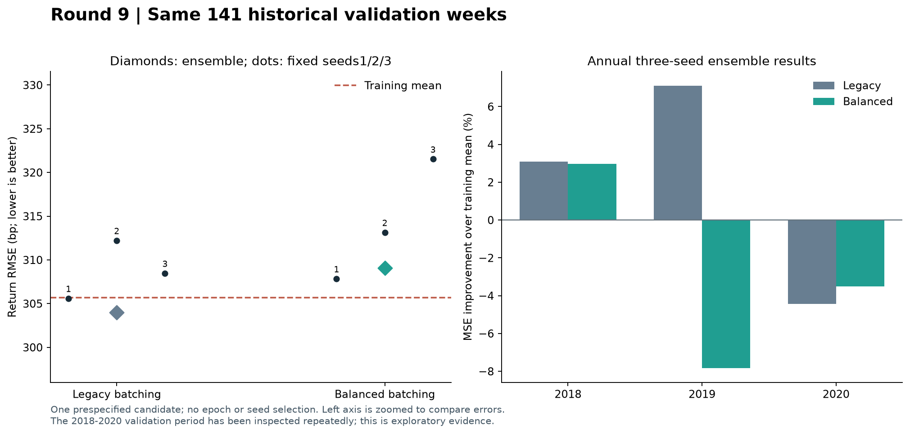
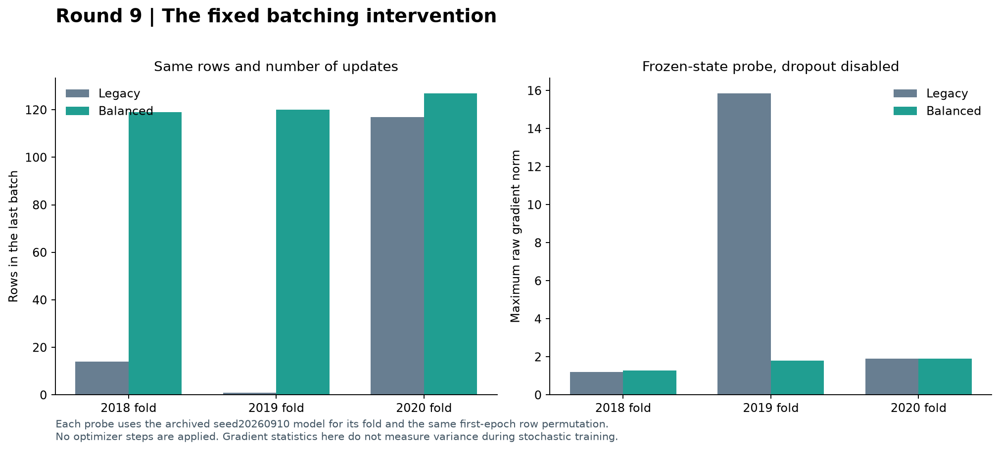

# 第九轮方法测试：固定预算下的批次分配对照

日期：2026-09-11。正式完成9次新训练，复用9个冻结原模型；18个检查点均已重放核验。数据、模型、标签、种子、训练轮数和每轮更新次数均保持一致。

**结论：这项批次调整按预期消除了名义损失权重不均，但没有改善收益预测。** 三种子集成准确率从59.57%降至56.03%（84／141周降至79／141周），收益RMSE从303.99bp升至309.10bp；MSE比原模型增加3.39%，比训练均值增加2.23%。三个新种子的MSE均未超过训练均值，也均未超过各自配对的原模型。

原单样本末批所在的2019验证组，固定状态梯度探测中的尖峰确实减小；该年度预测MSE却从比训练均值低7.10%，变为高7.84%。2020年相对原模型略有改善，仍未超过训练均值。这说明当前证据不支持把末批大小视为预测不稳定的主要解释。

两项MSE比较的Holm校正p值均为0.5541，未发现统计显著差异。上述“更差”是本轮历史样本的点估计，不能推出均衡批次在所有场景必然较差，也不能说明保留单样本末批更优。原模型仍有此前暴露的种子及年度稳定性问题。

**建议下一步把重点转到收益目标与损失函数的稳健性。** 可以保留全量数据、原模型和原采样，预先固定一个稳健损失方案，与原MSE目标作小规模对照，检查极端收益标签的影响；暂不同时搜索阈值、模型宽度和训练轮数。该假设尚未验证。当前141周已反复使用，继续实验只能提供诊断线索；方法能否成立，仍需补齐论文的数据与算法定义，并在冻结配置后取得独立验证证据。

## 1. 完整验证结果

全部141个验证星期五来自2018–2020年，年度数量49／46／46；这些日期已被此前多轮研究使用，本轮仍是探索性证据。各方案结果为同一三个固定种子预测的算术平均，没有选择最佳种子或新训练轮数。收益RMSE以bp表示，1bp=0.0001，是预测误差；MSE改善定义为 `1−新MSE/对照MSE`，正数较好。

| 方案 | 方向准确率 | 收益RMSE（bp） | MSE改善／训练均值 | 胜过训练均值的种子 |
| --- | --- | --- | --- | --- |
| 原批次处理 | 59.57% | 303.99 | +1.12% | 1/3 |
| 均衡分批＋样本数归一化 | 56.03% | 309.10 | -2.23% | 0/3 |

共同训练均值的RMSE为305.71bp，零收益参考为305.60bp。新集成相对原集成的MSE改善为-3.39%。方向准确率仅作诊断，主比较始终是MSE。

| 验证年 | 原准确率 | 新准确率 | 原MSE改善／均值 | 新MSE改善／均值 | 新MSE改善／原模型 |
| --- | --- | --- | --- | --- | --- |
| 2018 | 65.31% | 63.27% | +3.10% | +2.98% | -0.12% |
| 2019 | 56.52% | 50.00% | +7.10% | -7.84% | -16.09% |
| 2020 | 56.52% | 54.35% | -4.44% | -3.52% | +0.89% |

| 种子 | 原MSE改善／均值 | 新MSE改善／均值 | 新MSE改善／配对原模型 |
| --- | --- | --- | --- |
| 20260910 | +0.07% | -1.41% | -1.48% |
| 20260911 | -4.31% | -4.93% | -0.59% |
| 20260912 | -1.82% | -10.62% | -8.65% |

## 2. 唯一候选的精确定义

固定 combined20 模型：38,551参数，d_model16／d_ff32，dropout0.3，AdamW学习率0.001、权重衰减0.1、梯度裁剪1，训练20轮。仍使用125根原始OHLCV窗口及标准化收益MSE＋0.1×未来五根OHLCV辅助MSE。训练标签的联合完成日必须不晚于年度截止日；标签均值和总体标准差使用全体成熟训练样本，完全沿用原实现。

设当年训练样本数为N，更新次数 `M=ceil(N/128)`。原实现连续切出128样本批次，最后不足128也按批内均值计算一次更新。新实现把**同一个随机排列**均匀分成M个连续批次，最大和最小批次只差1条；批内均值损失乘以 `本批样本数×M/N`。

对同一组逐样本损失值，M个新批次损失的算术平均恰好等于这N条损失的整体平均。全目标梯度等式在后文的固定参数、关闭dropout探测中核验。每条样本每轮出现一次、20轮共20次，名义损失系数一致。该操作同时改变批次边界和损失归一化，二者没有进一步单独消融。

| 验证年 | N／更新次数 | 原末批大小 | 新批次大小范围 | 新损失缩放范围 |
| --- | --- | --- | --- | --- |
| 2018 | 1678／14 | 14 | 119–120 | 0.992849–1.001192 |
| 2019 | 1921／16 | 1 | 120–121 | 0.999479–1.007808 |
| 2020 | 2165／17 | 117 | 127–128 | 0.997229–1.005081 |

改变批次形状也会改变dropout随机数的消耗方式。因此同一seed和样本顺序并不意味着新旧随机噪声完全相同；AdamW、梯度裁剪和随训练变化的参数也会改变实际样本影响。这里证明的是损失定义和预算一致，不能把名义系数相同理解成参数影响相同。原末批方法在随机排列的期望上也不因此必然有偏；本轮考察的是固定排列及有限轮数下的权重和梯度波动。

## 3. 机制检查

训练前，逐年度取冻结原模型seed20260910的20轮检查点，保持参数不变、关闭dropout，按相同的第一轮样本排列比较两种批次的原始梯度。每个年度只使用这一预定状态，无优化器更新。这是固定状态下的机制探测，不能替代真实带dropout训练过程的方差测量。

| 验证年 | 原最大梯度范数 | 新最大梯度范数 | 批间梯度向量方差变化 |
| --- | --- | --- | --- |
| 2018 | 1.1988 | 1.2760 | -6.80% |
| 2019 | 15.8628 | 1.7918 | -91.43% |
| 2020 | 1.9079 | 1.9176 | -3.22% |

原单样本末批所在年度组出现较强梯度尖峰，调整后明显减小。三个固定状态中，新批次平均梯度与全样本目标梯度的相对误差最大为1.51e-07。另外两个年度的最大梯度范数没有同步下降，表明这个局部探测不能支持“所有更新都更小”之类的结论。

20轮的样本名义损失权重也已逐条计算：新方法相对均匀目标的比值均为1（浮点误差范围内）；原单样本末批组最大比值约6.89。该诊断不等于测量梯度裁剪和AdamW后的实际参数影响。

## 4. 预设的两项统计比较

逐周配对比较新集成与原集成、新集成与训练均值。循环块自举长度8个观测、10,000次、固定种子20260910，使用中心化双侧p值，并对两项MSE比较做Holm校正。差值为新方法减对照，负数表示误差更低。百分位区间与中心化检验并非严格互逆，显著性遵循预设校正p值。

| 对照 | MSE差值 | RMSE差（bp） | RMSE差95%区间（bp） | 原始p | Holm p |
| --- | --- | --- | --- | --- | --- |
| 原模型 | +0.00003131 | +5.11 | [-3.85, +14.77] | 0.2771 | 0.5541 |
| 训练均值 | +0.00002083 | +3.39 | [-3.93, +11.39] | 0.3818 | 0.5541 |

本轮校正后显著改善的比较数量：0／2。历史数据反复使用的局限仍然存在，不能凭本轮p值声称获得新的独立确认。

| 预设描述性条件 | 结果 |
| --- | --- |
| 集成MSE低于原模型 | 未通过 |
| 集成MSE低于训练均值 | 未通过 |
| 至少2／3个种子优于训练均值 | 未通过 |
| 至少2／3个配对种子优于原模型 | 未通过 |
| 至少2／3个年度优于原模型 | 未通过 |

全部五项同时满足才通过描述性筛选，本轮结果为**未通过**。实际优于训练均值的种子为0／3，优于配对原模型的种子为0／3，优于原模型的年度为1／3。描述性筛选与统计显著性分开报告。

## 5. 训练与输入响应诊断

同一标签标准化尺度下的最终训练MSE，以下均为9次拟合的平均值：

| 方案 | 标准化收益MSE | 标准化辅助MSE |
| --- | --- | --- |
| 原批次处理 | 0.8920 | 1.0204 |
| 均衡分批＋样本数归一化 | 0.9029 | 1.0201 |

将每个年度内的验证输入窗口整体循环错位一位，仍与原位置标签比较，得到以下推理诊断。这项操作未用于训练或选择；它只能帮助检查输入响应，不能当作独立预测检验。

| 方案 | 折内预测标准差（bp） | 输入窗口错位后的MSE变化 |
| --- | --- | --- |
| 原批次处理 | 61.03 | +4.22% |
| 均衡分批＋样本数归一化 | 64.24 | +2.89% |

新训练还记录了每轮裁剪前梯度范数与裁剪比例，保存在[balanced_training_curves.csv](balanced_training_curves.csv)。原训练没有保存动态梯度记录，因而本轮没有直接比较新旧实际训练期间的完整梯度噪声轨迹。

## 6. 复核、范围与文件

训练前3项检查全部通过：全量样本覆盖、顺序和更新次数、成熟约束与统一名义系数；不等批次的全目标损失及梯度等式；批次整除特例下新旧实现的模型张量和CPU／GPU随机状态逐项一致。

训练后重放全部18个检查点；预测最大差异为9.97e-17。重新计算180个每轮样本顺序哈希、180个批次边界哈希、标签尺度、各年及各种子指标、两项统计检验和五个筛选条件，结果均一致。此前1,989个文件，包括前八轮证据及已归档的第八轮设计预检，均保持原有哈希。

本轮没有补充新的市场日期或预训练表征。完整论文复现仍需补齐78指数数据、模式划分和训练细节；这里的结论适用于当前固定数据与模型对照。实验只涉及研究目录。

复核入口：[冻结协议](../protocol.json)、[验证记录](verification.json)、[逐种子预测](all_seed_predictions.csv)、[逐年指标](yearly_metrics.csv)、[统计检验](primary_comparisons.json)、[固定状态梯度](fixed_state_gradient_summary.csv)、[名义权重](nominal_exposure.csv)。图表均有同名SVG可导出。
