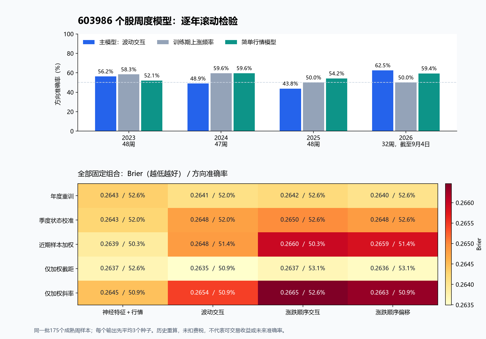

# 603986：首轮个股周度建模结果

已完成真正的个股训练：4个年度截点 × 3个随机种子，共12个网络，每个训练20轮。检验175个成熟周度样本，期间为2023年至2026年9月4日；行情冻结至2026年9月14日。

此前研究与每周预测程序以沪深300为目标；本次从零训练603986的参数，沿用网络结构、固定五年滚动训练、状态校准及交互方法。未使用沪深300的训练样本或已训练权重。

预先指定的主模型（年度重训＋波动交互）方向准确率为 **52.0%**，Brier为 **0.2641**。训练期上涨频率基线为54.9%／0.2481，简单行情模型为56.0%／0.2489。Brier越低越好。

## 怎样测试

- 每年只使用截至上一年末、标签已经完整兑现的最近五年有效样本；每天的输入窗口为125个交易日。实际年度训练样本为809、1023、1206、1206条。
- 每年从零初始化3个网络；不根据测试成绩更改训练轮数、种子、正则或窗口。20种固定组合全部报告，不自动选最优模型。
- 目标是信号日之后下一交易日开盘买入，持有至下一次相同星期几之后的交易日开盘，计算包含转增和现金分红的税前收益方向。节假日可使持有期超过一周；尚未训练独立四周目标。
- 预测正确率按周计数，3个种子先平均，不能算成3倍样本。这里是按历史时间切分的样本外检验，但使用了当前下载的历史数据，且股票由用户在看过市场后选定，不声称完全未见的盲测。

## 主模型与基线

| 方法 | 正确周数／总周数 | 方向准确率 | Brier |
|---|---:|---:|---:|
| 主模型：波动交互 | 91/175 | 52.0% | 0.2641 |
| 训练期上涨频率 | 96/175 | 54.9% | 0.2481 |
| 始终猜涨 | 79/175 | 45.1% | 不适用 |
| 四个简单行情特征 | 98/175 | 56.0% | 0.2489 |
| 网络原始收益方向 | 80/175 | 45.7% | 不适用 |
| 训练期平均收益方向 | 79/175 | 45.1% | 不适用 |

## 分年度表现

| 年度 | 周数 | 主模型准确率 | 上涨频率基线 | 简单行情模型 | 主模型Brier |
|---|---:|---:|---:|---:|---:|
| 2023 | 48 | 56.2% | 58.3% | 52.1% | 0.2529 |
| 2024 | 47 | 48.9% | 59.6% | 59.6% | 0.2657 |
| 2025 | 48 | 43.8% | 50.0% | 54.2% | 0.2851 |
| 2026（截至9月4日信号） | 32 | 62.5% | 50.0% | 59.4% | 0.2470 |

## 全部固定组合

此表是描述性比较；表中最高数值不等于获得独立验证的可用策略。状态取自个股自身的趋势和波动，本版尚未加入沪深300、行业指数或公告特征。“涨跌顺序”指价格符号序列，不是订单簿。

| 滚动／校准方式 | 特征方法 | 准确率 | Brier |
|---|---|---:|---:|
| 固定五年／年度重训 | 神经特征＋自身行情状态 | 52.6% | 0.2643 |
| 固定五年／年度重训 | 波动交互 | 52.0% | 0.2641 |
| 固定五年／年度重训 | 涨跌顺序交互 | 52.6% | 0.2642 |
| 固定五年／年度重训 | 涨跌顺序偏移修正 | 52.6% | 0.2640 |
| 加季度状态校准 | 神经特征＋自身行情状态 | 52.0% | 0.2643 |
| 加季度状态校准 | 波动交互 | 52.0% | 0.2648 |
| 加季度状态校准 | 涨跌顺序交互 | 52.6% | 0.2650 |
| 加季度状态校准 | 涨跌顺序偏移修正 | 52.6% | 0.2648 |
| 近期样本加权 | 神经特征＋自身行情状态 | 50.3% | 0.2639 |
| 近期样本加权 | 波动交互 | 51.4% | 0.2648 |
| 近期样本加权 | 涨跌顺序交互 | 50.3% | 0.2660 |
| 近期样本加权 | 涨跌顺序偏移修正 | 51.4% | 0.2659 |
| 仅更新加权截距 | 神经特征＋自身行情状态 | 52.6% | 0.2637 |
| 仅更新加权截距 | 波动交互 | 50.9% | 0.2635 |
| 仅更新加权截距 | 涨跌顺序交互 | 53.1% | 0.2637 |
| 仅更新加权截距 | 涨跌顺序偏移修正 | 53.1% | 0.2636 |
| 仅更新加权斜率 | 神经特征＋自身行情状态 | 50.9% | 0.2645 |
| 仅更新加权斜率 | 波动交互 | 50.9% | 0.2654 |
| 仅更新加权斜率 | 涨跌顺序交互 | 52.6% | 0.2665 |
| 仅更新加权斜率 | 涨跌顺序偏移修正 | 50.9% | 0.2663 |

季度状态校准只用该股此前的样本外周度信号：52周拟合，按标签成熟日期隔离后13周验证；状态样本不足时回退为零修正。共有15个季度截点，17个“季度×方法×状态”单元通过门槛；首个具备完整训练与验证周数的截点为2024-06-30。年初固定重置，不在样本不足时强行拟合。

## 差异是否稳定

预先指定主模型的Brier减去基线Brier；负值才表示主模型较好。按8周连续块进行10000次重采样，以下区间和检验仍受历史重用、样本量及制度变化限制。

| 参考模型 | Brier差值 | 95%块重采样区间 | 两项比较Holm校正p |
|---|---:|---|---:|
| 训练期上涨频率 | +0.0160 | [-0.0040, +0.0365] | 0.1920 |
| 四个简单行情特征 | +0.0152 | [-0.0027, +0.0328] | 0.1920 |

**结论：本轮没有建立主模型稳定优于简单基线的证据，不能据此将它作为已经验证的选股或买卖工具。**

## 最近一周的输出性质

2026-09-11收盘后的输入被用于今天才进行的历史重算，状态为`negative_high`。以下概率不是当日实际发布的预测，也不是今天盘中的即时预测；标签尚未成熟，不纳入准确率。

| 固定方案（波动交互） | 三种子平均上涨概率 |
|---|---:|
| 固定五年／年度重训 | 63.3% |
| 加季度状态校准 | 63.3% |
| 近期样本加权 | 57.8% |

## 个股特有的数据处理与检查

- 下载到2240条真实日线；按交易所交易日对齐后保留206个缺失个股交易日，凡输入或标签跨缺口都排除。缺失不被伪造为成交。
- 按除权除息日累计股份倍数和现金，逐日构建仅依赖当时已发生事件的价格序列；成交量换成初始股份单位，降低转增造成的机械跳变。当前前复权行情仅作下载核对，不进入训练。
- 九次权益事件与腾讯后复权价格的最大差为0.002080，在训练前冻结的累计舍入容差内。训练前曾调整过舍入容差，经过及原始失败记录保留在准备阶段文件中。标签另按实际持股数和现金逐项重算，最大差为2.22e-16。权益记录来源：[经济通分红记录](https://www.etnet.com.hk/www/sc/ashares/quote_dividend.php?code=603986)，并用[2017年度公司权益分派实施公告](https://pdf.dfcfw.com/pdf/H2_AN201805141143166795_1.pdf)核对转增和除权日期。
- 训练前做了未来数据扰动、截点标签、停牌窗口及网络更新检查；训练后重载全部12个模型，独立检查100个拟合头，并复核季度门槛。所有检查通过。
- 收益未扣费税，没有模拟涨跌停、成交量约束、滑点或实际成交；不据此给出可交易收益率。原始行情仍是当前下载的历史版本，不能证明供应商没有修订。

## 后续研究方向

先加入同时期可获得的行业与大盘信息，区分“跟随半导体／市场上涨”和个股自身强弱，并明确测试绝对收益还是相对行业收益；再为四周持有期单独构建标签，重新做按成熟日期隔离的滚动检验。两个变化应分开比较，先锁定检验方案，再查看新增结果。

## 文件

- `protocol.json`：训练前固定的个股实验定义。
- `results/annual/`：12个真实网络检查点、各年度成员表、缩放参数与概率头。
- `results/ensemble_predictions.csv`：全部逐周集成输出；`seed_predictions.csv`保留种子结果。
- `results/metrics.csv`、`comparisons.json`：完整指标和固定比较。
- `results/verification.json`：最终验证回执。
- 本目录是独立研究版；原有“打开每周预测.cmd”仍是沪深300程序，尚未接入个股自动更新。
