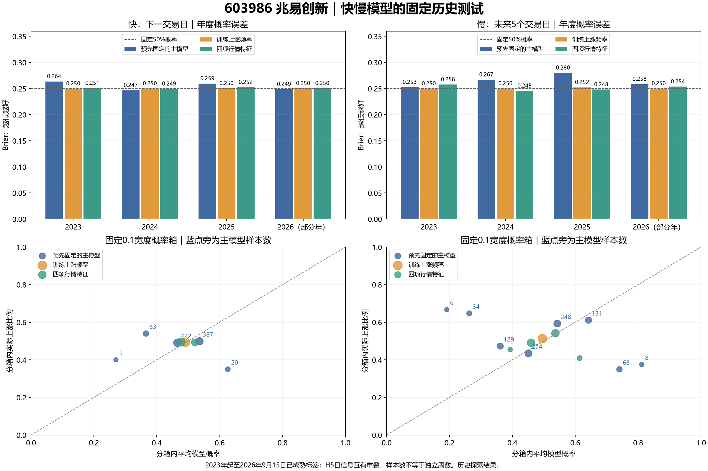

603986 兆易创新的快慢模型已完成本轮固定规则测试：84 次从头训练、168 个第 10／20 遍检查点。输入都是截至当日收盘的 125 根日线；快模型看下一交易日，慢模型看未来 5 个交易日，每个交易日分别生成概率。

主要结论：快模型尚未显示稳定方向优势；慢模型有一些方向识别线索，但原始概率明显失真。2026 年季度重训的改善值得保留，尚不足以把整套概率视为可靠投资依据。

这里的主模型在看成绩之前就固定为“5 年窗口、自然 20 遍、年度重训、波动交互、三种子平均概率”。下面没有按结果改选冠军。

**主结果和最新模型概率**

| 周期 | 成熟样本 | 方向准确率 | Brier | 对数损失 | 9月15日收盘后的上涨概率 |
|---|---|---|---|---|---|
| 快：次日 | 897 | 49.83% | 0.255063 | 0.703655 | 52.60% |
| 慢：5个交易日 | 893 | 54.76% | 0.265044 | 0.728382 | 70.73% |

数据截至 2026-09-15 收盘，原始收盘价为 363.11 元。快模型目标为 9 月 15 日收盘至 9 月 16 日收盘，慢模型目标为 9 月 15 日收盘至 9 月 22 日收盘。这两个最新目标均未成熟，尚未计分。日历依据[上交所 2026 年休市安排](https://www.sse.com.cn/disclosure/announcement/general/c/c_20251222_10802507.shtml)，价格与[腾讯行情](https://qt.gtimg.cn/q=sh603986)核对。

“上涨概率”是模型输出，不是这套模型的历史准确率，也不是收益保证。Brier 和对数损失越低越好；恒定 50% 概率的 Brier 为 0.25。涨跌标签使用含分红送转权益的收盘至收盘总收益 > 0，不假设收盘后仍能按已知收盘价成交。旧版的开盘至开盘周目标保持为另一项研究，不能把两版准确率之差归因于改成日频。

主模型的快／慢 Brier 为 0.255063／0.265044，均高于各自频率基准的 0.250047／0.250570。快模型 10 遍为 50.84%，20 遍降至 49.83%；改为 3 年窗口为 48.94%。慢模型 20 遍的方向好于 10 遍，说明训练轮数的作用随目标而变，不能把一个周期的经验直接套到另一个周期。

近期季度更新确有值得保留的线索：2026 年快模型由 94/170＝55.29% 提高到 105/170＝61.76%，慢模型由 101/166＝60.84% 提高到 111/166＝66.87%。快模型该年 Brier 却从 0.248621 升至 0.249919；慢模型从 0.258467 降至 0.251742，仍略高于频率基准 0.250076。这是固定的两个季度重训对照，未据此自动替换年度主模型。

慢模型季度 Platt 校准的全期 Brier 降至 0.254481、方向准确率为 56.33%，比原主模型改善；但仍未超过简单频率的概率误差。当前季度该校准未启用，所以今天的慢模型概率依然是原始输出。快模型标量概率头只有很小的 Brier 领先，属于 152 个固定方案中的探索性线索，不能据此认定稳定优势。

需要特别留意高概率失真：慢模型历史上 70%—80% 概率箱有 63 个日信号，平均预测 74.05%，实际上涨仅 22/63＝34.92%。这些标签相互重叠，并非 63 个独立周。它不等于“今天应改判为 34.92%”，但足以说明不能把今天约 70.7% 的模型值当作七成把握。

因此，后续研究应保留季度滚动更新的近期改善，同时优先验证慢模型的概率收缩／校准与极端概率失真；快模型需要先证明能提取超出简单参照的次日信号，而不是继续增加训练遍数。这些是待检验方向，本轮没有按已见成绩再追加调参。

**各项固定对照**

所有概率候选使用各自周期完全相同的成熟预测日期。下表列关键固定对照；全部候选、种子、年份和状态结果均保存在 results 中，未隐藏失败项。

快模型 H1：

| 方案 | 准确率 | 平衡准确率 | AUROC | Brier | 对数损失 |
|---|---|---|---|---|---|
| 主模型：5年／20遍／波动交互 | 49.83% | 49.78% | 0.4907 | 0.255063 | 0.703655 |
| 同轨迹第10遍 | 50.84% | 50.82% | 0.5086 | 0.252755 | 0.698803 |
| 整条模型改为3年窗口 | 48.94% | 48.82% | 0.4805 | 0.255719 | 0.704910 |
| 直接BCE原生概率 | 50.61% | 50.00% | 0.4949 | 0.250047 | 0.693242 |
| BCE表示＋波动交互头 | 49.50% | 49.45% | 0.4954 | 0.255219 | 0.704058 |
| MSE标量分数的概率头 | 50.50% | 50.20% | 0.5207 | 0.249822 | 0.692788 |
| BCE标量分数的概率头 | 50.39% | 50.21% | 0.5124 | 0.249672 | 0.692487 |
| 仅加性市场条件 | 50.95% | 50.95% | 0.5032 | 0.254323 | 0.702204 |
| 联合增加价格顺序交互 | 48.72% | 48.65% | 0.4892 | 0.255351 | 0.704179 |
| 固定波动父模型＋顺序项 | 48.83% | 48.76% | 0.4892 | 0.255321 | 0.704113 |
| 近期时间加权全部系数 | 48.72% | 48.65% | 0.4872 | 0.256133 | 0.706020 |
| 仅替换加权截距 | 50.06% | 49.96% | 0.4910 | 0.255067 | 0.703677 |
| 仅替换加权斜率 | 49.28% | 49.23% | 0.4865 | 0.256129 | 0.705993 |
| 2026年季度整网更新 | 51.06% | 51.03% | 0.4929 | 0.255309 | 0.704174 |
| 季度四状态验证修正 | 49.72% | 49.66% | 0.4900 | 0.255082 | 0.703692 |
| 月度四状态验证修正 | 49.61% | 49.56% | 0.4894 | 0.255166 | 0.703863 |
| 季度合并组验证修正 | 49.28% | 49.23% | 0.4870 | 0.255334 | 0.704197 |
| 季度四状态无验证门控 | 48.49% | 48.41% | 0.4811 | 0.255633 | 0.704798 |
| 季度OOS Platt校准 | 49.05% | 49.04% | 0.4920 | 0.253887 | 0.701275 |
| 同训练成员上涨频率 | 50.61% | 50.00% | 0.4874 | 0.250047 | 0.693241 |
| 仅四项行情特征 | 50.17% | 49.91% | 0.4968 | 0.250818 | 0.694788 |
| 固定50%概率 | 50.61% | 50.00% | 0.5000 | 0.250000 | 0.693147 |
| 始终判断上涨 | 49.39% | 50.00% | 0.5000 | 0.506132 | 13.984943 |
| 始终判断不涨 | 50.61% | 50.00% | 0.5000 | 0.493868 | 13.646090 |

慢模型 H5：

| 方案 | 准确率 | 平衡准确率 | AUROC | Brier | 对数损失 |
|---|---|---|---|---|---|
| 主模型：5年／20遍／波动交互 | 54.76% | 54.75% | 0.5233 | 0.265044 | 0.728382 |
| 同轨迹第10遍 | 49.50% | 49.43% | 0.4767 | 0.267293 | 0.730101 |
| 整条模型改为3年窗口 | 51.29% | 51.41% | 0.4961 | 0.268389 | 0.733179 |
| 直接BCE原生概率 | 46.58% | 47.19% | 0.4839 | 0.251063 | 0.695276 |
| BCE表示＋波动交互头 | 50.84% | 50.88% | 0.4725 | 0.269371 | 0.734704 |
| MSE标量分数的概率头 | 51.29% | 51.47% | 0.4944 | 0.261870 | 0.718135 |
| BCE标量分数的概率头 | 47.82% | 48.18% | 0.4876 | 0.258561 | 0.710749 |
| 仅加性市场条件 | 55.43% | 55.40% | 0.5245 | 0.264841 | 0.727727 |
| 联合增加价格顺序交互 | 53.98% | 53.97% | 0.5155 | 0.266509 | 0.731648 |
| 固定波动父模型＋顺序项 | 53.86% | 53.86% | 0.5155 | 0.266442 | 0.731461 |
| 近期时间加权全部系数 | 54.20% | 54.24% | 0.5255 | 0.263818 | 0.725307 |
| 仅替换加权截距 | 55.10% | 55.10% | 0.5241 | 0.264974 | 0.728379 |
| 仅替换加权斜率 | 53.64% | 53.66% | 0.5248 | 0.263769 | 0.725060 |
| 2026年季度整网更新 | 55.88% | 55.88% | 0.5327 | 0.263794 | 0.726027 |
| 季度四状态验证修正 | 53.42% | 53.36% | 0.5153 | 0.265694 | 0.729339 |
| 月度四状态验证修正 | 53.42% | 53.36% | 0.5130 | 0.266885 | 0.732155 |
| 季度合并组验证修正 | 53.98% | 53.94% | 0.5167 | 0.267330 | 0.734310 |
| 季度四状态无验证门控 | 54.20% | 54.18% | 0.5308 | 0.262530 | 0.722756 |
| 季度OOS Platt校准 | 56.33% | 56.08% | 0.5582 | 0.254481 | 0.704790 |
| 同训练成员上涨频率 | 48.71% | 50.00% | 0.4839 | 0.250570 | 0.694287 |
| 仅四项行情特征 | 52.30% | 52.26% | 0.5186 | 0.250993 | 0.695195 |
| 固定50%概率 | 48.71% | 50.00% | 0.5000 | 0.250000 | 0.693147 |
| 始终判断上涨 | 51.29% | 50.00% | 0.5000 | 0.487122 | 13.459691 |
| 始终判断不涨 | 48.71% | 50.00% | 0.5000 | 0.512878 | 14.171341 |

窗口对照固定的是自然遍数，实际样本数和优化步数随 3／5 年窗口变化。它检验固定遍数下的完整训练方案，不把差异全部归因于数据窗口本身，也不重复小样本来凑齐旧模型步数。季度整网更新仅在 2026 年 3 月和 6 月截止重训，2023—2025 年和 2026 年第一季度沿用年度模型。

**逐年表现**

先看同一期的参照，再判断“越近是否越低”。2026 年只覆盖截至 9 月 15 日已经成熟的标签。

| 周期 | 年份 | 方案 | 样本 | 准确率 | Brier |
|---|---|---|---|---|---|
| H1 | 2023 | 季度四状态验证修正 | 242 | 46.28% | 0.263620 |
| H1 | 2023 | 同训练成员上涨频率 | 242 | 52.48% | 0.249758 |
| H1 | 2023 | 仅四项行情特征 | 242 | 50.00% | 0.250811 |
| H1 | 2023 | 主模型：5年／20遍／波动交互 | 242 | 46.28% | 0.263620 |
| H1 | 2023 | 2026年季度整网更新 | 242 | 46.28% | 0.263620 |
| H1 | 2024 | 季度四状态验证修正 | 242 | 54.55% | 0.246538 |
| H1 | 2024 | 同训练成员上涨频率 | 242 | 50.83% | 0.249932 |
| H1 | 2024 | 仅四项行情特征 | 242 | 53.31% | 0.249448 |
| H1 | 2024 | 主模型：5年／20遍／波动交互 | 242 | 54.13% | 0.246623 |
| H1 | 2024 | 2026年季度整网更新 | 242 | 54.13% | 0.246623 |
| H1 | 2025 | 季度四状态验证修正 | 243 | 44.86% | 0.259441 |
| H1 | 2025 | 同训练成员上涨频率 | 243 | 48.97% | 0.250319 |
| H1 | 2025 | 仅四项行情特征 | 243 | 48.15% | 0.252459 |
| H1 | 2025 | 主模型：5年／20遍／波动交互 | 243 | 45.27% | 0.259452 |
| H1 | 2025 | 2026年季度整网更新 | 243 | 45.27% | 0.259452 |
| H1 | 2026 | 季度四状态验证修正 | 170 | 54.71% | 0.248860 |
| H1 | 2026 | 同训练成员上涨频率 | 170 | 50.00% | 0.250233 |
| H1 | 2026 | 仅四项行情特征 | 170 | 48.82% | 0.250432 |
| H1 | 2026 | 主模型：5年／20遍／波动交互 | 170 | 55.29% | 0.248621 |
| H1 | 2026 | 2026年季度整网更新 | 170 | 61.76% | 0.249919 |
| H5 | 2023 | 季度四状态验证修正 | 242 | 55.37% | 0.252603 |
| H5 | 2023 | 同训练成员上涨频率 | 242 | 54.13% | 0.249755 |
| H5 | 2023 | 仅四项行情特征 | 242 | 43.80% | 0.257732 |
| H5 | 2023 | 主模型：5年／20遍／波动交互 | 242 | 55.37% | 0.252603 |
| H5 | 2023 | 2026年季度整网更新 | 242 | 55.37% | 0.252603 |
| H5 | 2024 | 季度四状态验证修正 | 242 | 55.37% | 0.265839 |
| H5 | 2024 | 同训练成员上涨频率 | 242 | 50.41% | 0.249988 |
| H5 | 2024 | 仅四项行情特征 | 242 | 57.44% | 0.245486 |
| H5 | 2024 | 主模型：5年／20遍／波动交互 | 242 | 55.79% | 0.266943 |
| H5 | 2024 | 2026年季度整网更新 | 242 | 55.79% | 0.266943 |
| H5 | 2025 | 季度四状态验证修正 | 243 | 48.56% | 0.279131 |
| H5 | 2025 | 同训练成员上涨频率 | 243 | 42.80% | 0.252299 |
| H5 | 2025 | 仅四项行情特征 | 243 | 56.79% | 0.248006 |
| H5 | 2025 | 主模型：5年／20遍／波动交互 | 243 | 48.97% | 0.280035 |
| H5 | 2025 | 2026年季度整网更新 | 243 | 48.97% | 0.280035 |
| H5 | 2026 | 季度四状态验证修正 | 166 | 54.82% | 0.264898 |
| H5 | 2026 | 同训练成员上涨频率 | 166 | 46.99% | 0.250076 |
| H5 | 2026 | 仅四项行情特征 | 166 | 50.60% | 0.253572 |
| H5 | 2026 | 主模型：5年／20遍／波动交互 | 166 | 60.84% | 0.258467 |
| H5 | 2026 | 2026年季度整网更新 | 166 | 66.87% | 0.251742 |

**重叠标签、验证和统计证据**

| 周期 | 成熟日信号 | 最大不重叠标签数 | 覆盖的日收益边 | 平均复用倍数 | 最后成熟信号日 |
|---|---|---|---|---|---|
| H1 | 897 | 897 | 897 | 1.000 | 2026-09-14 |
| H5 | 893 | 179 | 897 | 4.978 | 2026-09-08 |

“最大不重叠标签数”是区间组合计数，不是有效独立样本量。H5 不能因为每天出一个信号就声称独立周样本增加了五倍。主要比较使用同日期配对的 20 日移动块重采样，40 日块作为敏感性检查；两周期各对频率和简单行情基准，共四项主要 Brier 比较作 Holm 校正。区间仍受时间依赖、非平稳及反复研究历史的限制，不是新前瞻证据。

| 周期 | 参照 | 块长 | 主模型Brier减参照 | 95%块重采样区间 | Holm p |
|---|---|---|---|---|---|
| H1 | 同训练成员上涨频率 | 20 | +0.005016 | [+0.001203, +0.009132] | 0.0528 |
| H1 | 同训练成员上涨频率 | 40 | +0.005016 | [+0.000988, +0.009565] | 0.0900 |
| H1 | 仅四项行情特征 | 20 | +0.004245 | [+0.000743, +0.008137] | 0.0759 |
| H1 | 仅四项行情特征 | 40 | +0.004245 | [+0.000556, +0.008517] | 0.1071 |
| H5 | 同训练成员上涨频率 | 20 | +0.014474 | [-0.000852, +0.031429] | 0.1164 |
| H5 | 同训练成员上涨频率 | 40 | +0.014474 | [-0.002283, +0.032184] | 0.1614 |
| H5 | 仅四项行情特征 | 20 | +0.014050 | [-0.000115, +0.029073] | 0.1164 |
| H5 | 仅四项行情特征 | 40 | +0.014050 | [-0.001340, +0.030225] | 0.1614 |

校准使用最近 252 个成熟日信号训练、63 个成熟日信号验证；训练标签终点必须严格早于验证首个信号日。每状态至少有 10／5 个最大不重叠训练／验证标签，且验证 Brier 更低、方向正确数不减少才启用，之后不再重拟合。年度切换后的第一季度回到年度模型。校准的正则强度沿用固定数值 20，但日样本损失总和与旧周样本的相对正则强度并不相同，不能称为旧策略的逐元素复制。

| 周期 | 修正 | 启用日期 | 概率实际改变日期 | 方向实际改变日期 |
|---|---|---|---|---|
| H1 | 季度四状态验证修正 | 69 | 69 | 3 |
| H1 | 月度四状态验证修正 | 133 | 133 | 4 |
| H1 | 季度合并组验证修正 | 115 | 115 | 9 |
| H1 | 季度四状态无验证门控 | 425 | 425 | 50 |
| H1 | 季度OOS Platt校准 | 180 | 180 | 65 |
| H5 | 季度四状态验证修正 | 111 | 111 | 20 |
| H5 | 月度四状态验证修正 | 66 | 66 | 18 |
| H5 | 季度合并组验证修正 | 111 | 111 | 9 |
| H5 | 季度四状态无验证门控 | 359 | 359 | 67 |
| H5 | 季度OOS Platt校准 | 187 | 187 | 100 |

每次门控的训练／验证日期、最大不重叠数、删除区段敏感性及相邻窗口复用均存档。多个候选共享同一天的正确判断，不构成多个独立成功事件；通过了验证却后来没有遇到该状态，也不算实际覆盖。

**以前的问题这次如何处理**

详见[历史问题逐项核对](历史问题核对.md)。特别保留原来波动与价格顺序交互的局部改善，同时重测窗口、轮数、分类目标、近期加权、季度整网更新和校准频率。HMM、DTW、路径效率、Huber、旧状态保留等本轮没有完整重跑，已逐项注明。

个股 v1 的近期改善同样保留：[原周目标结果](../stock_model_603986_v1/建模结果.md)中，2026 年主模型为 20/32＝62.5%，全期为 91/175＝52.0%。本次换了收盘至收盘目标、增加每天的预测日期，又加入截至 9 月 15 日的数据，因此不能拿这个 62.5% 和新日频成绩直接计算“提升／下降幅度”。

**验证与使用边界**

[模型独立复核](results/models_verified.json)：168 个检查点与 1344 个概率头数值检查；[输出与因果校准复核](results/outputs_verified.json)通过。每个训练截止日前缀、预测前缀、目标成熟度和原始收益标签均核对，旧研究证据哈希保持。

通过数值和因果检查仅说明实现按规则运行，不等于预测有效。趋势、波动、振幅和量能特征均来自 603986 自身；尚未加入大盘、半导体板块、新闻或财报因子。

原始行情是供应商当前历史版本；前向分红送转构造具有因果性，但缺少当年逐日发布的行情修订档案。206 个缺失股票交易日保留为缺失，涉及它们的输入或目标窗口排除；不伪造停牌价格或原因。2023 年开始评价，是为了统一足够的训练历史；单只用户指定股票不能代表整个股票池。

这是一轮可复算的研究测试，历史逐日概率不是当年真实发出的预测。本轮最新输出也没有追记进旧前瞻账本。目录中的数据与参数冻结至 9 月 15 日，没有把新的自动每日下载／运行入口接到原每周指数程序。

[运行说明](README.md) · [全部方案指标](results/metrics.csv) · [各年指标](results/year_metrics.csv) · [最新全部概率](results/latest_probabilities.json) · [冻结方案](protocol.json)
