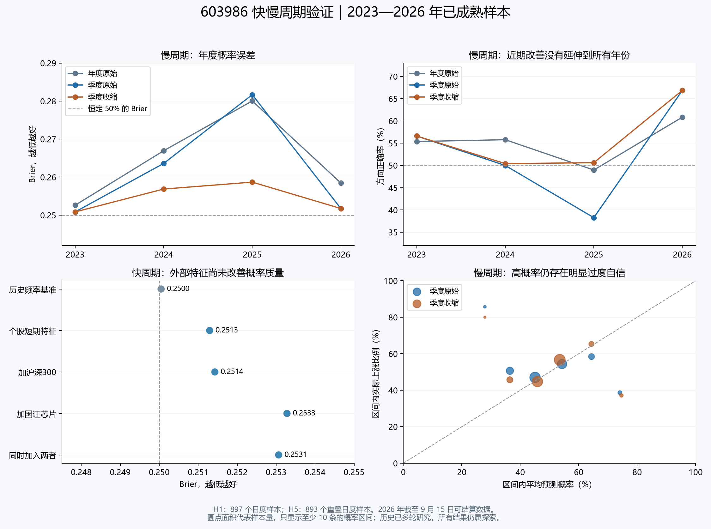

# 603986：快慢周期第三轮测试与每日程序

本轮完成了 2023—2025 年缺少的 9 个季度截点、27 个完整网络训练，验证季度滚动、现有校准和受约束概率收缩；快周期另完成 16 个简单模型拟合。历史数据终点为 2026-09-15。

**结论：2026 年的季度更新改善保留，但不能推广到所有年份；收缩减轻了部分过度自信，尚未优于简单概率基准。快模型加入大盘和芯片板块信息后，也没有形成稳定优势。** 本轮没有按历史成绩更换预先固定的每日候选模型。

## 慢周期：未来 5 个交易日

比较使用相同的 893 个已成熟日度信号，目标为第 5 个交易日收盘相对信号日收盘的持股总收益（含现金分红和送转）。预测概率 >50% 才判为上涨，收益 >0 才算实际上涨。5 日标签重叠，最多可取 179 个互不重叠区间；179 也不等于统计上的有效独立样本数。Brier 和对数损失越低越好。

|方法|方向正确率|Brier|对数损失|
|---|---|---|---|
|年度更新原始|54.76%|0.265044|0.728382|
|季度更新原始|51.74%|0.262863|0.721916|
|季度更新＋现有校准|54.87%|0.253888|0.703220|
|季度更新＋受约束收缩（事先主候选）|55.21%|0.254777|0.705023|
|同期训练上涨频率|45.35%|0.251152|0.695452|
|校准训练窗口上涨频率|50.06%|0.249820|0.692797|
|同期 4 项市场特征模型|50.17%|0.253701|0.700749|
|恒定 50%|48.71%|0.250000|0.693147|

季度原始概率较年度原始概率的 Brier 降低 0.002180，但方向正确率从 54.76% 降至 51.74%。季度收缩相对季度原始降低 Brier 0.008087，正确率提高至 55.21%；其 Brier 仍高于同期训练频率 0.251152、校准窗口频率 0.249820 和恒定 50% 的 0.250000。

|年份|样本数|年度原始正确率|季度原始正确率|季度收缩正确率|季度原始 Brier|季度收缩 Brier|
|---|---|---|---|---|---|---|
|2023|242|55.37%|56.61%|56.61%|0.250845|0.250845|
|2024|242|55.79%|50.00%|50.41%|0.263603|0.256869|
|2025|243|48.97%|38.27%|50.62%|0.281693|0.258682|
|2026|166|60.84%|66.87%|66.87%|0.251742|0.251742|

2026 年季度原始的 111/166（66.87%）优于年度原始的 101/166（60.84%），与上一轮保持一致。但 2025 年季度原始只有 93/243（38.27%），低于年度原始的 119/243（48.97%）。因此“近期更适合更新”可以继续检验，尚不能改写成“所有时期都应增加更新频率”。

四个事先指定的 Brier 比较采用 20/40 个交易日区块、各 10,000 次重抽样。季度收缩减去季度原始的 95% 区间分别为 [-0.016245, -0.001496] / [-0.016967, -0.001485]；四重 Holm 校正后 p=0.1284 / 0.1560，未达到 0.05。其余三个比较校正后 p=1。历史已被多轮查看，这些区间与 p 值只是探索性诊断，不构成独立确认。完整比较在 [slow_bootstrap.csv](results/slow_bootstrap.csv)。

## 收缩是否解决了旧问题

收缩使用 `p新 = q + α × (p原 − q)`，其中 q 是过去校准训练窗口的上涨频率，α 限制在 [0,1]。只用已到期的过去预测训练与验证，不能反转概率排序。每种更新频率使用自己的真实历史样本外概率库。训练 252 条、验证 63 条，训练标签结束日期严格早于第一个验证信号；验证 Brier 改善且正确数量不下降才启用，不在验证后重新拟合。Q1 仍按上一轮规则重置。

季度 vol 收缩共启用 4 个季度：2024 Q3 的 α=0.681891；2024 Q4、2025 Q3、2025 Q4 的 α=0。后三次实际退回历史频率，不能把改善全部归功于神经网络。现有 Platt 在启用的三个季度出现负斜率，属于信号反向，因此保留为对照，不视为已验证的稳定概率解释。

目前 2026 Q3 的样本数量充足（252/63，最多互不重叠 51/13），两种校准均因质量门槛未通过而保持原始概率。季度模型自己的概率库得到：Platt 验证 Brier 变差 0.031833、正确数少 5；收缩候选 α=0、q=0.567460，验证 Brier 变差 0.006807、正确数多 1。这里与上一轮年度概率库的拟合数值不同，原因是输入的历史概率库不同。

高概率问题仍存在：季度原始 ≥70% 的 46 条已成熟历史预测，平均输出 74.36%，实际上涨 17/46（36.96%），最多 15 个互不重叠区间。这个分组不能用于把今天的概率直接改成 36.96%，但足以说明目前的 73% 输出不应理解为七成多的可靠胜率。

三种随机种子的季度原始整体正确率为 49.61%、50.62%、52.52%，Brier 为 0.268145、0.270424、0.268980；按事先规则始终取三个概率的平均，没有挑选种子。加法、波动交互、顺序联合交互和固定父模型顺序交互的全部结果均保留，总计 24 条神经概率政策和 8 条基准（包含重复的恒定基准）。

按事先固定、仅用当时及过去价格计算的“趋势正负 × 波动高低”分组，季度原始在正趋势／高波动的 330 条中 Brier=0.242907，在负趋势／高波动的 113 条中为 0.307576；收缩后分别为 0.238450 / 0.303562。这为后续状态识别提供方向，但这些是看过结果后的描述，尚未将分组改成交易开关或声称分组优势已通过检验。

## 快周期：下一交易日

四组简单 ridge logistic 模型均使用同一年度滚动 5 年训练窗口和相同样本。个股短期 OHLCV 特征 8 项；每个外部指数增加 4 项，包括指数当日收益、60 日趋势、20 日波动及 60 日 β 调整的相对强弱。只使用信号日收盘及以前的数据。897 个已成熟测试信号，四组训练样本完全一致。

|特征|方向正确率|Brier|
|---|---|---|
|训练上涨频率|50.61%|0.250047|
|仅个股短期特征|50.95%|0.251293|
|增加沪深300|51.28%|0.251426|
|增加国证芯片|51.06%|0.253278|
|同时增加二者|50.84%|0.253064|

外部特征未改善整体概率质量；例如“大盘＋芯片”在 2024 年正确率 54.13%，2025 年 46.50%，不支持直接升级为默认预测模型。

板块数据采用官方 [国证半导体芯片指数 980017 编制方案](https://www.cnindex.com.cn/docs/gz_980017.pdf)核对身份，并从国证指数官方公开行情接口取得 2016-01-04—2026-09-15 共 2,601 条历史收盘数据。较早年份没有完整 OHLC/成交量，实验只用完整的收盘列；没有用当前成分股回填历史，也没有把供应商不支持的代码或空历史当成板块数据。当前下载的历史序列无法证明发布当时从未被修订，所以仍是当前数据版本上的历史研究。

## 每日程序已投入前瞻记录

第一笔真实预测于北京时间 **2026-09-15 22:43:55** 保存，信号日收盘价 363.11 元。现在只有 1 个真实信号日、0 个已成熟标签；历史回测没有导入前瞻正确率。

|预测|输出|目标收盘日|
|---|---|---|
|快 · 次日／年度更新|52.60%|2026-09-16|
|快 · 训练上涨频率基准|48.47%|2026-09-16|
|快 · 次日／季度更新|55.75%|2026-09-16|
|慢 · 5 个交易日／年度更新|70.73%|2026-09-22|
|慢 · 5 个交易日／季度原始|73.19%|2026-09-22|
|慢 · 训练上涨频率基准|50.54%|2026-09-22|
|慢 · 5 个交易日／现有校准|73.19%|2026-09-22|
|慢 · 5 个交易日／受约束收缩|73.19%|2026-09-22|

双击项目根目录的 [打开个股每日预测.cmd](../打开个股每日预测.cmd)，每个交易日北京时间 **18:00 后**运行。会自动下载日线和收盘快照、检查历史修订及复权、结算到期记录、保存今天的新预测，并打开 [结果页](../stock_daily_603986/latest.html)。如只在周五运行，则只记录周五的预测，不会自动补写其余日期。

每日推理使用已经验证的参数，不是每天重新训练。当前季度参数包有效至 **2026-09-30**，之后仍能结算已有预测，新增预测需经过下一季度训练验证。目标日按上交所交易日历计算，例如 9 月 24 日的次日目标为 9 月 28 日，5 日目标为 10 月 9 日；休市安排见 [上交所 2026 年通知](https://www.sse.com.cn/disclosure/announcement/general/c/c_20251222_10802507.shtml)。

程序只记录 603986 的研究预测，无订单或账户接口。H1/H5 都是收盘到收盘标签，不是次日开盘买入的可成交收益，尚未包含交易成本。缺失或停牌窗口不压缩交易日；到期路径缺失会标为无法评分。断网、数据不完整、收盘快照冲突、未知分红送转或历史行情修订均停止新增记录并给出诊断。

事件和数据快照独立保存于 `stock_daily_603986`。本次真实重复运行仅增加数据快照，没有重复或覆盖预测。日志使用哈希链和本机真实时间，支持内部一致性检查，但没有外部时间戳公证；请保留整个目录。程序显示的前瞻统计仅作描述，不用少量数据自动宣布模型有效。

## 验证与保留记录

- 54 个新增检查点、216 个本轮使用的概率头重算通过；预测最大差 6.14e-06（GPU 单批推理浮点差异），优化梯度最大 9.96e-10。9 个新增市场基准模型另做系数与预测复核。
- 240 次校准的未来标签剔除／截断复核通过；旧年度主模型和旧校准概率在 2e-15 容差内完整重现。
- 快模型 16 次训练前缀与优化梯度检查通过；实时下载重新构造的数据框与冻结数据逐值完全一致，6 条每日模型输出重算与研究缓存最大差 3.33e-7。
- 每日前瞻通过 16 项离线场景检查，另验证了未知权益、行情不完整两项拒绝，以及实际下载、首次记录、真实重复运行。
- 比较图已打开核对。当前会话没有可用浏览器，因此每日 HTML 页面未做浏览器截图验证；页面中的概率、日期、待到期状态和真实记录数量已与事件记录核对。
- 原有 7161 个文件逐一核对哈希，指数程序、旧前瞻账本及个股 v1/v2 未修改。本轮训练／评分与前瞻记录分目录保存。
- 慢周期评分前修正了初版评分代码漏掉的两项已声明基准细节：恒定 50%，以及校准频率在历史不足时退回模型训练频率。旧代码与原冻结清单均保留，修订发生在慢周期评分前，未改训练、主候选、校准或比较规则。见 [评分前修订记录](results/evaluation_freeze_amendment.json)。

后续最值得检验的是：在独立的前瞻数据中，状态识别能否提前判断“什么时候该减少模型权重”。当前继续并列记录年度、季度和校准输出，保留 2026 年的改善线索；不把回测中发现的分组直接升级成实时策略。

原始结果：[慢周期全部指标](results/slow_metrics.csv) · [分年](results/slow_years.csv) · [分状态](results/slow_states.csv) · [种子](results/slow_seed_metrics.csv) · [校准记录](results/calibration_records.json) · [快周期](results/fast_metrics.csv) · [前瞻审计](results/final_audit.json)。
